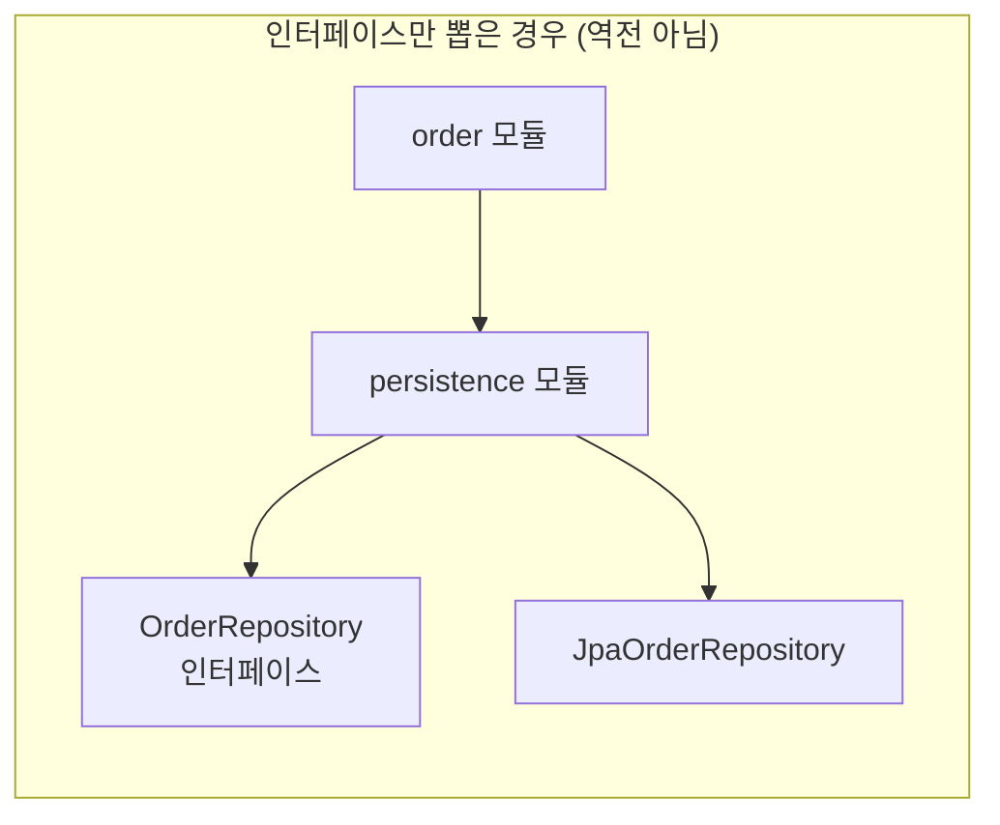
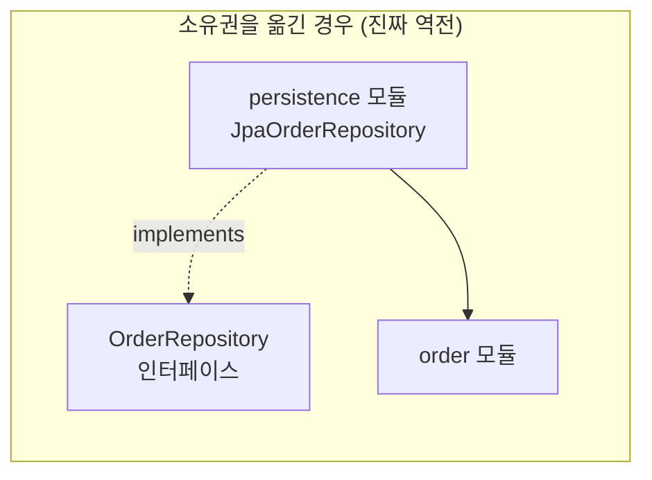
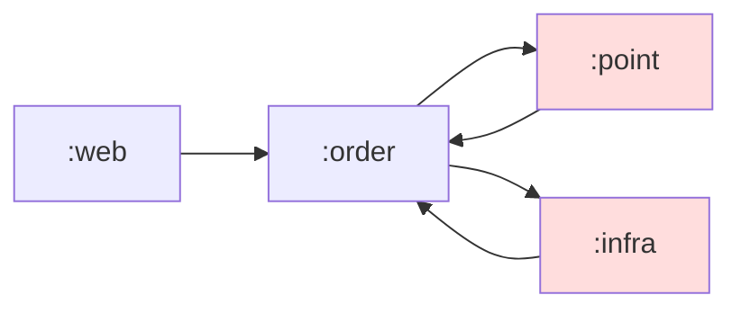
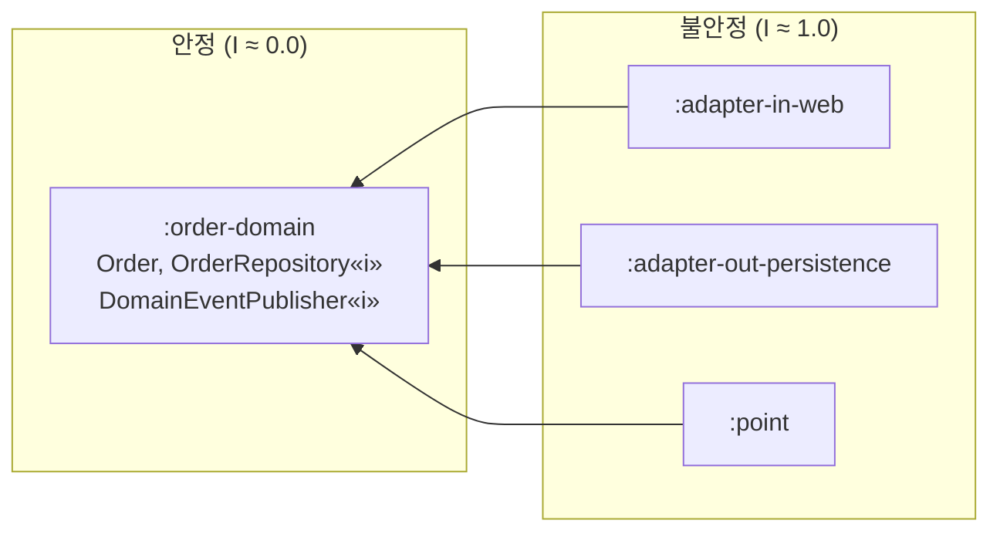

# 의존성 규칙의 원리: 의존성 역전과 안정 의존 원칙

모듈을 나누는 것보다 어려운 것은 모듈 사이의 화살표 방향을 정하는 일입니다. 이 문서는 의존성의 정체, 방향을 뒤집는 원리(DIP), 그리고 어떤 모듈이 어떤 모듈에 의존해야 하는지 판단하는 기준(SDP/SAP)을 다룹니다.

## 목차
- [1. 핵심 개념 (What)](#1-핵심-개념-what)
- [2. 왜 알아야 하는가 (Why)](#2-왜-알아야-하는가-why)
- [3. 내부 구현 분석 (How)](#3-내부-구현-분석-how)
- [4. 실전 예제](#4-실전-예제)
- [5. 정리](#5-정리)

---

## 1. 핵심 개념 (What)

### 1.1 의존성이란 무엇인가

A가 B에 의존한다는 것은 **B가 변하면 A를 다시 컴파일하거나 다시 검증해야 한다**는 뜻입니다. 화살표는 "호출한다"가 아니라 "변경의 파급이 전달되는 방향"입니다.

의존성은 발생 시점에 따라 성격이 완전히 다릅니다.

| 구분 | 컴파일 의존성(compile-time) | 런타임 의존성(runtime) |
|---|---|---|
| 발생 시점 | 소스 코드에 타입 이름이 등장 | 실행 중 실제 객체가 연결 |
| 확인 방법 | `import` 문, Gradle `implementation` | DI 컨테이너, 팩토리, 리플렉션 |
| 깨는 방법 | 인터페이스로 치환 | 깰 수 없음(실제로 동작해야 하므로) |
| 아키텍처 영향 | **모듈 경계를 결정** | 배포 구성에 영향 |

핵심은 이것입니다. **아키텍처가 통제하는 것은 컴파일 의존성뿐이고, 런타임 의존성은 어차피 남는다.** 주문 서비스는 결국 PostgreSQL에 쓰기를 해야 합니다. 우리가 바꿀 수 있는 것은 "주문 코드가 JDBC 타입을 `import` 하는가"뿐입니다.

```kotlin
// 컴파일 의존성 O, 런타임 의존성 O
class OrderService(private val repo: JpaOrderRepository) { ... }

// 컴파일 의존성 X(인터페이스만 앎), 런타임 의존성 O
class OrderService(private val repo: OrderRepository) { ... }
```

두 코드는 실행 결과가 같지만, 두 번째는 `JpaOrderRepository`가 사라져도 컴파일됩니다. 그것이 아키텍처적 차이의 전부입니다.

### 1.2 의존성 역전 원칙(Dependency Inversion Principle, DIP)

로버트 마틴의 원문은 두 문장입니다.

> 1. 상위 수준 모듈은 하위 수준 모듈에 의존해서는 안 된다. 둘 다 추상에 의존해야 한다.
> 2. 추상은 세부 사항에 의존해서는 안 된다. 세부 사항이 추상에 의존해야 한다.

실무에서 이 원칙이 오해받는 지점이 있습니다. **"인터페이스를 만들어라"가 아니라 "인터페이스를 누가 소유하는가"가 핵심입니다.**



`persistence` 모듈이 인터페이스를 들고 있으면, `order`는 여전히 `persistence`에 컴파일 의존합니다. 인터페이스를 하나 만들었을 뿐 화살표 방향은 그대로입니다.



인터페이스를 **호출하는 쪽(order) 모듈로 옮기면** 화살표가 뒤집힙니다. `persistence`가 `order`를 의존하게 되고, `order`는 아무것도 의존하지 않습니다. 이것이 "역전(inversion)"이라는 단어의 의미입니다.

> **인터페이스는 구현하는 쪽이 아니라 사용하는 쪽에 속한다.** DIP를 한 문장으로 줄이면 이것입니다.

### 1.3 안정 의존 원칙(Stable Dependencies Principle, SDP)

> 의존성은 더 안정된 쪽을 향해야 한다.

여기서 "안정(stable)"은 품질이 좋다는 뜻이 아니라 **변경하기 어렵다**는 뜻입니다. 나에게 의존하는 모듈이 많을수록, 나를 바꾸면 파급이 크므로 나는 안정적입니다.

마틴은 이를 불안정도(Instability)로 수치화합니다. `Ca`는 나에게 의존하는 외부 클래스 수(들어오는 화살표), `Ce`는 내가 의존하는 외부 클래스 수(나가는 화살표)이고, `I = Ce / (Ca + Ce)`로 0.0(최대 안정)에서 1.0(최대 불안정) 사이 값을 갖습니다.

| 모듈 | Ca | Ce | I | 해석 |
|---|---|---|---|---|
| `domain` | 30 | 0 | 0.0 | 모두가 의존, 아무도 의존 안 함 → 최대 안정 |
| `application` | 8 | 5 | 0.38 | 중간 |
| `adapter-in-web` | 0 | 12 | 1.0 | 아무도 의존 안 함 → 최대 불안정, 마음껏 바꿔도 됨 |

SDP는 "I 값이 큰 모듈이 I 값이 작은 모듈에 의존해야 한다"입니다. 즉 **의존 방향을 따라가면 I 값이 단조 감소**해야 합니다. `domain`이 `adapter-in-web`을 의존한다면 위반입니다.

### 1.4 안정 추상화 원칙(Stable Abstractions Principle, SAP)

SDP만 지키면 딜레마가 생깁니다. 안정된 모듈은 바꾸기 어려운데, 도메인 규칙은 실제로 자주 바뀝니다. 안정적이면서 동시에 유연하려면?

> 안정된 모듈은 추상적이어야 하고, 불안정한 모듈은 구체적이어야 한다.

추상 정도(Abstractness, A)는 `추상 클래스+인터페이스 수 / 전체 클래스 수`입니다. SDP와 SAP를 합치면 `A + I ≈ 1`이라는 이상적인 선(main sequence)이 나오고, 여기서 멀어진 두 극단이 문제 구역입니다.

- **고통의 구역(Zone of Pain)** — 안정적인데 구체적(I≈0, A≈0). 모두가 의존하는데 바꾸기는 어려운 모듈. 전형적으로 `common`, `core-util` 같은 이름이 여기 빠집니다. → [15-common-module-antipattern.md](15-common-module-antipattern.md)
- **쓸모없는 구역(Zone of Uselessness)** — 아무도 안 쓰는 추상 타입(I≈1, A≈1). 죽은 인터페이스.

---

## 2. 왜 알아야 하는가 (Why)

### 2.1 순환 의존성이 만드는 실제 문제

순환은 "코드가 좀 지저분하다" 수준의 문제가 아닙니다. 구체적으로 네 가지가 망가집니다.

**① 빌드 자체가 불가능하다.** Gradle은 모듈 간 순환을 `Circular dependency between the following tasks`로 즉시 실패시킵니다. 클래스 레벨 순환은 컴파일되지만, 모듈로 쪼개는 순간 물리적으로 빌드가 안 됩니다. 모듈 분리 리팩터링이 중단되는 가장 흔한 원인입니다.

**② 테스트를 격리할 수 없다.** `order`를 테스트하려면 `payment`가 필요하고, `payment`를 로드하려면 `order`가 필요합니다. 결국 컨텍스트 전체를 띄우는 통합 테스트만 남고, 단위 테스트 시간이 초 단위에서 분 단위로 늘어납니다.

**③ 배포 단위가 결합된다.** 순환 안의 모듈들은 사실상 하나의 배포 단위입니다. 마이크로서비스로 떼어내려는 순간 "이 둘은 같이 나가야 한다"는 사실이 드러납니다. → [17-modular-monolith-to-msa.md](17-modular-monolith-to-msa.md)

**④ 변경 영향 범위를 추정할 수 없다.** 순환 그래프에서는 "이걸 바꾸면 뭐가 영향받나"의 답이 항상 "전부"입니다. 코드 리뷰의 판단 근거가 사라집니다.

### 2.2 DIP가 실제로 사주는 것

DIP를 적용하면 다음이 가능해집니다. 반대로 말하면, **아래 항목이 필요 없다면 DIP를 적용하지 않아도 됩니다.**

| 얻는 것 | 실제 상황 |
|---|---|
| 도메인 단위 테스트 | 스프링 컨텍스트 없이 `OrderService`를 순수 JUnit으로 테스트 |
| 인프라 교체 | JPA → MyBatis, RDB → Redis 캐시 계층 삽입 |
| 병렬 개발 | 인터페이스 합의 후 도메인 팀과 인프라 팀이 동시 작업 |
| 컴파일 시간 단축 | 인프라 변경이 도메인 재컴파일을 유발하지 않음 |
| MSA 분리 경로 확보 | 모듈 경계가 곧 서비스 경계 후보 |

### 2.3 과하게 적용하면 생기는 비용 (솔직한 경고)

DIP는 공짜가 아닙니다.

- **인터페이스 1개당 파일 2~3개 증가.** CRUD 위주 서비스에서 구현체가 영원히 하나뿐인 인터페이스는 순수한 오버헤드입니다.
- **탐색 비용.** IDE에서 "Go to Definition"이 인터페이스로 가고, 구현체를 다시 찾아야 합니다. 스택 트레이스도 길어집니다.

판단 기준: **구현체가 바뀔 가능성이 있거나, 그 지점을 테스트에서 대체하고 싶은가?** 둘 다 아니면 인터페이스를 만들지 마십시오. `OrderRepository`는 값어치가 있지만 `PriceFormatter` 인터페이스는 대개 낭비입니다.

---

## 3. 내부 구현 분석 (How)

의존성 방향을 뒤집는 기법은 크게 세 가지입니다.

### 3.1 기법 1 — 인터페이스 소유권 이전 (가장 기본)

가장 자주 쓰는 방법입니다. 인터페이스 파일의 물리적 위치를 **호출하는 모듈**로 옮깁니다.

**Before: 도메인이 인프라를 안다.** `:domain/build.gradle.kts`에 `implementation(project(":infra"))`가 들어가고, 도메인 테스트에 JPA가 딸려옵니다.

```kotlin
// :domain 모듈
package com.shop.order.domain

import com.shop.infra.persistence.OrderJpaRepository  // ← 인프라 의존

class OrderService(
    private val repository: OrderJpaRepository        // ← 구체 타입
) {
    fun place(command: PlaceOrderCommand): Order {
        val order = Order.create(command.customerId, command.items)
        return repository.save(OrderEntity.from(order)).toDomain()  // ← 엔티티 변환까지 도메인이 앎
    }
}
```

**After: 인터페이스를 도메인이 소유한다**

```kotlin
// :domain 모듈 - 인터페이스를 여기 둔다
package com.shop.order.domain

interface OrderRepository {
    fun save(order: Order): Order
    fun findById(id: OrderId): Order?
}

class OrderService(
    private val repository: OrderRepository           // ← 자기 모듈의 타입
) {
    fun place(command: PlaceOrderCommand): Order =
        repository.save(Order.create(command.customerId, command.items))
}
```

```kotlin
// :infra 모듈 - 구현만 여기
package com.shop.infra.persistence

import com.shop.order.domain.Order
import com.shop.order.domain.OrderRepository        // ← infra가 domain을 의존

@Repository
class JpaOrderRepositoryAdapter(
    private val jpa: OrderJpaRepository
) : OrderRepository {
    override fun save(order: Order): Order = jpa.save(OrderEntity.from(order)).toDomain()
    override fun findById(id: OrderId): Order? = jpa.findByIdOrNull(id.value)?.toDomain()
}
```

의존 선언은 `:infra`가 `:domain`을 참조하는 한 줄로 역전됩니다. Gradle 선언 문법과 `implementation`/`api` 차이는 [../build-tool/02-gradle-multi-module.md](../build-tool/02-gradle-multi-module.md)를 참고하십시오.

### 3.2 기법 2 — 콜백과 이벤트

두 모듈이 서로를 호출해야 할 때(주문 완료 → 포인트 적립, 포인트 소진 → 주문 취소) 인터페이스 이전만으로는 순환이 남습니다. 이때는 **한쪽을 이벤트 발행으로 바꿉니다.**

```kotlin
// :order 모듈 — point를 전혀 모른다
class OrderService(
    private val repository: OrderRepository,
    private val events: DomainEventPublisher          // :order가 소유한 인터페이스
) {
    @Transactional
    fun complete(id: OrderId) {
        val order = repository.findById(id) ?: throw OrderNotFoundException(id)
        repository.save(order.complete())
        events.publish(OrderCompleted(order.id, order.customerId, order.totalAmount))
    }
}

// :point 모듈 — order를 의존(이벤트 타입만), order는 point를 모른다
@Component
class PointAccrualListener(private val pointService: PointService) {
    @TransactionalEventListener(phase = AFTER_COMMIT)
    fun on(event: OrderCompleted) = pointService.accrue(event.customerId, event.totalAmount * 0.01)
}
```

화살표가 `point → order` 한 방향으로 정리됩니다. 이벤트 타입 자체를 어느 모듈에 둘지가 다음 고민인데, 발행자 모듈에 두는 것이 기본이고 양쪽이 대등하면 별도 `contract` 모듈을 씁니다(단, 그 모듈이 `common` 쓰레기통이 되지 않도록 주의). 트랜잭션 경계와 신뢰성 보장은 [04-event-driven-architecture.md](04-event-driven-architecture.md), [06-outbox-pattern-guide.md](06-outbox-pattern-guide.md)에서 다룹니다.

### 3.3 기법 3 — 어댑터(Adapter)

외부 시스템 SDK처럼 **내가 소유권을 가질 수 없는 타입**이 상대일 때 씁니다. 내 언어로 된 인터페이스를 정의하고, 그 사이에 번역 계층을 둡니다.

```kotlin
// :domain — 내 언어로 쓴 인터페이스. 결제사 이름조차 등장하지 않는다
interface PaymentGateway {
    fun charge(orderId: OrderId, amount: Money): PaymentResult
}

// :adapter-out-payment — 벤더 SDK는 여기서만 등장
@Component
class TossPaymentAdapter(private val client: TossPaymentsClient) : PaymentGateway {
    override fun charge(orderId: OrderId, amount: Money): PaymentResult =
        runCatching { client.confirm(TossConfirmRequest(orderId.value, amount.toLong())) }
            .fold(
                onSuccess = { PaymentResult.Success(it.paymentKey) },
                onFailure = { PaymentResult.Failure(it.message ?: "unknown") }
            )
}
```

여기서 중요한 것은 **`PaymentResult`가 도메인 타입이라는 점**입니다. 벤더의 응답 DTO를 그대로 반환하면 인터페이스만 있을 뿐 의존성은 그대로 새어나갑니다. 실패 처리 정책(재시도, 서킷 브레이커)은 어댑터 안쪽에 가둡니다 → [07-circuit-breaker-implementation.md](07-circuit-breaker-implementation.md).

### 3.4 기법 선택 기준

| 상황 | 기법 | 이유 |
|---|---|---|
| 단방향 호출, 구현체 교체 가능성 있음 | 인터페이스 소유권 이전 | 가장 단순, 호출 흐름 유지 |
| 양방향 참조 / 순환 발생 | 이벤트 | 한쪽 방향을 물리적으로 제거 |
| 상대가 외부 SDK·레거시 | 어댑터 | 타입 오염 차단 |
| 호출 시점에만 필요한 일회성 협력 | 콜백 파라미터 | 필드 의존조차 만들지 않음 |

---

## 4. 실전 예제

주문 도메인을 4개 모듈로 나누고, 순환을 제거하는 전체 과정입니다.

### 4.1 문제 상황 — 순환이 있는 구조



`./gradlew build`가 `Circular dependency between the following tasks: :order:compileKotlin --> :point:compileKotlin --> :order:compileKotlin`으로 실패합니다.

### 4.2 목표 구조



모든 화살표가 `:order-domain`으로 들어옵니다. `:order-domain`은 나가는 화살표가 없으므로 I = 0.0이고, 인터페이스 비중이 높아 A도 높습니다. main sequence 위에 있습니다.

### 4.3 도메인 모듈 (프레임워크 무의존)

```kotlin
// :order-domain/src/main/kotlin/com/shop/order/Order.kt
package com.shop.order

@JvmInline value class OrderId(val value: Long)

data class Order internal constructor(
    val id: OrderId, val customerId: CustomerId, val lines: List<OrderLine>, val status: OrderStatus,
) {
    val totalAmount: Money get() = lines.fold(Money.ZERO) { acc, l -> acc + l.subtotal }

    fun complete(): Order {
        require(status == OrderStatus.PAID) { "결제 완료된 주문만 완료 처리할 수 있습니다: $status" }
        return copy(status = OrderStatus.COMPLETED)
    }

    companion object {
        fun create(customerId: CustomerId, lines: List<OrderLine>): Order {
            require(lines.isNotEmpty()) { "주문 항목이 비어 있습니다" }
            return Order(OrderId(0), customerId, lines, OrderStatus.CREATED)
        }
    }
}

// 포트: 도메인이 소유한다
interface OrderRepository {
    fun save(order: Order): Order
    fun findById(id: OrderId): Order?
}
interface DomainEventPublisher { fun publish(event: DomainEvent) }
```

`:order-domain/build.gradle.kts`에는 Spring도 JPA도 없습니다. 테스트는 컨텍스트 로딩 없이 밀리초 단위로 끝납니다.

### 4.4 어댑터 모듈 (프레임워크 집중)

```kotlin
// :adapter-out-persistence — JPA는 여기에만 존재
@Repository
class OrderPersistenceAdapter(private val jpa: OrderJpaRepository) : OrderRepository {
    override fun save(order: Order): Order = jpa.save(OrderEntity.from(order)).toDomain()
    override fun findById(id: OrderId): Order? = jpa.findByIdOrNull(id.value)?.toDomain()
}

// :adapter-out-messaging — 스프링 이벤트로 위임
@Component
class SpringEventPublisher(private val delegate: ApplicationEventPublisher) : DomainEventPublisher {
    override fun publish(event: DomainEvent) = delegate.publishEvent(event)
}
```

### 4.5 규칙을 자동으로 강제하기

리뷰어의 눈으로 지키는 규칙은 반드시 무너집니다. 테스트로 고정하십시오.

```kotlin
@Test
fun `도메인은 스프링과 JPA를 몰라야 한다`() {
    val rule = noClasses().that().resideInAPackage("com.shop.order..")
        .should().dependOnClassesThat()
        .resideInAnyPackage("org.springframework..", "jakarta.persistence..")
    rule.check(ClassFileImporter().importPackages("com.shop"))
}
```

ArchUnit 규칙 작성과 CI 통합은 [16-archunit-enforcing-rules.md](16-archunit-enforcing-rules.md)에서 자세히 다룹니다. Gradle 단계에서 모듈 간 순환을 감지하는 방법은 [../build-tool/02-gradle-multi-module.md](../build-tool/02-gradle-multi-module.md)를 참고하십시오.

---

## 5. 정리

### 원칙 요약

| 원칙 | 한 줄 정의 | 위반 신호 | 대응 |
|---|---|---|---|
| DIP | 인터페이스는 사용하는 쪽이 소유한다 | 도메인이 `import jakarta.persistence` | 인터페이스를 도메인으로 이동 |
| SDP | 의존은 더 안정된 쪽을 향한다 | 도메인이 컨트롤러 DTO를 참조 | 방향 역전, DTO 분리 |
| SAP | 안정된 모듈은 추상적이어야 한다 | `common` 모듈에 구체 유틸이 가득 | 인터페이스화 또는 모듈 해체 |
| 무순환(ADP) | 의존 그래프는 비순환이어야 한다 | Gradle circular dependency 실패 | 이벤트 도입 또는 공통 추출 |

### 기법 선택 요약

| 기법 | 비용 | 적합한 경우 |
|---|---|---|
| 인터페이스 소유권 이전 | 낮음 | 대부분의 인프라 의존 |
| 이벤트 | 중간(비동기 복잡도, 순서·중복 처리) | 양방향 참조, 도메인 간 결합 제거 |
| 어댑터 | 중간(매핑 코드) | 외부 SDK, 레거시 |
| 아무것도 안 함 | 0 | 구현체가 영원히 하나, 교체 계획 없음 |

### 트레이드오프

- **작은 서비스(엔티티 5개 미만, 팀 2인 이하)** 에서는 도메인/인프라 모듈 분리가 손해입니다. 패키지 분리 + ArchUnit 규칙으로 시작하고, 모듈은 실제로 아플 때 쪼개십시오.
- **DIP는 모든 경계에 적용하는 원칙이 아닙니다.** 변동성이 높은 경계(외부 API, 저장소, 메시징)에만 적용하고, 안정적인 경계(표준 라이브러리, 값 객체)에는 적용하지 마십시오.
- **이벤트로 순환을 푸는 것은 결합을 없애는 게 아니라 시간축으로 옮기는 것**입니다. 컴파일 의존성은 사라지지만 "이벤트가 안 오면 포인트가 안 쌓인다"는 런타임 결합이 생기고, 디버깅은 더 어렵습니다.

> **핵심 포인트**: 의존성 설계의 본질은 "인터페이스를 만드는가"가 아니라 **"인터페이스를 누가 소유하는가"** 입니다. 인터페이스를 구현체 모듈에 두면 화살표는 그대로이고 파일만 늘어납니다. 사용하는 쪽으로 옮겨야 비로소 역전이 일어납니다. 그리고 이 역전은 공짜가 아니므로, 안정 의존 원칙(SDP)으로 "어느 방향이 옳은지" 판단한 뒤 변동성이 높은 경계에만 선별적으로 적용하십시오. 모든 곳에 DIP를 바르면 그것은 아키텍처가 아니라 의식(ritual)입니다.

---

## 관련 문서

- [11-layered-architecture-and-limits.md](11-layered-architecture-and-limits.md) — 레이어드 아키텍처와 그 한계
- [12-hexagonal-architecture.md](12-hexagonal-architecture.md) — 헥사고날 아키텍처: 포트와 어댑터
- [13-clean-architecture-dependency-rule.md](13-clean-architecture-dependency-rule.md) — 클린 아키텍처와 의존성 규칙
- [14-module-boundary-and-ddd.md](14-module-boundary-and-ddd.md) — 모듈 경계와 DDD
- [15-common-module-antipattern.md](15-common-module-antipattern.md) — common 모듈 안티패턴
- [16-archunit-enforcing-rules.md](16-archunit-enforcing-rules.md) — ArchUnit으로 규칙 강제하기
- [17-modular-monolith-to-msa.md](17-modular-monolith-to-msa.md) — 모듈러 모놀리스에서 MSA로 / [04-event-driven-architecture.md](04-event-driven-architecture.md) — 이벤트 기반 아키텍처
- [../build-tool/02-gradle-multi-module.md](../build-tool/02-gradle-multi-module.md) — Gradle 멀티모듈 설정 실무
- [../spring/architecture/01-modular-monolith-spring-modulith.md](../spring/architecture/01-modular-monolith-spring-modulith.md) — Spring Modulith

---
*참고: Kotlin 2.0 / Spring Boot 3.x / Gradle 8.x 기준*
