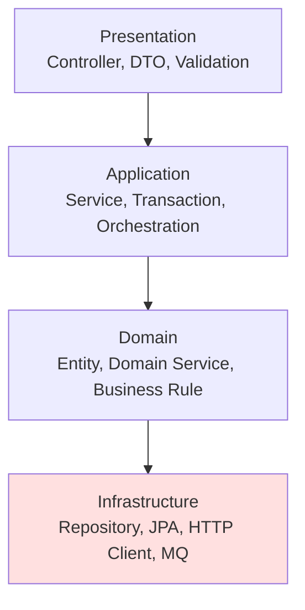

# 레이어드 아키텍처와 그 한계

가장 많이 쓰이고 가장 많이 욕먹는 구조가 레이어드 아키텍처입니다. 이 문서는 레이어드가 실제로 무엇을 해결해주는지, 어디서 무너지는지, 그리고 언제 다음 단계로 넘어가야 하는지를 판단 기준과 함께 정리합니다.

## 목차
- [1. 핵심 개념 (What)](#1-핵심-개념-what)
- [2. 왜 알아야 하는가 (Why)](#2-왜-알아야-하는가-why)
- [3. 내부 구현 분석 (How)](#3-내부-구현-분석-how)
- [4. 실전 예제](#4-실전-예제)
- [5. 정리](#5-정리)

---

## 1. 핵심 개념 (What)

### 1.1 전통적인 계층 구조

레이어드 아키텍처(Layered Architecture)는 **기술적 관심사(technical concern)를 기준으로 코드를 수평으로 자른** 구조입니다.



각 레이어의 책임은 이렇습니다.

| 레이어 | 책임 | 대표 타입 |
|---|---|---|
| Presentation | 프로토콜 변환, 입력 검증, 응답 직렬화 | `@RestController`, `Request/Response` |
| Application | 유스케이스 흐름 조립, 트랜잭션 경계 | `@Service`, `@Transactional` |
| Domain | 비즈니스 규칙, 불변식 | `Order`, `Money`, `PricingPolicy` |
| Infrastructure | 외부 세계와의 통신 | `JpaRepository`, `RestClient`, `KafkaTemplate` |

3-tier(Presentation-Business-Data)는 이 중 Application과 Domain을 합친 형태입니다. 실무에서 가장 흔한 Spring Boot 프로젝트가 정확히 이 모습입니다.

### 1.2 핵심 규칙: 단방향 하향 의존

레이어드의 유일한 아키텍처 규칙은 **위 레이어만 아래 레이어를 호출한다**입니다. 변형이 둘 있습니다.

- **폐쇄 레이어(closed layer)**: 반드시 바로 아래 레이어만 호출. Controller가 Repository를 직접 부르지 못함.
- **개방 레이어(open layer)**: 건너뛰기 허용. 단순 조회에서 Controller → Repository 직행.

폐쇄 레이어는 격리성이 좋지만, 필드 하나 추가할 때 통과 전용(pass-through) 코드가 세 군데 생깁니다. 이를 **싱크홀 안티패턴(architecture sinkhole anti-pattern)** 이라 부릅니다. 마틴 리처즈는 요청의 20% 이상이 아무 로직 없이 통과만 한다면 구조를 재검토하라고 권합니다.

### 1.3 문제의 핵심: 화살표가 아래를 향한다

위 다이어그램에서 주목할 점은 **Domain → Infrastructure** 화살표입니다. 도메인이 인프라를 의존합니다. 이것이 레이어드의 모든 구조적 한계의 근원이며, 헥사고날/클린 아키텍처가 뒤집으려는 대상이기도 합니다.

---

## 2. 왜 알아야 하는가 (Why)

### 2.1 레이어드가 여전히 널리 쓰이는 진짜 이유

비판부터 하기 전에, 레이어드가 주는 실제 이점을 인정해야 판단이 정확해집니다.

**① 학습 비용이 사실상 0이다.** 신입이 들어와도 "컨트롤러 → 서비스 → 리포지토리"는 30분이면 이해합니다. 헥사고날 프로젝트에 처음 투입된 개발자가 포트/어댑터 위치를 파악하는 시간과 비교하면 큰 차이입니다.

**② 프레임워크와 정렬되어 있다.** Spring Boot, JPA, 대부분의 튜토리얼과 스캐폴딩 도구가 이 구조를 전제합니다. `@RestController`, `@Service`, `@Repository` 세 어노테이션이 곧 세 레이어입니다.

**③ 어디에 코드를 둘지 고민할 필요가 없다.** "이건 서비스에", "이건 리포지토리에". 결정 비용이 낮고, 아키텍처 논쟁이 사라지는 것 자체가 팀 생산성입니다.

**④ 기술 스택 교체에는 실제로 강하다.** 전 계층에 걸친 기술 변경(로깅 프레임워크, 트랜잭션 매니저)은 한 레이어에 집중되어 있어 오히려 다루기 쉽습니다.

**결론: 도메인 로직이 얕고 CRUD 비중이 높은 시스템에서 레이어드는 최적해에 가깝습니다.** 관리자 페이지, 내부 도구, 초기 MVP에 헥사고날을 얹는 것은 순수한 손해입니다.

### 2.2 한계 1 — 도메인이 인프라에 의존하게 되는 구조적 문제

레이어드의 의존 방향은 `Domain → Infrastructure`입니다. JPA를 쓰는 순간 이 문제가 즉시 물리적으로 드러납니다.

```kotlin
// 흔한 "도메인 모델". 사실은 JPA 엔티티다
@Entity
@Table(name = "orders")
class Order(
    @Id @GeneratedValue(strategy = GenerationType.IDENTITY)
    var id: Long? = null,                                   // ← DB 때문에 nullable

    @Column(nullable = false)
    var customerId: Long,                                   // ← 값 객체를 못 씀

    @OneToMany(mappedBy = "order", cascade = [CascadeType.ALL], fetch = FetchType.LAZY)
    var lines: MutableList<OrderLine> = mutableListOf(),     // ← 불변 불가, 프록시

    @Enumerated(EnumType.STRING)
    var status: OrderStatus = OrderStatus.CREATED,           // ← var, 누구나 변경 가능
) {
    fun complete() {
        require(status == OrderStatus.PAID)
        status = OrderStatus.COMPLETED
    }
}
```

여기서 도메인 설계가 어떻게 훼손되는지 구체적으로 봅시다.

| 도메인이 원하는 것 | JPA가 강요하는 것 | 결과 |
|---|---|---|
| 불변 객체 (`val`) | setter/`var`, 기본 생성자 | 누구나 상태를 바꿀 수 있음 |
| 생성자에서 불변식 검증 | no-arg 생성자 필수 | 잘못된 상태의 객체 생성 가능 |
| 값 객체(`Money`, `OrderId`) | `@Embeddable`, 기본 타입 | 원시 타입 집착(primitive obsession) |
| 컬렉션 캡슐화 | 양방향 매핑, `mappedBy` | 컬렉션이 외부로 노출 |
| 순수 단위 테스트 | 영속성 컨텍스트, 지연 로딩 | 테스트에 DB 또는 모킹 필요 |

더 나쁜 것은 **전염성**입니다. `LazyInitializationException`을 피하려고 서비스에 `@Transactional`을 붙이고, 그러다 보니 트랜잭션 경계가 도메인 규칙이 아니라 지연 로딩 사정으로 결정됩니다. 결국 **DB 스키마가 도메인 모델을 지배**합니다.

이를 두고 마틴 파울러는 **빈약한 도메인 모델(Anemic Domain Model)** 이라 불렀습니다. 데이터는 엔티티에, 로직은 서비스에 있는 상태입니다.

```kotlin
@Service
class OrderService(private val orderRepository: OrderRepository) {
    @Transactional
    fun completeOrder(orderId: Long) {
        val order = orderRepository.findById(orderId).orElseThrow()
        if (order.status != OrderStatus.PAID) throw IllegalStateException()   // 규칙이 서비스에
        if (order.lines.isEmpty()) throw IllegalStateException()              // 규칙이 서비스에
        order.status = OrderStatus.COMPLETED                                  // setter 호출
    }
}
```

같은 규칙이 `OrderAdminService`, `OrderBatchService`에도 복사됩니다. 한 군데를 고쳐도 나머지는 그대로 남습니다.

### 2.3 한계 2 — 변경 단위와 구조 단위가 어긋난다

기능 요청은 항상 **도메인 단위**로 들어옵니다: "주문에 쿠폰 적용 기능 추가". 그런데 레이어드에서 이 작업은 이렇게 흩어집니다.

```
com.shop
├── controller/  OrderController.kt      ← 수정
├── dto/         OrderRequest.kt         ← 수정
├── service/     OrderService.kt         ← 수정
├── domain/      Order.kt                ← 수정
└── repository/  OrderRepository.kt      ← 수정
```

패키지 5개를 열어야 기능 하나가 완성됩니다. 파급 효과는 이렇습니다.

- **PR 리뷰가 어렵다.** 변경 파일이 디렉터리 전역에 흩어져 맥락 재구성 비용이 큽니다.
- **머지 충돌이 잦다.** 다른 기능을 작업하는 두 사람이 같은 `service/` 디렉터리를 건드립니다.
- **삭제가 어렵다.** 기능 제거 시 5개 패키지를 뒤져야 하고, 결국 죽은 코드가 남습니다.
- **모듈 분리 경로가 없다.** MSA로 떼려면 "주문 관련 코드"를 모아야 하는데 애초에 모여 있지 않습니다.

**응집도의 기준이 잘못된 것입니다.** 같이 바뀌는 것을 같이 두는 것이 응집이고(공통 폐쇄 원칙, Common Closure Principle), 실제로 같이 바뀌는 것은 `OrderController`와 `OrderService`이지 `OrderService`와 `UserService`가 아닙니다.

### 2.4 한계 3 — 구조가 시스템의 정체를 말해주지 않는다

로버트 마틴은 이를 **소리치는 아키텍처(Screaming Architecture)** 로 표현했습니다. 건축 도면을 보면 도서관인지 병원인지 알 수 있어야 하듯, 최상위 디렉터리를 보면 시스템이 무엇을 하는지 알 수 있어야 한다는 것입니다.

```
com.shop                       com.shop
├── controller  ← "Spring      ├── order      ← "커머스 주문
├── service        프로젝트다"  ├── payment       시스템이다"
├── repository                 ├── delivery
└── domain                     └── settlement
```

왼쪽은 사용한 프레임워크를 소리치고, 오른쪽은 도메인을 소리칩니다. 오른쪽에서는 신규 입사자가 디렉터리 목록만 보고도 시스템 범위를 파악합니다.

---

## 3. 내부 구현 분석 (How)

### 3.1 기술 기준 패키징 vs 기능 기준 패키징

두 방식을 나란히 놓고 봅니다.

```
Package by Layer (기술 기준)          Package by Feature (기능 기준)
com.shop                              com.shop
├── controller/  OrderController…     ├── order/    OrderController, OrderService,
├── service/     OrderService…        │              OrderRepository, Order
├── repository/  OrderRepository…     ├── payment/  PaymentController, …
└── domain/      Order, Payment…      └── coupon/   CouponController, …
```

| 비교 항목 | 기술 기준 | 기능 기준 |
|---|---|---|
| 기능 변경 시 열어야 할 디렉터리 | 4~5개 | 1개 |
| 접근 제어 활용 | 불가(다른 패키지라 전부 `public`) | 가능(`internal`로 캡슐화) |
| 기능 삭제 | 전역 검색 필요 | 디렉터리 삭제 |
| 신규 입사자의 시스템 파악 | 어려움 | 쉬움 |
| 모듈/서비스 분리 | 재배치 필요 | 디렉터리 이동 |
| 레이어 규칙 강제 | 패키지명으로 자명 | ArchUnit 등 도구 필요 |
| 처음 배우는 비용 | 낮음 | 중간 |

기능 기준의 진짜 이득은 **가시성 제어**입니다. Kotlin의 `internal`(Java의 package-private)로 `OrderRepository`를 감추고 `OrderFacade`만 `public`으로 노출하면, 다른 기능이 내부 구현에 손댈 방법이 사라집니다.

기술 기준 패키징에서는 `PaymentService`가 `OrderRepository`를 직접 부르는 것을 막을 방법이 컨벤션밖에 없습니다. Spring Modulith는 이 아이디어를 패키지 규칙으로 정식화한 것입니다 → [../spring/architecture/01-modular-monolith-spring-modulith.md](../spring/architecture/01-modular-monolith-spring-modulith.md).

### 3.2 현실적인 절충: Package by Feature, then Layer

기능을 먼저 나누고 그 안에서 레이어를 나눕니다. 실무에서 가장 무난한 형태입니다.

```
com.shop
├── order/
│   ├── api/            OrderController, OrderRequest, OrderResponse
│   ├── application/    OrderService, PlaceOrderCommand
│   ├── domain/         Order, OrderLine, OrderStatus, OrderRepository(interface)
│   └── infrastructure/ OrderPersistenceAdapter, OrderEntity
├── payment/
│   └── (동일 구조)
└── shared/             Money, DomainEvent   ← 최소한으로 유지
```

레이어 개념을 유지하면서 응집도를 회복합니다. 헥사고날로 가는 자연스러운 중간 지점이기도 합니다 → [12-hexagonal-architecture.md](12-hexagonal-architecture.md).

### 3.3 트랜잭션 스크립트 vs 도메인 모델

레이어드를 논할 때 항상 따라오는 두 번째 축입니다. 이것은 **패키징이 아니라 로직을 어디에 두느냐**의 문제입니다.

**트랜잭션 스크립트(Transaction Script)**: 유스케이스 하나 = 절차 하나. 데이터는 수동적인 구조체.

```kotlin
@Service
class OrderService(private val orders: OrderRepository, private val coupons: CouponRepository) {
    @Transactional
    fun applyCoupon(orderId: Long, couponId: Long) {
        val order = orders.findById(orderId).orElseThrow()
        val coupon = coupons.findById(couponId).orElseThrow()

        if (order.status != OrderStatus.CREATED) throw IllegalStateException("이미 진행된 주문")
        if (coupon.expiredAt.isBefore(LocalDateTime.now())) throw IllegalStateException("만료된 쿠폰")
        if (order.totalAmount < coupon.minimumAmount) throw IllegalStateException("최소 금액 미달")

        val discount = minOf(order.totalAmount * coupon.rate / 100, coupon.maxDiscount)
        order.discountAmount = discount
        order.finalAmount = order.totalAmount - discount
        coupon.used = true
    }
}
```

**도메인 모델(Domain Model)**: 규칙이 데이터를 가진 객체에 있음. 도메인 객체가 스스로를 지킵니다.

```kotlin
data class Coupon(
    val id: CouponId,
    val rate: Percentage,
    val minimumAmount: Money,
    val maxDiscount: Money,
    val expiredAt: LocalDateTime,
    val used: Boolean,
) {
    fun discountFor(amount: Money, now: LocalDateTime): Money {
        check(!used) { "이미 사용된 쿠폰입니다" }
        check(expiredAt.isAfter(now)) { "만료된 쿠폰입니다" }
        check(amount >= minimumAmount) { "최소 주문 금액 ${minimumAmount}원 이상이어야 합니다" }
        return minOf(amount * rate, maxDiscount)
    }
}

data class Order(val id: OrderId, val lines: List<OrderLine>, val status: OrderStatus, val discount: Money) {
    val totalAmount: Money get() = lines.fold(Money.ZERO) { a, l -> a + l.subtotal }
    fun applyDiscount(discount: Money): Order {
        check(status == OrderStatus.CREATED) { "이미 진행된 주문에는 할인을 적용할 수 없습니다" }
        return copy(discount = discount)
    }
}

// 서비스는 조립만 한다
@Service
class OrderService(private val orders: OrderRepository, private val coupons: CouponRepository) {
    @Transactional fun applyCoupon(orderId: OrderId, couponId: CouponId) {
        val order = orders.findById(orderId) ?: throw OrderNotFoundException(orderId)
        val coupon = coupons.findById(couponId) ?: throw CouponNotFoundException(couponId)
        val discount = coupon.discountFor(order.totalAmount, LocalDateTime.now())
        orders.save(order.applyDiscount(discount))
        coupons.save(coupon.markUsed())
    }
}
```

| 기준 | 트랜잭션 스크립트 | 도메인 모델 |
|---|---|---|
| 규칙 개수가 적을 때 | 유리(직관적, 코드 적음) | 과함 |
| 규칙이 여러 유스케이스에 재사용 | 복사되며 불일치 발생 | 한 곳에 존재 |
| 테스트 | DB/모킹 필요 | 순수 단위 테스트 |
| 신규 개발자 이해 | 위에서 아래로 읽으면 끝 | 객체 여러 개 추적 필요 |
| 규칙 변경 시 누락 위험 | 높음 | 낮음 |

**둘 중 하나를 고르는 게 아니라 유스케이스마다 다릅니다.** 조회, 단순 등록, 배치는 트랜잭션 스크립트가 정답입니다. 정산, 할인, 재고 할당처럼 규칙이 얽히는 곳에만 도메인 모델을 씁니다. 한 프로젝트 안에 둘이 공존하는 것이 정상입니다.

---

## 4. 실전 예제

### 4.1 판단 기준 — 레이어드로 충분한가

아래 신호를 점검하십시오. **3개 이상 해당하면** 구조 전환을 검토할 때입니다.

| # | 신호 | 확인 방법 |
|---|---|---|
| 1 | 서비스 클래스가 500줄을 넘고 계속 자란다 | `find . -name "*Service.kt" \| xargs wc -l \| sort -rn \| head` |
| 2 | 같은 비즈니스 규칙이 3곳 이상에 복사되어 있다 | 규칙 키워드 grep |
| 3 | 도메인 테스트에 `@SpringBootTest`가 필요하다 | 테스트 어노테이션 분포 확인 |
| 4 | 기능 하나 추가에 5개 이상 패키지를 연다 | 최근 PR의 변경 파일 경로 분포 |
| 5 | 엔티티에 `@Transient`, `@JsonIgnore`가 늘어난다 | 엔티티가 API 응답까지 겸하는 중 |
| 6 | "이 로직 어디 있어요?" 질문이 반복된다 | 팀 슬랙 |
| 7 | 서비스 클래스끼리 순환 호출한다 | ArchUnit / IDE 분석 |
| 8 | MSA 분리 계획이 잡혔다 | 로드맵 |

반대로 **도메인 규칙이 "필수값 검증 + 저장" 수준이거나, 팀이 3인 이하이고 서비스 수명이 1~2년이거나, 화면 요구사항이 곧 데이터 구조와 일치하거나(관리자 CRUD), 성능·인프라 이슈가 아키텍처 이슈보다 크다면 레이어드를 유지하십시오.**

### 4.2 두 패키징 방식 비교 코드

**Before — 기술 기준, 빈약한 도메인**

```kotlin
// com/shop/controller/OrderController.kt
@RestController @RequestMapping("/api/orders")
class OrderController(private val orderService: OrderService) {
    @PostMapping("/{id}/coupons/{couponId}")
    fun applyCoupon(@PathVariable id: Long, @PathVariable couponId: Long): OrderEntity =
        orderService.applyCoupon(id, couponId)   // ← 엔티티를 그대로 응답. DB 컬럼 = API 스펙
}
// com/shop/service/OrderService.kt  (규칙이 여기 전부)
// com/shop/domain/OrderEntity.kt    (var + setter 덩어리)
```

문제: `OrderEntity`에 컬럼을 추가하면 API 응답이 바뀝니다. DB 리팩터링이 클라이언트 장애가 됩니다.

**After — 기능 기준, 규칙은 도메인에**

```kotlin
// com/shop/order/api/OrderController.kt
@RestController @RequestMapping("/api/orders")
class OrderController(private val orderFacade: OrderFacade) {
    @PostMapping("/{id}/coupons/{couponId}")
    fun applyCoupon(@PathVariable id: Long, @PathVariable couponId: Long): OrderResponse =
        OrderResponse.from(orderFacade.applyCoupon(OrderId(id), CouponId(couponId)))
}

// com/shop/order/api/OrderResponse.kt — API 스펙은 여기서만 결정
data class OrderResponse(val orderId: Long, val totalAmount: Long, val finalAmount: Long) {
    companion object { fun from(o: Order) = OrderResponse(o.id.value, o.totalAmount.value, o.finalAmount.value) }
}

// com/shop/order/domain/Order.kt — 규칙 보유, 프레임워크 무관
// com/shop/order/domain/OrderRepository.kt — 인터페이스(도메인 소유)
// com/shop/order/infrastructure/OrderPersistenceAdapter.kt — internal 구현
```

인터페이스를 도메인이 소유하는 이유는 [10-dependency-rules-and-dip.md](10-dependency-rules-and-dip.md)에서 다룹니다.

### 4.3 점진적 전환 순서 (빅뱅 금지)

한 번에 바꾸려다 실패하는 것이 가장 흔한 시나리오입니다. 순서는 이렇습니다.

1. **DTO 분리부터.** 엔티티를 API 응답에서 걷어냅니다. 가장 위험이 낮고 효과가 즉시 보입니다.
2. **패키지를 기능 단위로 재배치.** 코드 변경 없이 이동만. IDE 리팩터링으로 처리 가능.
3. **가장 복잡한 도메인 하나만** 규칙을 도메인 객체로 이동. 나머지는 그대로 둡니다.
4. **Repository 인터페이스를 도메인 패키지로 이동.** 구현체는 infrastructure에 남깁니다.
5. **ArchUnit으로 고정** → [16-archunit-enforcing-rules.md](16-archunit-enforcing-rules.md). 이후 필요할 때만 Gradle 모듈로 승격 → [../build-tool/02-gradle-multi-module.md](../build-tool/02-gradle-multi-module.md)

3단계에서 멈춰도 됩니다. 대부분의 팀에게는 그것으로 충분합니다.

---

## 5. 정리

### 레이어드의 이점과 한계

| 항목 | 내용 |
|---|---|
| 강점 | 학습 비용 0, 프레임워크 정렬, 코드 배치 결정 비용 낮음 |
| 한계 1 | 도메인 → 인프라 의존. JPA 엔티티가 도메인 모델을 지배 |
| 한계 2 | 기술 기준 응집이라 기능 변경이 전 레이어로 흩어짐 |
| 한계 3 | 구조가 프레임워크를 소리침(도메인이 안 보임) |
| 부작용 | 빈약한 도메인 모델, 비대한 서비스, 싱크홀 안티패턴 |

### 패키징 방식 선택

| 상황 | 권장 |
|---|---|
| 도메인 1개, 팀 1~3인, CRUD 중심 | Package by Layer 유지 |
| 도메인 3개 이상, 팀 4인 이상 | Package by Feature, then Layer |
| 도메인 규칙 복잡, 인프라 교체 가능성 | 헥사고날 → [12](12-hexagonal-architecture.md) |
| MSA 분리 예정 | Feature 기준 + 모듈 분리 → [17](17-modular-monolith-to-msa.md) |

### 로직 배치 선택

| 유스케이스 성격 | 권장 |
|---|---|
| 조회, 단순 등록/수정, 배치, 통계 | 트랜잭션 스크립트 |
| 상태 전이가 있고 불변식이 여럿 | 도메인 모델 |
| 같은 규칙이 여러 진입점에서 쓰임 | 도메인 모델 |

### 트레이드오프

- **기능 기준 패키징은 공짜가 아닙니다.** 레이어 규칙이 패키지명으로 자명하지 않게 되므로 ArchUnit 같은 도구로 보완해야 하고, 도메인 경계를 잘못 그으면 기술 기준보다 더 나쁩니다.
- **도메인 모델은 규칙이 있어야 값어치가 있습니다.** 규칙 없는 도메인 객체는 필드 나열 + 매핑 코드일 뿐이며, 이 경우 트랜잭션 스크립트가 명백히 낫습니다.
- **레이어드를 떠나는 결정은 되돌리기 비쌉니다.** 위 8개 신호 중 3개 이상이 관측될 때까지 기다리는 편이 안전합니다.

> **핵심 포인트**: 레이어드 아키텍처의 근본 한계는 **"화살표가 아래(인프라)를 향한다"** 는 것 하나이고, 나머지 증상들 — 빈약한 도메인, 비대한 서비스, 흩어지는 변경 — 은 모두 여기서 파생됩니다. 그렇다고 모든 프로젝트가 이 화살표를 뒤집어야 하는 것은 아닙니다. 도메인 규칙이 얕다면 레이어드는 여전히 최적해이며, 이때 헥사고날을 도입하는 것은 문제 없는 곳에 비용을 지불하는 일입니다. 전환의 신호는 "더 나은 구조가 있다더라"가 아니라 **"같은 규칙을 세 번째 복사하고 있다"** 는 관측입니다.

---

## 관련 문서

- [10-dependency-rules-and-dip.md](10-dependency-rules-and-dip.md) — 의존성 규칙의 원리와 DIP
- [12-hexagonal-architecture.md](12-hexagonal-architecture.md) — 헥사고날 아키텍처: 포트와 어댑터
- [13-clean-architecture-dependency-rule.md](13-clean-architecture-dependency-rule.md) — 클린 아키텍처와 의존성 규칙
- [14-module-boundary-and-ddd.md](14-module-boundary-and-ddd.md) — 모듈 경계와 DDD
- [15-common-module-antipattern.md](15-common-module-antipattern.md) — common 모듈 안티패턴
- [16-archunit-enforcing-rules.md](16-archunit-enforcing-rules.md) — ArchUnit으로 규칙 강제하기
- [17-modular-monolith-to-msa.md](17-modular-monolith-to-msa.md) — 모듈러 모놀리스에서 MSA로 / [01-msa-fundamentals.md](01-msa-fundamentals.md) — MSA 기초
- [../build-tool/02-gradle-multi-module.md](../build-tool/02-gradle-multi-module.md) — Gradle 멀티모듈 설정 실무
- [../spring/architecture/01-modular-monolith-spring-modulith.md](../spring/architecture/01-modular-monolith-spring-modulith.md) — Spring Modulith

---
*참고: Kotlin 2.0 / Spring Boot 3.x / Gradle 8.x 기준*
