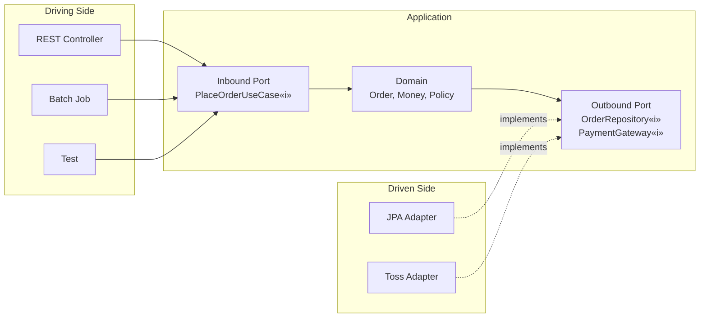
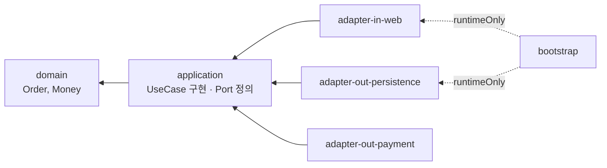

# 헥사고날 아키텍처: 포트와 어댑터

애플리케이션을 외부 세계로부터 격리하고, 도메인이 인터페이스를 정의하고 인프라가 구현하게 만드는 구조입니다. 멀티모듈 구현 방법과 함께, 언제 이 비용을 지불할 가치가 있는지도 솔직하게 다룹니다.

## 목차
- [1. 핵심 개념 (What)](#1-핵심-개념-what)
- [2. 왜 알아야 하는가 (Why)](#2-왜-알아야-하는가-why)
- [3. 내부 구현 분석 (How)](#3-내부-구현-분석-how)
- [4. 실전 예제](#4-실전-예제)
- [5. 정리](#5-정리)

---

## 1. 핵심 개념 (What)

### 1.1 원래 문제 의식

알리스테어 코오번(Alistair Cockburn)이 2005년에 제시한 원문의 목표는 "애플리케이션이 사용자·프로그램·자동화된 테스트·배치 스크립트에 의해 **동등하게(equally)** 구동되고, 최종적으로 붙을 런타임 장치나 데이터베이스로부터 격리되어 개발·테스트될 수 있게 한다"는 한 문장입니다.

핵심은 **"equally(동등하게)"** 입니다. 애플리케이션 입장에서 HTTP 요청이든, 배치 스크립트든, 테스트 코드든 **모두 같은 방식으로 들어와야** 한다는 것입니다. 마찬가지로 나갈 때도 PostgreSQL이든 인메모리 맵이든 애플리케이션은 구분하지 못해야 합니다.

레이어드에서는 이게 안 됩니다. HTTP로 들어오는 경로와 배치로 들어오는 경로가 각각 서비스를 다르게 호출하고, 결국 로직이 복제됩니다 → [11-layered-architecture-and-limits.md](11-layered-architecture-and-limits.md).

### 1.2 육각형 그림에 대한 오해

가장 흔한 오해부터 정리합니다. **변이 6개인 것에는 아무 의미가 없습니다.** 코오번 본인이 밝혔듯, 원(레이어드 그림)과 구별하고 "여러 개의 서로 다른 진입점을 그려 넣을 공간"이 필요해서 다각형을 골랐을 뿐입니다. 포트가 6개여야 한다거나 레이어가 6개라는 뜻이 전혀 아닙니다. 이 아키텍처의 정식 명칭은 **포트와 어댑터(Ports and Adapters)** 이고, 이 이름이 내용을 훨씬 정확히 설명합니다.



**모든 화살표가 안쪽(Application)을 향합니다.** 우측 어댑터의 화살표가 점선인 이유는 "구현(implements)"이기 때문이고, 구현은 인터페이스 쪽으로 향하는 의존성입니다.

### 1.3 인바운드 vs 아웃바운드

| 구분 | 인바운드(Driving, Primary) | 아웃바운드(Driven, Secondary) |
|---|---|---|
| 방향 | 외부 → 애플리케이션 | 애플리케이션 → 외부 |
| 포트의 정체 | 애플리케이션이 **제공하는** API | 애플리케이션이 **필요로 하는** 기능 |
| 인터페이스 구현자 | 애플리케이션 자신 | 인프라 어댑터 |
| 호출자 | 어댑터(컨트롤러 등) | 애플리케이션 |
| 포트 / 어댑터 예시 | `PlaceOrderUseCase` / `OrderController`, 배치 잡 | `OrderRepository`, `PaymentGateway` / `OrderJpaAdapter` |
| DIP 필요 여부 | 불필요(자연스럽게 안쪽 향함) | **필수**(안 하면 화살표가 밖으로 나감) |

가장 헷갈리는 부분: **인바운드 포트는 애플리케이션이 구현하고, 아웃바운드 포트는 인프라가 구현합니다.** 둘 다 인터페이스지만 구현 위치가 정반대입니다.

인바운드 포트에 DIP가 "불필요"한 이유는, 컨트롤러 → 서비스는 원래 안쪽을 향하기 때문입니다. 그래서 인바운드 포트 인터페이스를 생략하고 서비스 클래스를 직접 주입받는 절충안이 실무에서 흔하며, 이는 합리적인 선택입니다(3.5절 참고).

### 1.4 포트는 누가 소유하는가

이것이 이 아키텍처의 심장입니다.

> **포트 인터페이스는 애플리케이션(도메인) 쪽에 존재한다. 어댑터가 그것을 구현한다.**

`OrderRepository` 인터페이스가 `adapter-out-persistence` 모듈에 있으면 헥사고날이 아닙니다. 인터페이스만 하나 늘어난 레이어드입니다. 인터페이스가 `domain`/`application` 모듈에 있어야 화살표가 뒤집힙니다 → 상세는 [10-dependency-rules-and-dip.md](10-dependency-rules-and-dip.md).

포트 이름을 지을 때도 이 소유권이 드러나야 합니다. `OrderJpaPort.saveEntity(entity: OrderEntity)`는 도메인이 JPA를 알고 있다는 증거입니다. `OrderRepository.save(order: Order)`, `PaymentGateway.charge(...)`처럼 **도메인 언어로만 표현**해서 구현이 뭐로 바뀌든 이름이 안 바뀌게 해야 합니다.

---

## 2. 왜 알아야 하는가 (Why)

### 2.1 실제로 얻는 것

**① 도메인 테스트가 밀리초 단위로 끝난다.** 가장 즉각적인 이득입니다. `@SpringBootTest`가 컨텍스트를 띄우는 데 5~15초, 테스트 200개면 CI가 몇 분씩 걸립니다. 헥사고날에서는 도메인/애플리케이션 테스트가 순수 JUnit입니다(4.1절 예제 참고).

**② 인프라 결정을 미룰 수 있다.** 프로젝트 초기에 "RDB냐 문서DB냐"를 정하지 않고 도메인부터 만들 수 있습니다. 실제로는 인프라를 바꾸는 일보다 **결정을 미루며 도메인 이해를 키우는 것**이 더 큰 가치입니다.

**③ 진입점이 늘어나도 로직이 복제되지 않는다.** REST API로 시작한 기능에 배치, gRPC, 어드민 API가 추가될 때 어댑터만 추가하면 됩니다.

**④ MSA 분리 시 경계가 이미 그어져 있다.** 아웃바운드 포트가 곧 "다른 서비스를 부르는 지점"입니다. JPA 어댑터를 HTTP 클라이언트 어댑터로 갈아끼우면 그 부분이 원격 서비스로 빠집니다 → [17-modular-monolith-to-msa.md](17-modular-monolith-to-msa.md), [02-msa-communication-patterns.md](02-msa-communication-patterns.md).

### 2.2 비판적 시각 — 실제 비용

여기서 솔직해질 필요가 있습니다. 헥사고날은 비싼 구조입니다.

**① 파일 수가 2~3배가 된다.** 주문 생성 기능 하나에 레이어드는 5개(`OrderController`, `OrderRequest/Response`, `OrderService`, `Order`, `OrderRepository`)면 되지만, 헥사고날은 10개가 필요합니다(위 5개 + `PlaceOrderUseCase`, `PlaceOrderCommand`, `OrderPersistenceAdapter`, `OrderEntity`, `OrderMapper`).

**② 매핑 코드가 계속 늘어난다.** `OrderRequest → PlaceOrderCommand → Order → OrderEntity`. 필드 하나 추가에 4곳을 고칩니다. 이걸 "보일러플레이트"라 부르는 것은 정당한 비판입니다.

**③ 추적이 어렵다.** "이 요청이 어디로 가지?"에 답하려면 인터페이스 → 구현체 점프가 반복됩니다. 신규 입사자의 온보딩 시간이 2~3배 늘어납니다.

**④ 잘못 적용하면 최악의 결과가 나온다.** 포트만 잔뜩 만들고 도메인은 여전히 빈약하면, 레이어드보다 파일만 많고 이득은 0인 구조가 됩니다. 실무에서 가장 흔한 실패 모드입니다.

### 2.3 적용하지 말아야 할 경우

다음 중 하나라도 해당하면 헥사고날을 도입하지 마십시오. CRUD가 로직의 80% 이상(관리자 페이지, 설정 서비스, 내부 도구), 엔티티 10개 미만이고 규칙이 "필수값 검증" 수준, 팀 2인 이하이고 6개월 내 종료 예정인 경우입니다. 여기에 두 가지를 더합니다.

- **인프라 교체 가능성이 실질적으로 0이다.** PostgreSQL을 10년 쓸 예정이라면 `OrderRepository` 포트의 값어치는 테스트 대체 용도뿐입니다.
- **팀에 이 구조를 유지할 사람이 없다.** 규칙을 아는 사람이 떠나면 하이브리드 잡탕이 되고, 이건 순수 레이어드보다 나쁩니다.

**중간 지점을 권장합니다.** 아웃바운드 포트만 도입하고(도메인이 `OrderRepository` 인터페이스 소유), 인바운드 포트는 생략하며, 모듈 분리 없이 패키지로만 나누는 형태입니다. 이득의 70%를 비용의 30%로 얻습니다.

---

## 3. 내부 구현 분석 (How)

### 3.1 멀티모듈 구성

모듈은 `domain`(순수 Kotlin, 의존성 없음), `application`(유스케이스와 포트 정의), `adapter-in-web`, `adapter-out-persistence`, `adapter-out-payment`, 그리고 `@SpringBootApplication`이 있는 `bootstrap`으로 나눕니다.



의존성 선언(문법 상세는 [../build-tool/02-gradle-multi-module.md](../build-tool/02-gradle-multi-module.md) 참고):

```kotlin
// domain/build.gradle.kts — 아무것도 의존하지 않는다. 이게 핵심.
dependencies { testImplementation(libs.kotest) }

// application/build.gradle.kts
dependencies {
    api(project(":domain"))                       // 포트 시그니처에 도메인 타입이 노출되므로 api
    implementation(libs.spring.tx)                // @Transactional만. 웹/JPA 없음
}

// adapter-out-persistence/build.gradle.kts (adapter-in-web도 동일한 형태)
dependencies {
    implementation(project(":application"))       // 포트를 구현하려면 필요
    implementation(libs.spring.boot.starter.data.jpa)
}

// bootstrap/build.gradle.kts — 어댑터를 런타임에만 묶는다
dependencies {
    implementation(project(":application"))
    runtimeOnly(project(":adapter-in-web"))
    runtimeOnly(project(":adapter-out-persistence"))
}
```

`runtimeOnly`를 쓰는 이유는 bootstrap이 어댑터 타입을 컴파일 시점에 알 필요가 없기 때문입니다. 어댑터를 교체해도 bootstrap은 재컴파일되지 않습니다. **검증 방법**: `./gradlew :domain:dependencies`에 Spring이 하나도 안 나오면 성공입니다.

### 3.2 도메인 모듈

```kotlin
// domain/src/main/kotlin/com/shop/order/domain/Order.kt
package com.shop.order.domain

@JvmInline value class OrderId(val value: Long)

data class Money(val amount: BigDecimal) {
    init { require(amount >= BigDecimal.ZERO) { "금액은 음수일 수 없습니다: $amount" } }
    operator fun plus(other: Money) = Money(amount + other.amount)
    companion object { val ZERO = Money(BigDecimal.ZERO) }
}

data class Order(
    val id: OrderId, val customerId: CustomerId, val lines: List<OrderLine>, val status: OrderStatus,
) {
    val totalAmount: Money get() = lines.fold(Money.ZERO) { acc, l -> acc + l.subtotal }

    fun markPaid(): Order {
        check(status == OrderStatus.CREATED) { "결제 가능한 상태가 아닙니다: $status" }
        return copy(status = OrderStatus.PAID)
    }

    companion object {
        fun place(customerId: CustomerId, lines: List<OrderLine>): Order {
            require(lines.isNotEmpty()) { "주문 항목이 비어 있습니다" }
            require(lines.size <= 100) { "한 주문에 100개 항목을 초과할 수 없습니다" }
            return Order(OrderId(0), customerId, lines, OrderStatus.CREATED)
        }
    }
}
```

`@Entity`도 `@Component`도 없습니다. 이 파일은 Spring Boot 버전이 올라가도 영향받지 않습니다.

### 3.3 애플리케이션 모듈 — 포트 정의와 유스케이스

```kotlin
// application/.../port/in/PlaceOrderUseCase.kt  (인바운드 포트)
data class PlaceOrderCommand(val customerId: CustomerId, val items: List<Item>) {
    data class Item(val productId: ProductId, val quantity: Int)
    init { require(items.isNotEmpty()) { "주문 항목이 비어 있습니다" } }
}
interface PlaceOrderUseCase { fun place(command: PlaceOrderCommand): OrderId }

// application/.../port/out/*.kt  (아웃바운드 포트 — 애플리케이션이 필요로 하는 것)
interface SaveOrderPort { fun save(order: Order): Order }
interface LoadOrderPort { fun findById(id: OrderId): Order? }
interface LoadProductPricePort { fun pricesOf(ids: List<ProductId>): Map<ProductId, Money> }
interface PaymentGateway { fun charge(orderId: OrderId, amount: Money): PaymentResult }
interface OrderEventPublisher { fun publish(event: OrderPlaced) }
```

포트를 `SaveOrderPort`/`LoadOrderPort`로 쪼갠 것은 인터페이스 분리 원칙(ISP) 적용입니다. 테스트에서 필요한 것만 스텁하면 되고, "메서드 20개짜리 Repository 인터페이스"를 피할 수 있습니다. 다만 과하게 쪼개면 파일만 늘어나므로, 실제로 사용처가 갈릴 때만 분리하십시오.

```kotlin
// application/.../service/PlaceOrderService.kt
@Service
@Transactional
class PlaceOrderService(
    private val loadProductPrice: LoadProductPricePort,
    private val saveOrder: SaveOrderPort,
    private val paymentGateway: PaymentGateway,
    private val eventPublisher: OrderEventPublisher,
) : PlaceOrderUseCase {
    override fun place(command: PlaceOrderCommand): OrderId {
        val prices = loadProductPrice.pricesOf(command.items.map { it.productId })
        val lines = command.items.map {
            OrderLine(it.productId, it.quantity, prices[it.productId] ?: throw ProductNotFoundException(it.productId))
        }
        val saved = saveOrder.save(Order.place(command.customerId, lines))   // 규칙 검증은 도메인이

        when (val result = paymentGateway.charge(saved.id, saved.totalAmount)) {
            is PaymentResult.Success -> saveOrder.save(saved.markPaid())
            is PaymentResult.Failure -> throw PaymentFailedException(saved.id, result.reason)
        }
        eventPublisher.publish(OrderPlaced(saved.id, saved.customerId, saved.totalAmount))
        return saved.id
    }
}
```

유스케이스 서비스의 역할은 **조립(orchestration)** 입니다. 비즈니스 규칙(`Order.place`의 검증)은 도메인에 있고, 서비스는 포트를 순서대로 호출합니다. 서비스에 `if` 문이 늘어나기 시작하면 규칙이 도메인 밖으로 새고 있다는 신호입니다. 참고로 결제 실패 시 DB는 롤백되지만 외부 결제사 호출은 롤백되지 않으며, 이 지점의 정합성 처리는 [05-saga-pattern-deep-dive.md](05-saga-pattern-deep-dive.md), [06-outbox-pattern-guide.md](06-outbox-pattern-guide.md)에서 다룹니다.

### 3.4 어댑터 모듈

```kotlin
// adapter-in-web/.../OrderController.kt
@RestController @RequestMapping("/api/orders")
class OrderController(private val placeOrder: PlaceOrderUseCase) {   // 포트에만 의존
    @PostMapping
    fun place(@RequestBody @Valid request: PlaceOrderRequest): ResponseEntity<PlaceOrderResponse> {
        val orderId = placeOrder.place(request.toCommand())
        return ResponseEntity.created(URI.create("/api/orders/${orderId.value}"))
            .body(PlaceOrderResponse(orderId.value))
    }
}

data class PlaceOrderRequest(@field:NotNull val customerId: Long, @field:Size(min = 1) val items: List<ItemRequest>) {
    fun toCommand() = PlaceOrderCommand(
        CustomerId(customerId), items.map { PlaceOrderCommand.Item(ProductId(it.productId), it.quantity) },
    )
}
```

컨트롤러는 `PlaceOrderService`를 모릅니다. 인터페이스만 압니다. 반대편 어댑터는 이렇습니다.

```kotlin
// adapter-out-persistence/.../OrderPersistenceAdapter.kt
@Component
class OrderPersistenceAdapter(private val jpa: OrderJpaRepository) : SaveOrderPort, LoadOrderPort {
    override fun save(order: Order): Order = jpa.save(OrderMapper.toEntity(order)).let(OrderMapper::toDomain)
    override fun findById(id: OrderId): Order? = jpa.findByIdOrNull(id.value)?.let(OrderMapper::toDomain)
}

@Entity @Table(name = "orders")
class OrderEntity(
    @Id @GeneratedValue(strategy = GenerationType.IDENTITY) var id: Long = 0,
    @Column(nullable = false) var customerId: Long = 0,
    @Enumerated(EnumType.STRING) var status: String = "",
    @OneToMany(mappedBy = "order", cascade = [CascadeType.ALL], orphanRemoval = true)
    var lines: MutableList<OrderLineEntity> = mutableListOf(),
)
```

여기서 `OrderEntity`가 `var`와 기본값 투성이인 것은 문제가 아닙니다. **JPA의 요구사항을 어댑터 안에 가둔 것**이 목적이고, 도메인 `Order`는 여전히 불변입니다. `OrderMapper`는 두 방향 변환 함수(`toEntity`/`toDomain`)만 갖는 단순 객체입니다.

### 3.5 매핑 비용은 그만한 가치가 있는가

| 항목 | 도메인/엔티티 분리 | 통합(JPA 엔티티 = 도메인) |
|---|---|---|
| 필드 추가 시 수정 지점 | 3곳(도메인, 엔티티, 매퍼) | 1곳 |
| 도메인 불변성 | 보장 | 불가(`var` 필수) |
| 단위 테스트 | 3ms, 스프링 불필요 | 컨텍스트 필요 |
| 지연 로딩 사고 | 어댑터 안에서만 발생 | 서비스/컨트롤러까지 전파 |
| DB 스키마 변경 영향 | 도메인에 없음 | 도메인에 직접 전파 |

**엔티티 5~10개 규모에서는 통합이 낫습니다.** 매핑 코드가 전체의 30%를 차지하는데 얻는 게 별로 없습니다. 반면 **엔티티 30개 이상 + 상태 전이 규칙이 복잡하면 분리가 명백히 낫습니다.** "결제 상태와 배송 상태의 조합에 따라 취소 가능 여부가 달라진다" 같은 규칙을 `var` 필드 위에 얹는 순간 어디서든 상태가 바뀔 수 있게 되어 추적이 불가능해집니다.

MapStruct로 매퍼를 자동 생성하면 비용이 줄지만, 값 객체(`Money`, `OrderId`)가 많으면 커스텀 매핑이 늘어 이득이 줄어듭니다. Kotlin에서는 확장 함수로 직접 쓰는 편이 읽기 좋습니다.

---

## 4. 실전 예제

### 4.1 테스트에서 드러나는 이득

```kotlin
// application 모듈 테스트 — Spring 컨텍스트 없음
class PlaceOrderServiceTest {
    private val prices = FakeProductPricePort(mapOf(ProductId(1) to Money(10_000.toBigDecimal())))
    private val orders = InMemoryOrderRepository()   // SaveOrderPort, LoadOrderPort 페이크
    private val payment = FakePaymentGateway()
    private val events = RecordingEventPublisher()
    private val sut = PlaceOrderService(prices, orders, payment, events)

    @Test
    fun `주문이 성공하면 PAID 상태로 저장되고 이벤트가 발행된다`() {
        val orderId = sut.place(PlaceOrderCommand(CustomerId(1), listOf(item(ProductId(1), 2))))
        assertThat(orders.findById(orderId)!!.status).isEqualTo(OrderStatus.PAID)
        assertThat(events.published).hasSize(1)
    }

    @Test
    fun `결제가 실패하면 예외가 발생하고 이벤트는 발행되지 않는다`() {
        payment.failNext("한도 초과")
        assertThrows<PaymentFailedException> {
            sut.place(PlaceOrderCommand(CustomerId(1), listOf(item(ProductId(1), 1))))
        }
        assertThat(events.published).isEmpty()
    }
}
```

이 테스트에 Mockito가 없다는 점을 주목하십시오. 포트가 작으면 **페이크 구현이 목(mock)보다 읽기 쉽고 리팩터링에 강합니다.** 어댑터는 `@DataJpaTest` + `@Import(OrderPersistenceAdapter::class)`로 좁게 검증하면 되고, 이때 확인할 것은 "도메인 객체를 저장했다가 동일하게 복원되는가" 하나입니다. 결과적으로 **테스트 피라미드가 자연스럽게 완성됩니다** — 도메인 단위 테스트(다수, 빠름) → 어댑터 테스트(중간) → 인수 테스트(소수, 느림).

### 4.2 구조 규칙 강제하기

```kotlin
@Test
fun `헥사고날 의존 규칙을 검증한다`() {
    layeredArchitecture().consideringOnlyDependenciesInLayers()
        .layer("Domain").definedBy("..domain..").layer("Application").definedBy("..application..")
        .layer("AdapterIn").definedBy("..adapter.`in`..").layer("AdapterOut").definedBy("..adapter.out..")
        .whereLayer("Domain").mayOnlyBeAccessedByLayers("Application", "AdapterIn", "AdapterOut")
        .whereLayer("Application").mayOnlyBeAccessedByLayers("AdapterIn", "AdapterOut")
        .whereLayer("AdapterIn").mayNotBeAccessedByAnyLayer()
        .whereLayer("AdapterOut").mayNotBeAccessedByAnyLayer()
        .check(ClassFileImporter().importPackages("com.shop.order"))
}
```

멀티모듈로 나눴다면 Gradle이 이미 물리적으로 막아주므로 ArchUnit은 보조 수단이지만, 단일 모듈 패키지 분리만 했다면 ArchUnit이 유일한 방어선입니다 → [16-archunit-enforcing-rules.md](16-archunit-enforcing-rules.md).

### 4.3 도입 판단 체크리스트

해당하는 항목의 점수를 더하십시오. 비즈니스 규칙이 상태 전이·조건 조합으로 복잡하면 **+2**, 나머지는 각각 **+1**입니다 — 진입점 2개 이상(API + 배치/이벤트), 외부 시스템 연동 3개 이상, 서비스 수명 3년 이상, 팀 4인 이상, MSA 분리 계획 존재, 도메인 테스트 속도가 중요함. **0~2점이면 레이어드 유지**(헥사고날은 손해), **3~4점이면 아웃바운드 포트만 도입**하는 절충안, **5점 이상이면 멀티모듈 헥사고날**을 검토하십시오.

---

## 5. 정리

### 구성 요소 요약

| 요소 | 위치 | 구현자 | 예시 |
|---|---|---|---|
| 도메인 모델 | `domain` | - | `Order`, `Money` |
| 인바운드 포트 / 어댑터 | `application` / `adapter-in-*` | 애플리케이션 | `PlaceOrderUseCase` / `OrderController` |
| 아웃바운드 포트 / 어댑터 | `application` / `adapter-out-*` | **어댑터** | `SaveOrderPort` / `OrderPersistenceAdapter` |
| 조립 | `bootstrap` | - | `@SpringBootApplication` |

### 얻는 것과 치르는 비용

| 얻는 것 | 치르는 비용 |
|---|---|
| 도메인 단위 테스트 밀리초 | 파일 수 2~3배 |
| 인프라 결정 지연 가능 | 매핑 코드 유지 부담 |
| 진입점 추가 시 로직 복제 없음 | 코드 추적 난이도, 온보딩 시간 2~3배 |
| MSA 분리 경로 확보 | 팀 규율 필요(무너지면 잡탕) |

### 적용 수준 선택

| 상황 | 권장 수준 |
|---|---|
| CRUD 중심, 소규모 | 적용하지 않음 |
| 규칙 있음, 단일 배포 | 아웃바운드 포트만 + 패키지 분리 |
| 규칙 복잡, 장기 운영 | 멀티모듈 헥사고날 |
| MSA 전환 예정 | 멀티모듈 + 도메인/엔티티 분리 |

### 트레이드오프

- **육각형 그림에 집착하지 마십시오.** 변의 개수, 포트 개수에는 아무 의미가 없습니다. 유일하게 지켜야 할 것은 "화살표가 안쪽을 향한다"입니다.
- **인바운드 포트는 생략해도 됩니다.** 컨트롤러가 `PlaceOrderService`를 직접 주입받아도 의존 방향은 여전히 안쪽입니다. 유스케이스 인터페이스는 진입점이 여러 개이거나 문서화 가치가 있을 때만 만드십시오.
- **도메인/엔티티 분리는 별개의 결정입니다.** 헥사고날을 채택했다고 반드시 분리해야 하는 것은 아니며, 엔티티가 적으면 통합해도 됩니다.

> **핵심 포인트**: 헥사고날의 실체는 "포트 인터페이스를 애플리케이션이 소유하고 어댑터가 구현한다"는 **단 한 줄의 규칙**이고, 육각형·포트 개수·모듈 개수는 전부 부수적입니다. 이 구조의 이득은 인프라 교체가 아니라 **도메인을 프레임워크 없이 테스트하고 이해할 수 있게 되는 것**에서 대부분 나옵니다. 그래서 도메인 규칙이 얕은 시스템에서는 이득이 거의 0인 반면 비용은 그대로 발생합니다. 전면 도입 전에 아웃바운드 포트만 적용한 절충안으로 시작해, 실제로 규칙이 자라는지 확인한 뒤 모듈로 승격하는 것이 안전합니다.

---

## 관련 문서

- [10-dependency-rules-and-dip.md](10-dependency-rules-and-dip.md) — 의존성 규칙의 원리와 DIP
- [11-layered-architecture-and-limits.md](11-layered-architecture-and-limits.md) — 레이어드 아키텍처와 그 한계
- [13-clean-architecture-dependency-rule.md](13-clean-architecture-dependency-rule.md) — 클린 아키텍처와 의존성 규칙
- [14-module-boundary-and-ddd.md](14-module-boundary-and-ddd.md) — 모듈 경계와 DDD
- [15-common-module-antipattern.md](15-common-module-antipattern.md) — common 모듈 안티패턴
- [16-archunit-enforcing-rules.md](16-archunit-enforcing-rules.md) — ArchUnit으로 규칙 강제하기
- [17-modular-monolith-to-msa.md](17-modular-monolith-to-msa.md) — 모듈러 모놀리스에서 MSA로
- [02-msa-communication-patterns.md](02-msa-communication-patterns.md) — MSA 통신 패턴 / [05-saga-pattern-deep-dive.md](05-saga-pattern-deep-dive.md) — 사가 패턴
- [../build-tool/02-gradle-multi-module.md](../build-tool/02-gradle-multi-module.md) — Gradle 멀티모듈 설정 실무
- [../spring/architecture/01-modular-monolith-spring-modulith.md](../spring/architecture/01-modular-monolith-spring-modulith.md) — Spring Modulith

---
*참고: Kotlin 2.0 / Spring Boot 3.x / Gradle 8.x 기준*
