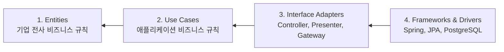
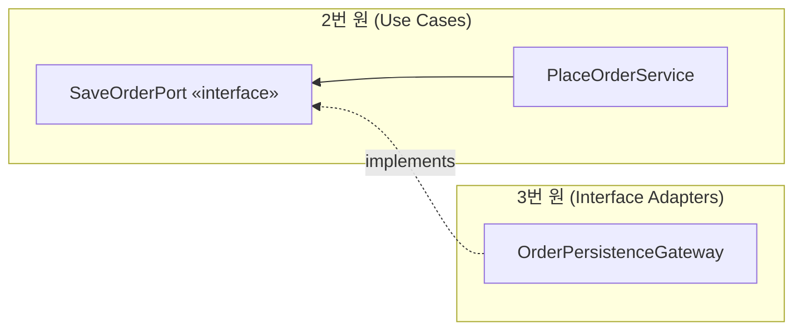
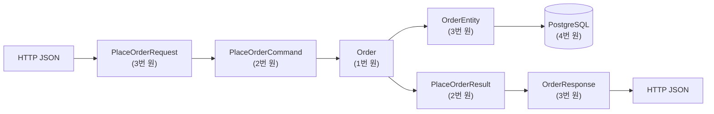

# 클린 아키텍처와 의존성 규칙

동심원 그림보다 중요한 것은 그 안의 한 문장, "의존성은 항상 안쪽을 향한다"입니다. 이 문서는 그 규칙의 정확한 의미, 제어 흐름과 충돌할 때의 해법, 그리고 Spring Boot에서 순수성을 어디까지 지킬지에 대한 현실적인 타협점을 다룹니다.

## 목차
- [1. 핵심 개념 (What)](#1-핵심-개념-what)
- [2. 왜 알아야 하는가 (Why)](#2-왜-알아야-하는가-why)
- [3. 내부 구현 분석 (How)](#3-내부-구현-분석-how)
- [4. 실전 예제](#4-실전-예제)
- [5. 정리](#5-정리)

---

## 1. 핵심 개념 (What)

### 1.1 동심원 구조

로버트 마틴이 정리한 클린 아키텍처는 안쪽부터 Entities → Use Cases → Interface Adapters → Frameworks & Drivers 순으로 중첩된 네 개의 원으로 표현되며, 의존성 화살표는 항상 바깥에서 안쪽으로만 그어집니다.



| 원 | 이름 | 내용 | 변경 빈도 |
|---|---|---|---|
| 1 (최내부) | Entities | 여러 애플리케이션에서 공유되는 핵심 규칙. `Order`, `Money`, 이자 계산 정책 | 가장 낮음 |
| 2 | Use Cases | 이 애플리케이션 고유의 시나리오. "주문을 생성한다" 흐름 | 낮음 |
| 3 | Interface Adapters | 형식 변환. Controller, Presenter, Repository 구현체 | 중간 |
| 4 (최외부) | Frameworks & Drivers | Spring, JPA, PostgreSQL, Kafka | 가장 높음 |

원의 개수는 정해진 것이 아닙니다. 마틴 본인이 "네 개여야 한다는 규칙은 없다"고 명시했습니다. 중요한 것은 안쪽으로 갈수록 추상적이고 안정적이라는 순서입니다 → 안정 의존 원칙은 [10-dependency-rules-and-dip.md](10-dependency-rules-and-dip.md).

### 1.2 The Dependency Rule — 이것이 전부다

> **소스 코드 의존성은 반드시 안쪽을 향해야 한다. 안쪽 원은 바깥쪽 원에 대해 아무것도 알아서는 안 된다.**

여기서 "안다"의 정확한 의미는 **소스 코드에 이름이 등장한다**입니다. 클래스, 함수, 변수, 그리고 데이터 구조까지 포함합니다.

```kotlin
// 위반: Use Case가 Frameworks(4번 원)의 타입을 안다
class PlaceOrderService { fun place(request: HttpServletRequest): ResponseEntity<*> { ... } }   // ✗

// 위반: Entity가 Interface Adapters(3번 원)의 타입을 안다
data class Order(val id: OrderId) { fun toResponse(): OrderResponse = ... }                     // ✗

// 준수: 바깥 원의 이름이 하나도 없다
class PlaceOrderService(private val saveOrder: SaveOrderPort) : PlaceOrderUseCase {
    override fun place(command: PlaceOrderCommand): OrderId = ...                               // ✓
}
```

이 규칙 하나만 지키면 나머지 명칭(Presenter, Gateway, Boundary)은 상황에 맞게 조정해도 됩니다.

### 1.3 경계를 넘는 데이터 구조

원과 원 사이를 데이터가 오갈 때 지켜야 할 세 가지 규칙이 있습니다.

**① 단순한 데이터 구조만 넘긴다**

```kotlin
fun place(entity: OrderEntity): OrderEntity                            // ✗ 영속성 컨텍스트가 함께 넘어옴
fun place(request: PlaceOrderRequest): ResponseEntity<OrderResponse>   // ✗ 프레임워크 타입
fun place(command: PlaceOrderCommand): OrderId                         // ✓ 순수 데이터 구조
```

**② 데이터 구조의 형태는 안쪽 원에 편하게 정한다.** `PlaceOrderCommand`는 유스케이스가 정의합니다. 컨트롤러의 `PlaceOrderRequest`를 그대로 쓰지 않는 이유는 명확합니다. **API 스펙이 바뀌었다고 유스케이스가 바뀌면 안 되기 때문입니다.**

```kotlin
// adapter (3번 원) — API 스펙에 종속. 클라이언트 요구에 따라 바뀜
data class PlaceOrderRequest(
    @field:NotNull val customerId: Long,
    val items: List<ItemRequest>,
    val couponCode: String?,                   // 이 필드가 추가/삭제되어도
) {
    fun toCommand() = PlaceOrderCommand(...)   // 변환 책임은 바깥 원이 진다
}

// use case (2번 원) — 유스케이스 언어. API가 바뀌어도 안 바뀜
data class PlaceOrderCommand(val customerId: CustomerId, val items: List<Item>, val coupon: CouponCode?)
```

**③ 변환 책임은 바깥 원이 진다**

`Request → Command` 변환 코드는 3번 원(어댑터)에 있습니다. 안쪽 원은 바깥 타입을 모르므로 변환할 수 없습니다. 이것은 논리적 필연입니다.

### 1.4 왜 이 규칙이 필요한가 — 변경 빈도의 차이

핵심 근거는 단순합니다. **바깥으로 갈수록 자주 바뀝니다.** "주문 총액 = 항목 합계 - 할인" 규칙은 수년에 한 번 바뀌고, "주문 생성 → 결제 → 이벤트 발행" 흐름은 수개월, REST API 응답 스펙과 Spring Boot 버전은 수주 단위로 바뀝니다.

자주 바뀌는 것이 안 바뀌는 것에 의존해야, 변경의 파급이 밖으로만 흐릅니다. 반대가 되면 Spring Boot 3.5 업그레이드가 도메인 코드 수정으로 이어집니다.

---

## 2. 왜 알아야 하는가 (Why)

### 2.1 헥사고날 / 어니언 / 클린 — 무엇이 같고 무엇이 다른가

세 아키텍처는 자주 혼용되는데, **핵심 원리가 같기 때문에 혼용해도 대체로 문제가 없습니다.** 정확히 정리하면 이렇습니다.

| 항목 | 헥사고날 (2005, Cockburn) | 어니언 (2008, Palermo) | 클린 (2012, Martin) |
|---|---|---|---|
| 핵심 규칙 | 애플리케이션이 포트를 소유, 어댑터가 구현 | 의존성은 안쪽 향함 | 의존성은 안쪽 향함 |
| 강조점 | **대칭성** — 좌/우(driving/driven) 구분 | **계층** — 도메인 모델 중심 동심원 | **원의 서열** — Entities vs Use Cases 분리 |
| 고유 개념 | Port, Adapter, Primary/Secondary | Domain Model / Domain Services / Application Services | Use Case Interactor, Presenter, Humble Object |
| 제시하는 것 | 격리 방법 | 계층 배치 | 격리 방법 + 계층 배치 + 세부 구성요소 |

**같은 것**: 셋 다 "도메인은 인프라를 몰라야 한다"이고, 셋 다 그 수단으로 의존성 역전(DIP)을 씁니다.

**다른 것**: 헥사고날은 **좌우 대칭**을 중요하게 봅니다(입력이 웹이든 테스트든 동등하다는 것이 출발점). 어니언은 **동심원 배치**를 제시하지만 포트/어댑터라는 명시적 이름은 없습니다. 클린은 **Entities와 Use Cases를 분리**하는데 이게 실질적으로 가장 큰 차이입니다 — "여러 애플리케이션이 공유하는 규칙"(Entities)과 "이 앱만의 시나리오"(Use Cases)를 구분하라는 것인데, 단일 서비스에서는 이 구분이 잘 드러나지 않아 대개 하나로 합쳐집니다.

**실무 결론**: 세 개를 구분하려 애쓸 필요가 없습니다. 팀에서 통용되는 이름 하나를 골라 쓰고, 실제로는 "포트를 안쪽이 소유한다"는 규칙만 지키면 됩니다. 이름을 두고 논쟁하는 시간이 구조를 개선하는 시간보다 길어지면 그건 이미 실패입니다.

### 2.2 제어 흐름과 의존성 방향이 반대일 때

클린 아키텍처의 가장 중요한 기술적 논점입니다. 실행 시점의 호출 순서는 `Controller(3번 원) → UseCase(2번 원) → Gateway 구현(3번 원) → Database(4번 원)`입니다. 즉 제어 흐름은 `UseCase → Gateway`로 **바깥을 향합니다**. 그런데 의존성 규칙은 안쪽만 향하라고 합니다. 모순처럼 보입니다.

해법은 인터페이스를 안쪽에 두는 것입니다.



- **제어 흐름**: `PlaceOrderService` → `OrderPersistenceGateway` (런타임, 바깥으로)
- **소스 의존성**: `OrderPersistenceGateway` → `SaveOrderPort` (컴파일타임, 안쪽으로)

두 방향이 반대가 됩니다. 마틴은 이것을 **"의존성 역전으로 흐름을 가로지르는 경계를 만든다"** 고 표현했습니다. 실제 연결은 DI 컨테이너가 런타임에 수행합니다.

**이 지점이 클린 아키텍처의 유일한 기술적 트릭이고, 나머지는 전부 명명과 배치의 문제입니다.**

### 2.3 Presenter — 출력 방향에도 같은 트릭

입력만이 아니라 출력에도 같은 문제가 있습니다. 유스케이스가 결과를 반환하면 그 타입을 누가 정의하는가?

마틴의 원안은 **Output Port + Presenter**입니다.

```kotlin
// 2번 원 — 유스케이스가 출력 포트를 정의
interface PlaceOrderOutputPort { fun present(result: PlaceOrderResult) }

class PlaceOrderService(private val output: PlaceOrderOutputPort) : PlaceOrderUseCase {
    override fun place(command: PlaceOrderCommand) {
        // ...
        output.present(PlaceOrderResult(orderId, totalAmount))   // 반환값 없음
    }
}

// 3번 원 — Presenter가 구현. 포맷팅은 바깥에서
@Component
class PlaceOrderPresenter : PlaceOrderOutputPort {
    var viewModel: OrderViewModel? = null
    override fun present(result: PlaceOrderResult) {
        viewModel = OrderViewModel(result.orderId.value.toString(), "${result.totalAmount.amount}원")
    }
}
```

**솔직한 평가**: 대부분의 Spring Boot REST API에서 Presenter는 과합니다. 반환값을 쓰면 되는 것을 상태 보관 객체와 스코프 관리 문제로 바꿉니다. Presenter가 값어치를 하는 경우는 (1) 출력 대상이 여러 개(HTML/JSON/CSV)이거나, (2) 화면 포맷 로직이 무거운 경우입니다. 그 외에는 **유스케이스가 결과 DTO를 반환하고 컨트롤러가 응답으로 변환**하면 충분하며, 의존성 규칙도 위반하지 않습니다.

---

## 3. 내부 구현 분석 (How)

### 3.1 Use Case 클래스 스타일 vs 서비스 클래스 스타일

같은 로직을 두 방식으로 놓고 비교합니다.

```kotlin
// A. 서비스 클래스 스타일 — 관련 유스케이스를 한 클래스에
@Service @Transactional
class OrderService(
    private val orders: OrderRepository,
    private val payment: PaymentGateway,
    private val events: OrderEventPublisher,
) {
    fun place(command: PlaceOrderCommand): OrderId { ... }
    fun cancel(command: CancelOrderCommand) { ... }
    fun complete(command: CompleteOrderCommand) { ... }
    fun refund(command: RefundOrderCommand) { ... }
}

// B. Use Case 클래스 스타일 — 유스케이스 하나 = 클래스 하나
@Service @Transactional
class PlaceOrderService(private val orders: SaveOrderPort, private val payment: PaymentGateway)
    : PlaceOrderUseCase {
    override fun place(command: PlaceOrderCommand): OrderId { ... }
}

@Service @Transactional
class CancelOrderService(
    private val orders: LoadOrderPort,
    private val saveOrders: SaveOrderPort,
    private val refund: RefundGateway,      // 취소에만 필요한 의존
) : CancelOrderUseCase {
    override fun cancel(command: CancelOrderCommand) { ... }
}
```

| 기준 | 서비스 클래스 | Use Case 클래스 |
|---|---|---|
| 클래스 수 | 적음 | 유스케이스 수만큼 |
| 의존성 명확성 | 흐림(일부 메서드만 쓰는 의존이 섞임) | 정확(그 유스케이스가 쓰는 것만) |
| 클래스 크기 | 시간이 지나며 비대해짐 | 자연히 작게 유지 |
| 머지 충돌 / 테스트 셋업 | 잦음 / 안 쓰는 의존까지 스텁 | 드묾 / 최소 |
| 관련 로직 파악 | 한 파일에서 전체 조망 | 파일 여러 개 열어야 함 |
| 공통 private 헬퍼 공유 | 쉬움 | 별도 클래스로 추출 필요 |

**판단 기준**: 유스케이스가 4개를 넘거나 의존성이 갈리기 시작하면 B로 쪼갭니다. `OrderService`가 의존성 8개를 받고 있는데 각 메서드는 그중 2~3개만 쓴다면 이미 신호입니다. 반대로 CRUD 4개만 있는 서비스를 4개 클래스로 쪼개는 것은 파일만 늘리는 일입니다.

**절충안**이 실무에서 가장 흔합니다: 읽기(Query)는 하나의 `OrderQueryService`로 묶고, 쓰기(Command)만 유스케이스별로 분리합니다. 읽기는 규칙이 없고 의존성도 단순하기 때문입니다.

### 3.2 Spring Boot에서 부딪히는 현실 문제 ①: 트랜잭션 경계

가장 난감한 지점입니다. `@Transactional`은 Spring 어노테이션이므로 4번 원의 것인데, 트랜잭션 경계는 **유스케이스 단위**로 잡아야 합니다. 즉 2번 원에 붙여야 합니다. 선택지는 세 가지입니다.

**① 유스케이스 서비스에 `@Transactional`을 붙인다 (권장).** application 모듈이 `spring-tx`에 의존하게 됩니다. 순수하지 않지만 **`spring-tx`는 변경 빈도가 극히 낮고 API가 안정적**이므로 실질적 위험이 없습니다. 대부분의 팀이 이 선택을 합니다.

**② 어댑터에서 트랜잭션을 연다.** 컨트롤러에 `@Transactional`을 붙이면 application은 순수해지지만, 트랜잭션 경계가 진입점마다 흩어지고 배치에서 빠뜨리면 조용히 깨집니다. **권장하지 않습니다.**

**③ 트랜잭션 포트를 만든다**

```kotlin
// application (2번 원)
interface TransactionRunner { fun <T> inTransaction(block: () -> T): T }

class PlaceOrderService(private val tx: TransactionRunner, ...) : PlaceOrderUseCase {
    override fun place(command: PlaceOrderCommand): OrderId = tx.inTransaction { /* ... */ }
}

// adapter-out (3번 원)
@Component
class SpringTransactionRunner(private val template: TransactionTemplate) : TransactionRunner {
    override fun <T> inTransaction(block: () -> T): T = template.execute { block() }!!
}
```

가장 순수하고, 트랜잭션 경계가 코드로 명시적으로 보인다는 부가 이득도 있습니다. 비용은 람다 중첩과 팀 내 학습입니다. 경계가 세밀하게 필요한 경우(부분 커밋, 여러 트랜잭션 분할)에는 오히려 ①보다 낫습니다.

**결론: ①로 시작하고, 트랜잭션 제어가 복잡해지면 ③으로 옮기십시오.**

### 3.3 현실 문제 ②: 프레임워크 어노테이션 침투

`@Service`, `@Component`도 Spring 타입입니다. 엄격히 보면 위반입니다. 선택지는 셋이고, 대부분의 팀은 첫 번째를 고릅니다.

| 방식 | application 모듈의 순수도 | 비용 |
|---|---|---|
| `@Service` 직접 부착 | Spring 의존 | 없음 |
| bootstrap에서 `@Bean` 수동 등록 | 순수 | 유스케이스마다 `@Bean` 메서드 작성 |
| `@ComponentScan` + 어노테이션 없이 `@Configuration` 조립 | 순수 | 동일 |

```kotlin
// bootstrap 모듈 — 수동 등록 방식
@Configuration
class UseCaseConfig {
    @Bean fun placeOrderUseCase(
        save: SaveOrderPort, payment: PaymentGateway, events: OrderEventPublisher,
    ): PlaceOrderUseCase = PlaceOrderService(save, payment, events)
}
```

**솔직한 평가**: 유스케이스가 50개면 `@Bean` 메서드 50개를 손으로 관리해야 하고, 새 의존성을 추가할 때마다 두 곳을 고칩니다. 얻는 것은 "`import org.springframework.stereotype.Service` 한 줄이 없다"입니다.

권장: **`@Service`는 붙이십시오.** 대신 다음 선은 지키십시오.

| 허용 | 금지 |
|---|---|
| `@Service`, `@Component`, `@Transactional` | `@Entity`, `@Column`, `@Table`, `EntityManager` |
| `@Value`(설정 주입), 생성자 주입 | `@RestController`, `HttpServletRequest`, `ObjectMapper` |

기준은 "**교체 가능성이 있는가**"입니다. Spring DI는 앱 수명 내내 안 바뀝니다. JPA와 REST 스펙은 바뀝니다.

### 3.4 현실 문제 ③: 조회 성능

의존성 규칙을 엄격히 지키면 조회가 비효율적이 됩니다. 도메인 객체로 전부 로딩한 뒤 화면에 쓰는 건 필드 3개뿐이고, 컬렉션 매핑 때문에 N+1이 발생합니다. 현실적인 해법은 **읽기 경로를 규칙에서 제외하는 것**입니다.

```kotlin
// adapter-in-web에서 조회 전용 어댑터를 직접 호출 (CQRS의 가벼운 형태)
@RestController
class OrderQueryController(private val queryDao: OrderQueryDao) {   // JPA/QueryDSL 직접 사용
    @GetMapping("/api/orders")
    fun list(@RequestParam customerId: Long): List<OrderSummaryResponse> =
        queryDao.findSummaries(customerId)   // 단일 쿼리, 필요한 컬럼만
}
```

조회에는 비즈니스 규칙이 없으므로 도메인을 거칠 이유가 없습니다. 마틴도 "Humble Object"와 유사한 맥락에서 로직 없는 부분에 규칙을 강제할 필요가 없다고 봅니다. **쓰기 경로만 엄격히 지키고, 읽기는 실용적으로 가십시오.**

---

## 4. 실전 예제

### 4.1 전체 흐름 — 경계를 넘는 데이터의 변환



변환이 4번 일어납니다. 비싸 보이지만 각 변환이 **한 방향의 변경을 흡수**합니다. API에 필드가 추가되어도 `PlaceOrderRequest`와 `toCommand()`만 바뀌고, DB 컬럼이 바뀌어도 `OrderEntity`와 매퍼만 바뀝니다.

### 4.2 코드

```kotlin
// ── 1번 원: Entities ─────────────────────────────
package com.shop.order.domain

data class Order(
    val id: OrderId, val customerId: CustomerId, val lines: List<OrderLine>,
    val status: OrderStatus, val discount: Money,
) {
    val totalAmount: Money get() = lines.fold(Money.ZERO) { a, l -> a + l.subtotal }
    val payableAmount: Money get() = totalAmount - discount

    fun cancel(): Order {
        check(status in setOf(OrderStatus.CREATED, OrderStatus.PAID)) { "취소할 수 없는 상태입니다: $status" }
        return copy(status = OrderStatus.CANCELED)
    }
}

// ── 2번 원: Use Cases ────────────────────────────
package com.shop.order.application

interface CancelOrderUseCase { fun cancel(command: CancelOrderCommand): CancelOrderResult }   // 입력 경계
data class CancelOrderCommand(val orderId: OrderId, val reason: String)
data class CancelOrderResult(val orderId: OrderId, val refunded: Money)

// 출력 포트 (안쪽이 소유, 바깥이 구현)
interface LoadOrderPort { fun findById(id: OrderId): Order? }
interface SaveOrderPort { fun save(order: Order): Order }
interface RefundGateway { fun refund(orderId: OrderId, amount: Money): RefundResult }

@Service
@Transactional
class CancelOrderService(
    private val loadOrder: LoadOrderPort,
    private val saveOrder: SaveOrderPort,
    private val refundGateway: RefundGateway,
) : CancelOrderUseCase {
    override fun cancel(command: CancelOrderCommand): CancelOrderResult {
        val order = loadOrder.findById(command.orderId) ?: throw OrderNotFoundException(command.orderId)
        val canceled = saveOrder.save(order.cancel())       // 규칙은 1번 원에서 검증
        val refunded = if (order.status == OrderStatus.PAID) {
            when (val r = refundGateway.refund(order.id, order.payableAmount)) {
                is RefundResult.Success -> order.payableAmount
                is RefundResult.Failure -> throw RefundFailedException(order.id, r.reason)
            }
        } else Money.ZERO
        return CancelOrderResult(canceled.id, refunded)
    }
}

// ── 3번 원: Interface Adapters ───────────────────
@RestController
@RequestMapping("/api/orders")
class OrderController(private val cancelOrder: CancelOrderUseCase) {
    @PostMapping("/{id}/cancel")
    fun cancel(@PathVariable id: Long, @RequestBody req: CancelRequest): CancelResponse {
        val result = cancelOrder.cancel(CancelOrderCommand(OrderId(id), req.reason))
        // 표현 형식(금액 포맷)은 여기서 결정한다
        return CancelResponse(result.orderId.value, result.refunded.amount.toPlainString())
    }
}

@Component
class OrderPersistenceGateway(private val jpa: OrderJpaRepository) : LoadOrderPort, SaveOrderPort {
    override fun findById(id: OrderId): Order? = jpa.findByIdOrNull(id.value)?.toDomain()
    override fun save(order: Order): Order = jpa.save(OrderEntity.from(order)).toDomain()
}
```

컨트롤러는 `CancelOrderService`를 모르고, 서비스는 `OrderPersistenceGateway`를 모릅니다. 그런데 런타임에는 연결됩니다. 이것이 의존성 역전의 결과입니다.

### 4.3 순수성 수준 선택 가이드

"어디까지 지킬 것인가"는 팀 규모와 도메인 복잡도의 함수입니다.

| 수준 | 적용 내용 | 적합한 팀/도메인 |
|---|---|---|
| **L0** | 레이어드 유지, 엔티티=도메인 | 1~3인, CRUD 중심 |
| **L1** | Repository 인터페이스를 도메인 패키지로 이동. 단일 모듈 | 3~5인, 규칙 일부 존재 |
| **L2** | L1 + 도메인/JPA 엔티티 분리 + Command/Result DTO | 5~10인, 규칙 복잡 |
| **L3** | L2 + Gradle 멀티모듈 + ArchUnit 강제 | 10인 이상, 장기 운영, MSA 예정 |
| **L4** | L3 + Presenter/Output Port + `@Service` 제거 | 사실상 권장하지 않음 |

**대부분의 팀에게 L2가 최적점입니다.** L3는 모듈 경계가 실제로 팀 경계와 일치할 때만 값어치가 있고, L4는 얻는 것 대비 유지 비용이 명백히 큽니다. 수준을 올리는 신호는 코드가 아니라 사건입니다 — L0 → L1은 "도메인 테스트에 DB가 필요해서 CI가 느려짐", L1 → L2는 "같은 규칙이 세 곳에 복사됨 / 엔티티에 `@JsonIgnore`가 늘어남", L2 → L3는 "팀이 갈라져 같은 패키지에서 충돌 / MSA 분리 로드맵 확정"입니다.

### 4.4 규칙을 테스트로 고정

```kotlin
@Test
fun `안쪽 원은 바깥 원을 몰라야 한다`() {
    val classes = ClassFileImporter().importPackages("com.shop.order")
    noClasses().that().resideInAPackage("..domain..").should().dependOnClassesThat()
        .resideInAnyPackage("..application..", "..adapter..", "org.springframework..", "jakarta.persistence..")
        .check(classes)
    noClasses().that().resideInAPackage("..application..").should().dependOnClassesThat()
        .resideInAnyPackage("..adapter..", "org.springframework.web..", "jakarta.persistence..")
        .check(classes)
}
```

`org.springframework.stereotype`과 `org.springframework.transaction`은 의도적으로 허용 목록에 남겨둔 예시입니다. 규칙 작성과 예외 관리는 [16-archunit-enforcing-rules.md](16-archunit-enforcing-rules.md)를 참고하십시오.

---

## 5. 정리

### 동심원과 규칙

| 원 | 알아도 되는 것 | 절대 몰라야 하는 것 |
|---|---|---|
| Entities | 자기 자신, 표준 라이브러리 | Use Case, 어댑터, 프레임워크 |
| Use Cases | Entities, 자신이 정의한 포트 | 어댑터 구현체, 웹/JPA 타입 |
| Interface Adapters | Use Cases, Entities, 프레임워크 | 다른 어댑터의 내부 |
| Frameworks | 전부 | - |

### 세 아키텍처 비교

핵심 원리(의존성 역전)는 셋 다 같습니다. 고유 기여만 다릅니다 — 헥사고날은 좌우 대칭과 포트/어댑터 명명, 어니언은 동심원 계층 배치, 클린은 Entities/Use Cases 분리와 구성요소 명세입니다. 실무에서는 팀에 익숙한 이름 하나를 고르면 됩니다.

### 현실 타협 요약

| 논점 | 이상 | 실무 권장 |
|---|---|---|
| 트랜잭션 | `TransactionRunner` 포트 | `@Transactional` 직접 사용 |
| DI 어노테이션 | bootstrap에서 수동 `@Bean` | `@Service` 직접 부착 |
| 출력 | Output Port + Presenter | 결과 DTO 반환 |
| 조회 | 유스케이스 경유 | 조회 전용 어댑터 직접 호출 |
| 유스케이스 클래스 | 1 유스케이스 = 1 클래스 | 쓰기만 분리, 읽기는 묶음 |

### 트레이드오프

- **순수성은 목표가 아니라 수단입니다.** `@Service` 하나를 제거하려고 `@Bean` 50개를 관리하는 것은 비용이 이득을 넘어섭니다.
- **경계를 넘는 DTO는 진짜 이득이 있지만 균일하게 적용할 필요는 없습니다.** 규칙이 있는 쓰기 경로에는 적용하고, 조회 경로는 예외로 두십시오.
- **아키텍처 수준을 미리 올리지 마십시오.** L2로 시작한 프로젝트가 L3가 필요해지는 시점은 명확한 사건으로 나타납니다. 그 전에 올리면 이득 없이 비용만 냅니다.

> **핵심 포인트**: 클린 아키텍처에서 실제로 지켜야 할 것은 **"안쪽 원은 바깥쪽 원의 이름을 소스 코드에 쓰지 않는다"** 한 문장이고, 동심원 그림·Presenter·Interactor 같은 명칭은 전부 이 규칙을 설명하기 위한 장치입니다. 제어 흐름이 바깥으로 나가야 하는 지점에서는 인터페이스를 안쪽에 두어 소스 의존성만 뒤집습니다 — 이것이 유일한 기술적 핵심입니다. 헥사고날·어니언과 원리가 같으므로 이름을 두고 논쟁할 시간에 "이 클래스가 import하는 것들이 나보다 자주 바뀌는가"를 물어보는 편이 낫고, Spring Boot 환경에서는 `@Service`와 `@Transactional` 정도의 침투를 받아들이는 실용적 선을 긋는 것이 장기적으로 유지되는 유일한 방법입니다.

---

## 관련 문서

- [10-dependency-rules-and-dip.md](10-dependency-rules-and-dip.md) — 의존성 규칙의 원리와 DIP
- [11-layered-architecture-and-limits.md](11-layered-architecture-and-limits.md) — 레이어드 아키텍처와 그 한계
- [12-hexagonal-architecture.md](12-hexagonal-architecture.md) — 헥사고날 아키텍처: 포트와 어댑터
- [14-module-boundary-and-ddd.md](14-module-boundary-and-ddd.md) — 모듈 경계와 DDD
- [15-common-module-antipattern.md](15-common-module-antipattern.md) — common 모듈 안티패턴
- [16-archunit-enforcing-rules.md](16-archunit-enforcing-rules.md) — ArchUnit으로 규칙 강제하기
- [17-modular-monolith-to-msa.md](17-modular-monolith-to-msa.md) — 모듈러 모놀리스에서 MSA로 / [01-msa-fundamentals.md](01-msa-fundamentals.md) — MSA 기초
- [../build-tool/02-gradle-multi-module.md](../build-tool/02-gradle-multi-module.md) — Gradle 멀티모듈 설정 실무
- [../spring/architecture/01-modular-monolith-spring-modulith.md](../spring/architecture/01-modular-monolith-spring-modulith.md) — Spring Modulith

---
*참고: Kotlin 2.0 / Spring Boot 3.x / Gradle 8.x 기준*
