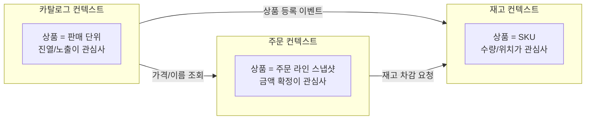
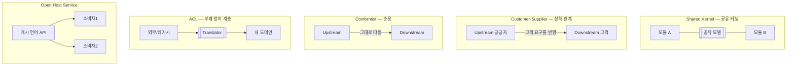
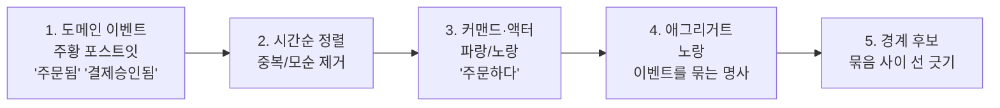
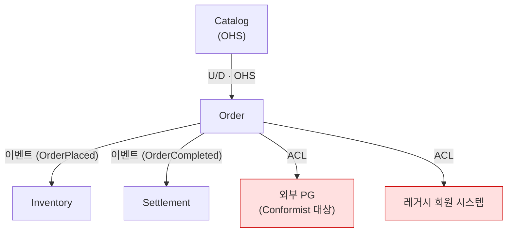

# 모듈 경계 설계: DDD 바운디드 컨텍스트

모듈을 나누는 기준은 "코드의 종류"가 아니라 "말이 통하는 범위"다. 바운디드 컨텍스트(Bounded Context)로 경계를 긋고, 컨텍스트 매핑(Context Mapping)으로 경계 간 관계를 설계하는 방법을 다룬다.

## 목차
- [1. 핵심 개념 (What)](#1-핵심-개념-what)
- [2. 왜 알아야 하는가 (Why)](#2-왜-알아야-하는가-why)
- [3. 내부 구현 분석 (How)](#3-내부-구현-분석-how)
- [4. 실전 예제](#4-실전-예제)
- [5. 정리](#5-정리)

---

## 1. 핵심 개념 (What)

### 1.1 모듈을 나누는 잘못된 기준들

멀티모듈 프로젝트를 만들어본 사람이라면 다음 세 가지 중 하나는 해봤을 것이다.

**(1) 기술 레이어별 분리 — `controller` / `service` / `repository` / `domain`**

```
myapp/
├── myapp-web/          # 모든 Controller
├── myapp-service/      # 모든 Service
├── myapp-repository/   # 모든 Repository
└── myapp-domain/       # 모든 Entity
```

"주문 취소 시 쿠폰을 복구한다"는 요구사항 하나에 4개 모듈이 전부 바뀐다. 모듈이 4개라는 사실이 아무것도 막아주지 못한다. 이건 모듈이 아니라 **패키지에 build.gradle을 붙인 것**이다.

**(2) 엔티티별 분리 — `user` / `order` / `product` / `coupon`**

DB 테이블 하나당 모듈 하나. 언뜻 도메인 분리처럼 보이지만, 테이블은 "데이터 구조"지 "비즈니스 능력"이 아니다. 결과적으로 모듈 간 호출이 폭발한다. 주문 하나 만들려면 `user` → `product` → `coupon` → `point` → `delivery`를 전부 호출해야 한다.

**(3) 팀 편의상 분리 — "A팀이 만든 거", "레거시라 못 건드리는 거"**

경계가 조직도의 스냅샷일 뿐이라 조직 개편 한 번에 무너진다.

### 1.2 바운디드 컨텍스트: 같은 단어, 다른 의미

DDD가 제시하는 기준은 다르다. **"이 단어가 여기서와 저기서 같은 뜻인가?"**

전자상거래에서 "상품(Product)"을 보자.

| 맥락 | "상품"이 의미하는 것 | 핵심 속성 |
|---|---|---|
| 카탈로그(Catalog) | 고객에게 보여줄 판매 단위 | 이름, 설명, 이미지, 카테고리, 노출 여부 |
| 주문(Order) | 주문 시점에 확정된 스냅샷 | 상품명, 결제 금액, 수량 (변경 불가) |
| 재고(Inventory) | 창고에서 세는 물리적 물건 | SKU, 로케이션, 가용 수량, 안전 재고 |
| 정산(Settlement) | 판매자에게 정산할 매출 항목 | 수수료율, 공급가, 부가세 |

이 넷은 **다른 개념**이다. 카탈로그에서 상품명을 바꿔도 이미 접수된 주문의 상품명은 바뀌면 안 된다. 재고는 SKU 단위인데 카탈로그는 옵션 조합 단위다.

그런데 이걸 하나의 `Product` 엔티티로 만들면 어떻게 되나. 필드가 40개짜리 God Entity가 되고, 카탈로그 팀이 필드 하나 추가할 때마다 정산 배치가 깨진다.

> **바운디드 컨텍스트란**: 특정 도메인 모델이 일관된 의미를 갖는 명시적 경계. 경계 안에서는 용어가 한 가지 뜻만 갖고, 경계를 넘으면 번역이 필요하다.

### 1.3 유비쿼터스 언어와 모듈 경계

유비쿼터스 언어(Ubiquitous Language)는 "기획자·개발자·도메인 전문가가 같은 단어를 같은 뜻으로 쓰자"는 규약이다. 그런데 현실에서 회사 전체가 같은 단어를 같은 뜻으로 쓰는 일은 없다. 물류팀의 "출고"와 CS팀의 "출고"는 다르다.

그래서 DDD는 **"전사 통일 사전을 만들자"가 아니라 "언어가 통일되는 최대 범위를 찾아서 그게 경계다"**라고 말한다.



**실무 감별법**: 회의에서 "그 상품이요? 아, 저희 쪽 상품 말고 물류 상품이요"라는 말이 나오는 순간, 거기가 경계다.

### 1.4 애그리거트와 트랜잭션 경계

애그리거트(Aggregate)는 **함께 변경되어야 일관성이 유지되는 객체 묶음**이다. 그리고 애그리거트는 트랜잭션의 단위다.

```kotlin
// 주문 애그리거트 — Order가 루트, OrderLine은 내부
class Order private constructor(
    val id: OrderId,
    val customerId: CustomerId,      // 다른 애그리거트는 ID로만 참조
    private val lines: MutableList<OrderLine>,
    var status: OrderStatus,
) {
    // 불변식(invariant)은 애그리거트 안에서만 보장된다
    fun cancel() {
        require(status == OrderStatus.PLACED) { "배송 시작 후에는 취소 불가" }
        status = OrderStatus.CANCELLED
        lines.forEach { it.cancel() }
    }
}
```

핵심 규칙 세 가지:

1. **하나의 트랜잭션에서는 하나의 애그리거트만 변경한다.**
2. **다른 애그리거트는 ID로만 참조한다** (객체 참조 금지 → JPA 연관관계로 끌려들어가지 않게).
3. **애그리거트 간 일관성은 이벤트로 최종 일관성(eventual consistency)을 맞춘다.**

이 규칙을 지키면 **모듈 경계와 트랜잭션 경계가 자연히 일치**한다. 그리고 그때 비로소 나중에 프로세스를 분리해도 트랜잭션이 깨지지 않는다.

반대로 하나의 `@Transactional` 안에서 주문·재고·쿠폰을 다 건드리고 있다면, 그 세 모듈은 물리적으로 분리 불가능한 상태다. 억지로 쪼개면 분산 모놀리스가 된다.

---

## 2. 왜 알아야 하는가 (Why)

### 2.1 경계를 잘못 그었을 때의 증상

문서나 다이어그램이 아니라, **일상 업무에서 나타나는 증상**으로 진단하는 게 정확하다.

| 증상 | 무슨 뜻인가 | 처방 |
|---|---|---|
| 기능 하나 고치는데 3개 모듈 PR이 필요 | 응집도가 낮음. 함께 변하는 것이 흩어져 있다 | 경계를 합치거나 다시 긋기 |
| 모듈 A가 B의 메서드를 20개 호출 | 경계가 잘못됨. 사실상 한 덩어리 | 합치기 |
| B의 엔티티를 A가 직접 조작 | 캡슐화 실패. 경계가 존재하지 않는 것과 같음 | 공개 API 정의 |
| 순환 의존(A→B→A) | 방향이 없음. 사실 하나의 컨텍스트이거나, 이벤트로 뒤집어야 함 | 이벤트로 역전 |
| 같은 이름의 클래스가 계속 충돌 | 같은 단어를 다른 뜻으로 쓰고 있다는 신호 (정상일 수 있음) | 각자 갖되 번역 계층 추가 |
| DTO 하나 고쳤는데 전체 재배포 | 계약이 공유 클래스로 새고 있음 | [15-common-module-antipattern.md](15-common-module-antipattern.md) |

**정량 지표 하나**: 커밋 히스토리에서 "함께 변경되는 파일" 쌍을 세보면 된다.

```bash
# 최근 500커밋에서 같이 바뀐 모듈 쌍 세기
git log --format='%H' -500 | while read c; do
  git show --name-only --format='' "$c" | awk -F/ 'NF>1{print $1}' | sort -u | paste -sd, -
done | sort | uniq -c | sort -rn | head -20
```

`order,inventory,coupon` 조합이 상위에 계속 뜬다면 그 셋은 하나의 컨텍스트일 가능성이 높다.

### 2.2 경계는 나중에 바꾸기 가장 비싼 결정이다

프레임워크 교체나 DB 마이그레이션은 힘들어도 유한한 작업이다. 그런데 잘못된 경계는:

- 팀 배치에 영향을 준다 (모듈 = 소유권)
- 데이터 모델에 각인된다 (테이블 분리는 되돌리기 어렵다)
- API 계약으로 외부에 노출된다 (하위 호환 부담)

그래서 **경계는 되도록 늦게, 그러나 되돌릴 수 있는 형태로 실험**해야 한다. 모듈러 모놀리스가 그 실험장이다 ([17-modular-monolith-to-msa.md](17-modular-monolith-to-msa.md)).

---

## 3. 내부 구현 분석 (How)

### 3.1 컨텍스트 매핑 패턴

경계를 그었다면 다음 질문은 "경계 간 관계는 어떤 종류인가"다. Eric Evans가 정리한 패턴 중 실무에서 자주 쓰는 다섯 가지.



| 패턴 | 언제 쓰나 | 대가 |
|---|---|---|
| **Shared Kernel** | 두 팀이 아주 작고 안정된 모델을 공유해야 할 때 | 변경 시 양쪽 합의 필수. 커지면 재앙 |
| **Customer-Supplier** | 상류 팀이 하류 팀 요구를 반영해줄 의사가 있을 때 | 상류의 릴리스 일정에 종속 |
| **Conformist** | 상류가 우리 요구를 들어줄 이유가 없을 때 (외부 SaaS) | 상류 모델의 이상한 점까지 그대로 흡수 |
| **ACL** | 상류 모델이 내 도메인을 오염시키면 안 될 때 | 번역 코드 유지비 |
| **Open Host Service** | 소비자가 여럿이라 1:1 협상이 불가능할 때 | 공개 계약의 하위 호환 부담 |

**선택 가이드**: 내부 모듈 간에는 Customer-Supplier 또는 OHS. 외부 시스템·레거시와는 ACL. Shared Kernel은 "정말 어쩔 수 없을 때"만.

### 3.2 ACL(Anti-Corruption Layer) 실전 구현

가장 실전 가치가 높은 패턴이다. 외부 결제 PG를 붙인다고 하자.

**ACL 없는 코드 — 오염 진행 중**

```kotlin
// 도메인 서비스에 PG사 응답 구조가 그대로 침투
@Service
class PaymentService(private val pgClient: TossPaymentClient) {
    fun confirm(orderId: Long, paymentKey: String, amount: Long) {
        val res = pgClient.confirm(paymentKey, orderId.toString(), amount)
        // res.status 는 "DONE" | "CANCELED" | "ABORTED" ... PG사 문자열
        if (res.status == "DONE") {
            order.markPaid(res.approvedAt, res.method)  // PG 용어가 도메인으로
        } else if (res.status == "ABORTED") {
            // ABORTED가 우리 도메인에서 무슨 뜻인지 아무도 모른다
        }
    }
}
```

PG를 교체하는 순간 도메인 코드 전체를 뒤져야 한다. 게다가 `"DONE"` 같은 문자열이 도메인 로직 조건문에 박힌다.

**ACL 적용 — 번역 계층으로 차단**

```kotlin
// ── 도메인 계층: 외부를 전혀 모른다 ──
package com.shop.payment.domain

enum class PaymentResult { APPROVED, DECLINED, PENDING }

data class PaymentApproval(
    val transactionId: TransactionId,
    val approvedAmount: Money,
    val approvedAt: Instant,
    val method: PaymentMethod,   // 우리가 정의한 enum
)

interface PaymentGateway {                     // 아웃바운드 포트
    fun approve(command: ApproveCommand): PaymentApproval
}
```

```kotlin
// ── ACL: 외부 모델 ↔ 도메인 모델 번역만 담당 ──
package com.shop.payment.acl

@Component
class TossPaymentAdapter(private val client: TossPaymentClient) : PaymentGateway {

    override fun approve(command: ApproveCommand): PaymentApproval =
        try {
            toDomain(client.confirm(toTossRequest(command)))
        } catch (e: TossApiException) {
            throw toDomainException(e)                   // 예외도 번역 대상
        }

    private fun toDomain(res: TossConfirmResponse) = PaymentApproval(
        transactionId = TransactionId(res.paymentKey),
        approvedAmount = Money.of(res.totalAmount),
        approvedAt = Instant.parse(res.approvedAt),
        method = toDomainMethod(res.method),
    )

    // PG사 한글 문자열 → 우리 enum. 이 매핑 테이블이 ACL의 본체다
    private fun toDomainMethod(raw: String) = when (raw) {
        "카드" -> PaymentMethod.CARD
        "가상계좌" -> PaymentMethod.VIRTUAL_ACCOUNT
        "간편결제" -> PaymentMethod.EASY_PAY
        else -> PaymentMethod.ETC
    }

    private fun toDomainException(e: TossApiException) = when (e.code) {
        "ALREADY_PROCESSED_PAYMENT" -> DuplicatePaymentException(e.message)
        "REJECT_CARD_COMPANY"       -> PaymentDeclinedException(e.message)
        "EXCEED_MAX_DAILY_PAYMENT"  -> PaymentLimitExceededException(e.message)
        else -> PaymentGatewayException(e.message)
    }
}
```

레거시 시스템을 감쌀 때도 원리는 같다. `del_yn='Y'`, `grade_cd='02'` 같은 레거시 어휘를 어댑터 안에서 전부 소화하면, 도메인 코드에 그 어휘가 단 한 번도 등장하지 않는다. 나중에 레거시를 걷어낼 때 이 클래스만 지우면 된다.

**ACL이 지불하는 대가를 솔직히 말하면**: 클래스가 2배로 늘고, 필드 추가 시 두 곳을 고쳐야 한다. 외부 API를 한 곳에서만 부르고 교체 계획도 없다면 ACL은 오버엔지니어링이다. **ACL이 값을 하는 조건**은 (a) 외부 모델이 우리와 개념이 다르거나, (b) 교체 가능성이 있거나, (c) 여러 도메인 지점에서 그 외부 개념이 등장할 때다.

### 3.3 이벤트 스토밍으로 경계 찾기

경계를 회의실에서 찾는 실무 절차. 개발자·기획자·도메인 전문가가 함께 3~4시간.



**핵심은 5단계다.** 경계를 찾는 신호:

- 포스트잇 사이 화살표가 **성기게 지나가는 지점** → 좋은 경계 후보
- 같은 명사가 **다른 속성으로 다시 등장** → 컨텍스트가 바뀌는 지점
- **다른 사람이 설명하기 시작하는 지점** → 조직 경계이자 대개 컨텍스트 경계

**주의**: 이벤트 스토밍 결과를 곧바로 마이크로서비스로 만들지 말 것. 그건 가설이지 결론이 아니다. 모듈로 먼저 구현해서 6개월 살아본 뒤 판단한다.

---

## 4. 실전 예제

주문/재고/카탈로그 세 컨텍스트를 Gradle 모듈로 구성한 예.

```
shop/
├── catalog/
│   ├── src/main/kotlin/com/shop/catalog/
│   │   ├── api/            # 공개 계약 (다른 모듈이 쓰는 유일한 지점)
│   │   ├── domain/
│   │   └── infra/
├── order/
│   ├── api/
│   ├── domain/
│   ├── application/
│   └── acl/                # catalog/inventory 모델을 번역
└── inventory/
```

### 4.1 공개 API를 좁게 정의

```kotlin
// catalog/api — 다른 모듈에 노출되는 전부. 엔티티는 절대 노출하지 않는다
package com.shop.catalog.api

interface CatalogQuery {
    fun findSalable(productId: Long): SalableProduct?
}

/** 판매 가능 상품 스냅샷. Catalog 내부 Product 엔티티와 별개 타입이다 */
data class SalableProduct(
    val productId: Long,
    val name: String,
    val price: Long,
    val sellerId: Long,
)
```

```kotlin
// catalog/infra — 구현. 내부 엔티티를 API 타입으로 변환해서 내보낸다
@Service
internal class CatalogQueryService(
    private val repository: ProductRepository,
) : CatalogQuery {
    override fun findSalable(productId: Long): SalableProduct? =
        repository.findById(productId)
            ?.takeIf { it.isOnSale() }
            ?.let { SalableProduct(it.id, it.displayName, it.currentPrice.amount, it.sellerId) }
}
```

Kotlin의 `internal`은 **모듈(컴파일 단위) 밖에서 접근 불가**를 컴파일러가 강제한다. Gradle 서브프로젝트 = 컴파일 단위이므로, 구현체에 `internal`을 붙이면 다른 모듈에서 아예 참조가 안 된다.

### 4.2 Order가 Catalog를 ACL로 흡수

```kotlin
// order/acl — Catalog의 개념을 Order의 언어로 번역
package com.shop.order.acl

@Component
class ProductSnapshotProvider(private val catalogQuery: CatalogQuery) {

    /** Catalog의 '판매 상품' → Order의 '주문 라인 항목'으로 번역 */
    fun snapshot(productId: Long, quantity: Int): OrderLineItem {
        val product = catalogQuery.findSalable(productId)
            ?: throw ProductNotOrderableException(productId)

        return OrderLineItem(
            productId = product.productId,
            // 주문 시점에 '박제'한다. 이후 카탈로그가 바뀌어도 주문은 불변
            orderedName = product.name,
            unitPrice = Money.of(product.price),
            quantity = Quantity(quantity),
        )
    }
}
```

`SalableProduct`가 아니라 `OrderLineItem`으로 바꿔서 도메인에 들여보내는 게 핵심이다. Order 도메인 코드 어디에도 `SalableProduct` 타입이 나타나지 않는다.

### 4.3 역방향은 이벤트로 — 순환 끊기

Order → Inventory 재고 차감이 필요하다고 동기 호출을 넣으면, 재고 실패 시 주문 롤백 때문에 Inventory → Order 역참조가 생기기 쉽다.

```kotlin
// order — 주문은 이벤트만 발행하고 끝. Inventory의 존재를 모른다
@Service
class PlaceOrderService(
    private val orders: OrderRepository,
    private val events: ApplicationEventPublisher,
) {
    @Transactional
    fun place(command: PlaceOrderCommand): OrderId {
        val order = Order.place(command.customerId, command.items)
        orders.save(order)                            // 트랜잭션은 Order 애그리거트까지만
        events.publishEvent(OrderPlaced(order.id, order.itemsOf()))
        return order.id
    }
}

// inventory — 구독해서 자기 트랜잭션으로 처리
@Component
class InventoryOnOrderPlaced(private val inventories: InventoryRepository) {

    @Async
    @TransactionalEventListener(phase = TransactionPhase.AFTER_COMMIT)
    @Transactional(propagation = Propagation.REQUIRES_NEW)
    fun handle(event: OrderPlaced) {
        event.items.forEach { item ->
            inventories.findBySku(item.sku)?.deduct(item.quantity)
                ?: publishShortage(event.orderId, item.sku)
        }
    }
}
```

의존 방향은 `inventory → order`(이벤트 타입 참조) 한 방향뿐이다. Order는 Inventory의 존재를 모른다. 실패 보상은 Saga로 처리한다 ([05-saga-pattern-deep-dive.md](05-saga-pattern-deep-dive.md)), 이벤트 유실 방지는 Outbox로 ([06-outbox-pattern-guide.md](06-outbox-pattern-guide.md)).

### 4.4 컨텍스트 맵 문서화

경계를 그었으면 **관계 종류를 그림으로 남긴다**. 이 다이어그램이 없으면 6개월 뒤 아무도 왜 이렇게 나뉘었는지 모른다.



표기 규칙: `U/D` = Upstream/Downstream, ACL이 필요한 관계는 색으로 구분. 이 정도만 있어도 신규 입사자 온보딩 시간이 크게 줄어든다.

---

## 5. 정리

| 구분 | 잘못된 기준 | 올바른 기준 |
|---|---|---|
| 분리 축 | 기술 레이어(controller/service) | 비즈니스 능력(주문/재고/정산) |
| 판단 근거 | 테이블 구조, 조직도 | 용어의 의미가 바뀌는 지점 |
| 모델 공유 | 하나의 God Entity를 전 모듈이 공유 | 컨텍스트별 모델 + 번역 계층 |
| 트랜잭션 | 여러 도메인을 하나의 `@Transactional` | 애그리거트 1개 = 트랜잭션 1개 |
| 외부 연동 | 외부 응답 타입이 도메인까지 침투 | ACL에서 번역 후 도메인 타입만 통과 |
| 순환 | A↔B 양방향 호출 | 이벤트로 방향 역전 |

**컨텍스트 매핑 패턴 선택**

| 상황 | 패턴 |
|---|---|
| 내부 모듈, 소비자 여럿 | Open Host Service |
| 내부 모듈, 상류가 협조적 | Customer-Supplier |
| 외부 SaaS, 협상 불가 + 모델도 무난 | Conformist |
| 외부/레거시, 모델이 우리와 다름 | ACL |
| 아주 작고 안정된 값 객체 공유 | Shared Kernel (최소한으로) |

**경계 오류 진단 체크리스트**

- [ ] 기능 하나 수정에 3개 이상 모듈 PR이 필요한가
- [ ] 모듈 간 호출 횟수가 모듈 내부 호출과 비슷한 수준인가
- [ ] 하나의 트랜잭션이 여러 모듈의 데이터를 변경하는가
- [ ] 다른 모듈의 엔티티/DTO 타입이 내 도메인 코드에 등장하는가
- [ ] 순환 의존이 존재하는가
- [ ] 같은 클래스명 충돌이 잦은가 (경계 신호일 수도, 잘못된 공유일 수도)

> **핵심 포인트**: 모듈 경계는 코드를 정리하는 문제가 아니라 **언어가 통일되는 범위를 찾는 문제**다. "상품"이 주문 맥락과 재고 맥락에서 다른 뜻이라면 그건 두 개의 모델이며, 억지로 하나로 합치면 어느 쪽도 제대로 표현하지 못하는 God Entity가 된다. 경계를 그은 뒤에는 관계의 종류(Shared Kernel / Customer-Supplier / Conformist / ACL / OHS)를 명시적으로 결정하고 컨텍스트 맵으로 남겨라. 다만 처음부터 완벽한 경계를 찾으려 하지 말 것 — 경계는 가설이고, 모듈러 모놀리스 안에서 싸게 실험한 뒤 확정하는 것이 가장 저렴하다. ACL을 모든 연동에 기계적으로 붙이는 것도 오버엔지니어링이니, 모델 차이·교체 가능성·확산 범위 셋 중 하나라도 해당할 때만 도입하라.

---

## 관련 문서

```
MSA/01-msa-fundamentals.md ~ MSA/09-msa-troubleshooting.md   (기존)
MSA/10-dependency-rules-and-dip.md
MSA/11-layered-architecture-and-limits.md
MSA/12-hexagonal-architecture.md
MSA/13-clean-architecture-dependency-rule.md
MSA/14-module-boundary-and-ddd.md          ← 현재 문서
MSA/15-common-module-antipattern.md
MSA/16-archunit-enforcing-rules.md
MSA/17-modular-monolith-to-msa.md
```

- [../build-tool/02-gradle-multi-module.md](../build-tool/02-gradle-multi-module.md) — 모듈 분리를 Gradle로 구현하는 방법
- [../spring/architecture/01-modular-monolith-spring-modulith.md](../spring/architecture/01-modular-monolith-spring-modulith.md) — Spring Modulith로 모듈 경계를 런타임 검증
- [../TEST/01-testing-pyramid.md](../TEST/01-testing-pyramid.md) — 모듈 단위 테스트 전략

---
*참고: Kotlin 2.0 / Spring Boot 3.x / ArchUnit 1.3 기준*
