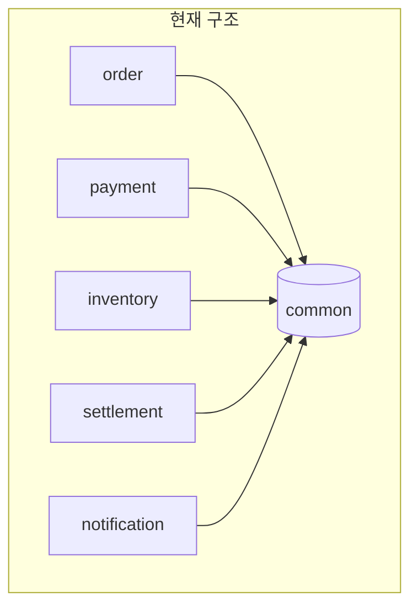
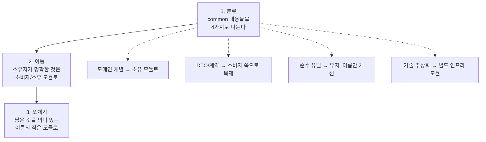
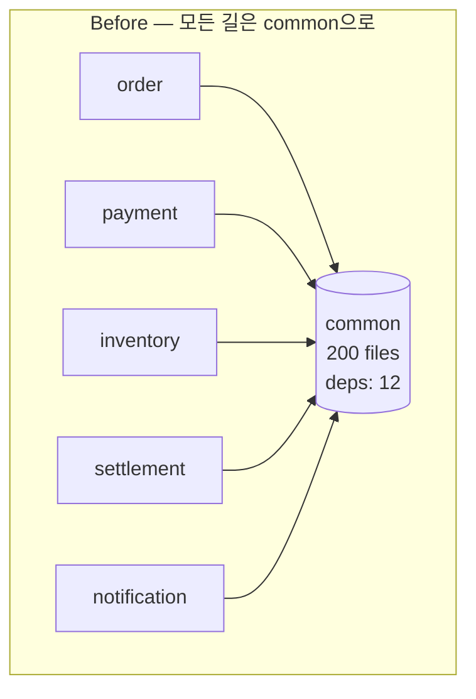
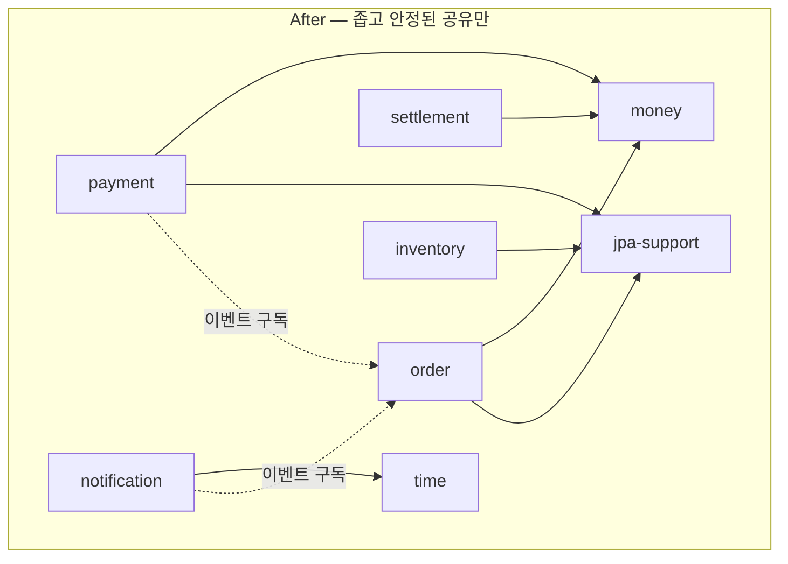

# common 모듈의 함정: 공유 커널 안티패턴

거의 모든 멀티모듈 프로젝트에 `common` 모듈이 있고, 거의 모든 `common` 모듈은 결국 문제가 된다. 왜 생기는지, 왜 위험한지, 무엇을 공유해도 되는지, 그리고 어떻게 해체하는지를 다룬다.

## 목차
- [1. 핵심 개념 (What)](#1-핵심-개념-what)
- [2. 왜 알아야 하는가 (Why)](#2-왜-알아야-하는가-why)
- [3. 내부 구현 분석 (How)](#3-내부-구현-분석-how)
- [4. 실전 예제](#4-실전-예제)
- [5. 정리](#5-정리)

---

## 1. 핵심 개념 (What)

### 1.1 common 모듈이 생기는 자연스러운 과정

누구도 "자, 이제 God 모듈을 만들자"고 결심하지 않는다. 항상 이렇게 시작한다.

```
1주차 — 주문 모듈과 결제 모듈 둘 다 Money 값 객체가 필요하다.
        "복사하긴 좀 그러니까 common에 두자." → common 모듈 탄생 (파일 1개)

3주차 — 에러 응답 포맷을 통일하기로 했다.
        "ApiResponse도 common으로." (파일 5개)

2개월 — "JWT 파싱 유틸도 여러 데서 쓰네." (파일 20개)

6개월 — "BaseEntity(createdAt, updatedAt)는 당연히 common이지." (파일 60개)
        이제 common에 JPA 의존성이 생겼다.

1년   — common/src/main/kotlin/.../dto/ 에 클래스 200개.
        common에 spring-boot-starter-web, jpa, redis, kafka가 전부 붙어 있다.
        common을 고치면 전 모듈 재빌드 + 재배포.
```

각 단계는 그 시점에서 **전부 합리적인 결정**이었다. 그게 이 안티패턴의 무서운 점이다.

### 1.2 이름이 문제를 만든다

`common`, `core`, `shared`, `util`, `base` — 이 이름들의 공통점은 **"무엇을 담지 않아야 하는지 아무 기준도 주지 않는다"**는 것이다.

```
Q: 이 클래스를 common에 넣어도 되나요?
A: common의 정의가 "공통으로 쓰는 것"이니까, 두 군데서 쓰면 넣어도 되죠.
```

반박이 불가능하다. 기준이 없으니 거부할 근거가 없고, 그래서 무한히 자란다. 이것을 **엔트로피 싱크(entropy sink)**라 부를 수 있다. 어디에 둘지 애매한 코드가 전부 흘러 들어가는 곳.

반면 `money-value-object`, `http-error-contract`, `time-provider` 같은 이름은 스스로 경계를 정의한다. `OrderStatus`를 `money-value-object` 모듈에 넣자는 제안은 이름 자체가 거부한다.

### 1.3 무엇이 문제인가: 두 가지 실패 모드



이 구조에서 `common`을 변경하려 할 때 두 가지 중 하나가 일어난다.

**실패 모드 A — common이 얼어붙는다(Frozen Core)**

`Money`의 반올림 정책을 바꿔야 한다. 그런데 5개 모듈이 쓴다. 각 모듈이 어떻게 쓰는지 전부 확인해야 하고, 정산 모듈은 절대 바뀌면 안 된다고 한다. 결국:

```kotlin
// common에 이런 게 쌓인다
fun round(mode: RoundingMode = RoundingMode.HALF_UP): Money  // 기본은 기존 동작 유지
fun roundV2(policy: RoundPolicy): Money                       // 새 요구사항용
fun roundForSettlement(): Money                               // 정산팀 전용
```

common은 지워지지 않는 코드의 무덤이 된다. 아무도 리팩터링하지 못하고, `@Deprecated`가 3년째 붙어 있다.

**실패 모드 B — 모든 모듈이 함께 배포된다(Distributed Monolith)**

common 한 줄 고치면 5개 모듈을 전부 재빌드·재테스트·재배포해야 한다. 서비스를 분리한 의미가 사라진다. **MSA로 갔는데 배포 단위가 여전히 하나**인 상태 — 분산 모놀리스의 대표 증상이다.

두 실패 모드는 동전의 양면이다. A를 피하려면 B를 받아들여야 하고, B를 피하려면 A가 된다.

### 1.4 안정성 지표로 진단하기

Robert C. Martin의 지표를 쓰면 정량 진단이 가능하다.

- **Ca (Afferent Coupling, 구심 결합도)**: 이 모듈에 **의존하는** 모듈 수
- **Ce (Efferent Coupling, 원심 결합도)**: 이 모듈이 **의존하는** 모듈 수
- **I (Instability, 불안정성)** = `Ce / (Ca + Ce)` — 0에 가까울수록 변경하기 어려움

| 모듈 | Ca | Ce | I | 해석 |
|---|---|---|---|---|
| `common` | 8 | 0 | **0.0** | 최대 안정 = 최대 경직. 변경 비용 최악 |
| `order` | 1 | 3 | 0.75 | 변경하기 쉬움. 정상 |
| `money-vo` | 6 | 0 | 0.0 | I는 같지만 **변경 이유가 거의 없어서** 괜찮음 |

**핵심 통찰**: I가 0인 것 자체는 문제가 아니다. **I가 0인데 변경이 잦은 것**이 문제다.

> 위험도 = 의존받는 모듈 수(Ca) × 변경 빈도

`common` 모듈의 파일별 커밋 빈도를 뽑아보면 진짜 문제 파일이 드러난다.

```bash
# common 모듈 내 파일별 변경 횟수 (최근 1년)
git log --since=1.year --name-only --format='' -- common/ \
  | grep -v '^$' | sort | uniq -c | sort -rn | head -20
```

상위에 `dto/`, `enum/`, `constant/` 파일이 뜬다면 그것들이 지금 당장 빼내야 할 대상이다. `StringUtils.kt`가 3년째 안 바뀌었다면 그건 놔둬도 된다.

---

## 2. 왜 알아야 하는가 (Why)

### 2.1 공유해도 되는 것 vs 안 되는 것

판단 기준은 하나다. **"이것이 바뀌는 이유가, 특정 비즈니스 요구사항 때문인가?"**

| 분류 | 예시 | 공유 가능? | 이유 |
|---|---|---|---|
| 순수 유틸 | 날짜 포맷, 문자열 처리, ID 생성기 | ✅ | 비즈니스 요구로 변하지 않음 |
| 기술 추상화 | `Clock`, `EventPublisher` 인터페이스, 로깅 컨텍스트 | ✅ | 인프라 관심사, 도메인 무관 |
| 안정된 값 객체 | `Money`, `Email`, `PhoneNumber` | ⚠️ 조건부 | 개념이 진짜 전사 공통이고 안정적일 때만 |
| 크로스커팅 규약 | 에러 코드 체계, 트레이스 ID 전파 | ⚠️ 조건부 | 별도 모듈로 분리, 버전 관리 필수 |
| **도메인 엔티티** | `Order`, `Product`, `Member` | ❌ | 컨텍스트마다 의미가 다르다 |
| **DTO / API 계약** | `OrderResponse`, `PaymentRequest` | ❌ | 아래 2.2 참조 |
| **비즈니스 규칙** | 할인 정책, 등급 산정 로직 | ❌ | 소유 컨텍스트가 반드시 있다 |
| **설정 / 상수** | `MAX_ORDER_COUNT`, 정책 enum | ❌ | 모듈별로 다른 값이어야 정상 |
| **BaseEntity** | `createdAt`/`updatedAt` 상속 기반 클래스 | ❌ | JPA 의존성이 common에 전염됨 |

`BaseEntity`가 특히 함정이다. 편해 보이지만 **common에 `spring-data-jpa`를 끌고 들어온다**. 그 순간 common을 쓰는 모든 모듈이 JPA에 의존하게 되고, 순수 도메인 모듈조차 JPA 없이는 컴파일되지 않는다.

### 2.2 DTO 공유의 함정

가장 흔하고 가장 비싼 실수다.

```kotlin
// common/dto/OrderDto.kt — 절대 하면 안 되는 것
data class OrderDto(
    val orderId: Long,
    val customerId: Long,
    val items: List<OrderItemDto>,
    val totalAmount: Long,
    val status: String,
    val createdAt: LocalDateTime,
)
```

`order` 모듈이 이걸 만들고, `payment`·`notification`·`settlement`가 이걸 받는다. 무슨 일이 생기나.

**(1) 필드 추가가 전체 재배포를 유발한다**
`couponDiscount` 필드를 추가하면 common 버전이 올라가고, 이 DTO를 쓰지 않는 알림 모듈까지 재빌드된다.

**(2) 필드 제거가 불가능해진다**
`customerId`를 뺄 수 있나? 누가 쓰는지 전부 조사해야 한다. 결국 아무도 안 뺀다.

**(3) 소비자가 필요 없는 필드에도 결합된다**
알림 모듈은 `orderId`와 `status`만 필요한데, `items` 구조가 바뀌면 컴파일이 깨진다.

**(4) 진짜 문제 — 계약이 코드 공유로 대체된다**
DTO를 공유하면 "타입이 맞으니 괜찮다"는 착각이 생긴다. 하지만 나중에 이 모듈들을 별도 서비스로 분리하면 그 타입 안전성은 사라진다. 오히려 **공유 DTO에 기대던 코드일수록 분리 시 더 크게 깨진다**.

**올바른 방식**: 각 소비자가 **자기가 필요한 것만** 자기 타입으로 정의한다.

```kotlin
// notification 모듈이 스스로 정의 — 필요한 3개 필드만
package com.shop.notification.acl

data class OrderNotificationInfo(
    val orderId: Long,
    val customerId: Long,
    val status: OrderStatus,   // notification이 정의한 enum
)
```

중복처럼 보이지만 이건 중복이 아니다. **각자의 계약**이다.

### 2.3 DRY의 오용: 우연한 중복 vs 본질적 중복

`common` 모듈은 대개 DRY(Don't Repeat Yourself)를 근거로 정당화된다. 그런데 DRY의 원문은 이렇다.

> "모든 **지식(knowledge)**은 시스템 내에서 단일하고 명확하며 권위 있는 표현을 가져야 한다."

**코드**가 아니라 **지식**이다. 코드가 같아 보인다고 같은 지식이 아니다.

| 구분 | 우연한 중복 (Accidental) | 본질적 중복 (Essential) |
|---|---|---|
| 정의 | 지금 우연히 모양이 같음 | 같은 규칙을 두 곳에 적어놓음 |
| 판별 질문 | "한쪽 요구사항이 바뀌면 다른 쪽도 반드시 바뀌나?" → **아니오** | → **예** |
| 예시 | 주문의 `status: String`과 배송의 `status: String` | VAT 계산식이 주문과 정산에 각각 |
| 올바른 처방 | **중복을 유지한다** | 하나로 합치되, 소유 모듈을 명확히 |

```kotlin
// 우연한 중복 — 합치면 안 된다
// order 모듈
enum class OrderStatus { PLACED, PAID, SHIPPED, CANCELLED }
// delivery 모듈
enum class DeliveryStatus { READY, PICKED_UP, IN_TRANSIT, DELIVERED }
```

지금은 둘 다 "상태 enum"이지만 변경 이유가 완전히 다르다. 이걸 `common.Status`로 합치면 배송 상태 추가가 주문 모듈에 영향을 준다.

**실무 규칙**: 세 번째로 같은 코드를 쓰게 될 때까지 기다린다(Rule of Three). 두 번은 우연일 수 있다. 그리고 잘못된 추상화를 되돌리는 비용은 중복을 감내하는 비용보다 훨씬 크다.

> "duplication is far cheaper than the wrong abstraction." — Sandi Metz

---

## 3. 내부 구현 분석 (How)

### 3.1 common 해체 전략: 3단계



**1단계 — 분류**

common의 모든 파일을 스프레드시트에 놓고 네 칸으로 나눈다.

| 질문 | 예 → | 아니오 ↓ |
|---|---|---|
| 비즈니스 개념인가? | **소유 모듈로 이동** | ↓ |
| 모듈 간 데이터 전달용인가? | **소비자별로 복제** | ↓ |
| 프레임워크/인프라 의존이 있나? | **infra 모듈로 분리** | ↓ |
| — | **순수 유틸 → 유지** | |

**2단계 — 소비자 쪽으로 밀어내기(Push Down)**

한 모듈만 쓰는 코드가 common에 남아 있는 경우가 놀랍도록 많다. 이건 그냥 옮기면 된다.

```bash
# common의 각 클래스를 실제로 참조하는 모듈 세기
for f in $(find common/src/main -name '*.kt' -exec basename {} .kt \;); do
  n=$(grep -rl "\b$f\b" --include='*.kt' order/ payment/ inventory/ 2>/dev/null \
      | cut -d/ -f1 | sort -u | wc -l)
  echo "$n $f"
done | sort -n
```

`1 XxxUtil` 로 나오는 것들이 1순위 이동 대상이다. 리스크 없이 common을 20~40% 줄일 수 있다.

**3단계 — 의미 있는 이름으로 쪼개기**

```
# Before
common/                       # 200 파일, 의존성 12개

# After
money/                        # Money, Currency (JPA 없음, 순수)
error-contract/               # ErrorCode, ApiErrorResponse
time/                         # Clock 추상화, KST 포맷터
jpa-support/                  # BaseEntity, 컨버터 (JPA 의존은 여기서 격리)
web-support/                  # 공통 필터, 인터셉터
```

이름이 경계를 정의하므로, 새 클래스를 넣을 때 자연스럽게 "이건 여기 아닌데?"가 나온다.

### 3.2 잔여 공유 커널을 안전하게 유지하는 규칙

쪼갠 뒤에도 남는 진짜 공유 모듈에는 규칙을 건다.

1. **의존성 0 원칙** — 공유 모듈은 어떤 프레임워크에도 의존하지 않는다. Kotlin stdlib만.
2. **소유자 명시** — `CODEOWNERS`에 담당 팀을 적고, 변경 시 리뷰 필수.
3. **변경 시 하위 호환** — 필드 추가만 허용, 제거·의미 변경 금지.
4. **크기 상한** — 파일 20개를 넘으면 쪼갠다는 규칙을 팀에 걸어둔다.
5. **ArchUnit으로 강제** — 아래 3.3 및 [16-archunit-enforcing-rules.md](16-archunit-enforcing-rules.md).

### 3.3 규칙을 코드로 강제하기

문서로 정한 규칙은 지켜지지 않는다. 테스트로 만들어야 한다.

```kotlin
@AnalyzeClasses(packages = ["com.shop"])
class SharedModuleRulesTest {

    /** 공유 모듈은 프레임워크에 의존하지 않는다 */
    @ArchTest
    val 공유모듈은_프레임워크에_의존하지_않는다: ArchRule =
        noClasses().that().resideInAPackage("com.shop.shared..")
            .should().dependOnClassesThat()
            .resideInAnyPackage(
                "org.springframework..",
                "jakarta.persistence..",
                "com.fasterxml.jackson..",
            )
            .because("공유 모듈에 프레임워크가 붙으면 전 모듈로 전염된다")

    /** 공유 모듈에 도메인 개념이 들어오는 것을 이름으로 차단 */
    @ArchTest
    val 공유모듈에_도메인_타입_금지: ArchRule =
        noClasses().that().resideInAPackage("com.shop.shared..")
            .should().haveSimpleNameEndingWith("Entity")
            .orShould().haveSimpleNameEndingWith("Dto")
            .orShould().haveSimpleNameEndingWith("Request")
            .orShould().haveSimpleNameEndingWith("Response")
            .because("도메인 엔티티와 DTO는 소유 모듈에 있어야 한다")

    /** 공유 모듈은 다른 어떤 업무 모듈도 참조하지 않는다 */
    @ArchTest
    val 공유모듈은_업무모듈을_모른다: ArchRule =
        noClasses().that().resideInAPackage("com.shop.shared..")
            .should().dependOnClassesThat()
            .resideInAnyPackage("com.shop.order..", "com.shop.payment..", "com.shop.inventory..")
}
```

이 세 개만 CI에 걸어도 common이 다시 비대해지는 것을 상당 부분 막을 수 있다.

---

## 4. 실전 예제

### 4.1 Before — 전형적인 common

```kotlin
// common/src/main/kotlin/com/shop/common/
//   ├── BaseEntity.kt
//   ├── ApiResponse.kt
//   ├── OrderStatus.kt
//   ├── dto/OrderDto.kt
//   ├── dto/PaymentDto.kt
//   ├── util/DateUtils.kt
//   ├── util/JwtUtils.kt
//   └── constant/Constants.kt

@MappedSuperclass
@EntityListeners(AuditingEntityListener::class)
abstract class BaseEntity {                      // ← common에 JPA 전염
    @CreatedDate var createdAt: LocalDateTime? = null
    @LastModifiedDate var updatedAt: LocalDateTime? = null
}

enum class OrderStatus {                          // ← 도메인 개념이 common에
    PLACED, PAID, PREPARING, SHIPPED, DELIVERED, CANCELLED, REFUNDED
}

data class OrderDto(                              // ← 계약이 공유 클래스로
    val orderId: Long, val customerId: Long,
    val items: List<OrderItemDto>, val totalAmount: Long,
    val status: OrderStatus, val createdAt: LocalDateTime,
)

object Constants {                                // ← 모든 모듈의 상수가 한곳에
    const val MAX_ORDER_ITEM_COUNT = 100
    const val DEFAULT_PAGE_SIZE = 20
    const val REFUND_DEADLINE_DAYS = 7
    const val SETTLEMENT_FEE_RATE = 0.033
}
```

```groovy
// common/build.gradle.kts — 의존성이 전부 여기 모인다
dependencies {
    implementation("org.springframework.boot:spring-boot-starter-web")
    implementation("org.springframework.boot:spring-boot-starter-data-jpa")
    implementation("org.springframework.boot:spring-boot-starter-data-redis")
    implementation("io.jsonwebtoken:jjwt-api:0.12.5")
    implementation("com.fasterxml.jackson.module:jackson-module-kotlin")
}
```

이 상태에서 `REFUND_DEADLINE_DAYS`를 14로 바꾸면 **8개 모듈이 재배포**된다.

### 4.2 After — 해체 결과

```
shop/
├── shared/
│   ├── money/                 # Money, Currency — 의존성: 없음
│   ├── time/                  # Clock 추상화, KST 포맷 — 의존성: 없음
│   └── error-contract/        # ErrorCode 인터페이스 — 의존성: 없음
├── support/
│   ├── jpa-support/           # BaseEntity — 의존성: jpa (여기서 격리)
│   └── web-support/           # 공통 필터/핸들러 — 의존성: web
├── order/                     # OrderStatus, OrderResponse 소유
├── payment/                   # PaymentStatus, 결제 계약 소유
└── settlement/                # SETTLEMENT_FEE_RATE 소유
```

**도메인 개념은 소유 모듈로**

```kotlin
// order 모듈 소유. 다른 모듈은 이 enum을 쓰지 않는다
package com.shop.order.domain

enum class OrderStatus {
    PLACED, PAID, PREPARING, SHIPPED, DELIVERED, CANCELLED, REFUNDED;

    fun isCancellable(): Boolean = this in setOf(PLACED, PAID, PREPARING)
}
```

**상수는 소유 모듈로**

```kotlin
// settlement 모듈 소유. 정산 정책은 정산팀 것이다
package com.shop.settlement.domain

@ConfigurationProperties("settlement.policy")
data class SettlementPolicy(
    val feeRate: BigDecimal = BigDecimal("0.033"),
    val closingDayOfMonth: Int = 10,
)
```

`object Constants`가 아니라 `@ConfigurationProperties`인 점도 중요하다. 정책 값은 코드가 아니라 설정이어야 재배포 없이 바뀐다.

**계약은 소비자별로**

```kotlin
// order 모듈이 발행하는 이벤트 — order가 소유하는 공개 계약
package com.shop.order.api

data class OrderPlaced(
    val orderId: Long,
    val customerId: Long,
    val totalAmount: Long,
    val occurredAt: Instant,
)
```

```kotlin
// notification 모듈 — 자기가 필요한 형태로 받아서 자기 타입으로 번역
package com.shop.notification.acl

@Component
class OrderEventTranslator {
    fun toNotificationTarget(event: OrderPlaced) = NotificationTarget(
        customerId = event.customerId,
        template = TemplateKey.ORDER_CONFIRMED,
        params = mapOf("orderId" to event.orderId.toString()),
    )
}
```

**진짜 공유 커널만 남긴다**

```kotlin
// shared/money — 프레임워크 의존 0, 변경 이유가 거의 없음
package com.shop.shared.money

@JvmInline
value class Money private constructor(val amount: BigDecimal) {
    companion object {
        val ZERO = Money(BigDecimal.ZERO)
        fun of(value: Long): Money = Money(BigDecimal.valueOf(value))
    }
    operator fun plus(other: Money) = Money(amount + other.amount)
    operator fun times(qty: Int) = Money(amount * BigDecimal(qty))
    fun isPositive() = amount > BigDecimal.ZERO
}
```

```kotlin
// shared/money/build.gradle.kts
dependencies {
    // 없음. Kotlin stdlib만.
}
```

### 4.3 의존 그래프 비교





After 구조에서 `money`를 바꾸면 order·payment·settlement만 영향을 받는다. 그리고 `money`는 1년에 한 번 바뀔까 말까 한 모듈이다.

### 4.4 점진적 마이그레이션 실무 순서

빅뱅 리팩터링은 실패한다. 순서를 지킨다.

| 순서 | 작업 | 리스크 | 효과 |
|---|---|---|---|
| 1 | 사용처가 1개인 클래스를 소비자로 이동 | 매우 낮음 | common 20~40% 감소 |
| 2 | `common` 신규 추가 금지 규칙 + ArchUnit freeze 도입 | 없음 | 출혈 중단 |
| 3 | JPA/Web 의존 클래스를 `*-support` 모듈로 분리 | 낮음 | 의존성 전염 차단 |
| 4 | 도메인 enum/상수를 소유 모듈로 이동 | 중간 | 진짜 결합 해소 |
| 5 | 공유 DTO를 소비자별 타입으로 복제 후 제거 | 높음 | 계약 결합 해소 |
| 6 | 남은 것을 의미 있는 이름의 모듈로 재편 | 낮음 | 재발 방지 |

**2번이 가장 중요하다.** 출혈을 먼저 멈추지 않으면 아무리 빼내도 다시 찬다.

---

## 5. 정리

| 항목 | 안티패턴 | 대안 |
|---|---|---|
| 모듈 이름 | `common`, `core`, `util`, `shared` | `money`, `time`, `error-contract` — 이름이 경계를 정의 |
| 담는 것 | "두 군데 이상 쓰면 다" | "비즈니스 요구로 변하지 않는 것만" |
| 도메인 엔티티 | common에 배치 | 소유 컨텍스트에 배치 |
| DTO/계약 | 공유 클래스로 전달 | 소비자별 타입 + 번역 계층 |
| 상수/정책 | `object Constants` | 소유 모듈의 `@ConfigurationProperties` |
| BaseEntity | common에 두고 JPA 전염 | `jpa-support` 모듈로 격리 |
| 중복 | 무조건 제거(DRY 맹신) | 우연한 중복은 허용, 본질적 중복만 통합 |
| 규칙 유지 | 코딩 컨벤션 문서 | ArchUnit 테스트로 CI 강제 |

**진단 지표**

| 지표 | 위험 신호 |
|---|---|
| common을 의존하는 모듈 수 (Ca) | 전체 모듈의 절반 이상 |
| common의 월 커밋 수 | 다른 모듈 평균 이상 |
| common의 외부 의존성 수 | 3개 초과 |
| common 내 `Dto`/`Entity`/`Status` 접미사 클래스 | 0개가 아니면 이미 문제 |
| common 파일 수 | 30개 초과 시 쪼갤 시점 |

> **핵심 포인트**: `common` 모듈의 근본 문제는 코드가 많다는 게 아니라 **이름이 아무 기준도 주지 않아서 무엇이든 들어올 수 있다**는 데 있다. 모든 모듈이 의존하는 모듈은 변경 불가능해지거나(Frozen Core), 변경할 때마다 전체가 함께 배포되거나(분산 모놀리스) 둘 중 하나로 귀결된다. 공유해도 되는 것은 **비즈니스 요구로 변하지 않는 것** — 순수 유틸, 기술 추상화, 진짜 안정된 값 객체뿐이다. 도메인 엔티티·DTO·비즈니스 규칙·정책 상수는 반드시 소유 컨텍스트에 둬야 한다. 특히 DTO 공유는 타입 안전성이라는 착각을 주면서 계약 결합을 만들고, 나중에 서비스를 분리할 때 가장 크게 깨진다. 다만 반대 방향 오버엔지니어링도 경계하라 — 모듈 3개짜리 프로젝트에서 `common`을 7개 모듈로 쪼개는 것은 순수한 낭비다. **Ca(의존받는 수) × 변경 빈도**가 실제로 높아진 시점에 손대라.

---

## 관련 문서

```
MSA/01-msa-fundamentals.md ~ MSA/09-msa-troubleshooting.md   (기존)
MSA/10-dependency-rules-and-dip.md
MSA/11-layered-architecture-and-limits.md
MSA/12-hexagonal-architecture.md
MSA/13-clean-architecture-dependency-rule.md
MSA/14-module-boundary-and-ddd.md
MSA/15-common-module-antipattern.md         ← 현재 문서
MSA/16-archunit-enforcing-rules.md
MSA/17-modular-monolith-to-msa.md
```

- [../build-tool/02-gradle-multi-module.md](../build-tool/02-gradle-multi-module.md) — `implementation` vs `api`로 의존성 전염 막기
- [../spring/architecture/01-modular-monolith-spring-modulith.md](../spring/architecture/01-modular-monolith-spring-modulith.md) — 공유 커널 패턴과 모듈 검증
- [../TEST/01-testing-pyramid.md](../TEST/01-testing-pyramid.md) — 모듈 분리 후 테스트 전략

---
*참고: Kotlin 2.0 / Spring Boot 3.x / ArchUnit 1.3 기준*
