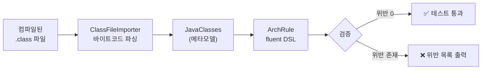
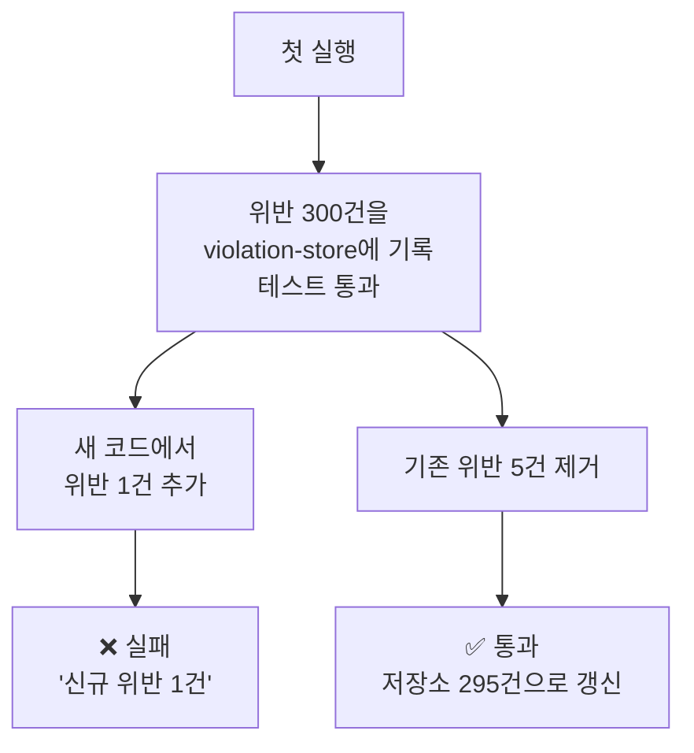

# ArchUnit으로 의존성 규칙 강제하기

아키텍처 규칙을 위키가 아니라 테스트 코드로 적는다. ArchUnit으로 레이어 의존성·패키지 접근·순환 참조·네이밍을 CI에서 자동 검증하는 방법과, 위반이 이미 수백 개인 기존 프로젝트에 도입하는 전략을 다룬다.

## 목차
- [1. 핵심 개념 (What)](#1-핵심-개념-what)
- [2. 왜 알아야 하는가 (Why)](#2-왜-알아야-하는가-why)
- [3. 내부 구현 분석 (How)](#3-내부-구현-분석-how)
- [4. 실전 예제](#4-실전-예제)
- [5. 정리](#5-정리)

---

## 1. 핵심 개념 (What)

### 1.1 문서로 정한 규칙은 지켜지지 않는다

팀 위키에 이런 문장이 있다고 하자.

> "domain 패키지는 Spring/JPA에 의존하지 않는다."

6개월 뒤 확인해보면 `domain` 패키지에 `@Entity`, `@Component`, `@Transactional`이 가득하다. 아무도 악의가 없었다. 다만:

- **사람은 잊는다** — 위키는 온보딩 첫 주에만 읽힌다
- **리뷰는 놓친다** — PR에서 보이는 건 `+import org.springframework...` 한 줄이고, 리뷰어는 로직을 본다
- **급할 땐 예외를 만든다** — "이번만" 이 세 번 쌓이면 규칙은 사라진다
- **IDE가 도와준다** — 자동 임포트는 아키텍처를 모른다

규칙은 **깨질 때 빨간불이 켜져야** 유지된다. 그게 ArchUnit이 하는 일이다.

### 1.2 ArchUnit이란

ArchUnit은 컴파일된 바이트코드를 읽어 클래스·메서드·필드·의존성을 자바 객체로 만들고, 그 위에 fluent DSL로 단언을 거는 테스트 라이브러리다.



특징:

- **일반 JUnit 테스트다** — 별도 인프라, 데몬, 플러그인이 필요 없다
- **소스가 아니라 바이트코드를 본다** — 리플렉션 없이 클래스 로딩도 하지 않는다 (Spring 컨텍스트 불필요)
- **위반 시 정확한 위치를 알려준다** — `Class X depends on Y in (File.kt:42)`

### 1.3 의존성 추가와 최소 골격

```kotlin
// build.gradle.kts
dependencies {
    testImplementation("com.tngtech.archunit:archunit-junit5:1.3.0")
}
```

```kotlin
package com.shop.architecture

import com.tngtech.archunit.core.importer.ImportOption
import com.tngtech.archunit.junit.AnalyzeClasses
import com.tngtech.archunit.junit.ArchTest
import com.tngtech.archunit.lang.ArchRule
import com.tngtech.archunit.lang.syntax.ArchRuleDefinition.noClasses

@AnalyzeClasses(
    packages = ["com.shop"],
    importOptions = [ImportOption.DoNotIncludeTests::class],
)
class ArchitectureTest {

    @ArchTest
    val 도메인은_스프링에_의존하지_않는다: ArchRule =
        noClasses().that().resideInAPackage("..domain..")
            .should().dependOnClassesThat().resideInAPackage("org.springframework..")
            .because("도메인은 프레임워크 교체와 무관해야 한다")
}
```

핵심 3요소:

| 요소 | 역할 |
|---|---|
| `@AnalyzeClasses` | 어떤 패키지를 임포트할지. 결과는 캐싱되어 클래스 내 모든 규칙이 재사용 |
| `@ArchTest` | 이 필드/메서드를 규칙으로 실행. JUnit5 확장이 자동 발견 |
| `ArchRule` | 규칙 자체. `.because(...)`로 실패 메시지에 이유를 남긴다 |

**Kotlin 주의점**: `@ArchTest val`은 인스턴스 필드로 컴파일되지만 ArchUnit이 리플렉션으로 접근하므로 정상 동작한다. 규칙을 여러 클래스에서 공유하려면 `companion object`에 `@JvmField`로 두거나, 아래 4.5처럼 별도 상수 객체로 뽑는다.

`ImportOption.DoNotIncludeTests`를 빼면 테스트 코드까지 검사 대상이 되어 오탐이 쏟아진다. **반드시 넣는다.**

---

## 2. 왜 알아야 하는가 (Why)

### 2.1 아키텍처 부패는 되돌리기 비싸다


위반은 선형이 아니라 지수적으로 쌓인다. 한 사람이 `domain`에서 `@Transactional`을 쓰면 다음 사람은 그걸 보고 따라 한다. **깨진 유리창**이 그대로 작동한다.

ArchUnit은 첫 번째 위반을 막는다. 그게 전부지만, 그게 핵심이다.

### 2.2 다른 수단과 비교

| 수단 | 강제력 | 표현력 | 한계 |
|---|---|---|---|
| 위키 문서 | 없음 | 높음 | 아무도 안 본다 |
| 코드 리뷰 | 사람 의존 | 높음 | 놓치고, 리뷰어마다 다름 |
| Gradle 모듈 분리 | 강함 | 낮음 | 모듈 간만 가능. 모듈 내부 규칙 불가 |
| Kotlin `internal` | 강함 | 낮음 | 컴파일 단위 밖 접근 차단만 가능 |
| 정적 분석(detekt 등) | 중간 | 중간 | 스타일 중심. 의존 방향 표현이 어려움 |
| **ArchUnit** | **강함(CI)** | **높음** | 바이트코드 기준이라 런타임 동적 의존은 못 잡음 |

**Gradle 모듈 분리와의 관계**가 중요하다. 모듈로 나누면 컴파일러가 방향을 강제하므로 ArchUnit보다 강력하다. 하지만:

- 모듈 하나 안에서 `domain` ↔ `infra` 방향은 Gradle이 못 막는다 → ArchUnit
- 모듈을 40개로 쪼개는 건 빌드 시간과 관리 비용을 부른다 → 적당히 나누고 나머지는 ArchUnit

**둘 다 쓴다**가 답이다. 모듈로 굵게 자르고, ArchUnit으로 세밀하게 조인다.

### 2.3 한계도 알고 쓴다

ArchUnit이 못 잡는 것:

- **리플렉션·문자열 기반 의존** — `Class.forName("com.shop.order.OrderService")`
- **Spring 빈 이름 기반 조회** — `applicationContext.getBean("orderService")`
- **런타임 설정 의존** — YAML에 적힌 클래스명
- **데이터베이스 레벨 결합** — 다른 모듈 테이블을 직접 조인하는 네이티브 쿼리

특히 마지막 항목은 모듈 분리에서 가장 흔한 실패 지점인데 ArchUnit으로는 잡히지 않는다. SQL 정적 분석이나 스키마별 계정 분리로 따로 막아야 한다.

---

## 3. 내부 구현 분석 (How)

### 3.1 레이어 의존성 규칙

`layeredArchitecture()`는 레이어를 정의하고 접근 방향을 한 번에 선언한다.

```kotlin
import com.tngtech.archunit.library.Architectures.layeredArchitecture

@ArchTest
val 레이어_의존_방향: ArchRule =
    layeredArchitecture()
        .consideringAllDependencies()                       // 1.x에서 필수
        .layer("Presentation").definedBy("..presentation..", "..controller..")
        .layer("Application").definedBy("..application..")
        .layer("Domain").definedBy("..domain..")
        .layer("Infrastructure").definedBy("..infrastructure..", "..persistence..")

        .whereLayer("Presentation").mayNotBeAccessedByAnyLayer()
        .whereLayer("Application").mayOnlyBeAccessedByLayers("Presentation", "Infrastructure")
        .whereLayer("Domain").mayOnlyBeAccessedByLayers("Application", "Infrastructure", "Presentation")
        .whereLayer("Infrastructure").mayNotBeAccessedByAnyLayer()
        .because("의존은 항상 안쪽(Domain)을 향한다")
```

옵션 두 가지를 알아두면 유용하다.

- `.consideringOnlyDependenciesInLayers()` — 정의된 레이어 간 의존만 검사(외부 라이브러리 무시)
- `.ignoreDependency(A::class.java, B::class.java)` — 특정 예외 허용

**주의**: `Infrastructure`를 `mayNotBeAccessedByAnyLayer()`로 두면 DI 설정 클래스(`@Configuration`)가 위반으로 잡힌다. 설정 클래스를 별도 `bootstrap`/`config` 패키지로 빼고 그 패키지를 검사 대상에서 제외하는 게 실무적이다.

### 3.2 패키지 간 접근 제한

레이어보다 세밀한 통제가 필요할 때.

```kotlin
/** 다른 바운디드 컨텍스트의 내부 구현에 직접 접근 금지 — api 패키지로만 */
@ArchTest
val 컨텍스트_내부_접근_금지: ArchRule =
    noClasses().that().resideInAPackage("com.shop.order..")
        .should().accessClassesThat()
        .resideInAnyPackage("com.shop.inventory.domain..", "com.shop.inventory.infrastructure..")
        .because("Inventory는 com.shop.inventory.api 를 통해서만 접근한다")

/** 반대 방향도 대칭으로 */
@ArchTest
val 재고는_주문_내부를_모른다: ArchRule =
    noClasses().that().resideInAPackage("com.shop.inventory..")
        .should().accessClassesThat()
        .resideInAnyPackage("com.shop.order.domain..", "com.shop.order.application..")

/** Repository는 Application/Domain에서만 호출 — Controller의 직접 접근 차단 */
@ArchTest
val 컨트롤러는_리포지토리를_직접_쓰지_않는다: ArchRule =
    noClasses().that().resideInAPackage("..controller..")
        .should().dependOnClassesThat().resideInAPackage("..repository..")
```

패키지 매칭 문법:

| 표현 | 의미 |
|---|---|
| `..domain..` | 이름에 `domain` 세그먼트가 포함된 모든 패키지 |
| `com.shop.order..` | `com.shop.order`와 그 하위 전체 |
| `com.shop.*.domain` | 정확히 3뎁스, 마지막이 `domain` |
| `..domain` | `domain`으로 끝나는 패키지 (하위는 미포함) |

`accessClassesThat()`과 `dependOnClassesThat()`은 다르다. 전자는 **메서드 호출·필드 접근**만, 후자는 **타입 참조 전체**(파라미터, 필드 타입, 제네릭 등)를 본다. 대개 `dependOnClassesThat()`이 더 촘촘하다.

### 3.3 순환 의존성 금지

가장 가성비가 높은 규칙 하나를 꼽으라면 이것이다.

```kotlin
import com.tngtech.archunit.library.dependencies.SliceRule
import com.tngtech.archunit.library.dependencies.SlicesRuleDefinition.slices

/** 최상위 컨텍스트 간 순환 금지 */
@ArchTest
val 컨텍스트_간_순환_금지: SliceRule =
    slices().matching("com.shop.(*)..")
        .should().beFreeOfCycles()

/** 각 컨텍스트 내부의 서브패키지 순환도 금지 */
@ArchTest
val 서브패키지_순환_금지: SliceRule =
    slices().matching("com.shop.order.(*)..")
        .should().beFreeOfCycles()

/** 특정 의존만 예외 처리가 필요할 때 — ignoreDependency 는 should() 이후에 붙인다 */
@ArchTest
val 순환_금지_예외포함: SliceRule =
    slices().matching("com.shop.(*)..")
        .namingSlices("Context \$1")
        .should().beFreeOfCycles()
        .ignoreDependency(
            JavaClass.Predicates.simpleNameEndingWith("Config"),   // origin
            DescribedPredicate.alwaysTrue(),                        // target
        )
```

`matching("com.shop.(*)..")`의 `(*)`가 슬라이스 식별자다. `com.shop.order.domain.Order`와 `com.shop.order.api.OrderApi`는 둘 다 `order` 슬라이스가 된다.

순환이 발견되면 이런 메시지가 나온다.

```
Cycle detected: Slice order ->
                Slice inventory ->
                Slice order
  1. Dependencies of Slice order
    - Method <com.shop.order.OrderService.place()> calls
      method <com.shop.inventory.InventoryService.deduct()> in (OrderService.kt:34)
  2. Dependencies of Slice inventory
    - Field <com.shop.inventory.InventoryService.orderClient> has type
      <com.shop.order.OrderClient> in (InventoryService.kt:12)
```

어느 줄이 순환을 만드는지 정확히 나오므로 바로 고칠 수 있다. 대개 해법은 [14번 문서](14-module-boundary-and-ddd.md)에서 다룬 **이벤트로 방향 역전**이다.

### 3.4 도메인의 프레임워크 독립 강제

```kotlin
@ArchTest
val 도메인은_프레임워크에_의존하지_않는다: ArchRule =
    noClasses().that().resideInAPackage("..domain..")
        .should().dependOnClassesThat().resideInAnyPackage(
            "org.springframework..",
            "jakarta.persistence..",
            "jakarta.servlet..",
            "com.fasterxml.jackson..",
            "org.hibernate..",
        )
        .because("도메인 모델은 프레임워크 교체·업그레이드와 독립이어야 한다")

/** 어노테이션 기준으로도 한 번 더 */
@ArchTest
val 도메인에_JPA_어노테이션_금지: ArchRule =
    noClasses().that().resideInAPackage("..domain..")
        .should().beAnnotatedWith(Entity::class.java)
        .orShould().beAnnotatedWith(Table::class.java)
        .orShould().beAnnotatedWith(Component::class.java)
        .orShould().beAnnotatedWith(Service::class.java)
```

**현실적인 완화**: 도메인을 100% 순수하게 유지하려면 JPA 엔티티와 도메인 모델을 분리해야 하고, 그 매핑 비용이 만만치 않다. 팀 규모와 도메인 복잡도가 크지 않다면 **"도메인은 Spring에 의존하지 않되 JPA 어노테이션은 허용"** 같은 중간 지점이 실용적이다. 규칙은 팀이 실제로 지킬 수 있는 수준으로 정해야 살아남는다.

```kotlin
// 절충안: Spring만 금지, JPA는 허용
@ArchTest
val 도메인은_스프링만_금지: ArchRule =
    noClasses().that().resideInAPackage("..domain..")
        .should().dependOnClassesThat().resideInAPackage("org.springframework..")
```

### 3.5 네이밍 컨벤션 강제

```kotlin
@ArchTest
val 컨트롤러_네이밍: ArchRule =
    classes().that().areAnnotatedWith(RestController::class.java)
        .should().haveSimpleNameEndingWith("Controller")
        .andShould().resideInAPackage("..controller..")

@ArchTest
val 서비스_네이밍: ArchRule =
    classes().that().areAnnotatedWith(Service::class.java)
        .should().haveSimpleNameEndingWith("Service")
        .orShould().haveSimpleNameEndingWith("UseCase")
        .orShould().haveSimpleNameEndingWith("Handler")

@ArchTest
val 리포지토리_네이밍: ArchRule =
    classes().that().areAssignableTo(org.springframework.data.repository.Repository::class.java)
        .should().haveSimpleNameEndingWith("Repository")

/** 역방향도 검사 — 이름만 Controller인데 어노테이션이 없는 경우 */
@ArchTest
val Controller_접미사면_어노테이션_필수: ArchRule =
    classes().that().haveSimpleNameEndingWith("Controller")
        .should().beAnnotatedWith(RestController::class.java)
        .orShould().beAnnotatedWith(Controller::class.java)

@ArchTest
val 구현체_접미사_금지: ArchRule =
    noClasses().should().haveSimpleNameEndingWith("Impl")
        .because("Impl은 아무 정보도 주지 않는다. JpaOrderRepository 처럼 기술을 드러낼 것")
```

### 3.6 어노테이션 규칙

```kotlin
import com.tngtech.archunit.lang.syntax.ArchRuleDefinition.methods
import com.tngtech.archunit.lang.syntax.ArchRuleDefinition.fields

/** @Transactional은 Application 계층에만 — 트랜잭션 경계를 한곳에 모은다 */
@ArchTest
val 트랜잭션은_애플리케이션_계층에만: ArchRule =
    methods().that().areAnnotatedWith(Transactional::class.java)
        .should().beDeclaredInClassesThat()
        .resideInAnyPackage("..application..", "..service..")
        .because("트랜잭션 경계가 흩어지면 범위를 추적할 수 없다")

/** Controller에 @Transactional 금지 */
@ArchTest
val 컨트롤러에_트랜잭션_금지: ArchRule =
    noMethods().that().areDeclaredInClassesThat().resideInAPackage("..controller..")
        .should().beAnnotatedWith(Transactional::class.java)

/** 필드 주입 금지 */
@ArchTest
val 필드_주입_금지: ArchRule =
    noFields().should().beAnnotatedWith(Autowired::class.java)
        .because("생성자 주입만 사용한다")

/** 공개 API 클래스는 반드시 문서화 어노테이션을 붙인다 */
@ArchTest
val 공개API_스키마_문서화: ArchRule =
    classes().that().resideInAPackage("..api.dto..")
        .and().haveSimpleNameEndingWith("Response")
        .should().beAnnotatedWith(io.swagger.v3.oas.annotations.media.Schema::class.java)
```

### 3.7 ArchUnit 기본 제공 규칙

직접 쓰지 않아도 되는 것들이 이미 있다.

```kotlin
import com.tngtech.archunit.library.GeneralCodingRules.*

@ArchTest
val 필드주입_금지 = NO_CLASSES_SHOULD_USE_FIELD_INJECTION

@ArchTest
val 제네릭예외_금지 = NO_CLASSES_SHOULD_THROW_GENERIC_EXCEPTIONS  // throw Exception/RuntimeException

@ArchTest
val 표준출력_금지 = NO_CLASSES_SHOULD_ACCESS_STANDARD_STREAMS      // System.out.println

@ArchTest
val JUL_금지 = NO_CLASSES_SHOULD_USE_JAVA_UTIL_LOGGING

@ArchTest
val JodaTime_금지 = NO_CLASSES_SHOULD_USE_JODATIME
```

---

## 4. 실전 예제

### 4.1 헥사고날 아키텍처 규칙 세트

포트-어댑터 구조를 그대로 규칙으로 옮긴다 ([12-hexagonal-architecture.md](12-hexagonal-architecture.md)).

```
com.shop.order
├── adapter
│   ├── in/web/          # 인바운드 어댑터
│   └── out/persistence/ # 아웃바운드 어댑터
├── application
│   ├── port/in/         # 유스케이스 인터페이스
│   ├── port/out/        # 아웃바운드 포트 인터페이스
│   └── service/         # 유스케이스 구현
└── domain/
```

```kotlin
@AnalyzeClasses(
    packages = ["com.shop.order"],
    importOptions = [ImportOption.DoNotIncludeTests::class],
)
class HexagonalArchitectureTest {

    @ArchTest
    val 헥사고날_레이어: ArchRule =
        layeredArchitecture()
            .consideringOnlyDependenciesInLayers()
            .layer("InboundAdapter").definedBy("..adapter.in..")
            .layer("OutboundAdapter").definedBy("..adapter.out..")
            .layer("Application").definedBy("..application..")
            .layer("Domain").definedBy("..domain..")

            .whereLayer("InboundAdapter").mayNotBeAccessedByAnyLayer()
            .whereLayer("OutboundAdapter").mayNotBeAccessedByAnyLayer()
            .whereLayer("Application").mayOnlyBeAccessedByLayers("InboundAdapter", "OutboundAdapter")
            .whereLayer("Domain").mayOnlyBeAccessedByLayers("Application", "InboundAdapter", "OutboundAdapter")

    /** 어댑터는 서로를 몰라야 한다 */
    @ArchTest
    val 어댑터_간_직접_참조_금지: ArchRule =
        noClasses().that().resideInAPackage("..adapter.in..")
            .should().dependOnClassesThat().resideInAPackage("..adapter.out..")

    /** 아웃바운드 어댑터는 port.out 의 인터페이스를 구현해야 한다 */
    @ArchTest
    val 아웃바운드_어댑터는_포트_구현: ArchRule =
        classes().that().resideInAPackage("..adapter.out..")
            .and().areAnnotatedWith(Component::class.java)
            .should().implement(
                JavaClass.Predicates.resideInAPackage("..application.port.out.."),
            )
            .because("어댑터는 포트 계약의 구현체여야 한다")

    /** 포트는 인터페이스여야 한다 */
    @ArchTest
    val 포트는_인터페이스: ArchRule =
        classes().that().resideInAnyPackage("..port.in..", "..port.out..")
            .should().beInterfaces()

    /** 애플리케이션 서비스는 구체 어댑터를 모른다 */
    @ArchTest
    val 애플리케이션은_어댑터를_모른다: ArchRule =
        noClasses().that().resideInAPackage("..application..")
            .should().dependOnClassesThat().resideInAPackage("..adapter..")
            .because("의존은 포트 인터페이스를 향해야 한다 (DIP)")
}
```

### 4.2 클린 아키텍처 — Onion 헬퍼 사용

```kotlin
import com.tngtech.archunit.library.Architectures.onionArchitecture

@ArchTest
val 어니언_아키텍처: ArchRule =
    onionArchitecture()
        .domainModels("com.shop.domain.model..")
        .domainServices("com.shop.domain.service..")
        .applicationServices("com.shop.application..")
        .adapter("web", "com.shop.adapter.web..")
        .adapter("persistence", "com.shop.adapter.persistence..")
        .adapter("messaging", "com.shop.adapter.messaging..")
        .withOptionalLayers(true)          // 비어 있는 레이어 허용
        .because("의존 방향은 항상 안쪽을 향한다")
```

`onionArchitecture()`는 다음을 한 번에 검사한다: 도메인 모델은 아무것도 의존하지 않음 / 도메인 서비스는 도메인 모델만 / 애플리케이션은 도메인만 / 어댑터끼리는 서로 모름.

`layeredArchitecture()`를 직접 쓰는 것보다 짧지만 커스터마이즈 여지가 적다. 표준 구조를 따른다면 이쪽이 낫다.

### 4.3 커스텀 규칙 작성

DSL로 표현이 안 되면 `ArchCondition`을 직접 만든다.

```kotlin
import com.tngtech.archunit.core.domain.JavaClass
import com.tngtech.archunit.lang.ArchCondition
import com.tngtech.archunit.lang.ConditionEvents
import com.tngtech.archunit.lang.SimpleConditionEvent

/** 도메인 이벤트는 불변이어야 한다 (모든 필드 final) */
val beImmutable = object : ArchCondition<JavaClass>("불변이어야 한다") {
    override fun check(item: JavaClass, events: ConditionEvents) {
        val mutableFields = item.fields.filter { !it.modifiers.contains(JavaModifier.FINAL) }
        mutableFields.forEach { field ->
            events.add(
                SimpleConditionEvent.violated(
                    field,
                    "${item.name}.${field.name} 이 가변이다 (${item.sourceCodeLocation})",
                )
            )
        }
    }
}

@ArchTest
val 도메인_이벤트는_불변: ArchRule =
    classes().that().resideInAPackage("..domain.event..")
        .should(beImmutable)
        .because("이벤트는 발생한 사실이므로 변경될 수 없다")
```

```kotlin
/** 엔티티는 public 생성자를 노출하지 않는다 (팩토리 메서드 강제) */
val notExposePublicConstructor = object : ArchCondition<JavaClass>("공개 생성자를 노출하지 않는다") {
    override fun check(item: JavaClass, events: ConditionEvents) {
        item.constructors
            .filter { it.modifiers.contains(JavaModifier.PUBLIC) && it.rawParameterTypes.isNotEmpty() }
            .forEach {
                events.add(SimpleConditionEvent.violated(it, "${item.name} 이 공개 생성자를 노출한다"))
            }
    }
}
```

### 4.4 기존 프로젝트 도입: FreezingArchRule

위반이 이미 300개인 프로젝트에 규칙을 켜면 CI가 즉시 빨개진다. `FreezingArchRule`은 **현재 위반을 기록해두고, 새로 추가된 위반만 실패**시킨다.

```kotlin
import com.tngtech.archunit.library.freeze.FreezingArchRule

@ArchTest
val 도메인_프레임워크_독립: ArchRule =
    FreezingArchRule.freeze(
        noClasses().that().resideInAPackage("..domain..")
            .should().dependOnClassesThat().resideInAPackage("org.springframework..")
            .because("점진적으로 제거 중")
    )
```

```properties
# src/test/resources/archunit.properties
freeze.store.default.path=archunit/violation-store
freeze.store.default.allowStoreCreation=true
freeze.store.default.allowStoreUpdate=true

# 위반이 줄어들면 저장소를 자동 갱신 (기본 true)
# false로 두면 위반 감소도 실패로 처리되어 "반드시 저장소를 갱신하라"고 강제할 수 있다
```

동작 방식:



**실무 운영 규칙**

- violation-store 파일을 **git에 커밋한다** (팀이 공유해야 의미가 있음)
- store 파일의 라인 수를 대시보드에 띄운다 → 부채가 줄어드는 게 보인다
- 스프린트마다 "N건 제거" 같은 목표를 잡는다
- `freeze.refreeze=true`는 **절대 상시로 켜지 않는다** — 위반이 자동 승인된다

### 4.5 Gradle 멀티모듈에서의 적용 위치

세 가지 전략이 있다.

| 전략 | 배치 | 장점 | 단점 |
|---|---|---|---|
| A. 모듈마다 | 각 모듈 `src/test`에 각자 | 빠름, 모듈별 커스터마이즈 | 규칙 중복, 모듈 간 규칙 불가 |
| B. 전용 모듈 | `architecture-test` 모듈 하나 | 모듈 간 규칙 가능, 규칙 일원화 | 모든 모듈에 의존 → 빌드 순서 마지막 |
| C. 혼합 | 공통 규칙은 B, 모듈 고유 규칙은 A | 실무 최적 | 설정이 두 군데 |

**C를 권장한다.**

```kotlin
// settings.gradle.kts
include("order", "payment", "inventory", "architecture-test")
```

```kotlin
// architecture-test/build.gradle.kts
dependencies {
    testImplementation("com.tngtech.archunit:archunit-junit5:1.3.0")
    // 검사 대상 모듈들을 전부 클래스패스에 올린다
    testImplementation(project(":order"))
    testImplementation(project(":payment"))
    testImplementation(project(":inventory"))
}

tasks.test {
    useJUnitPlatform()
    // freeze 저장소도 입력으로 등록해야 store 변경 시 재실행된다
    inputs.dir("archunit")
}
```

```kotlin
// architecture-test/src/test/kotlin/.../CrossModuleRulesTest.kt
@AnalyzeClasses(packages = ["com.shop"], importOptions = [ImportOption.DoNotIncludeTests::class])
class CrossModuleRulesTest {

    @ArchTest val 컨텍스트_순환_금지 = CommonRules.NO_CONTEXT_CYCLES
    @ArchTest val 공유모듈_규칙 = CommonRules.SHARED_HAS_NO_FRAMEWORK
    @ArchTest val 내부패키지_접근금지 = CommonRules.ONLY_API_PACKAGE_IS_PUBLIC
}
```

```kotlin
// 규칙을 재사용 가능한 상수로 분리
object CommonRules {

    @JvmField
    val NO_CONTEXT_CYCLES: ArchRule =
        slices().matching("com.shop.(*)..").should().beFreeOfCycles()

    @JvmField
    val SHARED_HAS_NO_FRAMEWORK: ArchRule =
        noClasses().that().resideInAPackage("com.shop.shared..")
            .should().dependOnClassesThat()
            .resideInAnyPackage("org.springframework..", "jakarta.persistence..")
            .because("공유 모듈에 프레임워크가 붙으면 전 모듈로 전염된다")

    /** 컨텍스트별로 한 줄씩 선언하는 편이 명시적이고 디버깅도 쉽다 */
    @JvmField
    val ONLY_API_PACKAGE_IS_PUBLIC: ArchRule =
        noClasses().that().resideOutsideOfPackage("com.shop.order..")
            .should().dependOnClassesThat()
            .resideInAnyPackage(
                "com.shop.order.domain..",
                "com.shop.order.application..",
                "com.shop.order.infrastructure..",
            )
            .because("Order는 com.shop.order.api 를 통해서만 접근한다")
}
```

### 4.6 성능과 CI 통합

**성능**

`@AnalyzeClasses`는 임포트 결과를 **테스트 클래스 단위로 캐싱**한다. 같은 `packages` 설정을 가진 여러 테스트 클래스는 캐시를 공유한다. 실측 기준 클래스 3,000개 임포트에 2~4초, 규칙 하나당 수십~수백 ms.

```properties
# src/test/resources/archunit.properties
# 클래스패스의 외부 라이브러리까지 해석하지 않는다 — 가장 효과 큰 옵션
resolveMissingDependenciesFromClassPath=false

# 특정 패키지만 해석 (일부 규칙에서 상위 타입 정보가 필요할 때)
classResolver.args=com.shop
```

`resolveMissingDependenciesFromClassPath=false`는 임포트 시간을 크게 줄인다. 다만 `areAssignableTo()` 같은 상속 기반 규칙이 외부 타입을 못 찾을 수 있으니, 그런 규칙을 쓴다면 `classResolver.args`로 필요한 패키지를 지정한다.

**CI 통합**

```yaml
# .github/workflows/ci.yml
jobs:
  architecture:
    runs-on: ubuntu-latest
    steps:
      - uses: actions/checkout@v4
      - uses: actions/setup-java@v4
        with: { java-version: '21', distribution: 'temurin' }
      - name: Architecture Test
        run: ./gradlew :architecture-test:test
      - name: 위반 저장소가 변경되었는지 확인
        run: |
          if ! git diff --quiet architecture-test/archunit/violation-store; then
            echo "::warning::violation-store가 변경되었습니다. 의도한 변화인지 확인하세요."
            git diff --stat architecture-test/archunit/violation-store
          fi
```

아키텍처 테스트를 **별도 job으로 분리**하는 이유는 단위 테스트보다 빨리 끝나서 피드백이 이르고, 실패 원인이 명확히 구분되기 때문이다.

---

## 5. 정리

**규칙 카탈로그**

| 목적 | API | 대표 사용 |
|---|---|---|
| 레이어 방향 | `layeredArchitecture()` | `whereLayer("X").mayOnlyBeAccessedByLayers(...)` |
| 클린/헥사고날 | `onionArchitecture()` | `.domainModels().applicationServices().adapter()` |
| 패키지 접근 | `noClasses().that().resideInAPackage()` | `.should().dependOnClassesThat()` |
| 순환 금지 | `slices().matching()` | `.should().beFreeOfCycles()` |
| 네이밍 | `classes().that().areAnnotatedWith()` | `.should().haveSimpleNameEndingWith()` |
| 어노테이션 위치 | `methods().that().areAnnotatedWith()` | `.should().beDeclaredInClassesThat()` |
| 커스텀 | `ArchCondition<JavaClass>` | `classes().should(myCondition)` |
| 점진 도입 | `FreezingArchRule.freeze()` | 신규 위반만 실패 |
| 기본 규칙 | `GeneralCodingRules.*` | 필드 주입/제네릭 예외/`System.out` 금지 |

**도입 체크리스트**

- [ ] `ImportOption.DoNotIncludeTests` 적용했는가
- [ ] 모든 규칙에 `.because(...)` 를 붙였는가 (실패 메시지가 곧 문서다)
- [ ] `resolveMissingDependenciesFromClassPath=false` 로 임포트 시간을 줄였는가
- [ ] 기존 프로젝트라면 freeze로 시작하고 store를 커밋했는가
- [ ] CI에서 별도 job으로 실행되는가
- [ ] 규칙이 팀이 실제로 지킬 수 있는 수준인가

**적용 순서 권장**

1. 순환 의존 금지 (가장 가성비 높음, 위반이 대개 적음)
2. 컨텍스트 간 내부 패키지 접근 금지
3. 레이어 방향
4. 도메인 프레임워크 독립 (freeze로 시작)
5. 네이밍·어노테이션 규칙

> **핵심 포인트**: 아키텍처 규칙은 **깨질 때 빨간불이 켜지지 않으면 존재하지 않는 것과 같다.** ArchUnit은 일반 JUnit 테스트이므로 별도 인프라 없이 CI에 바로 붙고, 위반 위치를 파일:줄 단위로 알려줘 수정 비용이 낮다. 가장 먼저 켤 규칙은 `slices().should().beFreeOfCycles()`와 컨텍스트 내부 패키지 접근 금지 두 가지다. 기존 프로젝트라면 `FreezingArchRule`로 현재 부채를 동결하고 신규 위반만 막는 것부터 시작하라 — 전부 고치고 켜려는 계획은 실행되지 않는다. 다만 규칙을 과하게 세우면 팀이 `@ArchIgnore`를 붙이기 시작하고, 그 순간 규칙 전체의 신뢰가 사라진다. **팀이 실제로 지킬 수 있는 5~10개로 시작해서 늘려가는 것**이 30개로 시작해 무력화되는 것보다 낫다. 그리고 Gradle 모듈 분리로 컴파일러가 막을 수 있는 것은 ArchUnit 대신 모듈로 막아라 — 강제력이 더 강하다.

---

## 관련 문서

```
MSA/01-msa-fundamentals.md ~ MSA/09-msa-troubleshooting.md   (기존)
MSA/10-dependency-rules-and-dip.md
MSA/11-layered-architecture-and-limits.md
MSA/12-hexagonal-architecture.md
MSA/13-clean-architecture-dependency-rule.md
MSA/14-module-boundary-and-ddd.md
MSA/15-common-module-antipattern.md
MSA/16-archunit-enforcing-rules.md          ← 현재 문서
MSA/17-modular-monolith-to-msa.md
```

- [../build-tool/02-gradle-multi-module.md](../build-tool/02-gradle-multi-module.md) — 모듈 분리로 컴파일 타임 강제하기
- [../spring/architecture/01-modular-monolith-spring-modulith.md](../spring/architecture/01-modular-monolith-spring-modulith.md) — Spring Modulith의 `ApplicationModules.verify()`
- [../TEST/01-testing-pyramid.md](../TEST/01-testing-pyramid.md) — 아키텍처 테스트의 위치

---
*참고: Kotlin 2.0 / Spring Boot 3.x / ArchUnit 1.3 기준*
