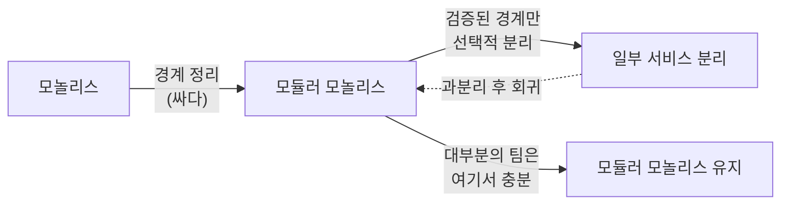
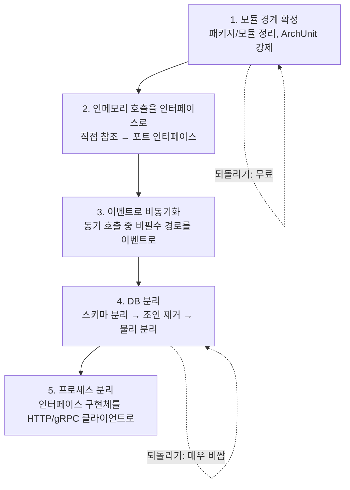
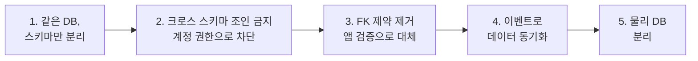
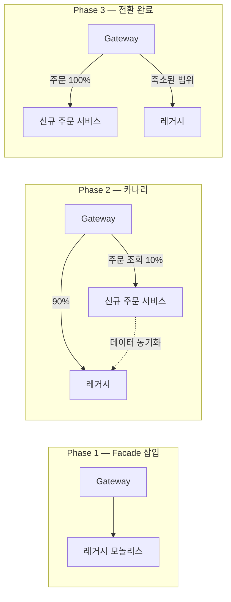

# 모듈러 모놀리스에서 MSA로: 분리 전략과 판단 기준

MSA는 목표가 아니라 특정 문제의 해법이다. 언제 분리해야 하고 언제 분리하면 안 되는지, 분리한다면 어떤 순서로 하는지, 그리고 되돌린 사례들에서 무엇을 배울지를 다룬다.

## 목차
- [1. 핵심 개념 (What)](#1-핵심-개념-what)
- [2. 왜 알아야 하는가 (Why)](#2-왜-알아야-하는가-why)
- [3. 내부 구현 분석 (How)](#3-내부-구현-분석-how)
- [4. 실전 예제](#4-실전-예제)
- [5. 정리](#5-정리)

---

## 1. 핵심 개념 (What)

### 1.1 MSA를 먼저 하지 말아야 하는 이유

MSA 도입의 가장 흔한 실패는 기술 문제가 아니라 **경계를 모르는 상태에서 물리적으로 쪼갠 것**이다.


**분산 모놀리스(Distributed Monolith)**란 이런 상태다.

- 기능 하나 배포하려면 3개 서비스를 순서대로 배포해야 함
- 한 서비스가 죽으면 전체가 멈춤
- 로컬 개발을 하려면 도커로 서비스 6개를 띄워야 함
- 트랜잭션이 필요한 곳에 Saga가 들어가 코드가 3배로 늘어남

**모놀리스의 모든 단점 + 분산 시스템의 모든 단점**을 동시에 갖는다. 이게 가장 나쁜 상태다.

핵심은 이것이다.

> 모놀리스에서 경계가 틀리면 → 리팩터링(IDE가 도와줌, 몇 시간)
> MSA에서 경계가 틀리면 → 마이그레이션 프로젝트(몇 달)

**경계는 처음에 맞출 수 없다.** 도메인을 충분히 이해하기 전에 물리적 경계를 확정하는 건 되돌리기 비싼 베팅이다.

### 1.2 모듈러 모놀리스: 경계를 싸게 실험하는 곳

모듈러 모놀리스(Modular Monolith)는 **논리적 경계는 명확하되 물리적으로는 하나의 배포 단위**인 구조다.

| 축 | 모놀리스 | 모듈러 모놀리스 | MSA |
|---|---|---|---|
| 배포 단위 | 1 | 1 | N |
| 코드 경계 | 없음 | 명확 (모듈) | 명확 (레포/서비스) |
| DB | 공유 | 공유 (스키마 분리 권장) | 분리 |
| 경계 수정 비용 | — | **낮음 (리팩터링)** | 높음 (마이그레이션) |
| 트랜잭션 | 로컬 | 로컬 | Saga |
| 호출 | 인메모리 | 인메모리 | 네트워크 |
| 운영 복잡도 | 낮음 | 낮음 | 높음 |
| 팀 독립성 | 낮음 | 중간 | 높음 |

모듈러 모놀리스의 진짜 가치는 **경계를 틀려도 싸다**는 점이다. 6개월 써보고 "order와 payment는 사실 한 덩어리였다"는 걸 알게 되면, IDE에서 패키지를 옮기고 PR 하나로 끝난다.

그리고 경계가 검증되면 그 모듈을 그대로 서비스로 들어내면 된다. **경계 발견과 물리적 분리를 분리하는 것** — 이게 전략의 핵심이다.



---

## 2. 왜 알아야 하는가 (Why)

### 2.1 분리해야 한다는 신호

**분리는 문제를 해결하기 위해서만 한다.** 다음 중 하나 이상이 실제로 아플 때만.

| 신호 | 구체적 증상 | MSA가 해결하는 방식 |
|---|---|---|
| **배포 독립성 필요** | 결제 팀이 하루 5번 배포하고 싶은데 정산 배치 때문에 대기 | 각자 배포 |
| **스케일 특성 차이** | 상품 조회는 초당 5,000, 정산은 하루 1번인데 같이 스케일아웃 중 | 개별 스케일 |
| **팀 경계 (콘웨이 법칙)** | 팀 4개가 하나의 레포에서 머지 충돌·릴리스 조율에 시간을 씀 | 소유권 분리 |
| **장애 격리 요구** | 추천 API 지연이 스레드 풀을 먹어 주문까지 멈춤 | 프로세스 격리 |
| **기술 스택 차이** | ML 추론은 Python이 압도적으로 유리 | 언어 자유 |
| **규제/보안 격리** | 결제 카드 정보는 PCI-DSS 범위를 좁혀야 함 | 물리적 격리 |

**정량 기준 예시** (팀마다 다르지만 출발점):
- 리포지토리 머지 충돌이 주 3회 이상
- 릴리스 대기 시간(기능 완성 → 배포)이 평균 3일 초과
- 특정 모듈만 CPU/메모리 사용이 다른 모듈의 5배 이상
- 개발 인원 15명 초과 (그 이하면 대개 모듈러 모놀리스가 낫다)

### 2.2 분리하면 안 되는 신호

| 신호 | 왜 위험한가 |
|---|---|
| **강한 트랜잭션 결합** | 하나의 `@Transactional`이 두 모듈을 함께 커밋 중 → 분리하면 Saga 필수, 복잡도 폭증 |
| **잦은 동시 변경** | 커밋 히스토리에서 두 모듈이 같이 바뀌는 비율이 30% 이상 → 사실 하나의 컨텍스트 |
| **운영 역량 부족** | 분산 트레이싱·중앙 로깅·자동 배포·온콜이 없다 → 장애 시 원인 파악 불가 |
| **팀이 1~2개** | 팀당 서비스 5개를 운영하면 개발보다 운영에 시간을 더 씀 |
| **"MSA가 요즘 표준이라서"** | 해결할 문제가 없음 |
| **성능을 위해** | 네트워크 홉이 늘어 대개 **느려진다** |

마지막 항목이 중요하다. **MSA는 성능 최적화 기법이 아니다.** 인메모리 메서드 호출은 나노초, HTTP 호출은 밀리초다. 6자리 차이다.

### 2.3 분리 후 잃는 것들

이 목록을 미리 보고도 분리하고 싶다면 그때 하는 게 맞다.

| 잃는 것 | 모놀리스에서 | MSA에서 |
|---|---|---|
| **트랜잭션** | `@Transactional` 한 줄 | Saga + 보상 트랜잭션 + 멱등성 설계 |
| **타입 안전한 호출** | 컴파일러가 시그니처 검증 | JSON 계약, 런타임에야 깨짐. CDC 테스트 필요 |
| **로컬 디버깅** | IDE에서 F5, 브레이크포인트 | 서비스 6개 기동, 분산 트레이싱으로 추적 |
| **리팩터링 용이성** | IDE Rename으로 전체 반영 | API 버저닝, 하위 호환, 단계적 배포 |
| **일관된 데이터 뷰** | JOIN 한 방 | API 조합 or CQRS 읽기 모델 |
| **단순한 장애 모델** | 죽거나 산다 | 부분 실패, 타임아웃, 재시도, 서킷 브레이커 |
| **테스트 속도** | 통합 테스트 1개로 전 흐름 | 컨트랙트 테스트 + E2E 환경 구축 |

**정량화하면**: 같은 기능을 MSA로 구현하면 코드가 대략 1.3~2배가 된다. 늘어난 부분은 대부분 비즈니스 로직이 아니라 **직렬화, 재시도, 보상, 관측**이다.

---

## 3. 내부 구현 분석 (How)

### 3.1 분리 절차: 5단계

한 번에 하지 않는다. 각 단계마다 되돌릴 수 있다.



**1단계 — 모듈 경계 확정**

[14번 문서](14-module-boundary-and-ddd.md)의 바운디드 컨텍스트로 경계를 긋고, [16번 문서](16-archunit-enforcing-rules.md)의 ArchUnit으로 강제한다. 이 단계에서 최소 3~6개월은 운영해봐야 경계 가설이 검증된다.

**2단계 — 인메모리 호출을 인터페이스로**

```kotlin
// Before — 다른 모듈의 구현체에 직접 결합
@Service
class OrderService(private val inventoryService: InventoryService)

// After — order 모듈이 소유한 포트에 의존
interface InventoryPort {
    fun deduct(sku: Sku, quantity: Int): DeductResult
}

@Service
class OrderService(private val inventory: InventoryPort)

// 지금은 인메모리 어댑터. 5단계에서 이 클래스만 HTTP 버전으로 교체된다
@Component
class InMemoryInventoryAdapter(private val inventoryService: InventoryService) : InventoryPort {
    override fun deduct(sku: Sku, quantity: Int): DeductResult =
        inventoryService.deduct(sku.value, quantity).toDeductResult()
}
```

이 단계가 끝나면 **5단계는 어댑터 클래스 하나 교체로 끝난다.** 여기까지가 가장 가성비 좋은 준비다.

**3단계 — 이벤트로 비동기화**

동기 호출 중 "즉시 응답에 필요 없는 것"을 이벤트로 옮긴다.

```kotlin
@Transactional
fun place(cmd: PlaceOrderCommand): OrderId {
    val order = Order.place(cmd)
    orders.save(order)
    inventory.reserve(order.items())   // 필수 동기: 실패 시 주문 자체가 성립 안 됨
    // 알림·적립금·추천 로그·정산 예정 등록은 전부 구독자가 처리
    events.publish(OrderPlaced(order.id, order.customerId, order.totalAmount()))
    return order.id
}
```

이벤트 유실 방지는 Outbox 패턴으로 ([06-outbox-pattern-guide.md](06-outbox-pattern-guide.md)).

**4단계 — DB 분리** (가장 어렵다. 3.2에서 별도로 다룬다)

**5단계 — 프로세스 분리** — 2단계에서 만든 포트의 구현체만 `@Profile("distributed")` HTTP 어댑터로 교체한다 (코드는 4.2 Step B). 프로필로 전환하면 **같은 코드베이스에서 모놀리스 모드와 분산 모드를 둘 다 돌릴 수 있다.** 로컬 개발은 모놀리스 모드, 운영은 분산 모드로 가는 팀도 있다.

### 3.2 DB 분리가 가장 어려운 이유

4단계가 병목이다. 세 가지 문제가 동시에 온다.

**(1) 조인 제거**

```sql
-- 기존: 한 방에 끝나던 쿼리
SELECT o.id, o.total_amount, p.name, m.grade
FROM orders o
JOIN products p ON o.product_id = p.id
JOIN members m ON o.member_id = m.id
WHERE o.created_at >= ?
```

DB가 분리되면 이 쿼리는 불가능하다. 선택지:

| 방법 | 설명 | 대가 |
|---|---|---|
| API 조합 | 주문 조회 후 상품/회원 API 개별 호출 | N+1, 지연시간 증가 |
| 데이터 비정규화 | 주문에 상품명·회원등급을 복제 저장 | 갱신 시점 문제 (대개 스냅샷이므로 오히려 정답) |
| CQRS 읽기 모델 | 이벤트로 조회 전용 테이블 구성 | 인프라 추가, 최종 일관성 |
| 배치 조회 API | `GET /products?ids=1,2,3` | 여전히 지연시간 |

실무에서는 **비정규화가 정답인 경우가 많다.** 주문 시점의 상품명은 원래 스냅샷이어야 하기 때문이다. 조인을 없애려다 보면 도메인 모델이 오히려 정확해지는 경우가 흔하다.

**(2) 참조 무결성**

```sql
-- 이런 제약을 더 이상 걸 수 없다
ALTER TABLE orders ADD CONSTRAINT fk_member
    FOREIGN KEY (member_id) REFERENCES members(id);
```

DB가 보장해주던 것을 애플리케이션이 해야 한다. 회원이 탈퇴했는데 주문은 남아 있는 상태를 어떻게 다룰지 **도메인 차원에서 결정**해야 한다. (대개는 "남아 있는 게 맞다"가 정답이다.)

**(3) 분산 트랜잭션**

`@Transactional` 하나가 Saga로 바뀐다. 자세한 내용은 [05-saga-pattern-deep-dive.md](05-saga-pattern-deep-dive.md).

**DB 분리 실무 순서**



**2단계가 결정적이다.** DB 계정 권한을 스키마별로 나눠서 크로스 조인을 물리적으로 불가능하게 만든다. 이것만 해도 실제 분리 시 발견되는 문제의 대부분이 미리 드러난다. 그리고 이건 되돌리기 쉽다.

```sql
-- order 서비스 계정은 자기 스키마만
CREATE USER order_app WITH PASSWORD '...';
GRANT USAGE ON SCHEMA order_schema TO order_app;
GRANT SELECT, INSERT, UPDATE, DELETE ON ALL TABLES IN SCHEMA order_schema TO order_app;
-- inventory_schema 권한은 주지 않는다
```

### 3.3 Strangler Fig 패턴

레거시를 한 번에 걷어내는 대신, 새 기능을 새 서비스로 만들고 트래픽을 점진적으로 옮긴다.



Gateway 레벨 라우팅 예 ([03-api-gateway-patterns.md](03-api-gateway-patterns.md) 참고).

```yaml
# Spring Cloud Gateway — 카나리 라우팅
spring:
  cloud:
    gateway:
      routes:
        - id: order-new
          uri: http://order-service
          predicates:
            - Path=/api/orders/**
            - Weight=canary, 10          # 10%만 신규 서비스로
        - id: order-legacy
          uri: http://legacy-monolith
          predicates:
            - Path=/api/orders/**
            - Weight=canary, 90
```

**핵심 원칙 세 가지**

1. **되돌릴 수 있어야 한다** — 가중치를 0으로 되돌리면 즉시 레거시로 복귀
2. **한 번에 하나의 기능만** — 동시에 3개 이전 중이면 장애 원인을 못 찾는다
3. **끝을 정한다** — "언젠가 다 옮기겠지"는 10년짜리 이중 유지보수가 된다. 레거시 제거 일정을 명시적으로 잡는다

### 3.4 되돌리기: 모놀리스로의 회귀 사례

MSA에서 모놀리스로 되돌린 공개 사례들은 "MSA가 나쁘다"가 아니라 **"이 워크로드에는 안 맞았다"**를 보여준다.

**Amazon Prime Video 오디오/비디오 모니터링 (2023)** — Step Functions + Lambda로 프레임 단위 분산 처리를 하던 것을 하나의 ECS 프로세스로 통합해 인프라 비용을 **약 90% 절감**했다. 비용의 대부분이 상태 전이와 S3를 경유한 프레임 전달이었기 때문이다.
→ **데이터를 많이 주고받는 워크로드는 프로세스 경계를 넘을 때마다 비싸다.** 분리 기준에 "데이터 이동량"을 반드시 포함하라.

**Segment (2018)** — 목적지(destination)별 마이크로서비스 140여 개를 하나의 모놀리식 서비스로 되돌렸다. 서비스마다 큐·재시도·라이브러리 버전을 개별 관리해야 했고, 공유 라이브러리 업데이트 한 번에 140개를 배포해야 했다.
→ **서비스 수 × 운영 상수 비용은 곱셈이다.** 팀이 감당할 수 있는 서비스 수에 상한이 있다.

**Istio (2020)** — 컨트롤 플레인의 Pilot/Mixer/Citadel/Galley를 `istiod` 단일 바이너리로 통합했다.
→ **운영자의 복잡도도 설계 요소다.** 내부 모듈성은 유지하면서 배포 단위만 합칠 수 있다.

**세 사례의 공통 결론**: 논리적 모듈성과 물리적 분리는 별개의 결정이다. 모듈성은 항상 좋고, 물리적 분리는 값을 치른다.

---

## 4. 실전 예제

### 4.1 분리 후보 판단: 데이터 기반 진단

감이 아니라 숫자로 판단한다.

**(1) 동시 변경률 측정**

```bash
# 최근 1년, 두 모듈이 같은 커밋에서 함께 바뀐 비율
total_order=$(git log --since=1.year --format='%H' -- order/ | sort -u | wc -l)
both=$(comm -12 \
  <(git log --since=1.year --format='%H' -- order/ | sort -u) \
  <(git log --since=1.year --format='%H' -- payment/ | sort -u) | wc -l)
echo "동시 변경률: $((both * 100 / total_order))%"
```

| 동시 변경률 | 해석 |
|---|---|
| 30% 이상 | 하나의 컨텍스트. **분리 금지** |
| 10~30% | 경계가 애매. 모듈러 모놀리스에서 더 다듬기 |
| 10% 미만 | 분리 후보 |

**(2) 호출 빈도와 데이터 이동량**

분리 전에 인메모리 호출을 계측해둔다. 네트워크로 바뀌면 이 숫자가 그대로 지연시간이 된다.

```kotlin
@Aspect
@Component
class ModuleCallMetrics(private val registry: MeterRegistry) {

    @Around("execution(* com.shop.*.api..*(..))")
    fun measure(pjp: ProceedingJoinPoint): Any? {
        val target = pjp.signature.declaringTypeName.split(".")[2]  // 모듈명
        val caller = Thread.currentThread().stackTrace
            .firstOrNull { it.className.startsWith("com.shop.") && !it.className.contains(target) }
            ?.className?.split(".")?.getOrNull(2) ?: "unknown"

        return registry.timer("module.call", "from", caller, "to", target)
            .recordCallable { pjp.proceed() }
    }
}
```

- **요청당 호출 10회 이상** → 지연시간이 치명적. 분리 부적합
- **한 번에 오가는 데이터가 MB 단위** → Prime Video 케이스. 분리 부적합
- **호출 1~2회, 페이로드 KB 단위** → 분리 가능

**(3) 트랜잭션 결합 확인** — 이 ArchUnit 규칙이 통과하는 모듈만 분리 대상이 될 수 있다.

```kotlin
@ArchTest
val 트랜잭션이_모듈을_넘지_않는다: ArchRule =
    noMethods().that().areAnnotatedWith(Transactional::class.java)
        .and().areDeclaredInClassesThat().resideInAPackage("com.shop.order..")
        .should().callMethodWhere(
            JavaCall.Predicates.target(
                HasOwner.Predicates.With.owner(
                    JavaClass.Predicates.resideInAPackage("com.shop.inventory..")
                )
            )
        )
        .because("트랜잭션이 모듈 경계를 넘으면 분리 불가능한 상태다")
```

### 4.2 단계적 전환 코드 예시

**Step A — 모듈러 모놀리스 (현재)**

```kotlin
@Service
class PlaceOrderService(
    private val orders: OrderRepository,
    private val inventory: InventoryPort,      // 이미 포트 인터페이스
    private val events: DomainEventPublisher,
) {
    @Transactional
    fun place(cmd: PlaceOrderCommand): OrderId {
        val order = Order.place(cmd.customerId, cmd.items)
        val reservation = inventory.reserve(order.items())   // 인메모리 호출
        order.attachReservation(reservation.id)
        orders.save(order)
        events.publish(OrderPlaced.from(order))
        return order.id
    }
}
```

**Step B — 어댑터 이중화 + 원격 실패 대응**

인메모리에는 없던 실패 모드(타임아웃, 부분 실패, 중복 요청)가 생긴다. 이걸 감당할 준비가 됐는지가 분리 가능 여부의 실질적 판단 기준이다.

```kotlin
@Configuration
class InventoryAdapterConfig {
    // 설정 한 줄로 모놀리스 모드 ↔ 분산 모드 전환. 로컬은 inmemory, 운영은 remote
    @Bean
    @ConditionalOnProperty("shop.inventory.mode", havingValue = "inmemory", matchIfMissing = true)
    fun inMemoryAdapter(service: InventoryService): InventoryPort = InMemoryInventoryAdapter(service)

    @Bean
    @ConditionalOnProperty("shop.inventory.mode", havingValue = "remote")
    fun remoteAdapter(builder: RestClient.Builder): InventoryPort =
        HttpInventoryAdapter(builder.baseUrl("http://inventory-service").build())
}

@Component
class HttpInventoryAdapter(private val client: RestClient) : InventoryPort {

    @CircuitBreaker(name = "inventory", fallbackMethod = "reserveFallback")
    @Retry(name = "inventory")
    override fun reserve(items: List<OrderItem>): Reservation =
        client.post().uri("/internal/reservations")
            .header("Idempotency-Key", items.idempotencyKey())   // 재시도 대비 멱등성
            .body(ReserveRequest.from(items))
            .retrieve().body(ReserveResponse::class.java)?.toReservation()
            ?: throw InventoryUnavailableException()

    // 폴백 정책은 도메인이 결정한다 — 주문을 막을 것인가, 보류 처리할 것인가
    private fun reserveFallback(items: List<OrderItem>, e: Exception): Reservation =
        throw InventoryUnavailableException("재고 확인 불가, 잠시 후 다시 시도해주세요", e)
}
```

서킷 브레이커는 [07-circuit-breaker-implementation.md](07-circuit-breaker-implementation.md), 관측은 [08-distributed-tracing-basics.md](08-distributed-tracing-basics.md).

**Step C — 트랜잭션 붕괴 대응**

`@Transactional` 안에서 원격 호출이 성공했는데 그 뒤 커밋이 실패하면? 재고는 예약됐는데 주문은 없다.

```kotlin
@Service
class PlaceOrderSaga(
    private val orders: OrderRepository,
    private val inventory: InventoryPort,
) {
    fun place(cmd: PlaceOrderCommand): OrderId {
        // 1. 로컬 트랜잭션: PENDING 주문 저장
        val order = txTemplate.execute { orders.save(Order.pending(cmd)) }!!

        // 2. 원격 호출 (트랜잭션 밖에서)
        val reservation = try {
            inventory.reserve(order.items())
        } catch (e: Exception) {
            txTemplate.execute { orders.save(order.fail(e.message)) }   // 보상
            throw e
        }

        // 3. 로컬 트랜잭션: 확정
        return txTemplate.execute {
            orders.save(order.confirm(reservation.id)).id
        }!!
    }
}
```

코드가 3배가 됐다. **이것이 MSA의 실제 비용이다.**

### 4.3 조직 관점 체크리스트

기술 준비보다 조직 준비가 병목인 경우가 더 많다.

**분리 전 필수 (없으면 분리 금지)**

- [ ] 각 서비스에 **명확한 소유 팀**이 있는가 (공동 소유 = 무소유)
- [ ] 소유 팀이 **자기 서비스를 스스로 배포**할 수 있는가 (CI/CD 자동화)
- [ ] 중앙 로그 수집 + 분산 트레이싱(트레이스 ID 전파)이 되어 있는가
- [ ] 서비스별 대시보드·알람과 온콜 로테이션이 있는가

**분리 후 6개월 내 필요**

- [ ] API 계약 관리 방식 (OpenAPI + CDC 테스트)
- [ ] 서비스 전체 기동 없이 개발 가능한 로컬 환경
- [ ] 서비스 카탈로그 (누가 무엇을 소유하고 누구에게 문의하는가)
- [ ] 데이터 일관성 깨짐 복구 절차 (보상 실패는 반드시 일어난다)

**팀 규모별 권장**

| 개발 인원 | 권장 구조 |
|---|---|
| ~10명 | 모놀리스 or 모듈러 모놀리스 |
| 10~30명 | 모듈러 모놀리스 + 필요한 2~3개만 분리 |
| 30~100명 | MSA (팀당 1~3 서비스) |
| 100명+ | MSA + 플랫폼 팀 필수 |

**콘웨이 법칙의 역이용**: 원하는 아키텍처가 있다면 조직을 먼저 그 모양으로 만든다. 조직이 3팀인데 서비스를 12개로 나누면, 어느 서비스도 제대로 소유되지 않는다.

---

## 5. 정리

**분리 판단 매트릭스**

| 기준 | 분리 O | 분리 X |
|---|---|---|
| 동시 변경률 | 10% 미만 | 30% 이상 |
| 트랜잭션 결합 | 없음 (이벤트로 충분) | `@Transactional`이 모듈을 넘음 |
| 요청당 모듈 간 호출 | 1~2회 | 10회 이상 |
| 데이터 이동량 | KB | MB 이상 |
| 배포 빈도 차이 | 크다 | 비슷하다 |
| 스케일 특성 | 다르다 | 같다 |
| 팀 소유권 | 명확히 분리 | 공동 소유 |
| 운영 인프라 | 트레이싱·중앙로그·CI/CD 완비 | 없음 |

**분리 5단계와 되돌리기 비용**

| 단계 | 작업 | 되돌리기 비용 |
|---|---|---|
| 1 | 모듈 경계 확정 + ArchUnit | 무료 |
| 2 | 인메모리 호출 → 포트 인터페이스 | 무료 (오히려 좋은 설계) |
| 3 | 비필수 경로를 이벤트로 | 낮음 |
| 4 | **DB 분리** | **매우 높음** |
| 5 | 프로세스 분리 | 중간 (어댑터 교체) |

**되돌린 사례가 주는 교훈**

| 사례 | 실패 원인 | 일반화 |
|---|---|---|
| Prime Video | 프로세스 경계를 넘는 데이터 전송 비용 | 데이터 집약 워크로드는 합쳐라 |
| Segment | 서비스 수 × 운영 상수 비용 | 팀이 감당할 수 있는 서비스 수에 상한이 있다 |
| Istio | 운영자의 배포 복잡도 | 내부 모듈성 ≠ 배포 단위 분리 |

> **핵심 포인트**: MSA는 **배포 독립성·팀 자율성·장애 격리·개별 스케일**이라는 구체적 문제를 풀기 위한 도구이며, 그 대가로 트랜잭션·타입 안전성·로컬 디버깅·리팩터링 용이성을 내놓는다. 경계가 틀린 채로 분리하면 두 세계의 단점만 갖는 분산 모놀리스가 되므로, **모듈러 모놀리스에서 경계를 싸게 검증한 뒤 검증된 것만 선택적으로 분리**하는 것이 거의 항상 옳다. 판단은 감이 아니라 숫자로 하라 — 동시 변경률, 요청당 모듈 간 호출 수, 데이터 이동량, 트랜잭션 결합 여부. 분리 절차에서 되돌리기 비용은 1→5로 갈수록 급격히 오르고 **DB 분리가 사실상 되돌릴 수 없는 지점**이므로, 그 전까지의 준비(포트 인터페이스, 이벤트화, 스키마 분리와 계정 권한 차단)를 충분히 해두면 실제 분리는 어댑터 교체 수준으로 줄어든다. 마지막으로, 분산 트레이싱·중앙 로그·자동 배포·온콜이 없다면 기술적 분리가 가능하더라도 하지 마라. 대부분의 팀에게 정답은 MSA가 아니라 **잘 만든 모듈러 모놀리스**다.

---

## 관련 문서

```
MSA/01-msa-fundamentals.md ~ MSA/09-msa-troubleshooting.md   (기존)
MSA/10-dependency-rules-and-dip.md
MSA/11-layered-architecture-and-limits.md
MSA/12-hexagonal-architecture.md
MSA/13-clean-architecture-dependency-rule.md
MSA/14-module-boundary-and-ddd.md
MSA/15-common-module-antipattern.md
MSA/16-archunit-enforcing-rules.md
MSA/17-modular-monolith-to-msa.md            ← 현재 문서
```

- [05-saga-pattern-deep-dive.md](05-saga-pattern-deep-dive.md) — DB 분리 후 분산 트랜잭션 처리
- [06-outbox-pattern-guide.md](06-outbox-pattern-guide.md) — 이벤트 유실 없이 비동기화하기
- [07-circuit-breaker-implementation.md](07-circuit-breaker-implementation.md) — 프로세스 분리 후 장애 격리
- [08-distributed-tracing-basics.md](08-distributed-tracing-basics.md) — 분리 전 필수 인프라
- [../build-tool/02-gradle-multi-module.md](../build-tool/02-gradle-multi-module.md) — 모듈러 모놀리스의 빌드 구성
- [../spring/architecture/01-modular-monolith-spring-modulith.md](../spring/architecture/01-modular-monolith-spring-modulith.md) — Spring Modulith 기반 구현과 점진적 전환
- [../TEST/01-testing-pyramid.md](../TEST/01-testing-pyramid.md) — 분리 후 테스트 전략 변화

---
*참고: Kotlin 2.0 / Spring Boot 3.x / ArchUnit 1.3 기준*
