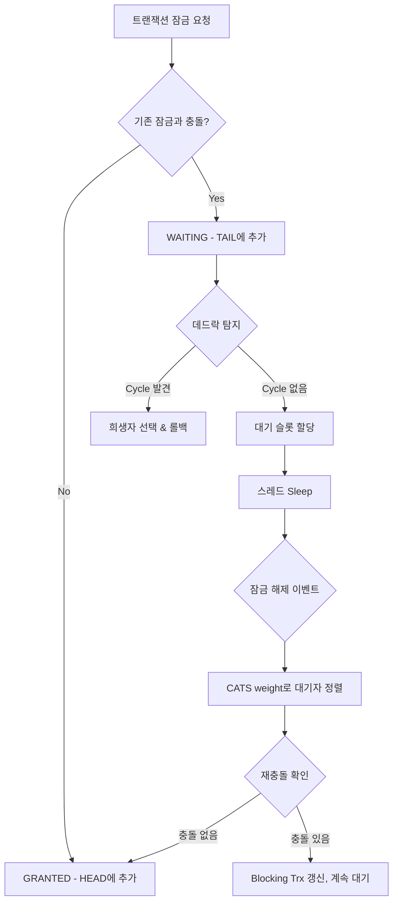
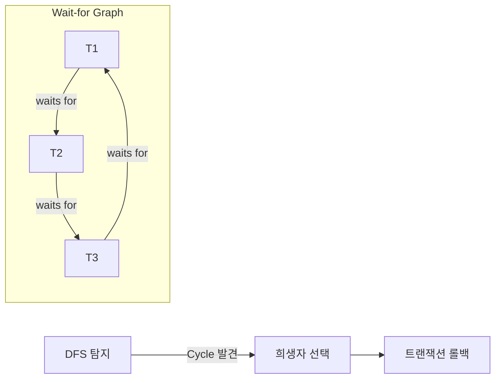

# InnoDB 잠금과 Deadlock

InnoDB의 lock0lock.cc(230KB)와 lock0wait.cc를 중심으로, 레코드/갭/넥스트키/인텐션 잠금의 내부 구조와 Wait-for Graph 기반 데드락 탐지 메커니즘을 소스코드 레벨에서 분석한다.

## 목차
- [1. 핵심 개념 (What)](#1-핵심-개념-what)
- [2. 왜 알아야 하는가 (Why)](#2-왜-알아야-하는가-why)
- [3. 내부 구현 분석 (How)](#3-내부-구현-분석-how)
- [4. 실전 예제](#4-실전-예제)
- [5. 정리](#5-정리)

---

## 1. 핵심 개념 (What)

### 1.1 잠금의 정의

InnoDB에서 잠금(lock)은 개념적으로 4가지 요소의 튜플이다:
- **요청 트랜잭션** (requesting transaction)
- **리소스** (특정 행 또는 테이블)
- **모드** (LOCK_S, LOCK_X, LOCK_IS, LOCK_IX 등)
- **상태** (WAITING 또는 GRANTED)

레코드 잠금은 `page_no`(페이지 식별자)와 `heap_no`(페이지 내부 레코드 위치)로 레코드를 식별한다. 테이블/인덱스/Primary Key가 아닌 물리적 위치 기반이므로, B-Tree 분할/병합 시 Lock-sys에 반영이 필요하다.

### 1.2 잠금 모드 체계

`lock0types.h`에 정의된 기본 잠금 모드:

```c
enum lock_mode {
  LOCK_IS = 0,          // Intention Shared
  LOCK_IX,              // Intention Exclusive
  LOCK_S,               // Shared
  LOCK_X,               // Exclusive
  LOCK_AUTO_INC,        // Auto-increment 전용
  LOCK_NONE,            // Consistent Read 표시용
};
```

### 1.3 레코드 잠금의 세부 유형

레코드 잠금은 `type_mode` 필드에 비트 플래그로 세부 유형을 표현한다:

| 플래그 | 의미 |
|---|---|
| `LOCK_ORDINARY` (0) | Next-Key Lock (레코드 + 이전 갭) |
| `LOCK_GAP` | Gap Lock (갭만) |
| `LOCK_REC_NOT_GAP` | Record Lock (레코드만) |
| `LOCK_INSERT_INTENTION` | Insert Intention Lock (삽입 의도) |

## 2. 왜 알아야 하는가 (Why)

### 2.1 실무에서의 잠금 문제

- **데드락 빈발**: 보조 인덱스와 클러스터 인덱스의 잠금 순서 불일치
- **Gap Lock에 의한 불필요한 대기**: REPEATABLE READ에서 팬텀 방지를 위한 갭 잠금이 INSERT를 차단
- **SHOW ENGINE INNODB STATUS 해석**: 데드락 로그에 나오는 `lock_mode X locks gap` 등의 의미 파악
- **Insert Intention Lock 충돌 패턴**: 동시 INSERT에서 왜 대기가 발생하는지 이해

### 2.2 성능 최적화 관점

- 잠금 경합(contention) 분석을 위해 `lock_t` 구조체와 잠금 큐 동작을 이해해야 한다
- CATS(Contention-Aware Transaction Scheduling) 알고리즘이 어떻게 대기 순서를 최적화하는지 파악

## 3. 내부 구현 분석 (How)

### 3.1 lock_t 구조체

`lock0priv.h`에 정의된 핵심 구조체:

```c
struct alignas(8) lock_t {
  trx_t *trx;                      // 소유 트랜잭션
  UT_LIST_NODE_T(lock_t) trx_locks; // 트랜잭션의 잠금 리스트
  dict_index_t *index;              // 레코드 잠금 시 인덱스
  lock_t *hash;                     // 해시 테이블 체인 노드

  union {
    lock_table_t tab_lock;          // 테이블 잠금
    lock_rec_t rec_lock;            // 레코드 잠금
  };

  uint32_t type_mode;               // 잠금 유형+모드 비트 플래그
  // ... 뒤에 가변 길이 비트맵 (heap_no별 잠금 비트)
};
```

레코드 잠금의 `rec_lock` 필드:

```c
struct lock_rec_t {
  page_id_t page_id;   // 페이지 식별자
  uint32_t n_bits;      // 비트맵 크기 (heap_no 수)
};
```

잠금 비트맵은 `lock_t` 구조체 바로 뒤에 배치되며, 각 비트가 페이지 내 `heap_no`에 대응한다. 즉 하나의 `lock_t` 객체가 같은 페이지의 여러 레코드에 대한 잠금을 표현할 수 있다.

### 3.2 잠금 호환성 매트릭스

```
           IS    IX    S     X    AI
  IS       O     O     O     X    O
  IX       O     O     X     X    O
  S        O     X     O     X    X
  X        X     X     X     X    X
  AI       O     O     X     X    X

  O = 호환, X = 충돌
```

### 3.3 잠금 큐와 CATS 스케줄링

```
                                        |
Grows <-- [HEAD] [G7 -- G3 -- G2 -- G1] | [W4 -- W5 -- W6] [TAIL] --> Grows
                  Grant Group            |       Wait Group

G = Granted, W = Waiting, 숫자 = 요청 순서
```

- Granted 잠금은 HEAD에 역순으로 추가
- Waiting 잠금은 TAIL에 순서대로 추가
- 잠금 해제 시, CATS weight(Wait-for 그래프에서 전이적으로 차단하는 트랜잭션 수)가 높은 대기 잠금부터 우선 부여

### 3.4 잠금 흐름 아키텍처



### 3.5 데드락 탐지 메커니즘

`lock0lock.cc`의 `Deadlock_notifier` 클래스와 Wait-for Graph 탐색:



**탐지 흐름:**

1. 새 잠금이 WAITING 상태가 될 때 데드락 검사 트리거
2. Wait-for 그래프를 DFS로 탐색하여 사이클 검출
3. 사이클 발견 시 `Deadlock_notifier::notify()` 호출

```c
// lock0lock.cc - Deadlock_notifier
static void notify(
    const ut::vector<const trx_t *> &trxs_on_cycle,  // 사이클 참여 트랜잭션들
    const trx_t *victim_trx                            // 희생자
);
```

**희생자 선택 알고리즘:**
- 트랜잭션의 weight(수행한 작업량 — undo 로그 크기 등)가 적은 쪽을 희생
- 롤백 비용이 낮은 트랜잭션을 선택하여 전체 시스템 영향 최소화

전역 플래그 `innobase_deadlock_detect`로 탐지 활성/비활성 제어:

```c
bool innobase_deadlock_detect = true;  // lock0lock.cc:71
```

### 3.6 대기 처리 — lock0wait.cc

`lock0wait.cc`는 잠금 대기 슬롯 관리를 담당한다:

```c
// 대기 슬롯 배열에서 빈 슬롯 확보
static srv_slot_t *lock_wait_table_reserve_slot(
    que_thr_t *thr,
    std::chrono::steady_clock::duration wait_timeout
);

// 슬롯 해제 및 배열 정리
static void lock_wait_table_release_slot(srv_slot_t *slot);

// 타임아웃/데드락 시 대기 취소
static void lock_wait_check_and_cancel(srv_slot_t *slot);
```

대기 슬롯(`srv_slot_t`)은 `lock_sys->waiting_threads` 배열에서 관리되며, 각 슬롯은 `reservation_no`로 ABA 문제를 방지한다:

```c
static uint64_t lock_wait_table_reservations = 0;  // lock0wait.cc:134
```

### 3.7 Lock-sys 래치 구조

`lock_sys_t`는 페이지/테이블별 샤드 래치를 사용하여 동시성을 높인다:

```c
namespace locksys {
  bool owns_exclusive_global_latch();     // 전역 X-래치
  bool owns_shared_global_latch();        // 전역 S-래치
  bool owns_page_shard(const page_id_t&); // 페이지별 샤드
  bool owns_table_shard(const dict_table_t&); // 테이블별 샤드
}
```

## 4. 실전 예제

### 4.1 Gap Lock에 의한 INSERT 차단

```sql
-- Session 1 (REPEATABLE READ)
BEGIN;
SELECT * FROM orders WHERE id BETWEEN 10 AND 20 FOR UPDATE;
-- Gap Lock: (10, 20) 구간에 갭 잠금 설정

-- Session 2
BEGIN;
INSERT INTO orders (id, amount) VALUES (15, 100);
-- WAITING: Gap Lock과 Insert Intention Lock 충돌
-- insert intention lock은 gap lock과 호환되지 않음
```

### 4.2 데드락 유발 패턴과 진단

```sql
-- Session 1
BEGIN;
UPDATE accounts SET balance = balance - 100 WHERE id = 1;  -- X lock on id=1
UPDATE accounts SET balance = balance + 100 WHERE id = 2;  -- waits for Session 2

-- Session 2
BEGIN;
UPDATE accounts SET balance = balance - 50 WHERE id = 2;   -- X lock on id=2
UPDATE accounts SET balance = balance + 50 WHERE id = 1;   -- waits for Session 1
-- DEADLOCK DETECTED!
```

진단:

```sql
-- 최근 데드락 정보 확인
SHOW ENGINE INNODB STATUS\G

-- performance_schema에서 실시간 잠금 확인
SELECT * FROM performance_schema.data_locks;
SELECT * FROM performance_schema.data_lock_waits;

-- 데드락 탐지 비활성화 (주의: innodb_lock_wait_timeout에 의존)
SET GLOBAL innodb_deadlock_detect = OFF;
```

### 4.3 Next-Key Lock 동작 확인

```sql
-- id에 인덱스가 있고, 기존 데이터: 10, 20, 30
BEGIN;
SELECT * FROM t WHERE id = 20 FOR UPDATE;
-- Next-Key Lock: (10, 20] 잠금
-- Gap Lock: (20, 30) 갭 잠금 (supremum 전까지)

-- 다른 세션에서:
INSERT INTO t (id) VALUES (15);  -- 차단됨 (Gap Lock 범위)
INSERT INTO t (id) VALUES (25);  -- 차단됨 (Gap Lock 범위)
INSERT INTO t (id) VALUES (5);   -- 성공 (범위 밖)
INSERT INTO t (id) VALUES (35);  -- 성공 (범위 밖)
```

## 5. 정리

| 개념 | 핵심 | 소스 위치 |
|---|---|---|
| lock_t 구조체 | trx, type_mode, 비트맵으로 페이지 내 여러 레코드 잠금 표현 | `lock0priv.h:137` |
| Record Lock | LOCK_REC_NOT_GAP — 레코드 자체만 잠금 | `lock0types.h` |
| Gap Lock | LOCK_GAP — 레코드 사이 갭만 잠금, 팬텀 방지 | `lock0types.h` |
| Next-Key Lock | LOCK_ORDINARY — 레코드 + 이전 갭 잠금 (기본값) | `lock0priv.h:119` |
| Insert Intention Lock | LOCK_INSERT_INTENTION — 같은 갭에 다른 위치 INSERT 허용 | `lock0types.h` |
| Intention Lock (IS/IX) | 테이블 레벨 의도 잠금, 행 잠금 전 설정 | `lock0types.h:55-56` |
| CATS 스케줄링 | Wait-for 그래프 weight 기반 우선순위 부여 | `lock0lock.h:134` |
| 데드락 탐지 | DFS로 Wait-for 그래프 사이클 검출 | `lock0lock.cc:107` |
| 대기 슬롯 관리 | waiting_threads 배열, reservation_no로 ABA 방지 | `lock0wait.cc:134` |

---

## 6. 애플리케이션 Lock 패턴

InnoDB Internal Lock 외에 애플리케이션 레벨에서 사용하는 동시성 제어 패턴을 정리한다.

### 6.1 Named Lock (GET_LOCK)

MySQL이 제공하는 **사용자 정의 Lock**. 테이블/행이 아닌 **임의 문자열**을 키로 잠금. 트랜잭션과 독립적으로 동작한다.

```sql
SELECT GET_LOCK('lock_key', 10);      -- 획득 (10초 타임아웃)
SELECT RELEASE_LOCK('lock_key');       -- 해제 (반드시 명시적 호출)
SELECT IS_FREE_LOCK('lock_key');       -- 사용 가능 여부
```

| 특성 | 설명 |
|------|------|
| 트랜잭션 독립 | COMMIT/ROLLBACK으로 해제 안 됨 |
| 세션 기반 | 세션 종료 시 자동 해제 |
| 전역 범위 | 동일 MySQL 서버 전체에서 공유 |
| 키 길이 제한 | 64바이트 |

**Spring + JPA 구현:**

```java
public interface LockRepository extends JpaRepository<Lock, Long> {
    @Query(value = "SELECT GET_LOCK(:key, :timeout)", nativeQuery = true)
    Integer getLock(@Param("key") String key, @Param("timeout") int timeout);

    @Query(value = "SELECT RELEASE_LOCK(:key)", nativeQuery = true)
    Integer releaseLock(@Param("key") String key);
}
```

**커넥션 풀 분리 (핵심!)** — Named Lock과 비즈니스 로직이 같은 풀을 쓰면 데드락/고갈 위험:

```yaml
spring:
  datasource:
    hikari:
      maximum-pool-size: 20
      pool-name: MainPool
  named-lock-datasource:
    hikari:
      maximum-pool-size: 10
      pool-name: NamedLockPool
```

```java
@Component
@RequiredArgsConstructor
public class NamedLockFacade {
    private final LockRepository lockRepository;
    private final StockService stockService;

    public void decrease(Long productId, int quantity) {
        try {
            lockRepository.getLock("stock_" + productId, 10);
            stockService.decrease(productId, quantity);  // REQUIRES_NEW 트���잭션
        } finally {
            lockRepository.releaseLock("stock_" + productId);
        }
    }
}
```

### 6.2 비관적 Lock (Pessimistic Lock)

**"충돌이 발생한다"** 가정 → 읽기 시점에 Lock. 내부적으로 InnoDB의 S Lock / X Lock을 사용.

```sql
SELECT * FROM stock WHERE product_id = 1 FOR UPDATE;          -- X Lock
SELECT * FROM stock WHERE product_id = 1 FOR SHARE;           -- S Lock
SELECT * FROM stock WHERE product_id = 1 FOR UPDATE NOWAIT;   -- 즉시 실패
SELECT * FROM stock WHERE status = 'PENDING'
  FOR UPDATE SKIP LOCKED LIMIT 10;                             -- 큐 워커 패턴
```

**JPA 구현:**

```java
@Lock(LockModeType.PESSIMISTIC_WRITE)
@QueryHints({@QueryHint(name = "jakarta.persistence.lock.timeout", value = "3000")})
@Query("SELECT s FROM Stock s WHERE s.productId = :productId")
Optional<Stock> findWithLock(@Param("productId") Long productId);
```

| LockModeType | SQL | 설명 |
|-------------|-----|------|
| `PESSIMISTIC_READ` | FOR SHARE | 공유 잠금 |
| `PESSIMISTIC_WRITE` | FOR UPDATE | 배타 잠금 |
| `PESSIMISTIC_FORCE_INCREMENT` | FOR UPDATE + version++ | 배타 + 버전 증가 |

### 6.3 낙관적 Lock (Optimistic Lock)

**"충돌이 드물다"** 가정 → DB Lock 없이 **version 컬럼**으로 충돌 감지.

```java
@Entity
public class Stock {
    @Id private Long id;
    private int quantity;
    @Version private Long version;  // JPA가 자동 관리
}

// 생성되는 SQL:
// UPDATE stock SET quantity=?, version=version+1 WHERE id=? AND version=?
// → version 불일치 시 OptimisticLockException
```

**재시도 로직 (필수!):**

```java
@Retryable(
    retryFor = OptimisticLockingFailureException.class,
    maxAttempts = 5,
    backoff = @Backoff(delay = 100, multiplier = 2, maxDelay = 1000)
)
@Transactional
public void decrease(Long productId, int quantity) {
    Stock stock = stockRepository.findByProductId(productId).orElseThrow();
    stock.decrease(quantity);
}
```

### 6.4 분산 Lock

단일 DB Lock으로 부족한 경우: DB 부하 분산, 트랜잭션 밖 Lock, DB 샤딩 환경.

| 방식 | 장점 | 단점 | 적합 상황 |
|------|------|------|----------|
| MySQL Named Lock | 추가 인프라 불필요 | 단일 MySQL 한정 | 소규모 |
| Redis (Redisson) | 고성능, Pub/Sub | Redis 의존성 | 이미 Redis 사용 |
| Zookeeper | 높은 신뢰성 | 운영 복잡 | 금융 등 |

**Redisson 분산 Lock:**

```java
RLock lock = redissonClient.getLock("lock:stock:" + productId);
try {
    if (lock.tryLock(5, 10, TimeUnit.SECONDS)) {
        stockService.decrease(productId, quantity);
    }
} finally {
    if (lock.isHeldByCurrentThread()) lock.unlock();
}
```

**AOP 기반 @DistributedLock 어노테이션:**

```java
@Target(ElementType.METHOD)
@Retention(RetentionPolicy.RUNTIME)
public @interface DistributedLock {
    String key();                    // SpEL 지원
    long waitTime() default 5000;
    long leaseTime() default 10000;
}

@Aspect
@Component
public class DistributedLockAspect {
    @Around("@annotation(dl)")
    public Object around(ProceedingJoinPoint pjp, DistributedLock dl) throws Throwable {
        RLock lock = redissonClient.getLock(resolveLockKey(pjp, dl.key()));
        try {
            if (!lock.tryLock(dl.waitTime(), dl.leaseTime(), TimeUnit.MILLISECONDS))
                throw new LockAcquisitionException("락 획득 실패");
            return pjp.proceed();
        } finally {
            if (lock.isHeldByCurrentThread()) lock.unlock();
        }
    }
}

// 사용
@DistributedLock(key = "'lock:coupon:' + #couponId", waitTime = 3000)
public void issue(Long couponId, Long userId) { ... }
```

### 6.5 Lock 선택 가이드

```
비관적 vs 낙관적 벤치마크 (100 동시 스레드, 동일 재고 차감):
  비관적 Lock:   ~3.5초, 재시도 0회
  낙관적 Lock:   ~8.2초, 재시도 ~4,950회
  Named Lock:    ~4.0초, 커넥션 풀 분리 필요
  Redis Lock:    ~3.8초, 네트워크 홉 추가
```

| 시나리오 | 권장 Lock |
|----------|----------|
| 재고 차감 (선착순, 충돌 빈번) | 비관적 Lock / Redis Lock |
| 게시글 수정 (충돌 드묾) | 낙관적 Lock (@Version) |
| 쿠폰 발급 (폭주) | Redis Lock / Named Lock |
| 스케줄러 중복 방지 | ShedLock / Redis Lock |
| 결제 (외부 API, 긴 트랜잭션) | Named Lock / Redis Lock |

```
Lock 선택 흐름도:

단일 서버? ─── No ──→ Redis 있음? → Redisson
       │                         → MySQL만? → Named Lock
      Yes
       │
충돌 잦음? ─── Yes ──→ 비관적 Lock (FOR UPDATE)
       │                  └── SKIP LOCKED 큐 패턴
      No
       │
트랜잭션 밖? ── Yes ──→ Named Lock
       │
      No → 낙관적 Lock (@Version + 재시도)
```

## 7. 데드락 실무 대응

InnoDB의 데드락 탐지(DFS, CATS)는 위 섹션 참조. 여기서는 애플리케이션 레벨 대응 전략을 다룬다.

### 7.1 데드락 진단

```sql
SHOW ENGINE INNODB STATUS\G                    -- 최근 데드락 정보
SET GLOBAL innodb_print_all_deadlocks = ON;    -- 자동 로그 기록
SELECT * FROM performance_schema.data_locks;   -- 현재 락 상태 (8.0+)
SELECT * FROM performance_schema.data_lock_waits;
```

### 7.2 방지 전략

```java
// 1. 일관된 락 순서 — 항상 작은 ID부터
public void transfer(Long fromId, Long toId) {
    Long first = Math.min(fromId, toId);
    Long second = Math.max(fromId, toId);
    Account acc1 = accountRepository.findByIdForUpdate(first);
    Account acc2 = accountRepository.findByIdForUpdate(second);
}

// 2. 짧은 트랜잭션 — 외부 API 호출은 트랜잭션 밖에서
PaymentResult result = paymentService.process(request);  // 트랜잭션 밖
orderRepository.save(order);  // 트랜잭션 안

// 3. 인덱스 활용 — 인덱스 없으면 풀스캔 → 테이블 전체 락
CREATE INDEX idx_user ON orders(user_id);

// 4. 재시도 로직
@Retryable(
    retryFor = DeadlockLoserDataAccessException.class,
    maxAttempts = 3,
    backoff = @Backoff(delay = 100, multiplier = 2)
)
@Transactional
public void processOrder(Long orderId) { ... }
```

---
*참고: MySQL 9.x (trunk) 소스코드 기준*
