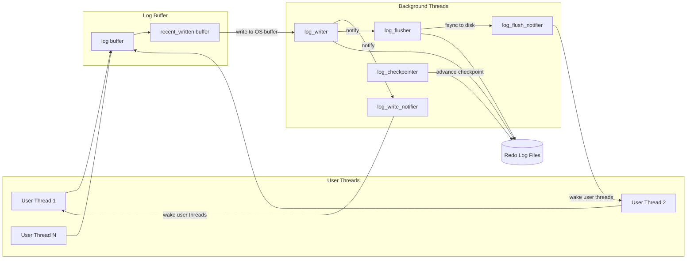
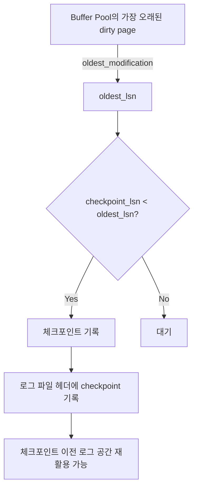
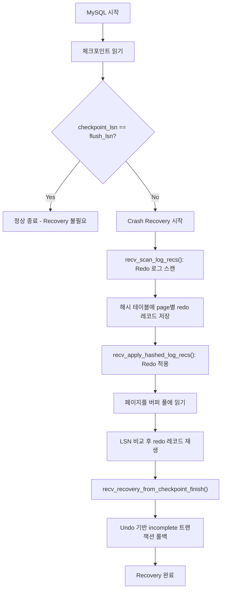

# Redo 로그와 Crash Recovery

WAL(Write-Ahead Logging) 프로토콜의 핵심인 redo 로그의 내부 구현을 log0write.cc, log0recv.cc, log0chkp.cc 소스코드를 기반으로 분석한다. LSN, 체크포인트, 백그라운드 스레드 구조, Crash Recovery 프로세스를 다룬다.

## 목차
- [1. 핵심 개념 (What)](#1-핵심-개념-what)
- [2. 왜 알아야 하는가 (Why)](#2-왜-알아야-하는가-why)
- [3. 내부 구현 분석 (How)](#3-내부-구현-분석-how)
- [4. 실전 예제](#4-실전-예제)
- [5. 정리](#5-정리)

---

## 1. 핵심 개념 (What)

### 1.1 WAL (Write-Ahead Logging) 프로토콜

InnoDB는 데이터 페이지를 변경하기 전에 반드시 해당 변경 사항을 redo 로그에 먼저 기록한다. 이것이 WAL 프로토콜의 핵심이다:

1. 변경 내용을 redo 로그 버퍼에 기록
2. redo 로그를 디스크에 flush
3. **그 후에야** 변경된 데이터 페이지를 디스크에 기록

이를 통해 트랜잭션 커밋 시점에 데이터 페이지가 디스크에 없더라도, redo 로그만 있으면 crash 후 복구가 가능하다.

### 1.2 LSN (Log Sequence Number)

LSN은 redo 로그 스트림에서의 바이트 오프셋으로, 단조 증가하는 64비트 정수다. InnoDB의 모든 상태 추적은 LSN 기반이다:

- **write_lsn**: 로그 버퍼에서 OS 버퍼로 쓰인 위치
- **flushed_to_disk_lsn**: OS 버퍼에서 디스크로 fsync된 위치
- **last_checkpoint_lsn**: 마지막 체크포인트 LSN
- **buf_ready_for_write_lsn**: 로그 버퍼에서 연속으로 쓰기 가능한 위치

### 1.3 체크포인트

체크포인트는 "이 LSN 이전의 모든 변경은 데이터 파일에 반영됨"을 나타내는 마커다. Crash Recovery 시 체크포인트 LSN부터 redo 적용을 시작하므로, 체크포인트가 자주 갱신될수록 복구 시간이 단축된다.

## 2. 왜 알아야 하는가 (Why)

### 2.1 성능 튜닝

- `innodb_log_buffer_size`: 로그 버퍼 크기가 부족하면 동시 트랜잭션의 로그 쓰기가 대기
- `innodb_redo_log_capacity`: redo 로그 파일 총 용량이 체크포인트 간격과 복구 시간 결정
- `innodb_flush_log_at_trx_commit`: 커밋 시 fsync 정책이 내구성과 성능의 트레이드오프

### 2.2 장애 대응

- Crash Recovery 시간이 왜 오래 걸리는지 (체크포인트 간격, redo 양)
- "InnoDB: Log sequence number is in the future" 오류의 원인
- redo 로그 공간 부족으로 인한 sync flush 발생 원리

## 3. 내부 구현 분석 (How)

### 3.1 백그라운드 스레드 아키텍처

`log0write.cc`는 5개의 백그라운드 스레드를 정의한다:



| 스레드 | 역할 | 소스 |
|---|---|---|
| `log_writer` | 로그 버퍼 -> OS 버퍼 쓰기 | `log0write.cc` |
| `log_flusher` | OS 버퍼 -> 디스크 fsync | `log0write.cc` |
| `log_write_notifier` | write_lsn 갱신 후 유저 스레드 알림 | `log0write.cc` |
| `log_flush_notifier` | flushed_to_disk_lsn 갱신 후 유저 스레드 알림 | `log0write.cc` |
| `log_checkpointer` | 체크포인트 생성 | `log0chkp.cc` |

### 3.2 log_writer 스레드 상세

log_writer는 로그 버퍼의 연속 영역을 감지하여 디스크에 쓴다:

1. **recent_written 버퍼 순회**: 유저 스레드가 로그 버퍼에 쓴 후 링크를 설정. log_writer가 연결된 링크를 따라가며 연속 쓰기 가능 범위(`buf_ready_for_write_lsn`)를 결정
2. **완전한 블록 감지**: 512바이트 로그 블록이 완성되면 헤더/푸터(체크섬 포함) 업데이트 후 직접 로그 버퍼에서 쓰기
3. **불완전 블록 처리**: 마지막 미완성 블록은 전용 버퍼에 복사 후 나머지를 0x00으로 채워 쓰기
4. **Write-ahead**: 파일 시스템의 원자적 쓰기 단위보다 작은 쓰기를 방지하기 위해 필요 시 write-ahead 버퍼 사용

### 3.3 체크포인트 메커니즘 — log0chkp.cc

```c
// 체크포인트 가능 LSN 갱신
static void log_update_available_for_checkpoint_lsn(log_t &log);

// 체크포인트 필요 여부 판단
static bool log_should_checkpoint(log_t &log);

// 실제 체크포인트 수행
static void log_checkpoint(log_t &log);

// sync flush 요청 (redo 공간 부족 시)
static void log_consider_sync_flush(log_t &log);
```

체크포인트 LSN 결정 과정:



**체크포인트 타이밍:**
- 주기적 (시간 기반)
- redo 로그 공간이 부족할 때 (free_check_limit_lsn 근접)
- 명시적 요청 (`log_make_latest_checkpoint()`)

### 3.4 Crash Recovery 프로세스 — log0recv.cc

Recovery는 `recv_recovery_from_checkpoint_start()` 함수에서 시작된다:

```c
dberr_t recv_recovery_from_checkpoint_start(log_t &log, lsn_t flush_lsn) {
    // 1. 최신 체크포인트 찾기
    recv_find_max_checkpoint(log, checkpoint);

    // 2. 체크포인트 LSN부터 redo 로그 스캔
    recv_recovery_begin(log, checkpoint_lsn);

    // 3. recovered_lsn 결정
    log.recovered_lsn = recv_sys->recovered_lsn;
}
```

전체 Recovery 흐름:



**핵심 함수들:**

| 함수 | 역할 | 소스 |
|---|---|---|
| `recv_recovery_from_checkpoint_start()` | Recovery 진입점 | `log0recv.cc:3766` |
| `recv_scan_log_recs()` | redo 로그를 파싱하여 해시맵에 저장 | `log0recv.cc:3289` |
| `recv_apply_hashed_log_recs()` | 해시맵의 redo를 페이지에 적용 | `log0recv.cc:1173` |
| `recv_recovery_from_checkpoint_finish()` | Recovery 마무리, undo 롤백 시작 | `log0recv.cc:3950` |

### 3.5 Redo 로그 스캔과 적용

`recv_scan_log_recs()`는 로그 블록을 순차적으로 읽으면서:

1. 각 redo 레코드를 파싱
2. `(space_id, page_no)` 기준으로 해시 테이블에 분류
3. 해시 테이블이 메모리 한계에 도달하면 `recv_apply_hashed_log_recs()`로 중간 적용

`recv_apply_hashed_log_recs()`는:

1. 해시 테이블에서 페이지별 redo 레코드 목록 순회
2. 해당 페이지를 버퍼 풀에 로드
3. 페이지의 LSN < redo 레코드의 LSN인 경우에만 적용
4. Read-ahead(`RECV_READ_AHEAD_AREA = 32` 페이지)로 I/O 최적화

## 4. 실전 예제

### 4.1 innodb_flush_log_at_trx_commit 설정별 동작

```sql
-- 최고 내구성 (기본값): 커밋마다 fsync
SET GLOBAL innodb_flush_log_at_trx_commit = 1;
-- log_writer -> log_flusher(fsync) -> log_flush_notifier -> 유저 스레드 복귀

-- 성능 우선: 1초마다 fsync
SET GLOBAL innodb_flush_log_at_trx_commit = 0;
-- 커밋 시 로그 버퍼에만 기록, 주기적으로 flush

-- 절충안: 커밋마다 OS 버퍼에 write, fsync는 주기적
SET GLOBAL innodb_flush_log_at_trx_commit = 2;
-- log_writer(write) -> 유저 스레드 복귀, fsync는 비동기
```

### 4.2 Redo 로그 모니터링

```sql
-- LSN 관련 상태 확인
SHOW ENGINE INNODB STATUS\G
-- LOG 섹션:
--   Log sequence number   2048513792
--   Log buffer assigned up to 2048513792
--   Log flushed up to     2048513792
--   Pages flushed up to   2048513000
--   Last checkpoint at    2048512500

-- 체크포인트 지연 확인 (checkpoint_age)
SELECT
  (SELECT VARIABLE_VALUE FROM performance_schema.global_status
   WHERE VARIABLE_NAME = 'Innodb_redo_log_current_lsn') AS current_lsn,
  (SELECT VARIABLE_VALUE FROM performance_schema.global_status
   WHERE VARIABLE_NAME = 'Innodb_redo_log_checkpoint_lsn') AS checkpoint_lsn;

-- Redo 로그 용량 설정 (8.0.30+)
SET GLOBAL innodb_redo_log_capacity = '4G';
```

### 4.3 Recovery 시간 예측과 최적화

```sql
-- 체크포인트 간격이 Recovery 시간을 결정
-- checkpoint_age가 클수록 Recovery 시 적용할 redo가 많음

-- 강제 체크포인트 (운영 환경에서 주의)
-- innodb_log_checkpoint_now (debug 변수)

-- Adaptive flushing으로 체크포인트 간격 최적화
SET GLOBAL innodb_adaptive_flushing = ON;
SET GLOBAL innodb_io_capacity = 2000;
SET GLOBAL innodb_io_capacity_max = 4000;
```

## 5. 정리

| 개념 | 핵심 | 소스 위치 |
|---|---|---|
| WAL 프로토콜 | 데이터 변경 전 반드시 redo 로그 먼저 기록 | InnoDB 전반 |
| LSN | 로그 스트림의 바이트 오프셋, 모든 상태 추적의 기준 | `log0types.h` |
| log_writer | 로그 버퍼 -> OS 버퍼 쓰기, recent_written 링크 추적 | `log0write.cc` |
| log_flusher | OS 버퍼 -> 디스크 fsync | `log0write.cc` |
| log_checkpointer | Buffer Pool oldest_lsn 기반 체크포인트 갱신 | `log0chkp.cc` |
| recv_recovery_from_checkpoint_start | Recovery 진입점: 체크포인트 찾기 -> redo 스캔 | `log0recv.cc:3766` |
| recv_scan_log_recs | redo 레코드 파싱, 페이지별 해시맵 저장 | `log0recv.cc:3289` |
| recv_apply_hashed_log_recs | 해시맵의 redo를 실제 페이지에 적용 | `log0recv.cc:1173` |
| Crash Recovery 3단계 | Checkpoint 읽기 -> Redo 적용 -> Undo 롤백 | `log0recv.cc` |

---
*참고: MySQL 9.x (trunk) 소스코드 기준*
