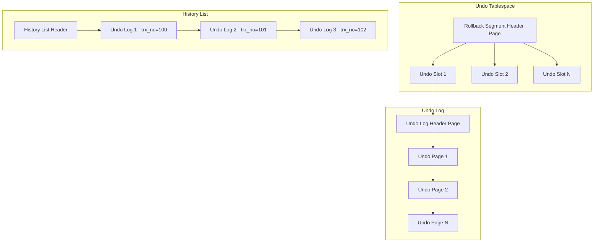
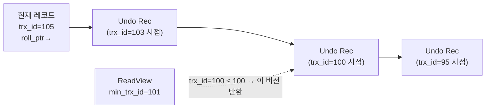
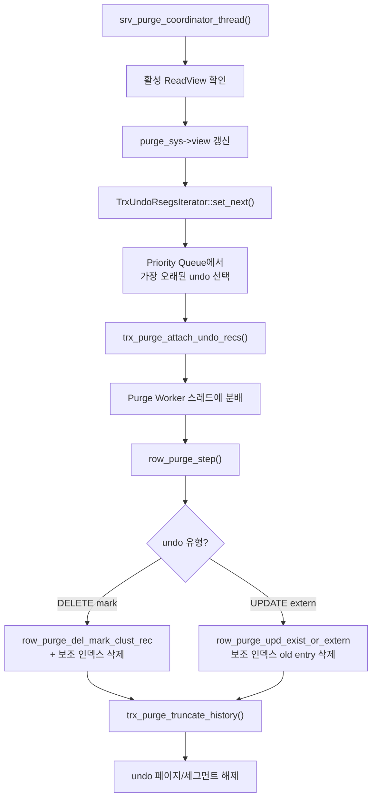

# Undo 로그와 Purge

InnoDB의 MVCC를 뒷받침하는 undo 로그(trx0undo.cc)와, 더 이상 필요 없는 old version을 정리하는 purge 시스템(trx0purge.cc, row0purge.cc)의 내부 구조를 소스코드 수준에서 분석한다.

## 목차
- [1. 핵심 개념 (What)](#1-핵심-개념-what)
- [2. 왜 알아야 하는가 (Why)](#2-왜-알아야-하는가-why)
- [3. 내부 구현 분석 (How)](#3-내부-구현-분석-how)
- [4. 실전 예제](#4-실전-예제)
- [5. 정리](#5-정리)

---

## 1. 핵심 개념 (What)

### 1.1 Undo 로그의 역할

Undo 로그는 두 가지 핵심 기능을 수행한다:

1. **트랜잭션 롤백**: 트랜잭션이 ROLLBACK하면 undo 로그를 역순으로 적용하여 원래 상태 복원
2. **MVCC (Multi-Version Concurrency Control)**: 다른 트랜잭션이 일관된 읽기(consistent read)를 수행할 때 old version 제공

### 1.2 Undo 로그의 두 가지 유형

| 유형 | 용도 | 수명 |
|---|---|---|
| **TRX_UNDO_INSERT** | INSERT 롤백용 | 트랜잭션 커밋 시 즉시 재사용/해제 가능 |
| **TRX_UNDO_UPDATE** | UPDATE/DELETE 롤백 + MVCC | 모든 ReadView에서 불필요해질 때까지 보존 |

INSERT undo는 커밋 후 다른 트랜잭션이 볼 필요가 없다(커밋 전에는 INSERT된 행 자체가 보이지 않으므로). UPDATE undo는 행의 이전 버전을 다른 트랜잭션이 참조할 수 있으므로 purge될 때까지 유지한다.

### 1.3 롤백 세그먼트와 History List

- **롤백 세그먼트 (Rollback Segment, trx_rseg_t)**: undo 로그 슬롯의 컨테이너. InnoDB는 최대 128개 롤백 세그먼트 지원
- **History List**: 커밋된 트랜잭션의 update undo 로그가 직렬화 번호(trx_no) 순으로 연결된 리스트

### 1.4 Purge의 정의

Purge는 더 이상 어떤 활성 ReadView에서도 필요하지 않은 old version을 물리적으로 삭제하는 가비지 컬렉션 프로세스다. DELETE 문이 실행되면 레코드에 delete-mark만 설정하고, 실제 물리 삭제는 purge가 수행한다.

## 2. 왜 알아야 하는가 (Why)

### 2.1 History List Length 폭증 문제

- 장시간 실행되는 트랜잭션이나 닫히지 않은 ReadView가 purge를 차단
- History list length가 수백만에 달하면 undo 테이블스페이스가 비대해짐
- 읽기 성능 저하: old version 체인이 길어져 consistent read가 많은 버전을 탐색

### 2.2 Purge Lag 진단

- `innodb_max_purge_lag`과 `innodb_max_purge_lag_delay`로 DML 속도 조절
- purge 스레드 수(`innodb_purge_threads`) 튜닝
- undo tablespace truncation 이해

## 3. 내부 구현 분석 (How)

### 3.1 Undo 로그 구조

`trx0undo.cc`의 주요 자료구조:



### 3.2 Undo 로그 생성과 관리 — trx0undo.cc

```c
// Undo 로그 메모리 객체 생성
static trx_undo_t *trx_undo_mem_create(
    trx_rseg_t *rseg,    // 롤백 세그먼트
    ulint id,             // 슬롯 인덱스
    ulint type,           // TRX_UNDO_INSERT 또는 TRX_UNDO_UPDATE
    trx_id_t trx_id,     // 트랜잭션 ID
    const XID *xid,       // XA 트랜잭션 ID
    page_no_t page_no,   // 헤더 페이지 번호
    ulint offset          // 헤더 오프셋
);

// 캐시된 insert undo 헤더 재사용
static ulint trx_undo_insert_header_reuse(
    page_t *undo_page,   // undo 로그 세그먼트 헤더 페이지
    trx_id_t trx_id,     // 트랜잭션 ID
    mtr_t *mtr
);
```

**Undo 페이지 탐색:**

```c
// 이전 undo 레코드 가져오기 (페이지 경계 넘기)
static trx_undo_rec_t *trx_undo_get_prev_rec_from_prev_page(
    trx_undo_rec_t *rec,
    page_no_t page_no,
    ulint offset,
    bool shared,          // S-latch vs X-latch
    mtr_t *mtr
);
```

### 3.3 버전 히스토리 체인

클러스터 인덱스 레코드는 숨겨진 시스템 컬럼을 포함한다:

```
+----------+----------+-------------+------------------+
| DATA_ROW_ID | DATA_TRX_ID | DATA_ROLL_PTR | User Columns... |
+----------+----------+-------------+------------------+
```

- **DATA_TRX_ID** (6바이트): 레코드를 마지막으로 수정한 트랜잭션 ID
- **DATA_ROLL_PTR** (7바이트): undo 로그 레코드를 가리키는 포인터

MVCC consistent read는 이 체인을 따라가며 적절한 버전을 찾는다:



### 3.4 Undo 로그의 래칭 전략

`trx0undo.cc`의 주석에서 설명하는 래칭 계층:

1. **트랜잭션 첫 INSERT/UPDATE 시**: 롤백 세그먼트 헤더에 X-latch (undo 슬롯 할당)
2. **이후 변경 시**: 트랜잭션의 `undo_mutex`로 undo 로그 보호
3. **커밋 시**: 롤백 세그먼트에 X-latch (insert undo 캐시/해제, update undo를 history list에 추가)
4. **Purge 시**: history list 순회는 S-latch, truncate 시 X-latch

### 3.5 Purge 시스템 — trx0purge.cc

전역 purge 상태를 관리하는 `trx_purge_t` 구조체:

```c
// 핵심 이터레이터 구조
struct purge_iter_t {
    trx_id_t trx_no;              // 이 번호 미만 트랜잭션은 purge 완료
    undo_no_t undo_no;            // purge된 undo 레코드 번호
    space_id_t undo_rseg_space;   // 마지막 undo가 있던 공간
    trx_id_t modifier_trx_id;    // 수정 트랜잭션 ID
};

// 전역 purge 조정 구조체 (trx_purge_t) 내 주요 필드
purge_iter_t iter;    // 현재 purge 진행 위치
purge_iter_t limit;   // purge 제한선
purge_iter_t done;    // 완료된 위치
```

Purge 상태 머신:

```c
enum purge_state_t {
    PURGE_STATE_INIT,      // 인스턴스 생성됨
    PURGE_STATE_RUN,       // 실행 중
    PURGE_STATE_STOP,      // 중지됨
    PURGE_STATE_EXIT,      // 종료됨
    PURGE_STATE_DISABLED   // 시작된 적 없음
};
```

### 3.6 Purge 실행 흐름



**Priority Queue 기반 롤백 세그먼트 선택:**

```c
// TrxUndoRsegsIterator::set_next() — trx0purge.cc:109
const page_size_t TrxUndoRsegsIterator::set_next() {
    mutex_enter(&m_purge_sys->pq_mutex);

    // 같은 trx_no의 롤백 세그먼트들을 합쳐서 처리
    while (!m_purge_sys->purge_queue->empty()) {
        if (m_trx_undo_rsegs.get_trx_no() == UINT64_UNDEFINED) {
            m_trx_undo_rsegs = purge_sys->purge_queue->top();
        } else if (purge_sys->purge_queue->top().get_trx_no() ==
                   m_trx_undo_rsegs.get_trx_no()) {
            m_trx_undo_rsegs.insert(purge_sys->purge_queue->top());
        } else {
            break;
        }
        m_purge_sys->purge_queue->pop();
    }

    mutex_exit(&m_purge_sys->pq_mutex);
}
```

### 3.7 row0purge.cc — 실제 정리 작업

```c
// Purge 쿼리 그래프의 진입점
que_thr_t *row_purge_step(que_thr_t *thr);  // row0purge.cc:1210

// Delete-marked 레코드의 실제 삭제
// (클러스터 인덱스 + 모든 보조 인덱스에서 제거)
// row0purge.cc 내부

// UPDATE에 의한 보조 인덱스 old entry 삭제
static void row_purge_upd_exist_or_extern_func(
    const que_thr_t *thr,
    purge_node_t *node,
    trx_undo_rec_t *undo_rec
);  // row0purge.cc:698
```

### 3.8 Undo Tablespace Truncation

undo tablespace가 비대해지면 InnoDB는 자동으로 truncation을 수행한다:

```c
static void trx_purge_truncate_history(purge_iter_t *limit);
// trx0purge.cc:1617
```

- `innodb_undo_log_truncate = ON`일 때 활성화
- purge가 진행될 때마다 truncation 가능 여부 확인
- undo tablespace를 빈 상태로 재생성하여 디스크 공간 회수

## 4. 실전 예제

### 4.1 History List Length 모니터링

```sql
-- History list length 확인
SHOW ENGINE INNODB STATUS\G
-- TRANSACTIONS 섹션:
--   History list length 1234

-- performance_schema로 정밀 모니터링
SELECT
  NAME, COUNT
FROM information_schema.INNODB_METRICS
WHERE NAME IN (
  'trx_rseg_history_len',
  'purge_del_mark_per_sec',
  'purge_upd_exist_or_extern_per_sec'
);
```

### 4.2 Purge Lag 제어

```sql
-- purge가 DML을 따라가지 못할 때 DML 속도 제한
SET GLOBAL innodb_max_purge_lag = 1000000;       -- history length 임계값
SET GLOBAL innodb_max_purge_lag_delay = 300000;  -- 최대 지연(마이크로초)

-- purge 스레드 수 조정 (기본 4)
SET GLOBAL innodb_purge_threads = 8;

-- purge batch size 조정
SET GLOBAL innodb_purge_batch_size = 300;

-- undo tablespace 자동 truncation
SET GLOBAL innodb_undo_log_truncate = ON;
SET GLOBAL innodb_max_undo_log_size = '1G';
```

### 4.3 Long-running Transaction 진단

```sql
-- 오래 실행 중인 트랜잭션 찾기 (purge 차단 원인)
SELECT
  trx_id,
  trx_state,
  trx_started,
  TIMESTAMPDIFF(SECOND, trx_started, NOW()) AS duration_sec,
  trx_rows_locked,
  trx_rows_modified
FROM information_schema.INNODB_TRX
ORDER BY trx_started ASC
LIMIT 10;

-- 오래된 ReadView 확인
-- (REPEATABLE READ에서 시작 이후 닫히지 않은 트랜잭션)
SELECT * FROM sys.innodb_lock_waits;
```

## 5. 정리

| 개념 | 핵심 | 소스 위치 |
|---|---|---|
| TRX_UNDO_INSERT | INSERT 롤백 전용, 커밋 시 즉시 재사용 가능 | `trx0undo.cc` |
| TRX_UNDO_UPDATE | UPDATE/DELETE 롤백 + MVCC, purge까지 보존 | `trx0undo.cc` |
| 버전 히스토리 체인 | DATA_ROLL_PTR로 연결된 undo 레코드 체인 | `trx0undo.cc` |
| 롤백 세그먼트 (trx_rseg_t) | undo 슬롯의 컨테이너, 최대 128개 | `trx0rseg.cc` |
| History List | 커밋된 update undo 로그의 trx_no 순 리스트 | `trx0purge.cc` |
| purge_iter_t | purge 진행 위치 추적 (trx_no, undo_no) | `trx0purge.h:118` |
| TrxUndoRsegsIterator | Priority Queue에서 가장 오래된 undo 선택 | `trx0purge.cc:109` |
| row_purge_step | purge 쿼리 그래프 진입점 | `row0purge.cc:1210` |
| Undo Truncation | 비대한 undo tablespace 자동 축소 | `trx0purge.cc:1617` |

---
*참고: MySQL 9.x (trunk) 소스코드 기준*
