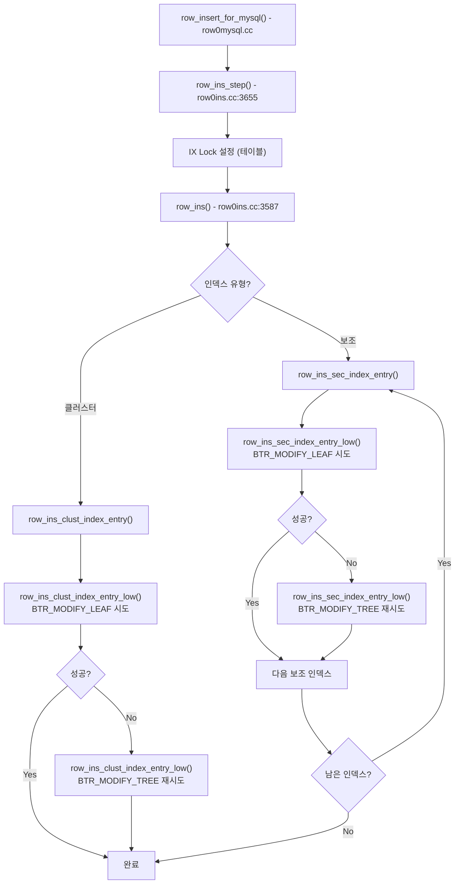
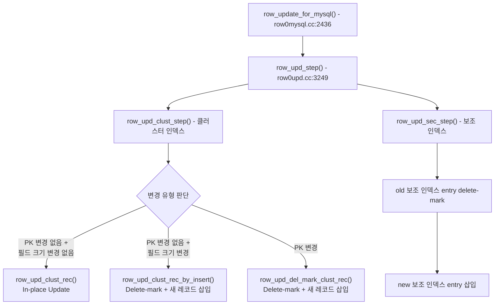
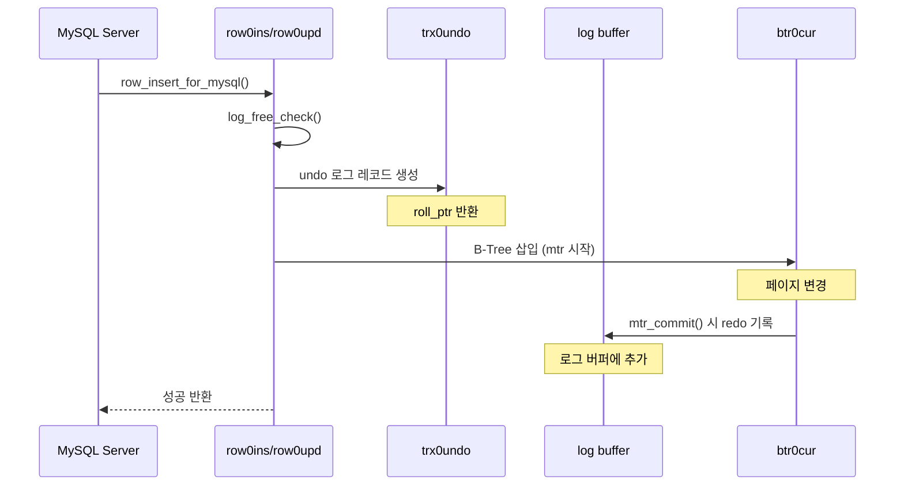

# 행 연산 내부 -- INSERT/UPDATE/DELETE

row0ins.cc, row0upd.cc, row0mysql.cc 소스코드를 기반으로 InnoDB의 INSERT, UPDATE, DELETE 연산이 B-Tree 삽입, 보조 인덱스 유지, undo/redo 기록과 어떻게 연동되는지를 내부적으로 분석한다.

## 목차
- [1. 핵심 개념 (What)](#1-핵심-개념-what)
- [2. 왜 알아야 하는가 (Why)](#2-왜-알아야-하는가-why)
- [3. 내부 구현 분석 (How)](#3-내부-구현-분석-how)
- [4. 실전 예제](#4-실전-예제)
- [5. 정리](#5-정리)

---

## 1. 핵심 개념 (What)

### 1.1 행 연산의 계층 구조

MySQL 서버에서 InnoDB 스토리지 엔진으로의 행 연산은 여러 계층을 거친다:

```
MySQL Server Layer (ha_innobase)
      ↓
row0mysql.cc (MySQL-InnoDB 인터페이스)
      ↓
row0ins.cc / row0upd.cc (행 연산 로직)
      ↓
btr0cur.cc (B-Tree 커서 연산)
      ↓
lock0lock.cc (잠금) + trx0undo.cc (undo) + log0write.cc (redo)
```

### 1.2 핵심 원칙

1. **클러스터 인덱스 우선**: 모든 DML은 클러스터 인덱스를 먼저 처리하고, 보조 인덱스를 후속 처리
2. **redo 로그 공간 확인**: 모든 redo 생성 연산은 시작 전에 `log_free_check()` 호출 필수
3. **Optimistic → Pessimistic**: B-Tree 변경은 먼저 리프 노드만 수정(MODIFY_LEAF) 시도 후, 실패 시 트리 구조 변경(MODIFY_TREE) 수행

## 2. 왜 알아야 하는가 (Why)

### 2.1 성능 병목 이해

- INSERT의 보조 인덱스 유지 비용: 인덱스가 많을수록 INSERT 성능 저하
- UPDATE의 in-place vs delete+insert: 어떤 경우에 비용이 큰 경로로 가는지
- B-Tree 페이지 분할이 발생하는 시점과 영향

### 2.2 문제 진단

- "Row size too large" 에러의 원인
- Duplicate key 처리에서의 잠금 동작 (Gap Lock 설정)
- Foreign key check가 왜 성능을 저하시키는지

## 3. 내부 구현 분석 (How)

### 3.1 INSERT 경로 — row0ins.cc

#### 3.1.1 전체 INSERT 흐름



#### 3.1.2 클러스터 인덱스 삽입 상세

`row_ins_clust_index_entry_low()`의 핵심 로직 (`row0ins.cc:2399`):

```c
dberr_t row_ins_clust_index_entry_low(
    uint32_t flags,
    ulint mode,           // BTR_MODIFY_LEAF 또는 BTR_MODIFY_TREE
    dict_index_t *index,
    ulint n_uniq,
    dtuple_t *entry,
    que_thr_t *thr)
{
    // 1. B-Tree 커서로 삽입 위치 탐색
    // 2. 중복 키 확인
    //    - 중복 발견 시: delete-marked 레코드면
    //      row_ins_clust_index_entry_by_modify()로 업데이트
    //    - 그렇지 않으면 DB_DUPLICATE_KEY 반환
    // 3. 정상 삽입: btr_cur_optimistic_insert() 또는
    //    btr_cur_pessimistic_insert()
}
```

**중복 키 처리 — row_ins_clust_index_entry_by_modify():**

delete-marked 된 레코드가 존재하면, 새 INSERT 대신 기존 레코드를 in-place 업데이트한다. 이는 DELETE+INSERT 패턴에서 불필요한 B-Tree 구조 변경을 피하는 최적화이다.

#### 3.1.3 보조 인덱스 삽입

```c
dberr_t row_ins_sec_index_entry_low(
    uint32_t flags,
    ulint mode,
    dict_index_t *index,
    mem_heap_t *offsets_heap,
    mem_heap_t *heap,
    dtuple_t *entry,
    trx_id_t trx_id,
    que_thr_t *thr,
    bool dup_chk_only)  // 중복 확인만 수행 여부
{
    // 1. B-Tree 커서로 위치 탐색
    // 2. 유니크 인덱스인 경우 중복 확인
    //    - 중복 시 Gap Lock 설정 (팬텀 방지)
    // 3. 삽입 수행
}
```

#### 3.1.4 시스템 컬럼 할당

`row_ins_alloc_sys_fields()` (`row0ins.cc:137`):

```c
// 각 행에 숨겨진 시스템 컬럼 버퍼 할당
static void row_ins_alloc_sys_fields(ins_node_t *node) {
    // DATA_ROW_ID (6바이트) - 명시적 PK 없을 때 사용
    // DATA_TRX_ID (6바이트) - 수정 트랜잭션 ID
    // DATA_ROLL_PTR (7바이트) - undo 포인터
}
```

### 3.2 UPDATE 경로 — row0upd.cc

#### 3.2.1 UPDATE의 세 가지 전략



#### 3.2.2 In-place Update

`row_upd_clust_rec()` (`row0upd.cc:2782`):

가장 효율적인 경로. 조건:
- Primary key 변경 없음
- 변경되는 필드의 크기가 동일 (가변 길이 필드가 줄거나 늘지 않음)
- external 저장 필드(LOB) 변경 없음

이 경우 레코드를 제자리에서 수정하며, B-Tree 구조 변경이 전혀 없다.

#### 3.2.3 Delete-mark + Insert

`row_upd_clust_rec_by_insert()` (`row0upd.cc:2546`):

- 기존 레코드를 delete-mark 설정
- 새 값으로 새 레코드를 삽입
- old 레코드는 purge가 나중에 물리 삭제

#### 3.2.4 보조 인덱스 갱신

`row_upd_sec_step()` (`row0upd.cc:2431`):

보조 인덱스는 in-place update를 지원하지 않는다. 변경이 보조 인덱스의 컬럼에 영향을 주면:

1. old entry를 delete-mark
2. new entry를 삽입

이것이 보조 인덱스가 많은 테이블에서 UPDATE가 느린 핵심 이유다.

### 3.3 DELETE 경로

InnoDB에서 DELETE는 실제로 2단계로 처리된다:


`row0upd.cc` 주석에서 설명:

> The delete is performed by setting the delete bit in the record and
> substituting the id of the deleting transaction for the original trx id,
> and substituting a new roll ptr for previous roll ptr. The old trx id
> and roll ptr are saved in the undo log record.

### 3.4 row0mysql.cc — MySQL 인터페이스 계층

`row0mysql.cc`는 MySQL 서버 계층과 InnoDB 행 연산 사이의 브릿지다.

```c
// INSERT 진입점
dberr_t row_insert_for_mysql(
    const byte *mysql_rec,   // MySQL 포맷 레코드
    row_prebuilt_t *prebuilt // 미리 준비된 구조체
);

// UPDATE/DELETE 진입점
dberr_t row_update_for_mysql(
    const byte *mysql_rec,
    row_prebuilt_t *prebuilt
);  // row0mysql.cc:2436
```

`row_update_for_mysql()` 내부에서 intrinsic 테이블과 일반 테이블을 분기:

```c
// 일반 테이블: update graph 사용
static dberr_t row_update_for_mysql_using_upd_graph(
    const byte *mysql_rec,
    row_prebuilt_t *prebuilt
);  // row0mysql.cc:2259

// Intrinsic 테이블: 커서 기반 직접 처리
static dberr_t row_update_for_mysql_using_cursor(
    const upd_node_t *node,
    cursors_t &delete_entries,
    que_thr_t *thr
);  // row0mysql.cc:2077
```

### 3.5 Undo/Redo 로그 기록 시점



**log_free_check() 호출의 중요성:**

`row0ins.cc`와 `row0upd.cc` 모두 파일 상단에 다음 주석이 있다:

> IMPORTANT NOTE: Any operation that generates redo MUST check that there
> is enough space in the redo log before for that operation. This is done
> by calling log_free_check().

이 함수는 동기화 객체를 잡지 않은 상태에서만 호출해야 하므로, 연산 시작 전에 호출된다.

### 3.6 Optimistic vs Pessimistic 삽입

```
Optimistic (BTR_MODIFY_LEAF):
  - 리프 페이지에 X-latch만 획득
  - 페이지에 공간이 있으면 바로 삽입
  - 페이지 분할 불필요 → 빠름

Pessimistic (BTR_MODIFY_TREE):
  - 상위 노드까지 래치 획득
  - 페이지 분할(split) 또는 병합(merge) 가능
  - 트리 구조 변경 → 느림, 동시성 저하
```

## 4. 실전 예제

### 4.1 INSERT 성능 최적화

```sql
-- 보조 인덱스가 INSERT 성능에 미치는 영향 측정
-- 인덱스 5개인 테이블
CREATE TABLE t_many_idx (
    id BIGINT AUTO_INCREMENT PRIMARY KEY,
    a INT, b INT, c INT, d INT, e INT,
    INDEX idx_a(a), INDEX idx_b(b),
    INDEX idx_c(c), INDEX idx_d(d), INDEX idx_e(e)
);

-- 인덱스 1개인 테이블
CREATE TABLE t_one_idx (
    id BIGINT AUTO_INCREMENT PRIMARY KEY,
    a INT, b INT, c INT, d INT, e INT
);

-- Bulk INSERT 시 Change Buffer 활용 확인
SELECT * FROM information_schema.INNODB_METRICS
WHERE NAME LIKE 'ibuf%';
```

### 4.2 UPDATE in-place vs delete+insert 확인

```sql
-- Case 1: In-place update (빠름)
-- 고정 길이 컬럼, PK 변경 없음
UPDATE t SET int_col = 100 WHERE id = 1;

-- Case 2: delete+insert (느림)
-- VARCHAR 컬럼의 길이 변경
UPDATE t SET varchar_col = REPEAT('x', 200) WHERE id = 1;
-- 원래 varchar_col이 짧았다면 레코드 크기가 변경되어
-- row_upd_clust_rec_by_insert() 경로로 진행

-- Case 3: PK 변경 (가장 느림)
UPDATE t SET id = 999 WHERE id = 1;
-- 모든 보조 인덱스에서 old entry 삭제 + new entry 삽입
```

### 4.3 DELETE-mark 확인

```sql
-- InnoDB 내부적으로 delete-marked 레코드 존재 확인
-- (innodb_ruby 같은 도구 필요)

-- purge 지연으로 인한 테이블 크기 비대 확인
SELECT
  TABLE_NAME,
  TABLE_ROWS,
  DATA_LENGTH / 1024 / 1024 AS data_mb,
  DATA_FREE / 1024 / 1024 AS free_mb
FROM information_schema.TABLES
WHERE TABLE_SCHEMA = 'mydb';

-- OPTIMIZE TABLE로 공간 회수
-- (테이블 재구성, 온라인 DDL 사용)
ALTER TABLE t ENGINE=InnoDB;
```

## 5. 정리

| 개념 | 핵심 | 소스 위치 |
|---|---|---|
| row_ins_step | INSERT 쿼리 그래프 진입점 | `row0ins.cc:3655` |
| row_ins_clust_index_entry | 클러스터 인덱스 삽입: optimistic -> pessimistic | `row0ins.cc:3119` |
| row_ins_sec_index_entry | 보조 인덱스 삽입, 유니크 중복 확인 | `row0ins.cc:3204` |
| row_ins_clust_index_entry_by_modify | delete-marked 레코드를 재활용하는 최적화 | `row0ins.cc:312` |
| row_upd_step | UPDATE 쿼리 그래프 진입점 | `row0upd.cc:3249` |
| row_upd_clust_rec | In-place update (가장 효율적) | `row0upd.cc:2782` |
| row_upd_clust_rec_by_insert | delete-mark + 새 레코드 삽입 | `row0upd.cc:2546` |
| row_upd_del_mark_clust_rec | DELETE의 1단계: delete-mark 설정 | `row0upd.cc:2944` |
| row_upd_sec_step | 보조 인덱스 갱신 (항상 delete+insert) | `row0upd.cc:2431` |
| row_update_for_mysql | MySQL -> InnoDB UPDATE/DELETE 진입점 | `row0mysql.cc:2436` |
| log_free_check | redo 공간 확인, 모든 DML 전 필수 호출 | row0ins.cc, row0upd.cc |

---
*참고: MySQL 9.x (trunk) 소스코드 기준*
