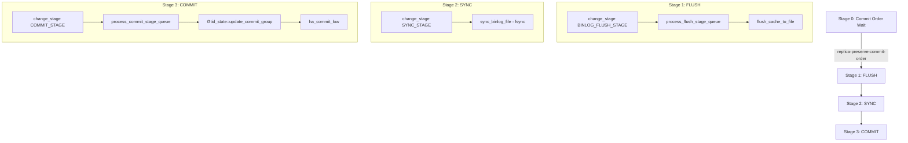
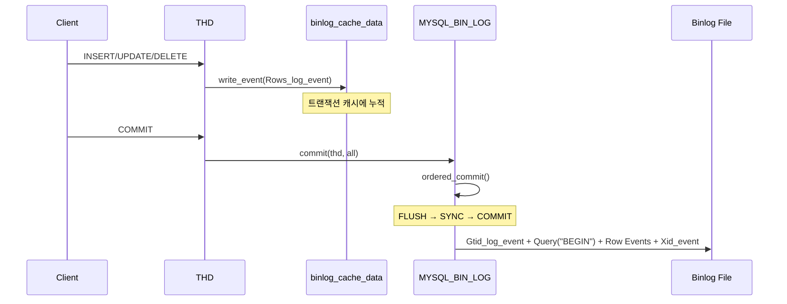

# 바이너리 로그와 복제

MySQL의 모든 데이터 변경은 바이너리 로그(Binary Log)에 기록되며, 이를 기반으로 소스-레플리카 간 복제가 이루어진다. `MYSQL_BIN_LOG` 클래스의 Group Commit 파이프라인부터 IO/SQL Thread의 내부 동작까지 소스코드 수준에서 분석한다.

## 목차
- [1. 핵심 개념 (What)](#1-핵심-개념-what)
- [2. 왜 알아야 하는가 (Why)](#2-왜-알아야-하는가-why)
- [3. 내부 구현 분석 (How)](#3-내부-구현-분석-how)
- [4. 실전 예제](#4-실전-예제)
- [5. 정리](#5-정리)

---

## 1. 핵심 개념 (What)

### 바이너리 로그란?

바이너리 로그는 MySQL 서버에서 발생하는 모든 데이터 변경 이벤트를 순차적으로 기록하는 로그 파일이다. 핵심 역할은 세 가지다:

1. **복제(Replication)**: 소스 서버의 변경 사항을 레플리카에 전파
2. **PITR(Point-in-Time Recovery)**: 특정 시점으로의 데이터 복구
3. **변경 데이터 캡처(CDC)**: 외부 시스템으로의 데이터 스트리밍

### Binlog Format 종류

| 포맷 | 설명 | 변수 값 |
|------|------|---------|
| **STATEMENT** | SQL 문 자체를 기록 | `binlog_format=STATEMENT` |
| **ROW** | 변경된 행 데이터를 기록 | `binlog_format=ROW` |
| **MIXED** | 기본 STATEMENT, 비결정적 시 ROW 전환 | `binlog_format=MIXED` |

### Binary Log Event 타입

소스코드 `sql/log_event.h`에 정의된 주요 이벤트 타입:

- **QUERY_EVENT**: DDL 또는 STATEMENT 포맷의 DML
- **TABLE_MAP_EVENT**: ROW 이벤트 전에 테이블 메타데이터 전달
- **WRITE_ROWS_EVENT**: INSERT 연산의 행 데이터
- **UPDATE_ROWS_EVENT**: UPDATE 연산의 before/after 이미지
- **DELETE_ROWS_EVENT**: DELETE 연산의 행 데이터
- **XID_EVENT**: 트랜잭션 커밋 마커
- **GTID_LOG_EVENT**: 트랜잭션의 GTID 정보

### GTID (Global Transaction ID)

GTID는 `source_uuid:transaction_id` 형식으로, 전체 복제 토폴로지에서 트랜잭션을 유일하게 식별한다.

```
# GTID 형식 예시
3E11FA47-71CA-11E1-9E33-C80AA9429562:23
```

`Gtid_log_event` 클래스(`sql/log_event.h:3951`)는 `mysql::binlog::event::Gtid_event`와 `Log_event`를 다중 상속하며, 논리적 타임스탬프(MTS용)를 포함한다.

---

## 2. 왜 알아야 하는가 (Why)

- **고가용성 구축**: 복제 구조를 이해해야 장애 시 페일오버 전략을 수립할 수 있다
- **복제 지연 해결**: IO Thread/SQL Thread 병목 지점을 파악하고 MTS(Multi-Threaded Slave) 튜닝이 가능하다
- **데이터 복구**: `mysqlbinlog`로 PITR 수행 시 binlog 이벤트 구조를 알아야 정확한 복구가 된다
- **Group Commit 최적화**: `sync_binlog`, `binlog_group_commit_sync_delay` 등의 튜닝 근거를 이해할 수 있다
- **GTID 기반 운영**: GTID의 내부 동작을 알면 `CHANGE REPLICATION SOURCE TO` 구성이 명확해진다

---

## 3. 내부 구현 분석 (How)

### 3.1 MYSQL_BIN_LOG 클래스 구조

`MYSQL_BIN_LOG`(`sql/binlog.h:107`)은 `TC_LOG`를 상속하며, 바이너리 로그의 전체 수명주기를 관리한다.

```
MYSQL_BIN_LOG : TC_LOG
├── LOCK_log              // 로그 쓰기 보호 mutex
├── m_binlog_file         // Binlog_ofile - 실제 파일 핸들
├── LOCK_binlog_end_pos   // end position 보호
├── LOCK_commit_queue     // 커밋 큐 mutex
├── LOCK_flush_queue      // 플러시 큐 mutex
├── LOCK_sync_queue       // 싱크 큐 mutex
└── enum_log_state        // LOG_OPENED / LOG_CLOSED / LOG_TO_BE_OPENED
```

### 3.2 Group Commit - ordered_commit()

`MYSQL_BIN_LOG::ordered_commit()`(`sql/binlog.cc:7886`)는 3단계 파이프라인으로 트랜잭션을 그룹 커밋한다.



**핵심 코드 흐름** (`sql/binlog.cc`):

```cpp
// Stage #0: 레플리카에서 커밋 순서 보장 (binlog.cc:7921)
Commit_order_manager::wait_for_its_turn_before_flush_stage(thd);

// Stage #1: FLUSH - 바이너리 로그에 쓰기 (binlog.cc:7938)
change_stage(thd, Commit_stage_manager::BINLOG_FLUSH_STAGE, thd, nullptr, &LOCK_log);
flush_error = process_flush_stage_queue(&total_bytes, &wait_queue);
flush_error = flush_cache_to_file(&flush_end_pos);

// Stage #2: SYNC - fsync 호출 (binlog.cc:7967 부근)
change_stage(thd, Commit_stage_manager::SYNC_STAGE, wait_queue, ...);
sync_binlog_file(false);  // sync_binlog 설정에 따라 동작

// Stage #3: COMMIT - 스토리지 엔진 커밋 (binlog.cc:8000 부근)
change_stage(thd, Commit_stage_manager::COMMIT_STAGE, ...);
process_commit_stage_queue(thd, ...);
```

리더 스레드가 각 스테이지의 큐에 들어온 모든 트랜잭션을 한 번에 처리하는 **Leader-Follower 패턴**이다.

### 3.3 Binlog Event 기록 흐름



### 3.4 복제 아키텍처: IO Thread / SQL Thread

`sql/rpl_replica.cc`에 정의된 두 핵심 스레드:

```
Source Server                    Replica Server
┌─────────────┐                 ┌──────────────────────────────────┐
│ Binlog File │                 │                                  │
│   (events)  │◄──Binlog Dump──│  IO Thread (handle_slave_io)     │
│             │   Protocol     │      │                            │
└─────────────┘                │      ▼                            │
                               │  Relay Log                        │
                               │      │                            │
                               │      ▼                            │
                               │  SQL Thread (handle_slave_sql)    │
                               │      │                            │
                               │      ▼                            │
                               │  exec_relay_log_event()           │
                               │      │                            │
                               │      ▼                            │
                               │  Storage Engine (InnoDB)          │
                               └──────────────────────────────────┘
```

#### IO Thread - `handle_slave_io()` (rpl_replica.cc:5281)

```cpp
extern "C" void *handle_slave_io(void *arg) {
    Master_info *mi = (Master_info *)arg;
    THD *thd = new THD;
    mi->info_thd = thd;
    mi->slave_running = 1;

    // 소스 서버에 연결
    MYSQL *mysql = nullptr;
    // ... 연결 수립 및 Binlog Dump 요청
    // 이벤트를 읽어 Relay Log에 기록하는 메인 루프
}
```

IO Thread는 소스 서버에 `COM_BINLOG_DUMP_GTID` 명령을 보내고, 받은 이벤트를 Relay Log에 순차적으로 기록한다.

#### SQL Thread - `handle_slave_sql()` (rpl_replica.cc:6904)

```cpp
extern "C" void *handle_slave_sql(void *arg) {
    Relay_log_info *rli = ((Master_info *)arg)->rli;
    Rpl_applier_reader applier_reader(rli);

    // Relay Log에서 이벤트를 읽어 적용하는 메인 루프
    // exec_relay_log_event(thd, rli, &applier_reader, ev);
}
```

#### exec_relay_log_event() (rpl_replica.cc:4855)

```cpp
static int exec_relay_log_event(THD *thd, Relay_log_info *rli,
                                Rpl_applier_reader *applier_reader,
                                Log_event *in) {
    mysql_mutex_lock(&rli->data_lock);
    Log_event *ev = in;
    // 이벤트 타입에 따라 적절한 핸들러로 디스패치
    // MTS인 경우 Worker Thread에 분배
}
```

### 3.5 Semi-Synchronous Replication

반동기 복제는 소스가 커밋 전에 최소 하나의 레플리카로부터 이벤트 수신 확인(ACK)을 기다린다.

```
Source                             Replica
  │                                  │
  │── Binlog Event ──────────────────►│
  │                                  │── Relay Log 기록
  │◄── ACK ──────────────────────────│
  │                                  │
  │── Engine Commit                  │
  │   (after_sync / after_commit)    │
```

- **AFTER_SYNC** (`rpl_semi_sync_source_wait_point=AFTER_SYNC`): fsync 후 ACK 대기 → 팬텀 읽기 방지
- **AFTER_COMMIT**: 엔진 커밋 후 ACK 대기 → 성능 약간 우수, 팬텀 읽기 가능

### 3.6 Binlog Compression (Zstd)

MySQL 9.x는 `binlog_transaction_compression=ON` 시 트랜잭션 페이로드를 Zstd로 압축한다. `sql/binlog.cc`의 include에서 `mysql/binlog/event/compression/zstd_comp.h`를 참조하며, `Transaction_payload_log_event`로 압축된 이벤트를 캡슐화한다.

---

## 4. 실전 예제

### 4.1 GTID 기반 복제 구성

```sql
-- Source 서버 설정
SET GLOBAL gtid_mode = ON;
SET GLOBAL enforce_gtid_consistency = ON;
SET GLOBAL binlog_format = ROW;
SET GLOBAL sync_binlog = 1;

-- Replica 서버에서 복제 시작
CHANGE REPLICATION SOURCE TO
  SOURCE_HOST = '192.168.1.100',
  SOURCE_PORT = 3306,
  SOURCE_USER = 'repl_user',
  SOURCE_PASSWORD = 'secure_password',
  SOURCE_AUTO_POSITION = 1,     -- GTID 기반 자동 포지셔닝
  GET_SOURCE_PUBLIC_KEY = 1;    -- caching_sha2_password 지원

START REPLICA;
```

### 4.2 복제 상태 모니터링

```sql
-- 복제 상태 전체 확인
SHOW REPLICA STATUS\G

-- GTID 기반 복제 갭 확인
SELECT
  @@global.gtid_executed AS executed,
  @@global.gtid_purged AS purged;

-- Performance Schema로 복제 지연 상세 분석
SELECT
  CHANNEL_NAME,
  SERVICE_STATE,
  LAST_ERROR_NUMBER,
  LAST_ERROR_MESSAGE,
  LAST_ERROR_TIMESTAMP
FROM performance_schema.replication_applier_status;

-- IO Thread / SQL Thread 개별 확인
SELECT * FROM performance_schema.replication_connection_status\G
SELECT * FROM performance_schema.replication_applier_status_by_worker\G
```

### 4.3 Group Commit 튜닝

```sql
-- sync_binlog: fsync 주기 (1=매 트랜잭션, 0=OS에 위임)
SET GLOBAL sync_binlog = 1;

-- Group Commit 그룹 크기 확대를 위한 지연
SET GLOBAL binlog_group_commit_sync_delay = 50;         -- 마이크로초
SET GLOBAL binlog_group_commit_sync_no_delay_count = 10; -- 최소 트랜잭션 수

-- 트랜잭션 압축 활성화
SET GLOBAL binlog_transaction_compression = ON;
SET GLOBAL binlog_transaction_compression_level_zstd = 3;
```

### 4.4 Multi-Threaded Applier 설정

```sql
-- 병렬 적용을 위한 MTS 설정 (Replica)
SET GLOBAL replica_parallel_workers = 8;
SET GLOBAL replica_parallel_type = 'LOGICAL_CLOCK';
SET GLOBAL replica_preserve_commit_order = ON;

-- MTS Worker 상태 확인
SELECT
  WORKER_ID,
  THREAD_ID,
  SERVICE_STATE,
  LAST_APPLIED_TRANSACTION,
  APPLYING_TRANSACTION
FROM performance_schema.replication_applier_status_by_worker;
```

### 4.5 특정 시점 복구 (PITR)

```bash
# 바이너리 로그에서 특정 GTID 범위 추출
mysqlbinlog --read-from-remote-server \
  --host=192.168.1.100 \
  --include-gtids='3E11FA47-71CA-11E1-9E33-C80AA9429562:1-100' \
  --exclude-gtids='3E11FA47-71CA-11E1-9E33-C80AA9429562:95-100' \
  binlog.000042 | mysql -u root -p target_db

# ROW 포맷 이벤트를 사람이 읽을 수 있는 형태로 디코딩
mysqlbinlog --base64-output=DECODE-ROWS -v binlog.000042
```

---

## 5. 정리

| 구성 요소 | 소스 파일 | 핵심 역할 |
|-----------|----------|----------|
| `MYSQL_BIN_LOG` | `sql/binlog.h:107` | 바이너리 로그 전체 관리, Group Commit 파이프라인 |
| `ordered_commit()` | `sql/binlog.cc:7886` | FLUSH → SYNC → COMMIT 3단계 그룹 커밋 |
| `Log_event` | `sql/log_event.h:540` | 모든 binlog 이벤트의 추상 기반 클래스 |
| `Gtid_log_event` | `sql/log_event.h:3951` | GTID + 논리적 타임스탬프 정보 |
| `handle_slave_io()` | `sql/rpl_replica.cc:5281` | IO Thread - 소스에서 이벤트 수신, Relay Log 기록 |
| `handle_slave_sql()` | `sql/rpl_replica.cc:6904` | SQL Thread - Relay Log 이벤트 적용 |
| `exec_relay_log_event()` | `sql/rpl_replica.cc:4855` | 개별 이벤트 디스패치 및 실행 |
| `Binlog_sender` | `sql/rpl_binlog_sender.h` | 소스 측 Binlog Dump 프로토콜 처리 |

**핵심 요약**:
- 바이너리 로그는 3-stage Group Commit (`FLUSH` → `SYNC` → `COMMIT`)으로 처리량을 극대화한다
- ROW 포맷은 결정적 복제를 보장하며, GTID는 토폴로지 변경 시 자동 포지셔닝을 가능하게 한다
- 복제는 IO Thread(이벤트 수신) + SQL Thread(이벤트 적용)의 2-thread 모델이며, MTS로 병렬 적용이 가능하다
- Semi-sync 복제는 `AFTER_SYNC` 모드에서 데이터 유실 없는 복제를 보장한다

---

## 6. Replication Lag 실무 대응

### 6.1 Lag 모니터링

```sql
SHOW REPLICA STATUS\G
-- 핵심 지표:
-- Seconds_Behind_Source: 지연 시간 (초)
-- Replica_IO_Running / Replica_SQL_Running: 스레드 상태
-- Relay_Log_Space: 릴레이 로그 크기
```

### 6.2 읽기 일관성 보장

```java
// 쓰기 후 읽기는 반드시 Source에서
@Transactional
public Order createOrder(OrderRequest request) {
    Order order = orderRepository.save(new Order(request));
    return orderRepository.findById(order.getId()).orElseThrow();  // Source 읽기
}

// 지연 허용 가능한 조회만 Replica로
@Transactional(readOnly = true)  // Replica 라우팅
public List<Order> getOrderHistory(Long userId) {
    return orderRepository.findByUserId(userId);
}
```

### 6.3 Spring Data JPA 읽기/쓰기 분리

```java
public class ReplicationRoutingDataSource extends AbstractRoutingDataSource {
    @Override
    protected Object determineCurrentLookupKey() {
        return TransactionSynchronizationManager
            .isCurrentTransactionReadOnly() ? "replica" : "source";
    }
}

@Configuration
public class DataSourceConfig {
    @Bean @Primary
    public DataSource routingDataSource(
            @Qualifier("sourceDataSource") DataSource source,
            @Qualifier("replicaDataSource") DataSource replica) {
        ReplicationRoutingDataSource ds = new ReplicationRoutingDataSource();
        ds.setTargetDataSources(Map.of("source", source, "replica", replica));
        ds.setDefaultTargetDataSource(source);
        return ds;
    }
}
```

---
*참고: MySQL 9.x (trunk) 소스코드 기준*
