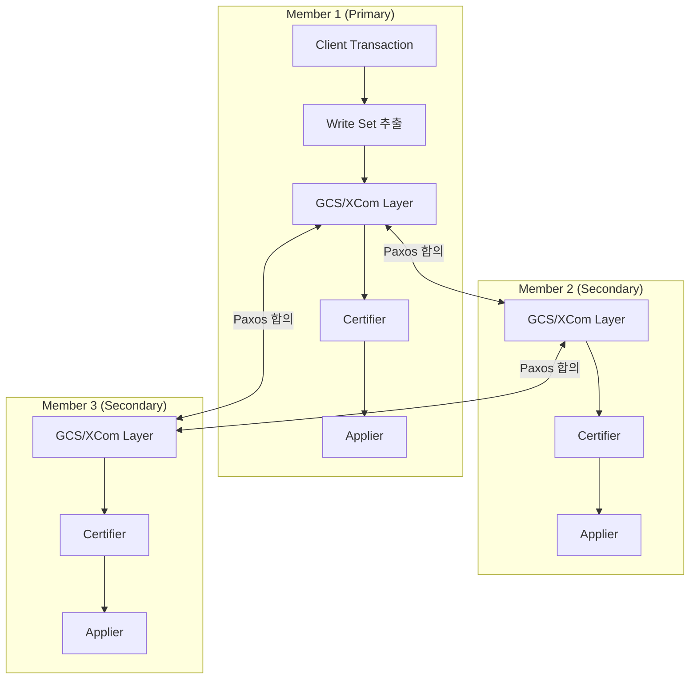

# Group Replication

MySQL Group Replication은 Paxos 기반 합의 프로토콜을 사용하여 다중 서버 간 자동 장애 감지, 충돌 해결, 그룹 멤버십 관리를 제공하는 고가용성 솔루션이다. `plugin/group_replication/` 디렉토리의 내부 구현을 분석한다.

## 목차
- [1. 핵심 개념 (What)](#1-핵심-개념-what)
- [2. 왜 알아야 하는가 (Why)](#2-왜-알아야-하는가-why)
- [3. 내부 구현 분석 (How)](#3-내부-구현-분석-how)
- [4. 실전 예제](#4-실전-예제)
- [5. 정리](#5-정리)

---

## 1. 핵심 개념 (What)

### Group Replication이란?

Group Replication(GR)은 MySQL 서버 그룹이 하나의 복제 그룹을 형성하여, 모든 멤버가 동일한 데이터를 유지하는 **가상 동기(virtually synchronous)** 복제 방식이다. 전통적인 비동기/반동기 복제와 달리, 트랜잭션이 그룹 전체의 합의를 거쳐야 커밋된다.

### 두 가지 운영 모드

| 모드 | 설명 | 쓰기 노드 |
|------|------|----------|
| **Single-Primary** | 하나의 Primary만 쓰기, 나머지는 읽기 전용 | 1개 (자동 선출) |
| **Multi-Primary** | 모든 멤버가 읽기/쓰기 가능 | 전체 멤버 |

### 핵심 구성 요소

1. **GCS (Group Communication System)**: Paxos/XCom 기반 통신 계층
2. **Certification**: Write Set 기반 트랜잭션 충돌 감지
3. **Applier**: 인증된 트랜잭션을 로컬에 적용
4. **Recovery**: 신규 멤버의 데이터 동기화
5. **Flow Control**: 멤버 간 적용 속도 차이 조절

---

## 2. 왜 알아야 하는가 (Why)

- **자동 페일오버**: Primary 장애 시 수동 개입 없이 새 Primary를 선출한다 (InnoDB Cluster의 기반)
- **데이터 일관성**: Certification 메커니즘이 충돌을 감지하여 분산 환경에서의 데이터 정합성을 보장한다
- **확장 가능한 읽기**: Secondary에서 최신 데이터의 일관된 읽기가 가능하다
- **운영 복잡도 감소**: GTID 자동 관리, 멤버 자동 복구 등으로 DBA 부담이 줄어든다
- **장애 진단**: Flow Control, Certification 실패 등의 내부 동작을 알아야 성능 문제를 해결할 수 있다

---

## 3. 내부 구현 분석 (How)

### 3.1 플러그인 디렉토리 구조

```
plugin/group_replication/
├── include/              # 헤더 파일
│   ├── certifier.h       # Certifier, Certifier_interface
│   ├── member_info.h     # Group_member_info
│   ├── gcs_operations.h  # Gcs_operations (GCS 래퍼)
│   ├── handlers/         # 이벤트 핸들러
│   │   └── certification_handler.h
│   └── plugin_handlers/  # Primary 선출 등
│       └── primary_election_invocation_handler.h
├── src/                  # 구현 파일
│   ├── certifier.cc      # Certification 로직
│   ├── gcs_event_handlers.cc
│   ├── member_info.cc
│   ├── applier.cc        # 트랜잭션 적용
│   ├── pipeline_stats.cc # Flow Control 통계
│   ├── consistency_manager.cc
│   └── certification/    # Certification 하위 모듈
└── libmysqlgcs/          # GCS/XCom 라이브러리
```

### 3.2 전체 아키텍처



### 3.3 트랜잭션 처리 흐름

```mermaid
sequenceDiagram
    participant Client
    participant Local as Local Member
    participant XCom as XCom (Paxos)
    participant Group as All Members
    participant Certifier

    Client->>Local: BEGIN; INSERT ...; COMMIT
    Local->>Local: Write Set 추출 (rpl_write_set_handler.cc)
    Local->>XCom: 트랜잭션 + Write Set 브로드캐스트
    XCom->>Group: Paxos 합의 (Total Order)
    Group->>Certifier: Certification 검사
    alt 충돌 없음
        Certifier->>Group: 인증 성공 (POSITIVE)
        Group->>Group: Applier에서 적용
        Local-->>Client: COMMIT 완료
    else 충돌 발생
        Certifier->>Local: 인증 실패 (NEGATIVE)
        Local-->>Client: ROLLBACK
    end
```

### 3.4 Write Set과 Certification

#### Write Set 추출 (rpl_write_set_handler.cc)

트랜잭션이 수정하는 모든 행의 고유 키를 해시하여 Write Set을 생성한다.

```cpp
// sql/rpl_write_set_handler.cc
// 해시 생성에 xxHash와 murmur3를 사용
#include "extra/xxhash/my_xxhash.h"
#include "my_murmur3.h"

#define HASH_STRING_SEPARATOR "½"
// Write Set 키 형식: "PRIMARY½db_name½table_name½col_value½col_value"
```

각 행의 Primary Key(또는 Unique Key) 값을 문자열로 결합한 후 해시하여, 64비트 정수로 변환한다. 이 해시 집합이 트랜잭션의 Write Set이 된다.

#### Certifier::certify() (certifier.cc:876)

```cpp
Certified_gtid Certifier::certify(
    Gtid_set *snapshot_version,        // 트랜잭션 시작 시점의 GTID 스냅샷
    std::list<const char *> *write_set, // 수정 대상 행의 해시 목록
    bool is_gtid_specified,
    const char *member_uuid,
    Gtid_log_event *gle,
    bool local_transaction) {

    // Certification_info (unordered_map<string, Gtid_set_ref*>)에서
    // write_set 각 항목을 조회하여 충돌 검사
    // → 이미 인증된 다른 트랜잭션이 같은 행을 수정했는지 확인
}
```

**Certification_info** 자료구조:
```
typedef std::unordered_map<
    std::string,       // Write Set 해시 키
    Gtid_set_ref *,    // 이 키를 마지막으로 수정한 트랜잭션의 GTID
    ...
> Certification_info;
```

충돌 판정 기준:
1. Write Set의 각 키에 대해 `Certification_info`를 조회
2. 해당 키를 마지막 수정한 트랜잭션의 GTID가 현재 트랜잭션의 **snapshot_version** 이후이면 충돌
3. 하나라도 충돌이 있으면 트랜잭션은 ROLLBACK

### 3.5 Group_member_info

`Group_member_info`(`plugin/group_replication/include/member_info.h:81`)는 `Plugin_gcs_message`를 상속하며, 각 멤버의 상태 정보를 관리한다.

```
Group_member_info : Plugin_gcs_message
├── PIT_HOSTNAME      // 호스트명
├── PIT_PORT          // 포트
├── PIT_UUID          // server_uuid
├── PIT_GR_VERSION    // GR 플러그인 버전
├── PIT_MEMBER_ROLE   // PRIMARY / SECONDARY
├── PIT_MEMBER_STATE  // ONLINE / RECOVERING / OFFLINE / ERROR
└── PIT_EXECUTED_GTID // 적용 완료된 GTID 셋
```

### 3.6 Primary 선출

`Primary_election_handler`(`plugin_handlers/primary_election_invocation_handler.h:46`)가 Primary 선출을 조율한다.

선출 기준 (Single-Primary 모드):
1. `group_replication_member_weight` 가중치 (높을수록 우선)
2. 동일 가중치 시 `server_uuid`의 사전식 순서 (낮을수록 우선)

### 3.7 Flow Control

멤버 간 적용 속도 차이가 커지면 Flow Control이 빠른 멤버의 쓰기를 억제한다. `pipeline_stats.cc`에서 각 멤버의 Certification Queue 크기와 Applier Queue 크기를 수집하여 제어한다.

```
Flow Control 발동 조건:
  certifier_queue_size > group_replication_flow_control_certifier_threshold
  또는
  applier_queue_size > group_replication_flow_control_applier_threshold
```

### 3.8 Gcs_operations

`Gcs_operations`(`include/gcs_operations.h:49`)는 XCom 통신 계층에 대한 래퍼로, 그룹 가입/탈퇴/메시지 전송 등의 모든 GCS 인터페이스 호출을 중앙 관리한다.

```cpp
class Gcs_operations {
public:
    enum enum_leave_state {
        NOW_LEAVING,        // 탈퇴 요청 수락
        ALREADY_LEAVING,    // 이미 탈퇴 중
        ALREADY_LEFT,       // 이미 탈퇴 완료
        ERROR_WHEN_LEAVING  // 탈퇴 오류
    };
    // ...
};
```

---

## 4. 실전 예제

### 4.1 Single-Primary 모드 구성

```sql
-- 모든 멤버 공통 설정 (my.cnf)
-- [mysqld]
-- server_id=1  (각 멤버마다 고유)
-- gtid_mode=ON
-- enforce_gtid_consistency=ON
-- binlog_checksum=NONE
-- log_bin=binlog
-- log_replica_updates=ON
-- binlog_format=ROW
-- relay_log=relay-bin

-- Group Replication 설정
SET GLOBAL group_replication_group_name = 'aaaaaaaa-bbbb-cccc-dddd-eeeeeeeeeeee';
SET GLOBAL group_replication_local_address = '192.168.1.101:33061';
SET GLOBAL group_replication_group_seeds = '192.168.1.101:33061,192.168.1.102:33061,192.168.1.103:33061';
SET GLOBAL group_replication_single_primary_mode = ON;
SET GLOBAL group_replication_enforce_update_everywhere_checks = OFF;

-- 복제 사용자 생성
CREATE USER 'repl_user'@'%' IDENTIFIED BY 'secure_password';
GRANT REPLICATION SLAVE ON *.* TO 'repl_user'@'%';
GRANT CONNECTION_ADMIN ON *.* TO 'repl_user'@'%';
GRANT BACKUP_ADMIN ON *.* TO 'repl_user'@'%';
GRANT GROUP_REPLICATION_STREAM ON *.* TO 'repl_user'@'%';

-- 복제 채널 설정
CHANGE REPLICATION SOURCE TO
  SOURCE_USER = 'repl_user',
  SOURCE_PASSWORD = 'secure_password'
  FOR CHANNEL 'group_replication_recovery';

-- 부트스트랩 (첫 번째 멤버만)
SET GLOBAL group_replication_bootstrap_group = ON;
START GROUP_REPLICATION;
SET GLOBAL group_replication_bootstrap_group = OFF;

-- 다른 멤버는 단순히:
-- START GROUP_REPLICATION;
```

### 4.2 그룹 상태 모니터링

```sql
-- 멤버 상태 확인
SELECT
  MEMBER_ID,
  MEMBER_HOST,
  MEMBER_PORT,
  MEMBER_STATE,
  MEMBER_ROLE,
  MEMBER_VERSION
FROM performance_schema.replication_group_members;

-- 그룹 통계 확인
SELECT * FROM performance_schema.replication_group_member_stats\G

-- 현재 Primary 확인
SELECT
  MEMBER_HOST,
  MEMBER_PORT
FROM performance_schema.replication_group_members
WHERE MEMBER_ROLE = 'PRIMARY';

-- Certification 지연 확인
SELECT
  MEMBER_ID,
  COUNT_TRANSACTIONS_IN_QUEUE AS cert_queue,
  COUNT_TRANSACTIONS_CHECKED AS certified,
  COUNT_CONFLICTS_DETECTED AS conflicts
FROM performance_schema.replication_group_member_stats;
```

### 4.3 Flow Control 튜닝

```sql
-- Flow Control 임계값 조정
SET GLOBAL group_replication_flow_control_mode = 'QUOTA';
SET GLOBAL group_replication_flow_control_certifier_threshold = 25000;
SET GLOBAL group_replication_flow_control_applier_threshold = 25000;

-- Flow Control 비율 조정 (0~100%)
SET GLOBAL group_replication_flow_control_min_quota = 0;
SET GLOBAL group_replication_flow_control_max_quota = 0;  -- 0 = 무제한

-- Flow Control 모니터링
SELECT * FROM performance_schema.replication_group_member_stats
WHERE MEMBER_ID = @@server_uuid\G
```

### 4.4 장애 상황 대응

```sql
-- 멤버 강제 제거 (네트워크 파티션 등)
SELECT group_replication_set_as_primary('member_uuid');

-- 특정 멤버 강제 퇴출
SELECT group_replication_force_members('192.168.1.101:33061,192.168.1.102:33061');

-- Primary 수동 전환
SELECT group_replication_set_as_primary('target_member_uuid');

-- 멤버 재가입
STOP GROUP_REPLICATION;
START GROUP_REPLICATION;
```

---

## 5. 정리

| 구성 요소 | 소스 위치 | 핵심 역할 |
|-----------|----------|----------|
| `Certifier` | `plugin/group_replication/include/certifier.h:236` | Write Set 기반 트랜잭션 충돌 감지 |
| `Certifier::certify()` | `src/certifier.cc:876` | snapshot_version 비교로 충돌 판정 |
| `Certification_handler` | `include/handlers/certification_handler.h:32` | 파이프라인에서 Certification 이벤트 처리 |
| `Group_member_info` | `include/member_info.h:81` | 멤버 상태(ONLINE/RECOVERING/ERROR) 관리 |
| `Gcs_operations` | `include/gcs_operations.h:49` | XCom/Paxos 통신 래퍼 |
| `Primary_election_handler` | `plugin_handlers/primary_election_invocation_handler.h:46` | Primary 선출 조율 |
| Write Set 추출 | `sql/rpl_write_set_handler.cc` | PK/UK 해시로 행 수준 충돌 감지 키 생성 |
| `rpl_group_replication.cc` | `sql/rpl_group_replication.cc` | SQL 레이어와 GR 플러그인 간 인터페이스 |

**핵심 요약**:
- GR은 **Paxos(XCom)** 합의를 통해 Total Order Broadcast로 모든 멤버에 동일 순서로 트랜잭션을 전달한다
- **Certification**은 Write Set의 해시를 `Certification_info` 맵과 비교하여 O(write_set_size)로 충돌을 감지한다
- Single-Primary 모드는 운영이 단순하고, Multi-Primary는 쓰기 확장성을 제공하지만 충돌 가능성이 높아진다
- **Flow Control**이 멤버 간 적용 속도 차이를 조절하여 그룹의 일관성을 유지한다

---
*참고: MySQL 9.x (trunk) 소스코드 기준*
