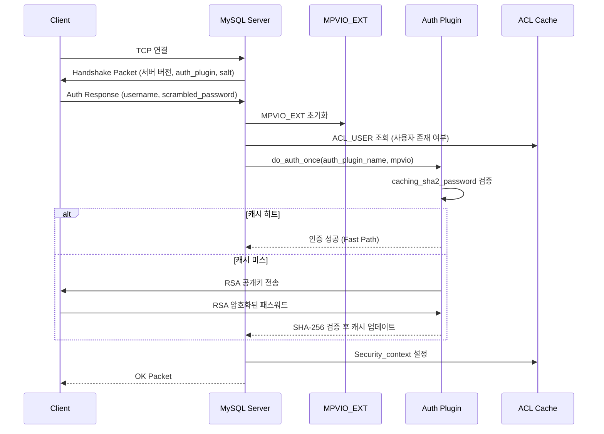
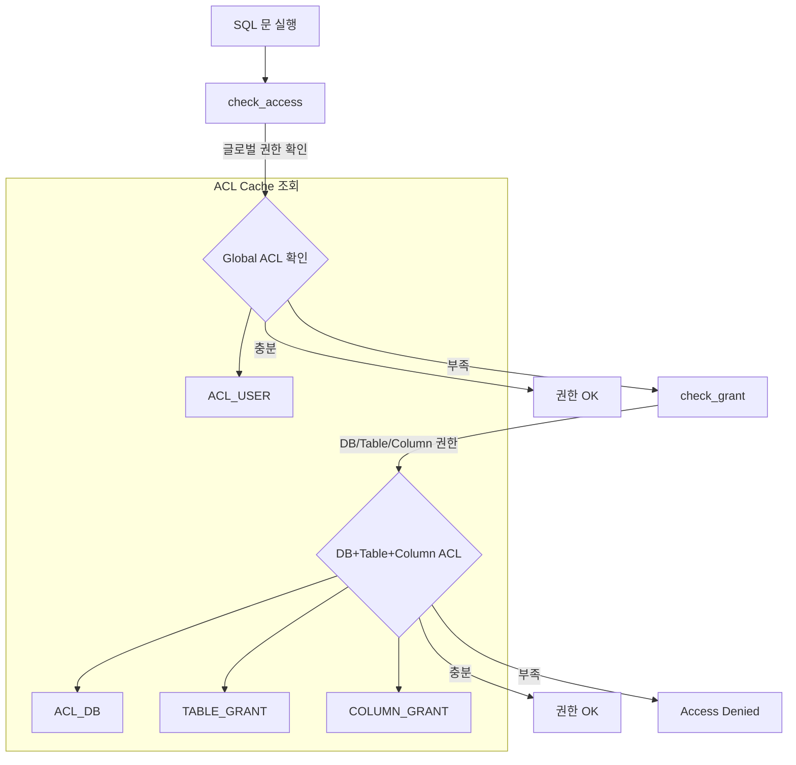
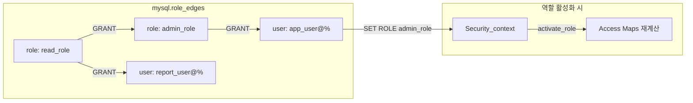

# 인증과 권한 시스템

MySQL의 인증(Authentication)과 권한 부여(Authorization)는 `sql/auth/` 디렉토리의 48개 파일에 구현되어 있다. 플러그인 기반 인증 프레임워크, ACL 캐시 구조, RBAC(Role-Based Access Control), 정적/동적 권한 체계를 소스코드 수준에서 분석한다.

## 목차
- [1. 핵심 개념 (What)](#1-핵심-개념-what)
- [2. 왜 알아야 하는가 (Why)](#2-왜-알아야-하는가-why)
- [3. 내부 구현 분석 (How)](#3-내부-구현-분석-how)
- [4. 실전 예제](#4-실전-예제)
- [5. 정리](#5-정리)

---

## 1. 핵심 개념 (What)

### 인증 vs 권한 부여

| 단계 | 질문 | 관련 코드 |
|------|------|----------|
| **Authentication** (인증) | "당신은 누구인가?" | `sql/auth/sql_authentication.cc` |
| **Authorization** (권한 부여) | "당신은 무엇을 할 수 있는가?" | `sql/auth/sql_authorization.cc` |

### 인증 플러그인

MySQL은 플러그인 기반 인증을 사용한다:

- **caching_sha2_password** (기본): SHA-256 + RSA 키 교환, 서버 측 캐시
- **mysql_native_password** (레거시, deprecated): SHA-1 기반
- **authentication_ldap_simple**: LDAP 통합
- **authentication_kerberos**: Kerberos 통합

### 권한 계층

```
글로벌 (*.*)
  └── 데이터베이스 (db.*)
        └── 테이블 (db.table)
              └── 컬럼 (db.table.column)
                    └── 루틴 (PROCEDURE/FUNCTION)
```

### ACL 테이블

| 시스템 테이블 | 용도 |
|-------------|------|
| `mysql.user` | 글로벌 권한, 인증 정보 |
| `mysql.db` | 데이터베이스 수준 권한 |
| `mysql.tables_priv` | 테이블 수준 권한 |
| `mysql.columns_priv` | 컬럼 수준 권한 |
| `mysql.procs_priv` | 루틴(프로시저/함수) 권한 |
| `mysql.global_grants` | 동적 권한 |
| `mysql.default_roles` | 기본 역할 매핑 |
| `mysql.role_edges` | 역할 그래프 (역할 간 상속) |

---

## 2. 왜 알아야 하는가 (Why)

- **보안 감사**: 권한 검사 흐름을 이해해야 보안 감사 시 취약점을 식별할 수 있다
- **RBAC 설계**: 역할 기반 접근 제어의 내부 동작을 알면 효과적인 권한 모델을 설계할 수 있다
- **인증 문제 해결**: `caching_sha2_password` 관련 연결 실패 등의 트러블슈팅에 필수적이다
- **최소 권한 원칙 적용**: 정적/동적 권한의 차이를 이해해야 세밀한 권한 부여가 가능하다
- **성능 영향**: ACL 캐시 무효화(FLUSH PRIVILEGES)가 성능에 미치는 영향을 이해할 수 있다

---

## 3. 내부 구현 분석 (How)

### 3.1 sql/auth/ 디렉토리 구조

```
sql/auth/
├── sql_authentication.cc/.h   # 플러그인 기반 인증 프레임워크
├── sql_authorization.cc/.h    # 권한 검사 로직 (RBAC 포함)
├── sql_auth_cache.cc/.h       # ACL 캐시 (ACL_USER, ACL_DB 등)
├── sql_security_ctx.cc/.h     # Security_context 클래스
├── sql_user.cc                # CREATE/ALTER/DROP USER
├── auth_acls.cc/.h            # Access_bitmask 정의
├── auth_common.h              # check_access, check_grant 선언
├── roles.cc/.h                # 역할 그래프 관리
├── role_tables.cc/.h          # mysql.role_edges 테이블 조작
├── sha2_password.cc           # caching_sha2_password 구현
├── dynamic_privileges_impl.cc # 동적 권한 등록/해제
├── dynamic_privilege_table.cc # mysql.global_grants 조작
├── partial_revokes.cc/.h      # 부분 취소(Partial Revokes)
├── password.cc                # 패스워드 검증
├── sql_mfa.cc/.h              # 다중 인증(MFA)
└── acl_table_user.cc/.h       # mysql.user 테이블 조작
```

### 3.2 인증 흐름



#### acl_authenticate() (auth_common.h:717)

```cpp
int acl_authenticate(THD *thd, enum_server_command command);
```

이 함수가 인증의 진입점이다. `MPVIO_EXT` 구조체를 초기화하고 `do_auth_once()`를 호출하여 인증 플러그인을 실행한다.

#### server_mpvio_info() (sql_authentication.cc:3546)

VIO(Virtual I/O) 정보를 인증 플러그인에 전달하는 콜백 함수로, 클라이언트의 네트워크 정보(TCP/Socket/Named Pipe)를 제공한다.

### 3.3 Security_context 클래스

`Security_context`(`sql/auth/sql_security_ctx.h:54`)는 현재 세션의 인증된 사용자 정보와 권한을 캡슐화한다.

```cpp
class Security_context {
public:
    // 인증된 사용자/호스트 정보
    LEX_CSTRING user() const;
    LEX_CSTRING host() const;
    LEX_CSTRING ip() const;
    LEX_CSTRING priv_user() const;  // 권한 검사에 사용되는 사용자
    LEX_CSTRING priv_host() const;  // 권한 검사에 사용되는 호스트

    // 권한 검사 메서드
    std::pair<bool, bool> has_global_grant(const char *priv, size_t priv_len);
    Access_bitmask db_acl(LEX_CSTRING db, bool use_pattern_scan = true) const;

    // 역할 관리
    int activate_role(LEX_CSTRING user, LEX_CSTRING host, bool validate_access = false);
    void clear_active_roles(void);
    List_of_auth_id_refs *get_active_roles();
    size_t get_num_active_roles() const;

    // 권한 맵 관리
    void checkout_access_maps(void);

    // skip-grants 모드
    void skip_grants(const char *user = "skip-grants user",
                     const char *host = "skip-grants host");
};
```

`Security_context`는 `THD` 객체의 멤버로, 모든 SQL 문 실행 시 권한 검사의 기준이 된다.

### 3.4 권한 검사 흐름



#### check_access() (auth_common.h:863)

```cpp
bool check_access(THD *thd, Access_bitmask want_access, const char *db,
                  Access_bitmask *save_priv,
                  GRANT_INTERNAL_INFO *grant_internal_info,
                  bool dont_check_global_grants, bool no_errors);
```

글로벌 수준의 권한을 먼저 확인한다. `Security_context`의 `m_master_access` 비트마스크와 요청된 `want_access`를 AND 연산하여 즉시 판별한다.

#### check_grant() (auth_common.h:798)

```cpp
bool check_grant(THD *thd, Access_bitmask want_access, Table_ref *tables,
                 bool any_combination_will_do, uint number, bool no_errors);
```

DB, 테이블, 컬럼 수준의 세분화된 권한을 검사한다. GRANT 테이블의 해시 맵에서 해당 사용자의 권한을 조회한다.

### 3.5 ACL 캐시 시스템

서버 시작 시 `mysql.*` 시스템 테이블에서 모든 ACL 정보를 메모리로 로드한다.

```
ACL Cache 구조 (sql/auth/sql_auth_cache.h):

ACL_USER (mysql.user 행 1:1 매핑)
├── ACL_HOST_AND_IP host     // 호스트 매칭 (IP/패턴)
├── char *user               // 사용자명
├── LEX_CSTRING plugin       // 인증 플러그인
├── enum SSL_type ssl_type   // SSL 요구 사항
├── USER_RESOURCES            // 리소스 제한 (max_connections 등)
├── password_expired          // 패스워드 만료 여부
└── Access_bitmask access    // 글로벌 권한 비트마스크

ACL_DB (mysql.db 행 1:1 매핑)
├── char *user, *db
└── Access_bitmask access    // DB 수준 권한

ACL_PROXY_USER (mysql.proxies_priv)
├── proxied_host, proxied_user
└── bool with_grant
```

`ACL_HOST_AND_IP`(`sql_auth_cache.h:75`)는 IP 매칭 시 `enum_ip_mask_type`으로 서브넷 마스크, CIDR, 와일드카드 패턴을 지원한다.

### 3.6 RBAC (Role-Based Access Control)

MySQL의 역할은 **이름이 있는 권한 컬렉션**이다. 내부적으로 역할도 사용자와 동일한 `ACL_USER` 구조로 관리된다.



#### 역할 활성화 과정

1. `Security_context::activate_role()` 호출
2. `mysql.role_edges` 그래프를 DFS로 순회하여 상속된 역할 수집
3. 모든 역할의 권한을 합산(OR)하여 `Security_context`의 Access Map에 반영
4. `checkout_access_maps()`로 실제 권한 비트마스크 업데이트

#### Default Roles

```cpp
// sql/auth/auth_internal.h:332
bool alter_user_set_default_roles(THD *thd, TABLE *table, LEX_USER *user,
                                  const List_of_auth_id_refs &new_auth_ids);
```

`mysql.default_roles` 테이블에 저장되며, 로그인 시 자동으로 활성화된다.

### 3.7 정적 권한 vs 동적 권한

#### 정적 권한 (Static Privileges)

서버에 내장된 전통적 권한. `sql/auth/auth_acls.h`에 비트마스크로 정의:

```
SELECT, INSERT, UPDATE, DELETE, CREATE, DROP,
RELOAD, SHUTDOWN, PROCESS, FILE, GRANT, REFERENCES,
INDEX, ALTER, SHOW DATABASES, SUPER, CREATE TEMPORARY TABLES,
LOCK TABLES, EXECUTE, REPLICATION SLAVE, REPLICATION CLIENT,
CREATE VIEW, SHOW VIEW, CREATE ROUTINE, ALTER ROUTINE,
CREATE USER, EVENT, TRIGGER, CREATE TABLESPACE, ...
```

#### 동적 권한 (Dynamic Privileges)

플러그인/컴포넌트가 런타임에 등록하는 확장 권한:

```cpp
// sql/auth/dynamic_privileges_impl.h:35
class dynamic_privilege_services_impl {
public:
    static DEFINE_BOOL_METHOD(register_privilege,
        (const char *privilege_str, size_t privilege_str_len));
    static DEFINE_BOOL_METHOD(unregister_privilege,
        (const char *privilege_str, size_t privilege_str_len));
};
```

주요 동적 권한:
- `SYSTEM_VARIABLES_ADMIN`, `ROLE_ADMIN`
- `CONNECTION_ADMIN`, `BACKUP_ADMIN`
- `GROUP_REPLICATION_ADMIN`, `GROUP_REPLICATION_STREAM`
- `REPLICATION_APPLIER`, `REPLICATION_SLAVE_ADMIN`
- `AUDIT_ADMIN`, `FIREWALL_ADMIN`
- `CLONE_ADMIN`, `RESOURCE_GROUP_ADMIN`

동적 권한은 `mysql.global_grants` 테이블에 저장되며, `SUPER` 권한의 세분화된 대체재이다.

---

## 4. 실전 예제

### 4.1 역할 기반 권한 모델 설계

```sql
-- 역할 생성
CREATE ROLE 'app_read'@'%', 'app_write'@'%', 'app_admin'@'%';

-- 권한 부여
GRANT SELECT ON app_db.* TO 'app_read'@'%';
GRANT INSERT, UPDATE, DELETE ON app_db.* TO 'app_write'@'%';
GRANT ALL PRIVILEGES ON app_db.* TO 'app_admin'@'%';

-- 역할 상속 (app_admin은 read + write 포함)
GRANT 'app_read'@'%' TO 'app_write'@'%';
GRANT 'app_write'@'%' TO 'app_admin'@'%';

-- 사용자 생성 및 역할 할당
CREATE USER 'api_service'@'10.0.%'
  IDENTIFIED WITH caching_sha2_password BY 'secure_pw'
  PASSWORD EXPIRE INTERVAL 90 DAY
  FAILED_LOGIN_ATTEMPTS 3
  PASSWORD_LOCK_TIME 1;

GRANT 'app_write'@'%' TO 'api_service'@'10.0.%';
SET DEFAULT ROLE 'app_write'@'%' TO 'api_service'@'10.0.%';

-- 읽기 전용 사용자
CREATE USER 'report_user'@'10.0.%'
  IDENTIFIED WITH caching_sha2_password BY 'secure_pw';
GRANT 'app_read'@'%' TO 'report_user'@'10.0.%';
SET DEFAULT ROLE ALL TO 'report_user'@'10.0.%';
```

### 4.2 동적 권한으로 SUPER 대체

```sql
-- 기존: SUPER 권한 부여 (너무 과도함)
-- GRANT SUPER ON *.* TO 'dba'@'%';

-- 권장: 필요한 동적 권한만 부여
CREATE USER 'dba'@'admin-host'
  IDENTIFIED WITH caching_sha2_password BY 'very_secure_pw'
  REQUIRE SSL;

GRANT
  SYSTEM_VARIABLES_ADMIN,
  CONNECTION_ADMIN,
  ROLE_ADMIN,
  BACKUP_ADMIN,
  CLONE_ADMIN,
  REPLICATION_SLAVE_ADMIN,
  GROUP_REPLICATION_ADMIN,
  RESOURCE_GROUP_ADMIN
ON *.* TO 'dba'@'admin-host';
```

### 4.3 권한 감사 쿼리

```sql
-- 특정 사용자의 모든 권한 확인
SHOW GRANTS FOR 'api_service'@'10.0.%' USING 'app_write'@'%';

-- 동적 권한 목록 조회
SELECT * FROM information_schema.USER_PRIVILEGES
WHERE GRANTEE LIKE "'dba'%";

-- 글로벌 동적 권한 확인
SELECT * FROM mysql.global_grants WHERE USER = 'dba';

-- 역할 그래프 확인
SELECT * FROM mysql.role_edges;

-- 만료된 패스워드 사용자 찾기
SELECT User, Host, password_expired, password_last_changed,
       password_lifetime
FROM mysql.user
WHERE password_expired = 'Y'
   OR (password_lifetime > 0
       AND password_last_changed + INTERVAL password_lifetime DAY < NOW());

-- 인증 플러그인별 사용자 분포
SELECT plugin, COUNT(*) AS user_count
FROM mysql.user
GROUP BY plugin
ORDER BY user_count DESC;
```

### 4.4 Partial Revokes 활용

```sql
-- Partial Revokes 활성화
SET GLOBAL partial_revokes = ON;

-- 글로벌 SELECT 부여 후 특정 DB 제외
GRANT SELECT ON *.* TO 'analyst'@'%';
REVOKE SELECT ON mysql.* FROM 'analyst'@'%';
REVOKE SELECT ON information_schema.* FROM 'analyst'@'%';

-- 제외된 권한 확인
SELECT * FROM information_schema.USER_ATTRIBUTES
WHERE USER = 'analyst'\G
```

---

## 5. 정리

| 구성 요소 | 소스 위치 | 핵심 역할 |
|-----------|----------|----------|
| `Security_context` | `sql/auth/sql_security_ctx.h:54` | 세션별 인증/권한 상태 관리 |
| `acl_authenticate()` | `sql/auth/auth_common.h:717` | 인증 진입점 - 플러그인 기반 인증 실행 |
| `check_access()` | `sql/auth/auth_common.h:863` | 글로벌 수준 권한 검사 |
| `check_grant()` | `sql/auth/auth_common.h:798` | DB/테이블/컬럼 수준 권한 검사 |
| `ACL_USER` | `sql/auth/sql_auth_cache.h:248` | mysql.user 행의 메모리 캐시 구조 |
| `ACL_HOST_AND_IP` | `sql/auth/sql_auth_cache.h:75` | IP/호스트 패턴 매칭 |
| `dynamic_privilege_services_impl` | `sql/auth/dynamic_privileges_impl.h:35` | 동적 권한 등록/해제 서비스 |
| `activate_role()` | `sql/auth/sql_security_ctx.h` | 역할 활성화 및 Access Map 재계산 |

**핵심 요약**:
- MySQL은 **플러그인 기반 인증**으로 `caching_sha2_password`가 기본이며, SHA-256 + RSA + 서버 캐시로 보안과 성능을 모두 확보한다
- 권한 검사는 `check_access()` → `check_grant()` 순서로, 글로벌에서 컬럼 수준까지 계층적으로 수행된다
- **RBAC**는 `mysql.role_edges` 그래프를 DFS 순회하여 상속된 모든 역할의 권한을 합산한다
- **동적 권한**은 `SUPER`의 세분화된 대체재로, 최소 권한 원칙 적용에 필수적이다
- **Partial Revokes**(`partial_revokes=ON`)로 글로벌 권한에서 특정 DB를 제외할 수 있다

---
*참고: MySQL 9.x (trunk) 소스코드 기준*
