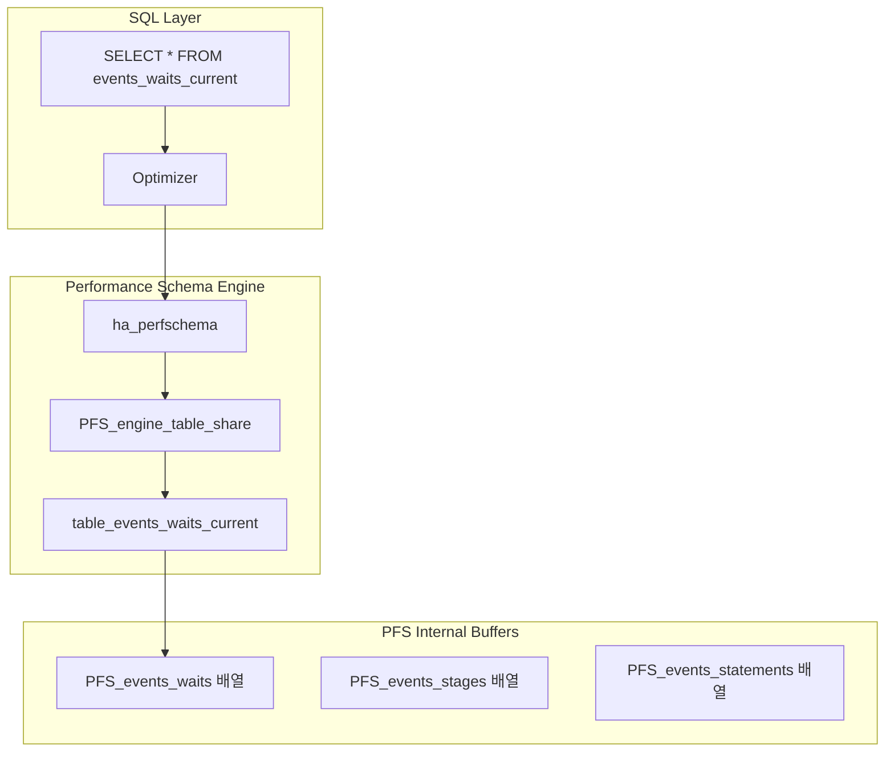
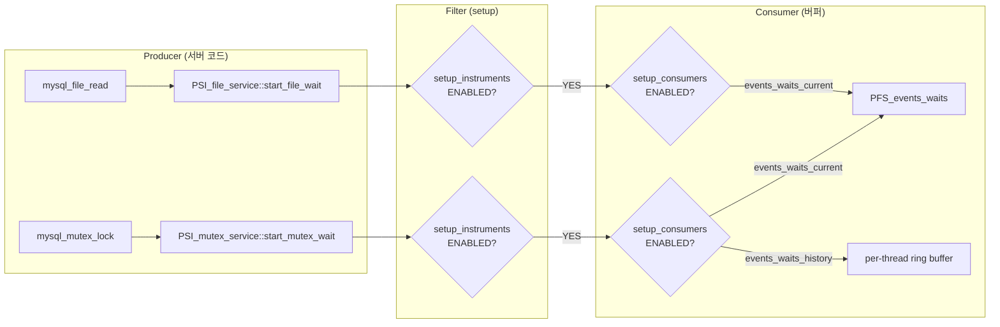

# Performance Schema

Performance Schema는 MySQL 서버의 내부 실행을 실시간으로 관찰할 수 있는 저수준 모니터링 프레임워크다. `storage/perfschema/`의 331개 파일과 `include/mysql/psi/` PSI 인터페이스를 분석하여, 계측 포인트(Instrumentation Points)부터 실전 성능 분석까지 소스코드 수준에서 살펴본다.

## 목차
- [1. 핵심 개념 (What)](#1-핵심-개념-what)
- [2. 왜 알아야 하는가 (Why)](#2-왜-알아야-하는가-why)
- [3. 내부 구현 분석 (How)](#3-내부-구현-분석-how)
- [4. 실전 예제](#4-실전-예제)
- [5. 정리](#5-정리)

---

## 1. 핵심 개념 (What)

### Performance Schema란?

Performance Schema(P_S)는 MySQL 서버 내부에 삽입된 **계측 포인트(instrumentation points)**를 통해 런타임 이벤트를 수집하는 스토리지 엔진이다. 디스크가 아닌 메모리 기반으로 동작하며, `PERFORMANCE_SCHEMA` 데이터베이스의 테이블로 데이터를 노출한다.

### PSI (Performance Schema Interface)

PSI는 MySQL 서버 코드와 Performance Schema 구현을 분리하는 추상 인터페이스 계층이다. 서버의 모든 계측 가능한 객체(mutex, file, socket, thread 등)는 PSI를 통해 P_S에 이벤트를 보고한다.

### 이벤트 계층 구조

```
Events
├── Waits          (가장 저수준: mutex, rwlock, cond, file, socket, idle)
├── Stages         (SQL 처리 단계: "Sending data", "Creating sort index")
├── Statements     (SQL 문 수준: SELECT, INSERT, CALL)
├── Transactions   (트랜잭션 수준: BEGIN, COMMIT)
└── Errors         (에러 이벤트)
```

### 핵심 테이블 카테고리

| 카테고리 | 테이블 패턴 | 용도 |
|---------|-----------|------|
| **setup** | `setup_instruments`, `setup_consumers` | 계측/수집 설정 |
| **current** | `events_*_current` | 현재 진행 중인 이벤트 |
| **history** | `events_*_history` | 스레드별 최근 이벤트 (기본 10개) |
| **history_long** | `events_*_history_long` | 글로벌 최근 이벤트 (기본 10000개) |
| **summary** | `events_*_summary_*` | 집계 통계 (count, sum, min, avg, max) |
| **instances** | `*_instances` | 계측 대상 인스턴스 (mutex, file 등) |

---

## 2. 왜 알아야 하는가 (Why)

- **병목 진단**: 어떤 mutex에서 대기가 발생하는지, 어떤 SQL이 느린지 실시간으로 파악할 수 있다
- **락 분석**: `data_locks`, `data_lock_waits` 테이블로 InnoDB 락 상태를 비파괴적으로 관찰한다
- **메모리 추적**: `memory_summary_*` 테이블로 컴포넌트별 메모리 사용량을 모니터링한다
- **복제 모니터링**: `replication_*` 테이블로 복제 상태를 구조화된 형태로 조회한다
- **쿼리 프로파일링**: `events_statements_*`에서 실행 시간, 행 스캔 수, 임시 테이블 생성 등을 분석한다
- **sys Schema 기반**: `sys` 스키마의 모든 뷰가 P_S 테이블을 소스로 사용한다

---

## 3. 내부 구현 분석 (How)

### 3.1 스토리지 엔진으로서의 P_S



`ha_perfschema`(`storage/perfschema/ha_perfschema.h:56`)는 `handler` 클래스를 상속한 P_S의 스토리지 엔진 핸들러다.

```cpp
class ha_perfschema : public handler {
public:
    ha_perfschema(handlerton *hton, TABLE_SHARE *share);

    const char *table_type() const override { return pfs_engine_name; }

    // 테이블 스캔 (rnd_init → rnd_next → rnd_end)
    int rnd_init(bool scan) override;
    int rnd_next(uchar *buf) override;
    int rnd_end() override;

    // 인덱스 스캔
    int index_init(uint idx, bool sorted) override;
    int index_read(...) override;
};
```

각 P_S 테이블은 `PFS_engine_table_share` 구조체로 등록되며, 실제 데이터는 서버 프로세스 내의 고정 크기 메모리 버퍼에 저장된다.

### 3.2 PSI 인터페이스 계층

```
include/mysql/psi/
├── psi_mutex.h       # PSI_mutex_service - mutex 계측
├── psi_rwlock.h      # PSI_rwlock_service
├── psi_cond.h        # PSI_cond_service
├── psi_file.h        # PSI_file_service
├── psi_socket.h      # PSI_socket_service
├── psi_thread.h      # PSI_thread_service
├── psi_memory.h      # PSI_memory_service
├── psi_stage.h       # PSI_stage_service
├── psi_statement.h   # PSI_statement_service
├── psi_transaction.h # PSI_transaction_service
├── mysql_mutex.h     # mysql_mutex_init/lock/unlock 매크로
├── mysql_file.h      # mysql_file_open/read/write 매크로
└── mysql_thread.h    # mysql_thread_create 매크로
```

#### PSI 서비스 인터페이스 패턴

```cpp
// include/mysql/psi/psi_mutex.h:64
struct PSI_mutex_service_v1 {
    register_mutex_v1_t register_mutex;     // 계측 클래스 등록
    init_mutex_v1_t init_mutex;             // mutex 인스턴스 초기화
    destroy_mutex_v1_t destroy_mutex;       // mutex 인스턴스 해제
    start_mutex_wait_v1_t start_mutex_wait; // 대기 시작 기록
    end_mutex_wait_v1_t end_mutex_wait;     // 대기 종료 기록
    unlock_mutex_v1_t unlock_mutex;         // unlock 기록
};
```

#### mysql_mutex 매크로 (mysql_mutex.h)

```cpp
// include/mysql/psi/mysql_mutex.h:134
#define mysql_mutex_register(P1, P2, P3) inline_mysql_mutex_register(P1, P2, P3)
```

서버 코드에서 `mysql_mutex_lock()` 등의 매크로를 호출하면, PSI 인터페이스를 통해 P_S에 대기 이벤트가 자동으로 기록된다.

### 3.3 Instrument 클래스 구조

`PFS_instr_class`(`storage/perfschema/pfs_instr_class.h:248`)는 모든 계측 포인트의 기반 구조체다.

```cpp
struct PFS_instr_class {
    PFS_class_type m_type;    // MUTEX, RWLOCK, COND, FILE, SOCKET, ...
    bool m_enabled;           // 활성화 여부
    bool m_timed;             // 시간 측정 여부
    uint m_flags;             // 플래그
    uint m_enforced_flags;    // 강제 플래그
    // ... instrument 이름, 문서 등
};

// 구체 계측 클래스
struct PFS_ALIGNED PFS_mutex_class : public PFS_instr_class {
    PFS_mutex_stat m_mutex_stat;  // mutex 통계
};
```

### 3.4 이벤트 수집 파이프라인



#### Consumer 계층 (필터링 순서)

```
global_instrumentation          (최상위, OFF 시 모든 수집 중단)
├── thread_instrumentation
│   ├── events_waits_current
│   │   ├── events_waits_history
│   │   └── events_waits_history_long
│   ├── events_stages_current
│   │   ├── events_stages_history
│   │   └── events_stages_history_long
│   ├── events_statements_current
│   │   ├── events_statements_history
│   │   └── events_statements_history_long
│   └── events_transactions_current
│       ├── events_transactions_history
│       └── events_transactions_history_long
├── statements_digest           (쿼리 다이제스트 집계)
└── 각종 summary 테이블
```

상위 Consumer가 비활성화되면 하위도 자동 비활성화된다.

### 3.5 메모리 할당 모델

P_S는 서버 시작 시 고정 크기 버퍼를 미리 할당한다. 런타임 중 동적 메모리 할당을 피하여 성능 영향을 최소화한다.

```
주요 크기 변수 (performance_schema_*):
├── max_mutex_instances        (기본: -1, 자동 크기)
├── max_file_instances
├── max_socket_instances
├── max_thread_instances
├── events_waits_history_size  (스레드당 이벤트 수, 기본 10)
├── events_waits_history_long_size (글로벌, 기본 10000)
├── events_statements_history_size
├── events_statements_history_long_size
├── digests_size               (다이제스트 버킷 수, 기본 10000)
└── max_digest_length          (다이제스트 최대 길이, 기본 1024)
```

### 3.6 테이블 구현 패턴

각 P_S 테이블은 `cursor_by_*` 패턴으로 구현된다:

```
storage/perfschema/
├── cursor_by_thread.cc/.h            # 스레드별 순회
├── cursor_by_account.cc/.h           # 계정별 순회
├── cursor_by_host.cc/.h              # 호스트별 순회
├── cursor_by_user.cc/.h              # 사용자별 순회
├── cursor_by_thread_connect_attr.cc  # 연결 속성별 순회
├── table_events_waits.cc             # events_waits_* 테이블
├── table_events_stages.cc            # events_stages_* 테이블
├── table_events_statements.cc        # events_statements_* 테이블
├── table_events_transactions.cc      # events_transactions_* 테이블
└── table_setup_instruments.cc        # setup_instruments 테이블
```

---

## 4. 실전 예제

### 4.1 계측 설정 관리

```sql
-- 현재 활성화된 instrument 확인
SELECT NAME, ENABLED, TIMED
FROM performance_schema.setup_instruments
WHERE ENABLED = 'YES'
ORDER BY NAME
LIMIT 20;

-- InnoDB mutex 계측 활성화
UPDATE performance_schema.setup_instruments
SET ENABLED = 'YES', TIMED = 'YES'
WHERE NAME LIKE 'wait/synch/mutex/innodb/%';

-- Consumer 활성화
UPDATE performance_schema.setup_consumers
SET ENABLED = 'YES'
WHERE NAME IN (
    'events_waits_current',
    'events_waits_history',
    'events_statements_current',
    'events_statements_history'
);

-- 특정 사용자만 모니터링
UPDATE performance_schema.setup_actors
SET ENABLED = 'YES', HISTORY = 'YES'
WHERE USER = 'app_user';

-- 나머지 사용자 모니터링 끄기
UPDATE performance_schema.setup_actors
SET ENABLED = 'NO', HISTORY = 'NO'
WHERE USER = '%';
```

### 4.2 실시간 대기 이벤트 분석

```sql
-- 가장 많이 대기하는 이벤트 Top 10
SELECT
    EVENT_NAME,
    COUNT_STAR AS total_waits,
    SUM_TIMER_WAIT / 1000000000 AS total_wait_ms,
    AVG_TIMER_WAIT / 1000000000 AS avg_wait_ms,
    MAX_TIMER_WAIT / 1000000000 AS max_wait_ms
FROM performance_schema.events_waits_summary_global_by_event_name
WHERE COUNT_STAR > 0
  AND EVENT_NAME NOT LIKE 'idle%'
ORDER BY SUM_TIMER_WAIT DESC
LIMIT 10;

-- 현재 대기 중인 스레드 확인
SELECT
    t.THREAD_ID,
    t.PROCESSLIST_ID,
    t.PROCESSLIST_USER,
    t.PROCESSLIST_DB,
    w.EVENT_NAME AS waiting_on,
    w.TIMER_WAIT / 1000000000 AS wait_ms
FROM performance_schema.events_waits_current w
JOIN performance_schema.threads t ON w.THREAD_ID = t.THREAD_ID
WHERE w.TIMER_END IS NULL
  AND t.PROCESSLIST_ID IS NOT NULL
ORDER BY w.TIMER_WAIT DESC;
```

### 4.3 슬로우 쿼리 분석

```sql
-- 가장 느린 쿼리 다이제스트 Top 10
SELECT
    DIGEST_TEXT,
    COUNT_STAR AS exec_count,
    ROUND(SUM_TIMER_WAIT / 1000000000000, 2) AS total_sec,
    ROUND(AVG_TIMER_WAIT / 1000000000000, 4) AS avg_sec,
    ROUND(MAX_TIMER_WAIT / 1000000000000, 4) AS max_sec,
    SUM_ROWS_EXAMINED AS rows_examined,
    SUM_ROWS_SENT AS rows_sent,
    SUM_CREATED_TMP_TABLES AS tmp_tables,
    SUM_CREATED_TMP_DISK_TABLES AS tmp_disk_tables,
    SUM_NO_INDEX_USED AS full_scans
FROM performance_schema.events_statements_summary_by_digest
WHERE SCHEMA_NAME IS NOT NULL
ORDER BY SUM_TIMER_WAIT DESC
LIMIT 10;

-- 실행 중인 SQL 문 상세
SELECT
    t.PROCESSLIST_ID,
    t.PROCESSLIST_USER,
    s.SQL_TEXT,
    s.TIMER_WAIT / 1000000000000 AS elapsed_sec,
    s.ROWS_EXAMINED,
    s.ROWS_SENT,
    st.EVENT_NAME AS current_stage,
    st.TIMER_WAIT / 1000000000 AS stage_ms
FROM performance_schema.events_statements_current s
JOIN performance_schema.threads t ON s.THREAD_ID = t.THREAD_ID
LEFT JOIN performance_schema.events_stages_current st ON st.THREAD_ID = t.THREAD_ID
WHERE t.PROCESSLIST_COMMAND != 'Sleep'
  AND t.PROCESSLIST_ID IS NOT NULL
ORDER BY s.TIMER_WAIT DESC;
```

### 4.4 메모리 사용량 분석

```sql
-- 컴포넌트별 메모리 사용량
SELECT
    EVENT_NAME,
    CURRENT_COUNT_USED AS alloc_count,
    ROUND(CURRENT_NUMBER_OF_BYTES_USED / 1024 / 1024, 2) AS current_mb,
    ROUND(HIGH_NUMBER_OF_BYTES_USED / 1024 / 1024, 2) AS peak_mb
FROM performance_schema.memory_summary_global_by_event_name
WHERE CURRENT_NUMBER_OF_BYTES_USED > 1024 * 1024  -- 1MB 이상
ORDER BY CURRENT_NUMBER_OF_BYTES_USED DESC
LIMIT 15;

-- 사용자별 메모리 사용량
SELECT
    USER,
    HOST,
    ROUND(CURRENT_NUMBER_OF_BYTES_USED / 1024 / 1024, 2) AS current_mb
FROM performance_schema.memory_summary_by_account_by_event_name
WHERE EVENT_NAME = 'memory/sql/THD::main_mem_root'
ORDER BY CURRENT_NUMBER_OF_BYTES_USED DESC
LIMIT 10;
```

### 4.5 InnoDB 락 분석

```sql
-- 현재 데이터 락 확인
SELECT
    ENGINE_LOCK_ID,
    ENGINE_TRANSACTION_ID,
    OBJECT_SCHEMA,
    OBJECT_NAME,
    LOCK_TYPE,
    LOCK_MODE,
    LOCK_STATUS,
    LOCK_DATA
FROM performance_schema.data_locks
WHERE LOCK_STATUS = 'GRANTED'
ORDER BY ENGINE_TRANSACTION_ID;

-- 락 대기 관계 분석
SELECT
    r.ENGINE_TRANSACTION_ID AS waiting_trx,
    r.OBJECT_NAME AS table_name,
    r.LOCK_MODE AS waiting_lock_mode,
    b.ENGINE_TRANSACTION_ID AS blocking_trx,
    b.LOCK_MODE AS blocking_lock_mode,
    b.LOCK_DATA
FROM performance_schema.data_lock_waits w
JOIN performance_schema.data_locks r
  ON w.REQUESTING_ENGINE_LOCK_ID = r.ENGINE_LOCK_ID
JOIN performance_schema.data_locks b
  ON w.BLOCKING_ENGINE_LOCK_ID = b.ENGINE_LOCK_ID;
```

### 4.6 sys Schema 활용

```sql
-- sys Schema는 P_S의 사용자 친화적 래퍼

-- IO 핫 파일 확인
SELECT * FROM sys.io_global_by_file_by_bytes
ORDER BY total DESC LIMIT 10;

-- 가장 비용이 큰 SQL
SELECT * FROM sys.statements_with_runtimes_in_95th_percentile LIMIT 10;

-- 미사용 인덱스
SELECT * FROM sys.schema_unused_indexes
WHERE object_schema NOT IN ('mysql', 'sys', 'performance_schema');

-- 세션별 메모리 사용량
SELECT * FROM sys.memory_by_thread_by_current_bytes
ORDER BY current_allocated DESC LIMIT 10;
```

---

## 5. 정리

| 구성 요소 | 소스 위치 | 핵심 역할 |
|-----------|----------|----------|
| `ha_perfschema` | `storage/perfschema/ha_perfschema.h:56` | P_S 스토리지 엔진 핸들러 |
| `PFS_instr_class` | `storage/perfschema/pfs_instr_class.h:248` | 계측 클래스 기반 구조체 (enabled, timed) |
| `PFS_mutex_class` | `pfs_instr_class.h:363` | mutex 계측 클래스 |
| `PSI_mutex_service_v1` | `include/mysql/psi/psi_mutex.h:64` | mutex PSI 서비스 인터페이스 |
| `mysql_mutex_register` | `include/mysql/psi/mysql_mutex.h:134` | instrument 등록 매크로 |
| `cursor_by_thread` | `storage/perfschema/cursor_by_thread.h` | 스레드별 데이터 순회 커서 패턴 |
| `pfs_enabled` | `pfs_instr_class.h:88` | 글로벌 P_S 활성화 플래그 |

**핵심 요약**:
- Performance Schema는 **스토리지 엔진**으로 구현되어, 표준 SQL로 내부 메트릭을 조회한다
- **PSI 인터페이스**가 서버 코드와 P_S 구현을 분리하여, `mysql_mutex_lock()` 등의 매크로로 투명하게 계측한다
- `setup_instruments`로 **무엇을** 수집할지, `setup_consumers`로 **어디에** 저장할지를 독립적으로 제어한다
- 고정 크기 메모리 버퍼를 서버 시작 시 할당하여 런타임 오버헤드를 최소화한다
- `events_waits` → `events_stages` → `events_statements` → `events_transactions` 순으로 저수준에서 고수준으로 계층적 이벤트 분석이 가능하다

---

## 6. 실무 트러���슈팅

### 6.1 슬로우 쿼리 분석 도구

```sql
-- 슬로우 쿼리 로그 활성화
SET GLOBAL slow_query_log = 'ON';
SET GLOBAL long_query_time = 1;
SET GLOBAL log_queries_not_using_indexes = 'ON';
```

```bash
# mysqldumpslow — 상위 슬로우 쿼리 요약
mysqldumpslow -s t -t 10 /var/log/mysql/slow.log

# pt-query-digest (Percona Toolkit) — 상세 분석 리포트
pt-query-digest /var/log/mysql/slow.log > report.txt
```

### 6.2 인덱스 문제 진단

```sql
-- 미사용 인덱스
SELECT * FROM sys.schema_unused_indexes;

-- 중복 인덱스
SELECT * FROM sys.schema_redundant_indexes;

-- ��덱스 사용 통계
SELECT * FROM sys.schema_index_statistics WHERE table_name = 'orders';
```

**인덱스가 무효화되는 패턴:**

```sql
-- 함수 사용 → 범위 조건으로 변경
WHERE YEAR(created_at) = 2024
→ WHERE created_at >= '2024-01-01' AND created_at < '2025-01-01'

-- 암묵적 타입 변환 (VARCHAR 컬럼에 숫자 비교)
WHERE user_id = 12345    → WHERE user_id = '12345'

-- LIKE 앞쪽 와일드카드
WHERE name LIKE '%phone%'  → Full-text Search 또는 Elasticsearch

-- OR 조건 → UNION으로 분리
WHERE status = 'A' OR user_id = 100
→ SELECT ... WHERE status='A' UNION SELECT ... WHERE user_id=100
```

### 6.3 Prometheus + Grafana 모니터링

```sql
-- 핵심 메트릭
SHOW GLOBAL STATUS LIKE 'Queries';                    -- QPS
SHOW GLOBAL STATUS LIKE 'Innodb_buffer_pool_read%';   -- Buffer Pool 히트율
SHOW GLOBAL STATUS LIKE 'Slow_queries';                -- 슬로우 쿼리 수
SHOW GLOBAL STATUS LIKE 'Threads_connected';           -- 현재 연결 수

-- Buffer Pool 히트율 = 1 - (reads / read_requests), 99% 이상 권장
```

```yaml
# mysql_exporter + Prometheus
services:
  mysql-exporter:
    image: prom/mysqld-exporter
    environment:
      DATA_SOURCE_NAME: "exporter:password@(mysql:3306)/"
    ports:
      - "9104:9104"
```

```yaml
# Prometheus alerting rules
groups:
- name: mysql
  rules:
  - alert: MySQLDown
    expr: mysql_up == 0
    for: 1m
    labels: { severity: critical }

  - alert: MySQLSlowQueries
    expr: rate(mysql_global_status_slow_queries[5m]) > 0.1
    for: 5m
    labels: { severity: warning }

  - alert: MySQLConnectionsHigh
    expr: mysql_global_status_threads_connected / mysql_global_variables_max_connections > 0.8
    for: 5m
    labels: { severity: warning }
```

### 6.4 트러블슈팅 체크리스트

```
슬로우 쿼리:
  □ slow query log 확인 → pt-query-digest 분석
  □ EXPLAIN / EXPLAIN ANALYZE 확인
  □ type=ALL / Extra=filesort,temporary → 인덱스 추가
  □ 페이지네이션/캐싱 검토

데드락:
  □ SHOW ENGINE INNODB STATUS 확인
  □ performance_schema.data_lock_waits 조회
  □ 트랜잭션 순서/범위 분석
  □ 재시도 로직 추가

Connection 부족:
  □ Threads_connected / Max_used_connections 확인
  □ HikariCP leak-detection-threshold 설정
  □ 슬로우 쿼리로 인한 커넥션 점유 확인
```

---
*참고: MySQL 9.x (trunk) 소스코드 기준*
