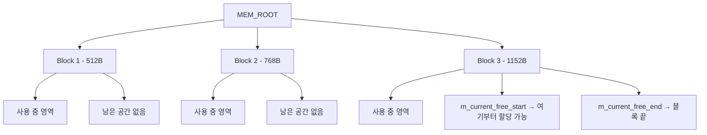
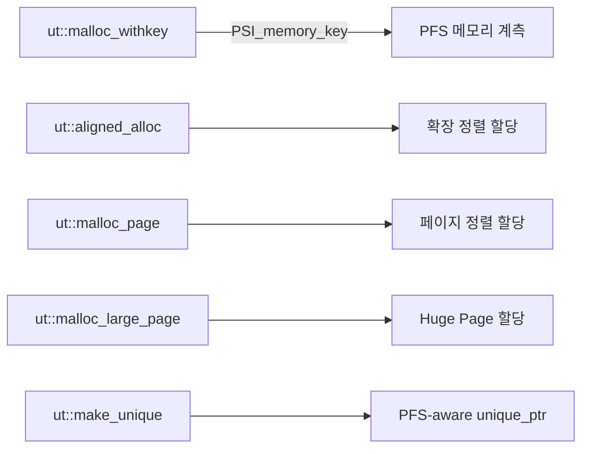
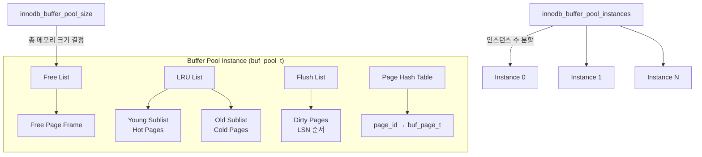

# MySQL 메모리 관리 내부 구현

MySQL은 SQL 레이어의 MEM_ROOT 아레나 할당자와 InnoDB 스토리지 엔진의 Buffer Pool, mem_heap_t, ut:: 할당자 등 다층적 메모리 관리 체계를 갖추고 있다. 이 문서에서는 각 할당자의 구조와 역할, 그리고 실전 튜닝 방법을 소스코드 레벨에서 분석한다.

## 목차
- [1. 핵심 개념 (What)](#1-핵심-개념-what)
- [2. 왜 알아야 하는가 (Why)](#2-왜-알아야-하는가-why)
- [3. 내부 구현 분석 (How)](#3-내부-구현-분석-how)
- [4. 실전 예제](#4-실전-예제)
- [5. 정리](#5-정리)

---

## 1. 핵심 개념 (What)

MySQL의 메모리 관리는 크게 세 계층으로 나뉜다:

| 계층 | 할당자 | 용도 |
|------|--------|------|
| SQL 레이어 | `MEM_ROOT` | 쿼리 실행 중 파서/옵티마이저/실행기가 사용하는 단기 메모리 |
| InnoDB 내부 | `mem_heap_t` | B-Tree 탐색, 레코드 처리 등 InnoDB 내부 연산용 힙 |
| InnoDB PFS 할당자 | `ut::malloc`, `ut::aligned_alloc` 등 | Performance Schema 계측이 가능한 범용 할당 |
| InnoDB Buffer Pool | `buf_pool_t` | 디스크 페이지의 인-메모리 캐시 |

### MEM_ROOT: SQL 레이어의 아레나 할당자

`MEM_ROOT`는 `include/my_alloc.h`에 정의된 **아레나(arena) 할당자**다. 여러 작은 할당을 큰 블록에서 잘라내어(carve out) 제공하며, 개별 해제 없이 아레나 전체를 한번에 해제하는 방식이다.

### mem_heap_t: InnoDB의 메모리 힙

`storage/innobase/include/mem0mem.h`에 정의된 `mem_heap_t`는 InnoDB 내부에서 사용하는 힙 할당자다. `MEM_HEAP_DYNAMIC`(C malloc 기반)과 `MEM_HEAP_BUFFER`(Buffer Pool 기반) 두 가지 할당 모드를 지원한다.

### ut:: 네임스페이스 할당자

`storage/innobase/include/ut0new.h`(약 110KB)에 정의된 InnoDB의 PFS(Performance Schema) 계측 할당자로, `ut::malloc`, `ut::zalloc`, `ut::aligned_alloc`, `ut::make_unique` 등 표준 할당 함수의 PFS-aware 대체 구현을 제공한다.

---

## 2. 왜 알아야 하는가 (Why)

### 메모리 누수와 OOM 진단

MySQL 프로세스가 예상보다 많은 메모리를 사용하는 경우, 어느 계층에서 메모리를 소비하는지 파악해야 한다. `MEM_ROOT`의 max_capacity 초과, Buffer Pool 크기 과잉 설정, 쿼리별 임시 테이블 메모리 등 원인이 다양하다.

### 쿼리 성능 최적화

`MEM_ROOT`의 블록 크기와 증가 전략은 쿼리 실행 성능에 직접 영향을 준다. 작은 블록으로 시작하여 50%씩 증가하는 전략은 대부분의 워크로드에 적합하지만, 대형 조인이나 서브쿼리에서는 블록 할당 횟수가 증가할 수 있다.

### Buffer Pool 튜닝

`innodb_buffer_pool_size`는 InnoDB 성능에 가장 큰 영향을 미치는 단일 파라미터다. 이 값의 의미를 정확히 이해하려면 `buf_pool_t` 내부 구조를 알아야 한다.

---

## 3. 내부 구현 분석 (How)

### 3.1 MEM_ROOT 아레나 할당자

```
include/my_alloc.h — struct MEM_ROOT
```

#### 아키텍처



#### 핵심 멤버 변수

```cpp
// include/my_alloc.h (MEM_ROOT 구조체)
struct MEM_ROOT {
  Block *m_current_block = nullptr;        // 현재 활성 블록
  char *m_current_free_start = &s_dummy_target;  // 할당 가능 시작점
  char *m_current_free_end = &s_dummy_target;    // 현재 블록 끝
  size_t m_block_size;           // 다음 블록 크기 (50%씩 증가)
  size_t m_orig_block_size;      // 초기 블록 크기
  size_t m_max_capacity = 0;     // 최대 용량 제한 (0 = 무제한)
  size_t m_allocated_size = 0;   // 총 할당된 크기
};
```

#### Fast Path 할당 (MEM_ROOT::Alloc)

```cpp
// include/my_alloc.h:145
void *Alloc(size_t length) {
    length = ALIGN_SIZE(length);  // 8바이트 정렬
    // Fast path: 현재 블록에 공간이 충분한 경우
    if (static_cast<size_t>(m_current_free_end - m_current_free_start) >= length) {
        void *ret = m_current_free_start;
        m_current_free_start += length;  // 포인터만 이동 — O(1)
        return ret;
    }
    return AllocSlow(length);  // Slow path: 새 블록 할당
}
```

Fast path는 단순 포인터 비교와 이동만으로 구성되어 **몇 CPU 사이클**만 소요된다. Slow path(`AllocSlow`)에서는 `AllocBlock()`을 호출하여 OS로부터 새 블록을 할당받는다.

#### THD와 MEM_ROOT의 관계

```cpp
// sql/sql_class.h
class Query_arena {
  MEM_ROOT *mem_root;  // 현재 활성 mem_root 포인터
  void *alloc(size_t size) { return mem_root->Alloc(size); }
};

class THD : public MDL_context_owner, ... {
  MEM_ROOT main_mem_root;  // THD 생존 기간 동안 유지되는 메모리
  // Query_arena::mem_root는 쿼리 실행 중 stmt_arena의 mem_root를 가리킴
};
```

각 클라이언트 스레드(THD)는 고유한 `main_mem_root`를 가지며, prepared statement 실행 시 별도의 `MEM_ROOT`로 전환된다. 쿼리 완료 후 `ClearForReuse()`를 호출하여 메모리를 재사용한다.

### 3.2 InnoDB mem_heap_t

```
storage/innobase/include/mem0mem.h — struct mem_block_info_t / mem_heap_t
```

#### 힙 타입

```cpp
// mem0mem.h
constexpr uint32_t MEM_HEAP_DYNAMIC = 0;     // C malloc 기반
constexpr uint32_t MEM_HEAP_BUFFER = 1;       // Buffer Pool 기반
constexpr uint32_t MEM_HEAP_BTR_SEARCH = 2;   // AHI 전용
```

#### 메모리 블록 구조

```
+---------------------------+
| mem_block_info_t (헤더)    |
|  - magic_n (디버그 검증)    |
|  - list (prev/next 링크)   |
|  - len (블록 물리 크기)      |
|  - type (DYNAMIC/BUFFER)   |
|  - free (다음 할당 오프셋)    |
|  - start (초기 free 값)     |
+---------------------------+
| [NO_MANS_LAND_BEFORE]     |  ← 디버그 모드 전용 (0xCE * 16)
+---------------------------+
| 사용자 데이터                |
+---------------------------+
| [NO_MANS_LAND_AFTER]      |  ← 디버그 모드 전용 (0xDF * 16)
+---------------------------+
```

디버그 빌드에서는 할당 전후에 `MEM_NO_MANS_LAND`(16바이트) 가드 영역을 배치하여 버퍼 오버플로를 감지한다.

#### STL 호환 할당자: mem_heap_allocator

```cpp
// mem0mem.h:356
template <typename T>
class mem_heap_allocator {
  mem_heap_t *m_heap;
public:
  pointer allocate(size_type n, ...) {
    return reinterpret_cast<pointer>(mem_heap_alloc(m_heap, n * sizeof(T)));
  }
  void deallocate(pointer, size_type) {}  // no-op — 힙 전체 해제 시 반환
};
```

`deallocate`가 no-op이므로 STL 컨테이너에서 사용할 때는 `mem_heap_free()` 시점에 모든 메모리가 일괄 해제된다.

### 3.3 ut:: PFS 계측 할당자

```
storage/innobase/include/ut0new.h
```

InnoDB의 모든 동적 메모리 할당은 Performance Schema를 통해 추적 가능해야 한다. `ut0new.h`는 이를 위한 완전한 할당 함수 세트를 제공한다:



주요 함수 목록:

| 함수 | 용도 |
|------|------|
| `ut::malloc` / `ut::malloc_withkey` | 기본 할당 (PFS 계측 옵션) |
| `ut::aligned_alloc` | 확장 정렬이 필요한 타입 |
| `ut::malloc_page` | OS 페이지 정렬 할당 |
| `ut::malloc_large_page` | Huge Page 할당 |
| `ut::make_unique` / `ut::make_shared` | 스마트 포인터 팩토리 |
| `ut::allocator<T>` | STL 컨테이너용 커스텀 할당자 |

### 3.4 InnoDB Buffer Pool

```
storage/innobase/include/buf0buf.h — buf_pool_t
```

#### Buffer Pool 전체 아키텍처



#### 주요 함수

```cpp
// buf0buf.h
extern buf_pool_t *buf_pool_ptr;  // 전역 Buffer Pool 배열

static inline ulint buf_pool_get_curr_size(void);  // 현재 풀 크기
static inline ulint buf_pool_get_n_pages(void);     // 총 페이지 수

buf_pool_t *buf_pool_get(const page_id_t &page_id); // page_id로 인스턴스 선택
buf_page_t *buf_page_hash_get(buf_pool_t *b, const page_id_t &page_id);
```

Buffer Pool은 `buf_pool_ptr` 전역 포인터를 통해 관리되며, 여러 인스턴스(`innodb_buffer_pool_instances`)로 분할되어 락 경합을 줄인다. 각 인스턴스는 독립적인 Free List, LRU List, Flush List, Page Hash Table을 가진다.

#### LRU 알고리즘 (midpoint insertion)

Buffer Pool의 LRU는 단순한 LRU가 아니라 **midpoint insertion** 전략을 사용한다:

1. 새로 읽힌 페이지는 LRU 리스트의 **Old Sublist 헤드**(전체의 약 3/8 지점)에 삽입
2. 이후 다시 접근되면 **Young Sublist**로 이동
3. 풀 스캔 같은 대량 읽기가 자주 사용되는 페이지를 밀어내지 않도록 보호

---

## 4. 실전 예제

### 예제 1: Buffer Pool 크기와 상태 모니터링

```sql
-- Buffer Pool 전체 상태 확인
SHOW ENGINE INNODB STATUS\G

-- Performance Schema를 통한 메모리 사용량 세부 확인
SELECT event_name, 
       current_count_used, 
       current_number_of_bytes_used
FROM performance_schema.memory_summary_global_by_event_name
WHERE event_name LIKE 'memory/innodb/%'
ORDER BY current_number_of_bytes_used DESC
LIMIT 10;

-- Buffer Pool 히트율 확인
SELECT 
  (1 - (Innodb_buffer_pool_reads / Innodb_buffer_pool_read_requests)) * 100 
    AS hit_rate_pct
FROM (
  SELECT 
    VARIABLE_VALUE + 0 AS Innodb_buffer_pool_reads
  FROM performance_schema.global_status 
  WHERE VARIABLE_NAME = 'Innodb_buffer_pool_reads'
) r,
(
  SELECT 
    VARIABLE_VALUE + 0 AS Innodb_buffer_pool_read_requests
  FROM performance_schema.global_status 
  WHERE VARIABLE_NAME = 'Innodb_buffer_pool_read_requests'
) rr;
```

### 예제 2: Buffer Pool 사이즈 동적 조정

```sql
-- 현재 크기 확인
SELECT @@innodb_buffer_pool_size / (1024*1024*1024) AS pool_size_gb;

-- 동적 크기 조정 (MySQL 5.7+, 서버 재시작 없이)
SET GLOBAL innodb_buffer_pool_size = 8 * 1024 * 1024 * 1024;  -- 8GB로 변경

-- 리사이즈 진행 상태 확인
SELECT * FROM performance_schema.global_status
WHERE VARIABLE_NAME LIKE 'Innodb_buffer_pool_resize%';
```

### 예제 3: 커넥션별 메모리 사용량 추적

```sql
-- 스레드(커넥션)별 메모리 사용량 조회
SELECT 
  t.THREAD_ID,
  t.PROCESSLIST_ID,
  t.PROCESSLIST_USER,
  t.PROCESSLIST_DB,
  SUM(m.CURRENT_NUMBER_OF_BYTES_USED) AS mem_bytes
FROM performance_schema.threads t
JOIN performance_schema.memory_summary_by_thread_by_event_name m
  ON t.THREAD_ID = m.THREAD_ID
WHERE t.PROCESSLIST_ID IS NOT NULL
GROUP BY t.THREAD_ID, t.PROCESSLIST_ID, t.PROCESSLIST_USER, t.PROCESSLIST_DB
ORDER BY mem_bytes DESC
LIMIT 10;
```

### 예제 4: 권장 innodb_buffer_pool_size 계산

```sql
-- 전체 InnoDB 데이터 크기 확인
SELECT 
  SUM(DATA_LENGTH + INDEX_LENGTH) / (1024*1024*1024) AS total_innodb_gb
FROM information_schema.TABLES
WHERE ENGINE = 'InnoDB';

-- 권장: 전체 시스템 메모리의 60~80%, 또는 InnoDB 데이터 크기 이상
-- 예) 32GB RAM 서버: 20~25GB 설정
-- SET GLOBAL innodb_buffer_pool_size = 20 * 1024 * 1024 * 1024;
```

---

## 5. 정리

| 할당자 | 소스 파일 | 할당 단위 | 해제 방식 | 주요 사용처 |
|--------|-----------|-----------|-----------|-------------|
| `MEM_ROOT` | `include/my_alloc.h` | 아레나 블록 (512B~, 50% 증가) | `Clear()` / `ClearForReuse()`로 일괄 해제 | THD, 쿼리 파싱/실행 |
| `mem_heap_t` | `include/mem0mem.h` | 블록 링크드 리스트 (64B~) | `mem_heap_free()`로 일괄 해제 | InnoDB B-Tree 탐색, 레코드 처리 |
| `ut::` 할당자 | `include/ut0new.h` | 개별 할당 (PFS 계측) | `ut::free()` 개별 해제 | InnoDB 범용 동적 할당 |
| Buffer Pool | `include/buf0buf.h` | 16KB 페이지 단위 | LRU eviction | 디스크 페이지 캐싱 |

### 핵심 포인트

- **MEM_ROOT**의 Fast Path(`Alloc`)는 포인터 이동만으로 O(1) 할당을 제공한다
- **mem_heap_t**는 `MEM_HEAP_DYNAMIC`(malloc)과 `MEM_HEAP_BUFFER`(Buffer Pool) 두 모드를 지원하며, 디버그 빌드에서는 가드 바이트로 메모리 오염을 감지한다
- **ut0new.h**는 InnoDB의 모든 동적 할당에 Performance Schema 계측을 투명하게 적용한다
- **Buffer Pool**은 midpoint insertion LRU로 풀 스캔으로부터 핫 페이지를 보호하며, `innodb_buffer_pool_size`는 동적 조정이 가능하다

---
*참고: MySQL 9.x (trunk) 소스코드 기준*
