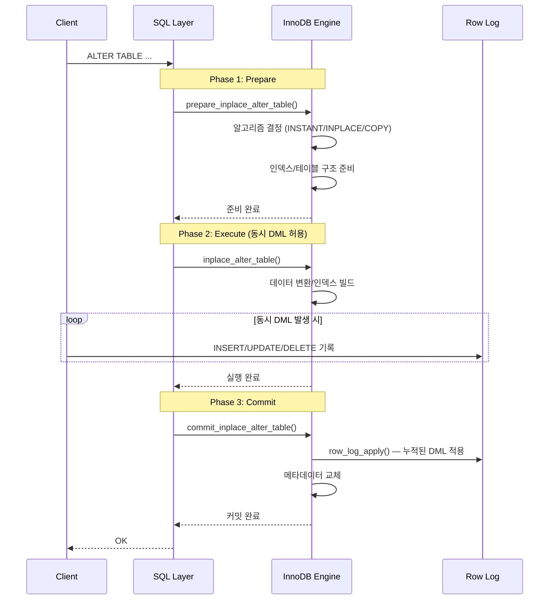

# Online DDL 내부 구현

MySQL InnoDB의 Online DDL은 테이블 스키마 변경 중에도 동시 DML(INSERT/UPDATE/DELETE)을 허용하는 메커니즘이다. 이 문서에서는 handler0alter.cc(398KB)의 핵심 로직과 ALGORITHM=INPLACE/INSTANT/COPY의 차이, 3단계 처리 과정, row log 기반 동시 DML 처리를 소스코드 레벨에서 분석한다.

## 목차
- [1. 핵심 개념 (What)](#1-핵심-개념-what)
- [2. 왜 알아야 하는가 (Why)](#2-왜-알아야-하는가-why)
- [3. 내부 구현 분석 (How)](#3-내부-구현-분석-how)
- [4. 실전 예제](#4-실전-예제)
- [5. 정리](#5-정리)

---

## 1. 핵심 개념 (What)

### DDL Algorithm 종류

MySQL은 `ALTER TABLE` 실행 시 세 가지 알고리즘을 지원한다:

| Algorithm | 테이블 재구축 | 동시 DML | 메타데이터만 변경 | 대표 연산 |
|-----------|:----------:|:-------:|:-------------:|-----------|
| `COPY` | O | X | X | 임시 테이블 생성 후 복사 |
| `INPLACE` | 조건부 | O | X | 인덱스 추가/삭제, 컬럼 타입 변경 |
| `INSTANT` | X | O | O | 컬럼 추가/삭제 (메타데이터만) |

### Online DDL 3단계

```
Prepare Phase → Execute Phase → Commit Phase
(메타데이터 락)   (동시 DML 허용)   (메타데이터 락)
```

- **Prepare**: 메타데이터 잠금 획득, 스키마 변경 준비
- **Execute**: 실제 데이터 변경 수행 (이 구간에서 동시 DML 가능)
- **Commit**: 변경 사항 커밋, row log 적용, 메타데이터 갱신

---

## 2. 왜 알아야 하는가 (Why)

### 서비스 무중단 스키마 변경

프로덕션 환경에서 대용량 테이블의 스키마 변경은 서비스 가용성에 직결된다. 어떤 DDL이 Online으로 실행 가능한지, 어떤 것이 테이블 전체 잠금을 요구하는지 판단하려면 내부 메커니즘을 이해해야 한다.

### INSTANT DDL 활용

MySQL 8.0에서 도입된 INSTANT DDL은 테이블 크기에 관계없이 **밀리초 단위**로 완료된다. 어떤 연산이 INSTANT로 가능한지 아는 것만으로 운영 효율이 크게 올라간다.

### row log 이해

Online DDL 중 발생하는 DML은 row log에 기록되었다가 Commit Phase에서 일괄 적용된다. row log 크기(`innodb_online_alter_log_max_size`)가 부족하면 DDL이 실패하므로, 워크로드에 따른 적절한 설정이 필요하다.

---

## 3. 내부 구현 분석 (How)

### 3.1 핵심 소스 파일

```
storage/innobase/handler/handler0alter.cc  — 주요 진입점 (398KB)
storage/innobase/row/row0log.cc            — row log (동시 DML 기록)
storage/innobase/ddl/                      — DDL 실행 엔진
storage/innobase/btr/btr0mtib.cc           — 인덱스 병렬 빌드 (3985줄)
```

### 3.2 Online DDL 전체 흐름



### 3.3 ha_innobase의 3대 메서드

```cpp
// handler0alter.cc:1440
bool ha_innobase::prepare_inplace_alter_table(
    TABLE *altered_table, Alter_inplace_info *ha_alter_info) {
  // prepare_inplace_alter_table_impl<dd::Table>() 호출
  // 1) 알고리즘 결정 (INSTANT 가능 여부 확인)
  // 2) 새 인덱스/테이블 구조 메모리 할당
  // 3) ha_innobase_inplace_ctx 생성
}

// handler0alter.cc:1564
bool ha_innobase::inplace_alter_table(
    TABLE *altered_table, Alter_inplace_info *ha_alter_info) {
  // 실제 데이터 변환 수행
  // 인덱스 빌드 (ddl::Loader, ddl::Builder 사용)
  // 이 단계에서 동시 DML은 row_log에 기록됨
}

// handler0alter.cc:1600
bool ha_innobase::commit_inplace_alter_table(
    TABLE *altered_table, Alter_inplace_info *ha_alter_info, bool commit) {
  // 1) row_log_apply() — 누적된 DML을 새 구조에 적용
  // 2) dd_commit_inplace_alter_table() — 데이터 딕셔너리 갱신
  // 3) old_table ↔ new_table 교체
}
```

### 3.4 ALTER FLAG 분류

`handler0alter.cc`에서는 ALTER 연산을 플래그로 분류한다:

```cpp
// handler0alter.cc:123 — 온라인으로 인덱스 생성 가능한 연산
static const HA_ALTER_FLAGS INNOBASE_ONLINE_CREATE =
    ADD_INDEX | ADD_UNIQUE_INDEX | ADD_SPATIAL_INDEX;

// handler0alter.cc:128 — 테이블 재구축 필요한 연산
static const HA_ALTER_FLAGS INNOBASE_ALTER_REBUILD =
    ADD_PK_INDEX | DROP_PK_INDEX | CHANGE_CREATE_OPTION |
    ALTER_COLUMN_NULLABLE | ALTER_COLUMN_NOT_NULLABLE |
    ALTER_STORED_COLUMN_ORDER | DROP_STORED_COLUMN |
    ADD_STORED_BASE_COLUMN | RECREATE_TABLE;

// handler0alter.cc:156 — INSTANT로 가능한 연산
static const HA_ALTER_FLAGS INNOBASE_INSTANT_ALLOWED =
    ALTER_COLUMN_NAME | ADD_VIRTUAL_COLUMN | DROP_VIRTUAL_COLUMN |
    ALTER_VIRTUAL_COLUMN_ORDER | ADD_STORED_BASE_COLUMN |
    ALTER_STORED_COLUMN_ORDER | DROP_STORED_COLUMN;
```

### 3.5 INSTANT DDL 판단 로직

```cpp
// handler0alter.cc:827
static inline Instant_Type innobase_support_instant(
    ..., HA_ALTER_FLAGS alter_inplace_flags, ...) {
  
  // 변경 없음
  if (no_change) return Instant_Type::INSTANT_NO_CHANGE;
  
  // INSTANT 허용 플래그 외의 연산이 포함된 경우
  if (alter_inplace_flags & ~INNOBASE_INSTANT_ALLOWED)
    return Instant_Type::INSTANT_IMPOSSIBLE;
  
  // 연산 종류에 따라 세분화
  enum INSTANT_OPERATION {
    NONE,
    COLUMN_RENAME_ONLY,
    VIRTUAL_ADD_DROP_ONLY,
    VIRTUAL_ADD_DROP_WITH_RENAME,
    INSTANT_ADD,   // 컬럼 추가 (기본값으로 메타데이터만 변경)
    INSTANT_DROP,  // 컬럼 삭제 (삭제 마킹만)
  };
  // ...
}
```

INSTANT DDL은 **실제 데이터 페이지를 수정하지 않고** 데이터 딕셔너리(DD)의 메타데이터만 변경한다. 새 컬럼의 기본값은 `DD_INSTANT_COLUMN_DEFAULT` 키로 DD에 저장되고, 이후 레코드를 읽을 때 해당 컬럼이 없으면 기본값을 반환한다.

### 3.6 ha_innobase_inplace_ctx

```cpp
// handler0alter.cc:181
struct ha_innobase_inplace_ctx : public inplace_alter_handler_ctx {
  que_thr_t *thr;               // 쿼리 그래프
  row_prebuilt_t *prebuilt;     // 프리빌트 구조체
  dict_index_t **add_index;     // 추가할 인덱스 배열
  ulint num_to_add_index;       // 추가할 인덱스 수
  dict_index_t **drop_index;    // 삭제할 인덱스 배열
  bool online;                  // 온라인 DDL 여부
  mem_heap_t *heap;             // 메모리 힙
  trx_t *trx;                  // 딕셔너리 트랜잭션
  dict_table_t *old_table;     // 원본 테이블
  dict_table_t *new_table;     // 새 테이블 (재구축 시)
  const ulint *col_map;        // 컬럼 매핑 (old→new)
};
```

이 컨텍스트 구조체는 Prepare → Execute → Commit 전체 과정에서 공유되며, 3단계 간의 상태 전달 역할을 한다.

### 3.7 Row Log 기반 동시 DML

```cpp
// row/row0log.cc:279
void row_log_online_op(
    dict_index_t *index,  // 대상 인덱스
    const dtuple_t *tuple, // 변경된 튜플
    trx_id_t trx_id)      // 트랜잭션 ID
{
    // 인덱스의 row log 버퍼에 변경 기록을 추가
    // mutex로 보호됨
}
```

Execute Phase에서 발생하는 동시 DML은 `row_log_online_op()`을 통해 인덱스별 row log 버퍼에 기록된다. Commit Phase의 `row_log_apply()`에서 이 로그를 새로운 인덱스/테이블에 적용한다:

- `row_log_table_apply_insert()` — INSERT 적용
- `row_log_table_apply_delete()` — DELETE 적용  
- `row_log_table_apply_update()` — UPDATE 적용

### 3.8 인덱스 병렬 빌드 (btr0mtib.cc)

```
storage/innobase/btr/btr0mtib.cc (3985줄)
```

MySQL 8.0.27+에서는 `innodb_ddl_threads` 설정을 통해 인덱스 빌드를 병렬화할 수 있다. `btr0mtib.cc`는 multi-threaded index build의 핵심 구현으로, DDL 엔진(`ddl/` 디렉토리)의 `Loader`와 `Builder`가 병렬 정렬 및 B-Tree 삽입을 수행한다.

```
ddl0builder.cc — 인덱스 빌드 로직
ddl0loader.cc  — 병렬 태스크 큐 관리 (Loader::Task_queue)
ddl0merge.cc   — 외부 정렬/병합
ddl0fts.cc     — Full-Text 인덱스 빌드
```

---

## 4. 실전 예제

### 예제 1: INSTANT DDL로 컬럼 추가

```sql
-- INSTANT로 실행됨 — 테이블 크기 무관하게 밀리초 단위 완료
ALTER TABLE orders ADD COLUMN memo VARCHAR(500) DEFAULT '', ALGORITHM=INSTANT;

-- INSTANT 가능 여부 확인 (실제 실행 없이)
ALTER TABLE orders ADD COLUMN tag INT DEFAULT 0, ALGORITHM=INSTANT, LOCK=NONE;
```

### 예제 2: Online 인덱스 추가

```sql
-- INPLACE + LOCK=NONE으로 동시 DML 허용하면서 인덱스 생성
ALTER TABLE orders 
  ADD INDEX idx_customer_date (customer_id, order_date),
  ALGORITHM=INPLACE, LOCK=NONE;

-- 병렬 인덱스 빌드 스레드 수 조정
SET GLOBAL innodb_ddl_threads = 4;
SET GLOBAL innodb_parallel_read_threads = 4;

-- row log 최대 크기 설정 (동시 DML이 많을 경우 증가)
SET GLOBAL innodb_online_alter_log_max_size = 1073741824;  -- 1GB
```

### 예제 3: 알고리즘 선택 가이드

```sql
-- INSTANT 가능한 연산들:
ALTER TABLE t ADD COLUMN c1 INT DEFAULT 0, ALGORITHM=INSTANT;
ALTER TABLE t DROP COLUMN c1, ALGORITHM=INSTANT;
ALTER TABLE t RENAME COLUMN old_name TO new_name, ALGORITHM=INSTANT;

-- INPLACE로 가능한 연산들 (INSTANT 불가):
ALTER TABLE t ADD INDEX idx_col (col), ALGORITHM=INPLACE;
ALTER TABLE t DROP INDEX idx_col, ALGORITHM=INPLACE;

-- COPY가 필요한 연산들 (INPLACE 불가):
ALTER TABLE t MODIFY COLUMN c1 VARCHAR(100) CHARSET utf8mb4, ALGORITHM=COPY;
-- (참고: 일부 타입 변경은 INPLACE 가능)
```

### 예제 4: Online DDL 모니터링

```sql
-- DDL 진행 상태 확인
SELECT EVENT_NAME, WORK_COMPLETED, WORK_ESTIMATED
FROM performance_schema.events_stages_current
WHERE EVENT_NAME LIKE '%alter%';

-- InnoDB 상태에서 DDL 관련 정보 확인
SHOW ENGINE INNODB STATUS\G
-- "TRANSACTIONS" 섹션에서 DDL 트랜잭션 상태 확인
```

---

## 5. 정리

| 구분 | COPY | INPLACE | INSTANT |
|------|------|---------|---------|
| **소스 진입점** | `ha_innobase::prepare_inplace_alter_table()` | 동일 | 동일 |
| **데이터 이동** | 전체 복사 | 조건부 재구축 | 없음 (메타데이터만) |
| **동시 DML** | 불가 | 가능 (row log) | 가능 |
| **소요 시간** | O(테이블 크기) | O(테이블 크기) or 빠름 | O(1) |
| **row log 필요** | X | O (Online 시) | X |
| **대표 연산** | 문자셋 변경 | 인덱스 추가/삭제 | 컬럼 추가/삭제/이름변경 |

### 핵심 포인트

- Online DDL 3단계(Prepare→Execute→Commit) 중 Execute Phase에서만 동시 DML이 허용된다
- Prepare/Commit Phase에서는 짧은 메타데이터 락이 필요하므로, MDL 경합에 주의해야 한다
- `INNOBASE_INSTANT_ALLOWED` 플래그에 해당하는 연산만 INSTANT 가능하다
- row log 크기(`innodb_online_alter_log_max_size`)가 부족하면 Online DDL이 실패한다
- `innodb_ddl_threads`로 인덱스 빌드를 병렬화할 수 있다

---
*참고: MySQL 9.x (trunk) 소스코드 기준*
