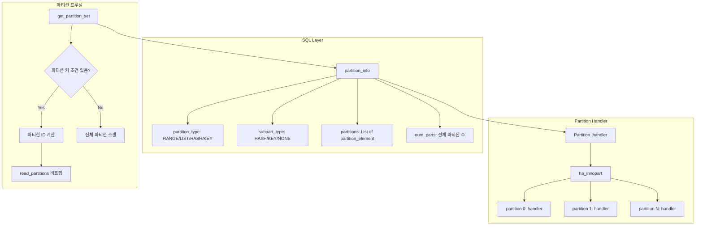
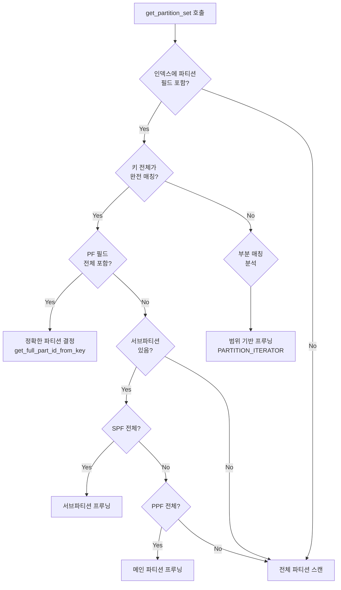

# 파티셔닝과 파티션 프루닝

MySQL의 파티셔닝은 하나의 논리적 테이블을 여러 물리적 파티션으로 분할하여 관리하는 기능이다. 이 문서에서는 sql_partition.cc(224KB)의 파티션 타입별 내부 구현, 옵티마이저의 파티션 프루닝 메커니즘, 그리고 파티션 테이블의 스토리지 엔진 호출 구조를 소스코드 레벨에서 분석한다.

## 목차
- [1. 핵심 개념 (What)](#1-핵심-개념-what)
- [2. 왜 알아야 하는가 (Why)](#2-왜-알아야-하는가-why)
- [3. 내부 구현 분석 (How)](#3-내부-구현-분석-how)
- [4. 실전 예제](#4-실전-예제)
- [5. 정리](#5-정리)

---

## 1. 핵심 개념 (What)

### 파티션 타입

MySQL은 4가지 기본 파티션 타입을 지원한다:

| 파티션 타입 | 분할 기준 | 특징 |
|------------|-----------|------|
| **RANGE** | 연속적인 값의 범위 | 날짜/시간 기반 분할에 최적 |
| **LIST** | 이산적인 값의 목록 | 지역 코드, 카테고리 등에 적합 |
| **HASH** | 해시 함수 결과 | 균등 분배 목적 |
| **KEY** | MySQL 내부 해시 함수 | HASH와 유사하나 서버 내부 해시 사용 |

각 타입은 **COLUMNS** 변형을 지원하여 여러 컬럼의 결합 값으로 파티션할 수 있다. 또한 RANGE/LIST 위에 HASH/KEY **서브파티셔닝**을 추가할 수 있다.

### 파티션 프루닝 (Partition Pruning)

파티션 프루닝은 **옵티마이저가 쿼리 조건을 분석하여 불필요한 파티션을 스캔 대상에서 제거**하는 최적화 기법이다. WHERE 절의 조건이 파티션 함수의 입력 컬럼과 관련될 때 발동된다.

---

## 2. 왜 알아야 하는가 (Why)

### 대용량 테이블 관리

수억 건 이상의 테이블에서 파티셔닝은 데이터 관리의 핵심이다:
- **파티션 단위 삭제**: `ALTER TABLE ... DROP PARTITION`으로 대량 데이터를 즉시 삭제
- **파티션 단위 백업/복구**: 특정 파티션만 별도로 관리 가능
- **데이터 아카이빙**: 오래된 파티션을 저비용 스토리지로 이동

### 쿼리 성능

파티션 프루닝이 제대로 동작하면 풀 테이블 스캔이 특정 파티션만의 스캔으로 축소된다. 100개 파티션 중 1개만 스캔하면 I/O가 약 100분의 1로 줄어든다.

### 프루닝 실패 진단

파티션 프루닝이 기대대로 동작하지 않는 경우가 빈번하다. 함수 래핑, 타입 불일치, 서브파티션 구조 등이 원인이 될 수 있으며, 이를 진단하려면 내부 로직을 이해해야 한다.

---

## 3. 내부 구현 분석 (How)

### 3.1 핵심 소스 파일

```
sql/sql_partition.cc        — 파티션 핵심 로직 (224KB)
sql/partition_info.h        — partition_info 클래스 정의
sql/partition_info.cc       — partition_info 구현
sql/parse_tree_partitions.cc — DDL 파서에서의 파티션 구문 처리
sql/partitioning/partition_handler.h — Partition_handler 인터페이스
```

### 3.2 파티션 전체 아키텍처



### 3.3 파티션 타입 키워드 정의

```cpp
// sql/sql_partition.cc:117
const LEX_CSTRING partition_keywords[] = {
    {STRING_WITH_LEN("HASH")},
    {STRING_WITH_LEN("RANGE")},
    {STRING_WITH_LEN("LIST")},
    {STRING_WITH_LEN("KEY")},
    {STRING_WITH_LEN("MAXVALUE")},
    {STRING_WITH_LEN("LINEAR ")},
    {STRING_WITH_LEN(" COLUMNS")},
    {STRING_WITH_LEN("ALGORITHM")}
};
```

### 3.4 partition_info 클래스

```cpp
// sql/partition_info.h
class partition_info {
  partition_type part_type;      // RANGE, LIST, HASH, KEY
  partition_type subpart_type;   // 서브파티셔닝 타입 (NONE이면 서브파티션 없음)
  
  uint num_parts;                // 전체 파티션 수
  List<partition_element> partitions;  // 파티션 요소 리스트
  
  // 프루닝 관련 비트맵
  MY_BITMAP all_fields_in_PF;    // 인덱스가 파티션 함수의 모든 필드를 포함
  MY_BITMAP all_fields_in_PPF;   // 메인 파티션 함수의 모든 필드를 포함
  MY_BITMAP all_fields_in_SPF;   // 서브파티션 함수의 모든 필드를 포함
  MY_BITMAP some_fields_in_PF;   // 일부 필드 포함
  
  bool is_sub_partitioned() {
    return subpart_type != partition_type::NONE;
  }
};
```

### 3.5 파티션 ID 결정 함수

각 파티션 타입별로 행이 어떤 파티션에 속하는지 결정하는 함수가 분리되어 있다:

```cpp
// sql/sql_partition.cc — 파티션 타입별 ID 결정 함수
static int get_partition_id_range(partition_info *part_info, 
                                   uint32 *part_id, longlong *func_value);
static int get_partition_id_list(partition_info *part_info,
                                  uint32 *part_id, longlong *func_value);
static int get_partition_id_hash_nosub(partition_info *part_info,
                                        uint32 *part_id, longlong *func_value);
static int get_partition_id_key_nosub(partition_info *part_info,
                                       uint32 *part_id, longlong *func_value);

// COLUMNS 변형
static int get_partition_id_range_col(partition_info *part_info,
                                       uint32 *part_id, longlong *func_value);
static int get_partition_id_list_col(partition_info *part_info,
                                      uint32 *part_id, longlong *func_value);

// 서브파티셔닝 포함
static int get_partition_id_with_sub(partition_info *part_info,
                                      uint32 *part_id, longlong *func_value);
```

#### LINEAR HASH의 특수 처리

```cpp
// LINEAR HASH/KEY는 별도 함수
static int get_partition_id_linear_hash_nosub(...);
static int get_partition_id_linear_key_nosub(...);
static int get_partition_id_linear_hash_sub(...);
static int get_partition_id_linear_key_sub(...);
```

LINEAR HASH는 파워 오브 2 알고리즘을 사용하여 파티션 추가/삭제 시 영향 범위를 최소화한다. 일반 HASH(`partition_id = func(val) MOD num_partitions`)와 달리 파티션 수 변경 시 전체 재분배가 발생하지 않는다.

### 3.6 파티션 프루닝: get_partition_set()

```cpp
// sql/sql_partition.cc:3702
void get_partition_set(const TABLE *table, uchar *buf, const uint index,
                       const key_range *key_spec, part_id_range *part_spec) {
  partition_info *part_info = table->part_info;
  const uint num_parts = part_info->get_tot_partitions();
  
  part_spec->start_part = 0;
  part_spec->end_part = num_parts - 1;
  
  if ((index < MAX_KEY) && key_spec &&
      key_spec->flag == HA_READ_KEY_EXACT &&
      part_info->some_fields_in_PF.is_set(index)) {
    
    key_info = table->key_info + index;
    
    if (key_spec->length == key_info->key_length) {
      if (part_info->all_fields_in_PF.is_set(index)) {
        // 완전한 파티션 키 → 정확한 파티션 결정
        get_full_part_id_from_key(table, buf, key_info, key_spec, part_spec);
        prune_partition_set(table, part_spec);
        return;
      }
      
      if (part_info->is_sub_partitioned()) {
        if (part_info->all_fields_in_SPF.is_set(index)) {
          // 서브파티션 함수 필드 전체 매칭 → 서브파티션 프루닝
          get_sub_part_id_from_key(...);
        } else if (part_info->all_fields_in_PPF.is_set(index)) {
          // 메인 파티션 함수 필드 전체 매칭 → 메인 파티션 프루닝
          get_part_id_from_key(...);
        }
      }
    }
  }
}
```

#### 프루닝 의사결정 흐름



### 3.7 범위 기반 프루닝

RANGE 파티션에서 범위 조건이 주어지면 구간(interval) 분석을 통해 프루닝한다:

```cpp
// sql/sql_partition.cc
static int get_part_iter_for_interval_via_mapping(
    partition_info *part_info, bool is_subpart, 
    uint32 *store_length_array,
    uchar *min_value, uchar *max_value, 
    uint min_len, uint max_len, uint flags,
    PARTITION_ITERATOR *part_iter);

// COLUMNS 파티션의 범위 분석
static int get_part_iter_for_interval_cols_via_map(
    partition_info *part_info, bool is_subpart,
    uint32 *store_length_array,
    uchar *min_value, uchar *max_value,
    uint min_len, uint max_len, uint flags,
    PARTITION_ITERATOR *part_iter);
```

`PARTITION_ITERATOR` 구조체를 통해 프루닝된 파티션 집합을 순회한다:

```cpp
// sql/partition_info.h:91
struct PARTITION_ITERATOR {
  partition_iter_func get_next;  // 다음 파티션 ID 반환 함수
  bool ret_null_part;            // NULL 값 파티션 포함 여부
  struct st_part_num_range {
    uint32 start;
    uint32 cur;
    uint32 end;
  } part_nums;
};
```

### 3.8 RANGE 파티션 엔드포인트 계산

```cpp
// sql/sql_partition.cc
static uint32 get_partition_id_range_for_endpoint(
    partition_info *part_info,
    bool left_endpoint,      // 왼쪽/오른쪽 경계
    bool include_endpoint);  // 경계값 포함 여부
```

이 함수는 `WHERE date_col BETWEEN '2024-01-01' AND '2024-03-31'` 같은 범위 조건에서 시작/끝 파티션을 결정한다. 이진 탐색으로 RANGE 파티션의 경계값과 비교하여 O(log N) 시간에 파티션 범위를 결정한다.

### 3.9 LIST 파티션 프루닝

```cpp
// sql/sql_partition.cc
static uint32 get_list_array_idx_for_endpoint(
    partition_info *part_info,
    bool left_endpoint,
    bool include_endpoint);

static uint32 get_next_partition_id_list(PARTITION_ITERATOR *part_iter);
```

LIST 파티션에서는 정렬된 값 배열에서 이진 탐색을 수행하여 매칭되는 파티션을 찾는다.

---

## 4. 실전 예제

### 예제 1: RANGE 파티션 — 날짜 기반 분할

```sql
CREATE TABLE orders (
    id BIGINT NOT NULL AUTO_INCREMENT,
    customer_id INT NOT NULL,
    order_date DATE NOT NULL,
    amount DECIMAL(10,2),
    PRIMARY KEY (id, order_date)
) PARTITION BY RANGE (YEAR(order_date)) (
    PARTITION p2022 VALUES LESS THAN (2023),
    PARTITION p2023 VALUES LESS THAN (2024),
    PARTITION p2024 VALUES LESS THAN (2025),
    PARTITION p2025 VALUES LESS THAN (2026),
    PARTITION p_future VALUES LESS THAN MAXVALUE
);

-- 프루닝 동작 확인 (p2024만 스캔)
EXPLAIN SELECT * FROM orders
WHERE order_date BETWEEN '2024-01-01' AND '2024-12-31';
-- partitions: p2024

-- 오래된 데이터 즉시 삭제
ALTER TABLE orders DROP PARTITION p2022;

-- 새 파티션 추가
ALTER TABLE orders REORGANIZE PARTITION p_future INTO (
    PARTITION p2026 VALUES LESS THAN (2027),
    PARTITION p_future VALUES LESS THAN MAXVALUE
);
```

### 예제 2: RANGE COLUMNS — 다중 컬럼 파티셔닝

```sql
CREATE TABLE sales (
    id BIGINT NOT NULL,
    region VARCHAR(20) NOT NULL,
    sale_date DATE NOT NULL,
    amount DECIMAL(10,2),
    PRIMARY KEY (id, region, sale_date)
) PARTITION BY RANGE COLUMNS (region, sale_date) (
    PARTITION p_kr_2024 VALUES LESS THAN ('KR', '2025-01-01'),
    PARTITION p_kr_2025 VALUES LESS THAN ('KR', '2026-01-01'),
    PARTITION p_us_2024 VALUES LESS THAN ('US', '2025-01-01'),
    PARTITION p_us_2025 VALUES LESS THAN ('US', '2026-01-01'),
    PARTITION p_rest VALUES LESS THAN (MAXVALUE, MAXVALUE)
);
```

### 예제 3: 파티션 프루닝 진단

```sql
-- EXPLAIN에서 파티션 프루닝 확인
EXPLAIN SELECT * FROM orders WHERE order_date = '2024-06-15';
-- partitions 컬럼에 p2024만 표시되어야 함

-- 프루닝이 실패하는 경우 (함수 래핑)
EXPLAIN SELECT * FROM orders WHERE DATE_FORMAT(order_date, '%Y') = '2024';
-- partitions: p2022,p2023,p2024,p2025,p_future (전체 스캔!)
-- 원인: 파티션 키 컬럼에 함수를 적용하면 프루닝 불가

-- 올바른 방법 — 컬럼을 직접 비교
EXPLAIN SELECT * FROM orders 
WHERE order_date >= '2024-01-01' AND order_date < '2025-01-01';
-- partitions: p2024 (프루닝 성공)

-- 파티션별 행 수 확인
SELECT PARTITION_NAME, TABLE_ROWS, DATA_LENGTH, INDEX_LENGTH
FROM information_schema.PARTITIONS
WHERE TABLE_SCHEMA = DATABASE() AND TABLE_NAME = 'orders'
ORDER BY PARTITION_ORDINAL_POSITION;
```

### 예제 4: HASH 서브파티셔닝

```sql
CREATE TABLE logs (
    id BIGINT NOT NULL AUTO_INCREMENT,
    log_date DATE NOT NULL,
    server_id INT NOT NULL,
    message TEXT,
    PRIMARY KEY (id, log_date, server_id)
) PARTITION BY RANGE (YEAR(log_date))
  SUBPARTITION BY HASH (server_id)
  SUBPARTITIONS 4 (
    PARTITION p2024 VALUES LESS THAN (2025),
    PARTITION p2025 VALUES LESS THAN (2026),
    PARTITION p_future VALUES LESS THAN MAXVALUE
);
-- 총 3 * 4 = 12개의 물리 파티션 생성

-- log_date와 server_id 모두 조건에 포함되면 단일 서브파티션만 스캔
EXPLAIN SELECT * FROM logs 
WHERE log_date = '2024-07-01' AND server_id = 5;
```

---

## 5. 정리

| 구분 | RANGE | LIST | HASH | KEY |
|------|-------|------|------|-----|
| **분할 기준** | 연속 범위 | 이산 값 목록 | 사용자 함수 해시 | 내부 해시 |
| **ID 결정 함수** | `get_partition_id_range()` | `get_partition_id_list()` | `get_partition_id_hash_nosub()` | `get_partition_id_key_nosub()` |
| **프루닝 방식** | 범위 엔드포인트 이진 탐색 | 값 배열 이진 탐색 | 정확한 값만 프루닝 | 정확한 값만 프루닝 |
| **COLUMNS 변형** | O | O | X | X |
| **서브파티셔닝** | O (with HASH/KEY) | O (with HASH/KEY) | X | X |

### 핵심 포인트

- `get_partition_set()`이 프루닝의 핵심 진입점이며, 인덱스의 파티션 필드 포함 여부를 비트맵(`all_fields_in_PF`)으로 빠르게 판단한다
- **파티션 키 컬럼에 함수를 적용하면 프루닝이 실패**한다 — `WHERE YEAR(date_col) = 2024` 대신 `WHERE date_col >= '2024-01-01' AND date_col < '2025-01-01'` 사용
- RANGE 파티션의 프루닝은 O(log N) 이진 탐색으로 동작하며, 파티션 수가 많아도 효율적이다
- PRIMARY KEY에 파티션 키 컬럼이 포함되어야 한다는 제약이 있다 (UNIQUE 인덱스도 동일)
- `ALTER TABLE ... DROP PARTITION`은 `DELETE`보다 훨씬 빠르다 — 파일 시스템 레벨 삭제

---
*참고: MySQL 9.x (trunk) 소스코드 기준*
