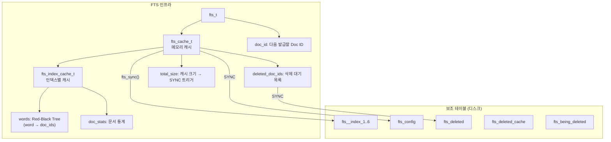
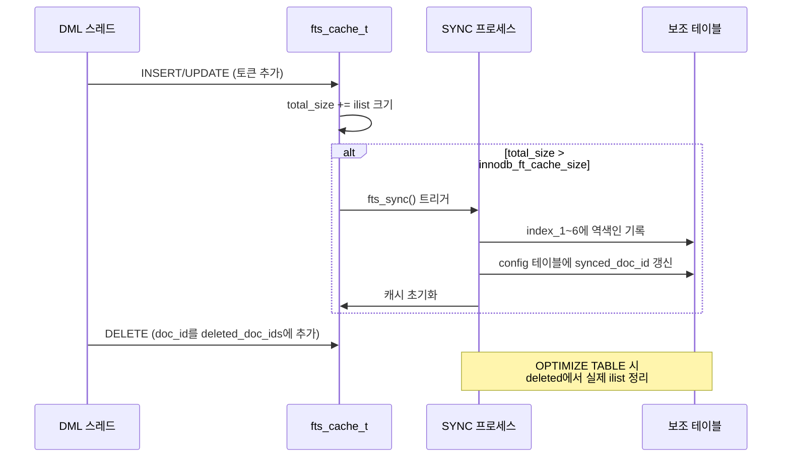

# Full-Text Search 내부 구현

InnoDB의 Full-Text Search(FTS)는 역색인(Inverted Index) 기반의 전문 검색 엔진이다. 이 문서에서는 fts0fts.cc(186KB)의 핵심 구현, 역색인 구조, 토크나이저와 스톱워드, 검색 모드(BOOLEAN/NATURAL LANGUAGE/QUERY EXPANSION), FTS 보조 테이블과 캐시 아키텍처를 소스코드 레벨에서 분석한다.

## 목차
- [1. 핵심 개념 (What)](#1-핵심-개념-what)
- [2. 왜 알아야 하는가 (Why)](#2-왜-알아야-하는가-why)
- [3. 내부 구현 분석 (How)](#3-내부-구현-분석-how)
- [4. 실전 예제](#4-실전-예제)
- [5. 정리](#5-정리)

---

## 1. 핵심 개념 (What)

### Full-Text Search란

Full-Text Search는 LIKE '%keyword%'와 달리 **역색인**을 사용하여 텍스트 컬럼에서 단어 기반 검색을 효율적으로 수행하는 기능이다. InnoDB에서 내장 지원하며, `FULLTEXT` 인덱스를 생성하여 사용한다.

### 검색 모드

| 모드 | 구문 | 특징 |
|------|------|------|
| **Natural Language** | `MATCH ... AGAINST ('query')` | 관련도(relevance) 기반 검색, 기본 모드 |
| **Boolean** | `MATCH ... AGAINST ('+필수 -제외' IN BOOLEAN MODE)` | 연산자로 세밀한 제어 |
| **Query Expansion** | `MATCH ... AGAINST ('query' WITH QUERY EXPANSION)` | 2단계 검색으로 관련 문서 확장 |

### 역색인 (Inverted Index)

일반 B-Tree 인덱스가 `row → column_value` 매핑이라면, 역색인은 `word → [doc_id1, doc_id2, ...]` 매핑이다. 각 단어에 대해 해당 단어가 등장하는 문서 ID 목록(ilist)을 저장한다.

---

## 2. 왜 알아야 하는가 (Why)

### LIKE 검색의 한계

`WHERE content LIKE '%검색어%'`는 풀 테이블 스캔을 유발한다. 수백만 건의 텍스트 데이터에서는 이것만으로 서버가 압도될 수 있다. FTS는 역색인을 통해 O(1)에 가까운 검색 속도를 제공한다.

### FTS 캐시와 동기화 이해

InnoDB FTS는 메모리 캐시에 변경 사항을 버퍼링했다가 주기적으로 디스크의 보조 테이블에 동기화(SYNC)한다. 캐시 크기(`innodb_ft_cache_size`)와 동기화 타이밍을 이해해야 메모리 사용량과 검색 정확도를 제어할 수 있다.

### 보조 테이블 구조 파악

FTS 인덱스 하나당 6개의 인덱스 보조 테이블 + 5개의 공통 보조 테이블이 생성된다. 이 구조를 알아야 `OPTIMIZE TABLE`이 왜 필요한지, 삭제된 문서가 검색 결과에서 사라지는 시점이 언제인지 이해할 수 있다.

---

## 3. 내부 구현 분석 (How)

### 3.1 핵심 소스 파일

```
storage/innobase/fts/fts0fts.cc     — FTS 핵심 로직 (186KB)
storage/innobase/include/fts0fts.h  — FTS 헤더 (구조체, 상수, 함수 선언)
storage/innobase/include/fts0types.h — fts_cache_t, fts_index_cache_t 등 타입
storage/innobase/fts/fts0que.cc     — FTS 쿼리 처리
storage/innobase/fts/fts0opt.cc     — FTS OPTIMIZE 처리
storage/innobase/fts/fts0plugin.cc  — 플러그인 파서
```

### 3.2 FTS 전체 아키텍처



### 3.3 FTS_DOC_ID와 문서 식별

```cpp
// fts0fts.h
#define FTS_DOC_ID_COL_NAME "FTS_DOC_ID"
#define FTS_DOC_ID_INDEX_NAME "FTS_DOC_ID_INDEX"
#define FTS_DOC_ID_LEN 8  // 8바이트 uint64_t

typedef uint64_t doc_id_t;
constexpr doc_id_t FTS_NULL_DOC_ID = 0;
```

모든 FTS 테이블은 숨겨진 `FTS_DOC_ID` 컬럼을 가진다. 이 컬럼은 단조 증가하는 64비트 정수이며, 각 행을 고유하게 식별한다. 사용자가 명시적으로 `FTS_DOC_ID BIGINT UNSIGNED NOT NULL` 컬럼을 정의하지 않으면 자동으로 생성된다.

### 3.4 FTS 보조 테이블 구조

#### 인덱스 보조 테이블 (6개)

```cpp
// fts0fts.cc:151
const fts_index_selector_t fts_index_selector[] = {
    {9, "index_1"},   // 문자 코드 < 9 (숫자, 특수문자)
    {65, "index_2"},  // < 65 (기타)
    {70, "index_3"},  // < 70 (A-E)
    {75, "index_4"},  // < 75 (F-J)
    {80, "index_5"},  // < 80 (K-O)
    {85, "index_6"},  // < 85 (P-T)
    {0, nullptr}      // 나머지 (U-Z, ...)
};
```

단어의 첫 번째 문자 코드에 따라 6개의 보조 테이블(`index_1` ~ `index_6`)로 분산한다. 이렇게 하면 동시 삽입 시 테이블 수준 락 경합을 줄일 수 있다.

각 인덱스 보조 테이블의 스키마:

```
+------------+------------------+-------------------+-----------+-------+
| word       | first_doc_id     | last_doc_id       | doc_count | ilist |
| VARCHAR    | BIGINT UNSIGNED  | BIGINT UNSIGNED   | INT       | BLOB  |
+------------+------------------+-------------------+-----------+-------+
```

- **word**: 토큰(단어)
- **first_doc_id** / **last_doc_id**: 해당 단어가 포함된 문서 ID 범위
- **doc_count**: 해당 단어가 포함된 문서 수
- **ilist**: 문서 ID와 위치 정보가 인코딩된 BLOB (역색인의 핵심)

#### 공통 보조 테이블 (5개)

```cpp
// fts0fts.cc:135
const char *fts_common_tables[] = {
    "being_deleted",       // OPTIMIZE 진행 중 삭제 목록
    "being_deleted_cache", // 캐시의 삭제 대기
    "config",              // FTS 설정 (cache_size, synced_doc_id 등)
    "deleted",             // 삭제된 doc_id 목록
    "deleted_cache",       // 캐시의 삭제 대기 doc_id
    nullptr
};
```

### 3.5 FTS 캐시 (fts_cache_t)

```cpp
// fts0types.h:147
struct fts_cache_t {
    rw_lock_t lock;          // 캐시 전체 접근 보호
    rw_lock_t init_lock;     // 초기화 락 (다른 SYNC 레벨)
    
    ib_mutex_t optimize_lock;  // OPTIMIZE 전용 락
    ib_mutex_t deleted_lock;   // deleted_doc_ids 보호
    ib_mutex_t doc_id_lock;    // Doc ID 발급 보호
    
    ib_vector_t *deleted_doc_ids;  // 삭제 대기 doc_id 배열
    ib_vector_t *indexes;          // fts_index_cache_t 벡터
    ib_vector_t *get_docs;         // 문서 읽기 정보
    
    ulint total_size;              // ilist 총 크기 → SYNC 트리거
    uint64_t total_size_before_sync; // 마지막 SYNC 시점의 크기
    fts_sync_t *sync;             // SYNC 상태 구조체
    
    doc_id_t next_doc_id;     // 다음 발급할 Doc ID
    doc_id_t synced_doc_id;   // CONFIG 테이블에 동기화된 Doc ID
    doc_id_t first_doc_id;    // 테이블 오픈 이후 첫 Doc ID
    
    ulint deleted;   // OPTIMIZE 이후 삭제된 문서 수
    ulint added;     // OPTIMIZE 이후 추가된 문서 수
};
```

#### 캐시 → 디스크 동기화 (SYNC)

```cpp
// fts0fts.cc:191
static dberr_t fts_sync(fts_sync_t *sync, bool unlock_cache, 
                         bool wait, bool has_dict);
```

`fts_cache_t::total_size`가 `innodb_ft_cache_size`(기본 8MB)를 초과하면 SYNC가 트리거된다. SYNC는 메모리 캐시의 역색인 데이터를 디스크 보조 테이블에 기록하고 캐시를 초기화한다.



### 3.6 fts_index_cache_t — 인덱스별 캐시

```cpp
// fts0types.h:74
struct fts_index_cache_t {
    dict_index_t *index;     // FTS 인덱스 인스턴스
    ib_rbt_t *words;         // Red-Black Tree: word → doc_ids
    ib_vector_t *doc_stats;  // 문서 통계 배열 (정렬됨)
    que_t **ins_graph;       // INSERT 쿼리 그래프
    que_t **sel_graph;       // SELECT 쿼리 그래프
    CHARSET_INFO *charset;   // 문자셋
};
```

캐시의 `words`는 Red-Black Tree로 구현되어 있으며, 키는 `fts_string_t*`(단어), 값은 `fts_tokenizer_word_t*`(해당 단어의 문서 ID 목록과 위치 정보)이다.

### 3.7 토크나이저와 스톱워드

#### 기본 토크나이저

InnoDB의 기본 토크나이저는 공백과 구두점을 구분자로 사용하는 단순 분리기다. 토큰 길이 제한:

```cpp
// fts0fts.cc
extern ulong fts_max_token_size;  // innodb_ft_max_token_size (기본 84)
extern ulong fts_min_token_size;  // innodb_ft_min_token_size (기본 3)
```

`fts_min_token_size`(기본 3) 미만의 단어는 인덱싱되지 않는다. 2글자 이하의 단어를 검색하려면 이 값을 낮춰야 한다.

#### 기본 스톱워드

```cpp
// fts0fts.cc:121
const char *fts_default_stopword[] = {
    "a",    "about", "an",  "are",  "as",   "at",    "be",   "by",
    "com",  "de",    "en",  "for",  "from", "how",   "i",    "in",
    "is",   "it",    "la",  "of",   "on",   "or",    "that", "the",
    "this", "to",    "was", "what", "when", "where", "who",  "will",
    "with", "und",   "the", "www",  nullptr
};
```

스톱워드에 포함된 단어는 인덱싱에서 제외된다. 커스텀 스톱워드 테이블을 지정할 수 있다.

#### 플러그인 파서

```cpp
// fts0fts.cc:178
struct fts_tokenize_param_t {
    fts_doc_t *result_doc;  // 토큰화 결과 문서
    ulint add_pos;          // 토큰 위치 오프셋
};
```

`mysql/plugin_ftparser.h`를 통해 커스텀 파서 플러그인을 작성할 수 있다. ngram 파서(`innodb_ft_enable_diag_print`)는 CJK(한중일) 언어 지원을 위한 대표적인 플러그인이다.

### 3.8 검색 모드 상수

```cpp
// fts0fts.h
#define FTS_NL 0          // Natural Language Mode
#define FTS_BOOL 1        // Boolean Mode
#define FTS_SORTED 2      // 정렬됨
#define FTS_EXPAND 4      // Query Expansion
#define FTS_NO_RANKING 8  // 랭킹 없음
#define FTS_PROXIMITY 16  // 근접 검색
#define FTS_PHRASE 32     // 구문 검색
#define FTS_OPT_RANKING 64 // 최적화된 랭킹
```

### 3.9 FTS 관련 테이블/인덱스 수

```cpp
// fts0fts.h
constexpr size_t FTS_NUM_AUX_INDEX = 6;   // 인덱스 보조 테이블 수
constexpr size_t FTS_NUM_AUX_COMMON = 5;  // 공통 보조 테이블 수
```

FTS 인덱스 1개당 총 **11개의 보조 테이블**이 생성된다. FTS 인덱스가 여러 개이면 `6 * N + 5`개의 보조 테이블이 필요하다.

---

## 4. 실전 예제

### 예제 1: FULLTEXT 인덱스 생성과 Natural Language 검색

```sql
CREATE TABLE articles (
    id BIGINT NOT NULL AUTO_INCREMENT PRIMARY KEY,
    title VARCHAR(200),
    body TEXT,
    FULLTEXT INDEX ft_article (title, body)
) ENGINE=InnoDB;

INSERT INTO articles (title, body) VALUES
('MySQL Internals', 'InnoDB storage engine uses B-Tree indexes for data'),
('Query Optimization', 'The optimizer uses cost-based approach for query planning'),
('Full-Text Search', 'Inverted index provides fast text searching capability');

-- Natural Language Mode (기본)
SELECT id, title, 
       MATCH(title, body) AGAINST('InnoDB index') AS relevance
FROM articles
WHERE MATCH(title, body) AGAINST('InnoDB index')
ORDER BY relevance DESC;
```

### 예제 2: Boolean Mode 고급 검색

```sql
-- 필수(+), 제외(-), 와일드카드(*) 사용
SELECT * FROM articles
WHERE MATCH(title, body) AGAINST('+InnoDB -MyISAM +index*' IN BOOLEAN MODE);

-- 구문 검색 (정확한 순서)
SELECT * FROM articles
WHERE MATCH(title, body) AGAINST('"storage engine"' IN BOOLEAN MODE);

-- 근접 검색 — "InnoDB"와 "index"가 10단어 이내
SELECT * FROM articles
WHERE MATCH(title, body) AGAINST('"InnoDB index" @10' IN BOOLEAN MODE);

-- 관련도 가중치 조정 — title 매치에 더 높은 가중치
SELECT id, title,
       MATCH(title) AGAINST('InnoDB') * 2 + MATCH(body) AGAINST('InnoDB') AS score
FROM articles
WHERE MATCH(title, body) AGAINST('InnoDB')
ORDER BY score DESC;
```

### 예제 3: 한국어 검색 (ngram 파서)

```sql
-- ngram 파서를 사용한 한국어 FULLTEXT 인덱스
CREATE TABLE posts (
    id BIGINT NOT NULL AUTO_INCREMENT PRIMARY KEY,
    content TEXT,
    FULLTEXT INDEX ft_content (content) WITH PARSER ngram
) ENGINE=InnoDB;

-- ngram 토큰 크기 설정 (기본 2, 한국어에 적합)
-- my.cnf: ngram_token_size=2

INSERT INTO posts (content) VALUES
('MySQL 데이터베이스 성능 최적화'),
('인덱스 설계와 쿼리 튜닝 가이드'),
('InnoDB 스토리지 엔진 내부 구조');

-- ngram 기반 한국어 검색
SELECT * FROM posts
WHERE MATCH(content) AGAINST('데이터베이스' IN BOOLEAN MODE);

-- ngram 토큰화 확인
SET GLOBAL innodb_ft_aux_table = 'mydb/posts';
SELECT * FROM information_schema.INNODB_FT_INDEX_TABLE
ORDER BY WORD LIMIT 20;
```

### 예제 4: FTS 보조 테이블 모니터링과 OPTIMIZE

```sql
-- FTS 보조 테이블의 인덱스 데이터 조회
SET GLOBAL innodb_ft_aux_table = 'mydb/articles';

-- 인덱싱된 단어 목록
SELECT * FROM information_schema.INNODB_FT_INDEX_TABLE
ORDER BY DOC_COUNT DESC LIMIT 20;

-- 삭제 대기 목록
SELECT * FROM information_schema.INNODB_FT_DELETED;

-- FTS 설정 확인
SELECT * FROM information_schema.INNODB_FT_CONFIG;

-- 삭제된 문서의 실제 정리 (ilist에서 제거)
OPTIMIZE TABLE articles;

-- FTS 캐시 크기 조정 (기본 8MB)
SET GLOBAL innodb_ft_cache_size = 16777216;  -- 16MB
SET GLOBAL innodb_ft_total_cache_size = 640000000;  -- 전체 FTS 캐시 한도

-- 커스텀 스톱워드 설정
CREATE TABLE my_stopwords (value VARCHAR(30)) ENGINE=InnoDB;
INSERT INTO my_stopwords VALUES ('the'), ('a'), ('an'), ('is');
SET GLOBAL innodb_ft_server_stopword_table = 'mydb/my_stopwords';
-- 인덱스 재생성 필요
ALTER TABLE articles DROP INDEX ft_article;
ALTER TABLE articles ADD FULLTEXT INDEX ft_article (title, body);
```

---

## 5. 정리

| 구성 요소 | 소스 파일 | 역할 |
|-----------|-----------|------|
| FTS 코어 | `fts/fts0fts.cc` | FTS 생성, SYNC, Doc ID 관리 |
| FTS 쿼리 | `fts/fts0que.cc` | MATCH...AGAINST 실행, 랭킹 계산 |
| FTS 최적화 | `fts/fts0opt.cc` | OPTIMIZE TABLE, 삭제 정리 |
| FTS 캐시 | `include/fts0types.h` | `fts_cache_t`, `fts_index_cache_t` |
| FTS 타입/상수 | `include/fts0fts.h` | 검색 모드, 보조 테이블 구조 |

### 역색인 데이터 흐름

```
INSERT/UPDATE → 토크나이저 → fts_cache_t (메모리)
                                 ↓ (SYNC)
                          index_1~6 보조 테이블 (디스크)
                          
DELETE → deleted_doc_ids (캐시) → deleted 보조 테이블
                                       ↓ (OPTIMIZE)
                                 ilist에서 실제 제거
```

### 핵심 포인트

- InnoDB FTS는 **6개 인덱스 보조 테이블 + 5개 공통 보조 테이블**로 구성되며, 단어 첫 글자 코드로 테이블을 분산한다
- 메모리 캐시(`fts_cache_t`)에서 버퍼링 후 `innodb_ft_cache_size` 초과 시 디스크에 SYNC한다
- DELETE는 즉시 ilist에서 제거되지 않고 `deleted` 테이블에 마킹만 한다 — `OPTIMIZE TABLE`로 실제 정리
- `fts_min_token_size`(기본 3)보다 짧은 단어는 인덱싱되지 않는다 — 한국어는 **ngram 파서** 사용 필수
- Boolean Mode에서 `+`(필수), `-`(제외), `*`(와일드카드), `""`(구문), `@N`(근접) 연산자를 지원한다

---
*참고: MySQL 9.x (trunk) 소스코드 기준*
