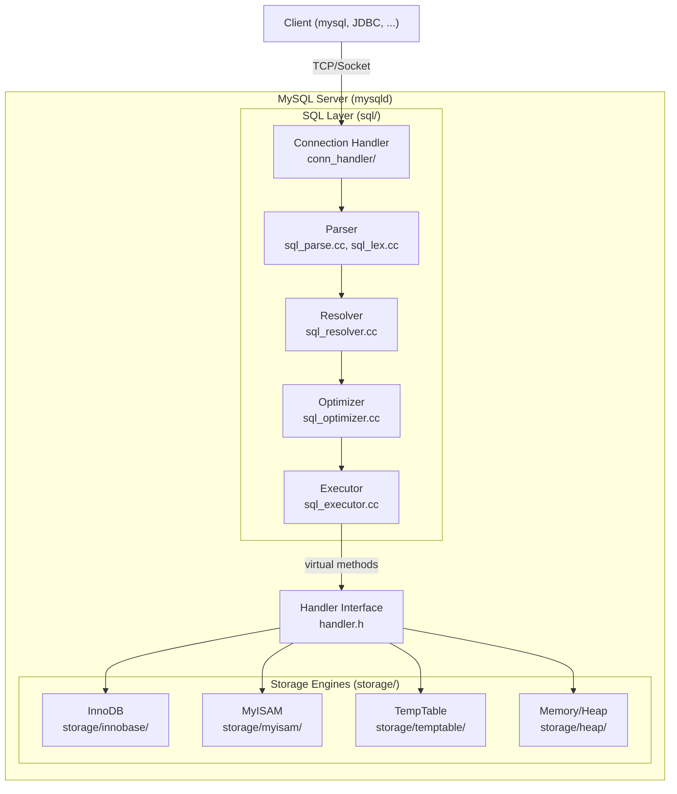
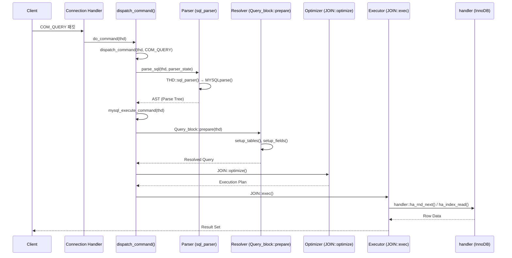

# MySQL 아키텍처 전체 조망

MySQL 서버는 SQL 계층, Handler 인터페이스, Storage Engine의 3계층으로 구성된 모듈형 아키텍처를 따른다. 이 문서에서는 56,900개 이상의 파일로 이루어진 MySQL 서버의 핵심 모듈 맵과 쿼리 실행 전체 경로를 소스코드 수준에서 분석한다.

## 목차
- [1. 핵심 개념 (What)](#1-핵심-개념-what)
- [2. 왜 알아야 하는가 (Why)](#2-왜-알아야-하는가-why)
- [3. 내부 구현 분석 (How)](#3-내부-구현-분석-how)
- [4. 실전 예제](#4-실전-예제)
- [5. 정리](#5-정리)

---

## 1. 핵심 개념 (What)

MySQL 서버(`mysqld`)는 크게 세 가지 계층으로 나뉜다:

1. **SQL 계층 (SQL Layer)**: 파싱, 최적화, 실행을 담당. `sql/` 디렉토리에 위치.
2. **Handler 인터페이스**: SQL 계층과 스토리지 엔진 사이의 추상화 레이어. `handler` 클래스(`sql/handler.h:4754`)가 핵심.
3. **Storage Engine 계층**: InnoDB, MyISAM 등 실제 데이터 저장/검색을 수행. `storage/` 디렉토리.

이 3계층 구조 덕분에 MySQL은 스토리지 엔진을 플러그인 형태로 교체할 수 있다. SQL 계층은 `handler` 클래스의 가상 메서드만 호출하고, 각 스토리지 엔진은 이를 오버라이드하여 구현한다.

### 주요 디렉토리 구조

| 디렉토리 | 역할 | 핵심 파일 |
|----------|------|----------|
| `sql/` | SQL 파서, 옵티마이저, 실행기, THD | `mysqld.cc`, `sql_parse.cc`, `sql_resolver.cc` |
| `sql/conn_handler/` | 커넥션 관리, 스레드 모델 | `connection_handler_per_thread.cc` |
| `storage/innobase/` | InnoDB 스토리지 엔진 | `ha_innodb.cc`, `trx/`, `buf/` |
| `plugin/` | 인증, 감사 등 서버 플러그인 | `auth/`, `audit_log/` |
| `components/` | MySQL 8.0+ 컴포넌트 서비스 | `keyrings/`, `logging/` |
| `include/` | 공용 헤더 파일 | `my_sys.h`, `mysql_com.h` |
| `client/` | mysql 클라이언트 도구 | `mysql.cc`, `mysqldump.cc` |

## 2. 왜 알아야 하는가 (Why)

### 실무에서의 가치

- **성능 튜닝**: 병목이 SQL 계층(파싱/최적화)인지 스토리지 엔진(I/O)인지 판단하려면 계층 구조를 알아야 한다.
- **장애 분석**: 에러 로그의 스택 트레이스를 해석하려면 `dispatch_command` → `mysql_execute_command` → `handler::ha_*` 호출 흐름을 이해해야 한다.
- **커스터마이징**: 새로운 스토리지 엔진 플러그인을 작성하거나 기존 엔진을 수정하려면 `handlerton` 구조체와 `handler` 클래스의 관계를 파악해야 한다.
- **소스코드 기여**: MySQL 서버에 기여하려면 어떤 디렉토리의 어떤 파일을 수정해야 하는지 빠르게 찾을 수 있어야 한다.

## 3. 내부 구현 분석 (How)

### 3.1 서버 전체 아키텍처 다이어그램



### 3.2 서버 메인 진입점: mysqld.cc

서버의 진입점은 `sql/mysqld.cc`의 `mysqld_main()` 함수이다. 이 파일은 MySQL 서버 데몬의 시작과 초기화를 담당한다.

```
mysqld_main()
├── my_init()                    // 기본 라이브러리 초기화
├── load_defaults()              // 설정 파일 로드
├── init_common_variables()      // 전역 변수 초기화
├── init_server_components()     // 서버 컴포넌트 초기화
│   ├── table_def_init()         // 테이블 정의 캐시
│   ├── mdl_init()               // 메타데이터 잠금
│   └── plugin_register_builtin_and_init_core_se()
├── network_init()               // 네트워크 리스너 시작
└── mysqld_socket_acceptor->connection_event_loop()
                                 // 메인 이벤트 루프
```

### 3.3 쿼리 실행 전체 경로

클라이언트가 `SELECT * FROM t1 WHERE id = 1`을 보냈을 때의 전체 흐름:



### 3.4 핵심 클래스와 구조체

#### THD (Thread Handler Descriptor)
`sql/sql_class.h:953`에 정의된 MySQL 서버에서 가장 중요한 클래스:

```cpp
class THD : public MDL_context_owner,
            public Query_arena,
            public Open_tables_state {
 public:
  Thd_mem_cnt m_mem_cnt;        // 메모리 통계
  MDL_context mdl_context;       // 메타데이터 잠금 컨텍스트
  LEX *lex;                      // 파스 트리 디스크립터
  LEX_CSTRING m_query_string;    // 현재 쿼리 문자열
  LEX_CSTRING m_db;              // 현재 데이터베이스
  // ... 200개 이상의 멤버 변수
};
```

THD는 커넥션 하나당 하나씩 생성되며, 해당 커넥션의 모든 상태 정보를 담고 있다.

#### handler 클래스
`sql/handler.h:4754`에 정의된 스토리지 엔진 추상화 인터페이스:

```cpp
class handler {
 protected:
  TABLE_SHARE *table_share;       // 테이블 정의
  TABLE *table;                   // 현재 열린 테이블
  Table_flags cached_table_flags; // 엔진 기능 플래그
 public:
  handlerton *ht;                 // 스토리지 엔진 핸들
  // 가상 메서드들 - 각 스토리지 엔진이 오버라이드
  virtual int open(...);
  virtual int close();
  virtual int rnd_next(uchar *buf);
  virtual int index_read(uchar *buf, ...);
  virtual int write_row(uchar *buf);
  virtual int update_row(const uchar *old, uchar *new_data);
  virtual int delete_row(const uchar *buf);
};
```

#### handlerton 구조체
`sql/handler.h:2856`에 정의된 스토리지 엔진 디스크립터:

```cpp
struct handlerton {
  SHOW_COMP_OPTION state;         // 엔진 사용 가능 여부
  enum legacy_db_type db_type;    // 엔진 타입 식별자
  uint slot;                      // thd->ha_data[slot]으로 접근
  // 엔진 수준 콜백 함수 포인터
  close_connection_t close_connection;
  commit_t commit;
  rollback_t rollback;
  create_t create;                // handler 인스턴스 생성
  // ... 40개 이상의 함수 포인터
};
```

### 3.5 dispatch_command() 흐름 분석

`sql/sql_parse.cc:1752`의 `dispatch_command()`는 클라이언트 명령의 메인 디스패처이다:

```cpp
bool dispatch_command(THD *thd, const COM_DATA *com_data,
                      enum enum_server_command command) {
  // 1. Performance Schema 계측 시작
  thd->m_statement_psi = MYSQL_REFINE_STATEMENT(...);
  
  // 2. 명령 타입 설정, 쿼리 ID 할당
  thd->set_command(command);
  thd->set_query_id(next_query_id());
  
  // 3. 명령 타입별 분기
  switch (command) {
    case COM_QUERY:
      // SQL 문자열 파싱 및 실행
      // → parse_sql() → mysql_execute_command()
      break;
    case COM_STMT_PREPARE:
      // Prepared Statement 준비
      break;
    case COM_STMT_EXECUTE:
      // Prepared Statement 실행
      break;
    case COM_QUIT:
      // 연결 종료
      break;
    // ... 기타 명령
  }
}
```

### 3.6 mysql_execute_command() 분석

`sql/sql_parse.cc:3031`에서 실제 SQL 명령을 실행한다:

```cpp
int mysql_execute_command(THD *thd, bool first_level) {
  LEX *const lex = thd->lex;
  Query_block *const query_block = lex->query_block;
  Table_ref *const first_table = query_block->get_table_list();
  
  // SQL 명령 타입별 분기 (SQLCOM_SELECT, SQLCOM_INSERT, ...)
  switch (lex->sql_command) {
    case SQLCOM_SELECT:
      // → Query_block::prepare() → JOIN::optimize() → JOIN::exec()
      break;
    case SQLCOM_INSERT:
      // → Sql_cmd_insert_values::execute_inner()
      break;
    // ... 수백 개의 case
  }
}
```

## 4. 실전 예제

### 예제 1: 쿼리 실행 경로 추적 (GDB)

MySQL 소스를 디버깅하여 쿼리 실행 경로를 확인하는 방법:

```bash
# MTR(MySQL Test Runner)로 디버거 연결
cd mysql-test
./mtr --ddd main.parser

# GDB에서 주요 브레이크포인트 설정
(gdb) break dispatch_command
(gdb) break mysql_execute_command
(gdb) break handler::ha_rnd_next
(gdb) continue
```

```sql
-- 클라이언트에서 테스트 쿼리 실행
SELECT * FROM test.t1 WHERE id = 1;
```

GDB에서 관찰할 수 있는 호출 스택:

```
#0  ha_innobase::rnd_next(uchar*)        -- InnoDB에서 다음 행 읽기
#1  handler::ha_rnd_next(uchar*)          -- handler 추상 인터페이스
#2  TableScanIterator::Read()             -- Iterator 실행기
#3  JOIN::exec()                          -- 조인 실행
#4  Sql_cmd_dml::execute_inner()          -- DML 실행
#5  mysql_execute_command(THD*, bool)      -- SQL 명령 디스패치
#6  dispatch_command(THD*, COM_DATA*, ...) -- 커맨드 디스패치
#7  do_command(THD*)                      -- 커맨드 수신
#8  handle_connection(void*)              -- 커넥션 핸들러
```

### 예제 2: 스토리지 엔진 플러그인 기본 구조

```cpp
// 최소한의 커스텀 스토리지 엔진 골격
#include "sql/handler.h"

// 1. handlerton 초기화
static int my_engine_init(void *p) {
  handlerton *hton = static_cast<handlerton *>(p);
  hton->state = SHOW_OPTION_YES;
  hton->create = my_engine_create_handler;
  hton->commit = my_engine_commit;
  hton->rollback = my_engine_rollback;
  return 0;
}

// 2. handler 팩토리 함수
static handler *my_engine_create_handler(handlerton *hton,
                                          TABLE_SHARE *table,
                                          bool partitioned,
                                          MEM_ROOT *mem_root) {
  return new (mem_root) ha_my_engine(hton, table);
}

// 3. handler 클래스 구현
class ha_my_engine : public handler {
 public:
  ha_my_engine(handlerton *hton, TABLE_SHARE *table_arg)
      : handler(hton, table_arg) {}
  
  // 필수 가상 메서드 오버라이드
  int open(const char *name, int mode, uint test_if_locked,
           const dd::Table *table_def) override;
  int close() override;
  int rnd_init(bool scan) override;
  int rnd_next(uchar *buf) override;
  int write_row(uchar *buf) override;
  // ...
};
```

### 예제 3: Performance Schema로 쿼리 계층별 시간 측정

```sql
-- Performance Schema 활성화
UPDATE performance_schema.setup_instruments
SET ENABLED = 'YES', TIMED = 'YES'
WHERE NAME LIKE 'statement/%' OR NAME LIKE 'stage/%';

UPDATE performance_schema.setup_consumers
SET ENABLED = 'YES'
WHERE NAME LIKE 'events_stages%' OR NAME LIKE 'events_statements%';

-- 테스트 쿼리 실행
SELECT * FROM employees WHERE department_id = 10;

-- 각 단계별 소요 시간 확인
SELECT EVENT_NAME, TIMER_WAIT/1000000000 AS ms
FROM performance_schema.events_stages_history_long
WHERE NESTING_EVENT_ID = (
  SELECT EVENT_ID 
  FROM performance_schema.events_statements_history_long
  ORDER BY TIMER_START DESC LIMIT 1
)
ORDER BY TIMER_START;
```

예상 출력:
```
+--------------------------------------+-------+
| EVENT_NAME                           | ms    |
+--------------------------------------+-------+
| stage/sql/starting                   | 0.05  |
| stage/sql/Executing hook on trans... | 0.01  |
| stage/sql/starting                   | 0.02  |
| stage/sql/checking permissions       | 0.01  |
| stage/sql/Opening tables             | 0.10  |
| stage/sql/init                       | 0.03  |
| stage/sql/System lock                | 0.01  |
| stage/sql/optimizing                 | 0.02  |
| stage/sql/statistics                 | 0.05  |
| stage/sql/preparing                  | 0.02  |
| stage/sql/executing                  | 1.20  |
| stage/sql/end                        | 0.01  |
| stage/sql/query end                  | 0.01  |
| stage/sql/closing tables             | 0.01  |
| stage/sql/freeing items              | 0.03  |
| stage/sql/cleaning up                | 0.01  |
+--------------------------------------+-------+
```

## 5. 정리

| 항목 | 설명 |
|------|------|
| **3계층 구조** | SQL Layer → Handler Interface → Storage Engine |
| **서버 진입점** | `mysqld.cc`의 `mysqld_main()` |
| **명령 디스패치** | `do_command()` → `dispatch_command()` → `mysql_execute_command()` |
| **핵심 클래스 THD** | `sql_class.h:953` - 커넥션당 하나, 200+ 멤버 |
| **Handler 추상화** | `handler.h:4754` - 가상 메서드로 엔진 분리 |
| **handlerton** | `handler.h:2856` - 엔진 수준 함수 포인터 집합 |
| **LEX 구조체** | `sql_lex.h:3999` - 파싱 결과 + 쿼리 메타데이터 |
| **주요 디렉토리** | `sql/` (SQL 계층), `storage/` (엔진), `plugin/` (플러그인) |

---
*참고: MySQL 9.x (trunk) 소스코드 기준*
