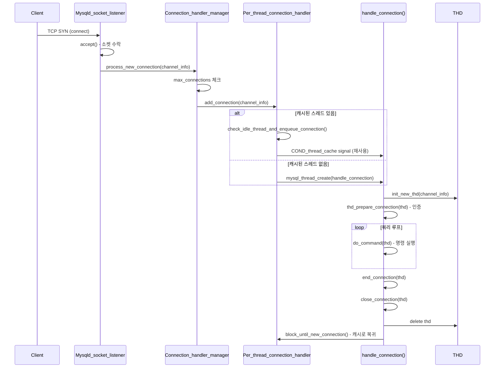
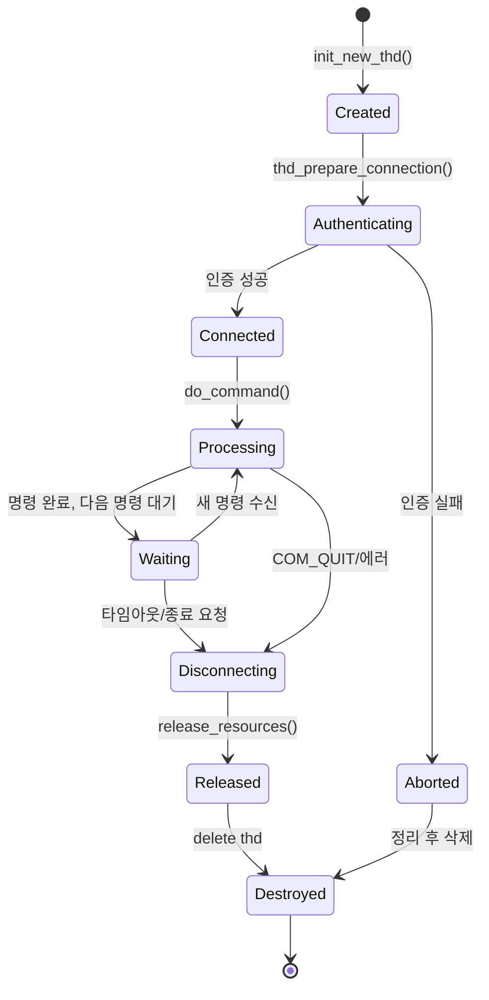
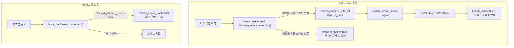

# 커넥션 관리와 스레드 모델

MySQL 서버는 클라이언트 커넥션마다 전용 스레드를 할당하는 Per-thread 모델을 기본으로 사용한다. 이 문서에서는 `sql/conn_handler/` 디렉토리의 커넥션 관리 구조, THD 클래스의 생명주기, 그리고 스레드 캐시 메커니즘을 소스코드 수준에서 분석한다.

## 목차
- [1. 핵심 개념 (What)](#1-핵심-개념-what)
- [2. 왜 알아야 하는가 (Why)](#2-왜-알아야-하는가-why)
- [3. 내부 구현 분석 (How)](#3-내부-구현-분석-how)
- [4. 실전 예제](#4-실전-예제)
- [5. 정리](#5-정리)

---

## 1. 핵심 개념 (What)

### 커넥션 관리 아키텍처

MySQL의 커넥션 관리는 세 가지 핵심 컴포넌트로 구성된다:

1. **Listener (Socket Connection)**: TCP/IP 소켓 또는 Unix 소켓에서 새 커넥션을 수락한다. `socket_connection.cc`에서 구현.
2. **Connection Handler Manager**: 새 커넥션을 적절한 핸들러에 할당하는 싱글턴 매니저. `connection_handler_manager.h`에서 정의.
3. **Connection Handler**: 실제 커넥션 처리 전략. Per-thread(`connection_handler_per_thread.cc`) 또는 No-thread 모델.

### conn_handler 디렉토리 구조

```
sql/conn_handler/
├── channel_info.h                  // 커넥션 채널 정보 추상 클래스
├── connection_handler.h            // Connection_handler 베이스 클래스
├── connection_handler_impl.h       // Per_thread_connection_handler 선언
├── connection_handler_manager.h    // Connection_handler_manager 싱글턴
├── connection_handler_manager.cc   // 매니저 구현
├── connection_handler_per_thread.cc// Per-thread 모델 구현
├── init_net_server_extension.cc    // 네트워크 서버 확장 초기화
├── init_net_server_extension.h
├── socket_connection.cc            // 소켓 리스너 구현
└── socket_connection.h
```

### 스레드 모델 종류

`Connection_handler_manager::scheduler_types` 열거형(`connection_handler_manager.h:111`):

| 모델 | 설명 |
|------|------|
| `SCHEDULER_ONE_THREAD_PER_CONNECTION` | 커넥션당 하나의 OS 스레드 (기본값) |
| `SCHEDULER_NO_THREADS` | 단일 스레드로 모든 커넥션 처리 (디버깅용) |

Enterprise Edition에서는 Threadpool 플러그인을 통해 스레드풀 모델도 지원한다.

## 2. 왜 알아야 하는가 (Why)

- **커넥션 폭주 대응**: 수천 개의 동시 커넥션이 서버에 몰릴 때 `max_connections`, `thread_cache_size`, `back_log` 등의 파라미터가 어떤 코드 경로에 영향을 미치는지 파악해야 한다.
- **메모리 사용량 분석**: 각 THD 인스턴스는 200개 이상의 멤버 변수를 가지며, 커넥션 수에 비례해 메모리가 증가한다. 메모리 누수를 진단하려면 THD 생명주기를 이해해야 한다.
- **인증 문제 디버깅**: 커넥션 수립 과정에서 발생하는 인증 실패, SSL 핸드셰이크 오류 등을 분석하려면 `thd_prepare_connection()` 흐름을 알아야 한다.
- **스레드 캐시 튜닝**: `thread_cache_size`를 적절히 설정하려면 스레드 캐시가 내부적으로 어떻게 동작하는지 이해해야 한다.

## 3. 내부 구현 분석 (How)

### 3.1 커넥션 수립 전체 흐름



### 3.2 Connection_handler_manager 싱글턴

`sql/conn_handler/connection_handler_manager.h:59`에 정의된 이 클래스는 모든 커넥션 이벤트의 진입점이다:

```cpp
class Connection_handler_manager {
  static Connection_handler_manager *m_instance; // 싱글턴
  static mysql_mutex_t LOCK_connection_count;
  static mysql_cond_t COND_connection_count;
  
  Connection_handler *m_connection_handler;      // 현재 활성 핸들러
  ulong m_aborted_connects;                      // 중단된 커넥션 수
  ulong m_connection_errors_max_connection;       // max_connections 초과 에러
  
 public:
  static uint connection_count;           // 현재 커넥션 수
  static ulong max_used_connections;      // 최대 동시 커넥션 기록
  static ulong thread_handling;           // 스레드 모델 타입
  
  enum scheduler_types {
    SCHEDULER_ONE_THREAD_PER_CONNECTION = 0,
    SCHEDULER_NO_THREADS,
    SCHEDULER_TYPES_COUNT
  };
};
```

### 3.3 Per_thread_connection_handler 상세 분석

`sql/conn_handler/connection_handler_per_thread.cc`에 구현된 핵심 클래스:

#### 정적 멤버 변수 (라인 67-74)

```cpp
ulong Per_thread_connection_handler::blocked_pthread_count = 0;
ulong Per_thread_connection_handler::slow_launch_threads = 0;
ulong Per_thread_connection_handler::max_blocked_pthreads = 0;
bool Per_thread_connection_handler::shrink_cache = false;
std::list<Channel_info *>
    *Per_thread_connection_handler::waiting_channel_info_list = nullptr;
mysql_mutex_t Per_thread_connection_handler::LOCK_thread_cache;
mysql_cond_t Per_thread_connection_handler::COND_thread_cache;
```

#### add_connection() 메서드 (라인 404)

새 커넥션이 들어올 때 호출되는 핵심 메서드:

```cpp
bool Per_thread_connection_handler::add_connection(
    Channel_info *channel_info) {
  // 1단계: 캐시된 유휴 스레드가 있는지 확인
  if (!check_idle_thread_and_enqueue_connection(channel_info))
    return false;  // 캐시 스레드에 배정 성공

  // 2단계: 캐시에 없으면 새 OS 스레드 생성
  channel_info->set_prior_thr_create_utime();
  error = mysql_thread_create(key_thread_one_connection, &id,
                              &connection_attrib,
                              handle_connection, (void *)channel_info);
  // 에러 처리 ...
}
```

#### block_until_new_connection() 메서드 (라인 144)

스레드 캐시의 핵심 메커니즘 - 스레드를 블로킹하여 재사용:

```cpp
Channel_info *Per_thread_connection_handler::block_until_new_connection() {
  Channel_info *new_conn = nullptr;
  mysql_mutex_lock(&LOCK_thread_cache);
  
  if (blocked_pthread_count < max_blocked_pthreads && !shrink_cache) {
    // 스레드 캐시에 자리가 있으면 블로킹
    blocked_pthread_count++;
    while (!abort_loop && !wake_pthread && !shrink_cache) {
      mysql_cond_wait(&COND_thread_cache, &LOCK_thread_cache);
    }
    blocked_pthread_count--;
    
    if (waiting_channel_info_list->size() > 0) {
      new_conn = waiting_channel_info_list->front();
      waiting_channel_info_list->pop_front();
      wake_pthread--;
    }
  }
  
  mysql_mutex_unlock(&LOCK_thread_cache);
  return new_conn;  // NULL이면 스레드 종료, 아니면 새 커넥션 처리
}
```

### 3.4 handle_connection() 함수 상세

`connection_handler_per_thread.cc:246`에 정의된 각 스레드의 메인 루프:

```cpp
static void *handle_connection(void *arg) {
  Global_THD_manager *thd_manager = Global_THD_manager::get_instance();
  Channel_info *channel_info = static_cast<Channel_info *>(arg);
  bool pthread_reused = false;

  for (;;) {
    // 1. 새 THD 생성
    THD *thd = init_new_thd(channel_info);
    
    // 2. THD를 글로벌 매니저에 등록
    thd_manager->add_thd(thd);
    
    // 3. 커넥션 준비 (인증 포함)
    if (thd_prepare_connection(thd))
      handler_manager->inc_aborted_connects();
    else {
      // 4. 명령 루프 - 커넥션이 살아있는 동안 반복
      while (thd_connection_alive(thd)) {
        if (do_command(thd)) break;
      }
      end_connection(thd);
    }
    
    // 5. 커넥션 정리
    close_connection(thd, 0, false, false);
    thd->release_resources();
    thd_manager->remove_thd(thd);
    delete thd;
    
    // 6. 서버 종료 중이면 루프 탈출
    if (connection_events_loop_aborted()) break;
    
    // 7. 스레드 캐시에서 블로킹 대기
    channel_info = Per_thread_connection_handler::
                   block_until_new_connection();
    if (channel_info == nullptr) break;  // 캐시 풀이면 스레드 종료
    pthread_reused = true;
  }
  
  my_thread_end();
  return nullptr;
}
```

### 3.5 THD 생명주기 다이어그램



### 3.6 THD 클래스 핵심 멤버

`sql/sql_class.h:953`에 선언된 THD의 주요 멤버들:

```cpp
class THD : public MDL_context_owner,
            public Query_arena,
            public Open_tables_state {
 public:
  // === 메모리 관리 ===
  Thd_mem_cnt m_mem_cnt;                 // 메모리 카운터 (THD 내 최초 선언)
  MEM_ROOT *mem_root;                    // 쿼리별 메모리 할당기
  
  // === 잠금/동시성 ===
  MDL_context mdl_context;               // 메타데이터 잠금
  enum_mark_columns mark_used_columns;   // 컬럼 사용 추적
  
  // === 쿼리 컨텍스트 ===
  LEX *lex;                              // 파스 트리 디스크립터
  std::unique_ptr<LEX> main_lex;         // 기본 LEX 인스턴스
  LEX_CSTRING m_query_string;            // 현재 쿼리 텍스트
  LEX_CSTRING m_db;                      // 현재 데이터베이스
  
  // === 데이터 딕셔너리 ===
  std::unique_ptr<dd::cache::Dictionary_client> m_dd_client;
  
  // === 보안 ===
  Security_context m_main_security_ctx;  // 보안 컨텍스트
  Access_bitmask want_privilege;         // 필요한 권한
  
  // === 세션 상태 ===
  system_variables variables;            // 세션 시스템 변수
  Session_tracker session_tracker;       // 세션 트래커
  Opt_trace_context opt_trace;           // 옵티마이저 트레이스
  
  // === 복제 ===
  Rpl_thd_context rpl_thd_ctx;          // 복제 컨텍스트
  
  // === 성능 ===
  PSI_statement_locker *m_statement_psi; // P_S 계측
  PROFILING *profiling;                  // 쿼리 프로파일링
};
```

### 3.7 스레드 캐시 메커니즘



## 4. 실전 예제

### 예제 1: 커넥션 상태 모니터링

```sql
-- 현재 커넥션/스레드 상태 확인
SHOW STATUS LIKE 'Threads%';
/*
+-------------------+-------+
| Variable_name     | Value |
+-------------------+-------+
| Threads_cached    | 5     |  -- 스레드 캐시에서 대기 중
| Threads_connected | 12    |  -- 현재 연결된 커넥션 수
| Threads_created   | 47    |  -- 총 생성된 스레드 수
| Threads_running   | 3     |  -- 현재 쿼리 실행 중인 스레드
+-------------------+-------+
*/

-- 스레드 캐시 효율성 계산
SELECT 
  (1 - (Threads_created / Connections)) * 100 AS cache_hit_rate_pct
FROM (
  SELECT 
    VARIABLE_VALUE + 0 AS Threads_created
  FROM performance_schema.global_status 
  WHERE VARIABLE_NAME = 'Threads_created'
) tc,
(
  SELECT 
    VARIABLE_VALUE + 0 AS Connections
  FROM performance_schema.global_status 
  WHERE VARIABLE_NAME = 'Connections'
) c;

-- thread_cache_size 설정 확인 및 조정
SHOW VARIABLES LIKE 'thread_cache_size';
-- 권장: Threads_created가 빠르게 증가하면 thread_cache_size 증가
SET GLOBAL thread_cache_size = 16;
```

### 예제 2: max_connections와 관련된 소스코드 동작

```sql
-- max_connections 도달 시 발생하는 에러
-- Connection_handler_manager에서 connection_count >= max_connections 체크
-- → ER_CON_COUNT_ERROR 반환

-- 현재 사용량 대비 여유 확인
SELECT 
  @@max_connections AS max_conn,
  (SELECT VARIABLE_VALUE FROM performance_schema.global_status 
   WHERE VARIABLE_NAME = 'Threads_connected') AS current_conn,
  @@max_connections - 
  (SELECT VARIABLE_VALUE FROM performance_schema.global_status 
   WHERE VARIABLE_NAME = 'Threads_connected') AS available;

-- 관리자용 예비 커넥션 확인
SHOW VARIABLES LIKE 'admin_port';
-- admin_port로 접속하면 max_connections 제한과 별도
```

### 예제 3: 커넥션 핸들러 및 인증 추적

```sql
-- Performance Schema로 커넥션 이벤트 추적
SELECT * FROM performance_schema.events_statements_summary_by_thread_by_event_name
WHERE THREAD_ID = (SELECT THREAD_ID FROM performance_schema.threads 
                   WHERE PROCESSLIST_ID = CONNECTION_ID())
LIMIT 10;

-- 커넥션 에러 통계 확인
SELECT * FROM performance_schema.host_cache
WHERE HOST IS NOT NULL
ORDER BY COUNT_AUTHENTICATION_ERRORS DESC
LIMIT 5;

-- 프로세스 목록으로 각 스레드의 상태 확인
SELECT ID, USER, HOST, DB, COMMAND, TIME, STATE
FROM information_schema.PROCESSLIST
ORDER BY TIME DESC;
```

## 5. 정리

| 항목 | 설명 |
|------|------|
| **기본 스레드 모델** | Per-thread: 커넥션 하나당 OS 스레드 하나 |
| **Connection_handler_manager** | `connection_handler_manager.h:59` - 싱글턴, 커넥션 디스패치 |
| **Per_thread_connection_handler** | `connection_handler_per_thread.cc` - 스레드 생성/캐시 관리 |
| **handle_connection()** | `connection_handler_per_thread.cc:246` - 스레드 메인 루프 |
| **THD 클래스** | `sql_class.h:953` - 커넥션 상태 전체를 담는 핵심 객체 |
| **스레드 캐시** | `block_until_new_connection()` / `check_idle_thread_and_enqueue_connection()` |
| **핵심 루프** | `init_new_thd → thd_prepare_connection → do_command 루프 → delete thd` |
| **핵심 파라미터** | `max_connections`, `thread_cache_size`, `back_log`, `wait_timeout` |

---

## 6. Connection Pool 실무

### 6.1 HikariCP 권장 설정

```yaml
spring:
  datasource:
    hikari:
      maximum-pool-size: 20          # CPU cores * 2 + spindle_count
      minimum-idle: 10
      idle-timeout: 600000           # 10분
      max-lifetime: 1800000          # 30분
      connection-timeout: 30000      # 30초
      leak-detection-threshold: 60000  # 60초 (leak 감지)
      connection-test-query: SELECT 1
```

```
Pool Size 공식: connections = (core_count * 2) + effective_spindle_count
예: 4코어 SSD → (4 * 2) + 1 = 9~10
주의: 너무 많은 커넥션은 Context Switching 비용으로 오히려 성능 저하
```

### 6.2 Connection Leak 감지

```java
// 문제: 커넥션 미반환
public void badMethod() {
    Connection conn = dataSource.getConnection();
    // return 안 함 → 커넥션 누수!
}

// 해결: try-with-resources
public void goodMethod() {
    try (Connection conn = dataSource.getConnection()) {
        // 자동 반환
    }
}
```

### 6.3 모니터링

```sql
SHOW STATUS LIKE 'Threads_connected';      -- 현재 연결 수
SHOW STATUS LIKE 'Max_used_connections';    -- 최대 연결 수
SHOW STATUS LIKE 'Threads_running';        -- 실행 중 스레드
SHOW PROCESSLIST;                           -- 프로세스 목록
```

---
*참고: MySQL 9.x (trunk) 소스코드 기준*
