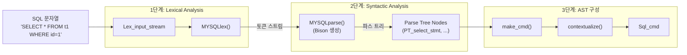
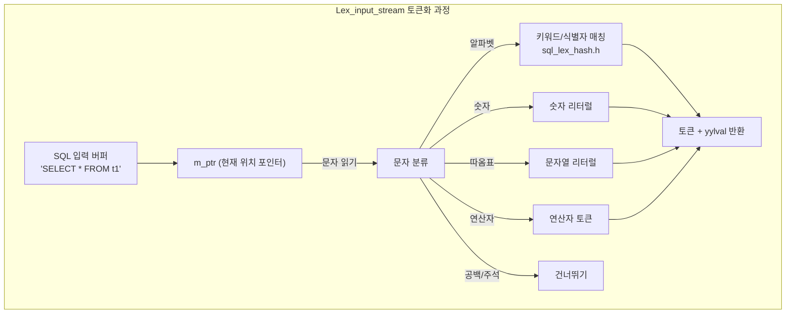
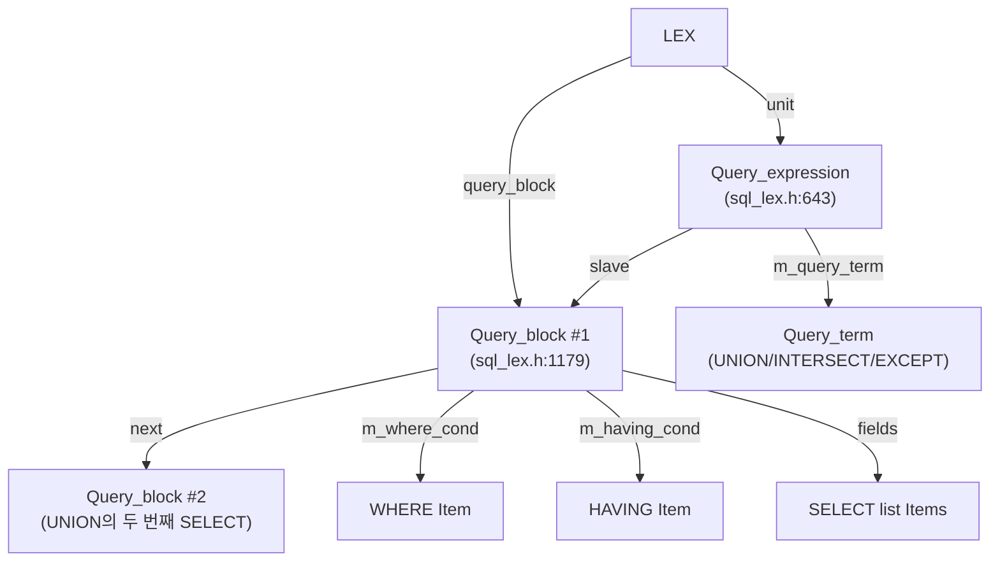

# SQL 파싱과 구문 분석

MySQL의 SQL 파서는 Flex/Bison 기반의 전통적인 lexer/parser 구조를 따른다. 이 문서에서는 SQL 문자열이 토큰화되고, 파스 트리로 변환되어 실행 가능한 AST가 되기까지의 전체 과정을 소스코드 수준에서 분석한다.

## 목차
- [1. 핵심 개념 (What)](#1-핵심-개념-what)
- [2. 왜 알아야 하는가 (Why)](#2-왜-알아야-하는가-why)
- [3. 내부 구현 분석 (How)](#3-내부-구현-분석-how)
- [4. 실전 예제](#4-실전-예제)
- [5. 정리](#5-정리)

---

## 1. 핵심 개념 (What)

### 파싱 파이프라인 개요

SQL 문자열이 실행 가능한 구조로 변환되는 과정은 세 단계로 이루어진다:

1. **Lexical Analysis (토큰화)**: SQL 문자열을 토큰(keyword, identifier, literal 등) 스트림으로 변환. `Lex_input_stream`이 담당.
2. **Syntactic Analysis (구문 분석)**: 토큰 스트림을 Bison 문법 규칙에 따라 파스 트리(Parse Tree)로 변환. `MYSQLparse()`가 담당.
3. **AST 구성 (contextualize)**: 파스 트리 노드에서 `make_cmd()` → `contextualize()`를 호출하여 실행 가능한 `Sql_cmd` 객체를 생성.

### 핵심 파일 맵

| 파일 | 역할 |
|------|------|
| `sql/sql_lex.cc` / `sql/sql_lex.h` | LEX 구조체, Query_block, Query_expression, Lex_input_stream |
| `sql/sql_yacc.yy` | Bison 문법 파일 (SQL 구문 규칙 정의) |
| `sql/sql_parse.cc` | `parse_sql()`, `dispatch_command()`, `mysql_execute_command()` |
| `sql/sql_class.cc` | `THD::sql_parser()` - 파서 호출 래퍼 |
| `sql/parse_tree_nodes.h/.cc` | 파스 트리 노드 클래스 계층 |
| `sql/parser_yystype.h` | Bison 시맨틱 값 타입 (`YYSTYPE`) |
| `sql/sql_lex_hash.h` | 키워드 해시 테이블 |

## 2. 왜 알아야 하는가 (Why)

- **SQL 구문 에러 디버깅**: `You have an error in your SQL syntax` 에러가 발생할 때, lexer/parser의 어느 단계에서 실패하는지 이해하면 근본 원인을 빠르게 파악할 수 있다.
- **쿼리 리라이트**: MySQL의 query rewrite 플러그인을 작성하거나 분석하려면 파스 트리 구조를 알아야 한다.
- **새로운 SQL 구문 추가**: MySQL에 새로운 SQL 문법을 기여하려면 `.yy` 파일 수정, 새 파스 트리 노드 클래스 추가, `Sql_cmd` 구현의 전체 흐름을 이해해야 한다.
- **Prepared Statement 이해**: 파싱 단계가 한 번만 실행되고 이후에는 재사용되는 Prepared Statement의 성능 이점을 이해하려면 파싱 파이프라인을 알아야 한다.

## 3. 내부 구현 분석 (How)

### 3.1 파싱 전체 아키텍처



### 3.2 parse_sql() 진입점

`sql/sql_parse.cc:7177`에 정의된 파싱의 공식 진입점:

```cpp
bool parse_sql(THD *thd, Parser_state *parser_state,
               Object_creation_ctx *creation_ctx) {
  // 1. 파서 상태 설정
  thd->m_parser_state = parser_state;
  
  // 2. 문자셋 컨텍스트 설정 (뷰/SP 실행 시)
  if (creation_ctx) creation_ctx->restore_env(thd, backup_ctx);
  
  // 3. THD::sql_parser() 호출 - 실제 파싱
  bool ret_value = thd->sql_parser();
  
  // 4. 후처리
  thd->m_parser_state = nullptr;
  return ret_value;
}
```

### 3.3 THD::sql_parser() 상세

`sql/sql_class.cc:3179`에서 Bison 파서를 호출하고 AST를 구축:

```cpp
bool THD::sql_parser() {
  // YACC 파서 호출 - sql_yacc.yy에서 생성된 함수
  extern int my_sql_parser_parse(class THD *thd,
                                 class Parse_tree_root **root);

  Parse_tree_root *root = nullptr;
  // 1. Bison 파서 실행 → 파스 트리 반환
  if (my_sql_parser_parse(this, &root) || is_error()) {
    cleanup_after_parse_error();
    return true;
  }
  // 2. 파스 트리 → Sql_cmd 변환
  //    root->make_cmd(thd) → contextualize() 호출
  if (root != nullptr && lex->make_sql_cmd(root)) {
    return true;
  }
  return false;
}
```

### 3.4 Lex_input_stream (Lexer)



`MYSQLlex()` 함수가 호출될 때마다 `Lex_input_stream`은 다음 토큰을 찾아 반환한다. Bison은 이를 반복 호출하여 토큰 스트림을 소비한다.

### 3.5 Bison 파서와 sql_yacc.yy

`sql/sql_yacc.yy`는 MySQL의 전체 SQL 문법을 정의하는 Bison 문법 파일이다. 이 파일에서 컴파일된 `MYSQLparse()` 함수가 실제 구문 분석을 수행한다.

```
// sql_yacc.yy의 기본 구조 (간략화)
%token SELECT_SYM FROM WHERE ...

%%
query:
    verb_clause ';'
  | verb_clause END_OF_INPUT
  ;

verb_clause:
    statement
  | begin_stmt
  ;

statement:
    select_stmt         { $$ = $1; }
  | insert_stmt         { $$ = $1; }
  | update_stmt         { $$ = $1; }
  | delete_stmt         { $$ = $1; }
  | create_stmt         { $$ = $1; }
  // ... 수백 개의 문법 규칙
  ;

select_stmt:
    query_expression
    {
      $$ = NEW_PTN PT_select_stmt($1);
    }
  ;
```

핵심 흐름(`sql/mysqld.cc:460-476`의 시퀀스 다이어그램에서 발췌):

```
server → parser : THD::sql_parser()
parser → bison  : MYSQLparse()
bison  → lexer  : MYSQLlex()
bison  ←  lexer : yylval, yylloc
bison  → pt     : new PT_xxx(...)        // 파스 트리 노드 생성
parser ←  pt    : Abstract Syntax Tree
```

### 3.6 Parser_state 구조

`sql/sql_lex.h:5035`에 정의된 파서의 전체 상태를 캡슐화하는 클래스:

```cpp
class Parser_state {
 public:
  Parser_state() : m_input(), m_lip(~0U), m_yacc(), m_comment(false) {}

  bool init(THD *thd, const char *buff, size_t length) {
    return m_lip.init(thd, buff, length);
  }

  Parser_input m_input;       // 입력 파라미터 (digest 생성 여부 등)
  Lex_input_stream m_lip;     // 렉서 상태 (현재 위치, 토큰 버퍼)
  Yacc_state m_yacc;          // Bison 파서 상태
  PSI_digest_locker *m_digest_psi;  // Performance Schema 다이제스트
 private:
  bool m_comment;             // 현재 쿼리에 주석 포함 여부
};
```

### 3.7 LEX 구조체

`sql/sql_lex.h:3999`에 정의된 파싱 결과의 최상위 컨테이너:

```cpp
struct LEX : public Query_tables_list {
  Query_expression *unit;           // 최외곽 쿼리 표현식
  Query_block *query_block;         // 첫 번째 쿼리 블록
  Query_block *all_query_blocks_list; // 모든 쿼리 블록 리스트
  
 private:
  Query_block *m_current_query_block; // 파싱 중 현재 쿼리 블록
  
 public:
  Sql_cmd *m_sql_cmd;               // 실행할 SQL 명령 객체
  enum_sql_command sql_command;     // SQLCOM_SELECT, SQLCOM_INSERT 등
  
  // 파싱 결과 활용
  bool is_explain() const;
  bool using_hypergraph_optimizer() const;
  
  // Sql_cmd 생성
  bool make_sql_cmd(Parse_tree_root *parse_tree);
};
```

### 3.8 Query_block과 Query_expression

SQL 쿼리의 논리적 구조를 표현하는 두 핵심 클래스:



**Query_expression** (`sql_lex.h:643`):
```cpp
class Query_expression {
  Query_expression *next;     // 형제 쿼리 표현식
  Query_expression **prev;
  Query_block *master;        // 포함하는 쿼리 블록
  Query_block *slave;         // 첫 번째 자식 쿼리 블록
  Query_term *m_query_term;   // UNION/INTERSECT/EXCEPT 연산
};
```

**Query_block** (`sql_lex.h:1179`):
```cpp
class Query_block : public Query_term {
 public:
  Item *where_cond() const;      // WHERE 조건
  Item *having_cond() const;     // HAVING 조건
  Item *qualify_cond() const;    // QUALIFY 조건 (윈도우 함수용)
  
  mem_root_deque<Item *> fields; // SELECT 목록의 아이템들
  
  // 파싱 후 해석 단계
  bool prepare(THD *thd, mem_root_deque<Item *> *insert_field_list);
};
```

### 3.9 Parse Tree 노드 클래스 계층

`sql/parse_tree_nodes.h`에 정의된 파스 트리 노드들의 계층 구조:

```
Parse_tree_root (추상)
├── PT_select_stmt              // SELECT 문
├── PT_insert                   // INSERT 문
├── PT_update                   // UPDATE 문
├── PT_delete                   // DELETE 문
├── PT_create_table_stmt        // CREATE TABLE 문
├── PT_alter_table_stmt         // ALTER TABLE 문
├── PT_drop_table_stmt          // DROP TABLE 문
└── ...

Parse_tree_node (추상)
├── PT_table_reference          // 테이블 참조
├── PT_joined_table             // JOIN 표현
├── PT_order_expr               // ORDER BY 표현식
├── PT_group                    // GROUP BY
├── PT_window                   // WINDOW 절
├── PT_with_clause              // WITH (CTE)
└── ...
```

각 노드의 `contextualize()` 메서드가 호출되면서 파스 트리가 실행 가능한 AST로 변환된다:

```cpp
// sql/mysqld.cc:515-525 에서 설명하는 과정
// parser → ast : make_cmd()
//   ast → ast : contextualize()
//   ast → ci : build()    (예: HA_CREATE_INFO)
//   ast → cmd : build()   (예: Sql_cmd)
```

### 3.10 전체 파싱 호출 스택

```
do_command(thd)
  └── dispatch_command(thd, COM_QUERY)
        └── dispatch_sql_command(thd)
              └── parse_sql(thd, &parser_state, nullptr)
                    └── THD::sql_parser()
                          ├── my_sql_parser_parse(thd, &root)
                          │     ├── MYSQLlex() ← 반복 호출
                          │     └── Bison reduce actions
                          │           └── new PT_select_stmt(...)
                          └── lex->make_sql_cmd(root)
                                └── root->make_cmd(thd)
                                      └── PT_select_stmt::make_cmd(thd)
                                            └── contextualize()
                                                  └── Sql_cmd_dml 생성
```

## 4. 실전 예제

### 예제 1: 파서 디버깅으로 구문 분석 과정 추적

```bash
# MySQL을 디버그 모드로 빌드한 후 MTR로 파서 테스트
cd mysql-test
./mtr --ddd main.parser

# GDB 브레이크포인트 설정
(gdb) break THD::sql_parser
(gdb) break MYSQLlex
(gdb) break my_sql_parser_parse
(gdb) continue
```

```sql
-- 테스트 쿼리
SELECT a, b FROM t1 WHERE a > 10 ORDER BY b;
```

GDB에서 `MYSQLlex()`가 반환하는 토큰 순서:
```
SELECT_SYM → IDENT('a') → ',' → IDENT('b') → FROM → IDENT('t1')
→ WHERE → IDENT('a') → GT_SYM → NUM('10') → ORDER_SYM → BY_SYM
→ IDENT('b') → ';' → END_OF_INPUT
```

### 예제 2: Query Digest로 파싱 결과 확인

```sql
-- Performance Schema의 statements_digest에서 정규화된 쿼리 확인
SELECT 
  DIGEST_TEXT,
  COUNT_STAR,
  AVG_TIMER_WAIT/1000000000 AS avg_ms,
  FIRST_SEEN,
  LAST_SEEN
FROM performance_schema.events_statements_summary_by_digest
ORDER BY COUNT_STAR DESC
LIMIT 10;

/*
파서가 생성하는 Digest 예시:
원본: SELECT * FROM users WHERE id = 42 AND name = 'Alice'
다이제스트: SELECT * FROM `users` WHERE `id` = ? AND `name` = ?

리터럴 값이 '?'로 치환되어 동일 패턴의 쿼리를 그룹화할 수 있다.
이 정규화는 sql_digest.cc에서 토큰 스트림 수준으로 수행된다.
*/
```

### 예제 3: EXPLAIN 파스 트리 분석

```sql
-- 옵티마이저 트레이스를 통해 파싱-최적화 과정 확인
SET optimizer_trace = 'enabled=on';

SELECT * FROM employees e 
JOIN departments d ON e.dept_id = d.id 
WHERE d.name = 'Engineering';

SELECT * FROM information_schema.OPTIMIZER_TRACE\G

/*
trace 출력에서 파싱 관련 부분:
{
  "join_preparation": {
    "select#": 1,
    "steps": [
      {
        "expanded_query": "/* select#1 */ select `e`.`id`,`e`.`name`,
          `e`.`dept_id`,`d`.`id`,`d`.`name` from `employees` `e` 
          join `departments` `d` where (`e`.`dept_id` = `d`.`id` 
          and `d`.`name` = 'Engineering')"
      }
    ]
  }
}
*/
```

## 5. 정리

| 항목 | 설명 |
|------|------|
| **파싱 진입점** | `parse_sql()` (`sql_parse.cc:7177`) → `THD::sql_parser()` (`sql_class.cc:3179`) |
| **Bison 파서** | `MYSQLparse()` - `sql_yacc.yy`에서 생성 |
| **렉서** | `MYSQLlex()` → `Lex_input_stream` (`sql_lex.h`) |
| **Parser_state** | `sql_lex.h:5035` - 렉서/파서 전체 상태 캡슐화 |
| **LEX 구조체** | `sql_lex.h:3999` - 파싱 결과 최상위 컨테이너 |
| **Query_expression** | `sql_lex.h:643` - UNION/INTERSECT/EXCEPT 단위 |
| **Query_block** | `sql_lex.h:1179` - 개별 SELECT 단위, WHERE/HAVING/필드 목록 보유 |
| **Parse Tree 노드** | `parse_tree_nodes.h` - `PT_select_stmt`, `PT_insert` 등 |
| **AST 변환** | `make_cmd()` → `contextualize()` → `Sql_cmd` 생성 |

---
*참고: MySQL 9.x (trunk) 소스코드 기준*
