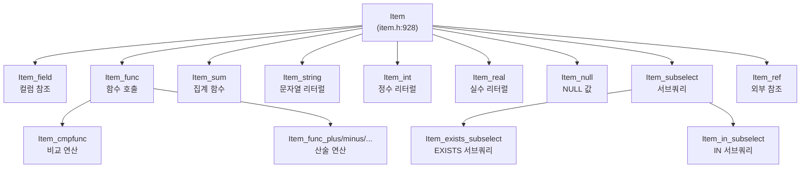
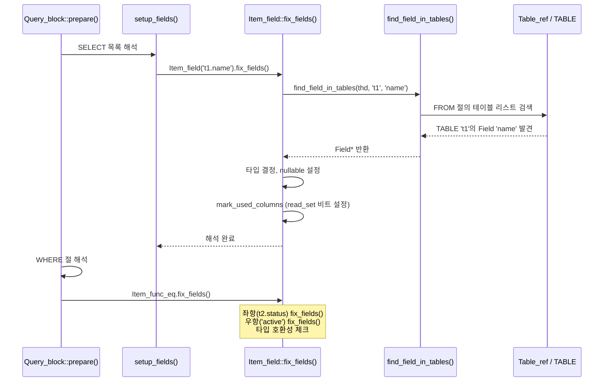
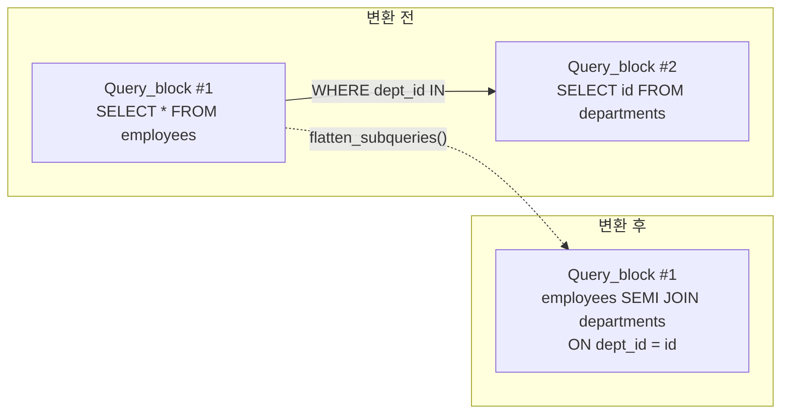

# 이름 해석과 의미 분석

MySQL의 의미 분석(Semantic Resolution) 단계는 파싱된 AST에서 컬럼 참조를 실제 테이블 컬럼에 바인딩하고, 타입을 결정하며, 서브쿼리를 변환하는 과정이다. 이 문서에서는 `sql_resolver.cc`의 `Query_block::prepare()` 흐름을 중심으로 이름 해석 과정을 소스코드 수준에서 분석한다.

## 목차
- [1. 핵심 개념 (What)](#1-핵심-개념-what)
- [2. 왜 알아야 하는가 (Why)](#2-왜-알아야-하는가-why)
- [3. 내부 구현 분석 (How)](#3-내부-구현-분석-how)
- [4. 실전 예제](#4-실전-예제)
- [5. 정리](#5-정리)

---

## 1. 핵심 개념 (What)

### 파싱과 해석의 차이

파서(03-sql-parsing.md)가 생성한 AST에는 아직 "의미"가 부여되지 않은 상태이다:

- 컬럼 이름 `id`가 어떤 테이블의 어떤 컬럼인지 결정되지 않았다
- `SELECT *`의 `*`가 어떤 컬럼들로 확장되는지 모른다
- 표현식의 결과 타입이 결정되지 않았다
- 서브쿼리가 세미조인으로 변환 가능한지 판단되지 않았다

**의미 분석(Semantic Resolution)** 은 이 모든 것을 해결하는 단계이다.

### 핵심 파일

| 파일 | 역할 | 크기 |
|------|------|------|
| `sql/sql_resolver.cc` | 이름 해석, 타입 결정, 서브쿼리 변환의 메인 로직 | ~347KB |
| `sql/sql_base.cc` | 테이블 열기, 테이블 캐시, `setup_fields()` | 대규모 |
| `sql/item.h` | `Item` 클래스 계층 - 모든 표현식의 베이스 | ~970행 클래스 선언 |
| `sql/item.cc` | `Item::fix_fields()` 구현 | |
| `sql/sql_lex.h` | `Query_block`, `Query_expression` | |

### 핵심 용어

| 용어 | 설명 |
|------|------|
| **Name Resolution** | 컬럼명 → 실제 테이블.컬럼 바인딩 |
| **fix_fields()** | `Item`의 타입/속성을 확정하는 메서드 |
| **setup_fields()** | SELECT 목록의 모든 Item에 `fix_fields()` 호출 |
| **setup_tables()** | FROM 절의 테이블 참조를 해석 |
| **prepare()** | `Query_block::prepare()` - 해석 단계의 진입점 |

## 2. 왜 알아야 하는가 (Why)

### 실무에서의 가치

- **모호한 컬럼 에러 이해**: `Column 'id' in where clause is ambiguous` 에러가 발생하는 내부 메커니즘을 이해하면 복잡한 JOIN 쿼리의 컬럼 참조 문제를 빠르게 해결할 수 있다.
- **암묵적 타입 변환 이해**: `WHERE varchar_col = 123`에서 인덱스가 사용되지 않는 이유(암묵적 타입 변환)를 이해하려면 `fix_fields()` 단계의 타입 결정 로직을 알아야 한다.
- **서브쿼리 최적화**: `IN (SELECT ...)`가 세미조인으로 변환되는 시점과 조건을 이해하면 쿼리 성능을 예측하고 개선할 수 있다.
- **뷰/파생 테이블 해석**: 뷰가 머지되는지 머티리얼라이즈되는지 판단하는 로직이 `prepare()` 단계에 있다.
- **권한 검증**: 컬럼 수준의 접근 권한 체크가 이름 해석과 함께 수행된다.

## 3. 내부 구현 분석 (How)

### 3.1 의미 분석 전체 아키텍처

```mermaid
graph TB
    subgraph "Query_block::prepare() 실행 흐름"
        ST["setup_tables()<br/>테이블 참조 해석"]
        RPT["resolve_placeholder_tables()<br/>파생 테이블 해석"]
        NJ["setup_natural_join_row_types()<br/>NATURAL JOIN 처리"]
        SW["setup_wild()<br/>SELECT * 확장"]
        SF["setup_fields()<br/>SELECT 목록 fix_fields()"]
        WH["fix_fields() on WHERE"]
        GB["fix_fields() on GROUP BY"]
        HV["fix_fields() on HAVING"]
        OB["fix_fields() on ORDER BY"]
        WF["setup_windows()<br/>윈도우 함수 해석"]
        SJ["flatten_subqueries()<br/>서브쿼리 → 세미조인 변환"]
    end
    
    ST --> RPT
    RPT --> NJ
    NJ --> SW
    SW --> SF
    SF --> WH
    WH --> GB
    GB --> HV
    HV --> OB
    OB --> WF
    WF --> SJ
```



### 3.2 Query_block::prepare() 상세 분석

`sql/sql_resolver.cc:184`에 정의된 해석 단계의 핵심 함수:

```cpp
bool Query_block::prepare(THD *thd,
                          mem_root_deque<Item *> *insert_field_list) {
  // === 1단계: 테이블 설정 ===
  
  // FROM 절의 테이블 해석 (Table_ref 리스트 구축)
  if (setup_tables(thd, get_table_list(), false)) return true;
  
  // 파생 테이블(서브쿼리 in FROM)과 테이블 함수 해석
  if ((derived_table_count || table_func_count) &&
      resolve_placeholder_tables(thd, true))
    return true;
  
  // NATURAL JOIN / USING 조인의 행 타입 설정
  if (leaf_table_count >= 2 &&
      setup_natural_join_row_types(thd, m_current_table_nest, &context))
    return true;

  // === 2단계: SELECT 목록 해석 ===
  
  // 권한 체크 설정
  const bool check_privs = !thd->derived_tables_processing ||
                           master_query_expression()->item != nullptr;
  thd->want_privilege = check_privs ? SELECT_ACL : 0;
  
  // SELECT * 를 실제 컬럼 목록으로 확장
  if (with_wild && setup_wild(thd)) return true;
  
  // SELECT 목록의 모든 Item에 fix_fields() 호출
  if (setup_fields(thd, thd->want_privilege, /*allow_sum_func=*/true,
                   /*split_sum_funcs=*/true, /*column_update=*/false,
                   insert_field_list, &fields, base_ref_items))
    return true;

  // === 3단계: WHERE/GROUP BY/HAVING/ORDER BY 해석 ===
  
  // WHERE 절 해석
  if (m_where_cond) {
    thd->where = "where clause";
    if (m_where_cond->fix_fields(thd, &m_where_cond))
      return true;
  }
  
  // GROUP BY 해석
  if (group_list.elements && setup_group(thd))
    return true;
  
  // HAVING 절 해석
  if (m_having_cond && m_having_cond->fix_fields(thd, &m_having_cond))
    return true;
  
  // ORDER BY 해석
  if (order_list.elements && setup_order(thd))
    return true;
  
  // === 4단계: 윈도우 함수 및 서브쿼리 최적화 ===
  
  // 윈도우 함수 설정
  if (m_windows.elements > 0 && setup_windows(thd))
    return true;
  
  // IN/EXISTS 서브쿼리 → 세미조인 변환 시도
  if (flatten_subqueries(thd)) return true;
  
  return false;
}
```

### 3.3 Item 클래스 계층과 fix_fields()

`sql/item.h:928`에 정의된 `Item`은 MySQL의 모든 표현식을 나타내는 베이스 클래스이다:



#### Item 타입 열거형 (item.h:963)

```cpp
enum Type {
  INVALID_ITEM,
  FIELD_ITEM,          // 테이블 컬럼 참조
  FUNC_ITEM,           // 함수 호출
  SUM_FUNC_ITEM,       // 집계/윈도우 함수
  STRING_ITEM,         // 문자열 리터럴
  INT_ITEM,            // 정수 리터럴
  DECIMAL_ITEM,        // 10진수 리터럴
  REAL_ITEM,           // 부동소수점 리터럴
  NULL_ITEM,           // NULL
  // ...
};
```

#### fix_fields()의 핵심 역할

`fix_fields()`는 각 `Item`의 타입과 속성을 최종 확정하는 가상 메서드이다:

```cpp
class Item {
 public:
  // fix_fields()가 수행하는 작업:
  // 1. 이름 해석: Item_field의 경우 테이블.컬럼 바인딩
  // 2. 타입 결정: result_type(), data_type() 확정
  // 3. NULL 가능성 결정: nullable 속성 설정
  // 4. 상수 폴딩: 상수 표현식은 즉시 평가
  // 5. 사용 컬럼 마킹: read_set/write_set에 비트 설정
  virtual bool fix_fields(THD *thd, Item **ref);
  
  bool fixed;                  // fix_fields() 완료 여부
  enum Type type() const;       // 아이템 타입
  Item_result result_type() const; // 결과 타입 (STRING, INT, REAL, ...)
  enum_field_types data_type() const; // MySQL 데이터 타입
  bool nullable;                // NULL 가능 여부
};
```

### 3.4 컬럼 이름 해석 과정

`SELECT t1.name FROM t1 JOIN t2 ON t1.id = t2.id WHERE t2.status = 'active'`를 해석할 때:



#### 이름 해석의 검색 순서

1. **현재 Query_block의 FROM 절 테이블들**: 직접 참조된 테이블/뷰
2. **외부 Query_block**: 상관 서브쿼리의 경우 외부 블록 참조
3. **NATURAL JOIN / USING에 의한 합성 컬럼**: `setup_natural_join_row_types()`에서 구축
4. **GROUP BY 별칭**: MySQL의 비표준 확장 - GROUP BY에서 SELECT 별칭 참조 가능

### 3.5 setup_fields()와 setup_wild()

#### setup_wild() - SELECT * 확장

```sql
-- 입력
SELECT * FROM employees e JOIN departments d ON e.dept_id = d.id;

-- setup_wild() 후 확장된 결과
SELECT e.id, e.name, e.dept_id, d.id, d.name
FROM employees e JOIN departments d ON e.dept_id = d.id;
```

`setup_wild()`는 `*`를 해당 테이블의 모든 컬럼 `Item_field`로 대체하고, 접근 권한도 체크한다.

#### setup_fields() - 전체 필드 해석

`sql/sql_base.cc`에 구현된 `setup_fields()`는 필드 목록의 각 `Item`에 대해 `fix_fields()`를 호출한다:

```cpp
// setup_fields() 간략화 로직
bool setup_fields(THD *thd, Access_bitmask want_privilege,
                  bool allow_sum_func, bool split_sum_funcs,
                  bool column_update,
                  mem_root_deque<Item *> *typed_items,
                  mem_root_deque<Item *> *fields,
                  Ref_item_array ref_item_array) {
  for (auto &item : *fields) {
    // 각 Item에 대해 fix_fields() 호출
    if (item->fix_fields(thd, &item))
      return true;
    
    // 권한 체크
    if (want_privilege)
      item->check_column_privileges(thd, want_privilege);
      
    // 집계 함수 분리 (split_sum_funcs)
    if (split_sum_funcs && item->has_aggregation())
      split_sum_func(thd, ...);
  }
  return false;
}
```

### 3.6 서브쿼리 변환: flatten_subqueries()

`sql_resolver.cc`에서 `IN` 서브쿼리를 세미조인으로 변환하는 핵심 최적화:

```sql
-- 변환 전: IN 서브쿼리
SELECT * FROM employees
WHERE dept_id IN (SELECT id FROM departments WHERE active = 1);

-- 변환 후: 세미조인 (flatten_subqueries 결과)
SELECT employees.* FROM employees
SEMI JOIN departments ON employees.dept_id = departments.id
WHERE departments.active = 1;
```



### 3.7 파생 테이블 머지 결정

`Query_block::prepare()` 라인 211에서 파생 테이블 머지 여부를 결정한다:

```cpp
// 파생 테이블 머지 허용 조건 결정
allow_merge_derived =
    outer_query_block() == nullptr ||           // 최외곽 쿼리
    master_query_expression()->item == nullptr || // 서브쿼리가 아닌 경우
    (outer_query_block()->outer_query_block() == nullptr
         ? parent_lex->sql_command == SQLCOM_SELECT ||
               parent_lex->sql_command == SQLCOM_SET_OPTION
         : outer_query_block()->allow_merge_derived);
```

머지가 허용되면 파생 테이블의 WHERE 조건이 외부 쿼리로 병합되어 성능이 향상된다:

```sql
-- 파생 테이블 머지 전
SELECT * FROM (SELECT * FROM t1 WHERE a > 10) dt WHERE dt.b < 5;

-- 머지 후 (내부적으로 변환)
SELECT * FROM t1 WHERE a > 10 AND b < 5;
```

### 3.8 재귀적 prepare() 호출 패턴

서브쿼리가 중첩된 경우 `prepare()`가 재귀적으로 호출된다:

```
Query_block::prepare() (select#1 - 외부 쿼리)
│
├── setup_fields() → fix_fields()
│     └── Item_in_subselect::fix_fields()
│           └── Query_block::prepare() (select#2 - 서브쿼리)
│                 │
│                 ├── setup_fields() → fix_fields()
│                 │     └── Item_subselect::fix_fields()
│                 │           └── Query_block::prepare() (select#3 - 서브서브쿼리)
│                 │           └── Query_block::prepare() 완료
│                 │
│                 └── Query_block::prepare() 완료
│
├── flatten_subqueries()  -- 세미조인 변환
└── Query_block::prepare() 완료
```

이 패턴은 `sql_resolver.cc:3720-3729`의 주석에도 명시되어 있다.

## 4. 실전 예제

### 예제 1: 컬럼 모호성 에러 분석

```sql
-- 에러 발생: Column 'id' in where clause is ambiguous
SELECT * FROM employees e 
JOIN departments d ON e.dept_id = d.id 
WHERE id = 10;

-- 원인: fix_fields()가 'id'를 찾을 때
-- employees.id와 departments.id 모두 매칭되어 모호성 발생

-- 해결: 테이블 한정자 명시
SELECT * FROM employees e 
JOIN departments d ON e.dept_id = d.id 
WHERE e.id = 10;
```

내부적으로 `find_field_in_tables()`가 FROM 절의 모든 테이블을 검색하면서, 동일 이름 컬럼이 2개 이상 발견되면 `ER_NON_UNIQ_ERROR`를 반환한다.

### 예제 2: 암묵적 타입 변환과 인덱스 사용

```sql
-- phone_number는 VARCHAR(20), 인덱스 있음
EXPLAIN SELECT * FROM customers WHERE phone_number = 01012345678;
-- type: ALL (풀스캔!) — 인덱스 미사용

-- 원인: fix_fields() 단계에서
-- Item_field(VARCHAR) = Item_int(BIGINT) 비교 시
-- VARCHAR → DOUBLE 변환 발생 → 인덱스 사용 불가

-- 해결: 올바른 타입의 리터럴 사용
EXPLAIN SELECT * FROM customers WHERE phone_number = '01012345678';
-- type: ref (인덱스 사용!)
```

fix_fields() 단계에서 `Item_func_eq`의 양쪽 피연산자 타입이 다르면, 공통 타입으로 변환하는 규칙이 적용된다. 문자열과 숫자를 비교하면 양쪽 모두 `DOUBLE`로 변환되어 인덱스를 사용할 수 없게 된다.

### 예제 3: 옵티마이저 트레이스로 이름 해석 과정 관찰

```sql
SET optimizer_trace = 'enabled=on';
SET optimizer_trace_max_mem_size = 1048576;

SELECT e.name, d.name AS dept_name
FROM employees e
JOIN departments d ON e.dept_id = d.id
WHERE e.salary > 50000
ORDER BY e.name;

SELECT * FROM information_schema.OPTIMIZER_TRACE\G

/*
trace의 join_preparation 섹션에서 확인 가능한 내용:

{
  "join_preparation": {
    "select#": 1,
    "steps": [
      {
        "expanded_query": "/* select#1 */ select 
          `e`.`name` AS `name`,
          `d`.`name` AS `dept_name` 
          from `employees` `e` 
          join `departments` `d` 
          where ((`e`.`dept_id` = `d`.`id`) 
                 and (`e`.`salary` > 50000)) 
          order by `e`.`name`"
      }
    ]
  }
}

expanded_query에서 확인할 수 있는 것:
1. 컬럼에 테이블 한정자가 추가됨 (e.name → `e`.`name`)
2. 별칭이 AS로 명시됨 (d.name AS dept_name → `d`.`name` AS `dept_name`)
3. ON 조건이 WHERE로 병합됨 (equi-join 최적화)
*/
```

## 5. 정리

| 항목 | 설명 |
|------|------|
| **진입점** | `Query_block::prepare()` (`sql_resolver.cc:184`) |
| **테이블 해석** | `setup_tables()` → FROM 절 테이블 참조 바인딩 |
| **와일드카드 확장** | `setup_wild()` → `SELECT *`를 컬럼 목록으로 |
| **필드 해석** | `setup_fields()` → `Item::fix_fields()` 재귀 호출 |
| **Item 계층** | `item.h:928` - `Item_field`, `Item_func`, `Item_sum` 등 |
| **이름 검색 순서** | 현재 FROM → 외부 Query_block → NATURAL JOIN 합성 컬럼 |
| **서브쿼리 변환** | `flatten_subqueries()` → IN 서브쿼리를 세미조인으로 |
| **파생 테이블 머지** | `allow_merge_derived` 플래그 기반 결정 |
| **타입 결정** | `fix_fields()`에서 `result_type()`, `data_type()` 확정 |
| **권한 검증** | `Item::check_column_privileges()` - 컬럼 수준 접근 권한 체크 |

---
*참고: MySQL 9.x (trunk) 소스코드 기준*
