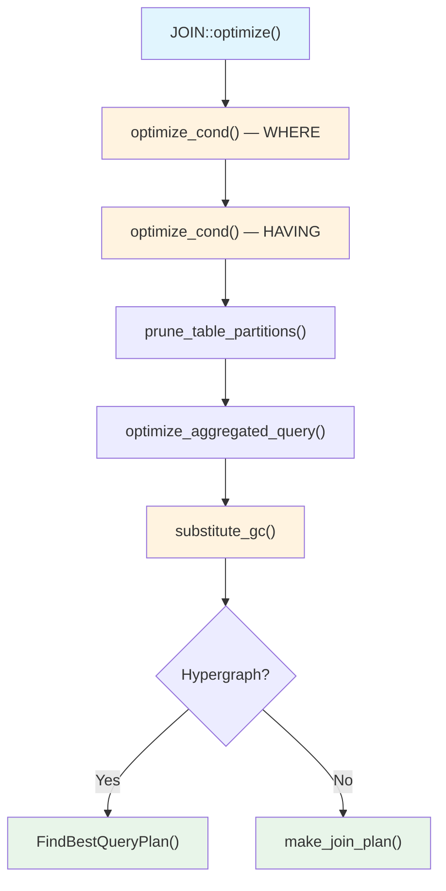
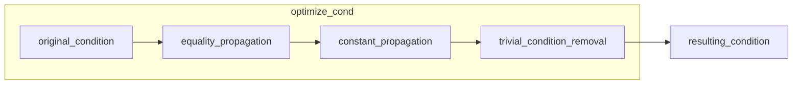

# 쿼리 최적화 -- 논리적 변환

MySQL 옵티마이저는 실제 실행 계획을 세우기 전에, 쿼리를 의미적으로 동등하면서 더 효율적인 형태로 변환하는 **논리적 변환(Logical Transformation)** 단계를 먼저 수행한다. 이 단계는 비용 계산 없이 규칙 기반(Rule-based)으로 동작하며, 후속 비용 기반 최적화의 탐색 공간을 줄이는 역할을 한다.

## 목차
- [1. 핵심 개념 (What)](#1-핵심-개념-what)
- [2. 왜 알아야 하는가 (Why)](#2-왜-알아야-하는가-why)
- [3. 내부 구현 분석 (How)](#3-내부-구현-분석-how)
- [4. 실전 예제](#4-실전-예제)
- [5. 정리](#5-정리)

---

## 1. 핵심 개념 (What)

논리적 변환은 쿼리의 **의미(semantics)를 유지**하면서 실행 효율을 높이는 대수적(algebraic) 변환이다. MySQL의 `JOIN::optimize()` 메서드 진입 직후, 비용 기반 최적화가 시작되기 전에 수행된다.

주요 변환 종류:

| 변환 | 설명 |
|------|------|
| **상수 폴딩 (Constant Folding)** | 컴파일 타임에 결정 가능한 조건을 미리 평가 |
| **등가 전파 (Equality Propagation)** | `a = b AND b = 5` → `a = 5 AND b = 5` |
| **상수 전파 (Constant Propagation)** | field = const 관계를 다른 조건에 전파 |
| **자명 조건 제거 (Trivial Condition Removal)** | 항상 TRUE/FALSE인 조건 제거 |
| **서브쿼리 → 조인 변환** | IN 서브쿼리를 세미조인으로 변환 |
| **Predicate Pushdown** | 조건절을 가능한 한 하위 레벨로 내림 |
| **Generated Column 치환** | WHERE/ORDER BY의 표현식을 가상 컬럼으로 치환하여 인덱스 활용 |

## 2. 왜 알아야 하는가 (Why)

1. **실행 계획 해석**: `EXPLAIN`이나 옵티마이저 트레이스에서 "Impossible WHERE", "Select tables optimized away" 같은 메시지의 의미를 이해할 수 있다.
2. **쿼리 튜닝**: 옵티마이저가 자동으로 수행하는 변환을 알면, 불필요한 수동 최적화를 피할 수 있다.
3. **버그 진단**: 논리적 변환 과정에서 조건이 예상과 다르게 바뀌면 잘못된 실행 계획이 생길 수 있다.
4. **인덱스 설계**: 어떤 변환이 수행되는지 알아야 인덱스가 실제로 활용되는 조건을 정확히 예측할 수 있다.

## 3. 내부 구현 분석 (How)

### 3.1 전체 최적화 흐름에서의 위치



`JOIN::optimize()` (sql/sql_optimizer.cc:344)는 최적화의 메인 진입점이다. 논리적 변환은 주로 `optimize_cond()`와 그 내부 단계들에서 수행된다.

### 3.2 optimize_cond() — 조건 최적화 파이프라인

`optimize_cond()` (sql/sql_optimizer.cc:10450)은 WHERE 조건과 HAVING 조건 각각에 대해 호출되며, 3단계 파이프라인으로 구성된다:

```
┌──────────��──────────────────┐
│  1. equality_propagation    │  build_equal_items()
│     등가 전파                │  — 다중 등가(Multi-equality) 구축
├─────────────────────────────┤
│  2. constant_propagation    │  propagate_cond_constants()
│     상수 전파                │  — field=const 관계를 다른 조건에 전파
├─────────────────────────────┤
│  3. trivial_condition_      │  remove_eq_conds()
│     removal                 │  — 항상 참/거짓인 조건 제거
└─────────────────────────────┘
```

**소스코드 워크스루:**

```cpp
// sql/sql_optimizer.cc:10450
bool optimize_cond(THD *thd, Item **cond, COND_EQUAL **cond_equal,
                   mem_root_deque<Table_ref *> *join_list,
                   Item::cond_result *cond_value) {
  // Step 1: equality_propagation — 다중 등가 술어 구축
  if (join_list) {
    build_equal_items(thd, *cond, cond, nullptr, true,
                      join_list, cond_equal);
  }
  // Step 2: constant_propagation — field = const 전파
  if (*cond) {
    propagate_cond_constants(thd, nullptr, *cond, *cond);
  }
  // Step 3: trivial_condition_removal — 자명 조건 제거
  if (*cond) {
    remove_eq_conds(thd, *cond, cond, cond_value);
  }
}
```

### 3.3 상수 폴딩 (Constant Folding)

`fold_condition()` (sql/sql_const_folding.h:70)은 필드의 타입 범위를 기반으로 비교 조건의 참/거짓을 판별한다.

**동작 원리:**
- `unsigned TINYINT < 0` → 항상 FALSE (타입 범위: 0~255)
- `signed TINYINT < 128` → 항상 TRUE (타입 범위: -128~127)
- `>=` / `<=` 조건에서 상수가 범위 경계에 위치하면 `=`로 단순화

```cpp
// sql/sql_const_folding.h:70
bool fold_condition(THD *thd, Item *cond, Item **retcond,
                    Item::cond_result *cond_value,
                    bool manifest_result = false);
```

### 3.4 등가 전파 (Equality Propagation)

`build_equal_items()` (sql/sql_optimizer.cc:4511)은 등가 관계를 기반으로 **다중 등가(Multi-equality, COND_EQUAL)** 구조를 구축한다.

```
입력: WHERE t1.a = t2.b AND t2.b = t3.c AND t3.c = 10
                         ↓
      Multi-equality: {t1.a, t2.b, t3.c, 10}
                         ↓
출력: WHERE t1.a = 10 AND t2.b = 10 AND t3.c = 10
```

핵심 함수 체인:
- `build_equal_items()` → `build_equal_items_for_cond()` (sql/sql_optimizer.cc:4274) → `check_equality()` (sql/sql_optimizer.cc:4181) → `check_simple_equality()` (sql/sql_optimizer.cc:3867)

### 3.5 상수 전파 (Constant Propagation)

`propagate_cond_constants()` (sql/sql_optimizer.cc:4990)는 `field = const` 관계를 발견하면, 같은 조건 트리 내의 다른 조건에서 해당 field를 const로 치환한다.

```
입력: WHERE t1.a = 5 AND t1.a > t2.b
                   ↓
출력: WHERE t1.a = 5 AND 5 > t2.b
```

### 3.6 서브쿼리 → 세미조인 변환

IN 서브쿼리는 가능한 경우 세미조인으로 변환된다. 이 작업은 name resolution 단계(sql/sql_resolver.cc)에서 시작되며, `optimize_semijoin_nests_for_materialization()` (sql/sql_optimizer.cc:6706)과 `pull_out_semijoin_tables()` (sql/sql_optimizer.cc:6862)에서 마무리된다.

```
-- 변환 전 (Correlated IN subquery)
SELECT * FROM t1 WHERE t1.x IN (SELECT t2.y FROM t2 WHERE t2.z = t1.z);

-- 변환 후 (Semijoin)
SELECT * FROM t1 SEMI JOIN t2 ON t1.x = t2.y AND t2.z = t1.z;
```

Hypergraph 옵티마이저에서는 in2exists 변환도 함께 고려한다. `JOIN::optimize()`에서 두 가지 플랜(in2exists 포함/미포함)을 모두 생성하고 비용을 비교한다 (sql/sql_optimizer.cc:677-687).

### 3.7 Generated Column 치환 (substitute_gc)

`substitute_gc()` (sql/sql_optimizer.cc:1213)는 WHERE, GROUP BY, ORDER BY에 있는 표현식이 functional index(가상 생성 컬럼에 대한 인덱스)와 매칭되면, 해당 표현식을 생성 컬럼 참조로 치환한다.

```
-- 원본
SELECT * FROM t WHERE JSON_EXTRACT(doc, '$.name') = 'Kim';

-- 치환 후 (doc_name은 JSON_EXTRACT(doc, '$.name')의 가상 컬럼)
SELECT * FROM t WHERE doc_name = 'Kim';  -- 인덱스 활용 가능
```

### 3.8 옵티마이저 트레이스로 변환 과정 확인



각 변환 단계의 결과는 옵티마이저 트레이스(sql/opt_trace.h)에 기록되며, `Opt_trace_object`와 `Opt_trace_array`를 사용하여 JSON 형태로 출력된다.

## 4. 실전 예제

### 예제 1: 옵티마이저 트레이스로 논리적 변환 관찰

```sql
-- 옵티마이저 트레이스 활성화
SET optimizer_trace = 'enabled=on';

-- 상수 폴딩 + 등가 전파가 적용되는 쿼리
SELECT * FROM orders o
  JOIN customers c ON o.customer_id = c.id
WHERE c.id = 42 AND o.customer_id > 0;

-- 트레이스 결과 확인
SELECT trace FROM information_schema.optimizer_trace\G
```

예상 트레이스 출력 (condition_processing 부분):

```json
{
  "condition_processing": {
    "condition": "WHERE",
    "original_condition": "(c.id = 42 AND o.customer_id = c.id AND o.customer_id > 0)",
    "steps": [
      {
        "transformation": "equality_propagation",
        "resulting_condition": "(multiple equal(42, o.customer_id, c.id) AND o.customer_id > 0)"
      },
      {
        "transformation": "constant_propagation",
        "resulting_condition": "(multiple equal(42, o.customer_id, c.id) AND 42 > 0)"
      },
      {
        "transformation": "trivial_condition_removal",
        "resulting_condition": "multiple equal(42, o.customer_id, c.id)"
      }
    ]
  }
}
```

`o.customer_id > 0` 조건은 상수 전파 후 `42 > 0`이 되어 항상 TRUE → 자명 조건 제거 단계에서 제거된다.

### 예제 2: 서브쿼리 → 세미조인 변환 확인

```sql
-- IN 서브쿼리
EXPLAIN FORMAT=TREE
SELECT * FROM employees e
WHERE e.dept_id IN (
  SELECT d.id FROM departments d WHERE d.active = 1
);
```

변환 전후 실행 계획 비교:

```
-- 변환 전 (개념적)
-> Filter: e.dept_id IN (SELECT d.id FROM departments d WHERE d.active = 1)
   -> Table scan on e

-- 변환 후 (실제 EXPLAIN 출력)
-> Nested loop semijoin
   -> Table scan on e
   -> Filter: d.active = 1
      -> Single-row index lookup on d using PRIMARY (id = e.dept_id)
```

### 예제 3: 상수 폴딩 — 불가능한 조건 탐지

```sql
-- unsigned 컬럼에 음수 비교
CREATE TABLE metrics (
  id INT UNSIGNED NOT NULL,
  value BIGINT
);

EXPLAIN SELECT * FROM metrics WHERE id < 0;
```

```
+----+...+----------------------------------------------+
| id |...| Extra                                        |
+----+...+----------------------------------------------+
|  1 |...| Impossible WHERE                             |
+----+...+----------------------------------------------+
```

`fold_condition()`이 `UNSIGNED INT < 0`을 타입 범위 분석으로 항상 FALSE로 판별하여 테이블 접근 자체를 생략한다.

## 5. 정리

| 변환 단계 | 핵심 함수 | 소스 위치 | 효과 |
|-----------|----------|----------|------|
| 상수 폴딩 | `fold_condition()` | sql/sql_const_folding.h:70 | 타입 범위 기반 조건 평가 |
| 등가 전파 | `build_equal_items()` | sql/sql_optimizer.cc:4511 | 다중 등가 → 상수 치환 |
| 상수 전파 | `propagate_cond_constants()` | sql/sql_optimizer.cc:4990 | field=const 관계 전파 |
| 자명 조건 제거 | `remove_eq_conds()` | sql/sql_optimizer.cc:10520 | 항상 참/거짓 조건 제거 |
| 서브쿼리 변환 | `pull_out_semijoin_tables()` | sql/sql_optimizer.cc:6862 | IN → Semi-join |
| GC 치환 | `substitute_gc()` | sql/sql_optimizer.cc:1213 | 함수 인덱스 활용 |
| 조건 최적화 진입 | `optimize_cond()` | sql/sql_optimizer.cc:10450 | 3단계 파이프라인 조율 |

핵심 포인트:
- 논리적 변환은 **비용 계산 이전**에 규칙 기반으로 수행된다
- `optimize_cond()`의 3단계 파이프라인(등가 전파 → 상수 전파 → 자명 조건 제거)이 핵심
- 옵티마이저 트레이스(`SET optimizer_trace = 'enabled=on'`)로 각 변환 단계를 JSON으로 관찰 가능
- Hypergraph 옵티마이저에서는 in2exists 변환의 두 가지 경로를 비용 비교하여 선택

---
*참고: MySQL 9.x (trunk) 소스코드 기준*
