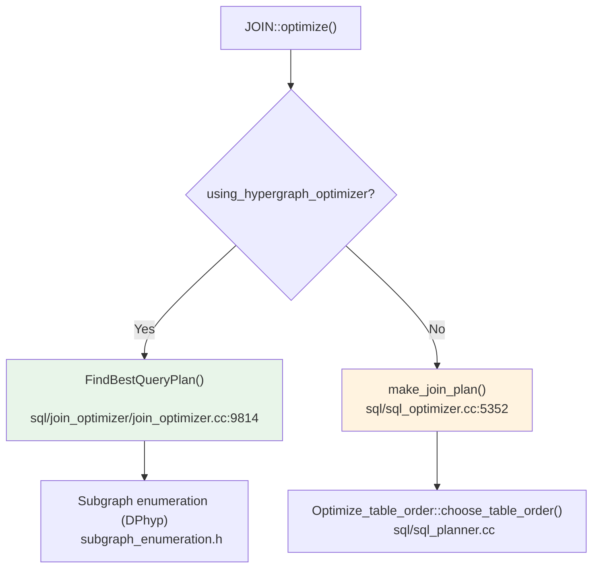
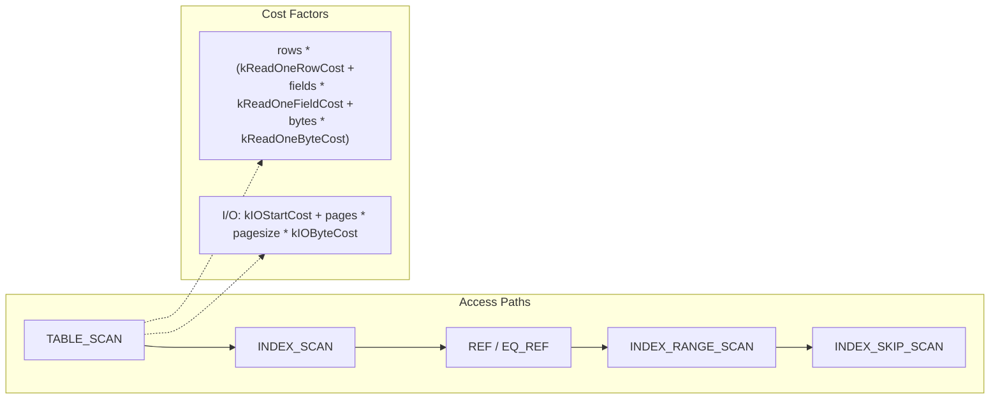
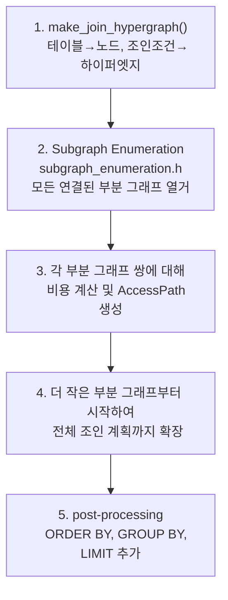

# 쿼리 최적화 -- 비용 기반 계획

MySQL 옵티마이저는 논리적 변환 이후, 가능한 실행 계획들의 **비용(cost)을 추정**하여 가장 저렴한 계획을 선택한다. 이 문서는 비용 모델의 내부 구조, 인덱스 선택 알고리즘, 조인 순서 결정(전통적 Greedy/Prefix 방식과 Hypergraph 옵티마이저), 그리고 접근 경로별 비용 비교를 소스 코드 레벨에서 분석한다.

## 목차
- [1. 핵심 개념 (What)](#1-핵심-개념-what)
- [2. 왜 알아야 하는가 (Why)](#2-왜-알아야-하는가-why)
- [3. 내부 구현 분석 (How)](#3-내부-구현-분석-how)
- [4. 실전 예제](#4-실전-예제)
- [5. 정리](#5-정리)

---

## 1. 핵심 개념 (What)

비용 기반 최적화(CBO, Cost-Based Optimization)는 각 실행 계획 후보에 대해 I/O, CPU 비용을 추정하고, **총 비용이 최소인 계획**을 선택하는 과정이다.

MySQL 9.x에는 두 가지 옵티마이저가 공존한다:

| 옵티마이저 | 조인 순서 탐색 | 비용 모델 | 활성화 |
|-----------|--------------|----------|--------|
| **전통적 옵티마이저** | Greedy prefix search | `Cost_model_server` / `Cost_model_table` | 기본값 |
| **Hypergraph 옵티마이저** | Subgraph enumeration (DPhyp) | `cost_constants.h` 기반 | `SET optimizer_switch='hypergraph_optimizer=on'` |

비용 공식의 핵심 요소:
- **I/O 비용**: 디스크에서 페이지를 읽는 비용 (버퍼 풀 적중률 고려)
- **CPU 비용**: 행 평가, 키 비교, 필터 적용 비용
- **행 수 추정(Cardinality)**: 각 단계의 출력 행 수 예측

## 2. 왜 알아야 하는가 (Why)

1. **실행 계획 이해**: `EXPLAIN`의 `cost` 컬럼이 어떻게 산출되는지 알아야 비정상적 계획을 진단할 수 있다.
2. **인덱스 선택 예측**: 옵티마이저가 왜 특정 인덱스를 선택(또는 무시)하는지 비용 관점에서 이해한다.
3. **통계 정보 관리**: `ANALYZE TABLE`의 효과와 히스토그램의 역할을 비용 모델과 연결하여 이해한다.
4. **비용 상수 튜닝**: `mysql.server_cost`, `mysql.engine_cost` 테이블을 통한 비용 상수 조정의 영향을 예측한다.

## 3. 내부 구현 분석 (How)

### 3.1 두 옵티마이저의 분기점



`JOIN::optimize()` (sql/sql_optimizer.cc:622)에서 `thd->lex->using_hypergraph_optimizer()`를 체크하여 분기한다.

### 3.2 비용 모델 클래스 — 전통적 옵티마이저

**Cost_model_server** (sql/opt_costmodel.h:54)는 테이블 비의존적 비용을 계산한다:

```cpp
// sql/opt_costmodel.h:54
class Cost_model_server {
public:
  enum enum_tmptable_type { MEMORY_TMPTABLE, DISK_TMPTABLE };

  // 행 평가 비용: rows * row_evaluate_cost()
  double row_evaluate_cost(double rows) const;

  // 키 비교 비용: keys * key_compare_cost()
  double key_compare_cost(double keys) const;

  // 임시 테이블 비용
  double tmptable_readwrite_cost(enum_tmptable_type type,
                                  double write_rows, double read_rows) const;
};
```

**Cost_model_table** (sql/opt_costmodel.h에서 파생)은 테이블별 I/O 비용을 계산한다:

```
디스크 순차 읽기 비용 공식:
  DISK_SEEK_BASE_COST + DISK_SEEK_PROP_COST * blocks_to_skip

  여기서:
  DISK_SEEK_BASE_COST = 0.9
  BLOCKS_IN_AVG_SEEK  = 128
  DISK_SEEK_PROP_COST = 0.1 / 128
```

### 3.3 비용 모델 — Hypergraph 옵티마이저

Hypergraph 옵티마이저는 sql/join_optimizer/cost_constants.h에 정의된 마이크로초 기반 상수를 사용한다:

```
비용 단위(Unit Cost):
  1.0 = InnoDB 테이블(정수 컬럼 10개, 100만 행) 풀 스캔 시 행당 평균 비용
  kUnitCostInMicroseconds = 0.434 μs
```

```
┌──────────────────────────────────────────────────────────┐
│                Hypergraph 비용 상수 체계                    │
├───────────────────────────┬──────────────────────────────┤
│ kReadOneRowCost           │ 0.1 / 0.434 ≈ 0.230         │
│ kReadOneFieldCost         │ 0.02 / 0.434 ≈ 0.046        │
│ kReadOneByteCost          │ 0.001 / 0.434 ≈ 0.002       │
│ kApplyOneFilterCost       │ 0.025 / 0.434 ≈ 0.058       │
│ kIndexLookupPageCost      │ 0.5 / 0.434 ≈ 1.152         │
│ kIndexLookupFixedCost     │ 1.0 / 0.434 ≈ 2.304         │
│ kSortOneRowCost           │ 0.15 / 0.434 ≈ 0.346        │
│ kSortComparisonCost       │ 0.014 / 0.434 ≈ 0.032       │
└───────────────────────────┴──────────────────────────────┘
```

**I/O 비용 모델** (sql/join_optimizer/cost_model.h:84):

```
io_cost = kIOStartCost + no_of_bytes * kIOByteCost

kIOStartCost = 937.0  (랜덤 I/O 시작 비용)
kIOByteCost  = 0.0549  (바이트당 추가 비용)
kBlockFillFactor = 0.75  (InnoDB 블록 사용률)
```

이 모델은 InnoDB DYNAMIC 행 포맷에 맞춰 보정되었으며, 버퍼 풀에 캐시된 페이지의 I/O 비용은 0으로 처리한다.

### 3.4 접근 경로(Access Path)별 비용 비교



| 접근 경로 | AccessPath::Type | 비용 특성 |
|-----------|-----------------|----------|
| Full Table Scan | `TABLE_SCAN` | `rows * row_read_cost + io_cost(all_pages)` |
| Index Scan | `INDEX_SCAN` | 커버링이면 I/O 감소, 비커버링이면 클러스터 룩업 추가 |
| Ref Access | `REF` | `matching_rows * row_read_cost + index_lookup_cost` |
| Eq Ref | `EQ_REF` | 유니크 인덱스, 최대 1행 → 가장 저렴한 조인 |
| Range Scan | `INDEX_RANGE_SCAN` | `range_rows * row_read_cost + io_cost(range_pages)` |
| Index Skip Scan | `INDEX_SKIP_SCAN` | `EstimateSkipScanCost()` — 복합 인덱스 선두 컬럼 건너뛰기 |

### 3.5 전통적 옵티마이저 — Greedy 조인 순서 탐색

`Optimize_table_order::choose_table_order()` (sql/sql_planner.cc)에서 Greedy 탐색과 제한된 깊이의 Exhaustive 탐색을 결합한다.

```
알고리즘 개요:
1. 각 테이블에 대해 최적 접근 방법 결정
2. Greedy search: 현재 부분 계획에 가장 저렴한 테이블 추가
3. search_depth 만큼 앞을 내다보며 평가 (기본 62)
4. POSITION 배열에 최적 계획 저장
```

핵심 데이터 구조:
- `POSITION` — 조인 순서의 각 위치에서의 접근 방법과 비용 정보
- `JOIN::best_positions` — 최적 계획 (sql/sql_optimizer.h:310)
- `JOIN::positions` — 현재 평가 중인 부분 계획 (sql/sql_optimizer.h:315)

### 3.6 Hypergraph 옵티마이저 — DPhyp 알고리즘

`FindBestQueryPlan()` (sql/join_optimizer/join_optimizer.cc:9814)이 진입점이다:

```cpp
// sql/join_optimizer/join_optimizer.cc:9814
AccessPath *FindBestQueryPlan(THD *thd, Query_block *query_block) {
  // 최대 3회 재시도 (subgraph pair 제한 조정)
  for (int i = 0; i < max_attempts; ++i) {
    bool retry = false;
    AccessPath *root_path = FindBestQueryPlanInner(
        thd, query_block, &retry, &next_retry_subgraph_pairs);
    if (!retry) return root_path;
  }
}
```

**DPhyp (Dynamic Programming on Hypergraph)** 알고리즘의 단계:



Hypergraph (sql/join_optimizer/hypergraph.h)의 핵심 구조:

```cpp
namespace hypergraph {
struct Node {
  std::vector<unsigned> complex_edges, simple_edges;
  NodeMap simple_neighborhood = 0;
};

struct Hyperedge {
  NodeMap left;   // 왼쪽 노드 집합
  NodeMap right;  // 오른쪽 노드 집합
};
}  // namespace hypergraph
```

### 3.7 비용 추정 함수들

행 수 추정과 필터 비용:

```cpp
// sql/join_optimizer/cost_model.h:125
FilterCost EstimateFilterCost(THD *thd, double num_rows,
                              Item *condition,
                              const Query_block *outer_query_block);

// sql/join_optimizer/cost_model.h:154
void EstimateSortCost(THD *thd, AccessPath *path,
                      double distinct_rows = kUnknownRowCount);

// sql/join_optimizer/cost_model.h:157
void EstimateMaterializeCost(THD *thd, AccessPath *path);

// sql/join_optimizer/cost_model.h:178
void EstimateAggregateCost(THD *thd, AccessPath *path,
                           const Query_block *query_block);
```

필터 비용은 서브쿼리의 materialization 여부에 따라 두 가지로 분류된다:

```cpp
// sql/join_optimizer/cost_model.h:94
struct FilterCost {
  double cost_if_not_materialized;    // 서브쿼리 미물화 비용
  double init_cost_if_not_materialized;
  double cost_if_materialized;        // 서브쿼리 물화 후 비용
  double cost_to_materialize;         // 물화 비용 자체
};
```

## 4. 실전 예제

### 예제 1: 접근 경로별 비용 비교

```sql
-- 테스트 테이블 생성
CREATE TABLE orders (
  id BIGINT PRIMARY KEY,
  customer_id INT NOT NULL,
  order_date DATE NOT NULL,
  amount DECIMAL(10,2),
  INDEX idx_customer (customer_id),
  INDEX idx_date (order_date)
) ENGINE=InnoDB;

-- ANALYZE로 통계 수집
ANALYZE TABLE orders;

-- 인덱스 힌트 없이 비용 비교
EXPLAIN FORMAT=JSON
SELECT * FROM orders WHERE customer_id = 100 AND order_date > '2025-01-01';
```

JSON 출력의 비용 정보:

```json
{
  "query_cost": "1.21",
  "access_type": "ref",
  "key": "idx_customer",
  "rows_examined_per_scan": 5,
  "rows_produced_per_join": 2,
  "filtered": "33.33",
  "cost_info": {
    "read_cost": "1.01",
    "eval_cost": "0.20"
  }
}
```

### 예제 2: 옵티마이저 트레이스로 조인 순서 결정 과정 확인

```sql
SET optimizer_trace = 'enabled=on';

SELECT o.*, c.name
FROM orders o
  JOIN customers c ON o.customer_id = c.id
  JOIN products p ON o.product_id = p.id
WHERE c.region = 'APAC'
  AND p.category = 'Electronics';

SELECT trace->'$.steps[*].join_optimization'
FROM information_schema.optimizer_trace\G
```

트레이스에서 확인할 수 있는 항목:
- `considered_execution_plans` — 평가된 조인 순서 후보들
- `chosen_access_method` — 각 테이블의 선택된 접근 방법
- `rows_for_plan` / `cost_for_plan` — 최종 선택 기준

### 예제 3: 비용 상수 조회 및 조정

```sql
-- 현재 서버 비용 상수 확인
SELECT * FROM mysql.server_cost;

-- 현재 엔진 비용 상수 확인
SELECT * FROM mysql.engine_cost;

-- 디스크 I/O 비용 조정 (SSD 환경)
UPDATE mysql.engine_cost
SET cost_value = 0.25
WHERE cost_name = 'io_block_read_cost'
  AND engine_name = 'InnoDB';

-- 메모리 I/O 비용 조정
UPDATE mysql.engine_cost
SET cost_value = 0.0625
WHERE cost_name = 'memory_block_read_cost'
  AND engine_name = 'InnoDB';

-- 변경 적용
FLUSH OPTIMIZER_COSTS;
```

## 5. 정리

| 구성 요소 | 전통적 옵티마이저 | Hypergraph 옵티마이저 |
|-----------|-----------------|---------------------|
| 비용 모델 클래스 | `Cost_model_server` / `Cost_model_table` | `cost_constants.h` 상수 |
| 비용 단위 | 추상 단위 (I/O block 기준) | 마이크로초 기반 (kUnitCostInMicroseconds = 0.434) |
| I/O 비용 | `DISK_SEEK_BASE_COST` 기반 | `kIOStartCost` + `kIOByteCost * bytes` |
| 조인 탐색 | Greedy + prefix search | DPhyp subgraph enumeration |
| 진입 함수 | `make_join_plan()` | `FindBestQueryPlan()` |
| 소스 위치 | sql/sql_planner.cc | sql/join_optimizer/join_optimizer.cc |
| 접근 경로 | `POSITION` 배열 | `AccessPath` 트리 |

핵심 포인트:
- Hypergraph 옵티마이저는 DPhyp 알고리즘으로 **모든 합법적 조인 순서**를 열거하며, 전통적 방식보다 큰 조인에서도 최적해를 찾을 확률이 높다
- 비용 추정의 정확도는 **통계 정보(stats.records, 히스토그램)** 품질에 크게 의존한다
- Hypergraph의 I/O 비용 모델은 InnoDB 버퍼 풀 크기 대비 테이블 크기를 고려하여 캐시 적중률을 반영한다
- `FLUSH OPTIMIZER_COSTS`로 비용 상수를 런타임에 재로드할 수 있다

---
*참고: MySQL 9.x (trunk) 소스코드 기준*
