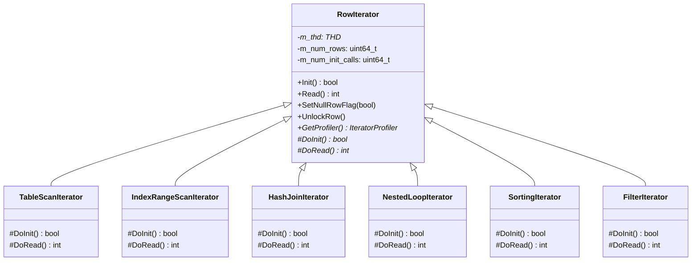
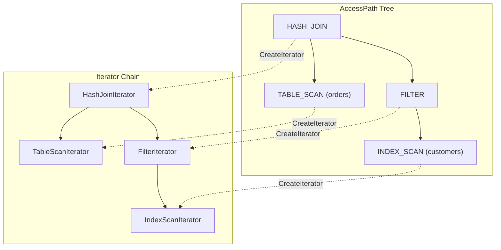

# 쿼리 실행 엔진과 Iterator 모델

MySQL의 쿼리 실행 엔진은 옵티마이저가 생성한 `AccessPath` 트리를 `RowIterator` 체인으로 변환하여 행 단위로 결과를 생산한다. 이 문서는 Iterator 실행 모델의 인터페이스, AccessPath에서 Iterator로의 변환 과정, 그리고 주요 Iterator 타입의 내부 동작을 소스 코드 레벨에서 분석한다.

## 목차
- [1. 핵심 개념 (What)](#1-핵심-개념-what)
- [2. 왜 알아야 하는가 (Why)](#2-왜-알아야-하는가-why)
- [3. 내부 구현 분석 (How)](#3-내부-구현-분석-how)
- [4. 실전 예제](#4-실전-예제)
- [5. 정리](#5-정리)

---

## 1. 핵심 개념 (What)

MySQL 8.0부터 도입된 **Iterator 실행 모델**은 Volcano/Pull 모델 기반이다. 각 연산자(테이블 스캔, 필터, 조인, 정렬 등)가 `RowIterator` 인터페이스를 구현하며, 상위 연산자가 하위 연산자에게 행을 "당겨오는(pull)" 방식으로 동작한다.

실행의 핵심 흐름:

```
AccessPath (계획) → RowIterator (실행) → 결과 행
```

| 구성 요소 | 역할 | 소스 위치 |
|-----------|------|----------|
| `AccessPath` | 실행 계획의 트리 구조 | sql/join_optimizer/access_path.h |
| `RowIterator` | 행 생산 인터페이스 (Init/Read) | sql/iterators/row_iterator.h |
| `CreateIteratorFromAccessPath()` | 계획 → 실행 변환 | sql/sql_executor.cc |

## 2. 왜 알아야 하는가 (Why)

1. **EXPLAIN FORMAT=TREE 해석**: 출력이 Iterator 트리를 직접 반영하므로, Iterator 모델을 알아야 실행 계획을 정확히 읽을 수 있다.
2. **EXPLAIN ANALYZE 해석**: 각 Iterator의 실제 실행 시간, 행 수, 루프 횟수를 이해한다.
3. **성능 병목 진단**: 어떤 Iterator에서 시간이 오래 걸리는지 식별하여 쿼리 튜닝 방향을 잡을 수 있다.
4. **서버 내부 디버깅**: 쿼리 실행 중 문제가 발생했을 때 Iterator 체인을 따라가며 원인을 추적할 수 있다.

## 3. 내부 구현 분석 (How)

### 3.1 RowIterator 인터페이스



**RowIterator** (sql/iterators/row_iterator.h:82)의 핵심 메서드:

```cpp
// sql/iterators/row_iterator.h:82
class RowIterator {
public:
  explicit RowIterator(THD *thd) : m_thd(thd) {}

  // 초기화 또는 재초기화. 반복 호출 시 리와인드.
  bool Init() {
    ++m_num_init_calls;
    return DoInit();
  }

  // 행 하나 읽기. 0=성공, -1=EOF, 1=에러
  // 결과 데이터는 table->records[0]에 저장
  int Read() {
    const int error = DoRead();
    if (error == 0) ++m_num_rows;
    else if (error == -1) ++m_num_full_reads;
    return error;
  }

  // NULL-complemented 행 표시 (외부 조인용)
  virtual void SetNullRowFlag(bool is_null_row) = 0;

protected:
  virtual bool DoInit() = 0;
  virtual int DoRead() = 0;
};
```

사용 패턴:

```cpp
unique_ptr<RowIterator> iterator(new ...);
if (iterator->Init()) return true;   // 에러
while (iterator->Read() == 0) {
  // table->record[0]에서 행 데이터 접근
}
// Read()이 -1을 반환하면 EOF
```

### 3.2 AccessPath → Iterator 변환

`CreateIteratorFromAccessPath()` (sql/sql_executor.cc:4972 호출부)는 `AccessPath` 트리를 재귀적으로 순회하면서 대응하는 `RowIterator`를 생성한다.



AccessPath의 타입 열거 (sql/join_optimizer/access_path.h:239):

```cpp
struct AccessPath {
  enum Type : uint8_t {
    // 기본 접근 경로 (리프 노드)
    TABLE_SCAN, SAMPLE_SCAN, INDEX_SCAN, INDEX_DISTANCE_SCAN,
    REF, REF_OR_NULL, EQ_REF, PUSHED_JOIN_REF,
    FULL_TEXT_SEARCH, CONST_TABLE, MRR, FOLLOW_TAIL,
    INDEX_RANGE_SCAN, INDEX_MERGE, ROWID_INTERSECTION,
    ROWID_UNION, INDEX_SKIP_SCAN, GROUP_INDEX_SKIP_SCAN,
    DYNAMIC_INDEX_RANGE_SCAN,

    // 테이블 비의존
    TABLE_VALUE_CONSTRUCTOR, FAKE_SINGLE_ROW,
    ZERO_ROWS, ZERO_ROWS_AGGREGATED,
    MATERIALIZED_TABLE_FUNCTION, UNQUALIFIED_COUNT,

    // 조인
    NESTED_LOOP_JOIN,
    NESTED_LOOP_SEMIJOIN_WITH_DUPLICATE_REMOVAL,
    BKA_JOIN, HASH_JOIN,

    // 복합 연산
    FILTER, SORT, AGGREGATE, TEMPTABLE_AGGREGATE,
    LIMIT_OFFSET, STREAM, MATERIALIZE,
    MATERIALIZE_INFORMATION_SCHEMA_TABLE, APPEND,
    WINDOW, WEEDOUT, REMOVE_DUPLICATES,
    REMOVE_DUPLICATES_ON_INDEX, ALTERNATIVE,
    CACHE_INVALIDATOR,

    // 테이블 수정
    DELETE_ROWS, UPDATE_ROWS,
  } type;

  double cost() const;      // 총 비용
  double init_cost() const;  // 초기화 비용
  double num_output_rows() const;
};
```

### 3.3 주요 Iterator 타입

#### 3.3.1 TableScanIterator (basic_row_iterators.h)

```
동작: handler::rnd_init(true) → handler::rnd_next() 반복 → handler::rnd_end()
비용: 전체 테이블 행 수에 비례
```

#### 3.3.2 IndexRangeScanIterator (ref_row_iterators.h)

```
동작: Range optimizer가 결정한 범위를 기반으로
      handler::index_init() → handler::read_range_first() →
      handler::read_range_next() 반복
비용: 범위 내 행 수에 비례
```

#### 3.3.3 HashJoinIterator (hash_join_iterator.h)

```
┌─────────────────────────────────────────┐
│           HashJoinIterator              │
│                                         │
│  Build Phase:                          │
│    inner->Init()                       │
│    while inner->Read() == 0:           │
│      hash_table.insert(join_key, row)  │
│                                         │
│  Probe Phase:                          │
│    outer->Init()                       │
│    while outer->Read() == 0:           │
│      for match in hash_table.find(key):│
│        if join_cond(match): emit row   │
│                                         │
│  Spill to Disk (메모리 초과 시):         │
│    ChunkPair로 분할하여 디스크 기록      │
│    청크 단위로 재처리                    │
└─────────────────────────────────────────┘
```

메모리 초과 시 Grace Hash Join 방식으로 디스크 기반 처리(ChunkPair 사용):

```cpp
// sql/iterators/hash_join_iterator.h
struct ChunkPair {
  HashJoinChunk probe_chunk;
  HashJoinChunk build_chunk;
};
```

#### 3.3.4 NestedLoopIterator (composite_iterators.h)

```
outer->Init()
while outer->Read() == 0:
    inner->Init()            // 매번 inner 리와인드
    while inner->Read() == 0:
        emit joined row

// OUTER JOIN의 경우: inner가 EOF이면 NULL-complemented 행 생성
```

NestedLoopIterator는 `SetNullRowFlag()`를 사용하여 LEFT/RIGHT JOIN의 NULL 보완 행을 처리한다.

#### 3.3.5 SortingIterator (sorting_iterator.h)

```
Init():
  source->Init()
  while source->Read() == 0:
    sort_buffer.add(row)
  filesort() — 메모리/디스크 정렬 수행

Read():
  sort_buffer에서 다음 행 반환
```

Materialization iterator — 결과를 임시 테이블에 물화한 후 읽는다.

#### 3.3.6 FilterIterator (composite_iterators.h)

```
Read():
  loop:
    if source->Read() != 0: return EOF
    if condition->val_bool(): return row  // 조건 통과
    // 조건 불통과 → 다음 행으로 계속
```

### 3.4 Iterator 실행 루프

`JOIN::exec()` (sql/sql_executor.cc)에서 실행이 시작된다:

```
┌─────────────────────────────────────┐
│         JOIN::exec()                │
│                                     │
│  1. root_iterator->Init()           │
│  2. while root_iterator->Read()==0: │
│       query_result->send_data()     │
│  3. query_result->send_eof()        │
└─────────────────────────────────────┘
```

### 3.5 Record Buffer 최적화

sql/sql_executor.cc에서 정의된 레코드 버퍼 상수:

```cpp
static constexpr size_t MIN_RECORD_BUFFER_SIZE = 4 * 1024;    // 4KB
static constexpr size_t MAX_RECORD_BUFFER_SIZE = 128 * 1024;  // 128KB
static constexpr double RECORD_BUFFER_FRACTION = 0.1f;
```

스토리지 엔진의 multi-row read를 활용하기 위해, 추정 결과 행 수의 10%를 수용할 수 있는 버퍼를 할당한다. 고동시성 환경에서 버퍼가 너무 크면 오히려 성능이 저하될 수 있어 상한(128KB)을 둔다.

### 3.6 EXPLAIN ANALYZE와 Iterator Profiling

`IteratorProfiler` (sql/iterators/row_iterator.h:41) 인터페이스:

```cpp
class IteratorProfiler {
public:
  virtual double GetFirstRowMs() const = 0;   // 첫 행까지 시간 (ms)
  virtual double GetLastRowMs() const = 0;    // 마지막 행까지 시간 (ms)
  virtual uint64_t GetNumInitCalls() const = 0;  // Init() 호출 횟수
  virtual uint64_t GetNumRows() const = 0;    // 반환된 총 행 수
};
```

`EXPLAIN ANALYZE`는 실제 실행 후 각 Iterator의 profiling 데이터를 수집하여 출력한다.

## 4. 실전 예제

### 예제 1: EXPLAIN FORMAT=TREE로 Iterator 체인 확인

```sql
EXPLAIN FORMAT=TREE
SELECT c.name, SUM(o.amount)
FROM customers c
  JOIN orders o ON c.id = o.customer_id
WHERE c.region = 'APAC'
GROUP BY c.name
ORDER BY SUM(o.amount) DESC
LIMIT 10;
```

예상 출력:

```
-> Limit: 10 row(s)
   -> Sort: sum(o.amount) DESC
      -> Table scan on <temporary>
         -> Aggregate using temporary table
            -> Nested loop inner join
               -> Filter: (c.region = 'APAC')
                  -> Table scan on c
               -> Index lookup on o using idx_customer (customer_id = c.id)
```

각 줄이 하나의 `RowIterator`에 대응하며, 들여쓰기가 깊을수록 하위(소스) Iterator이다.

### 예제 2: EXPLAIN ANALYZE로 실제 실행 통계 확인

```sql
EXPLAIN ANALYZE
SELECT * FROM orders
WHERE customer_id = 42
  AND order_date BETWEEN '2025-01-01' AND '2025-12-31';
```

예상 출력:

```
-> Filter: (orders.order_date between '2025-01-01' and '2025-12-31')
   (cost=3.51 rows=5)
   (actual time=0.082..0.095 rows=3 loops=1)
   -> Index lookup on orders using idx_customer (customer_id=42)
      (cost=3.51 rows=15)
      (actual time=0.071..0.085 rows=15 loops=1)
```

해석:
- `cost=3.51 rows=15` — 옵티마이저의 **추정** 비용과 행 수
- `actual time=0.071..0.085 rows=15 loops=1` — **실제** 첫 행 시간, 마지막 행 시간, 행 수, 루프 수
- 추정 행(15)과 실제 행(15)이 일치하면 통계가 정확한 것

## 5. 정리

| Iterator | 소스 파일 | AccessPath 타입 | 핵심 동작 |
|----------|----------|----------------|----------|
| TableScanIterator | basic_row_iterators.h | `TABLE_SCAN` | `rnd_init()` → `rnd_next()` 반복 |
| IndexScanIterator | basic_row_iterators.h | `INDEX_SCAN` | 인덱스 순차 탐색 |
| IndexRangeScanIterator | ref_row_iterators.h | `INDEX_RANGE_SCAN` | 범위 기반 인덱스 탐색 |
| RefIterator | ref_row_iterators.h | `REF` | 인덱스 키 룩업 |
| HashJoinIterator | hash_join_iterator.h | `HASH_JOIN` | Build → Probe, 메모리 초과 시 spill |
| NestedLoopIterator | composite_iterators.h | `NESTED_LOOP_JOIN` | 중첩 루프, 외부조인 NULL 보완 |
| SortingIterator | sorting_iterator.h | `SORT` | filesort() 기반 정렬 |
| FilterIterator | composite_iterators.h | `FILTER` | 조건 평가, 불통과 행 건너뛰기 |
| AggregateIterator | composite_iterators.h | `AGGREGATE` | 그룹별 집계 함수 평가 |
| LimitOffsetIterator | composite_iterators.h | `LIMIT_OFFSET` | 행 수 제한 |

핵심 포인트:
- Iterator 모델은 **Pull 기반** — 상위 Iterator가 `Read()`를 호출하여 하위로부터 행을 당겨온다
- `AccessPath`는 **계획(what)**, `RowIterator`는 **실행(how)** 을 담당한다
- `EXPLAIN FORMAT=TREE`가 Iterator 트리를 직접 반영하므로 가장 정확한 실행 계획 표현이다
- `EXPLAIN ANALYZE`는 각 Iterator의 실제 시간/행 수를 보여주어 추정 vs 실제 차이를 진단할 수 있다

---
*참고: MySQL 9.x (trunk) 소스코드 기준*
