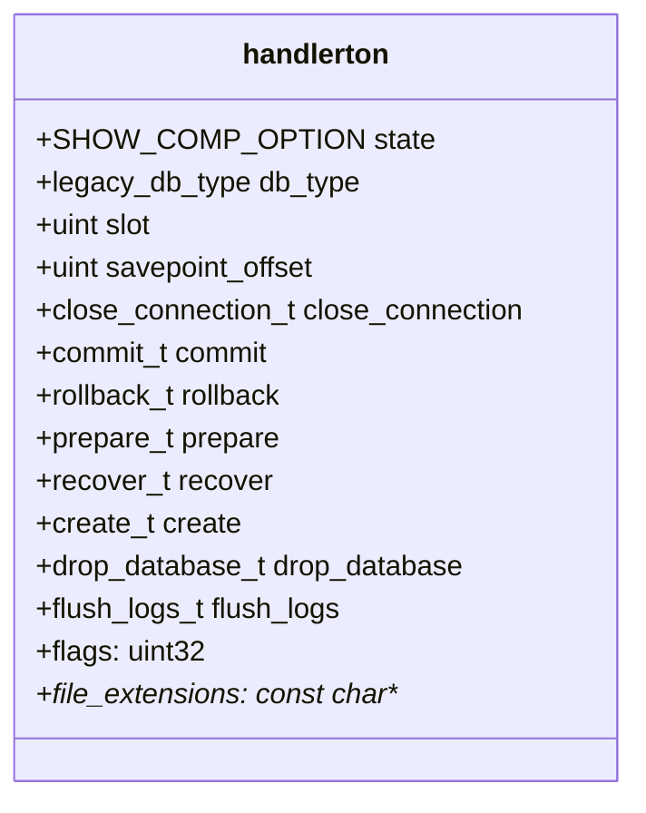
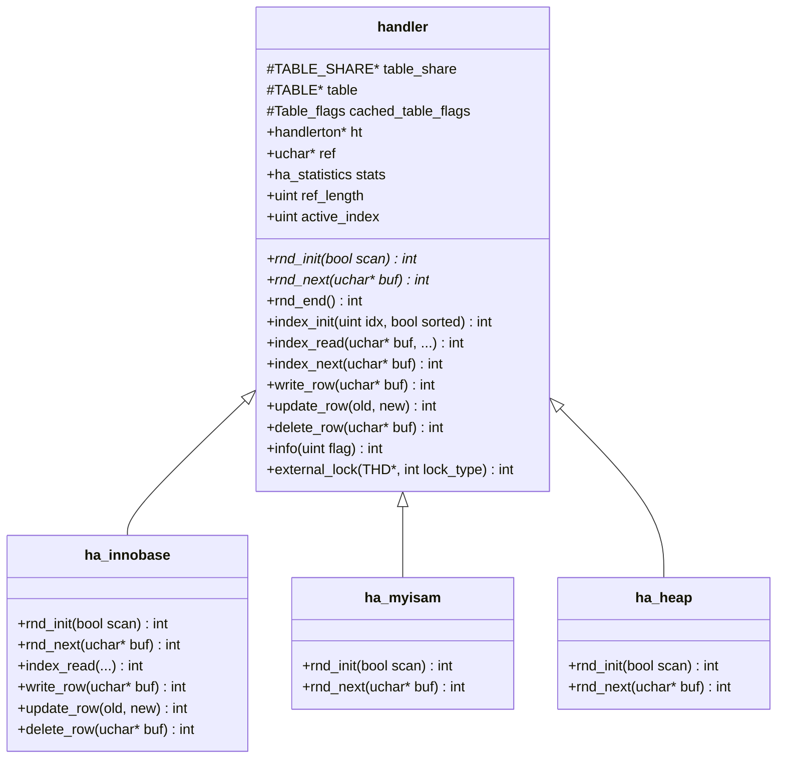

# Storage Engine Interface

MySQL 서버는 다양한 스토리지 엔진을 플러그인으로 지원하기 위해 **handler 추상 클래스**와 **handlerton 구조체**로 이루어진 표준 인터페이스를 제공한다. 이 문서는 handler.h(8,000줄 이상)의 핵심 가상 함수, 엔진 플러그인 등록 구조, DML/DDL 호출 흐름을 소스 코드 레벨에서 분석한다.

## 목차
- [1. 핵심 개념 (What)](#1-핵심-개념-what)
- [2. 왜 알아야 하는가 (Why)](#2-왜-알아야-하는가-why)
- [3. 내부 구현 분석 (How)](#3-내부-구현-분석-how)
- [4. 실전 예제](#4-실전-예제)
- [5. 정리](#5-정리)

---

## 1. 핵심 개념 (What)

MySQL의 스토리지 엔진 아키텍처는 **서버 레이어**와 **엔진 레이어**를 분리한다. 서버 레이어(파서, 옵티마이저, 실행기)는 데이터를 어떻게 저장/검색하는지 모르고, handler 인터페이스를 통해 스토리지 엔진에 위임한다.

```
┌─────────────────────────────────────────┐
│              MySQL Server Layer         │
│  Parser → Optimizer → Executor          │
│                  │                       │
│          handler (추상 클래스)            │
│     ┌────────────┼────────────┐          │
│     ▼            ▼            ▼          │
│  InnoDB       MyISAM       Memory  ...  │
│  (ha_innobase) (ha_myisam) (ha_heap)    │
└─────────────────────────────────────────┘
```

핵심 구성 요소:

| 구성 요소 | 역할 | 소스 위치 |
|-----------|------|----------|
| `handlerton` | 엔진 레벨 콜백(생성, 커밋, 복구 등) | sql/handler.h:2856 |
| `handler` | 테이블 레벨 연산(읽기, 쓰기, 인덱스 등) | sql/handler.h:4754 |
| `ha_innobase` | InnoDB의 handler 구현체 | storage/innobase/handler/ha_innodb.cc |

## 2. 왜 알아야 하는가 (Why)

1. **엔진 선택**: 각 엔진이 handler 인터페이스의 어떤 부분을 지원하는지 알아야 적절한 엔진을 선택할 수 있다.
2. **성능 분석**: `rnd_next()`, `index_read()` 같은 handler 호출이 성능 프로파일링에서 직접 노출된다.
3. **플러그인 개발**: 커스텀 스토리지 엔진을 개발하려면 handler 인터페이스를 구현해야 한다.
4. **InnoDB 이해**: InnoDB의 동작을 이해하려면 `ha_innobase` 클래스가 handler의 가상 함수를 어떻게 구현하는지 알아야 한다.

## 3. 내부 구현 분석 (How)

### 3.1 handlerton — 엔진 플러그인 구조체

`handlerton` (sql/handler.h:2856)은 스토리지 엔진 **자체**의 속성과 엔진 레벨 콜백을 담는 구조체다. 각 엔진은 서버 시작 시 하나의 handlerton 인스턴스를 등록한다.



주요 핵심 콜백:

```cpp
// sql/handler.h:2856
struct handlerton {
  SHOW_COMP_OPTION state;          // 엔진 가용성 (YES/NO/DISABLED)
  enum legacy_db_type db_type;     // 내부 엔진 ID
  uint slot;                       // thd->ha_data[slot]

  // --- 엔진 레벨 콜백 ---
  close_connection_t close_connection;  // 연결 종료
  commit_t commit;                     // 트랜잭션 커밋
  rollback_t rollback;                 // 트랜잭션 롤백
  prepare_t prepare;                   // 2PC prepare
  recover_t recover;                   // 크래시 복구
  create_t create;                     // handler 인스턴스 생성 팩토리
  drop_database_t drop_database;       // 데이터베이스 삭제
  flush_logs_t flush_logs;             // 로그 플러시
  start_consistent_snapshot_t start_consistent_snapshot;

  // 비용 모델 상수 제공
  get_cost_constants_t get_cost_constants;

  const char **file_extensions;    // 엔진이 사용하는 파일 확장자
  uint32 flags;                    // 엔진 글로벌 플래그
};
```

`create` 콜백은 **팩토리 메서드** 역할을 한다. 서버가 테이블을 열 때마다 `handlerton::create()`를 호출하여 해당 엔진의 `handler` 객체를 생성한다.

### 3.2 handler — 테이블 레벨 추상 클래스

`handler` (sql/handler.h:4754)는 ~8,000줄 헤더에 정의된 대규모 추상 클래스로, 테이블 하나에 대한 모든 데이터 접근 연산을 추상화한다.



### 3.3 핵심 가상 함수 — 데이터 읽기

#### Full Table Scan

```cpp
// sql/handler.h:6958 — 스캔 초기화
virtual int rnd_init(bool scan) = 0;
//   scan=true: 순차 스캔, scan=false: rnd_pos()용

// sql/handler.h:5972 — 다음 행 읽기
virtual int rnd_next(uchar *buf) = 0;
//   buf: 행 데이터가 저장될 버퍼 (table->record[0])
//   반환: 0=성공, HA_ERR_END_OF_FILE=EOF

// sql/handler.h:6959 — 스캔 종료
virtual int rnd_end() { return 0; }
```

호출 순서:

```
rnd_init(true) → rnd_next() → rnd_next() → ... → HA_ERR_END_OF_FILE → rnd_end()
```

#### Index Scan / Lookup

```cpp
// sql/handler.h:6943 — 인덱스 초기화
virtual int index_init(uint idx, bool sorted) {
  active_index = idx;
  return 0;
}

// sql/handler.h:7157 — 인덱스 키로 첫 행 찾기
virtual int index_read(uchar *buf, const uchar *key,
                       uint key_len, enum ha_rkey_function find_flag);

// sql/handler.h:5896 — key_part_map 기반 읽기
virtual int index_read_map(uchar *buf, const uchar *key,
                           key_part_map keypart_map,
                           enum ha_rkey_function find_flag);

// sql/handler.h:5917 — 다음 행 읽기 (인덱스 순서)
virtual int index_next(uchar *buf) { return HA_ERR_WRONG_COMMAND; }

// sql/handler.h:5929 — 같은 키의 다음 행 읽기
virtual int index_next_same(uchar *buf, const uchar *key, uint keylen);
```

#### InnoDB 구현 예시

```cpp
// storage/innobase/handler/ha_innodb.cc

// 풀 테이블 스캔 초기화 (line 11083)
int ha_innobase::rnd_init(bool scan) {
  // InnoDB 커서 위치 초기화
  // 프리패치 모드 설정
}

// 다음 행 읽기 (line 11110)
int ha_innobase::rnd_next(uchar *buf) {
  // B-tree 리프 페이지를 순차적으로 탐색
  // buf에 MySQL 형식으로 행 데이터 복사
}

// 인덱스 키 룩업 (line 10461)
int ha_innobase::index_read(uchar *buf, const uchar *key,
                            uint key_len, ha_rkey_function find_flag) {
  // B-tree를 루트→리프로 탐색하여 키 매칭 행 찾기
}
```

### 3.4 핵심 가상 함수 — 데이터 변경

```cpp
// sql/handler.h:6981 — 행 삽입
virtual int write_row(uchar *buf) {
  return HA_ERR_WRONG_COMMAND;
}

// sql/handler.h:6993 — 행 갱신
virtual int update_row(const uchar *old_data, uchar *new_data) {
  return HA_ERR_WRONG_COMMAND;
}

// sql/handler.h:6998 — 행 삭제
virtual int delete_row(const uchar *buf) {
  return HA_ERR_WRONG_COMMAND;
}
```

DML 호출 흐름:

```
┌────────────────────────────────────────────────┐
│                 INSERT 실행 흐름                 │
│                                                 │
│  SQL Layer:                                    │
│    Sql_cmd_insert::execute()                   │
│      → write_record()                          │
│        → handler::ha_write_row()               │
│          → [lock/validation/trigger 처리]       │
│          → handler::write_row()    ← 가상 함수  │
│                                                 │
│  InnoDB:                                       │
│    ha_innobase::write_row()                    │
│      → row_insert_for_mysql()                  │
│        → btr_cur_optimistic_insert()           │
│          또는 btr_cur_pessimistic_insert()      │
└────────────────────────────────────────────────┘
```

```
┌────────────────────────────────────────────────┐
│             UPDATE/DELETE 실행 흐름               │
│                                                 │
│  SQL Layer:                                    │
│    1. 대상 행 위치 지정 (index_read/rnd_next)   │
│    2. handler::ha_update_row(old, new)          │
│       또는 handler::ha_delete_row(buf)          │
│    3. 내부적으로 write_row()/delete_row() 호출  │
│                                                 │
│  InnoDB:                                       │
│    ha_innobase::update_row()   (line 10041)    │
│    ha_innobase::delete_row()   (line 10199)    │
└────────────────────────────────────────────────┘
```

### 3.5 handler의 상태 관리

```cpp
// sql/handler.h:4841
enum { NONE = 0, INDEX, RND, SAMPLING } inited;
```

- `NONE`: 초기 상태
- `INDEX`: `index_init()` 호출됨
- `RND`: `rnd_init()` 호출됨
- `SAMPLING`: 테이블 샘플링 모드

`external_lock()`은 문 시작/종료 시 호출되어 엔진에 잠금 상태를 알린다:

```
문 시작: handler::ha_external_lock(thd, F_RDLCK/F_WRLCK)
문 종료: handler::ha_external_lock(thd, F_UNLCK)
```

### 3.6 내장 스토리지 엔진

MySQL 9.x 소스에 포함된 스토리지 엔진 디렉토리:

| 디렉토리 | 엔진 | 주요 용도 |
|----------|------|----------|
| `storage/innobase/` | **InnoDB** | 기본 범용 트랜잭션 엔진 |
| `storage/myisam/` | MyISAM | 레거시, 비트랜잭션 |
| `storage/heap/` | MEMORY (HEAP) | 인메모리 임시 테이블 |
| `storage/temptable/` | TempTable | 내부 임시 테이블 (8.0+) |
| `storage/csv/` | CSV | CSV 파일 직접 접근 |
| `storage/archive/` | ARCHIVE | 압축 저장, INSERT/SELECT만 |
| `storage/blackhole/` | BLACKHOLE | 데이터 버림, 복제 필터용 |
| `storage/federated/` | FEDERATED | 원격 MySQL 테이블 접근 |
| `storage/ndb/` | NDB Cluster | 분산 인메모리 클러스터 |
| `storage/perfschema/` | Performance Schema | 서버 계측 데이터 |
| `storage/myisammrg/` | MERGE | 여러 MyISAM 테이블 통합 |
| `storage/example/` | EXAMPLE | 엔진 개발 템플릿 |
| `storage/secondary_engine_mock/` | Mock Secondary | HeatWave 연동 테스트 |

### 3.7 ha_statistics — 통계 정보

handler의 `stats` 멤버(`ha_statistics` 구조체)는 옵티마이저가 비용 계산에 사용하는 통계를 담는다:

```
stats.records       — 테이블의 추정 행 수
stats.data_file_length  — 데이터 파일 크기
stats.index_file_length — 인덱스 파일 크기
stats.mean_rec_length   — 평균 행 길이
stats.block_size        — 블록 크기
```

`handler::info(HA_STATUS_VARIABLE)` 호출로 엔진에서 최신 통계를 가져온다.

## 4. 실전 예제

### 예제 1: handler 호출 흐름 추적 (Performance Schema)

```sql
-- Performance Schema에서 handler 호출 통계 확인
SELECT * FROM performance_schema.table_io_waits_summary_by_index_usage
WHERE OBJECT_SCHEMA = 'mydb' AND OBJECT_NAME = 'orders'
ORDER BY SUM_TIMER_WAIT DESC\G
```

출력에서 각 인덱스별로 `FETCH`, `INSERT`, `UPDATE`, `DELETE` 카운트와 대기 시간을 확인할 수 있다.

### 예제 2: handler 상태 변수로 스캔 유형 확인

```sql
-- 세션 핸들러 통계 초기화
FLUSH STATUS;

-- 쿼리 실행
SELECT * FROM orders WHERE customer_id = 42;

-- 어떤 handler 호출이 발생했는지 확인
SHOW SESSION STATUS LIKE 'Handler%';
```

예상 출력:

```
+----------------------------+-------+
| Variable_name              | Value |
+----------------------------+-------+
| Handler_read_key           | 1     |  ← index_read() 호출
| Handler_read_next          | 14    |  ← index_next() 호출
| Handler_read_rnd           | 0     |
| Handler_read_rnd_next      | 0     |  ← rnd_next() (0이면 풀스캔 안 함)
| Handler_read_first         | 0     |
| Handler_write              | 0     |
+----------------------------+-------+
```

- `Handler_read_key = 1`: 인덱스 룩업(`index_read()`) 1회
- `Handler_read_next = 14`: 같은 키 또는 인접 키 읽기(`index_next()`) 14회
- `Handler_read_rnd_next = 0`: 풀 테이블 스캔 없음

### 예제 3: 엔진별 지원 기능 비교

```sql
-- 설치된 스토리지 엔진 목록과 기능 확인
SELECT ENGINE, SUPPORT, TRANSACTIONS, XA, SAVEPOINTS
FROM information_schema.ENGINES
ORDER BY ENGINE;
```

```
+--------------------+---------+--------------+------+------------+
| ENGINE             | SUPPORT | TRANSACTIONS | XA   | SAVEPOINTS |
+--------------------+---------+--------------+------+------------+
| ARCHIVE            | YES     | NO           | NO   | NO         |
| BLACKHOLE          | YES     | NO           | NO   | NO         |
| CSV                | YES     | NO           | NO   | NO         |
| FEDERATED          | NO      | NULL         | NULL | NULL       |
| InnoDB             | DEFAULT | YES          | YES  | YES        |
| MEMORY             | YES     | NO           | NO   | NO         |
| MRG_MYISAM         | YES     | NO           | NO   | NO         |
| MyISAM             | YES     | NO           | NO   | NO         |
| PERFORMANCE_SCHEMA | YES     | NO           | NO   | NO         |
+--------------------+---------+--------------+------+------------+
```

## 5. 정리

| 인터페이스 | 소스 위치 | 역할 |
|-----------|----------|------|
| `handlerton` | sql/handler.h:2856 | 엔진 레벨 — 생성/커밋/롤백/복구 |
| `handler` | sql/handler.h:4754 | 테이블 레벨 — 읽기/쓰기/인덱스 |
| `rnd_init()` / `rnd_next()` | handler.h:6958/5972 | 풀 테이블 스캔 |
| `index_init()` / `index_read()` | handler.h:6943/7157 | 인덱스 룩업 |
| `index_next()` / `index_next_same()` | handler.h:5917/5929 | 인덱스 순차 읽기 |
| `write_row()` | handler.h:6981 | INSERT |
| `update_row()` | handler.h:6993 | UPDATE |
| `delete_row()` | handler.h:6998 | DELETE |
| `ha_innobase` | storage/innobase/handler/ha_innodb.cc | InnoDB 구현체 |

핵심 포인트:
- `handlerton`은 **엔진 단위**(커밋, 복구 등), `handler`는 **테이블 단위**(행 읽기/쓰기)의 인터페이스다
- SQL 레이어의 Iterator(`TableScanIterator`, `RefIterator` 등)는 내부적으로 `handler::rnd_next()`, `handler::index_read()` 등을 호출한다
- `Handler_read_*` 상태 변수로 실제 호출된 handler 메서드의 유형과 횟수를 확인할 수 있다
- MySQL의 플러그인 아키텍처 덕분에 `handler` 인터페이스만 구현하면 새로운 스토리지 엔진을 추가할 수 있다

---
*참고: MySQL 9.x (trunk) 소스코드 기준*
