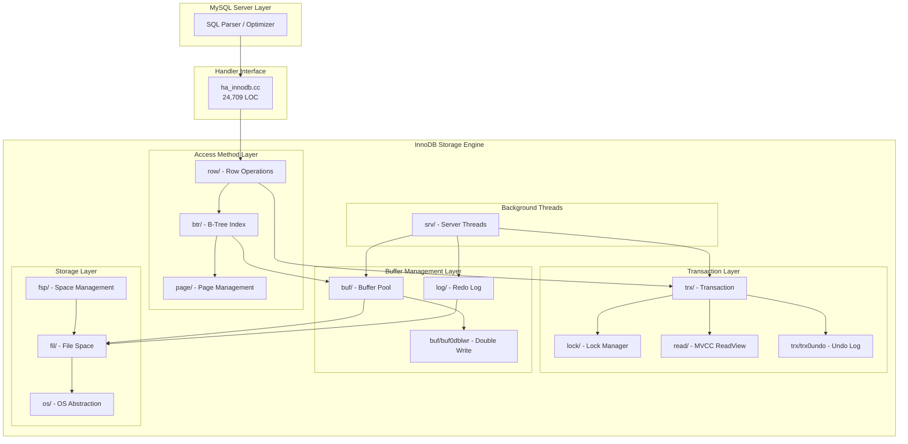
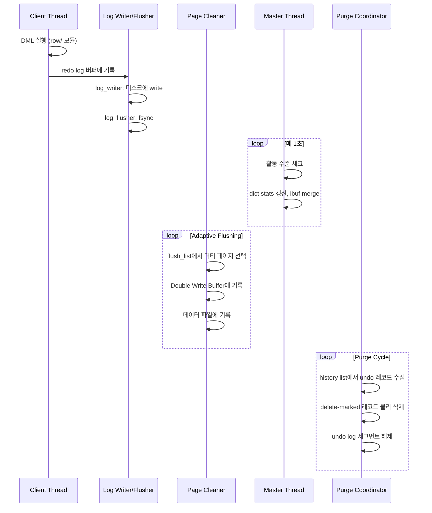

# InnoDB 아키텍처 개요

InnoDB는 MySQL의 기본 스토리지 엔진으로, ACID 트랜잭션, MVCC, 크래시 복구를 지원하는 약 339K LOC 규모의 대형 코드베이스이다. 이 문서에서는 `storage/innobase/` 디렉토리의 40개 하위 모듈 구조와 핵심 설계 철학, 주요 백그라운드 스레드를 분석한다.

## 목차
- [1. 핵심 개념 (What)](#1-핵심-개념-what)
- [2. 왜 알아야 하는가 (Why)](#2-왜-알아야-하는가-why)
- [3. 내부 구현 분석 (How)](#3-내부-구현-분석-how)
- [4. 실전 예제](#4-실전-예제)
- [5. 정리](#5-정리)

---

## 1. 핵심 개념 (What)

### InnoDB의 설계 철학

InnoDB는 세 가지 핵심 원칙 위에 설계되었다:

1. **ACID 보장**: Write-Ahead Logging(WAL) + Double Write Buffer를 통한 원자적 쓰기
2. **MVCC(Multi-Version Concurrency Control)**: 읽기 작업이 쓰기를 블로킹하지 않는 동시성 모델
3. **크래시 복구(Crash Recovery)**: redo log를 통한 자동 복구, 별도 관리 도구 불필요

### 소스코드 규모

```
storage/innobase/
├── 40개 하위 디렉토리
├── 474개 소스 파일 (.cc + .h)
└── 약 339,000 Lines of Code (LOC)
```

### 핵심 모듈 맵

| 디렉토리 | 모듈명 | 역할 |
|----------|--------|------|
| `buf/` | Buffer Pool | 디스크 페이지 캐싱, LRU 관리 |
| `btr/` | B-Tree | 인덱스 구조, 검색/삽입/분할 |
| `trx/` | Transaction | 트랜잭션 관리, undo log |
| `lock/` | Lock Manager | 행 수준 잠금, 갭 잠금, 교착 상태 탐지 |
| `log/` | Redo Log | WAL, 체크포인트, 크래시 복구 |
| `dict/` | Data Dictionary | 테이블/인덱스 메타데이터 캐시 |
| `fil/` | File Space | 테이블스페이스, 파일 I/O 관리 |
| `row/` | Row Operations | DML 연산(insert/update/delete/select) |
| `page/` | Page | 페이지 내부 레코드 관리 |
| `srv/` | Server | 백그라운드 스레드, 서버 메인 루프 |
| `handler/` | Handler | MySQL 서버와의 인터페이스(ha_innodb.cc) |
| `read/` | Read View | MVCC 스냅샷 관리 |
| `fsp/` | File Space Mgmt | 익스텐트/세그먼트 할당 |
| `mtr/` | Mini-Transaction | 원자적 페이지 수정 단위 |

## 2. 왜 알아야 하는가 (Why)

### DBA 관점
- Buffer Pool 크기 설정, redo log 크기 튜닝, purge lag 모니터링 등 운영 지식의 근거를 이해할 수 있다
- `SHOW ENGINE INNODB STATUS` 출력의 각 섹션이 어떤 모듈에서 생성되는지 파악 가능

### 개발자 관점
- 쿼리 성능 문제의 근본 원인을 소스 레벨에서 추적할 수 있다
- 잠금 경합, 버퍼 풀 히트율 저하 등의 문제를 구조적으로 이해할 수 있다

### 아키텍트 관점
- InnoDB의 모듈 간 의존성을 파악하여 커스텀 스토리지 엔진 개발이나 포크 프로젝트에 활용 가능

## 3. 내부 구현 분석 (How)

### 3.1 전체 아키텍처 다이어그램



### 3.2 Handler 인터페이스 (ha_innodb.cc)

MySQL 서버와 InnoDB를 연결하는 핵심 파일이다. `ha_innodb.cc`는 24,709줄로 InnoDB에서 가장 큰 단일 소스 파일이며, `handler` 클래스를 상속한 `ha_innobase` 클래스를 구현한다.

```cpp
// handler/ha_innodb.cc - MySQL handler API 구현
// 주요 메서드:
//   ha_innobase::open()       - 테이블 열기
//   ha_innobase::write_row()  - INSERT
//   ha_innobase::update_row() - UPDATE
//   ha_innobase::delete_row() - DELETE
//   ha_innobase::index_read() - 인덱스 스캔
//   ha_innobase::rnd_next()   - 풀 테이블 스캔
```

### 3.3 주요 백그라운드 스레드

InnoDB는 여러 백그라운드 스레드를 운영한다. 이들은 `srv/srv0srv.cc`(3,227 LOC)에서 관리된다.

#### Master Thread (`srv_master_thread`)

```cpp
// srv/srv0srv.cc:2690
void srv_master_thread() {
    slot = srv_reserve_slot(SRV_MASTER);
    srv_master_main_loop(slot);         // 메인 루프
    srv_master_pre_dd_shutdown_loop();  // DD 종료 전 루프
    srv_master_shutdown_loop();         // 종료 루프
}
```

Master Thread는 1초마다 깨어나서 서버 활동 수준을 확인한다:

```cpp
// srv/srv0srv.cc:2620
static void srv_master_main_loop(srv_slot_t *slot) {
    while (srv_shutdown_state.load() <
           SRV_SHUTDOWN_PRE_DD_AND_SYSTEM_TRANSACTIONS) {
        srv_master_sleep();  // 1초 슬립
        if (srv_check_activity(old_activity_count)) {
            srv_master_do_active_tasks();  // 활성 상태: dict stats 갱신 등
        } else {
            srv_master_do_idle_tasks();    // 유휴 상태: ibuf merge 등
        }
        fil_purge();  // 삭제된 테이블스페이스 정리
    }
}
```

#### Page Cleaner Thread

더티 페이지를 디스크에 플러시하는 스레드이다. Coordinator 1개 + Worker N개 구조로 동작한다.

```cpp
// srv/srv0srv.cc:482
ulong srv_n_page_cleaners = 4;  // 기본 4개

// srv/srv0srv.cc:1127-1133
srv_threads.m_page_cleaner_coordinator = {};
srv_threads.m_page_cleaner_workers_n = srv_n_page_cleaners;
srv_threads.m_page_cleaner_workers = ut::new_arr_withkey<IB_thread>(
    ut::Count{srv_threads.m_page_cleaner_workers_n});
```

#### Purge Thread (`srv_worker_thread`)

```cpp
// srv/srv0srv.cc:2789
void srv_worker_thread() {
    purge_sys->is_this_a_purge_thread = true;
    slot = srv_reserve_slot(SRV_WORKER);
    // purge coordinator가 분배한 작업을 실행
    while (srv_task_execute()) { /* ... */ }
}
```

Purge 시스템은 Coordinator + Worker 구조이다:
- **Purge Coordinator**: 삭제 마크된 레코드의 실제 제거를 조율
- **Purge Worker**: Coordinator가 분배한 undo log 기반 정리 작업 수행

#### Log 관련 스레드

```
log_writer   → redo log 버퍼를 파일에 기록
log_flusher  → 기록된 redo log를 fsync
log_checkpointer → 체크포인트 갱신
```

```cpp
// srv/srv0srv.cc:248,312,332
bool srv_log_writer_threads;
ulong srv_log_writer_spin_delay = INNODB_LOG_WRITER_SPIN_DELAY_DEFAULT;
ulong srv_log_flusher_spin_delay = INNODB_LOG_FLUSHER_SPIN_DELAY_DEFAULT;
```

### 3.4 백그라운드 스레드 상호작용



### 3.5 모듈 간 데이터 흐름 (INSERT 예시)

```
1. ha_innobase::write_row()           [handler/]
2.   → row_insert_for_mysql()         [row/]
3.     → btr_cur_optimistic_insert()  [btr/]
4.       → page_cur_insert_rec()      [page/]
5.       → buf_page_get_gen()         [buf/]  -- 버퍼풀에서 페이지 획득
6.       → mtr_commit()              [mtr/]  -- redo log 기록
7.     → trx_undo_report_row_operation() [trx/] -- undo log 기록
8.     → lock_rec_insert_check_and_lock() [lock/] -- 잠금 확인
```

## 4. 실전 예제

### 4.1 InnoDB 상태 모니터링

```sql
-- 전체 InnoDB 상태 확인
SHOW ENGINE INNODB STATUS\G

-- 각 섹션과 모듈 매핑:
-- SEMAPHORES       → sync/ 모듈
-- TRANSACTIONS     → trx/ 모듈
-- FILE I/O         → fil/, os/ 모듈
-- INSERT BUFFER    → ibuf/ 모듈
-- BUFFER POOL      → buf/ 모듈
-- ROW OPERATIONS   → row/ 모듈
-- LOG              → log/ 모듈
```

### 4.2 백그라운드 스레드 튜닝

```sql
-- Page Cleaner 스레드 수 조정 (기본 4)
SET GLOBAL innodb_page_cleaners = 8;

-- Purge 스레드 수 조정 (기본 4)
-- 시작 시에만 설정 가능
-- my.cnf: innodb_purge_threads = 8

-- Master Thread 활동 확인
SHOW ENGINE INNODB STATUS\G
-- "srv_master_thread loops: N srv_active, M srv_idle"
-- srv/srv0srv.cc:854에서 출력되는 카운터

-- Log Writer 스레드 설정
SET GLOBAL innodb_log_writer_threads = ON;
```

### 4.3 주요 모듈별 상태 변수 조회

```sql
-- Buffer Pool 상태
SELECT * FROM information_schema.INNODB_BUFFER_POOL_STATS;

-- 트랜잭션 상태
SELECT * FROM information_schema.INNODB_TRX;

-- 잠금 상태
SELECT * FROM performance_schema.data_locks;

-- Redo Log 상태
SHOW GLOBAL STATUS LIKE 'Innodb_redo_log%';
```

## 5. 정리

| 구분 | 핵심 내용 |
|------|----------|
| **규모** | 40개 디렉토리, 474개 파일, 339K LOC |
| **핵심 진입점** | `ha_innodb.cc` (MySQL ↔ InnoDB 인터페이스, 24.7K LOC) |
| **버퍼 관리** | `buf/` - 메모리 캐시, LRU, Double Write |
| **인덱스** | `btr/` - B-Tree 기반 Clustered/Secondary Index |
| **트랜잭션** | `trx/` - MVCC, undo log, 4단계 격리 수준 |
| **잠금** | `lock/` - 행 잠금, 갭 잠금, 교착 상태 탐지 |
| **로깅** | `log/` - WAL, 체크포인트, 크래시 복구 |
| **Master Thread** | 1초 주기 활동 감시, dict stats 갱신, ibuf merge |
| **Page Cleaner** | Coordinator + Worker(기본 4) 구조, 적응적 플러시 |
| **Purge System** | Coordinator + Worker 구조, delete-marked 레코드 정리 |
| **Log Threads** | writer → flusher → checkpointer 파이프라인 |
| **설계 철학** | ACID + MVCC + 자동 크래시 복구 |

---
*참고: MySQL 9.x (trunk) 소스코드 기준*
