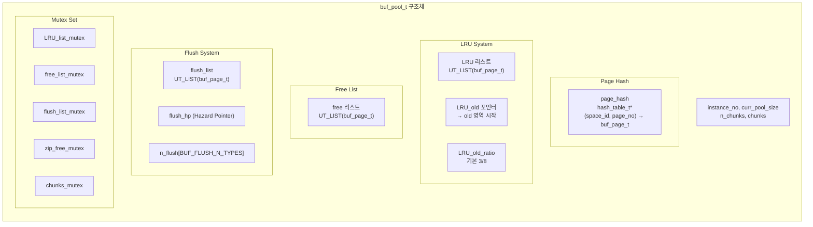
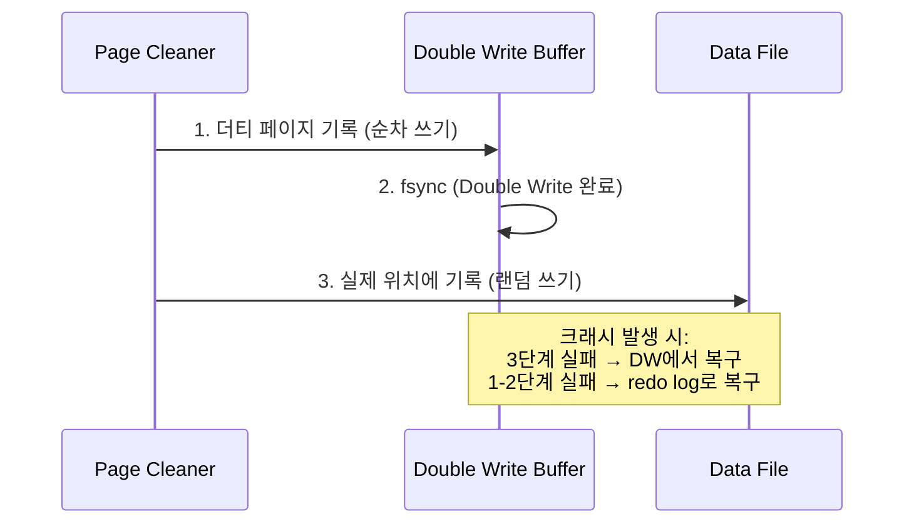

# InnoDB Buffer Pool

InnoDB Buffer Pool은 디스크의 데이터 페이지를 메모리에 캐싱하여 I/O를 최소화하는 InnoDB의 핵심 컴포넌트이다. `buf0buf.cc`(7,120 LOC)를 중심으로 LRU 관리, 플러시 메커니즘, Double Write Buffer, Buddy 할당자까지 분석한다.

## 목차
- [1. 핵심 개념 (What)](#1-핵심-개념-what)
- [2. 왜 알아야 하는가 (Why)](#2-왜-알아야-하는가-why)
- [3. 내부 구현 분석 (How)](#3-내부-구현-분석-how)
- [4. 실전 예제](#4-실전-예제)
- [5. 정리](#5-정리)

---

## 1. 핵심 개념 (What)

Buffer Pool은 InnoDB가 테이블과 인덱스 데이터를 접근할 때 사용하는 메인 메모리 영역이다. 모든 읽기/쓰기 작업은 Buffer Pool을 거치며, 빈번하게 접근하는 데이터를 메모리에 유지함으로써 디스크 I/O를 극적으로 줄인다.

핵심 구성 요소:
- **buf_pool_t**: Buffer Pool 인스턴스 구조체
- **buf_page_t**: 버퍼에 캐시된 개별 페이지 디스크립터
- **buf_block_t**: buf_page_t + 프레임(실제 데이터) + 잠금
- **LRU 리스트**: 페이지 교체 알고리즘 (young/old 분할)
- **Free 리스트**: 사용 가능한 빈 페이지
- **Flush 리스트**: 디스크에 기록해야 할 더티 페이지

## 2. 왜 알아야 하는가 (Why)

### 성능의 90%는 Buffer Pool에서 결정된다
- `innodb_buffer_pool_size`는 MySQL 튜닝의 가장 중요한 파라미터이다
- Buffer Pool 히트율이 99% 미만이면 심각한 성능 저하가 발생한다

### 실무에서 마주하는 문제들
- **풀 테이블 스캔 시 캐시 오염**: LRU의 old/young 분할 이해 필요
- **체크포인트 스톨**: Flush 리스트 관리와 Adaptive Flushing 이해 필요
- **Partial Write 문제**: Double Write Buffer의 존재 이유
- **메모리 단편화**: Buddy 할당자가 압축 페이지를 어떻게 관리하는지

## 3. 내부 구현 분석 (How)

### 3.1 buf_pool_t 구조체

`buf_pool_t`는 Buffer Pool 인스턴스의 모든 상태를 담고 있다. MySQL은 `innodb_buffer_pool_instances` 설정에 따라 여러 인스턴스를 운영한다.



소스코드에서 확인한 핵심 필드:

```cpp
// include/buf0buf.h:2293
struct buf_pool_t {
    BufListMutex chunks_mutex;      // chunk 할당/해제 보호
    BufListMutex LRU_list_mutex;    // LRU 리스트 보호
    BufListMutex free_list_mutex;   // free/withdraw 리스트 보호
    BufListMutex zip_free_mutex;    // buddy 할당자 보호
    BufListMutex flush_list_mutex;  // flush 리스트 보호
    
    ulint instance_no;              // 인스턴스 번호
    ulint curr_pool_size;           // 현재 풀 크기 (bytes)
    ulint LRU_old_ratio;            // old 영역 비율
    
    buf_chunk_t *chunks;            // 메모리 청크 배열
    hash_table_t *page_hash;        // 페이지 해시 테이블
    
    // LRU 관련
    UT_LIST_BASE_NODE_T(buf_page_t, LRU) LRU;  // LRU 리스트
    buf_page_t *LRU_old;            // old 영역 시작점
    ulint LRU_old_len;              // old 영역 길이
    
    // Flush 관련
    UT_LIST_BASE_NODE_T(buf_page_t, list) flush_list;  // 더티 페이지
    FlushHp flush_hp;               // 플러시 스캔 hazard pointer
    
    // Free 관련
    UT_LIST_BASE_NODE_T(buf_page_t, list) free;  // 빈 페이지
};
```

### 3.2 buf_page_t 페이지 디스크립터

```cpp
// include/buf0buf.h:1164
class buf_page_t {
    page_id_t id;                   // (space_id, page_no)
    page_size_t size;               // 페이지 크기
    std::atomic<uint32_t> buf_fix_count;  // 페이지 참조 카운트
    buf_io_fix io_fix;              // I/O 상태
    buf_page_state state;           // 페이지 상태
    
    lsn_t newest_modification;      // 가장 최근 수정 LSN
    lsn_t oldest_modification;      // 가장 오래된 수정 LSN (flush용)
    
    UT_LIST_NODE_T(buf_page_t) LRU; // LRU 리스트 노드
    UT_LIST_NODE_T(buf_page_t) list;// free/flush 리스트 노드
    
    bool old;                       // LRU old 영역 소속 여부
    unsigned access_time;           // 최초 접근 시간
};
```

### 3.3 LRU 리스트: Young/Old 분할

InnoDB의 LRU는 단순 LRU가 아닌 **midpoint insertion** 전략을 사용한다.

```
┌─────────────────────────────────────────────────────┐
│                    LRU 리스트                        │
│                                                      │
│  ◄── Young 영역 (5/8) ──►│◄── Old 영역 (3/8) ──►   │
│                           │                          │
│  [MRU]                    │                  [LRU]   │
│  ┌───┬───┬───┬───┬───┐  │  ┌───┬───┬───┬───┬───┐  │
│  │ P │ P │ P │ P │ P │  │  │ P │ P │ P │ P │ P │  │
│  └───┴───┴───┴───┴───┘  │  └───┴───┴───┴───┴───┘  │
│  최근 재접근된 핫 페이지  │  LRU_old                  │
│                           │  신규/콜드 페이지          │
└─────────────────────────────────────────────────────┘
```

```cpp
// buf/buf0lru.cc:60-74
// LRU_old 포인터로부터의 블록 수가
// buf_pool->LRU_old_ratio / BUF_LRU_OLD_RATIO_DIV 비율을 유지해야 함

constexpr uint32_t BUF_LRU_OLD_TOLERANCE = 20;
constexpr uint32_t BUF_LRU_NON_OLD_MIN_LEN = 5;

// LRU 리스트가 BUF_LRU_OLD_MIN_LEN 이상이 되면 old 영역 분할 시작
// buf0lru.cc:1504
// buf_LRU_old_init()은 LRU가 BUF_LRU_OLD_MIN_LEN에 도달하면 호출됨
```

**동작 원리:**

1. **새 페이지 로드**: old 영역의 head(midpoint)에 삽입
2. **old 영역에서 재접근**: `innodb_old_blocks_time` 이후 재접근 시 young 영역으로 이동
3. **young 영역 이동**: young의 head(MRU end)로 이동
4. **페이지 교체**: old 영역의 tail(LRU end)에서 evict

이 전략의 핵심 목적: **풀 테이블 스캔이 자주 접근되는 핫 페이지를 밀어내지 못하게 보호**

### 3.4 페이지 해시 테이블

`(space_id, page_no)` → `buf_page_t*` 매핑을 제공하는 해시 테이블이다.

```cpp
// include/buf0buf.h:2359-2362
/** Hash table of buf_page_t or buf_block_t file pages,
    buf_page_in_file() == true,
    indexed by (space_id, offset). */
hash_table_t *page_hash;
```

- 페이지를 읽을 때 먼저 page_hash를 조회하여 O(1)으로 버퍼 히트 확인
- 해시 테이블은 분할된 뮤텍스 배열로 보호 (동시성 향상)

### 3.5 Flush 리스트와 적응적 플러시

Flush 리스트는 `oldest_modification` LSN 기준으로 정렬된 더티 페이지 목록이다.

```cpp
// include/buf0buf.h:2393-2406
/** Mutex protecting the flush list access */
BufListMutex flush_list_mutex;

/** "Hazard pointer" used during scan of flush_list */
FlushHp flush_hp;

/** Base node of the modified block list */
UT_LIST_BASE_NODE_T(buf_page_t, list) flush_list;
```

**플러시 유형:**

| 유형 | 설명 |
|------|------|
| `BUF_FLUSH_LRU` | LRU tail에서 더티 페이지를 플러시하여 free 페이지 확보 |
| `BUF_FLUSH_LIST` | flush_list에서 가장 오래된 페이지부터 플러시 (checkpoint 진행) |
| `BUF_FLUSH_SINGLE_PAGE` | 특정 페이지 하나를 동기적으로 플러시 |

Page Cleaner 스레드(`buf/buf0flu.cc`)가 적응적 플러시를 수행한다:

```cpp
// buf/buf0flu.cc:77
// Linux에서 Page Cleaner의 CPU 우선순위
static const int buf_flush_page_cleaner_priority = -20;
```

### 3.6 Double Write Buffer (buf0dblwr.cc)

**문제**: OS가 16KB 페이지를 쓰는 도중 크래시가 발생하면 partial write가 생긴다. Redo log는 물리적으로 깨진 페이지를 복구할 수 없다.

**해결**: 먼저 Double Write Buffer에 페이지 사본을 쓴 후, 실제 데이터 파일에 기록한다.

```cpp
// buf/buf0dblwr.cc:49-72
/** Doublewrite buffer */

/** DBLWR file pages reserved per instance for single page flushes. */
constexpr uint32_t SYNC_PAGE_FLUSH_SLOTS = 512;

namespace dblwr {
    std::string dir{"."};    // doublewrite 파일 디렉토리
    ulong n_files{1};        // doublewrite 파일 수
};
```



### 3.7 Buddy 할당자

압축 페이지(1KB, 2KB, 4KB, 8KB)를 위한 메모리 할당자이다. Buffer Pool 프레임(16KB)을 2의 거듭제곱 크기로 분할한다.

```cpp
// include/buf0buf.h:2310-2311
/** buddy allocator mutex */
BufListMutex zip_free_mutex;

// include/buf0buf.h:2377-2379
/** Statistics of buddy system, indexed by block size */
buf_buddy_stat_t buddy_stat[BUF_BUDDY_SIZES_MAX + 1];
```

### 3.8 Adaptive Hash Index

자주 접근하는 페이지에 대해 B-Tree 탐색을 건너뛰고 해시 검색으로 바로 접근할 수 있게 해주는 인메모리 해시 인덱스이다. `btr/btr0sea.cc`의 `btr_search_guess_on_hash()`가 핵심 함수이다.

```cpp
// btr/btr0sea.cc:804
bool btr_search_guess_on_hash(
    const dtuple_t *tuple,  // 검색할 튜플
    ulint mode,             // 검색 모드
    ...);                   // AHI로 직접 레코드 찾기 시도

// btr/btr0sea.cc:649
void btr_search_info_update_slow(btr_cur_t *cursor) {
    btr_search_info_update_hash(cursor);  // AHI 해시 정보 갱신
}
```

## 4. 실전 예제

### 4.1 Buffer Pool 크기 설정 및 모니터링

```sql
-- Buffer Pool 크기 설정 (물리 메모리의 70-80% 권장)
SET GLOBAL innodb_buffer_pool_size = 8 * 1024 * 1024 * 1024;  -- 8GB

-- Buffer Pool 히트율 확인
SELECT 
    (1 - (Innodb_buffer_pool_reads / Innodb_buffer_pool_read_requests)) * 100 
    AS hit_rate_pct
FROM (
    SELECT 
        VARIABLE_VALUE AS Innodb_buffer_pool_reads
    FROM performance_schema.global_status 
    WHERE VARIABLE_NAME = 'Innodb_buffer_pool_reads'
) a, (
    SELECT 
        VARIABLE_VALUE AS Innodb_buffer_pool_read_requests
    FROM performance_schema.global_status 
    WHERE VARIABLE_NAME = 'Innodb_buffer_pool_read_requests'
) b;

-- Buffer Pool 인스턴스별 상태
SELECT 
    POOL_ID,
    POOL_SIZE,
    FREE_BUFFERS,
    DATABASE_PAGES,
    OLD_DATABASE_PAGES,
    MODIFIED_DATABASE_PAGES,
    HIT_RATE
FROM information_schema.INNODB_BUFFER_POOL_STATS;
```

### 4.2 풀 스캔 보호를 위한 Old Block 설정

```sql
-- old 영역 비율 조정 (기본 37 = 3/8)
-- 풀 테이블 스캔이 많은 환경에서는 이 값을 높여 old 영역 확대
SET GLOBAL innodb_old_blocks_pct = 37;

-- old 영역에서 young으로 이동하기 위한 대기 시간 (ms)
-- 풀 스캔 페이지가 young으로 승격하는 것을 방지
SET GLOBAL innodb_old_blocks_time = 1000;  -- 1초

-- Double Write Buffer 비활성화 (원자적 쓰기를 지원하는 스토리지에서)
-- innodb_doublewrite = OFF  (my.cnf에서 설정)
```

## 5. 정리

| 구분 | 핵심 내용 |
|------|----------|
| **핵심 파일** | `buf0buf.cc` (7,120 LOC), `buf0lru.cc`, `buf0flu.cc`, `buf0dblwr.cc` |
| **buf_pool_t** | Buffer Pool 인스턴스. page_hash, LRU, free, flush_list 관리 |
| **buf_page_t** | 페이지 디스크립터. id, state, LSN, LRU/list 노드 포함 |
| **LRU 분할** | Young (5/8) + Old (3/8). midpoint insertion으로 캐시 오염 방지 |
| **Page Hash** | (space_id, page_no) → buf_page_t. O(1) 조회 |
| **Flush List** | oldest_modification LSN 순 정렬. Page Cleaner가 적응적 플러시 |
| **Double Write** | Partial Write 방지. DW 기록 → fsync → 실제 위치 기록 |
| **Buddy 할당자** | 압축 페이지용 메모리 할당. 2^n 단위 분할 |
| **AHI** | B-Tree 탐색 생략. `btr_search_guess_on_hash()`로 해시 검색 |
| **핵심 튜닝** | `innodb_buffer_pool_size`, `innodb_old_blocks_pct/time` |

---
*참고: MySQL 9.x (trunk) 소스코드 기준*
