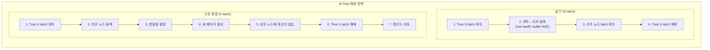
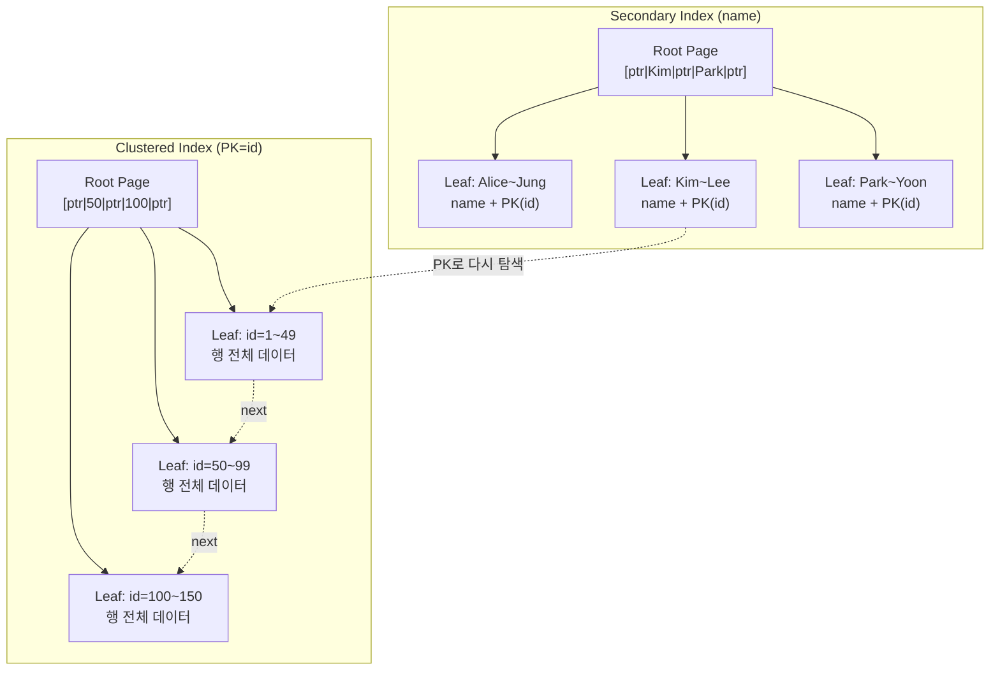
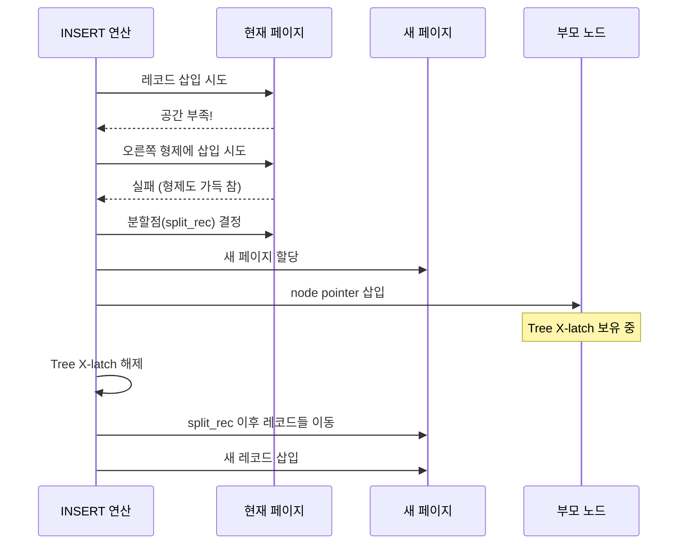

# InnoDB B-Tree 인덱스

InnoDB의 모든 테이블 데이터는 B-Tree 인덱스로 구성된다. `btr0btr.cc`(4,920 LOC)의 B-Tree 구현, Clustered/Secondary Index 구조, 페이지 분할/병합, Adaptive Hash Index까지 소스코드 기반으로 분석한다.

## 목차
- [1. 핵심 개념 (What)](#1-핵심-개념-what)
- [2. 왜 알아야 하는가 (Why)](#2-왜-알아야-하는가-why)
- [3. 내부 구현 분석 (How)](#3-내부-구현-분석-how)
- [4. 실전 예제](#4-실전-예제)
- [5. 정리](#5-정리)

---

## 1. 핵심 개념 (What)

InnoDB는 **모든 테이블을 Clustered Index로 저장**한다. 별도로 정의한 인덱스는 Secondary Index로서 Clustered Index의 Primary Key를 참조한다. 이 인덱스 구조는 B+Tree 변형으로 구현되어 있다.

핵심 구성 요소:
- **Clustered Index**: Primary Key 기반, 실제 행 데이터 포함
- **Secondary Index**: 보조 인덱스, leaf에 PK 값 저장
- **btr_cur_t**: B-Tree 커서. 탐색/삽입/삭제의 위치 추적
- **Page 구조**: Infimum/Supremum 레코드, 레코드 연결 리스트
- **Adaptive Hash Index (AHI)**: B-Tree 탐색 최적화를 위한 해시 인덱스

## 2. 왜 알아야 하는가 (Why)

### 인덱스 설계의 근본 원리
- Clustered Index와 Secondary Index의 차이를 이해하면 최적의 인덱스 전략을 수립할 수 있다
- Secondary Index가 PK를 포함하는 이유를 알면 PK 크기가 성능에 미치는 영향을 예측할 수 있다

### 쿼리 성능 문제 진단
- 페이지 분할(page split)은 순서 없는 INSERT의 성능 저하 원인이다
- AHI 비활성화가 적절한 워크로드를 식별할 수 있다

### 잠금과 B-Tree의 관계
- B-Tree의 래칭 전략을 알면 DDL과 DML의 동시성 한계를 이해할 수 있다

## 3. 내부 구현 분석 (How)

### 3.1 B-Tree 래칭 전략

`btr0btr.cc`의 주석에 명시된 래칭 전략이다:

```cpp
// btr/btr0btr.cc:92-145
/*
Latching strategy of the InnoDB B-tree
--------------------------------------
A tree latch protects all non-leaf nodes of the tree. Each node of a tree
also has a latch of its own.

A B-tree operation normally first acquires an S-latch on the tree. It
searches down the tree and releases the tree latch when it has the
leaf node latch.

If an operation needs to restructure the tree, it acquires an X-latch on
the tree before searching to a leaf node. If it needs to split a leaf:
(1) InnoDB decides the split point in the leaf,
(2) allocates a new page,
(3) inserts the appropriate node pointer to the first non-leaf level,
(4) releases the tree X-latch,
(5) and then moves records from the leaf to the new allocated page.
*/
```



### 3.2 Clustered Index vs Secondary Index



**핵심 차이:**
| 구분 | Clustered Index | Secondary Index |
|------|----------------|-----------------|
| Leaf 데이터 | 행 전체 | 인덱스 컬럼 + PK |
| 테이블당 수 | 정확히 1개 | 0~N개 |
| 행 접근 | 직접 | PK로 Clustered Index 재탐색 필요 |
| 파일 세그먼트 | leaf + non-leaf 별도 | leaf + non-leaf 별도 |

### 3.3 페이지 내부 구조

```
┌─────────────────────────────────────────────┐
│ FIL Header (38 bytes)                       │
│  - space_id, page_no, prev, next, LSN, type │
├─────────────────────────────────────────────┤
│ PAGE Header (56 bytes)                      │
│  - n_recs, heap_top, free, last_insert ...  │
├─────────────────────────────────────────────┤
│ Infimum Record  (가상 최소 레코드)            │
│  - 모든 사용자 레코드보다 작은 특수 레코드     │
├─────────────────────────────────────────────┤
│ User Records (실제 데이터 레코드들)            │
│  [rec1] → [rec2] → [rec3] → ... → Supremum  │
│  각 레코드는 next_record 오프셋으로 연결       │
├─────────────────────────────────────────────┤
│ Supremum Record (가상 최대 레코드)            │
│  - 모든 사용자 레코드보다 큰 특수 레코드       │
├─────────────────────────────────────────────┤
│ Free Space (빈 공간)                         │
├─────────────────────────────────────────────┤
│ Page Directory (역방향 성장)                  │
│  - 4~8개 레코드마다 하나의 slot               │
│  - 페이지 내 이진 검색에 사용                  │
├─────────────────────────────────────────────┤
│ FIL Trailer (8 bytes)                       │
│  - checksum, LSN                            │
└─────────────────────────────────────────────┘
```

**Infimum/Supremum의 역할:**
- B-Tree에서 `minimum record`는 해당 레벨의 가장 왼쪽 노드를 가리키는 node pointer의 prefix 역할
- 소스코드에서 "A minimum record is denoted by setting a bit in the record header" (btr0btr.cc:133-136)

### 3.4 Node Pointer 구조

```cpp
// btr/btr0btr.cc:112-131
/*
Node pointers
-------------
Leaf pages contain the index records stored in the tree.
On levels n > 0 we store 'node pointers' to pages on level n - 1.

A node pointer contains a prefix P of an index record.
The file page number of the child page is added as the last field.

If a node pointer points to a non-leaf child,
then the leftmost record in the child must have the same prefix P.
If it points to a leaf node, the child is not required
to contain any record with a prefix equal to P.
(→ leaf에서 임의 삭제가 가능하도록 설계)
*/
```

### 3.5 btr_cur_t - B-Tree 커서

```cpp
// include/btr0cur.h:673
struct btr_cur_t {
    dict_index_t *index;        // 커서가 위치한 인덱스
    page_cur_t page_cur;        // 페이지 내 레코드 커서
    
    btr_cur_method flag;        // 탐색 방법 (HASH / BINARY / ...)
    ulint tree_height;          // 트리 높이 (pessimistic 연산용)
    
    ulint up_match;             // 오른쪽 레코드와 일치 필드 수
    ulint low_match;            // 왼쪽 레코드와 일치 필드 수
    
    // Adaptive Hash Index 관련
    struct {
        btr_search_prefix_info_t prefix_info;
        uint64_t ahi_hash_value;
    } ahi;
    
    btr_path_t *path_arr;       // 범위 추정용 경로 배열
    Page_fetch m_fetch_mode;    // 페이지 fetch 모드
};
```

### 3.6 페이지 분할 (btr_page_split_and_insert)

페이지가 가득 차면 새 페이지를 할당하고 레코드를 분배한다.

```cpp
// btr/btr0btr.cc:2305
rec_t *btr_page_split_and_insert(
    uint32_t flags,
    btr_cur_t *cursor,     // 삽입 위치
    ulint **offsets,
    mem_heap_t **heap,
    const dtuple_t *tuple, // 삽입할 튜플
    mtr_t *mtr)
{
    // 1. 먼저 오른쪽 형제 페이지에 삽입 시도
    rec = btr_insert_into_right_sibling(flags, cursor, offsets, *heap, tuple, mtr);
    if (rec != nullptr) return rec;
    
    // 2. 분할점 결정 (split_rec)
    // 3. 새 페이지 할당
    // 4. 상위 노드에 node pointer 삽입
    // 5. 레코드 이동
    // ...
}
```



### 3.7 페이지 병합 (btr_compress)

레코드 삭제 후 페이지 사용률이 낮아지면 인접 페이지와 병합을 시도한다.

```cpp
// btr/btr0btr.cc:3023
bool btr_compress(
    btr_cur_t *cursor,  // 현재 페이지의 커서
    bool adjust,        // 병합 후 커서 조정 여부
    mtr_t *mtr)
{
    // 1. 왼쪽/오른쪽 형제 페이지 번호 확인
    left_page_no = btr_page_get_prev(page, mtr);
    right_page_no = btr_page_get_next(page, mtr);
    
    // 2. 병합 가능 여부 확인 (btr_can_merge_with_page)
    // 3. 레코드 이동 및 페이지 해제
    // ...
}
```

### 3.8 삭제 처리: 논리 삭제 + 비동기 Purge

InnoDB의 DELETE는 즉시 물리적으로 레코드를 제거하지 않는다:

1. **논리 삭제**: `delete_mark` 비트 설정 (즉시)
2. **Purge**: 백그라운드 purge 스레드가 실제 레코드를 제거 (비동기)

```cpp
// include/btr0cur.h:751
static inline void btr_rec_set_deleted_flag(
    rec_t *rec,             // 레코드
    page_zip_des_t *page_zip, // 압축 페이지 (또는 NULL)
    ulint flag);            // 삭제 마크 플래그
```

이 2단계 방식은 MVCC에 필수적이다: 다른 트랜잭션이 이전 버전을 읽어야 할 수 있으므로 즉시 제거하면 안 된다.

### 3.9 Adaptive Hash Index (btr0sea.cc)

```cpp
// btr/btr0sea.cc:804
bool btr_search_guess_on_hash(
    const dtuple_t *tuple,  // 검색 키
    ulint mode,             // PAGE_CUR_LE, PAGE_CUR_GE 등
    ...);
// 해시로 직접 레코드를 찾아 B-Tree 탐색을 생략

// btr/btr0sea.cc:649
void btr_search_info_update_slow(btr_cur_t *cursor) {
    btr_search_info_update_hash(cursor);
    // 접근 패턴을 분석하여 AHI 엔트리 갱신
}
```

**AHI 동작:**
- B-Tree 리프 페이지의 접근 패턴을 모니터링
- 특정 패턴이 반복되면 자동으로 해시 인덱스를 구축
- `btr_cur_t.flag`가 `BTR_CUR_HASH`이면 AHI 히트

## 4. 실전 예제

### 4.1 인덱스 구조 확인

```sql
-- 테이블의 인덱스 정보 확인
SELECT 
    INDEX_NAME,
    INDEX_TYPE,
    STAT_VALUE AS pages,
    STAT_DESCRIPTION
FROM mysql.innodb_index_stats
WHERE database_name = 'mydb' 
  AND table_name = 'orders'
  AND stat_name = 'size';

-- B-Tree 깊이(높이) 확인
SELECT 
    NAME AS index_name,
    STAT_VALUE AS btree_height
FROM mysql.innodb_index_stats
WHERE stat_name = 'n_leaf_pages'
  AND database_name = 'mydb';

-- 페이지 분할 모니터링
SHOW GLOBAL STATUS LIKE 'Innodb_pages_split';
```

### 4.2 PK 크기가 성능에 미치는 영향 테스트

```sql
-- BAD: UUID를 PK로 사용 → Secondary Index가 16바이트 PK를 각각 저장
CREATE TABLE orders_bad (
    id BINARY(16) PRIMARY KEY,  -- UUID: 16 bytes
    customer_id INT,
    amount DECIMAL(10,2),
    INDEX idx_customer (customer_id)
    -- idx_customer의 leaf: customer_id(4) + id(16) = 20 bytes per entry
);

-- GOOD: AUTO_INCREMENT PK → Secondary Index가 4/8바이트 PK만 저장
CREATE TABLE orders_good (
    id BIGINT AUTO_INCREMENT PRIMARY KEY,  -- 8 bytes, 순차 삽입
    customer_id INT,
    amount DECIMAL(10,2),
    INDEX idx_customer (customer_id)
    -- idx_customer의 leaf: customer_id(4) + id(8) = 12 bytes per entry
);

-- AUTO_INCREMENT는 순차 삽입 → 페이지 분할 최소화
-- UUID는 랜덤 삽입 → 빈번한 페이지 분할 발생
```

### 4.3 AHI 모니터링 및 튜닝

```sql
-- AHI 상태 확인
SHOW ENGINE INNODB STATUS\G
-- INSERT BUFFER AND ADAPTIVE HASH INDEX 섹션:
-- Hash table size N, node heap has N buffer(s)
-- N hash searches/s, N non-hash searches/s

-- AHI 히트율 확인
SELECT 
    VARIABLE_VALUE 
FROM performance_schema.global_status 
WHERE VARIABLE_NAME IN (
    'Innodb_adaptive_hash_searches',
    'Innodb_adaptive_hash_searches_btree'
);

-- AHI가 오히려 성능을 저하시키는 경우 비활성화
-- (높은 동시성 + 랜덤 접근 패턴에서 경합 발생 가능)
SET GLOBAL innodb_adaptive_hash_index = OFF;
```

## 5. 정리

| 구분 | 핵심 내용 |
|------|----------|
| **핵심 파일** | `btr0btr.cc` (4,920 LOC), `btr0cur.cc`, `btr0sea.cc` |
| **래칭 전략** | 읽기=S-latch, 구조변경=X-latch. 리프 래치 획득 후 트리 래치 해제 |
| **Clustered Index** | PK 기반, leaf에 행 전체 데이터 저장. 테이블당 1개 |
| **Secondary Index** | leaf에 인덱스 컬럼 + PK 저장. PK로 재탐색 필요 |
| **페이지 구조** | FIL Header → PAGE Header → Infimum → Records → Supremum → Directory → Trailer |
| **btr_cur_t** | B-Tree 커서. index, page_cur, up_match/low_match, AHI 정보 |
| **페이지 분할** | `btr_page_split_and_insert()`. 형제 삽입 먼저 시도 후 분할 |
| **페이지 병합** | `btr_compress()`. 인접 페이지와 병합 시도 |
| **삭제 처리** | delete_mark 설정(즉시) → purge 스레드가 물리 삭제(비동기) |
| **AHI** | `btr_search_guess_on_hash()`로 B-Tree 탐색 생략. 자동 구축/제거 |
| **PK 설계 원칙** | 짧은 PK, 순차 삽입(AUTO_INCREMENT) → 분할 최소화, Secondary Index 크기 절감 |

---
*참고: MySQL 9.x (trunk) 소스코드 기준*
