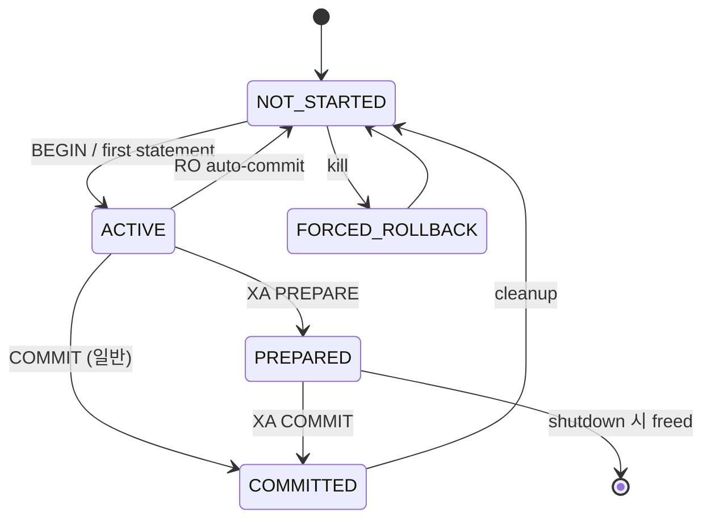
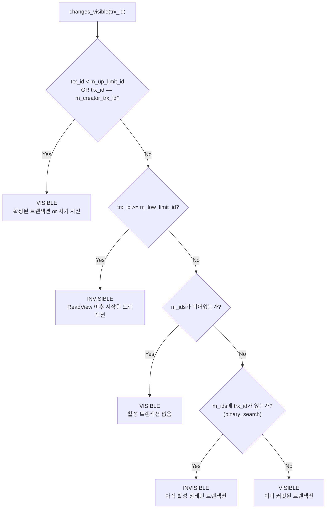
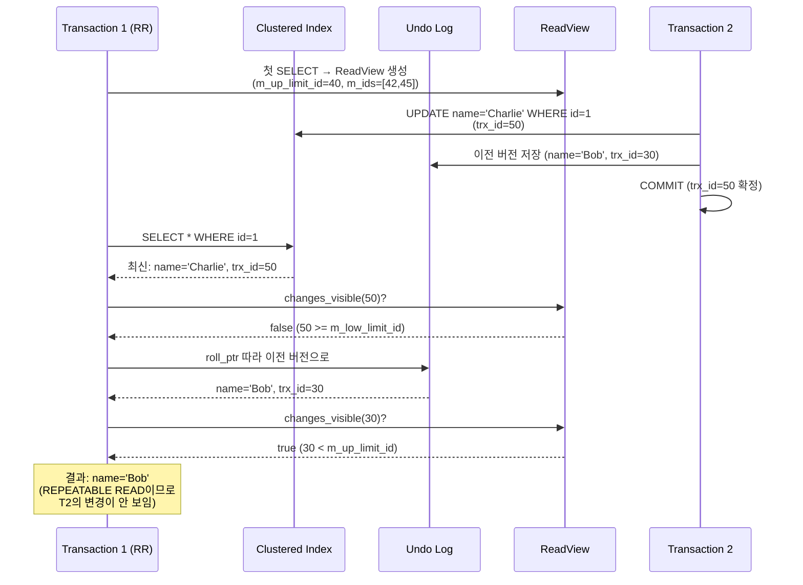

# InnoDB 트랜잭션과 MVCC

InnoDB의 트랜잭션 관리와 MVCC(Multi-Version Concurrency Control) 메커니즘을 소스코드 기반으로 분석한다. `trx0trx.cc`(3,677 LOC)의 트랜잭션 구조체, 4단계 격리 수준 구현, ReadView 기반 가시성 판단 알고리즘, undo log 버전 체인을 다룬다.

## 목차
- [1. 핵심 개념 (What)](#1-핵심-개념-what)
- [2. 왜 알아야 하는가 (Why)](#2-왜-알아야-하는가-why)
- [3. 내부 구현 분석 (How)](#3-내부-구현-분석-how)
- [4. 실전 예제](#4-실전-예제)
- [5. 정리](#5-정리)

---

## 1. 핵심 개념 (What)

### MVCC란
MVCC는 데이터의 여러 버전을 유지하여 **읽기 작업이 쓰기를 블로킹하지 않는** 동시성 제어 메커니즘이다. 각 트랜잭션은 자신만의 "스냅샷"을 통해 데이터를 보며, 다른 트랜잭션의 진행 중인 변경을 볼 필요가 없다.

### 핵심 구성 요소
- **trx_t**: 트랜잭션 구조체. 상태, 격리 수준, ReadView 등 관리
- **trx_id_t**: 트랜잭션 ID. 쓰기 트랜잭션에만 지연 할당
- **ReadView**: MVCC 스냅샷. 어떤 트랜잭션의 변경이 보이는지 결정
- **Undo Log**: 이전 버전 데이터. 버전 체인 구성
- **Purge System**: 더 이상 필요 없는 이전 버전 정리

## 2. 왜 알아야 하는가 (Why)

### 동시성 문제 진단
- 왜 같은 쿼리가 트랜잭션 격리 수준에 따라 다른 결과를 반환하는지
- Long-running 트랜잭션이 undo 공간을 소진하는 메커니즘

### 격리 수준 선택 근거
- READ COMMITTED vs REPEATABLE READ의 정확한 동작 차이
- SERIALIZABLE이 왜 성능을 크게 저하시키는지

### Purge Lag 이해
- undo log가 정리되지 않는 이유와 해결 방법
- History List Length가 증가하는 근본 원인

## 3. 내부 구현 분석 (How)

### 3.1 trx_t 구조체

```cpp
// include/trx0trx.h:675
struct trx_t {
    // 격리 수준 열거형
    enum isolation_level_t {
        READ_UNCOMMITTED,  // 더티 읽기 허용
        READ_COMMITTED,    // 매 SELECT마다 새 ReadView
        REPEATABLE_READ,   // 트랜잭션 시작 시 ReadView 고정
        SERIALIZABLE       // 모든 SELECT를 LOCK IN SHARE MODE로 변환
    };

    mutable TrxMutex mutex;       // state, lock 필드 보호
    
    trx_id_t id;                  // 트랜잭션 ID (지연 할당)
    trx_id_t no;                  // 직렬화 번호
    
    std::atomic<trx_state_t> state;  // 트랜잭션 상태
    isolation_level_t isolation_level; // 현재 격리 수준
    
    ReadView *read_view;          // MVCC 스냅샷 (NULL 가능)
    trx_lock_t lock;              // 잠금 정보
    
    bool is_recovered;            // 복구된 트랜잭션 여부
    bool skip_lock_inheritance;   // GAP 잠금 상속 생략 (RC 이하)
};
```

### 3.2 트랜잭션 상태 전이

```cpp
// include/trx0trx.h:740-798
/*
상태 전이:

일반 트랜잭션:
  NOT_STARTED → ACTIVE → COMMITTED_IN_MEMORY → NOT_STARTED

Auto-commit non-locking read-only:
  NOT_STARTED → ACTIVE → NOT_STARTED

XA (2PC):
  NOT_STARTED → ACTIVE → PREPARED → COMMITTED → NOT_STARTED
*/
```



**핵심 규칙:**
- Auto-commit non-locking read-only 트랜잭션은 뮤텍스 없이 상태 전이 (성능 최적화)
- Read-only → Read-write 전환은 X/IX 잠금 획득 시점에 발생하며, 이때 rollback segment 할당

### 3.3 트랜잭션 ID 지연 할당

InnoDB는 모든 트랜잭션에 즉시 ID를 부여하지 않는다:

```
1. 트랜잭션 시작: id = 0 (아직 할당 안 됨)
2. Read-only 쿼리만 실행: ID 불필요
3. 첫 번째 쓰기(INSERT/UPDATE/DELETE): 이 시점에 trx_id 할당
4. trx_sys->mutex로 보호하며 전역 카운터에서 할당
```

이 최적화 덕분에 SELECT-only 트랜잭션은 trx_sys->mutex 경합을 유발하지 않는다.

### 3.4 ReadView - MVCC 스냅샷

ReadView는 "어떤 트랜잭션의 변경을 볼 수 있는가"를 결정하는 스냅샷이다.

```cpp
// include/read0types.h:47
class ReadView {
private:
    trx_id_t m_low_limit_id;    // 이 ID 이상의 변경은 보이지 않음 (high water mark)
    trx_id_t m_up_limit_id;     // 이 ID 미만의 변경은 모두 보임 (low water mark)
    trx_id_t m_creator_trx_id;  // ReadView를 생성한 트랜잭션 ID
    ids_t m_ids;                // 생성 시점에 활성 상태였던 RW 트랜잭션 ID 목록
    trx_id_t m_low_limit_no;   // purge 기준 번호
    std::atomic_bool m_closed;  // 뷰 닫힘 여부
};
```

### 3.5 가시성 판단 알고리즘 (changes_visible)

이것이 MVCC의 핵심 로직이다:

```cpp
// include/read0types.h:162
bool changes_visible(trx_id_t id, const table_name_t &name) const {
    ut_ad(id > 0);

    // 1. id가 m_up_limit_id보다 작으면 → 확정된 트랜잭션 → 보임
    if (id < m_up_limit_id || id == m_creator_trx_id) {
        return true;
    }

    // 2. id가 m_low_limit_id 이상이면 → ReadView 이후 시작 → 안 보임
    if (id >= m_low_limit_id) {
        return false;
    }

    // 3. m_up_limit_id <= id < m_low_limit_id → 활성 목록에서 확인
    //    m_ids에 없으면 → 이미 커밋됨 → 보임
    //    m_ids에 있으면 → 아직 활성 → 안 보임
    if (m_ids.empty()) {
        return true;
    }

    const ids_t::value_type *p = m_ids.data();
    return !std::binary_search(p, p + m_ids.size(), id);
}
```



### 3.6 격리 수준별 ReadView 생성 시점

| 격리 수준 | ReadView 생성 | 동작 |
|----------|---------------|------|
| READ UNCOMMITTED | 생성하지 않음 | 최신 버전을 항상 읽음 (dirty read) |
| READ COMMITTED | **매 SELECT마다** 새로 생성 | 각 쿼리 시점의 커밋된 데이터만 봄 |
| REPEATABLE READ | **첫 SELECT에서** 생성, 유지 | 트랜잭션 내 동일한 스냅샷 |
| SERIALIZABLE | ReadView + **모든 SELECT에 S-lock** | 팬텀 리드까지 방지 |

### 3.7 Undo Log 기반 버전 체인

레코드가 수정될 때마다 이전 버전이 undo log에 저장되어 버전 체인을 형성한다.

```
Current Row (Clustered Index Leaf)
┌─────────────────────────────────┐
│ PK=1, name='Charlie', trx_id=50│
│ roll_ptr → undo log entry       │
└─────────────┬───────────────────┘
              │
              ▼
┌─────────────────────────────────┐
│ Undo Log Entry (trx_id=30)     │
│ name='Bob'                      │
│ roll_ptr → older undo entry     │
└─────────────┬───────────────────┘
              │
              ▼
┌─────────────────────────────────┐
│ Undo Log Entry (trx_id=10)     │
│ name='Alice'                    │
│ roll_ptr = NULL (최초 버전)      │
└─────────────────────────────────┘
```

**버전 탐색 과정 (row0vers.cc):**

```cpp
// row/row0vers.cc의 가시성 판단 흐름:
// 1. Clustered Index에서 최신 레코드를 읽음
// 2. 레코드의 trx_id를 ReadView.changes_visible()로 확인
// 3. 안 보이면 → roll_ptr를 따라 undo log의 이전 버전으로 이동
// 4. 이전 버전의 trx_id를 다시 확인
// 5. 보이는 버전을 찾을 때까지 반복
```

```cpp
// row/row0vers.cc:590
// purge 시스템도 동일한 가시성 확인 사용
return (!purge_sys->view.changes_visible(trx_id, name));

// row/row0vers.cc:1319
// 버전 체인 순회 중 보이는 버전 발견
if (view->changes_visible(trx_id, index->table->name)) {
    // 이 버전이 현재 트랜잭션에게 보이는 버전
}
```

### 3.8 MVCC 전체 흐름



### 3.9 Purge와 History List

Purge 시스템은 모든 활성 ReadView에서 더 이상 필요하지 않은 undo log 버전을 정리한다.

```
Purge 가능 조건:
- undo 레코드의 trx_no < 모든 활성 ReadView의 m_low_limit_no
- 즉, 어떤 ReadView도 해당 버전을 참조하지 않음

Long-running 트랜잭션 문제:
- 오래된 ReadView가 살아있으면 → purge가 진행되지 못함
- → undo log(History List) 무한 증가
- → 디스크 공간 소진 + 모든 읽기의 버전 체인 탐색 비용 증가
```

## 4. 실전 예제

### 4.1 격리 수준별 동작 확인

```sql
-- Session A: REPEATABLE READ (기본값)
SET TRANSACTION ISOLATION LEVEL REPEATABLE READ;
BEGIN;
SELECT balance FROM accounts WHERE id = 1;  -- 결과: 1000
-- 이 시점에 ReadView 생성 (m_up_limit_id 고정)

-- Session B:
UPDATE accounts SET balance = 2000 WHERE id = 1;
COMMIT;

-- Session A: 같은 트랜잭션에서 다시 읽기
SELECT balance FROM accounts WHERE id = 1;  -- 여전히 1000
-- ReadView가 고정되어 있으므로 Session B의 변경이 보이지 않음
COMMIT;

-- Session A: 새 트랜잭션
SELECT balance FROM accounts WHERE id = 1;  -- 이제 2000
```

```sql
-- READ COMMITTED에서의 차이
SET TRANSACTION ISOLATION LEVEL READ COMMITTED;
BEGIN;
SELECT balance FROM accounts WHERE id = 1;  -- 결과: 1000

-- Session B:
UPDATE accounts SET balance = 2000 WHERE id = 1;
COMMIT;

-- Session A: RC에서는 매 SELECT마다 새 ReadView 생성
SELECT balance FROM accounts WHERE id = 1;  -- 결과: 2000 (변경 보임!)
COMMIT;
```

### 4.2 Long-running 트랜잭션 모니터링

```sql
-- 오래된 트랜잭션 확인
SELECT 
    trx_id,
    trx_state,
    trx_started,
    TIMESTAMPDIFF(SECOND, trx_started, NOW()) AS duration_sec,
    trx_rows_locked,
    trx_rows_modified,
    trx_isolation_level
FROM information_schema.INNODB_TRX
ORDER BY trx_started ASC
LIMIT 10;

-- History List Length 모니터링 (purge lag 지표)
SHOW ENGINE INNODB STATUS\G
-- TRANSACTIONS 섹션:
-- History list length N
-- N이 계속 증가하면 purge가 따라가지 못하는 것

-- Purge 스레드 상태 확인
SELECT 
    NAME, 
    SUBSYSTEM, 
    STATUS 
FROM performance_schema.threads 
WHERE NAME LIKE '%purge%';
```

### 4.3 MVCC와 잠금의 상호작용

```sql
-- Consistent Read (비잠금 읽기) - ReadView 사용
SELECT * FROM orders WHERE id = 100;
-- → 잠금 없음, undo log 기반 버전 읽기

-- Locking Read - 최신 버전에 잠금 설정
SELECT * FROM orders WHERE id = 100 FOR UPDATE;
-- → 최신 커밋 버전을 읽고, X-lock 설정
-- → ReadView를 사용하지 않음!

-- 이 차이를 이해하는 것이 중요:
BEGIN;
-- 1. 비잠금 읽기: 트랜잭션 시작 시점의 스냅샷
SELECT balance FROM accounts WHERE id = 1;  -- 1000

-- 2. 다른 세션에서 balance를 2000으로 변경 후 커밋

-- 3. 잠금 읽기: 최신 커밋 버전
SELECT balance FROM accounts WHERE id = 1 FOR UPDATE;  -- 2000!
-- 같은 트랜잭션 내에서도 결과가 다를 수 있다
COMMIT;
```

## 5. 정리

| 구분 | 핵심 내용 |
|------|----------|
| **핵심 파일** | `trx0trx.cc` (3,677 LOC), `read0types.h`, `row0vers.cc` |
| **trx_t** | 트랜잭션 구조체. id(지연할당), state, isolation_level, read_view |
| **상태 전이** | NOT_STARTED → ACTIVE → COMMITTED (RO는 ACTIVE → NOT_STARTED) |
| **ID 지연 할당** | 쓰기 발생 시점까지 trx_id 할당 연기 → RO 트랜잭션 성능 최적화 |
| **ReadView** | m_up_limit_id(하한), m_low_limit_id(상한), m_ids(활성 목록) |
| **changes_visible()** | 핵심 가시성 알고리즘. binary_search로 m_ids 확인 |
| **격리 수준** | RU=ReadView 없음, RC=매 SELECT, RR=첫 SELECT, SER=RR+S-lock |
| **버전 체인** | Clustered Index → roll_ptr → Undo Log → roll_ptr → ... |
| **Purge** | 모든 ReadView가 불필요한 undo 버전을 정리. Long-running trx가 방해 |
| **Locking Read** | FOR UPDATE/LOCK IN SHARE MODE는 ReadView를 사용하지 않고 최신 버전에 잠금 |

---
*참고: MySQL 9.x (trunk) 소스코드 기준*
