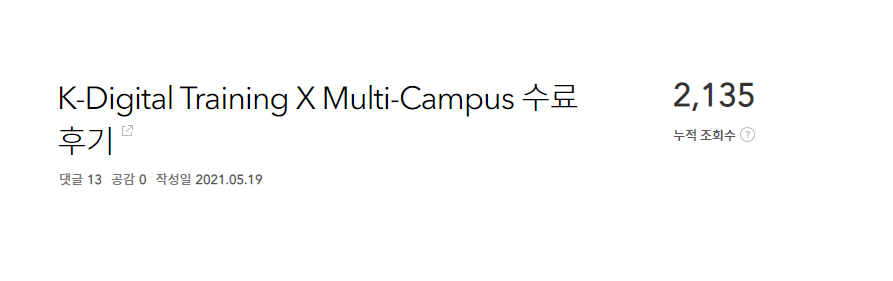
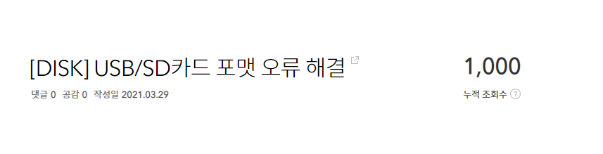

# 2021년 회고

마음편히 쉬었던 날이 하루도 없었던 것처럼 바쁘고 정신 없던 2021년.

하지만 돌이켜보면 은은한 만족감과 미소가 지어지는건 왜 일까?

8개월차 꼬꼬마 개발자의 첫 회고를 시작한다.

2021년을 분류한다면 K- Digital Trainging X Multi Campus, 취업, 원맨팀으로 나눠볼수 있을것 같다.

8개월차 꼬꼬마 개발자의 2021년을 리뷰해보자.

### 1. K-Digital Traiging X Multi Campus

시작은 달콤하게 평범하게 멀티캠퍼스부터.

멀티캠퍼스는 나의 개발자 인생이 시작된 곳이다.

**<u>농담이 아니다.</u>**

멀티캠퍼스에서 수강하고, 강사님 추천을 받아 멘토님이 대표로 계신 지금의 회사에 취업하여 근무 중이기 때문이다.

~~내가 이 수업을 선택한 이유가 잘 짜여진 커리큘럼 때문이었는데 나중에 안 사실이지만  대표님께서 설계한 과정이라고..~~

3.5개월간 정말 재밌고 치열하게 고민하고 스스로 싸우며 공부를 했다.

이런 과정에서 작성했던 **[자바를 배우니 파이썬이 하고 싶어졌다.](https://ktae23.tistory.com/118?category=1065824)**

언어를 배우는것을 넘어서서 스스로 하고 싶은 개발을 하는 **개발자**가 되어야 겠다고 결심하게 된 날이다.

물론 지금은 파이썬을 하고 있지 않지만, **자바**개발자가 아닌 자바**개발자**가 되어야겠다던 그때의 결심을 잘 지켜나가고 있다.

#### 1-1 모든 과정이 끝나고 작성했던 [K-Digital Tragining X Multi-Campus 수료 후기](https://ktae23.tistory.com/152?category=999413)

K - Digital Training 유튜브 설명회를 보고 신청을 했던만큼 신청하기 전에 참고 할 수 있는 후기가 없어서 도움이 되고자 작성했다.

여러 분들께서 멀캠과 KDT에 대해 질문을 주셨고, 틈틈이 최대한 정성스레 답변을 달아드리곤 했다.

그러다 강사님께서 부탁을하셔서 [**선배와의 만남**](https://ktae23.tistory.com/206?category=1065824) 시간을 갖게 되었고, 내가 A반이었는데 그때가 2021년 마지막인 L반이 진행중이었다고 한다.

그런데 강사님께서 **"얘가 걔야! 그 후기 쓴애!"**이러셔서 놀랐다.

수업만 믿고, 광고에 속아 수료만하면 될거라 생각하면 안된다는 걸 전하고 싶어서 작성했던 글이었다.

하지만 오히려 내 후기의 부정적인 부분을 확대 해석하여 역시 잘못 신청했어, 속았어, 하면 안됐어 하시는 분들이 있었나보다... 그래서 조금은 속상했다.

그래서였는지 블로그 초반에는 [**꼬꼬마 형태소 분석기 실행 에러 해결**](https://ktae23.tistory.com/112?category=1011779)글이 조회수 1위 였으나 시간이 지날수록 K-Digital 수료 후기가 많은 조회를 올리게 되었다.

#### 1-2. 2022년 1월 1일 현재 조회수 1위 ~ 3위

##### 	1위 꼬꼬마 형태소 분석기 실행 에러 해결

##### 	2위 K-Digital Training X Multi-Campus 수료 후기

##### 	3위 USB/SD 카드 포맷 오류 해결

2021년 1월 1일에 무작정 블로그를 개설하고 틈틈이 기록을 남기던게 어느덧 일년이 되었다.

2022년 1월 1일에 회고를 작성하며 블로그 방문 통계를 돌아보니 정말 멀티캠퍼스가 2021년을 꽉 채워줬다.

**땡큐 멀캠, 땡큐 KDT**

### 2. 취업

멀캠을 수료하고는 바로 인턴으로 근무를 시작했다.

처음으로 맡아서 진행한 과제는 maven, ibatis, jsp 기반의 프로젝트를 spring boot + Mybatis + react 기반으로 변경하는 것.

이 프로젝트는 이전에 대표님께서 보안 강의를 진행하실 때 교보재로 사용하던 보안 훈련 프로젝트였다.

특히 리액트는 처음 접하다보니 출근해서 공부를하는 시간이 많았고, 공부하면서 돈을 벌 수 있다는 것에 너무 행복한 하루하루를 보냈다.

공부와 업무, 그리고 블로그 기록이 모두 익숙하지 않은 인턴 때는 정말이지 뚝딱이면서 모두 겨우겨우 해내던 시절이었다.

#### 이 시기에 작성한 게시물들 중 몇개를 꼽아보았다.

##### [ibatis -> mybatis](https://ktae23.tistory.com/161?category=1057269)

##### [Ajax -> Axios](https://ktae23.tistory.com/162?category=1057270)

##### [30분만에 대충 보고 당장 써보는 리액트](https://ktae23.tistory.com/179)

이후 시큐어 코딩 콘텐츠 제작에도 미약하게나마 기여를 할 수 있어서 가장 기초적인 SQL Injection 실습용 타이니 프로젝트를 만들어보기도 했다.

이 과정에서 작성한 SQL Injection 기초 공격 방법

#####  [login sql injection](https://ktae23.tistory.com/182?category=1057273)

#####  [board sql injection](https://ktae23.tistory.com/183?category=1057273)

하지만 이중에서도 인턴기간에 했던 업무 중 가장 뿌듯했던 건 단연 모나코 에디터다.

##### [모나코 에디터 Thymeleaf에서 사용하기](https://ktae23.tistory.com/194?category=1057270)

리액트에서 사용하던 모나코 에디터를 백오피스에서 사용하기 위해 타임리프에서 사용해야 했다.

이 방법을 찾기 위해서 정말 밥먹을때도 씻을때도 일주일간 매일 찾고 또 찾았다.

그러다 외국의 한 개발자가 올려둔 영상을 보고 방법을 찾았는데 어찌나 뿌듯했는지 모르겠다.

이때를 기점으로 라이브러리 종속적인 생각에서 조금은 세계가 확장 되었던것 같다.

이 때쯤이었나? 인턴 6개월계약 중 3개월만에 정규직 전환을 하게 되었다.

### 3. 원맨팀

정규직 전환을 할때 쯤 연구소 조직이 개편되면서 개발팀은 팀장이자 백엔드 개발을 맡은 나, 그리고 프론트 개발을 맡은 인턴 동기 한명 이렇게 두명이었다.

그리고 동기는 인턴 종료 후 더 배우기 위해 부트캠프를 들어갔고 나는 팀장이자 팀원인 원맨팀이 되었다.

내가 맡은 업무는 서비스의 추가 기능 개발, 배포, 서버 관리, 운영 및 유지보수다.

그래서 블로그 별명도 **"개발자가 될래요"**에서 "풀스택 데브옵스"로 바꿨다. ㅋㅋㅋ

혼자 공부할때랑 업무를 하면서 몸으로 느끼는 배움은 확실히 다르다.

틈틈이 배우는 것들을 코드에 적용해보기도 하고, 리팩터링을 진행하기도 한다.

최근에 추가한 기능을 구현할때 작성한 코드가 마음에 안들어서 리팩터링을 하기 위해 틈틈이 구상중이다.

현재 회사에서 사용 중인 기술 스택은 다음과 같다.

#### Front - end

​	**React.js**

#### Back - end

​	**Java / Spring Boot / Mybatis**	

​	**Mysql**

#### Server

​	**Docker / Linux / AWS**

#### 버전 관리

​	**Git / Git hub - organization**

개발팀장이 된 후로 가장 먼저 한 일은 Git Organization을 생성하여 Repository 기반으로 진행 되던 버전 관리를 권한 기반으로 변경한 것이다.

기존에는 Repository에 대한 접근을 열어주는 것에 그쳤기 때문에 누구라도 소스에 변경을 가할 수 있어 위험했다.

Organization  기반으로 작업을 한다면 Read, Triage, Write, Maintain, Admin의 다섯 종류 권한에 따라 레퍼지토리에 대한 사용 제한을 할 수 있어서 사용자 관리에 훨씬 효율적이고 안전하다.

> `+ 이로인한 내 잔디 상태
>
> 

이후 소스코드와 서버에서 불필요한 폴더와 파일을 정리하고 사용하지 않는 메서드는 TODO를 달아 표시해두었다.

메인 서비스에서 진행한 업무로는 대표적으로 JWT를 활용한 액세스 + 리프레시 토큰 사용과 스프링 시큐리티를 이용한 로그인 로직 변경, ACL 및 요청 검증 등이 있다.

어린 아이를 돌보듯이 이 어플리케이션이 앞으로 더 나은 서비스를 제공하는 녀석이 될 수 있도록 가꾸며 키워나가는 중이다. 

현재도 사용자가 있지만 앞으로 사용자가 대폭 늘어날 예정이라 더욱 애정이 가고 신경이 쓰이는 녀석이다.

언젠가 꼭 대규모 서비스로의 전환을 위한 마이그레이션을 내 손으로 해보고 싶다.

 

### 4. 앞으로

12월을 기점으로 신규 프로젝트에 들어가게 되었다.

이와 동시에 책임 연구원님이 입사하여 프로젝트를 리딩해주고 있고,  새로운 팀원(프론트엔드)이 입사하기도 했다.

그래서 현재 담당 중인 서비스는 유지보수 정도로 축소하고 신규 프로젝트를 진행중이다.

처음으로 설계부터 시작해보니 어플리케이션을 만든다는게 어렵구나 느꼈다.

이전까지는 코딩 스킬을 위해 공부했다면 이때를 기점으로 HTTP 스펙, URI 설계, API 설계, 객체지향 등에 대해서도 공부를 하게 되었다.

확실히, 그리고 차근히 성장하는 중이다.

또 기쁜 소식은 새로운 팀과 새로운 프로젝트와 더불어 2022년부로 선임 연구원으로 승급을 하게 되었다.

인턴(3개월) - 연구원(3개월)을 거쳐 선임연구원이 되었는데 연봉까지 상승하여 정말 초초초고속 승진을 경험하게 되었다.

~~물론 이런 인사 개편은 규모가 작은 회사여서 가능한거다~~

회사에서 나를 인정해준다는 것은 앞으로 성장 할 모습을 인정해주는 것임을 잊으면 안된다.

지금의 내가 실력이 뛰어나거나 성과를 내어 회사에 기여하는 사람이어서가 아니다.

#### 두둥!

이건 번외지만 아무래도 올해 가장 큰 변화라고 한다면 내가 서울 살이를 시작한 것이다. 

신규 프로젝트까지 투입되면서 업무와 업무를 위한 공부, 나를 위한 공부를 병행하기에 어려움이 있음을 느꼈다.

그래서 입사 8개월만에 회사에서 걸어서 10분 거리에 원룸을 구했다.

이 과정에서 대표님께서 보증금 + 월세 절반을 지원해주시기로 결정해주셨다.

덕분에 보증금 한푼 없이 월세 절반만 내고 성수동 한복판에 깔끔한 방을 구해서 지낼 수 있게 되었다.

출퇴근 왕복 4시간이었던 2021년아 이젠 다시 보지 말자 안녕...

### 5. 맺으며

1년의 약 절반은 공부, 나머지 절반은 일을 하며 보냈다.

2021년을 마무리하며 키워드를 뽑아 가장 하고 싶은 말을 전한다면, 사수에 대해 이야기 하고 싶다.

 

#### 작은 회사에서 사수도 없이 공부하는게 쉬운일은 아니다.

우리 연구소에도 지금은 공석이지만 소장님이 계셨었고, 그때 느낀 시니어와 사수의 경험은 잊지 못할 달콤함 같았다.

그래.. 마치 공기 정화 식물 옆에서 코딩하는 것 같은 느낌이다.

시니어가 특별한 무언가를 안해도 내가 짜는 코드의 악취가 줄어드는 마법을 경험하게 된다.

사수가 없으면 사수가 있는 다른 회사와 끝없이 비교하게 된다. 

개발팀이 있고 실력있는 사수가 있는 회사가 부럽기도 하다.

최근 블라인드에서도 사수가 신입을 교육해주는게 당연하냐는 주제로 토론이 있었고, 사수 없는 회사에 다니는 신입의 고민글에는 이직하라는 댓글이 주를 이뤘다.

하지만 사수가 없다고 사수 있는 회사로 이직하는것만이 답일까?

[EO 채널 워키토키 - 개발자편](https://www.youtube.com/watch?v=fv5pIa_l7ns&list=PLB7PYmHaa-5ppOQ-7LyVYhyNyUhQtN12q&index=5)

원희님은 스타트업의 원맨팀으로 입사하여 개발팀을 세팅하고 40명 이상 규모가 될때까지의 모든 과정을 진행한 분이다.

사수가 없으면 사수를 만들면 된다.

현재 나는 오픈채팅방 2곳 (유쾌한 스프링 방, 스프링 이즈 커밍)에 들어가 있고, 페이스북 그룹 6곳 (생활코딩, 코딩이랑 무관합니다만, IT 인프라 엔지니어 그룹, 프론트엔드 개발그룹, 한국 스프링 사용자 모임, 대한민국 IT개발자 프로그래머 이야기)에 가입했다.

~~이동욱님 팔로우 받아주셔서 감사합니다.(유일한 페북 친구)~~

커뮤니티에서는 정말 숨쉬듯이 개발 트렌드, 최근 이슈, 질문과 답변, 토론이 올라온다.

log4j2 취약점에 관한 kisa의 발표도  카톡방에 실시간으로 올라오기 때문에 놓치기 쉬운 트렌드나 이슈를 얻기에도 좋다.

공부를 하기에 읽기 좋은 책이나 로드맵을 알려주기도 한다.

나는 혼자 클린코드를 구매해서 읽고 있었는데,  [객체지향의 사실과 오해](http://www.kyobobook.co.kr/product/detailViewKor.laf?ejkGb=KOR&barcode=9788998139766)를 먼저 읽고 [오브젝트](http://www.kyobobook.co.kr/product/detailViewKor.laf?ejkGb=KOR&mallGb=KOR&barcode=9791158391409&orderClick=LAG&Kc=)를 읽은 다음 클린코드를 읽는 순서를 많이들 추천해줘서 클린코드를 잠시 덮고 1번 책부터 읽는 중이다.

~~2021년 12월 31일 밤부터 읽기 시작해 2022년 1월 1일을 맞이하며 처음 읽은 책이기도 하다.~~

또, 다른 회사 사람들의 이야기를 듣기 위해 블라인드 IT 엔지니어 라운지, IT 서비스 라운지에 올라오는 글을 종종 읽는다.

가끔은 다른 회사들이 사용하는 기술 스택과 요즘 중요하게 여기는 역량을 보기 위해 로켓펀치에서 종종 채용 공고를 검색해 보기도 한다.

그리고 내 성장을 위한 투자를 아끼지 않는다.

2021년 한 해 동안 구매한 강의와 도서를 정리해보니 실 결제가 기준 기준 패스트 캠퍼스 48만원, 인프런 75만원, 도서구매 23만원으로 총 146만원 정도 된다.

주니어는 돈을 모으거나 버는데 집중하기보단 내 성장에 투자해야 한다. ~~**(연봉을 높일 수 있는데 높이지 말라는 말이 아니다.)**~~

이렇게 내 것이 된 강의와 책들은 차근히 나를 가르쳐주는 선생님이기도 하면서 내가 도움이 필요할때마다 그때 그때 찾아 볼 수 있는 든든한 지원군이 되어주기도 한다.

사수가 없다는 말을 되뇌어 봐야 무엇하겠는가.

회사에 나를 위한 사수를 채용해 달라고 건의라도 할건가?

사수가 없어서 성장이 더디다는 핑계 댈 시간에 부족한 것을 채우기 위한 방법을 찾는 것이 건설적이지 않을까 생각한다.

사수 이야기가 나오면서 조금은 진지하고 감정적이 되어서 가볍게 시작한 회고가 무겁게 끝난것 같다.ㅎㅎㅎ;;;

올해 참 하고 싶은 일도 많았고 하고 싶은 이야기도 많았지만, 시간 만큼은 많질 않아서 항상 아쉬운 포스팅만 남겼던것 같다.

2022년에는 좀 더 도움이 되는 생산적인 글을 작성하고 싶다.

늦게 배우기 시작하여 따라가기 바쁘지만, 어느 정도 궤도에 오르고 나면 나와 같은 상황에 있는 후배들을 힘껏 도와야지.

올해 가장 많은 도움을 받았던 유튜브 채널과 콘텐츠를 추려 공유하며 2021년 회고를 마무리 한다.

P.S.

> 유튜브 채널 추천 (추천순)
>
> [개발바닥](https://www.youtube.com/channel/UCSEOUzkGNCT_29EU_vnBYjg)
>
> [메타코딩](https://www.youtube.com/c/%EB%A9%94%ED%83%80%EC%BD%94%EB%94%A9)
>
> [뉴렉쳐](https://www.youtube.com/c/%EB%89%B4%EB%A0%89%EC%B2%98)
>
> [우아한Tech](https://www.youtube.com/c/%EC%9A%B0%EC%95%84%ED%95%9CTech)
>
> [코딩의신](https://www.youtube.com/channel/UCdgj6CLA8xpOjJUu_PTPxXw)
>
> [코딩애플](https://www.youtube.com/channel/UCSLrpBAzr-ROVGHQ5EmxnUg)
>
> [얄팍한 코딩사전](https://www.youtube.com/channel/UC2nkWbaJt1KQDi2r2XclzTQ)
>
> [웹짱이영환쌤](https://www.youtube.com/channel/UCOSbJ31mYDcP8lc2oWcSvUA)

>추천하는 콘텐츠 (추천순)
>
>[이동욱님 블로그](https://jojoldu.tistory.com/)
>
>[고퀄리티 개발 컨텐츠 모음](https://github.com/Integerous/goQuality-dev-contents)
>
>[주니어 개발자를 위한 취업 정보](https://github.com/jojoldu/junior-recruit-scheduler)
>
>[MDN](https://developer.mozilla.org/en-US/docs/Web/HTTP)
>
>[DaleSeo님 블로그](https://www.daleseo.com/)
>
>[PlanB님 벨로그](https://velog.io/@city7310)
>
>[개발자 로드맵](https://roadmap.sh/)

