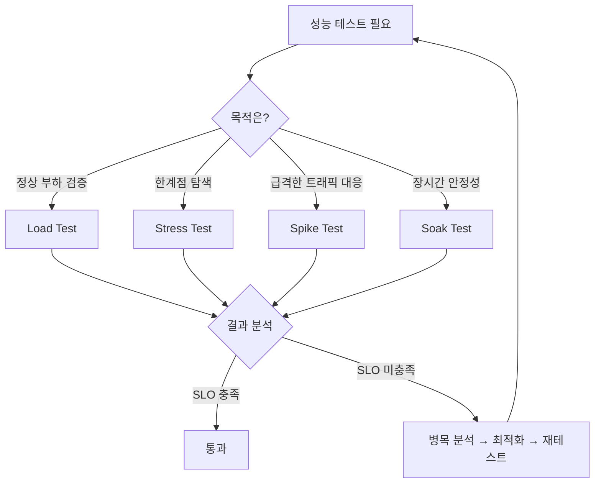

# 부하 테스트 종류 (Load / Stress / Spike / Soak Test)

부하 테스트는 시스템이 예상 트래픽과 극한 상황에서 어떻게 동작하는지 검증하는 핵심 품질 활동이다. 목적에 따라 Load, Stress, Spike, Soak 네 가지 유형으로 구분한다.

## 목차
- [1. 핵심 개념 (What)](#1-핵심-개념-what)
- [2. 왜 알아야 하는가 (Why)](#2-왜-알아야-하는가-why)
- [3. 내부 구현 분석 (How)](#3-내부-구현-분석-how)
- [4. 실전 예제](#4-실전-예제)
- [5. 정리](#5-정리)

---

## 1. 핵심 개념 (What)

### 1.1 Load Test (부하 테스트)

**정의**: 시스템이 **예상 동시 사용자 수**를 안정적으로 처리할 수 있는지 확인하는 테스트.

- 목표: 정상 운영 조건에서의 응답 시간, 처리량(TPS), 에러율 측정
- 패턴: 점진적으로 사용자를 증가시켜 목표 부하에 도달 후 일정 시간 유지
- 예시: "동시 사용자 1,000명이 10분간 API를 호출할 때 p95 응답 시간이 500ms 이하인가?"

```
VUs
 ^
 |        ┌─────────────────┐
 |       /                   \
 |      /                     \
 |     /                       \
 |    /                         \
 └───┴──────────────────────────┴──> time
    ramp-up    steady state   ramp-down
```

### 1.2 Stress Test (스트레스 테스트)

**정의**: 시스템의 **한계점(breaking point)**을 찾기 위해 정상 범위를 넘어서는 부하를 가하는 테스트.

- 목표: 시스템이 과부하 상태에서 어떻게 degradation 되는지, 복구 가능한지 확인
- 패턴: 목표 부하를 초과하여 계속 증가시키며 임계점 탐색
- 예시: "동시 사용자 5,000명까지 증가시켰을 때 시스템이 언제 응답 불능에 빠지는가?"

```
VUs
 ^
 |                    ╱ ← breaking point
 |                  ╱
 |                ╱
 |              ╱
 |            ╱
 |          ╱
 |        ╱
 |      ╱
 └─────┴────────────────────> time
      계속 증가
```

### 1.3 Spike Test (스파이크 테스트)

**정의**: **갑작스러운 트래픽 폭증**에 시스템이 어떻게 반응하는지 확인하는 테스트.

- 목표: 순간적인 급증 트래픽에 대한 시스템의 탄력성(elasticity) 검증
- 패턴: 매우 짧은 시간 내에 극단적으로 높은 부하를 가한 후 즉시 해제
- 예시: "타임딜 오픈 시 1초 만에 동시 접속자가 100에서 10,000으로 증가하면?"

```
VUs
 ^
 |     ┌┐
 |     ││
 |     ││
 |     ││
 |     ││
 |─────┘└──────────────> time
    급증     급감
```

### 1.4 Soak Test (내구 테스트)

**정의**: **장시간 동안 일정한 부하**를 가하여 메모리 누수, 리소스 고갈 등의 문제를 탐지하는 테스트.

- 목표: 시간이 경과함에 따라 발생하는 성능 저하(memory leak, connection leak 등) 발견
- 패턴: 중간 수준의 부하를 수 시간~수 일간 지속
- 예시: "동시 사용자 500명이 24시간 동안 지속적으로 요청할 때 메모리 사용량은 안정적인가?"

```
VUs
 ^
 |  ┌──────────────────────────────────┐
 |  │          장시간 유지               │
 |  │                                  │
 └──┴──────────────────────────────────┴──> time
        수 시간 ~ 수 일
```

## 2. 왜 알아야 하는가 (Why)

### 2.1 장애 예방

프로덕션 배포 전 성능 한계를 미리 파악하면 장애를 예방할 수 있다. 2022년 Twitter의 FIFA 월드컵 트래픽 폭증, 2023년 수능 성적 발표 시 교육부 시스템 장애 등은 모두 적절한 부하 테스트로 예방 가능한 사례였다.

### 2.2 용량 계획 (Capacity Planning)

Load Test 결과를 기반으로 서버 인스턴스 수, DB 커넥션 풀 크기, 캐시 전략 등의 인프라 의사결정을 데이터 기반으로 수행할 수 있다.

### 2.3 SLA/SLO 검증

서비스 수준 목표(SLO)에 정의된 응답 시간, 가용성 지표를 실제로 달성할 수 있는지 정량적으로 검증한다.

### 2.4 회귀 탐지

새로운 릴리스가 이전 버전 대비 성능 저하를 유발하는지 CI/CD 파이프라인에서 자동으로 확인한다.

## 3. 내부 구현 분석 (How)

### 3.1 테스트 유형 선택 플로우차트



### 3.2 각 테스트 유형별 발견 가능한 문제

| 테스트 유형 | 발견 가능한 문제 |
|------------|----------------|
| Load Test | 느린 쿼리, 부족한 인덱스, 캐시 miss율, 응답 시간 초과 |
| Stress Test | OOM(Out of Memory), Thread pool 고갈, 커넥션 풀 포화, 캐스케이드 장애 |
| Spike Test | Auto-scaling 지연, Cold start, 큐 백프레셔 실패, Rate limiter 오동작 |
| Soak Test | Memory leak, 커넥션 leak, 로그 디스크 가득 참, GC pause 증가 |

### 3.3 테스트 환경 구성 원칙

1. **프로덕션과 유사한 환경** 사용 (인프라 규모, 네트워크 구성)
2. **독립된 데이터셋** 준비 (실제와 유사한 데이터 볼륨)
3. **모니터링 스택 사전 구축** (Prometheus + Grafana, APM)
4. **베이스라인 수집** → 변경 후 비교

## 4. 실전 예제

### 4.1 k6로 Load Test 시나리오 구성

```javascript
import http from 'k6/http';
import { check, sleep } from 'k6';

export const options = {
  stages: [
    { duration: '2m', target: 100 },   // ramp-up: 2분간 100 VU까지
    { duration: '5m', target: 100 },   // steady: 5분간 유지
    { duration: '2m', target: 0 },     // ramp-down: 2분간 0으로
  ],
  thresholds: {
    http_req_duration: ['p(95)<500'],   // p95 응답시간 500ms 이하
    http_req_failed: ['rate<0.01'],     // 에러율 1% 미만
  },
};

export default function () {
  const res = http.get('https://api.example.com/products');
  check(res, {
    'status is 200': (r) => r.status === 200,
    'response time < 500ms': (r) => r.timings.duration < 500,
  });
  sleep(1); // think time
}
```

### 4.2 k6로 Stress Test 시나리오 구성

```javascript
export const options = {
  stages: [
    { duration: '2m', target: 100 },
    { duration: '5m', target: 100 },
    { duration: '2m', target: 200 },
    { duration: '5m', target: 200 },
    { duration: '2m', target: 300 },   // 정상 범위 초과
    { duration: '5m', target: 300 },
    { duration: '2m', target: 400 },   // breaking point 탐색
    { duration: '5m', target: 400 },
    { duration: '10m', target: 0 },    // recovery 관찰
  ],
};
```

### 4.3 k6로 Spike Test 시나리오 구성

```javascript
export const options = {
  stages: [
    { duration: '10s', target: 100 },   // warm-up
    { duration: '1m', target: 100 },
    { duration: '10s', target: 1400 },  // 급격한 증가
    { duration: '3m', target: 1400 },   // spike 유지
    { duration: '10s', target: 100 },   // 급격한 감소
    { duration: '3m', target: 100 },    // recovery 관찰
    { duration: '10s', target: 0 },
  ],
};
```

### 4.4 k6로 Soak Test 시나리오 구성

```javascript
export const options = {
  stages: [
    { duration: '5m', target: 200 },    // ramp-up
    { duration: '8h', target: 200 },    // 장시간 유지
    { duration: '5m', target: 0 },      // ramp-down
  ],
};
```

## 5. 정리

| 테스트 유형 | 목적 | 부하 패턴 | 기간 | 주요 지표 |
|------------|------|----------|------|----------|
| **Load Test** | 정상 부하 검증 | 점진 증가 → 유지 → 감소 | 10~30분 | TPS, p95 latency, error rate |
| **Stress Test** | 한계점 탐색 | 계단식 증가 | 30분~1시간 | breaking point VU, recovery time |
| **Spike Test** | 급증 대응력 | 급격한 증감 | 10~20분 | spike 시 error rate, recovery time |
| **Soak Test** | 장기 안정성 | 일정 부하 장시간 | 4~24시간 | memory trend, GC pause, connection count |

**테스트 순서 권장**: Load Test → Stress Test → Spike Test → Soak Test
- Load Test로 기본 성능 베이스라인 확보 후, 나머지 테스트를 순차적으로 진행하는 것이 효율적이다.

---
*참고: k6 v0.50+, Grafana k6 Cloud 기준*
