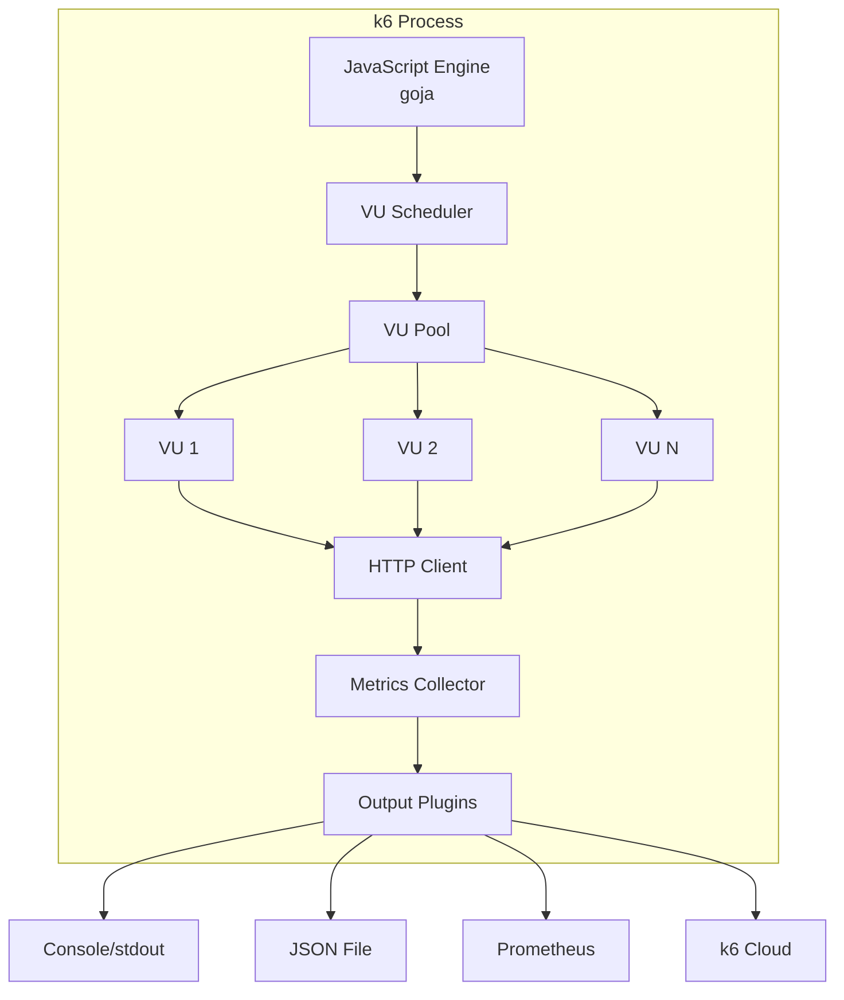

# k6 기초: 설치부터 첫 번째 테스트까지

k6는 Grafana Labs에서 개발한 오픈소스 부하 테스트 도구로, JavaScript(ES6+)로 테스트 스크립트를 작성하고 Go 런타임에서 실행하여 높은 성능을 제공한다.

## 목차
- [1. 핵심 개념 (What)](#1-핵심-개념-what)
- [2. 왜 알아야 하는가 (Why)](#2-왜-알아야-하는가-why)
- [3. 내부 구현 분석 (How)](#3-내부-구현-분석-how)
- [4. 실전 예제](#4-실전-예제)
- [5. 정리](#5-정리)

---

## 1. 핵심 개념 (What)

### 1.1 k6란?

k6는 **개발자 친화적인 부하 테스트 도구**다. 주요 특징:

- **JavaScript 기반 스크립트**: 테스트 로직을 JS로 작성 (단, Node.js 런타임이 아닌 Go 기반 goja 엔진)
- **CLI 우선**: 명령줄에서 바로 실행, CI/CD 통합 용이
- **Go 런타임**: 가벼운 goroutine 기반 VU 관리로 높은 성능
- **풍부한 프로토콜**: HTTP/1.1, HTTP/2, WebSocket, gRPC 지원
- **확장성**: xk6로 커스텀 확장 모듈 제작 가능

### 1.2 VU (Virtual User)와 Iteration

```
┌─────────────────────────────────────────┐
│                k6 Engine                 │
│                                         │
│  ┌─────┐  ┌─────┐  ┌─────┐  ┌─────┐   │
│  │VU 1 │  │VU 2 │  │VU 3 │  │VU N │   │
│  │iter 1│  │iter 1│  │iter 1│  │iter 1│  │
│  │iter 2│  │iter 2│  │iter 2│  │iter 2│  │
│  │ ...  │  │ ...  │  │ ...  │  │ ...  │  │
│  └─────┘  └─────┘  └─────┘  └─────┘   │
│                                         │
└─────────────────────────────────────────┘
```

- **VU (Virtual User)**: 동시에 활동하는 가상 사용자. 각 VU는 독립적으로 스크립트를 실행
- **Iteration**: VU가 `export default function`을 한 번 실행하는 것 = 1 iteration
- 각 VU는 순차적으로 iteration을 반복 실행 (한 iteration 완료 후 다음 시작)

### 1.3 Thresholds

**Thresholds**는 테스트 성공/실패 판단 기준이다. CI/CD에서 성능 게이트로 활용한다.

```javascript
export const options = {
  thresholds: {
    http_req_duration: ['p(95)<500'],      // 95% 요청이 500ms 이내
    http_req_failed: ['rate<0.01'],        // 실패율 1% 미만
    http_req_duration: ['avg<200', 'max<1000'], // 평균 200ms, 최대 1000ms
  },
};
```

### 1.4 Checks

**Checks**는 응답 내용을 검증하는 assertion이다. 실패해도 테스트를 중단하지 않고 통계에 기록한다.

```javascript
import { check } from 'k6';

check(response, {
  'status is 200': (r) => r.status === 200,
  'body contains expected': (r) => r.body.includes('success'),
  'response time OK': (r) => r.timings.duration < 300,
});
```

## 2. 왜 알아야 하는가 (Why)

### 2.1 개발자 친화적

- JMeter의 XML 기반 GUI와 달리 **코드로 테스트를 관리** (Git 버전 관리 가능)
- JavaScript 문법이므로 별도 언어 학습 불필요
- IDE 자동완성, 린팅, 코드 리뷰가 자연스럽게 가능

### 2.2 경량 고성능

- 단일 머신에서 **수만 VU**를 생성 가능 (JMeter 대비 10배 이상 메모리 효율)
- Go 기반 goroutine으로 VU를 관리하여 OS 스레드 부담 최소화

### 2.3 CI/CD 네이티브

- CLI 도구이므로 Docker 이미지, GitHub Actions, Jenkins 등에서 바로 실행
- Threshold 실패 시 non-zero exit code 반환 → 파이프라인 자동 실패 처리

### 2.4 확장 생태계

- **k6 Cloud**: 분산 부하 테스트 + 결과 시각화 SaaS
- **xk6**: SQL, Kafka, Redis 등 커스텀 프로토콜 확장
- **Grafana 연동**: Prometheus remote write로 실시간 대시보드

## 3. 내부 구현 분석 (How)

### 3.1 k6 아키텍처



### 3.2 설치 방법

**macOS (Homebrew)**:
```bash
brew install k6
```

**Docker**:
```bash
docker run --rm -i grafana/k6 run - < script.js
```

**Linux (apt)**:
```bash
sudo gpg -k
sudo gpg --no-default-keyring --keyring /usr/share/keyrings/k6-archive-keyring.gpg \
  --keyserver hkp://keyserver.ubuntu.com:80 --recv-keys C5AD17C747E3415A3642D57D77C6C491D6AC1D69
echo "deb [signed-by=/usr/share/keyrings/k6-archive-keyring.gpg] https://dl.k6.io/deb stable main" \
  | sudo tee /etc/apt/sources.list.d/k6.list
sudo apt-get update && sudo apt-get install k6
```

**Windows (Chocolatey)**:
```powershell
choco install k6
```

### 3.3 실행 명령어

```bash
# 기본 실행
k6 run script.js

# VU 수와 실행 시간 지정 (스크립트 옵션 덮어쓰기)
k6 run --vus 10 --duration 30s script.js

# 환경 변수 전달
k6 run -e BASE_URL=https://staging.example.com script.js

# JSON 결과 출력
k6 run --out json=results.json script.js
```

### 3.4 k6 생명주기 (Life Cycle)

```javascript
// 1. init 단계: 스크립트 파싱, 옵션/변수 초기화 (VU당 1회)
import http from 'k6/http';

const BASE_URL = __ENV.BASE_URL || 'http://localhost:8080';

// 2. setup 단계: 테스트 전 1회 실행 (데이터 준비 등)
export function setup() {
  const loginRes = http.post(`${BASE_URL}/auth/login`, JSON.stringify({
    username: 'testuser',
    password: 'testpass',
  }), { headers: { 'Content-Type': 'application/json' } });
  return { token: loginRes.json('token') };
}

// 3. VU 코드: 각 VU가 반복 실행하는 메인 함수
export default function (data) {
  const params = {
    headers: { Authorization: `Bearer ${data.token}` },
  };
  http.get(`${BASE_URL}/api/products`, params);
}

// 4. teardown 단계: 테스트 후 1회 실행 (리소스 정리 등)
export function teardown(data) {
  console.log('Test completed. Cleaning up...');
}
```

```
실행 순서:
init → setup() → default() × N iterations × M VUs → teardown()
```

### 3.5 주요 내장 메트릭

| 메트릭 이름 | 타입 | 설명 |
|------------|------|------|
| `http_reqs` | Counter | 총 HTTP 요청 수 |
| `http_req_duration` | Trend | 요청 소요 시간 (전체) |
| `http_req_waiting` | Trend | TTFB (Time To First Byte) |
| `http_req_connecting` | Trend | TCP 연결 시간 |
| `http_req_tls_handshaking` | Trend | TLS 핸드셰이크 시간 |
| `http_req_sending` | Trend | 요청 전송 시간 |
| `http_req_receiving` | Trend | 응답 수신 시간 |
| `http_req_blocked` | Trend | 요청 대기 시간 (DNS + 커넥션) |
| `http_req_failed` | Rate | 실패율 (non-2xx 또는 에러) |
| `vus` | Gauge | 현재 활성 VU 수 |
| `vus_max` | Gauge | 최대 VU 수 |
| `iterations` | Counter | 완료된 iteration 수 |
| `iteration_duration` | Trend | iteration당 소요 시간 |

## 4. 실전 예제

### 4.1 첫 번째 k6 테스트

```javascript
// hello.js
import http from 'k6/http';
import { check, sleep } from 'k6';

export const options = {
  vus: 5,
  duration: '10s',
};

export default function () {
  const res = http.get('https://httpbin.test.k6.io/get');

  check(res, {
    'status is 200': (r) => r.status === 200,
  });

  sleep(1);
}
```

실행:
```bash
k6 run hello.js
```

출력 예시:
```
          /\      |‾‾| /‾‾/   /‾‾/
     /\  /  \     |  |/  /   /  /
    /  \/    \    |     (   /   ‾‾\
   /          \   |  |\  \ |  (‾)  |
  / __________ \  |__| \__\ \_____/ .io

  execution: local
     script: hello.js
     output: -

  scenarios: (100.00%) 1 scenario, 5 max VUs, 40s max duration
           default: 5 looping VUs for 10s

  ✓ status is 200

  checks.....................: 100.00% ✓ 45  ✗ 0
  http_req_duration..........: avg=120.5ms  min=98.2ms  max=250.1ms  p(90)=150ms  p(95)=180ms
  http_reqs..................: 45     4.5/s
  iteration_duration.........: avg=1.12s    min=1.09s   max=1.25s
  vus........................: 5      min=5  max=5
  vus_max....................: 5      min=5  max=5
```

### 4.2 Threshold로 성능 게이트 설정

```javascript
import http from 'k6/http';
import { check } from 'k6';

export const options = {
  stages: [
    { duration: '1m', target: 50 },
    { duration: '3m', target: 50 },
    { duration: '1m', target: 0 },
  ],
  thresholds: {
    http_req_duration: ['p(95)<500', 'p(99)<1000'],
    http_req_failed: ['rate<0.05'],
    checks: ['rate>0.95'],
  },
};

export default function () {
  const res = http.get('http://localhost:8080/api/users');

  check(res, {
    'status 200': (r) => r.status === 200,
    'body not empty': (r) => r.body.length > 0,
  });
}
```

Threshold 실패 시 k6는 exit code 99를 반환한다:
```bash
k6 run script.js
echo $?  # 0이면 통과, 99이면 threshold 실패
```

### 4.3 Group과 Tag로 요청 분류

```javascript
import http from 'k6/http';
import { group } from 'k6';

export default function () {
  group('로그인 플로우', function () {
    http.post('http://localhost:8080/auth/login',
      JSON.stringify({ username: 'user1', password: 'pass' }),
      { headers: { 'Content-Type': 'application/json' }, tags: { name: 'login' } }
    );
  });

  group('상품 조회', function () {
    http.get('http://localhost:8080/api/products', {
      tags: { name: 'product-list' },
    });

    http.get('http://localhost:8080/api/products/1', {
      tags: { name: 'product-detail' },
    });
  });
}
```

## 5. 정리

| 항목 | 내용 |
|------|------|
| **언어** | JavaScript (ES6+), Go 기반 goja 엔진에서 실행 |
| **핵심 개념** | VU(가상 사용자), Iteration(반복 실행), Threshold(성공 기준), Check(응답 검증) |
| **생명주기** | init → setup → default (반복) → teardown |
| **실행 방식** | CLI 우선, Docker 지원, CI/CD 친화적 |
| **장점** | 코드 기반 관리, 경량 고성능, 풍부한 생태계 |
| **출력** | Console, JSON, CSV, Prometheus, k6 Cloud |
| **주의사항** | Node.js API 사용 불가 (fs, path 등), npm 모듈 직접 import 불가 |

---
*참고: k6 v0.50+, Grafana k6 기준*
