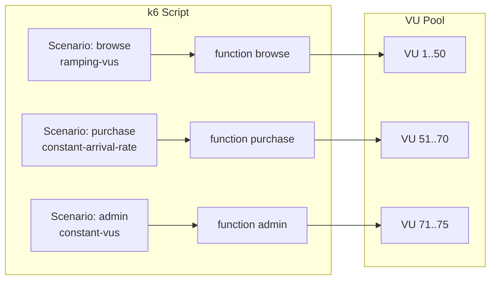

# k6 스크립트 작성: 시나리오, 파라미터화, 커스텀 메트릭

k6 스크립트의 고급 기능을 활용하여 실제 사용자 행동을 정밀하게 모사하고, 테스트 결과를 세밀하게 분석하는 방법을 다룬다.

## 목차
- [1. 핵심 개념 (What)](#1-핵심-개념-what)
- [2. 왜 알아야 하는가 (Why)](#2-왜-알아야-하는가-why)
- [3. 내부 구현 분석 (How)](#3-내부-구현-분석-how)
- [4. 실전 예제](#4-실전-예제)
- [5. 정리](#5-정리)

---

## 1. 핵심 개념 (What)

### 1.1 Scenarios

**Scenarios**는 k6 v0.27+에서 도입된 기능으로, 하나의 스크립트에서 **여러 독립적인 부하 패턴**을 정의할 수 있다.

주요 Executor 종류:

| Executor | 설명 | 제어 방식 |
|----------|------|----------|
| `shared-iterations` | 고정 iteration을 VU들이 분배 | iteration 수 |
| `per-vu-iterations` | 각 VU가 고정 iteration 실행 | VU당 iteration 수 |
| `constant-vus` | 고정 VU 수로 일정 시간 실행 | VU 수 + 시간 |
| `ramping-vus` | stages로 VU를 조절 | stage별 target VU |
| `constant-arrival-rate` | 초당 고정 요청률 유지 | rate + timeUnit |
| `ramping-arrival-rate` | stages로 요청률을 조절 | stage별 target rate |
| `externally-controlled` | REST API로 외부에서 VU 제어 | 외부 HTTP 명령 |

### 1.2 데이터 파라미터화

테스트에 동적 데이터를 주입하는 방법:

- **SharedArray**: init 단계에서 데이터 로드, 모든 VU가 공유 (메모리 효율적)
- **JSON/CSV 파일**: 외부 데이터 파일 로드
- **환경 변수**: `__ENV` 객체로 접근

### 1.3 커스텀 메트릭

k6 내장 메트릭 외에 비즈니스 로직에 맞는 **사용자 정의 메트릭**을 생성할 수 있다:

- `Counter`: 누적 카운터
- `Gauge`: 현재 값
- `Rate`: 비율 (true/false 비율)
- `Trend`: 시계열 통계 (min, max, avg, percentile)

## 2. 왜 알아야 하는가 (Why)

### 2.1 현실적인 부하 패턴 재현

실제 서비스는 단일 API 호출이 아니라 **여러 사용자 유형이 다른 패턴으로 동시에** 접근한다:
- 일반 사용자: 상품 검색 → 상세 조회 → 장바구니 → 결제
- 관리자: 대시보드 조회 → 데이터 export
- API 클라이언트: 높은 빈도의 단순 조회

Scenarios를 사용하면 이런 혼합 워크로드를 하나의 스크립트로 표현할 수 있다.

### 2.2 정확한 TPS 제어

`constant-arrival-rate`를 사용하면 **초당 정확한 요청 수**를 보장한다. VU 기반 테스트는 응답 시간에 따라 실제 TPS가 변동하지만, arrival rate 기반은 고정 TPS를 유지한다.

### 2.3 비즈니스 메트릭 추적

"로그인 성공률", "결제 완료율" 등 비즈니스 관점의 메트릭을 커스텀으로 정의하면 성능 테스트 결과의 의미가 풍부해진다.

## 3. 내부 구현 분석 (How)

### 3.1 Scenario 실행 모델



### 3.2 Arrival Rate vs VU-based 차이

```
VU-based (constant-vus):
  VU 완료 → 즉시 다음 iteration → 응답이 느리면 TPS 감소
  TPS = VUs / avg_response_time

Arrival Rate (constant-arrival-rate):
  타이머가 일정 간격으로 iteration 시작 → 응답 속도와 무관하게 TPS 유지
  필요 시 pre-allocated VU에서 새 iteration 할당
  응답이 느리면 VU 부족 → dropped iterations 발생
```

### 3.3 SharedArray 메모리 모델

```
┌──────────────────────┐
│    SharedArray       │  ← init 단계에서 1회 로드
│  (메모리 1 copy)     │
├──────────────────────┤
│ VU 1 → read-only    │
│ VU 2 → read-only    │
│ VU N → read-only    │
└──────────────────────┘

vs. 일반 변수:
┌─────┐ ┌─────┐ ┌─────┐
│VU 1 │ │VU 2 │ │VU N │  ← 각 VU마다 복사본
│data │ │data │ │data │
└─────┘ └─────┘ └─────┘
```

## 4. 실전 예제

### 4.1 Multi-Scenario: 혼합 워크로드

```javascript
import http from 'k6/http';
import { check, sleep } from 'k6';

const BASE_URL = __ENV.BASE_URL || 'http://localhost:8080';

export const options = {
  scenarios: {
    // 시나리오 1: 일반 사용자 브라우징 (점진 증가)
    browse: {
      executor: 'ramping-vus',
      exec: 'browseProducts',
      startVUs: 0,
      stages: [
        { duration: '2m', target: 50 },
        { duration: '5m', target: 50 },
        { duration: '2m', target: 0 },
      ],
      gracefulRampDown: '30s',
    },
    // 시나리오 2: 구매 플로우 (고정 TPS)
    purchase: {
      executor: 'constant-arrival-rate',
      exec: 'purchaseFlow',
      rate: 10,               // 초당 10 iteration
      timeUnit: '1s',
      duration: '9m',
      preAllocatedVUs: 20,    // 사전 할당 VU
      maxVUs: 50,             // 최대 VU
    },
    // 시나리오 3: 관리자 대시보드 (소수 사용자)
    admin: {
      executor: 'constant-vus',
      exec: 'adminDashboard',
      vus: 3,
      duration: '9m',
    },
  },
  thresholds: {
    'http_req_duration{scenario:browse}': ['p(95)<300'],
    'http_req_duration{scenario:purchase}': ['p(95)<1000'],
    'http_req_duration{scenario:admin}': ['p(95)<2000'],
  },
};

export function browseProducts() {
  http.get(`${BASE_URL}/api/products`);
  sleep(Math.random() * 3 + 1); // 1~4초 think time
  const productId = Math.floor(Math.random() * 100) + 1;
  http.get(`${BASE_URL}/api/products/${productId}`);
  sleep(Math.random() * 2 + 1);
}

export function purchaseFlow() {
  // 상품 조회
  const listRes = http.get(`${BASE_URL}/api/products`);
  check(listRes, { 'browse 200': (r) => r.status === 200 });

  // 장바구니 추가
  const cartRes = http.post(`${BASE_URL}/api/cart`,
    JSON.stringify({ productId: 1, quantity: 1 }),
    { headers: { 'Content-Type': 'application/json' } }
  );
  check(cartRes, { 'add to cart 200': (r) => r.status === 200 });

  // 결제
  const orderRes = http.post(`${BASE_URL}/api/orders`,
    JSON.stringify({ cartId: cartRes.json('cartId') }),
    { headers: { 'Content-Type': 'application/json' } }
  );
  check(orderRes, { 'order created': (r) => r.status === 201 });
}

export function adminDashboard() {
  http.get(`${BASE_URL}/admin/dashboard`);
  sleep(5); // 관리자는 느리게 조회
  http.get(`${BASE_URL}/admin/reports/daily`);
  sleep(10);
}
```

### 4.2 데이터 파라미터화: SharedArray + CSV

**users.csv**:
```csv
username,password
user1,pass123
user2,pass456
user3,pass789
```

**script.js**:
```javascript
import http from 'k6/http';
import { SharedArray } from 'k6/data';
import papaparse from 'https://jslib.k6.io/papaparse/5.1.1/index.js';

// SharedArray: init 단계에서 1회만 파싱, 전 VU 공유
const users = new SharedArray('users', function () {
  return papaparse.parse(open('./users.csv'), { header: true }).data;
});

export const options = {
  vus: 10,
  duration: '1m',
};

export default function () {
  // VU별로 다른 사용자 데이터 사용
  const user = users[__VU % users.length];

  const res = http.post('http://localhost:8080/auth/login',
    JSON.stringify({
      username: user.username,
      password: user.password,
    }),
    { headers: { 'Content-Type': 'application/json' } }
  );
}
```

### 4.3 데이터 파라미터화: JSON 파일

**products.json**:
```json
[
  { "id": 1, "name": "Product A", "category": "electronics" },
  { "id": 2, "name": "Product B", "category": "clothing" },
  { "id": 3, "name": "Product C", "category": "books" }
]
```

**script.js**:
```javascript
import { SharedArray } from 'k6/data';

const products = new SharedArray('products', function () {
  return JSON.parse(open('./products.json'));
});

export default function () {
  const randomProduct = products[Math.floor(Math.random() * products.length)];
  http.get(`http://localhost:8080/api/products/${randomProduct.id}`);
}
```

### 4.4 커스텀 메트릭

```javascript
import http from 'k6/http';
import { check } from 'k6';
import { Counter, Gauge, Rate, Trend } from 'k6/metrics';

// 커스텀 메트릭 정의
const loginSuccessRate = new Rate('login_success_rate');
const orderCount = new Counter('orders_total');
const activeCartItems = new Gauge('active_cart_items');
const checkoutDuration = new Trend('checkout_duration');

export const options = {
  vus: 20,
  duration: '5m',
  thresholds: {
    login_success_rate: ['rate>0.95'],       // 로그인 성공률 95% 이상
    orders_total: ['count>100'],              // 총 주문 100건 이상
    checkout_duration: ['p(95)<3000'],        // 결제 소요시간 p95 < 3초
  },
};

export default function () {
  // 로그인
  const loginRes = http.post('http://localhost:8080/auth/login',
    JSON.stringify({ username: 'testuser', password: 'pass' }),
    { headers: { 'Content-Type': 'application/json' } }
  );
  loginSuccessRate.add(loginRes.status === 200);

  if (loginRes.status !== 200) return;

  // 장바구니
  const cartRes = http.get('http://localhost:8080/api/cart');
  activeCartItems.add(cartRes.json('items').length);

  // 결제 (소요시간 측정)
  const checkoutStart = Date.now();
  const orderRes = http.post('http://localhost:8080/api/orders',
    JSON.stringify({ cartId: 'cart-123' }),
    { headers: { 'Content-Type': 'application/json' } }
  );
  checkoutDuration.add(Date.now() - checkoutStart);

  if (orderRes.status === 201) {
    orderCount.add(1);
  }
}
```

### 4.5 결과 분석: JSON 출력 + 외부 도구

```bash
# JSON 파일로 결과 출력
k6 run --out json=results.json script.js

# CSV 파일로 출력
k6 run --out csv=results.csv script.js

# Prometheus remote write (Grafana 연동)
k6 run --out experimental-prometheus-rw script.js
```

**k6 결과 요약 읽는 법**:
```
http_req_duration..........: avg=145.2ms  min=12.1ms  med=120.5ms  max=2.1s  p(90)=250ms  p(95)=380ms
```
- `avg`: 평균 (이상치에 민감, 참고용)
- `med` (p50): 중앙값 (일반적인 사용자 경험)
- `p(90)`: 90%의 요청이 이 값 이하
- `p(95)`: SLO 기준으로 가장 많이 사용
- `max`: 최악의 경우 (이상치 포함)

## 5. 정리

| 기능 | 용도 | 핵심 포인트 |
|------|------|------------|
| **Scenarios** | 혼합 워크로드 모델링 | executor별 부하 패턴 차이 이해, scenario별 threshold 설정 |
| **SharedArray** | 대량 테스트 데이터 로드 | init 단계 로드, 메모리 1 copy 공유, read-only |
| **CSV/JSON 파라미터화** | 동적 데이터 주입 | open()은 init 단계에서만, SharedArray와 조합 |
| **커스텀 메트릭** | 비즈니스 메트릭 추적 | Counter/Gauge/Rate/Trend 4종, threshold 연동 |
| **Arrival Rate** | 정확한 TPS 제어 | VU 사전 할당 필요, dropped iterations 주의 |
| **결과 출력** | 외부 분석 도구 연동 | JSON, CSV, Prometheus, k6 Cloud |

---
*참고: k6 v0.50+, k6/data, k6/metrics 모듈 기준*
