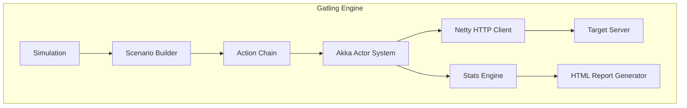

# Gatling 기초: 설치부터 시뮬레이션 작성과 리포트 해석까지

Gatling은 Scala/Java 기반의 고성능 부하 테스트 도구로, 코드 기반 시나리오 작성과 상세한 HTML 리포트를 제공한다.

## 목차
- [1. 핵심 개념 (What)](#1-핵심-개념-what)
- [2. 왜 알아야 하는가 (Why)](#2-왜-알아야-하는가-why)
- [3. 내부 구현 분석 (How)](#3-내부-구현-분석-how)
- [4. 실전 예제](#4-실전-예제)
- [5. 정리](#5-정리)

---

## 1. 핵심 개념 (What)

### 1.1 Gatling이란?

Gatling은 **비동기 이벤트 기반** 아키텍처를 사용하는 부하 테스트 프레임워크다:

- **Scala DSL / Java DSL**: 타입 안전한 시나리오 작성
- **Akka 기반**: Actor 모델로 수천 개의 동시 연결을 효율적 관리
- **Netty**: 비동기 HTTP 클라이언트로 높은 처리량
- **자동 HTML 리포트**: 테스트 완료 후 상세한 시각적 리포트 생성

### 1.2 핵심 구성 요소

```
┌───────────────────────────────────────────────┐
│                Simulation                      │
│  ┌─────────────────────────────────────────┐  │
│  │  Scenario: "사용자 시나리오"              │  │
│  │  ┌─────────┐  ┌─────────┐  ┌─────────┐ │  │
│  │  │ Action  │→│ Action  │→│ Action  │ │  │
│  │  │ (HTTP)  │  │ (Pause) │  │ (HTTP)  │ │  │
│  │  └─────────┘  └─────────┘  └─────────┘ │  │
│  └─────────────────────────────────────────┘  │
│  ┌─────────────────────────────────────────┐  │
│  │  Injection Profile                      │  │
│  │  (부하 주입 패턴)                        │  │
│  └─────────────────────────────────────────┘  │
│  ┌─────────────────────────────────────────┐  │
│  │  Assertions                             │  │
│  │  (성능 기준)                             │  │
│  └─────────────────────────────────────────┘  │
└───────────────────────────────────────────────┘
```

- **Simulation**: 전체 테스트 정의 (시나리오 + 부하 프로파일 + assertion)
- **Scenario**: 사용자 행동 정의 (HTTP 요청, pause, 조건 분기 등)
- **Injection Profile**: 가상 사용자 주입 패턴 (ramp-up, constant 등)
- **Assertion**: 테스트 통과/실패 기준 (p95 latency, 에러율 등)
- **Feeder**: 테스트 데이터 공급 (CSV, JSON, JDBC 등)
- **Session**: 각 가상 사용자의 상태 저장소 (변수, 토큰 등)

### 1.3 k6 vs Gatling 비교

| 항목 | k6 | Gatling |
|------|-----|---------|
| 언어 | JavaScript | Scala / Java / Kotlin |
| 런타임 | Go (goja) | JVM (Akka + Netty) |
| 아키텍처 | goroutine 기반 | Actor 모델 기반 |
| 리포트 | Console + 외부 도구 | 내장 HTML 리포트 |
| 리소스 효율 | 매우 높음 | 높음 (JVM 오버헤드) |
| 학습 곡선 | 낮음 | 중간 (Scala DSL) |
| 프로토콜 | HTTP, WS, gRPC | HTTP, WS, JMS, MQTT |
| CI/CD 통합 | CLI + exit code | Maven/Gradle + exit code |
| 유료 버전 | k6 Cloud | Gatling Enterprise |

## 2. 왜 알아야 하는가 (Why)

### 2.1 JVM 생태계 통합

Spring Boot, Jakarta EE 등 JVM 기반 프로젝트에서는 Gatling이 빌드 도구(Maven/Gradle)에 자연스럽게 통합된다.

### 2.2 풍부한 내장 리포트

별도 도구 없이 테스트 완료 후 **상세한 HTML 리포트**가 자동 생성된다:
- 응답 시간 분포 히스토그램
- 초당 요청/응답 그래프
- Active users over time
- 개별 요청별 통계

### 2.3 타입 안전성

Scala/Java DSL은 IDE 자동완성과 컴파일 타임 검증이 가능하여 복잡한 시나리오에서 실수를 줄여준다.

### 2.4 엔터프라이즈 지원

Gatling Enterprise(유료)는 분산 부하 테스트, 실시간 모니터링, 팀 협업 기능을 제공한다.

## 3. 내부 구현 분석 (How)

### 3.1 Gatling 아키텍처



### 3.2 설치 방법

**방법 1: Standalone Bundle**
```bash
# 다운로드 후 압축 해제
wget https://repo1.maven.org/maven2/io/gatling/highcharts/gatling-charts-highcharts-bundle/3.10.3/gatling-charts-highcharts-bundle-3.10.3.zip
unzip gatling-charts-highcharts-bundle-3.10.3.zip
cd gatling-charts-highcharts-bundle-3.10.3

# 실행
./bin/gatling.sh
```

**방법 2: Maven 프로젝트**
```xml
<dependencies>
    <dependency>
        <groupId>io.gatling.highcharts</groupId>
        <artifactId>gatling-charts-highcharts</artifactId>
        <version>3.10.3</version>
        <scope>test</scope>
    </dependency>
</dependencies>

<build>
    <plugins>
        <plugin>
            <groupId>io.gatling</groupId>
            <artifactId>gatling-maven-plugin</artifactId>
            <version>4.8.0</version>
        </plugin>
    </plugins>
</build>
```

**방법 3: Gradle 프로젝트**
```groovy
plugins {
    id 'io.gatling.gradle' version '3.10.3'
}

dependencies {
    gatling 'io.gatling.highcharts:gatling-charts-highcharts:3.10.3'
}
```

### 3.3 프로젝트 구조

```
src/
├── test/
│   ├── java/           (또는 scala/)
│   │   └── simulations/
│   │       └── MySimulation.java
│   └── resources/
│       ├── bodies/     # 요청 바디 템플릿
│       ├── data/       # CSV, JSON 피더 데이터
│       └── gatling.conf  # Gatling 설정
```

### 3.4 Injection Profile 종류

| 프로파일 | 설명 | 예시 |
|---------|------|------|
| `atOnceUsers(n)` | n명 즉시 투입 | `atOnceUsers(100)` |
| `rampUsers(n).during(d)` | d 동안 n명 점진 투입 | `rampUsers(100).during(60)` |
| `constantUsersPerSec(r).during(d)` | 초당 r명씩 d 동안 투입 | `constantUsersPerSec(10).during(120)` |
| `rampUsersPerSec(r1).to(r2).during(d)` | 초당 r1→r2명으로 증가 | `rampUsersPerSec(1).to(20).during(60)` |
| `stressPeakUsers(n).during(d)` | d 동안 피크 n명 (정규분포) | `stressPeakUsers(500).during(30)` |
| `nothingFor(d)` | d 동안 대기 | `nothingFor(10)` |

## 4. 실전 예제

### 4.1 Java DSL: 기본 시뮬레이션

```java
package simulations;

import io.gatling.javaapi.core.*;
import io.gatling.javaapi.http.*;
import static io.gatling.javaapi.core.CoreDsl.*;
import static io.gatling.javaapi.http.HttpDsl.*;

public class BasicSimulation extends Simulation {

    // HTTP 프로토콜 설정
    HttpProtocolBuilder httpProtocol = http
        .baseUrl("http://localhost:8080")
        .acceptHeader("application/json")
        .contentTypeHeader("application/json")
        .userAgentHeader("Gatling/Performance Test");

    // 시나리오 정의
    ScenarioBuilder scn = scenario("기본 API 테스트")
        .exec(
            http("상품 목록 조회")
                .get("/api/products")
                .check(status().is(200))
                .check(jsonPath("$[0].id").saveAs("productId"))
        )
        .pause(1, 3) // 1~3초 랜덤 대기
        .exec(
            http("상품 상세 조회")
                .get("/api/products/#{productId}")
                .check(status().is(200))
                .check(jsonPath("$.name").exists())
        );

    // 부하 프로파일 + Assertion
    {
        setUp(
            scn.injectOpen(
                rampUsers(100).during(60) // 60초 동안 100명 점진 투입
            )
        )
        .protocols(httpProtocol)
        .assertions(
            global().responseTime().percentile3().lt(500), // p95 < 500ms
            global().successfulRequests().percent().gt(95.0) // 성공률 > 95%
        );
    }
}
```

### 4.2 Java DSL: Feeder를 이용한 데이터 주입

```java
public class FeederSimulation extends Simulation {

    HttpProtocolBuilder httpProtocol = http
        .baseUrl("http://localhost:8080")
        .contentTypeHeader("application/json");

    // CSV Feeder
    FeederBuilder<String> userFeeder = csv("data/users.csv").random();

    // JSON Feeder
    FeederBuilder<Object> productFeeder = jsonFile("data/products.json").circular();

    ScenarioBuilder scn = scenario("데이터 주입 테스트")
        // 사용자 데이터 피드
        .feed(userFeeder)
        .exec(
            http("로그인")
                .post("/auth/login")
                .body(StringBody("""
                    {"username": "#{username}", "password": "#{password}"}
                """))
                .check(status().is(200))
                .check(jsonPath("$.token").saveAs("authToken"))
        )
        .pause(1)
        // 상품 데이터 피드
        .feed(productFeeder)
        .exec(
            http("상품 조회")
                .get("/api/products/#{productId}")
                .header("Authorization", "Bearer #{authToken}")
                .check(status().is(200))
        );

    {
        setUp(
            scn.injectOpen(
                constantUsersPerSec(5).during(120)
            )
        ).protocols(httpProtocol);
    }
}
```

### 4.3 Scala DSL: 고급 시나리오

```scala
package simulations

import io.gatling.core.Predef._
import io.gatling.http.Predef._
import scala.concurrent.duration._

class AdvancedSimulation extends Simulation {

  val httpProtocol = http
    .baseUrl("http://localhost:8080")
    .acceptHeader("application/json")

  // 혼합 시나리오: 여러 사용자 유형
  val browseScenario = scenario("일반 사용자")
    .exec(
      http("홈페이지").get("/").check(status.is(200))
    )
    .pause(2, 5)
    .repeat(3) {
      exec(
        http("상품 검색").get("/api/products?q=phone")
          .check(jsonPath("$[*].id").findAll.saveAs("productIds"))
      )
      .pause(1, 2)
      .exec { session =>
        val ids = session("productIds").as[Vector[String]]
        val randomId = ids(util.Random.nextInt(ids.length))
        session.set("selectedId", randomId)
      }
      .exec(
        http("상품 상세").get("/api/products/#{selectedId}")
      )
      .pause(2, 4)
    }

  val purchaseScenario = scenario("구매 사용자")
    .exec(
      http("로그인").post("/auth/login")
        .body(StringBody("""{"username":"buyer","password":"pass"}"""))
        .check(jsonPath("$.token").saveAs("token"))
    )
    .exec(
      http("장바구니 추가").post("/api/cart")
        .header("Authorization", "Bearer #{token}")
        .body(StringBody("""{"productId":1,"quantity":1}"""))
        .check(status.is(200))
    )
    .exec(
      http("결제").post("/api/orders")
        .header("Authorization", "Bearer #{token}")
        .body(StringBody("""{"cartId":"cart-1"}"""))
        .check(status.in(200, 201))
    )

  setUp(
    browseScenario.inject(
      rampUsers(200).during(120.seconds)
    ),
    purchaseScenario.inject(
      constantUsersPerSec(5).during(120.seconds)
    )
  ).protocols(httpProtocol)
   .assertions(
     global.responseTime.percentile3.lt(1000),
     forAll.failedRequests.percent.lt(5.0)
   )
}
```

### 4.4 HTML 리포트 해석

Gatling 실행 후 `target/gatling/{simulation-name}/index.html`에 리포트가 생성된다.

**리포트 구성 요소**:

| 섹션 | 내용 | 확인 포인트 |
|------|------|------------|
| **Global Information** | 전체 요청 수, 성공/실패 수, 응답 시간 통계 | p95, p99 응답 시간 |
| **Response Time Distribution** | 응답 시간 히스토그램 | 분포의 꼬리(tail) 확인 |
| **Response Time Percentiles over Time** | 시간별 percentile 추이 | 특정 시점에서 급격한 증가 탐지 |
| **Number of Requests per Second** | 초당 요청 수 그래프 | TPS 패턴과 안정성 확인 |
| **Number of Responses per Second** | 초당 응답 수 그래프 | 요청-응답 갭 확인 |
| **Active Users over Time** | 시간별 활성 사용자 수 | injection profile 확인 |
| **Request Details** | 개별 요청별 상세 통계 | 느린 요청 식별 |

**리포트 실행**:
```bash
# Maven
mvn gatling:test

# Gradle
gradle gatlingRun

# Standalone
./bin/gatling.sh -s simulations.BasicSimulation
```

## 5. 정리

| 항목 | 내용 |
|------|------|
| **정의** | Scala/Java 기반 비동기 이벤트 기반 부하 테스트 프레임워크 |
| **아키텍처** | Akka Actor + Netty (비동기, 높은 동시성) |
| **DSL** | Java DSL (3.7+), Scala DSL, Kotlin DSL |
| **Feeder** | CSV, JSON, JDBC, Redis 등 다양한 데이터 소스 |
| **Injection** | atOnceUsers, rampUsers, constantUsersPerSec 등 |
| **Assertion** | responseTime, successfulRequests, failedRequests 기준 |
| **리포트** | 내장 HTML 리포트 (히스토그램, 시계열, percentile) |
| **빌드 통합** | Maven/Gradle 플러그인, CI/CD exit code 기반 판정 |
| **적합 환경** | JVM 프로젝트, 상세 리포트 필요, 엔터프라이즈 환경 |

---
*참고: Gatling 3.10.x, Java DSL 기준*
