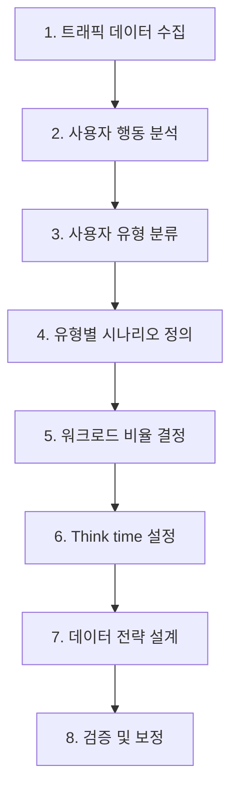

# 테스트 시나리오 설계: 사용자 행동 패턴 기반 워크로드 모델링

실제 사용자 행동을 정밀하게 모사하는 부하 테스트 시나리오를 설계하는 방법론을 다룬다. 워크로드 모델링, think time, ramp-up 전략 등 현실적인 시나리오 구성의 핵심 요소를 설명한다.

## 목차
- [1. 핵심 개념 (What)](#1-핵심-개념-what)
- [2. 왜 알아야 하는가 (Why)](#2-왜-알아야-하는가-why)
- [3. 내부 구현 분석 (How)](#3-내부-구현-분석-how)
- [4. 실전 예제](#4-실전-예제)
- [5. 정리](#5-정리)

---

## 1. 핵심 개념 (What)

### 1.1 워크로드 모델링이란?

**워크로드 모델링**은 실제 서비스의 트래픽 패턴을 분석하여 부하 테스트 시나리오로 변환하는 과정이다.

```
실제 트래픽 분석                     테스트 시나리오
┌──────────────────┐              ┌──────────────────┐
│ 로그/APM 데이터   │              │ VU 수             │
│ 사용자 행동 흐름   │  ──변환──>  │ 요청 비율          │
│ 피크 타임 패턴     │              │ Think time        │
│ API 호출 비율     │              │ 시나리오 분배      │
└──────────────────┘              └──────────────────┘
```

### 1.2 Open Model vs Closed Model

부하 모델은 크게 두 가지로 나뉜다:

**Closed Model (폐쇄 모델)**:
- 고정된 수의 VU가 반복적으로 요청
- 응답이 느려지면 자동으로 TPS 감소 (back-pressure)
- 대부분의 기본 k6/Gatling 설정이 이 모델
- 예: `constant-vus`, `ramping-vus`

**Open Model (개방 모델)**:
- 일정한 비율로 새로운 사용자가 계속 도착
- 응답 속도와 무관하게 부하 유지 → 더 현실적
- 시스템 과부하 시 queue 증가 + timeout
- 예: k6 `constant-arrival-rate`, Gatling `constantUsersPerSec`

```
Closed Model:                    Open Model:
┌────┐  완료   ┌────┐           도착 ──> ┌────┐  완료
│VU 1│ ──────> │VU 1│           도착 ──> │VU 2│  완료
│    │ 재시작  │    │           도착 ──> │VU 3│  완료
└────┘         └────┘           도착 ──> │VU 4│  (대기...)
 VU 수 고정                      도착 비율 고정
```

### 1.3 Think Time

**Think Time**은 사용자가 실제로 화면을 보고, 읽고, 다음 행동을 결정하는 데 걸리는 시간이다.

- 페이지 읽기: 3~10초
- 폼 입력: 10~30초
- 검색 결과 검토: 5~15초
- 결제 정보 입력: 20~60초

Think time이 없으면 비현실적으로 높은 부하가 발생하여 테스트 결과의 신뢰성이 떨어진다.

### 1.4 Ramp-up 전략

**Ramp-up**은 부하를 점진적으로 증가시키는 패턴이다:

| 전략 | 설명 | 용도 |
|------|------|------|
| Linear ramp-up | 일정 속도로 VU 증가 | 일반적인 Load Test |
| Step ramp-up | 단계별로 VU 증가 (계단식) | Stress Test, 한계점 탐색 |
| Exponential ramp-up | 지수적으로 VU 증가 | Spike Test |
| No ramp-up | 즉시 전체 VU 투입 | Spike Test, 최악의 경우 |

## 2. 왜 알아야 하는가 (Why)

### 2.1 비현실적 테스트의 위험

잘못된 시나리오 설계의 결과:
- **Think time 없이 단일 API 반복 호출**: 실제 TPS의 10~100배 부하 → 불필요한 인프라 확장 결정
- **단일 사용자 유형만 테스트**: 실제 혼합 트래픽에서의 리소스 경합 미발견
- **데이터 편향**: 같은 데이터만 요청 → 캐시 적중률 과대 평가

### 2.2 정확한 용량 계획

현실적인 시나리오가 있어야 정확한 서버 용량을 산출할 수 있다:
```
필요 서버 수 = 목표 TPS / (단일 서버 최대 TPS × 안전 계수)
```
시나리오가 비현실적이면 이 계산 자체가 의미 없다.

### 2.3 숨겨진 병목 발견

혼합 워크로드에서만 발생하는 문제:
- 읽기/쓰기 동시 실행 시 DB Lock 경합
- 대량 조회와 결제 동시 실행 시 Thread pool 고갈
- 캐시 갱신과 조회의 race condition

## 3. 내부 구현 분석 (How)

### 3.1 시나리오 설계 프로세스



### 3.2 Step 1: 트래픽 데이터 수집

데이터 소스별 수집 항목:

| 소스 | 수집 항목 |
|------|----------|
| **Access Log** | URL별 호출 빈도, 시간대별 분포, 응답 코드 분포 |
| **APM (Datadog, New Relic)** | Transaction 흐름, 평균/p95 응답 시간, 에러율 |
| **GA/Analytics** | 페이지 뷰, 세션 길이, 바운스율, 전환율 |
| **DB Slow Query Log** | 느린 쿼리, Lock wait, 동시 커넥션 수 |
| **인프라 메트릭** | CPU/Memory 사용률, 네트워크 I/O, 디스크 I/O |

**분석 쿼리 예시** (Access Log):
```bash
# URL별 호출 빈도 (Top 20)
awk '{print $7}' access.log | sort | uniq -c | sort -rn | head -20

# 시간대별 요청 수
awk '{print $4}' access.log | cut -d: -f2 | sort | uniq -c

# 피크 시간 TPS
awk '{print $4}' access.log | cut -d: -f1-3 | sort | uniq -c | sort -rn | head -5
```

### 3.3 Step 2-3: 사용자 행동 분석 및 유형 분류

**e-commerce 사례**:

```
사용자 유형 분류:
┌────────────────────────────────────────────────────┐
│ 유형 A: 브라우저 (전체 사용자의 70%)                 │
│   홈 → 카테고리 → 상품 목록 → 상품 상세 (2~3개)     │
│   세션 시간: 5~15분, 전환율: 0%                     │
├────────────────────────────────────────────────────┤
│ 유형 B: 구매자 (전체 사용자의 20%)                   │
│   검색 → 상품 상세 → 장바구니 → 결제                 │
│   세션 시간: 10~20분, 전환율: 100%                  │
├────────────────────────────────────────────────────┤
│ 유형 C: API 클라이언트 (전체 사용자의 10%)           │
│   인증 → 재고 조회 → 주문 생성 (반복)               │
│   세션 시간: 지속적, Think time: 최소                │
└────────────────────────────────────────────────────┘
```

### 3.4 Step 4-5: 시나리오 정의 및 비율 결정

**워크로드 비율 산출 공식**:

```
목표: 피크 시간 동시 사용자 1,000명

유형별 분배:
- 브라우저:  1,000 × 70% = 700 VU
- 구매자:    1,000 × 20% = 200 VU
- API 클라이언트: 1,000 × 10% = 100 VU

유형별 예상 TPS:
- 브라우저:  700 VU ÷ 5초(avg think time) = 140 req/s
- 구매자:    200 VU ÷ 8초(avg think time) = 25 req/s (multi-step)
- API 클라이언트: 100 VU ÷ 0.5초 = 200 req/s

총 예상 TPS: ~365 req/s
```

### 3.5 Step 6: Think Time 설계

```javascript
// 고정 think time (비추천 - 비현실적)
sleep(3);

// 균등 분포 (간단한 경우)
sleep(Math.random() * 4 + 1); // 1~5초

// 정규 분포 (가장 현실적)
function normalDistribution(mean, stddev) {
  const u1 = Math.random();
  const u2 = Math.random();
  const z = Math.sqrt(-2 * Math.log(u1)) * Math.cos(2 * Math.PI * u2);
  return Math.max(0.5, mean + z * stddev);
}
sleep(normalDistribution(5, 2)); // 평균 5초, 표준편차 2초

// 페이지별 차별화
const thinkTimes = {
  'homepage': () => normalDistribution(3, 1),
  'search_results': () => normalDistribution(5, 2),
  'product_detail': () => normalDistribution(8, 3),
  'checkout': () => normalDistribution(15, 5),
};
```

### 3.6 Step 7: 데이터 전략

| 전략 | 설명 | 적합한 경우 |
|------|------|------------|
| **Sequential** | 데이터를 순서대로 사용 | 고유 사용자 로그인 |
| **Random** | 무작위 선택 | 상품 조회, 검색어 |
| **Circular** | 순환 반복 | 제한된 데이터셋 재사용 |
| **Unique** | 중복 없이 사용 | 회원 가입, 주문 생성 |

## 4. 실전 예제

### 4.1 k6: 현실적인 e-commerce 시나리오

```javascript
import http from 'k6/http';
import { check, group, sleep } from 'k6';
import { SharedArray } from 'k6/data';
import { Rate } from 'k6/metrics';

const BASE_URL = __ENV.BASE_URL || 'http://localhost:8080';
const conversionRate = new Rate('conversion_rate');

const searchTerms = new SharedArray('searches', () =>
  JSON.parse(open('./data/search-terms.json'))
);

const users = new SharedArray('users', () =>
  JSON.parse(open('./data/users.json'))
);

// 정규 분포 think time
function thinkTime(mean, stddev) {
  const u1 = Math.random();
  const u2 = Math.random();
  const z = Math.sqrt(-2 * Math.log(u1)) * Math.cos(2 * Math.PI * u2);
  return Math.max(0.5, mean + z * stddev);
}

export const options = {
  scenarios: {
    // 70% 브라우저
    browsers: {
      executor: 'ramping-vus',
      exec: 'browserFlow',
      startVUs: 0,
      stages: [
        { duration: '3m', target: 70 },
        { duration: '10m', target: 70 },
        { duration: '2m', target: 0 },
      ],
    },
    // 20% 구매자
    buyers: {
      executor: 'ramping-vus',
      exec: 'buyerFlow',
      startVUs: 0,
      stages: [
        { duration: '3m', target: 20 },
        { duration: '10m', target: 20 },
        { duration: '2m', target: 0 },
      ],
    },
    // 10% API 클라이언트
    api_clients: {
      executor: 'constant-arrival-rate',
      exec: 'apiFlow',
      rate: 20,
      timeUnit: '1s',
      duration: '15m',
      preAllocatedVUs: 10,
      maxVUs: 30,
    },
  },
};

// 시나리오 1: 브라우저 (조회만)
export function browserFlow() {
  group('홈페이지', () => {
    http.get(`${BASE_URL}/`);
    sleep(thinkTime(3, 1));
  });

  group('상품 검색', () => {
    const term = searchTerms[Math.floor(Math.random() * searchTerms.length)];
    const res = http.get(`${BASE_URL}/api/products?q=${encodeURIComponent(term)}`);
    check(res, { 'search 200': (r) => r.status === 200 });
    sleep(thinkTime(5, 2));
  });

  // 50% 확률로 상품 상세 조회
  if (Math.random() < 0.5) {
    group('상품 상세', () => {
      const productId = Math.floor(Math.random() * 1000) + 1;
      http.get(`${BASE_URL}/api/products/${productId}`);
      sleep(thinkTime(8, 3));
    });
  }

  conversionRate.add(false); // 브라우저는 전환하지 않음
}

// 시나리오 2: 구매자 (전체 플로우)
export function buyerFlow() {
  const user = users[__VU % users.length];

  group('로그인', () => {
    const res = http.post(`${BASE_URL}/auth/login`,
      JSON.stringify({ username: user.username, password: user.password }),
      { headers: { 'Content-Type': 'application/json' } }
    );
    if (res.status !== 200) {
      conversionRate.add(false);
      return;
    }
    check(res, { 'login ok': (r) => r.status === 200 });
    sleep(thinkTime(2, 0.5));
  });

  group('상품 선택', () => {
    http.get(`${BASE_URL}/api/products`);
    sleep(thinkTime(5, 2));
  });

  group('장바구니', () => {
    http.post(`${BASE_URL}/api/cart`,
      JSON.stringify({ productId: Math.floor(Math.random() * 100) + 1, quantity: 1 }),
      { headers: { 'Content-Type': 'application/json' } }
    );
    sleep(thinkTime(3, 1));
  });

  group('결제', () => {
    const res = http.post(`${BASE_URL}/api/orders`,
      JSON.stringify({ paymentMethod: 'card' }),
      { headers: { 'Content-Type': 'application/json' } }
    );
    conversionRate.add(res.status === 201);
    sleep(thinkTime(1, 0.5));
  });
}

// 시나리오 3: API 클라이언트 (높은 빈도)
export function apiFlow() {
  const res = http.get(`${BASE_URL}/api/inventory?sku=PROD-${Math.floor(Math.random() * 500)}`);
  check(res, { 'api 200': (r) => r.status === 200 });
}
```

### 4.2 Gatling: 다단계 시나리오

```java
public class EcommerceSimulation extends Simulation {

    HttpProtocolBuilder httpProtocol = http
        .baseUrl("http://localhost:8080")
        .acceptHeader("application/json");

    FeederBuilder<String> userFeeder = csv("data/users.csv").random();
    FeederBuilder<String> searchFeeder = csv("data/search-terms.csv").random();

    ScenarioBuilder browserScn = scenario("브라우저")
        .feed(searchFeeder)
        .exec(http("홈").get("/"))
        .pause(2, 5)
        .exec(http("검색").get("/api/products?q=#{term}"))
        .pause(3, 8)
        .randomSwitch().on(
            percent(50.0).then(
                exec(http("상세").get("/api/products/#{productId}"))
                .pause(5, 10)
            )
        );

    ScenarioBuilder buyerScn = scenario("구매자")
        .feed(userFeeder)
        .exec(http("로그인").post("/auth/login")
            .body(StringBody("""{"username":"#{username}","password":"#{password}"}"""))
            .check(jsonPath("$.token").saveAs("token")))
        .pause(1, 3)
        .exec(http("장바구니").post("/api/cart")
            .header("Authorization", "Bearer #{token}")
            .body(StringBody("""{"productId":1,"quantity":1}""")))
        .pause(2, 5)
        .exec(http("결제").post("/api/orders")
            .header("Authorization", "Bearer #{token}"));

    {
        setUp(
            browserScn.inject(rampUsers(700).during(180)),
            buyerScn.inject(rampUsers(200).during(180))
        ).protocols(httpProtocol);
    }
}
```

### 4.3 피크 타임 시뮬레이션 패턴

```javascript
// 하루 트래픽 패턴을 15분으로 압축
export const options = {
  scenarios: {
    daily_pattern: {
      executor: 'ramping-vus',
      stages: [
        { duration: '1m', target: 20 },   // 새벽 (저트래픽)
        { duration: '2m', target: 60 },   // 오전 (점진 증가)
        { duration: '3m', target: 100 },  // 점심 피크
        { duration: '2m', target: 80 },   // 오후
        { duration: '3m', target: 120 },  // 저녁 피크 (최대)
        { duration: '2m', target: 40 },   // 야간 감소
        { duration: '2m', target: 10 },   // 새벽 (최저)
      ],
    },
  },
};
```

## 5. 정리

| 설계 요소 | 핵심 포인트 | 흔한 실수 |
|----------|------------|----------|
| **워크로드 모델** | Open Model이 더 현실적 | Closed Model만 사용하여 back-pressure 효과 과소평가 |
| **사용자 유형** | 실제 비율에 맞게 혼합 | 단일 시나리오로 전체 시스템 테스트 |
| **Think Time** | 정규 분포가 가장 현실적 | Think time 없이 최대 속도로 요청 |
| **Ramp-up** | 점진적 증가가 기본 | 즉시 전체 부하 투입 (cold start 문제 미발견) |
| **데이터** | 현실적 분포의 테스트 데이터 | 같은 데이터 반복 (캐시 적중률 왜곡) |
| **비율** | 프로덕션 로그 기반 산출 | 감으로 비율 결정 |
| **검증** | 프로덕션 TPS와 비교 보정 | 보정 없이 결과 신뢰 |

**시나리오 설계 체크리스트**:
1. 프로덕션 트래픽 데이터를 분석했는가?
2. 사용자 유형을 2~4개로 분류했는가?
3. 유형별 비율이 실제와 일치하는가?
4. Think time이 현실적인가?
5. 테스트 데이터가 충분히 다양한가?
6. Open Model과 Closed Model 중 적절한 것을 선택했는가?
7. 결과를 프로덕션 메트릭과 비교 보정했는가?

---
*참고: k6 v0.50+, Gatling 3.10+ 기준*
