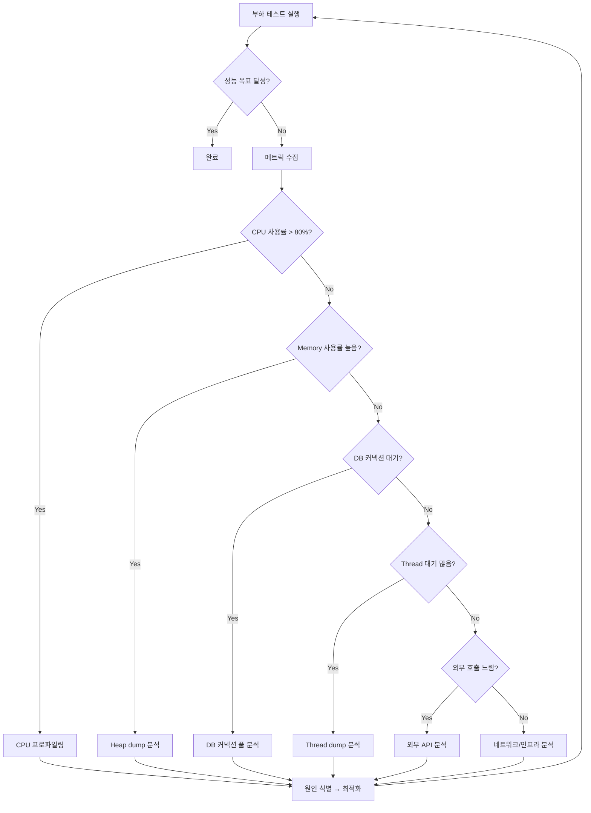

# 병목 분석 방법론: DB 커넥션 풀, Thread Pool, GC Pause, 외부 API Timeout

부하 테스트에서 발견된 성능 저하의 근본 원인을 체계적으로 진단하고 해결하는 방법론을 다룬다.

## 목차
- [1. 핵심 개념 (What)](#1-핵심-개념-what)
- [2. 왜 알아야 하는가 (Why)](#2-왜-알아야-하는가-why)
- [3. 내부 구현 분석 (How)](#3-내부-구현-분석-how)
- [4. 실전 예제](#4-실전-예제)
- [5. 정리](#5-정리)

---

## 1. 핵심 개념 (What)

### 1.1 병목(Bottleneck)이란?

**병목**은 시스템의 전체 처리량을 제한하는 가장 느린 구성 요소다. 리틀의 법칙(Little's Law)에 따르면:

```
L = λ × W

L: 시스템 내 동시 요청 수 (concurrency)
λ: 처리량 (throughput, TPS)
W: 평균 응답 시간 (latency)

→ 응답 시간(W)이 증가하면 동시 요청(L)이 증가하고,
  리소스 한계에 도달하면 처리량(λ)이 감소한다.
```

### 1.2 병목 발생 계층

```
┌──────────────────────────────────────────────────┐
│                    Client                         │
├──────────────────────────────────────────────────┤
│  Load Balancer  │  Rate Limiter  │  CDN          │
├──────────────────────────────────────────────────┤
│           Application Server                      │
│  ┌────────────┐ ┌────────────┐ ┌──────────────┐ │
│  │Thread Pool │ │ GC Pause   │ │ CPU/Memory   │ │
│  └────────────┘ └────────────┘ └──────────────┘ │
├──────────────────────────────────────────────────┤
│  ┌────────────┐ ┌────────────┐ ┌──────────────┐ │
│  │DB Conn Pool│ │ Query Plan │ │ Lock/Deadlock│ │
│  └────────────┘ └────────────┘ └──────────────┘ │
│                   Database                        │
├──────────────────────────────────────────────────┤
│           External Services                       │
│  ┌────────────┐ ┌────────────┐ ┌──────────────┐ │
│  │ API Timeout│ │ Rate Limit │ │ DNS Resolve  │ │
│  └────────────┘ └────────────┘ └──────────────┘ │
└──────────────────────────────────────────────────┘
```

### 1.3 주요 병목 유형

| 병목 유형 | 증상 | 영향 범위 |
|----------|------|----------|
| **DB 커넥션 풀 고갈** | 커넥션 대기 시간 급증, timeout 에러 | 전체 DB 접근 요청 |
| **Thread Pool 포화** | 요청 큐 증가, 응답 지연, 503 에러 | 전체 HTTP 요청 |
| **GC Pause** | 간헐적 응답 지연 (STW), latency spike | 전체 애플리케이션 |
| **외부 API Timeout** | 특정 기능 실패, cascade failure | 해당 기능 + 연관 기능 |
| **Slow Query** | DB CPU 증가, 커넥션 점유 시간 증가 | DB 관련 전체 요청 |
| **Lock 경합** | 특정 테이블/행 접근 시 대기 | 해당 데이터 접근 요청 |

## 2. 왜 알아야 하는가 (Why)

### 2.1 증상이 아닌 원인을 치료

부하 테스트에서 "응답 시간이 느리다"는 증상만으로는 해결할 수 없다. 같은 증상이라도 원인에 따라 해결 방법이 완전히 다르다:

```
증상: p95 응답 시간 3초 (목표: 500ms)

원인 A: DB 커넥션 풀 부족 → 풀 크기 증가
원인 B: Slow query → 인덱스 추가, 쿼리 최적화
원인 C: GC pause → 힙 크기 조정, GC 알고리즘 변경
원인 D: Thread pool 부족 → 스레드 수 증가, 비동기 전환
원인 E: 외부 API 느림 → Circuit breaker, timeout 조정
```

### 2.2 Cascade Failure 예방

하나의 병목이 연쇄 장애를 유발하는 패턴:

```
외부 API 느림 (5초 → 30초)
  → Thread가 외부 API 응답 대기로 점유
    → Thread pool 고갈
      → 새 요청 처리 불가
        → Health check 실패
          → Load Balancer가 서버 제거
            → 나머지 서버에 부하 집중
              → 전체 시스템 다운
```

### 2.3 비용 효율적 스케일링

병목을 정확히 식별하면 불필요한 스케일링을 피할 수 있다:
- DB 커넥션이 병목 → 서버를 늘려도 효과 없음
- CPU가 병목 → 서버 증설이 효과적
- 외부 API가 병목 → 캐싱 또는 비동기 처리가 효과적

## 3. 내부 구현 분석 (How)

### 3.1 병목 분석 프로세스



### 3.2 DB 커넥션 풀 병목 분석

**증상 식별**:
```
# HikariCP 메트릭 (Spring Boot Actuator)
GET /actuator/metrics/hikaricp.connections.active
GET /actuator/metrics/hikaricp.connections.idle
GET /actuator/metrics/hikaricp.connections.pending
GET /actuator/metrics/hikaricp.connections.timeout
```

**핵심 지표**:
| 지표 | 정상 | 경고 | 위험 |
|------|------|------|------|
| Active connections | < 70% of max | 70~90% | > 90% |
| Pending threads | 0 | 1~5 | > 5 |
| Connection timeout | 0 | 간헐적 | 지속적 |
| Connection acquire time | < 5ms | 5~100ms | > 100ms |

**커넥션 풀 크기 산출 공식** (PostgreSQL 권장):
```
최적 커넥션 수 = (CPU 코어 수 × 2) + effective_spindle_count

예: 8코어 서버 + SSD 1개
   = (8 × 2) + 1 = 17개

주의: 커넥션 수를 무조건 늘리면 DB 측 context switching 오버헤드 증가
```

**Spring Boot HikariCP 설정**:
```yaml
spring:
  datasource:
    hikari:
      maximum-pool-size: 20        # 최대 커넥션 수
      minimum-idle: 5              # 최소 유휴 커넥션
      connection-timeout: 3000     # 커넥션 획득 대기 시간 (ms)
      idle-timeout: 600000         # 유휴 커넥션 유지 시간 (10분)
      max-lifetime: 1800000        # 커넥션 최대 수명 (30분)
      leak-detection-threshold: 60000  # 커넥션 누수 탐지 (60초)
```

### 3.3 Thread Pool 병목 분석

**Tomcat Thread Pool 모니터링**:
```
# Spring Boot Actuator
GET /actuator/metrics/tomcat.threads.current
GET /actuator/metrics/tomcat.threads.busy
GET /actuator/metrics/tomcat.threads.config.max
```

**Thread dump 분석**:
```bash
# JVM thread dump 생성
jstack <PID> > thread_dump.txt

# 또는 kill 시그널로
kill -3 <PID>
```

**Thread dump에서 찾아야 할 패턴**:

```
// 정상: RUNNABLE 상태
"http-nio-8080-exec-1" #20 daemon prio=5 RUNNABLE
    at java.net.SocketInputStream.socketRead0(Native Method)

// 병목: WAITING - DB 커넥션 대기
"http-nio-8080-exec-5" #24 daemon prio=5 WAITING
    at com.zaxxer.hikari.pool.HikariPool.getConnection(HikariPool.java:186)

// 병목: BLOCKED - Lock 대기
"http-nio-8080-exec-10" #29 daemon prio=5 BLOCKED
    waiting to lock <0x000000076ab68c70>
    at com.example.service.OrderService.createOrder(OrderService.java:45)
```

**Tomcat Thread Pool 설정**:
```yaml
server:
  tomcat:
    threads:
      max: 200          # 최대 스레드 수
      min-spare: 10     # 최소 유휴 스레드
    accept-count: 100   # 대기 큐 크기
    max-connections: 8192
    connection-timeout: 20000
```

### 3.4 GC Pause 분석

**GC 로그 활성화** (JDK 11+):
```bash
java -Xlog:gc*:file=gc.log:time,uptime,level,tags \
     -XX:+UseG1GC \
     -Xms2g -Xmx2g \
     -jar application.jar
```

**GC 로그 핵심 패턴**:
```
# 정상 Minor GC (Young GC) - 수~수십 ms
[0.523s] GC(0) Pause Young (Normal) 25M->8M(256M) 12.345ms

# 경고 Mixed GC - 수십~수백 ms
[15.234s] GC(12) Pause Young (Mixed) 180M->120M(512M) 85.678ms

# 위험 Full GC (STW) - 수백 ms~수 초
[45.678s] GC(25) Pause Full (Allocation Failure) 450M->200M(512M) 1234.567ms
```

**GC 관련 핵심 지표**:
| 지표 | 정상 | 경고 | 위험 |
|------|------|------|------|
| Young GC 빈도 | < 10회/초 | 10~50회/초 | > 50회/초 |
| Young GC 시간 | < 20ms | 20~100ms | > 100ms |
| Full GC 빈도 | 0회 | 1~2회/시간 | > 1회/분 |
| Full GC 시간 | - | < 500ms | > 1초 |
| Heap 사용률 | < 70% | 70~85% | > 85% |

**GC 튜닝 전략**:
```bash
# G1GC (JDK 11+ 기본, 범용)
-XX:+UseG1GC
-XX:MaxGCPauseMillis=200          # 목표 pause 시간
-XX:G1HeapRegionSize=16m          # Region 크기

# ZGC (JDK 15+, 초저지연)
-XX:+UseZGC
-XX:ZCollectionInterval=5         # 5초마다 GC 시도

# Shenandoah GC (OpenJDK, 저지연)
-XX:+UseShenandoahGC
```

### 3.5 외부 API Timeout 분석

**문제 패턴**:
```
정상: 외부 API 응답 시간 100ms
과부하: 외부 API 응답 시간 30초 (또는 timeout)

→ 호출 스레드가 30초간 blocking
→ Thread pool 고갈
→ 전체 서비스 응답 불가
```

**Circuit Breaker 패턴** (Resilience4j):
```java
@CircuitBreaker(name = "externalApi", fallbackMethod = "fallback")
@TimeLimiter(name = "externalApi")
@Retry(name = "externalApi")
public CompletableFuture<Response> callExternalApi(Request request) {
    return CompletableFuture.supplyAsync(() ->
        restClient.post(request)
    );
}

public CompletableFuture<Response> fallback(Request request, Throwable t) {
    return CompletableFuture.completedFuture(Response.cached());
}
```

**Resilience4j 설정**:
```yaml
resilience4j:
  circuitbreaker:
    instances:
      externalApi:
        slidingWindowSize: 10
        failureRateThreshold: 50      # 실패율 50% 초과 시 open
        waitDurationInOpenState: 30s   # 30초 후 half-open
        permittedNumberOfCallsInHalfOpenState: 3
  timelimiter:
    instances:
      externalApi:
        timeoutDuration: 3s           # 3초 timeout
  retry:
    instances:
      externalApi:
        maxAttempts: 3
        waitDuration: 500ms
        retryExceptions:
          - java.io.IOException
          - java.util.concurrent.TimeoutException
```

**Circuit Breaker 상태 전이**:
```
                  실패율 > threshold
       ┌──────────────────────────────┐
       │                              v
   ┌───────┐     성공     ┌────────┐     wait timeout     ┌───────────┐
   │CLOSED │ <─────────── │  OPEN  │ ──────────────────> │ HALF-OPEN │
   └───────┘              └────────┘                      └───────────┘
       ^                                                      │
       │              충분한 성공                               │
       └──────────────────────────────────────────────────────┘
```

## 4. 실전 예제

### 4.1 Prometheus + Grafana 모니터링 대시보드 쿼리

```promql
# DB 커넥션 풀 사용률
hikaricp_connections_active / hikaricp_connections_max * 100

# Thread pool 사용률
tomcat_threads_busy_threads / tomcat_threads_config_max_threads * 100

# GC pause 시간 (p99)
histogram_quantile(0.99, rate(jvm_gc_pause_seconds_bucket[5m]))

# HTTP 요청 p95 응답 시간
histogram_quantile(0.95, rate(http_server_requests_seconds_bucket[5m]))

# 외부 API 호출 실패율
rate(resilience4j_circuitbreaker_calls_total{kind="failed"}[5m])
/ rate(resilience4j_circuitbreaker_calls_total[5m]) * 100
```

### 4.2 부하 테스트 중 실시간 모니터링 스크립트

```bash
#!/bin/bash
# monitor.sh - 부하 테스트 중 핵심 지표 모니터링

APP_URL="http://localhost:8080"
INTERVAL=5

while true; do
  echo "=== $(date '+%H:%M:%S') ==="

  # Thread 상태
  echo "[Threads]"
  curl -s "$APP_URL/actuator/metrics/tomcat.threads.busy" | jq '.measurements[0].value'

  # DB 커넥션
  echo "[DB Connections]"
  curl -s "$APP_URL/actuator/metrics/hikaricp.connections.active" | jq '.measurements[0].value'
  curl -s "$APP_URL/actuator/metrics/hikaricp.connections.pending" | jq '.measurements[0].value'

  # Heap 사용량
  echo "[Heap]"
  curl -s "$APP_URL/actuator/metrics/jvm.memory.used" \
    | jq '.availableTags[] | select(.tag=="area") | .values'

  echo "---"
  sleep $INTERVAL
done
```

### 4.3 병목별 k6 Threshold 설정

```javascript
export const options = {
  thresholds: {
    // 전체 응답 시간 SLO
    http_req_duration: ['p(95)<500', 'p(99)<1000'],

    // DB 관련 API (커넥션 풀 병목 탐지)
    'http_req_duration{name:db-query}': ['p(95)<200'],

    // 외부 API 호출 (timeout 병목 탐지)
    'http_req_duration{name:external-api}': ['p(95)<3000'],

    // 에러율 (Thread pool 고갈 탐지)
    http_req_failed: ['rate<0.01'],

    // 처리량 (전체 시스템 병목 탐지)
    http_reqs: ['rate>100'], // 초당 100 요청 이상 유지
  },
};
```

## 5. 정리

| 병목 유형 | 진단 도구 | 핵심 지표 | 해결 전략 |
|----------|----------|----------|----------|
| **DB 커넥션 풀** | HikariCP 메트릭, Actuator | active/pending/timeout | 풀 크기 조정, 쿼리 최적화, 커넥션 누수 수정 |
| **Thread Pool** | Thread dump, Actuator | busy threads, queue size | 스레드 수 조정, 비동기 전환, blocking 코드 제거 |
| **GC Pause** | GC 로그, JFR | pause time, heap 사용률 | 힙 크기 조정, GC 알고리즘 변경, 메모리 누수 수정 |
| **외부 API** | APM, 분산 트레이싱 | 응답 시간, 실패율 | Circuit breaker, timeout, 캐싱, 비동기 처리 |
| **Slow Query** | Slow query log, explain | 실행 시간, rows scanned | 인덱스 추가, 쿼리 리팩토링, 캐시 |
| **Lock 경합** | DB lock monitor, thread dump | lock wait time, deadlock | 트랜잭션 범위 축소, 낙관적 잠금, 분산 락 |

**병목 분석 순서 (권장)**:
1. 인프라 메트릭 확인 (CPU, Memory, Disk I/O, Network)
2. 애플리케이션 메트릭 확인 (Thread, Connection, GC)
3. 분산 트레이싱으로 느린 구간 식별
4. 해당 구간 상세 프로파일링 (Thread dump, Heap dump, Query plan)
5. 원인 수정 후 동일 부하로 재테스트

---
*참고: Spring Boot 3.x, HikariCP 5.x, JDK 17+, Resilience4j 2.x 기준*
