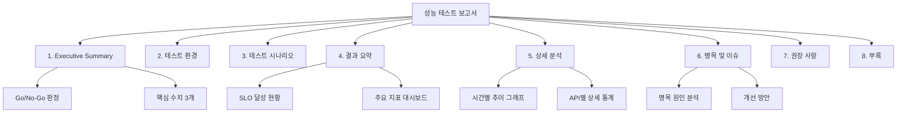

# 성능 테스트 보고서 작성법: 핵심 지표, 시각화, 의사결정 지원

성능 테스트 결과를 효과적으로 정리하고 이해관계자에게 전달하는 보고서 작성 방법론을 다룬다. 핵심 지표의 의미, 시각화 기법, 데이터 기반 의사결정 지원 방법을 설명한다.

## 목차
- [1. 핵심 개념 (What)](#1-핵심-개념-what)
- [2. 왜 알아야 하는가 (Why)](#2-왜-알아야-하는가-why)
- [3. 내부 구현 분석 (How)](#3-내부-구현-분석-how)
- [4. 실전 예제](#4-실전-예제)
- [5. 정리](#5-정리)

---

## 1. 핵심 개념 (What)

### 1.1 성능 테스트 핵심 지표 (KPI)

| 지표 | 영문 | 정의 | 단위 |
|------|------|------|------|
| **처리량** | TPS (Transactions Per Second) | 초당 처리된 트랜잭션 수 | req/s |
| **응답 시간** | Response Time / Latency | 요청 전송~응답 수신까지 소요 시간 | ms |
| **에러율** | Error Rate | 전체 요청 중 실패 비율 | % |
| **동시 사용자** | Concurrent Users | 동시에 시스템을 사용하는 사용자 수 | 명 |
| **Apdex** | Application Performance Index | 사용자 만족도 점수 (0~1) | 점수 |

### 1.2 Percentile의 중요성

**왜 평균(avg)이 아닌 percentile을 사용하는가?**

```
예시: 100개 요청의 응답 시간
- 95개 요청: 100ms
- 5개 요청: 5000ms (timeout)

평균: (95×100 + 5×5000) / 100 = 345ms  ← "괜찮아 보임"
p50: 100ms                              ← 대부분의 사용자 경험
p95: 5000ms                             ← 20명 중 1명의 경험
p99: 5000ms                             ← 100명 중 1명의 경험

→ 평균만 보면 문제를 놓침!
```

**Percentile 해석**:
```
p50 (Median): "일반적인" 사용자 경험
p90: 10명 중 9명은 이 시간 이하
p95: SLO 기준으로 가장 많이 사용 (20명 중 19명)
p99: 100명 중 99명은 이 시간 이하 (long tail 탐지)
Max: 최악의 경우 (이상치 포함, 참고용)
```

### 1.3 Apdex (Application Performance Index)

사용자 만족도를 0~1 점수로 표현:

```
Apdex = (Satisfied + Tolerated/2) / Total

- Satisfied: 응답 시간 ≤ T (목표 시간)
- Tolerated: T < 응답 시간 ≤ 4T
- Frustrated: 응답 시간 > 4T

예: T = 500ms
- Satisfied: ≤ 500ms
- Tolerated: 500ms ~ 2000ms
- Frustrated: > 2000ms
```

| Apdex 점수 | 등급 | 의미 |
|-----------|------|------|
| 0.94 ~ 1.0 | Excellent | 매우 만족 |
| 0.85 ~ 0.93 | Good | 만족 |
| 0.70 ~ 0.84 | Fair | 보통 |
| 0.50 ~ 0.69 | Poor | 불만족 |
| < 0.50 | Unacceptable | 사용 불가 |

## 2. 왜 알아야 하는가 (Why)

### 2.1 의사결정 지원

성능 테스트 보고서는 다음 의사결정의 근거가 된다:
- **Go/No-Go 결정**: 이 버전을 프로덕션에 배포해도 되는가?
- **용량 계획**: 서버를 몇 대 준비해야 하는가?
- **투자 우선순위**: 어디를 먼저 최적화해야 하는가?
- **SLA 협상**: 클라이언트에게 어떤 성능을 보장할 수 있는가?

### 2.2 이해관계자별 관심사

| 이해관계자 | 관심 지표 | 질문 |
|-----------|----------|------|
| **경영진** | Apdex, 에러율, 비용 | "서비스가 안정적인가? 비용은?" |
| **PM** | SLO 달성률, 비교 분석 | "이전 버전보다 나아졌나?" |
| **개발팀** | p95/p99, 병목 위치, GC | "어디가 느리고 왜?" |
| **인프라팀** | CPU/Memory, TPS, 용량 | "서버가 몇 대 필요한가?" |
| **QA팀** | 에러 유형, 재현 조건 | "어떤 조건에서 실패하는가?" |

### 2.3 회귀 탐지

버전 간 성능 비교를 통해 성능 회귀를 조기에 발견한다:
```
v1.2.0: p95 = 200ms, TPS = 500
v1.3.0: p95 = 450ms, TPS = 380  ← 성능 회귀 탐지!
```

## 3. 내부 구현 분석 (How)

### 3.1 보고서 구조



### 3.2 Section 1: Executive Summary

**한 페이지에 핵심만 담는다.** 경영진이 30초 안에 결과를 파악할 수 있어야 한다.

포함 항목:
- **테스트 일시**: 2024-01-15 14:00-16:00 KST
- **Go/No-Go**: PASS / FAIL (+ 이유)
- **핵심 수치**: TPS, p95 응답 시간, 에러율 (각각 목표 대비)
- **한 줄 요약**: "동시 사용자 1,000명 기준 SLO를 충족하나, 결제 API의 p99 응답 시간 개선이 필요함"

### 3.3 Section 2: 테스트 환경

```markdown
## 테스트 환경

### 인프라
| 구성 요소 | 사양 | 수량 |
|----------|------|------|
| App Server | c5.2xlarge (8 vCPU, 16GB) | 3대 |
| Database | RDS r5.xlarge (4 vCPU, 32GB) | 1대 (Read Replica 1대) |
| Redis | ElastiCache r5.large | 1대 |
| Load Balancer | ALB | 1대 |

### 소프트웨어
| 항목 | 버전 |
|------|------|
| Application | v2.3.1 (commit: abc1234) |
| JDK | OpenJDK 17.0.9 |
| Spring Boot | 3.2.1 |
| DB | PostgreSQL 15.4 |

### 데이터
- 사용자: 100만 건
- 상품: 50만 건
- 주문: 500만 건
```

### 3.4 Section 4: 결과 요약 - 시각화 기법

**1. SLO 달성 현황 테이블**:

| SLO 항목 | 목표 | 결과 | 판정 |
|---------|------|------|------|
| p95 응답 시간 | < 500ms | 380ms | PASS |
| p99 응답 시간 | < 1000ms | 850ms | PASS |
| 에러율 | < 1% | 0.3% | PASS |
| TPS | > 500 | 620 | PASS |
| Apdex (T=500ms) | > 0.85 | 0.92 | PASS |

**2. 시간별 추이 그래프** (ASCII/Mermaid로 표현):
```
응답 시간 (p95, ms)
500 ┤
400 ┤         ╭──────╮
300 ┤    ╭────╯      ╰────╮
200 ┤───╯                  ╰───
100 ┤
  0 ┼──────────────────────────
    0   2   4   6   8  10  12  (분)
       ramp-up  steady  ramp-down
```

**3. API별 상세 통계**:

| API | 호출 수 | 평균 | p50 | p95 | p99 | Max | 에러율 |
|-----|--------|------|-----|-----|-----|-----|-------|
| GET /products | 45,230 | 45ms | 38ms | 120ms | 250ms | 980ms | 0.1% |
| GET /products/:id | 32,100 | 55ms | 42ms | 150ms | 380ms | 1.2s | 0.2% |
| POST /cart | 8,500 | 120ms | 95ms | 350ms | 800ms | 2.1s | 0.5% |
| POST /orders | 2,100 | 450ms | 380ms | 980ms | 2.5s | 5.0s | 1.2% |

### 3.5 Section 6: 병목 및 이슈

각 이슈에 대해 다음 구조로 작성:

```markdown
### 이슈 #1: 결제 API p99 응답 시간 SLO 미충족

**심각도**: High
**영향**: 100명 중 1명이 결제 시 2.5초 이상 대기
**원인**: 결제 API 내부에서 외부 PG사 API 호출 시 간헐적 timeout (3초)
**근거**:
- 분산 트레이싱에서 pg-api span의 p99가 2.8초
- Circuit breaker가 열린 횟수: 테스트 중 3회
**권장 조치**:
1. PG사 API timeout을 5초 → 2초로 단축
2. 결제 결과를 비동기 폴링으로 전환
3. Fallback PG사 연동 추가
**예상 효과**: p99 응답 시간 2.5초 → 800ms 이하
```

## 4. 실전 예제

### 4.1 k6 결과를 보고서용 데이터로 변환

```bash
# k6 JSON 결과에서 핵심 지표 추출
k6 run --out json=results.json script.js

# jq로 요약 추출
cat results.json | jq -s '
  [.[] | select(.type == "Point" and .metric == "http_req_duration")]
  | {
    count: length,
    avg: (map(.data.value) | add / length),
    min: (map(.data.value) | min),
    max: (map(.data.value) | max),
    p95: (sort_by(.data.value) | .[length * 0.95 | floor].data.value)
  }
'
```

### 4.2 Grafana 대시보드 구성

k6 + Prometheus + Grafana 연동 시 추천 패널:

```
┌─────────────────────────────────────────────────────────┐
│  성능 테스트 대시보드                                      │
├──────────────────┬──────────────────┬───────────────────┤
│  TPS             │  Active VUs      │  Error Rate       │
│  [실시간 그래프]   │  [실시간 그래프]   │  [실시간 게이지]   │
├──────────────────┴──────────────────┴───────────────────┤
│  Response Time Percentiles (p50, p95, p99)              │
│  [시계열 그래프 - 3개 라인]                                │
├──────────────────┬──────────────────┬───────────────────┤
│  CPU Usage       │  Memory/Heap     │  DB Connections   │
│  [서버별 그래프]   │  [사용량 그래프]   │  [active/max]    │
├──────────────────┴──────────────────┴───────────────────┤
│  API별 Response Time Heatmap                            │
│  [히트맵]                                               │
└─────────────────────────────────────────────────────────┘
```

**Prometheus 쿼리 예시**:
```promql
# k6 TPS (Prometheus remote write 사용 시)
rate(k6_http_reqs_total[1m])

# k6 응답 시간 p95
histogram_quantile(0.95, rate(k6_http_req_duration_seconds_bucket[1m]))

# k6 에러율
rate(k6_http_reqs_total{expected_response="false"}[1m])
/ rate(k6_http_reqs_total[1m]) * 100
```

### 4.3 버전 간 비교 보고서

```markdown
## 성능 비교: v2.3.0 vs v2.4.0

### 테스트 조건
- 동시 사용자: 1,000명
- 테스트 시간: 15분 (2분 ramp-up, 10분 steady, 3분 ramp-down)
- 동일 인프라, 동일 데이터셋

### 비교 결과

| 지표 | v2.3.0 | v2.4.0 | 변화 | 판정 |
|------|--------|--------|------|------|
| TPS | 520 | 610 | +17.3% | 개선 |
| p95 응답 시간 | 450ms | 320ms | -28.9% | 개선 |
| p99 응답 시간 | 1200ms | 850ms | -29.2% | 개선 |
| 에러율 | 0.8% | 0.3% | -62.5% | 개선 |
| CPU 사용률 (avg) | 72% | 65% | -9.7% | 개선 |
| Memory 사용률 | 78% | 80% | +2.6% | 주시 |

### 분석
- 쿼리 최적화 (PR #1234)로 DB 응답 시간 40% 감소
- Redis 캐시 적용 (PR #1256)으로 반복 조회 성능 개선
- Memory 사용량 소폭 증가는 캐시 데이터 적재로 인한 것 (정상 범위)

### 결론
v2.4.0은 전반적으로 유의미한 성능 개선을 보이며, 프로덕션 배포 승인 (PASS).
```

### 4.4 용량 계획 보고서 예시

```markdown
## 용량 계획

### 현재 상태
- 인스턴스: c5.2xlarge × 3대
- 피크 TPS: 620
- 피크 CPU: 65%

### 예상 성장
- 현재 일 평균 사용자: 50,000명
- 3개월 후 예상: 100,000명 (+100%)
- 6개월 후 예상: 200,000명 (+300%)

### 스케일링 시뮬레이션 결과

| 구성 | 최대 TPS | p95 (목표 <500ms) | 비용/월 |
|------|---------|-------------------|---------|
| 3대 (현재) | 620 | 320ms | $1,200 |
| 4대 | 840 | 280ms | $1,600 |
| 5대 | 1,020 | 250ms | $2,000 |
| 6대 | 1,180 | 240ms | $2,400 |

### 권장 사항
1. **3개월 후**: 4대로 확장 (목표 TPS 800 커버)
2. **6개월 후**: 6대로 확장 + DB Read Replica 추가
3. **Auto Scaling 적용**: CPU 70% 기준 스케일아웃 설정 권장
```

## 5. 정리

| 보고서 섹션 | 대상 | 핵심 내용 |
|------------|------|----------|
| **Executive Summary** | 경영진/PM | Go/No-Go, 핵심 수치 3개, 한줄 요약 |
| **테스트 환경** | 전체 | 인프라 사양, SW 버전, 데이터 규모 |
| **테스트 시나리오** | 개발/QA | 사용자 유형, 부하 패턴, Think time |
| **결과 요약** | 전체 | SLO 달성 현황, 주요 지표 대시보드 |
| **상세 분석** | 개발/인프라 | 시간별 추이, API별 통계, 리소스 사용량 |
| **병목 및 이슈** | 개발 | 원인-근거-권장조치-예상효과 |
| **권장 사항** | PM/인프라 | 단기/중기 개선 계획, 용량 계획 |

**보고서 작성 체크리스트**:
- [ ] Percentile 기반 응답 시간 보고 (평균 아닌 p95/p99)
- [ ] SLO 대비 달성/미달성 명확히 표시
- [ ] 시간별 추이 그래프 포함
- [ ] 이전 버전과의 비교 데이터
- [ ] 발견된 이슈별 원인-근거-권장조치
- [ ] 용량 계획 (비용 포함) 제시
- [ ] 테스트 재현에 필요한 환경/스크립트 정보

---
*참고: k6 v0.50+, Grafana 10+, Prometheus 2.x 기준*
