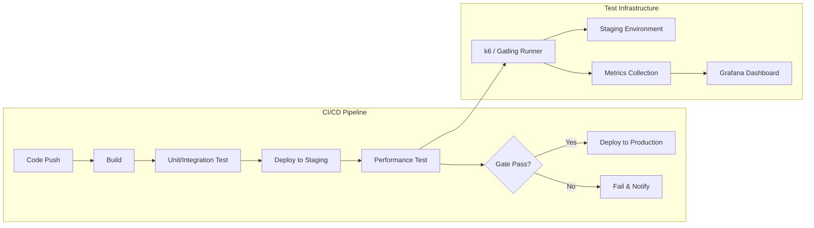

# CI/CD 파이프라인에 성능 테스트 연동: GitHub Actions, Jenkins, 성능 게이트

부하 테스트를 CI/CD 파이프라인에 자동화하여 매 릴리스마다 성능 회귀를 탐지하고, 성능 게이트를 통해 배포 품질을 보장하는 방법을 다룬다.

## 목차
- [1. 핵심 개념 (What)](#1-핵심-개념-what)
- [2. 왜 알아야 하는가 (Why)](#2-왜-알아야-하는가-why)
- [3. 내부 구현 분석 (How)](#3-내부-구현-분석-how)
- [4. 실전 예제](#4-실전-예제)
- [5. 정리](#5-정리)

---

## 1. 핵심 개념 (What)

### 1.1 성능 테스트 자동화란?

CI/CD 파이프라인에서 코드 변경이 발생할 때마다 자동으로 성능 테스트를 실행하고, 사전 정의된 성능 기준(Performance Gate)을 충족하는지 확인하는 프로세스다.

```
┌─────────┐    ┌──────────┐    ┌───────────┐    ┌──────────┐    ┌──────────┐
│  Code   │ -> │  Build   │ -> │ Unit Test │ -> │ Perf Test│ -> │ Deploy   │
│  Push   │    │          │    │           │    │  (Gate)  │    │          │
└─────────┘    └──────────┘    └───────────┘    └──────────┘    └──────────┘
                                                     │
                                                 ┌───┴────┐
                                                 │ Pass?  │
                                                 ├────────┤
                                                 │Yes → ✓ │
                                                 │No  → ✗ │ → 배포 차단
                                                 └────────┘
```

### 1.2 성능 게이트 (Performance Gate)

**성능 게이트**는 배포 전 충족해야 할 성능 기준이다:

| 게이트 유형 | 기준 예시 | 실패 시 동작 |
|------------|----------|-------------|
| **절대 기준** | p95 < 500ms, 에러율 < 1% | 파이프라인 실패 |
| **상대 기준** | 이전 버전 대비 p95 10% 이상 악화 금지 | 파이프라인 실패 + 알림 |
| **경고 기준** | p95 300~500ms (정상이지만 주시) | 경고 알림, 배포 진행 |

### 1.3 테스트 수준별 적용

| 수준 | 실행 시점 | 시간 | VU 수 | 목적 |
|------|----------|------|-------|------|
| **Smoke Test** | 모든 PR | 1~2분 | 1~5 | 기본 기능 동작 확인 |
| **Load Test (경량)** | develop 머지 | 5~10분 | 50~100 | 성능 회귀 탐지 |
| **Load Test (전체)** | 릴리스 전 | 30~60분 | 목표 VU | SLO 검증 |
| **Soak Test** | 주 1회 (야간) | 4~8시간 | 중간 VU | 메모리 누수 탐지 |

## 2. 왜 알아야 하는가 (Why)

### 2.1 성능 회귀 조기 발견

수동 성능 테스트는 릴리스 직전에만 수행되어 문제 발견이 늦다. CI/CD 연동으로 커밋 단위로 성능 변화를 추적하면:
- 성능 저하를 유발한 정확한 커밋 식별 가능
- 수정 비용이 적음 (변경 범위가 좁으므로)

### 2.2 배포 자신감

성능 게이트를 통과한 빌드만 프로덕션에 배포되므로:
- "이번 배포 후 느려질까?" 우려 해소
- 데이터 기반 Go/No-Go 결정

### 2.3 개발 문화

"성능도 테스트의 일부"라는 인식을 팀에 자연스럽게 정착:
- PR 리뷰에 성능 지표 포함
- 성능 회귀가 CI에서 자동 차단됨을 인지

## 3. 내부 구현 분석 (How)

### 3.1 CI/CD 성능 테스트 아키텍처



### 3.2 k6의 CI/CD 통합 원리

k6는 CLI 도구이므로 모든 CI/CD 플랫폼에서 동일한 방식으로 실행된다:

```bash
# 기본 실행
k6 run script.js

# 종료 코드:
# 0  - 모든 threshold 통과
# 99 - threshold 실패 (성능 게이트 실패)
# 1  - 스크립트 오류

# CI/CD에서는 exit code로 성공/실패 판단
k6 run script.js && echo "PASS" || echo "FAIL"
```

### 3.3 테스트 환경 전략

| 전략 | 장점 | 단점 | 적합한 경우 |
|------|------|------|------------|
| **Staging 환경** | 프로덕션과 유사 | 비용, 데이터 동기화 | 릴리스 전 전체 테스트 |
| **Docker Compose** | 재현성, 격리성 | 규모 제한 | PR 단위 Smoke Test |
| **Ephemeral 환경** | 격리, 병렬 실행 | 인프라 비용 | 팀 규모가 큰 경우 |
| **프로덕션 (Canary)** | 가장 정확 | 위험, 제한적 부하 | Shadow traffic 방식 |

## 4. 실전 예제

### 4.1 GitHub Actions: k6 성능 테스트

```yaml
# .github/workflows/performance-test.yml
name: Performance Test

on:
  pull_request:
    branches: [main, develop]
  push:
    branches: [develop]

jobs:
  smoke-test:
    # PR마다 실행되는 경량 Smoke Test
    if: github.event_name == 'pull_request'
    runs-on: ubuntu-latest
    steps:
      - uses: actions/checkout@v4

      - name: Start application
        run: |
          docker compose -f docker-compose.test.yml up -d
          # 애플리케이션 준비 대기
          timeout 60 bash -c 'until curl -s http://localhost:8080/actuator/health | grep UP; do sleep 2; done'

      - name: Install k6
        run: |
          sudo gpg -k
          sudo gpg --no-default-keyring --keyring /usr/share/keyrings/k6-archive-keyring.gpg \
            --keyserver hkp://keyserver.ubuntu.com:80 \
            --recv-keys C5AD17C747E3415A3642D57D77C6C491D6AC1D69
          echo "deb [signed-by=/usr/share/keyrings/k6-archive-keyring.gpg] https://dl.k6.io/deb stable main" \
            | sudo tee /etc/apt/sources.list.d/k6.list
          sudo apt-get update && sudo apt-get install -y k6

      - name: Run Smoke Test
        run: k6 run tests/performance/smoke.js
        env:
          BASE_URL: http://localhost:8080

      - name: Cleanup
        if: always()
        run: docker compose -f docker-compose.test.yml down

  load-test:
    # develop 머지 시 실행되는 Load Test
    if: github.event_name == 'push' && github.ref == 'refs/heads/develop'
    runs-on: ubuntu-latest
    environment: staging
    steps:
      - uses: actions/checkout@v4

      - name: Deploy to Staging
        run: |
          # staging 배포 스크립트
          ./scripts/deploy-staging.sh

      - name: Install k6
        run: |
          sudo apt-get update && sudo apt-get install -y k6

      - name: Run Load Test
        id: load-test
        run: |
          k6 run tests/performance/load.js \
            --out json=results.json \
            2>&1 | tee test-output.txt
        env:
          BASE_URL: ${{ secrets.STAGING_URL }}
        continue-on-error: true

      - name: Parse Results
        if: always()
        run: |
          # 결과 요약 추출
          echo "## Performance Test Results" >> $GITHUB_STEP_SUMMARY
          echo "" >> $GITHUB_STEP_SUMMARY
          tail -30 test-output.txt >> $GITHUB_STEP_SUMMARY

      - name: Upload Results
        if: always()
        uses: actions/upload-artifact@v4
        with:
          name: k6-results
          path: results.json

      - name: Check Results
        if: steps.load-test.outcome == 'failure'
        run: |
          echo "Performance test failed! Check results."
          exit 1
```

### 4.2 k6 Smoke Test 스크립트

```javascript
// tests/performance/smoke.js
import http from 'k6/http';
import { check, sleep } from 'k6';

const BASE_URL = __ENV.BASE_URL || 'http://localhost:8080';

export const options = {
  vus: 3,
  duration: '1m',
  thresholds: {
    http_req_duration: ['p(95)<1000'],   // Smoke test: 여유있는 기준
    http_req_failed: ['rate<0.05'],
    checks: ['rate>0.95'],
  },
};

export default function () {
  // 핵심 API만 호출하여 기본 동작 확인
  const endpoints = [
    { method: 'GET', url: `${BASE_URL}/api/products`, name: 'product-list' },
    { method: 'GET', url: `${BASE_URL}/api/products/1`, name: 'product-detail' },
    { method: 'GET', url: `${BASE_URL}/actuator/health`, name: 'health-check' },
  ];

  for (const ep of endpoints) {
    const res = http.get(ep.url, { tags: { name: ep.name } });
    check(res, {
      [`${ep.name} status 200`]: (r) => r.status === 200,
    });
  }

  sleep(1);
}
```

### 4.3 k6 Load Test 스크립트 (CI용)

```javascript
// tests/performance/load.js
import http from 'k6/http';
import { check, sleep } from 'k6';
import { Rate, Trend } from 'k6/metrics';

const BASE_URL = __ENV.BASE_URL || 'http://localhost:8080';
const errorRate = new Rate('error_rate');

export const options = {
  stages: [
    { duration: '1m', target: 50 },    // ramp-up
    { duration: '5m', target: 50 },    // steady
    { duration: '1m', target: 0 },     // ramp-down
  ],
  thresholds: {
    http_req_duration: ['p(95)<500', 'p(99)<1000'],
    http_req_failed: ['rate<0.01'],
    error_rate: ['rate<0.01'],
    checks: ['rate>0.99'],
  },
};

export default function () {
  // 상품 목록 조회
  let res = http.get(`${BASE_URL}/api/products`, {
    tags: { name: 'product-list' },
  });
  check(res, { 'list 200': (r) => r.status === 200 });
  errorRate.add(res.status !== 200);
  sleep(1);

  // 상품 상세 조회
  const productId = Math.floor(Math.random() * 100) + 1;
  res = http.get(`${BASE_URL}/api/products/${productId}`, {
    tags: { name: 'product-detail' },
  });
  check(res, { 'detail 200': (r) => r.status === 200 });
  errorRate.add(res.status !== 200);
  sleep(2);
}
```

### 4.4 Jenkins Pipeline

```groovy
// Jenkinsfile
pipeline {
    agent any

    environment {
        STAGING_URL = credentials('staging-url')
    }

    stages {
        stage('Build & Test') {
            steps {
                sh 'mvn clean package -DskipTests=false'
            }
        }

        stage('Deploy to Staging') {
            steps {
                sh './scripts/deploy-staging.sh'
                // 배포 완료 대기
                sh '''
                    timeout 120 bash -c '
                        until curl -sf ${STAGING_URL}/actuator/health; do
                            sleep 5
                        done
                    '
                '''
            }
        }

        stage('Performance Test') {
            steps {
                script {
                    // k6 Docker로 실행
                    def exitCode = sh(
                        script: """
                            docker run --rm \
                                -v \${WORKSPACE}/tests/performance:/scripts \
                                -e BASE_URL=${STAGING_URL} \
                                grafana/k6 run /scripts/load.js \
                                --out json=/scripts/results.json
                        """,
                        returnStatus: true
                    )

                    if (exitCode == 99) {
                        // Threshold 실패
                        currentBuild.result = 'UNSTABLE'
                        error('Performance test thresholds failed!')
                    } else if (exitCode != 0) {
                        error('Performance test script error!')
                    }
                }
            }
            post {
                always {
                    archiveArtifacts artifacts: 'tests/performance/results.json',
                                     allowEmptyArchive: true
                }
            }
        }

        stage('Deploy to Production') {
            when {
                branch 'main'
                expression { currentBuild.result != 'UNSTABLE' }
            }
            steps {
                input message: 'Deploy to production?'
                sh './scripts/deploy-production.sh'
            }
        }
    }

    post {
        failure {
            slackSend(
                channel: '#deployments',
                color: 'danger',
                message: "Performance test failed: ${env.BUILD_URL}"
            )
        }
    }
}
```

### 4.5 Gatling + Maven CI 연동

```xml
<!-- pom.xml -->
<build>
    <plugins>
        <plugin>
            <groupId>io.gatling</groupId>
            <artifactId>gatling-maven-plugin</artifactId>
            <version>4.8.0</version>
            <configuration>
                <simulationClass>simulations.LoadSimulation</simulationClass>
                <runMultipleSimulations>false</runMultipleSimulations>
                <resultsFolder>target/gatling</resultsFolder>
            </configuration>
        </plugin>
    </plugins>
</build>
```

**GitHub Actions에서 Gatling 실행**:
```yaml
  gatling-test:
    runs-on: ubuntu-latest
    steps:
      - uses: actions/checkout@v4
      - uses: actions/setup-java@v4
        with:
          distribution: 'temurin'
          java-version: '17'

      - name: Run Gatling Test
        run: mvn gatling:test -Dgatling.simulationClass=simulations.CILoadTest

      - name: Upload Gatling Report
        if: always()
        uses: actions/upload-artifact@v4
        with:
          name: gatling-report
          path: target/gatling/**/index.html
```

### 4.6 성능 회귀 비교 스크립트

```bash
#!/bin/bash
# scripts/compare-performance.sh
# 이전 실행 결과와 현재 결과 비교

CURRENT_RESULT="results.json"
BASELINE_FILE="baseline-performance.json"
THRESHOLD_PERCENT=10  # 10% 이상 악화 시 실패

# 현재 p95 추출
CURRENT_P95=$(cat $CURRENT_RESULT | jq -r '
  [.[] | select(.type == "Point" and .metric == "http_req_duration")]
  | sort_by(.data.value)
  | .[length * 0.95 | floor].data.value
')

# 베이스라인 p95
BASELINE_P95=$(cat $BASELINE_FILE | jq -r '.p95')

# 비교
CHANGE=$(echo "scale=2; ($CURRENT_P95 - $BASELINE_P95) / $BASELINE_P95 * 100" | bc)

echo "Baseline p95: ${BASELINE_P95}ms"
echo "Current p95:  ${CURRENT_P95}ms"
echo "Change:       ${CHANGE}%"

if (( $(echo "$CHANGE > $THRESHOLD_PERCENT" | bc -l) )); then
    echo "FAIL: Performance regression detected! (${CHANGE}% > ${THRESHOLD_PERCENT}%)"
    exit 1
else
    echo "PASS: Performance within acceptable range."
    # 현재 결과를 새 베이스라인으로 저장
    echo "{\"p95\": $CURRENT_P95, \"timestamp\": \"$(date -u +%Y-%m-%dT%H:%M:%SZ)\"}" > $BASELINE_FILE
    exit 0
fi
```

### 4.7 성능 게이트 설정 가이드

```javascript
// tests/performance/thresholds.js
// 환경별 threshold 설정

const thresholdProfiles = {
  // PR Smoke Test: 넉넉한 기준
  smoke: {
    http_req_duration: ['p(95)<2000'],
    http_req_failed: ['rate<0.10'],
  },

  // develop Load Test: 중간 기준
  load: {
    http_req_duration: ['p(95)<500', 'p(99)<1000'],
    http_req_failed: ['rate<0.01'],
    checks: ['rate>0.99'],
  },

  // Release Load Test: 엄격한 기준
  release: {
    http_req_duration: ['p(95)<300', 'p(99)<500'],
    http_req_failed: ['rate<0.005'],
    checks: ['rate>0.995'],
    http_reqs: ['rate>500'],  // 최소 TPS 보장
  },
};

const profile = __ENV.PERF_PROFILE || 'load';
export const options = {
  thresholds: thresholdProfiles[profile],
  // ...
};
```

실행:
```bash
# 환경별 실행
k6 run -e PERF_PROFILE=smoke tests/performance/thresholds.js
k6 run -e PERF_PROFILE=load tests/performance/thresholds.js
k6 run -e PERF_PROFILE=release tests/performance/thresholds.js
```

## 5. 정리

| 항목 | 내용 |
|------|------|
| **Smoke Test** | PR마다, 1~2분, 기본 동작 확인, 넉넉한 threshold |
| **Load Test** | develop 머지 시, 5~10분, 성능 회귀 탐지, 중간 threshold |
| **Release Test** | 릴리스 전, 30~60분, SLO 검증, 엄격한 threshold |
| **성능 게이트** | k6 exit code 99 = threshold 실패, CI 파이프라인 차단 |
| **결과 저장** | JSON artifact + Grafana 대시보드 + 베이스라인 파일 |
| **알림** | 실패 시 Slack/Email 알림, PR에 코멘트 |
| **환경** | Docker Compose (PR), Staging (develop), Staging (release) |

**CI/CD 성능 테스트 체크리스트**:
- [ ] Smoke test가 모든 PR에 대해 실행되는가?
- [ ] Load test가 develop 머지 시 자동 실행되는가?
- [ ] Threshold가 SLO에 맞게 설정되었는가?
- [ ] 실패 시 배포가 차단되는가?
- [ ] 결과가 artifact로 저장되는가?
- [ ] 이전 결과와 비교하는 회귀 탐지가 있는가?
- [ ] 실패 시 적절한 알림이 발송되는가?
- [ ] 테스트 환경이 프로덕션과 충분히 유사한가?

---
*참고: k6 v0.50+, GitHub Actions, Jenkins 2.x, Gatling 3.10+ 기준*
