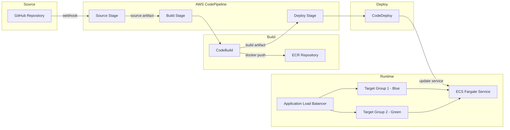
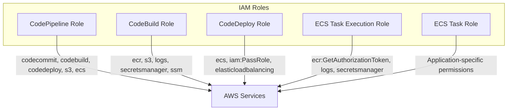

# 실전 파이프라인 구축: GitHub → CodePipeline → CodeBuild → ECR → CodeDeploy → ECS

GitHub 소스부터 ECS 배포까지 전체 CI/CD 파이프라인을 처음부터 끝까지 구축하는 실전 가이드이다.

## 목차
- [1. 핵심 개념 (What)](#1-핵심-개념-what)
- [2. 왜 알아야 하는가 (Why)](#2-왜-알아야-하는가-why)
- [3. 내부 구현 분석 (How)](#3-내부-구현-분석-how)
- [4. 실전 예제](#4-실전-예제)
- [5. 정리](#5-정리)

---

## 1. 핵심 개념 (What)

### 파이프라인 구성 요소

전체 파이프라인은 5개의 AWS 서비스가 체인으로 연결된 구조이다.

| 단계 | AWS 서비스 | 역할 |
|------|-----------|------|
| Source | CodePipeline (GitHub v2 연결) | 코드 변경 감지, 소스 아티팩트 생성 |
| Build | CodeBuild | Docker 이미지 빌드, ECR 푸시 |
| Registry | ECR | 컨테이너 이미지 저장소 |
| Deploy | CodeDeploy | Blue/Green 배포 오케스트레이션 |
| Runtime | ECS (Fargate) | 컨테이너 실행 환경 |

### 사전 준비 리소스

파이프라인 구축 전에 반드시 준비해야 하는 인프라 리소스가 있다.

```
필수 리소스 체크리스트:
[x] VPC + 퍼블릭/프라이빗 서브넷 (최소 2개 AZ)
[x] Application Load Balancer (ALB)
    - 프로덕션 리스너 (포트 80 또는 443)
    - 테스트 리스너 (포트 8080)
    - 타겟 그룹 2개 (Blue/Green 전환용)
[x] ECS 클러스터 (Fargate)
[x] ECS 태스크 정의 + 서비스
[x] ECR 리포지토리
[x] IAM 역할 (CodePipeline, CodeBuild, CodeDeploy, ECS Task)
[x] GitHub 연결 (CodeStar Connections)
```

## 2. 왜 알아야 하는가 (Why)

### 수동 배포의 한계

수동으로 Docker 빌드 → ECR 푸시 → ECS 태스크 정의 업데이트 → 서비스 업데이트를 반복하면:

- **사람 실수**: 이미지 태그 불일치, 잘못된 환경변수 등
- **긴 배포 시간**: 10분 이상 소요되는 반복 작업
- **롤백 어려움**: 문제 발생 시 이전 버전으로 되돌리기 복잡
- **감사 추적 불가**: 누가 언제 무엇을 배포했는지 추적 불가

### CI/CD 파이프라인의 가치

- **일관성**: 동일한 프로세스가 매번 실행됨
- **속도**: 코드 push → 프로덕션 배포까지 자동화 (평균 10~15분)
- **안전성**: Blue/Green 배포로 무중단 배포 + 자동 롤백
- **추적성**: 모든 배포 이력이 CodePipeline에 기록

## 3. 내부 구현 분석 (How)

### 전체 아키텍처



### 파이프라인 실행 흐름

```
1. 개발자가 GitHub main 브랜치에 push
2. CodeStar Connection이 변경 감지 → CodePipeline 트리거
3. Source Stage: 소스 코드를 S3 아티팩트 버킷에 저장
4. Build Stage:
   a. CodeBuild가 소스 아티팩트 다운로드
   b. buildspec.yml에 따라 Docker 이미지 빌드
   c. ECR에 이미지 푸시
   d. imageDetail.json, appspec.yaml, taskdef.json을 빌드 아티팩트로 출력
5. Deploy Stage:
   a. CodeDeploy가 빌드 아티팩트에서 appspec.yaml 읽기
   b. 새 태스크 정의 등록 (이미지 URI 치환)
   c. Green 타겟 그룹에 새 태스크 배포
   d. 테스트 리스너로 검증 트래픽 라우팅
   e. 트래픽 전환 (Blue → Green)
   f. 이전 태스크 종료
```

### IAM 역할 설계



**CodePipeline Role 주요 권한:**
- `codestar-connections:UseConnection` — GitHub 소스 연결
- `codebuild:BatchGetBuilds`, `codebuild:StartBuild` — 빌드 제어
- `codedeploy:*` — 배포 제어
- `s3:*` — 아티팩트 버킷 접근
- `iam:PassRole` — ECS 태스크 역할 전달

**CodeBuild Role 주요 권한:**
- `ecr:GetAuthorizationToken`, `ecr:BatchCheckLayerAvailability`, `ecr:PutImage` 등
- `s3:GetObject`, `s3:PutObject` — 아티팩트/캐시
- `logs:CreateLogGroup`, `logs:PutLogEvents` — CloudWatch Logs
- `secretsmanager:GetSecretValue` — 시크릿 접근 (필요 시)

## 4. 실전 예제

### 4.1 사전 인프라 구축 (AWS CLI)

#### ECR 리포지토리 생성

```bash
# ECR 리포지토리 생성
aws ecr create-repository \
  --repository-name my-app \
  --image-scanning-configuration scanOnPush=true \
  --encryption-configuration encryptionType=AES256 \
  --region ap-northeast-2

# 라이프사이클 정책 설정 (최근 10개 이미지만 유지)
aws ecr put-lifecycle-policy \
  --repository-name my-app \
  --lifecycle-policy-text '{
    "rules": [
      {
        "rulePriority": 1,
        "description": "Keep last 10 images",
        "selection": {
          "tagStatus": "any",
          "countType": "imageCountMoreThan",
          "countNumber": 10
        },
        "action": {
          "type": "expire"
        }
      }
    ]
  }'
```

#### ECS 클러스터 및 서비스 생성

```bash
# ECS 클러스터 생성
aws ecs create-cluster \
  --cluster-name my-app-cluster \
  --capacity-providers FARGATE FARGATE_SPOT \
  --default-capacity-provider-strategy \
    capacityProvider=FARGATE,weight=1,base=1 \
    capacityProvider=FARGATE_SPOT,weight=3

# 태스크 정의 등록
aws ecs register-task-definition \
  --cli-input-json file://taskdef.json

# ECS 서비스 생성 (Blue/Green 배포용)
aws ecs create-service \
  --cluster my-app-cluster \
  --service-name my-app-service \
  --task-definition my-app:1 \
  --desired-count 2 \
  --launch-type FARGATE \
  --deployment-controller type=CODE_DEPLOY \
  --network-configuration '{
    "awsvpcConfiguration": {
      "subnets": ["subnet-xxx", "subnet-yyy"],
      "securityGroups": ["sg-xxx"],
      "assignPublicIp": "DISABLED"
    }
  }' \
  --load-balancers '[
    {
      "targetGroupArn": "arn:aws:elasticloadbalancing:...:targetgroup/tg-blue/xxx",
      "containerName": "my-app",
      "containerPort": 8080
    }
  ]'
```

### 4.2 GitHub 연결 설정 (CodeStar Connections)

```bash
# 1. CodeStar Connection 생성
aws codeconnections create-connection \
  --provider-type GitHub \
  --connection-name my-github-connection

# 출력된 ConnectionArn을 기록
# 주의: 생성 직후 상태는 PENDING
# AWS 콘솔에서 "Update pending connection"을 클릭하여 GitHub OAuth 인증 완료 필수!

# 2. 연결 상태 확인
aws codeconnections get-connection \
  --connection-arn arn:aws:codeconnections:ap-northeast-2:123456789012:connection/xxx
# Status가 AVAILABLE이어야 사용 가능
```

### 4.3 CodeBuild 프로젝트 생성

```bash
aws codebuild create-project \
  --name my-app-build \
  --source '{
    "type": "CODEPIPELINE"
  }' \
  --environment '{
    "type": "LINUX_CONTAINER",
    "image": "aws/codebuild/amazonlinux2-x86_64-standard:5.0",
    "computeType": "BUILD_GENERAL1_MEDIUM",
    "privilegedMode": true,
    "environmentVariables": [
      {
        "name": "AWS_ACCOUNT_ID",
        "value": "123456789012",
        "type": "PLAINTEXT"
      },
      {
        "name": "IMAGE_REPO_NAME",
        "value": "my-app",
        "type": "PLAINTEXT"
      },
      {
        "name": "AWS_DEFAULT_REGION",
        "value": "ap-northeast-2",
        "type": "PLAINTEXT"
      }
    ]
  }' \
  --artifacts '{
    "type": "CODEPIPELINE"
  }' \
  --service-role "arn:aws:iam::123456789012:role/CodeBuildServiceRole"
```

### 4.4 CodeDeploy 애플리케이션 및 배포 그룹 생성

```bash
# CodeDeploy 애플리케이션 생성
aws deploy create-application \
  --application-name my-app-deploy \
  --compute-platform ECS

# 배포 그룹 생성
aws deploy create-deployment-group \
  --application-name my-app-deploy \
  --deployment-group-name my-app-dg \
  --service-role-arn "arn:aws:iam::123456789012:role/CodeDeployServiceRole" \
  --deployment-config-name CodeDeployDefault.ECSAllAtOnce \
  --ecs-services '[
    {
      "serviceName": "my-app-service",
      "clusterName": "my-app-cluster"
    }
  ]' \
  --load-balancer-info '{
    "targetGroupPairInfoList": [
      {
        "targetGroups": [
          {"name": "tg-blue"},
          {"name": "tg-green"}
        ],
        "prodTrafficRoute": {
          "listenerArns": ["arn:aws:elasticloadbalancing:...:listener/app/my-alb/xxx/yyy"]
        },
        "testTrafficRoute": {
          "listenerArns": ["arn:aws:elasticloadbalancing:...:listener/app/my-alb/xxx/zzz"]
        }
      }
    ]
  }' \
  --blue-green-deployment-configuration '{
    "terminateBlueInstancesOnDeploymentSuccess": {
      "action": "TERMINATE",
      "terminationWaitTimeInMinutes": 60
    },
    "deploymentReadyOption": {
      "actionOnTimeout": "CONTINUE_DEPLOYMENT",
      "waitTimeInMinutes": 0
    }
  }' \
  --auto-rollback-configuration '{
    "enabled": true,
    "events": ["DEPLOYMENT_FAILURE", "DEPLOYMENT_STOP_ON_REQUEST"]
  }'
```

### 4.5 CodePipeline 생성

```json
// pipeline.json
{
  "pipeline": {
    "name": "my-app-pipeline",
    "roleArn": "arn:aws:iam::123456789012:role/CodePipelineServiceRole",
    "artifactStore": {
      "type": "S3",
      "location": "my-app-pipeline-artifacts"
    },
    "stages": [
      {
        "name": "Source",
        "actions": [
          {
            "name": "Source",
            "actionTypeId": {
              "category": "Source",
              "owner": "AWS",
              "provider": "CodeStarSourceConnection",
              "version": "1"
            },
            "outputArtifacts": [{"name": "SourceOutput"}],
            "configuration": {
              "ConnectionArn": "arn:aws:codeconnections:ap-northeast-2:123456789012:connection/xxx",
              "FullRepositoryId": "my-org/my-app",
              "BranchName": "main",
              "OutputArtifactFormat": "CODE_ZIP",
              "DetectChanges": "true"
            }
          }
        ]
      },
      {
        "name": "Build",
        "actions": [
          {
            "name": "Build",
            "actionTypeId": {
              "category": "Build",
              "owner": "AWS",
              "provider": "CodeBuild",
              "version": "1"
            },
            "inputArtifacts": [{"name": "SourceOutput"}],
            "outputArtifacts": [{"name": "BuildOutput"}],
            "configuration": {
              "ProjectName": "my-app-build"
            }
          }
        ]
      },
      {
        "name": "Deploy",
        "actions": [
          {
            "name": "Deploy",
            "actionTypeId": {
              "category": "Deploy",
              "owner": "AWS",
              "provider": "CodeDeployToECS",
              "version": "1"
            },
            "inputArtifacts": [{"name": "BuildOutput"}],
            "configuration": {
              "ApplicationName": "my-app-deploy",
              "DeploymentGroupName": "my-app-dg",
              "TaskDefinitionTemplateArtifact": "BuildOutput",
              "TaskDefinitionTemplatePath": "taskdef.json",
              "AppSpecTemplateArtifact": "BuildOutput",
              "AppSpecTemplatePath": "appspec.yaml",
              "Image1ArtifactName": "BuildOutput",
              "Image1ContainerName": "IMAGE1_NAME"
            }
          }
        ]
      }
    ]
  }
}
```

```bash
# 파이프라인 생성
aws codepipeline create-pipeline \
  --cli-input-json file://pipeline.json

# 파이프라인 상태 확인
aws codepipeline get-pipeline-state \
  --name my-app-pipeline
```

### 4.6 필수 파일 구조 (프로젝트 리포지토리)

```
my-app/
├── Dockerfile
├── buildspec.yml          # CodeBuild 빌드 명세
├── appspec.yaml           # CodeDeploy 배포 명세
├── taskdef.json           # ECS 태스크 정의 템플릿
└── src/
    └── ...                # 애플리케이션 소스
```

#### 최소 buildspec.yml

```yaml
version: 0.2

phases:
  pre_build:
    commands:
      - echo Logging in to Amazon ECR...
      - aws ecr get-login-password --region $AWS_DEFAULT_REGION | docker login --username AWS --password-stdin $AWS_ACCOUNT_ID.dkr.ecr.$AWS_DEFAULT_REGION.amazonaws.com
      - IMAGE_URI=$AWS_ACCOUNT_ID.dkr.ecr.$AWS_DEFAULT_REGION.amazonaws.com/$IMAGE_REPO_NAME
      - IMAGE_TAG=$(echo $CODEBUILD_RESOLVED_SOURCE_VERSION | cut -c 1-8)
  build:
    commands:
      - echo Building Docker image...
      - docker build -t $IMAGE_URI:$IMAGE_TAG .
      - docker tag $IMAGE_URI:$IMAGE_TAG $IMAGE_URI:latest
  post_build:
    commands:
      - echo Pushing Docker image...
      - docker push $IMAGE_URI:$IMAGE_TAG
      - docker push $IMAGE_URI:latest
      - printf '{"ImageURI":"%s"}' $IMAGE_URI:$IMAGE_TAG > imageDetail.json

artifacts:
  files:
    - imageDetail.json
    - appspec.yaml
    - taskdef.json
```

#### 최소 appspec.yaml

```yaml
version: 0.0
Resources:
  - TargetService:
      Type: AWS::ECS::Service
      Properties:
        TaskDefinition: <TASK_DEFINITION>
        LoadBalancerInfo:
          ContainerName: "my-app"
          ContainerPort: 8080
```

## 5. 정리

### 구축 순서 요약

| 순서 | 작업 | 핵심 포인트 |
|------|------|------------|
| 1 | VPC/서브넷/SG | 최소 2개 AZ, 프라이빗 서브넷 권장 |
| 2 | ALB + 타겟 그룹 2개 | 프로덕션 리스너 + 테스트 리스너 |
| 3 | ECR 리포지토리 | 이미지 스캔 활성화 |
| 4 | ECS 클러스터 + 서비스 | `deployment-controller: CODE_DEPLOY` 필수 |
| 5 | GitHub 연결 | 콘솔에서 OAuth 인증 완료 필요 |
| 6 | IAM 역할 4개 | Pipeline, Build, Deploy, Task 각각 최소 권한 |
| 7 | CodeBuild 프로젝트 | `privilegedMode: true` (Docker 빌드용) |
| 8 | CodeDeploy 앱 + 배포 그룹 | Blue/Green 설정, 롤백 정책 |
| 9 | CodePipeline | Source → Build → Deploy 스테이지 연결 |
| 10 | 리포지토리 파일 | buildspec.yml, appspec.yaml, taskdef.json |

### 주요 트러블슈팅

| 증상 | 원인 | 해결 |
|------|------|------|
| Source 단계 실패 | CodeStar Connection이 PENDING 상태 | 콘솔에서 GitHub OAuth 인증 완료 |
| Build 실패: docker daemon 연결 불가 | `privilegedMode` 미설정 | CodeBuild 환경에서 `privilegedMode: true` 설정 |
| Deploy 실패: 태스크 시작 불가 | ECR 이미지 pull 권한 부족 | Task Execution Role에 `ecr:GetDownloadUrlForLayer` 추가 |
| Deploy 실패: 헬스 체크 실패 | 컨테이너가 health check 경로 미구현 | ALB 타겟 그룹 health check 경로 확인 |
| Pipeline 실패: PassRole 거부 | IAM 역할 간 PassRole 미설정 | CodeDeploy Role에 ECS Task Role PassRole 추가 |

---
*참고: AWS 서비스 최신 버전 기준 (2024-2025)*
