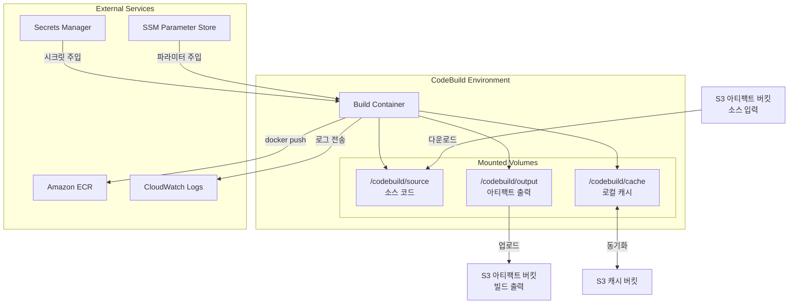
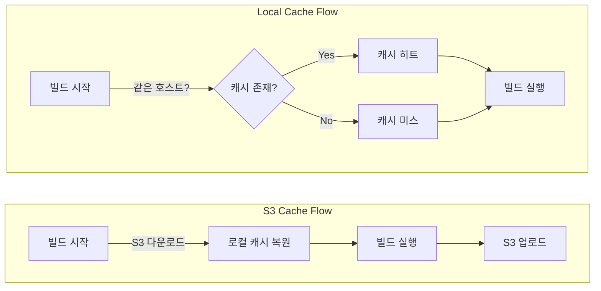

# buildspec.yml 고급 설정

CodeBuild의 핵심 설정 파일인 buildspec.yml의 고급 기능을 다룬다. 멀티 스테이지 Docker 빌드, 캐시 전략, 시크릿 주입, 다중 아티팩트 출력 등 프로덕션 수준의 빌드 파이프라인을 구성하는 방법을 설명한다.

## 목차
- [1. 핵심 개념 (What)](#1-핵심-개념-what)
- [2. 왜 알아야 하는가 (Why)](#2-왜-알아야-하는가-why)
- [3. 내부 구현 분석 (How)](#3-내부-구현-분석-how)
- [4. 실전 예제](#4-실전-예제)
- [5. 정리](#5-정리)

---

## 1. 핵심 개념 (What)

### buildspec.yml 전체 구조

```yaml
version: 0.2                    # 필수. 항상 0.2 사용

run-as: linux-user-name          # 선택. 빌드 실행 사용자

env:                             # 환경 변수 설정
  shell: bash                    # 기본 셸 (bash | /bin/sh)
  variables: {}                  # 평문 환경 변수
  parameter-store: {}            # SSM Parameter Store 참조
  secrets-manager: {}            # Secrets Manager 참조
  exported-variables: []         # 다음 단계로 전달할 변수
  git-credential-helper: yes     # Git 인증 헬퍼 활성화

proxy:                           # HTTP 프록시 설정 (선택)
  upload-artifacts: yes
  logs: yes

batch:                           # 배치 빌드 설정 (선택)
  fast-fail: true
  build-graph: []
  build-list: []
  build-matrix: {}

phases:                          # 빌드 단계 (핵심)
  install:
    runtime-versions: {}
    commands: []
  pre_build:
    commands: []
  build:
    commands: []
  post_build:
    commands: []

reports: {}                      # 테스트 리포트 설정

artifacts:                       # 빌드 출력물 설정
  files: []
  name: string
  discard-paths: yes
  base-directory: string
  secondary-artifacts: {}

cache:                           # 캐시 설정
  paths: []
```

### 빌드 단계(Phase) 실행 순서

| Phase | 용도 | 실패 시 동작 |
|-------|------|-------------|
| `install` | 런타임/도구 설치 | 빌드 중단 |
| `pre_build` | 빌드 전 준비 (로그인, 의존성) | 빌드 중단 |
| `build` | 실제 빌드 실행 | `post_build`는 실행됨 |
| `post_build` | 빌드 후 처리 (푸시, 정리) | 아티팩트 업로드는 시도됨 |

> **주의**: `build` 단계가 실패해도 `post_build`는 실행된다. `post_build`에서 `CODEBUILD_BUILD_SUCCEEDING` 변수를 확인해야 한다.

## 2. 왜 알아야 하는가 (Why)

### 기본 buildspec의 한계

단순한 `docker build && docker push`만으로는 프로덕션 파이프라인의 요구사항을 충족할 수 없다.

| 과제 | 기본 접근 | 고급 접근 |
|------|----------|----------|
| 빌드 속도 | 매번 전체 빌드 (5~10분) | Docker 레이어 캐시 + S3 캐시 (1~3분) |
| 이미지 크기 | 단일 스테이지 (1GB+) | 멀티 스테이지 빌드 (100MB 이하) |
| 시크릿 관리 | 환경 변수 하드코딩 | Secrets Manager/SSM 통합 |
| 빌드 재현성 | 로컬과 CI 환경 차이 | 커스텀 빌드 이미지 |
| 품질 검증 | 빌드만 수행 | 테스트 + 보안 스캔 + 리포트 |

### 빌드 캐시의 실질적 효과

```
캐시 미적용:
  npm install: 120초
  docker build: 180초
  총 빌드 시간: ~5분

캐시 적용 (S3 + Docker 레이어):
  npm install: 15초 (캐시 히트)
  docker build: 30초 (레이어 캐시)
  총 빌드 시간: ~1분 30초
  
  → 약 70% 시간 단축
```

## 3. 내부 구현 분석 (How)

### 빌드 환경 아키텍처



### 캐시 메커니즘

CodeBuild는 두 가지 캐시 유형을 지원한다.

**1. S3 캐시**: 빌드 간 파일 캐시 (node_modules, .m2 등)
- 빌드 시작 시 S3에서 다운로드 → 빌드 종료 시 S3에 업로드
- 여러 빌드 프로젝트 간 공유 가능

**2. 로컬 캐시**: Docker 레이어 캐시, 소스 캐시, 커스텀 캐시
- 동일한 빌드 호스트에서만 유효 (보장되지 않음)
- Docker 레이어 캐시는 `LOCAL_DOCKER_LAYER_CACHE` 타입 사용
- 빌드 호스트 재사용 시 효과적 (빈번한 빌드 시 적중률 높음)



### 시크릿 주입 흐름

```
1. buildspec.yml에 시크릿 참조 선언
2. CodeBuild가 빌드 시작 시 Secrets Manager/SSM에서 값 조회
3. 환경 변수로 빌드 컨테이너에 주입
4. 빌드 로그에는 마스킹 처리됨 (****)
```

## 4. 실전 예제

### 4.1 멀티 스테이지 Docker 빌드

```dockerfile
# Dockerfile (멀티 스테이지)
# Stage 1: 의존성 설치 + 빌드
FROM node:20-alpine AS builder
WORKDIR /app
COPY package*.json ./
RUN npm ci --only=production && cp -R node_modules prod_modules
RUN npm ci
COPY . .
RUN npm run build

# Stage 2: 프로덕션 이미지
FROM node:20-alpine AS production
WORKDIR /app

RUN addgroup -g 1001 -S nodejs && \
    adduser -S appuser -u 1001

COPY --from=builder /app/prod_modules ./node_modules
COPY --from=builder /app/dist ./dist
COPY --from=builder /app/package.json ./

USER appuser
EXPOSE 8080

HEALTHCHECK --interval=30s --timeout=3s --start-period=5s --retries=3 \
  CMD wget --no-verbose --tries=1 --spider http://localhost:8080/health || exit 1

CMD ["node", "dist/main.js"]
```

```yaml
# buildspec.yml - 멀티 스테이지 빌드 + BuildKit 활성화
version: 0.2

env:
  variables:
    DOCKER_BUILDKIT: "1"
    IMAGE_REPO_NAME: "my-app"

phases:
  pre_build:
    commands:
      - echo Logging in to Amazon ECR...
      - aws ecr get-login-password --region $AWS_DEFAULT_REGION | docker login --username AWS --password-stdin $AWS_ACCOUNT_ID.dkr.ecr.$AWS_DEFAULT_REGION.amazonaws.com
      - IMAGE_URI=$AWS_ACCOUNT_ID.dkr.ecr.$AWS_DEFAULT_REGION.amazonaws.com/$IMAGE_REPO_NAME
      - COMMIT_HASH=$(echo $CODEBUILD_RESOLVED_SOURCE_VERSION | cut -c 1-8)
      - IMAGE_TAG=${COMMIT_HASH:=latest}
  build:
    commands:
      - echo Building with BuildKit...
      - docker build
          --build-arg BUILDKIT_INLINE_CACHE=1
          --cache-from $IMAGE_URI:latest
          --tag $IMAGE_URI:$IMAGE_TAG
          --tag $IMAGE_URI:latest
          --target production
          .
  post_build:
    commands:
      - echo Pushing Docker images...
      - docker push $IMAGE_URI:$IMAGE_TAG
      - docker push $IMAGE_URI:latest
      - printf '{"ImageURI":"%s"}' $IMAGE_URI:$IMAGE_TAG > imageDetail.json

artifacts:
  files:
    - imageDetail.json
    - appspec.yaml
    - taskdef.json
```

### 4.2 S3 + 로컬 캐시 전략

```yaml
version: 0.2

env:
  variables:
    DOCKER_BUILDKIT: "1"

phases:
  install:
    runtime-versions:
      nodejs: 20
  pre_build:
    commands:
      - echo Restoring npm cache...
      - |
        if [ -d "/root/.npm" ]; then
          echo "npm cache found"
        else
          echo "npm cache not found, will be created"
        fi
      - npm ci
  build:
    commands:
      - npm run test
      - npm run build

cache:
  paths:
    # npm 캐시 디렉토리
    - '/root/.npm/**/*'
    # node_modules 자체를 캐싱 (npm ci보다 빠른 복원)
    - 'node_modules/**/*'
```

CodeBuild 프로젝트에서 캐시 설정:

```bash
# S3 캐시 설정
aws codebuild update-project \
  --name my-app-build \
  --cache '{
    "type": "S3",
    "location": "my-build-cache-bucket/my-app"
  }'

# 또는 로컬 캐시 설정 (Docker 레이어 + 소스 + 커스텀)
aws codebuild update-project \
  --name my-app-build \
  --cache '{
    "type": "LOCAL",
    "modes": [
      "LOCAL_DOCKER_LAYER_CACHE",
      "LOCAL_SOURCE_CACHE",
      "LOCAL_CUSTOM_CACHE"
    ]
  }'
```

### 4.3 Secrets Manager / SSM Parameter Store 시크릿 주입

```yaml
version: 0.2

env:
  # SSM Parameter Store에서 가져오기
  parameter-store:
    DOCKERHUB_USERNAME: "/codebuild/dockerhub/username"
    DOCKERHUB_PASSWORD: "/codebuild/dockerhub/password"
    SONAR_TOKEN: "/codebuild/sonarqube/token"

  # Secrets Manager에서 가져오기
  secrets-manager:
    # 형식: ENV_VAR: secret-id:json-key:version-stage:version-id
    DB_PASSWORD: "prod/myapp/db:password"
    API_KEY: "prod/myapp/api:key"
    # JSON 키 없이 전체 값 가져오기
    GITHUB_TOKEN: "prod/github-token"

  # 다음 Pipeline 단계로 변수 전달
  exported-variables:
    - IMAGE_TAG
    - BUILD_NUMBER

phases:
  pre_build:
    commands:
      # DockerHub 로그인 (pull rate limit 회피)
      - echo $DOCKERHUB_PASSWORD | docker login --username $DOCKERHUB_USERNAME --password-stdin
      # ECR 로그인
      - aws ecr get-login-password --region $AWS_DEFAULT_REGION | docker login --username AWS --password-stdin $AWS_ACCOUNT_ID.dkr.ecr.$AWS_DEFAULT_REGION.amazonaws.com
  build:
    commands:
      # 시크릿을 빌드 인수로 전달 (Docker 이미지에 남지 않음)
      - docker build
          --secret id=db_password,env=DB_PASSWORD
          --tag $IMAGE_URI:$IMAGE_TAG
          .
```

> **주의**: `env.secrets-manager`와 `env.parameter-store`에서 참조하는 시크릿에 접근하려면 CodeBuild 서비스 역할에 해당 권한이 필요하다.

```json
{
  "Version": "2012-10-17",
  "Statement": [
    {
      "Effect": "Allow",
      "Action": [
        "secretsmanager:GetSecretValue"
      ],
      "Resource": "arn:aws:secretsmanager:ap-northeast-2:123456789012:secret:prod/*"
    },
    {
      "Effect": "Allow",
      "Action": [
        "ssm:GetParameters"
      ],
      "Resource": "arn:aws:ssm:ap-northeast-2:123456789012:parameter/codebuild/*"
    }
  ]
}
```

### 4.4 다중 아티팩트 출력

하나의 빌드에서 여러 아티팩트를 생성하여 파이프라인의 서로 다른 단계에서 사용할 수 있다.

```yaml
version: 0.2

phases:
  build:
    commands:
      - npm run build
      - npm run test -- --coverage
      - docker build -t $IMAGE_URI:$IMAGE_TAG .
  post_build:
    commands:
      - docker push $IMAGE_URI:$IMAGE_TAG
      - printf '{"ImageURI":"%s"}' $IMAGE_URI:$IMAGE_TAG > imageDetail.json

artifacts:
  # 기본 아티팩트 (Deploy 단계용)
  files:
    - imageDetail.json
    - appspec.yaml
    - taskdef.json
  name: DeployArtifact

  # 보조 아티팩트 (테스트 리포트, 정적 파일 등)
  secondary-artifacts:
    TestReports:
      files:
        - '**/*'
      base-directory: coverage
      name: TestCoverageReport
    
    StaticAssets:
      files:
        - '**/*'
      base-directory: dist/static
      name: StaticFiles
      discard-paths: no

reports:
  # JUnit 테스트 리포트
  jest-reports:
    files:
      - 'junit.xml'
    base-directory: test-results
    file-format: JUNITXML
  
  # 코드 커버리지 리포트
  coverage-reports:
    files:
      - 'clover.xml'
    base-directory: coverage
    file-format: CLOVERXML
```

### 4.5 커스텀 빌드 이미지

기본 CodeBuild 이미지 대신 자체 빌드 이미지를 사용하면 도구 설치 시간을 절약할 수 있다.

```dockerfile
# Dockerfile.codebuild - 커스텀 빌드 이미지
FROM aws/codebuild/amazonlinux2-x86_64-standard:5.0

# 추가 도구 설치
RUN yum install -y jq && \
    pip3 install checkov && \
    curl -sSfL https://raw.githubusercontent.com/aquasecurity/trivy/main/contrib/install.sh | sh -s -- -b /usr/local/bin

# Hadolint (Dockerfile 린터)
RUN curl -sSL https://github.com/hadolint/hadolint/releases/latest/download/hadolint-Linux-x86_64 \
    -o /usr/local/bin/hadolint && \
    chmod +x /usr/local/bin/hadolint
```

```bash
# 커스텀 이미지를 ECR에 푸시
docker build -f Dockerfile.codebuild -t codebuild-custom .
docker tag codebuild-custom:latest $AWS_ACCOUNT_ID.dkr.ecr.$AWS_DEFAULT_REGION.amazonaws.com/codebuild-custom:latest
docker push $AWS_ACCOUNT_ID.dkr.ecr.$AWS_DEFAULT_REGION.amazonaws.com/codebuild-custom:latest

# CodeBuild 프로젝트에서 커스텀 이미지 사용
aws codebuild update-project \
  --name my-app-build \
  --environment '{
    "type": "LINUX_CONTAINER",
    "image": "'$AWS_ACCOUNT_ID'.dkr.ecr.'$AWS_DEFAULT_REGION'.amazonaws.com/codebuild-custom:latest",
    "computeType": "BUILD_GENERAL1_MEDIUM",
    "imagePullCredentialsType": "SERVICE_ROLE",
    "privilegedMode": true
  }'
```

### 4.6 buildspec 오버라이드

파이프라인 설정에서 buildspec 파일 경로를 오버라이드할 수 있다. 환경별로 다른 빌드 설정을 사용할 때 유용하다.

```bash
# 프로젝트 레벨에서 buildspec 경로 변경
aws codebuild update-project \
  --name my-app-build \
  --source '{
    "type": "CODEPIPELINE",
    "buildspec": "ci/buildspec-prod.yml"
  }'
```

```
프로젝트 디렉토리 구조:
my-app/
├── ci/
│   ├── buildspec-dev.yml      # 개발 환경: 테스트만 실행
│   ├── buildspec-staging.yml  # 스테이징: 빌드 + E2E 테스트
│   └── buildspec-prod.yml     # 프로덕션: 전체 빌드 + 보안 스캔
├── Dockerfile
└── src/
```

인라인 buildspec으로 오버라이드할 수도 있다:

```bash
# 인라인 buildspec (디버깅용)
aws codebuild start-build \
  --project-name my-app-build \
  --buildspec-override "version: 0.2
phases:
  build:
    commands:
      - echo 'Debug build'
      - env
      - docker info"
```

### 4.7 빌드 실패 시 안전한 post_build 처리

```yaml
version: 0.2

phases:
  build:
    commands:
      - npm run test
      - docker build -t $IMAGE_URI:$IMAGE_TAG .
  post_build:
    commands:
      # build 단계 성공 여부 확인
      - |
        if [ "$CODEBUILD_BUILD_SUCCEEDING" = "1" ]; then
          echo "Build succeeded, pushing image..."
          docker push $IMAGE_URI:$IMAGE_TAG
          docker push $IMAGE_URI:latest
          printf '{"ImageURI":"%s"}' $IMAGE_URI:$IMAGE_TAG > imageDetail.json
        else
          echo "Build failed, skipping push"
          exit 1
        fi

artifacts:
  files:
    - imageDetail.json
    - appspec.yaml
    - taskdef.json
```

## 5. 정리

### buildspec 기능 비교 표

| 기능 | 설정 위치 | 핵심 포인트 |
|------|----------|------------|
| 멀티 스테이지 빌드 | Dockerfile + buildspec | `--target` 으로 스테이지 지정, BuildKit 활성화 |
| S3 캐시 | `cache.paths` + 프로젝트 설정 | `node_modules`, `.npm`, `.m2` 등 캐시 |
| 로컬 Docker 캐시 | 프로젝트 캐시 설정 | `LOCAL_DOCKER_LAYER_CACHE` 모드, 호스트 재사용 시 유효 |
| Secrets Manager | `env.secrets-manager` | `secret-id:json-key` 형식, IAM 권한 필요 |
| SSM Parameter | `env.parameter-store` | 파라미터 경로로 참조, IAM 권한 필요 |
| 다중 아티팩트 | `artifacts.secondary-artifacts` | 파이프라인 단계별로 다른 아티팩트 사용 |
| 커스텀 이미지 | CodeBuild 프로젝트 환경 | ECR에 커스텀 이미지 저장, `imagePullCredentialsType: SERVICE_ROLE` |
| buildspec 오버라이드 | 소스 설정 또는 start-build | 환경별 파일 분리 또는 인라인 오버라이드 |
| 변수 내보내기 | `env.exported-variables` | Pipeline 다음 단계에서 `#{Build.IMAGE_TAG}` 형태로 참조 |
| 빌드 실패 처리 | `post_build` | `$CODEBUILD_BUILD_SUCCEEDING` 확인 필수 |

### 성능 최적화 체크리스트

```
[ ] Docker BuildKit 활성화 (DOCKER_BUILDKIT=1)
[ ] 멀티 스테이지 Dockerfile로 이미지 크기 최소화
[ ] S3 캐시 또는 로컬 Docker 레이어 캐시 설정
[ ] --cache-from으로 ECR 이미지를 빌드 캐시로 활용
[ ] .dockerignore로 불필요한 파일 제외
[ ] 적절한 computeType 선택 (SMALL/MEDIUM/LARGE)
[ ] DockerHub rate limit 대비 ECR Public 또는 인증 로그인 설정
```

---
*참고: AWS 서비스 최신 버전 기준 (2024-2025)*
