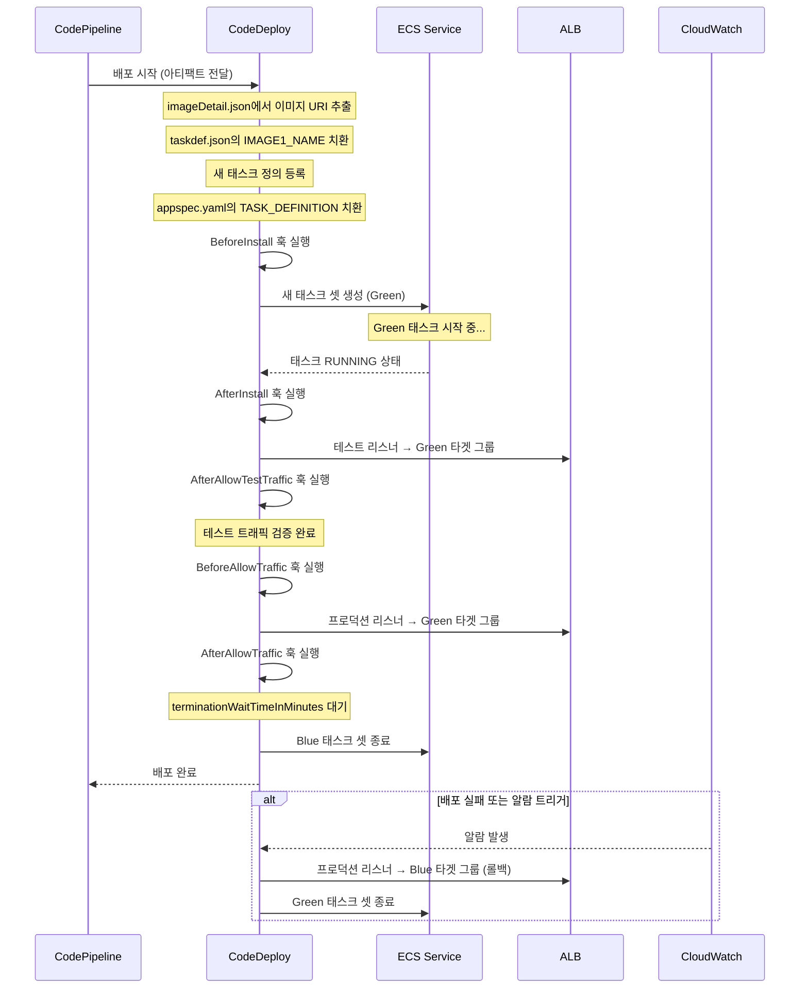
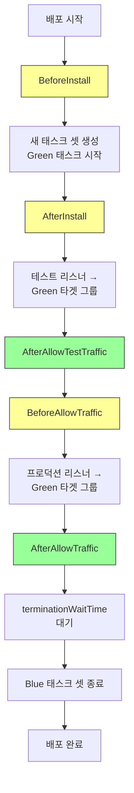

# AppSpec과 태스크 정의 작성법

ECS Blue/Green 배포의 핵심 설정 파일인 appspec.yaml과 taskdef.json의 상세 구조와 작성법을 다룬다. CodeDeploy가 이 두 파일을 사용하여 새 태스크를 배포하고 트래픽을 전환하는 전체 과정을 설명한다.

## 목차
- [1. 핵심 개념 (What)](#1-핵심-개념-what)
- [2. 왜 알아야 하는가 (Why)](#2-왜-알아야-하는가-why)
- [3. 내부 구현 분석 (How)](#3-내부-구현-분석-how)
- [4. 실전 예제](#4-실전-예제)
- [5. 정리](#5-정리)

---

## 1. 핵심 개념 (What)

### 두 파일의 역할

| 파일 | 역할 | 소비자 |
|------|------|--------|
| `appspec.yaml` | 배포 대상 서비스, 컨테이너, 포트, 라이프사이클 훅 정의 | CodeDeploy |
| `taskdef.json` | ECS 태스크(컨테이너) 실행 사양 정의 | ECS (CodeDeploy 경유) |

### appspec.yaml 스키마

```yaml
version: 0.0                          # 필수. ECS 배포는 항상 0.0
Resources:
  - TargetService:                     # 필수. 배포 대상 서비스
      Type: AWS::ECS::Service          # 필수. 항상 이 값
      Properties:
        TaskDefinition: <TASK_DEFINITION>  # 필수. 플레이스홀더
        LoadBalancerInfo:
          ContainerName: "container-name"  # 필수. ALB에 연결된 컨테이너
          ContainerPort: 8080              # 필수. 컨테이너 포트
        PlatformVersion: "LATEST"          # 선택. Fargate 플랫폼 버전
        NetworkConfiguration:              # 선택. 네트워크 오버라이드
          AwsvpcConfiguration:
            Subnets: ["subnet-xxx"]
            SecurityGroups: ["sg-xxx"]
            AssignPublicIp: "DISABLED"
        CapacityProviderStrategy:          # 선택. 용량 공급자 전략
          - Base: 1
            CapacityProvider: "FARGATE"
            Weight: 1

Hooks:                                    # 선택. 라이프사이클 훅
  - BeforeInstall: "LambdaFunctionName"
  - AfterInstall: "LambdaFunctionName"
  - AfterAllowTestTraffic: "LambdaFunctionName"
  - BeforeAllowTraffic: "LambdaFunctionName"
  - AfterAllowTraffic: "LambdaFunctionName"
```

### taskdef.json 핵심 필드

```json
{
  "family": "my-app",
  "taskRoleArn": "arn:aws:iam::...",
  "executionRoleArn": "arn:aws:iam::...",
  "networkMode": "awsvpc",
  "requiresCompatibilities": ["FARGATE"],
  "cpu": "512",
  "memory": "1024",
  "containerDefinitions": [
    {
      "name": "my-app",
      "image": "<IMAGE1_NAME>",
      "portMappings": [...],
      "logConfiguration": {...},
      "healthCheck": {...},
      "environment": [...],
      "secrets": [...]
    }
  ]
}
```

> **`<TASK_DEFINITION>`과 `<IMAGE1_NAME>`은 플레이스홀더이다.** CodeDeploy가 배포 시점에 실제 값으로 치환한다.

## 2. 왜 알아야 하는가 (Why)

### 배포 실패의 대부분은 이 두 파일에서 발생

실무에서 ECS Blue/Green 배포가 실패하는 가장 흔한 원인:

| 순위 | 실패 원인 | 관련 파일 |
|------|----------|----------|
| 1 | 컨테이너 헬스 체크 실패 | taskdef.json |
| 2 | 포트 매핑 불일치 | appspec.yaml + taskdef.json |
| 3 | 이미지 플레이스홀더 미치환 | taskdef.json + imageDetail.json |
| 4 | IAM 권한 부족 (ECR pull, Secrets Manager) | taskdef.json |
| 5 | 라이프사이클 훅 Lambda 실패/타임아웃 | appspec.yaml |

### 동적 이미지 치환이 중요한 이유

리포지토리에 저장하는 taskdef.json에는 이미지 URI를 하드코딩하지 않는다. 대신 `<IMAGE1_NAME>` 플레이스홀더를 사용하고, CodeDeploy가 빌드 단계에서 생성된 `imageDetail.json`의 URI로 자동 치환한다.

```
빌드 아티팩트 구조:
├── imageDetail.json    ← {"ImageURI": "123456789012.dkr.ecr....:abc12345"}
├── appspec.yaml        ← <TASK_DEFINITION> 플레이스홀더 포함
└── taskdef.json        ← <IMAGE1_NAME> 플레이스홀더 포함

CodeDeploy 치환 과정:
1. imageDetail.json에서 ImageURI 읽기
2. taskdef.json의 <IMAGE1_NAME>을 실제 이미지 URI로 치환
3. 치환된 taskdef.json으로 새 태스크 정의 등록
4. appspec.yaml의 <TASK_DEFINITION>을 새 태스크 정의 ARN으로 치환
```

## 3. 내부 구현 분석 (How)

### CodeDeploy의 배포 처리 흐름



### 라이프사이클 훅 실행 순서



각 훅의 용도:

| 훅 | 실행 시점 | 주요 용도 |
|----|----------|----------|
| `BeforeInstall` | 새 태스크 생성 전 | DB 마이그레이션, 사전 검증 |
| `AfterInstall` | 새 태스크 RUNNING 후 | 컨테이너 내부 상태 검증 |
| `AfterAllowTestTraffic` | 테스트 트래픽 전환 후 | **통합 테스트, E2E 테스트, 스모크 테스트** |
| `BeforeAllowTraffic` | 프로덕션 트래픽 전환 전 | 최종 검증, 준비 상태 확인 |
| `AfterAllowTraffic` | 프로덕션 트래픽 전환 후 | 모니터링 확인, 알림 발송 |

> **`AfterAllowTestTraffic`이 가장 중요한 훅이다.** 테스트 리스너를 통해 실제 Green 환경에 HTTP 요청을 보내 검증할 수 있는 유일한 시점이다.

## 4. 실전 예제

### 4.1 프로덕션 수준 appspec.yaml

```yaml
version: 0.0
Resources:
  - TargetService:
      Type: AWS::ECS::Service
      Properties:
        TaskDefinition: <TASK_DEFINITION>
        LoadBalancerInfo:
          ContainerName: "my-app"
          ContainerPort: 8080
        PlatformVersion: "1.4.0"
        NetworkConfiguration:
          AwsvpcConfiguration:
            Subnets:
              - "subnet-0a1b2c3d4e5f00001"
              - "subnet-0a1b2c3d4e5f00002"
            SecurityGroups:
              - "sg-0a1b2c3d4e5f00001"
            AssignPublicIp: "DISABLED"

Hooks:
  - AfterInstall: "arn:aws:lambda:ap-northeast-2:123456789012:function:validate-deployment"
  - AfterAllowTestTraffic: "arn:aws:lambda:ap-northeast-2:123456789012:function:run-smoke-tests"
  - AfterAllowTraffic: "arn:aws:lambda:ap-northeast-2:123456789012:function:notify-deployment"
```

### 4.2 프로덕션 수준 taskdef.json

```json
{
  "family": "my-app",
  "taskRoleArn": "arn:aws:iam::123456789012:role/MyAppTaskRole",
  "executionRoleArn": "arn:aws:iam::123456789012:role/MyAppTaskExecutionRole",
  "networkMode": "awsvpc",
  "requiresCompatibilities": ["FARGATE"],
  "cpu": "512",
  "memory": "1024",
  "runtimePlatform": {
    "cpuArchitecture": "X86_64",
    "operatingSystemFamily": "LINUX"
  },
  "containerDefinitions": [
    {
      "name": "my-app",
      "image": "<IMAGE1_NAME>",
      "essential": true,
      "portMappings": [
        {
          "containerPort": 8080,
          "protocol": "tcp",
          "appProtocol": "http"
        }
      ],
      "healthCheck": {
        "command": ["CMD-SHELL", "curl -f http://localhost:8080/health || exit 1"],
        "interval": 30,
        "timeout": 5,
        "retries": 3,
        "startPeriod": 60
      },
      "logConfiguration": {
        "logDriver": "awslogs",
        "options": {
          "awslogs-group": "/ecs/my-app",
          "awslogs-region": "ap-northeast-2",
          "awslogs-stream-prefix": "ecs",
          "awslogs-create-group": "true"
        }
      },
      "environment": [
        {
          "name": "NODE_ENV",
          "value": "production"
        },
        {
          "name": "PORT",
          "value": "8080"
        },
        {
          "name": "LOG_LEVEL",
          "value": "info"
        }
      ],
      "secrets": [
        {
          "name": "DB_HOST",
          "valueFrom": "arn:aws:ssm:ap-northeast-2:123456789012:parameter/prod/my-app/db-host"
        },
        {
          "name": "DB_PASSWORD",
          "valueFrom": "arn:aws:secretsmanager:ap-northeast-2:123456789012:secret:prod/my-app/db:password::"
        },
        {
          "name": "API_KEY",
          "valueFrom": "arn:aws:secretsmanager:ap-northeast-2:123456789012:secret:prod/my-app/api-key"
        }
      ],
      "ulimits": [
        {
          "name": "nofile",
          "softLimit": 65536,
          "hardLimit": 65536
        }
      ],
      "linuxParameters": {
        "initProcessEnabled": true
      },
      "stopTimeout": 120,
      "dependsOn": []
    }
  ],
  "volumes": [],
  "tags": [
    {
      "key": "Project",
      "value": "my-app"
    },
    {
      "key": "Environment",
      "value": "production"
    }
  ]
}
```

### 4.3 컨테이너 정의 상세 설명

#### 포트 매핑

```json
"portMappings": [
  {
    "containerPort": 8080,      // 컨테이너 내부 포트
    "protocol": "tcp",          // tcp 또는 udp
    "appProtocol": "http"       // Service Connect 사용 시
    // Fargate에서는 hostPort 불필요 (awsvpc 모드)
  }
]
```

> **주의**: `appspec.yaml`의 `ContainerPort`와 `taskdef.json`의 `containerPort`가 반드시 일치해야 한다. 불일치 시 배포는 성공하지만 트래픽이 전달되지 않는다.

#### 헬스 체크 설계

```json
"healthCheck": {
  "command": [
    "CMD-SHELL",
    "curl -f http://localhost:8080/health || exit 1"
  ],
  "interval": 30,        // 검사 간격 (초)
  "timeout": 5,          // 타임아웃 (초)
  "retries": 3,          // 실패 허용 횟수
  "startPeriod": 60      // 시작 대기 시간 (초) — 앱 초기화 시간 고려
}
```

헬스 체크는 두 레벨에서 동작한다:

```
1. ECS 태스크 헬스 체크 (taskdef.json)
   - 컨테이너 레벨 검사
   - 실패 시 태스크 UNHEALTHY → 교체

2. ALB 타겟 그룹 헬스 체크 (타겟 그룹 설정)
   - 네트워크 레벨 검사
   - 실패 시 타겟에서 제거 → 배포 실패
   
두 헬스 체크 모두 통과해야 배포가 성공한다.
```

#### 로깅 설정

```json
"logConfiguration": {
  "logDriver": "awslogs",
  "options": {
    "awslogs-group": "/ecs/my-app",
    "awslogs-region": "ap-northeast-2",
    "awslogs-stream-prefix": "ecs",
    "awslogs-create-group": "true",
    // 선택: 로그 형식 지정
    "awslogs-datetime-format": "%Y-%m-%dT%H:%M:%S",
    "mode": "non-blocking",
    "max-buffer-size": "4m"
  }
}
```

#### 시크릿 주입 (SSM vs Secrets Manager)

```json
"secrets": [
  // SSM Parameter Store (단일 값)
  {
    "name": "DB_HOST",
    "valueFrom": "arn:aws:ssm:REGION:ACCOUNT:parameter/prod/db-host"
  },
  // Secrets Manager (전체 시크릿)
  {
    "name": "DB_CREDENTIALS",
    "valueFrom": "arn:aws:secretsmanager:REGION:ACCOUNT:secret:prod/db-creds"
  },
  // Secrets Manager (특정 JSON 키)
  {
    "name": "DB_PASSWORD",
    "valueFrom": "arn:aws:secretsmanager:REGION:ACCOUNT:secret:prod/db-creds:password::"
  }
]
```

> SSM은 설정 값, Secrets Manager는 비밀번호/API 키에 사용한다. Secrets Manager는 자동 로테이션을 지원하므로 보안에 민감한 값에 적합하다.

### 4.4 imageDetail.json과 동적 치환

빌드 단계에서 생성하는 `imageDetail.json`:

```json
{
  "ImageURI": "123456789012.dkr.ecr.ap-northeast-2.amazonaws.com/my-app:abc12345"
}
```

CodePipeline의 Deploy 단계 설정에서 이미지 치환을 연결한다:

```json
{
  "configuration": {
    "ApplicationName": "my-app-deploy",
    "DeploymentGroupName": "my-app-dg",
    "TaskDefinitionTemplateArtifact": "BuildOutput",
    "TaskDefinitionTemplatePath": "taskdef.json",
    "AppSpecTemplateArtifact": "BuildOutput",
    "AppSpecTemplatePath": "appspec.yaml",
    "Image1ArtifactName": "BuildOutput",
    "Image1ContainerName": "IMAGE1_NAME"
    // IMAGE1_NAME은 taskdef.json에서 <IMAGE1_NAME>을 찾아 치환
  }
}
```

### 4.5 라이프사이클 훅 Lambda 예제

#### AfterAllowTestTraffic: 스모크 테스트

```python
import boto3
import urllib3
import json

codedeploy = boto3.client('codedeploy')
http = urllib3.PoolManager()

def handler(event, context):
    deployment_id = event['DeploymentId']
    lifecycle_event_hook_execution_id = event['LifecycleEventHookExecutionId']

    # 테스트 리스너 URL (테스트 포트 8080)
    test_url = "http://my-alb-1234567890.ap-northeast-2.elb.amazonaws.com:8080"

    try:
        # 헬스 체크
        response = http.request('GET', f"{test_url}/health", timeout=10)
        if response.status != 200:
            raise Exception(f"Health check failed: {response.status}")

        # API 엔드포인트 검증
        response = http.request('GET', f"{test_url}/api/v1/status", timeout=10)
        data = json.loads(response.data.decode('utf-8'))
        if data.get('status') != 'ok':
            raise Exception(f"Status check failed: {data}")

        # 성공
        status = 'Succeeded'
        print(f"Smoke tests passed for deployment {deployment_id}")

    except Exception as e:
        status = 'Failed'
        print(f"Smoke tests failed: {str(e)}")

    # CodeDeploy에 결과 보고
    codedeploy.put_lifecycle_event_hook_execution_status(
        deploymentId=deployment_id,
        lifecycleEventHookExecutionId=lifecycle_event_hook_execution_id,
        status=status
    )

    return {'statusCode': 200, 'body': status}
```

#### AfterAllowTraffic: 배포 알림

```python
import boto3
import json

sns = boto3.client('sns')

def handler(event, context):
    deployment_id = event['DeploymentId']
    lifecycle_event_hook_execution_id = event['LifecycleEventHookExecutionId']
    codedeploy = boto3.client('codedeploy')

    try:
        # 배포 성공 알림 발송
        sns.publish(
            TopicArn='arn:aws:sns:ap-northeast-2:123456789012:deployment-notifications',
            Subject=f'Deployment Succeeded: {deployment_id}',
            Message=json.dumps({
                'deploymentId': deployment_id,
                'status': 'SUCCEEDED',
                'message': 'Production traffic switched to new version'
            })
        )
        status = 'Succeeded'
    except Exception as e:
        print(f"Notification failed: {str(e)}")
        # 알림 실패는 배포를 실패시키지 않도록 처리
        status = 'Succeeded'

    codedeploy.put_lifecycle_event_hook_execution_status(
        deploymentId=deployment_id,
        lifecycleEventHookExecutionId=lifecycle_event_hook_execution_id,
        status=status
    )

    return {'statusCode': 200}
```

### 4.6 사이드카 컨테이너 패턴

```json
{
  "family": "my-app-with-sidecar",
  "cpu": "1024",
  "memory": "2048",
  "containerDefinitions": [
    {
      "name": "my-app",
      "image": "<IMAGE1_NAME>",
      "essential": true,
      "portMappings": [
        {"containerPort": 8080, "protocol": "tcp"}
      ],
      "logConfiguration": {
        "logDriver": "awslogs",
        "options": {
          "awslogs-group": "/ecs/my-app",
          "awslogs-region": "ap-northeast-2",
          "awslogs-stream-prefix": "app"
        }
      },
      "dependsOn": [
        {
          "containerName": "datadog-agent",
          "condition": "START"
        }
      ]
    },
    {
      "name": "datadog-agent",
      "image": "public.ecr.aws/datadog/agent:latest",
      "essential": false,
      "portMappings": [
        {"containerPort": 8126, "protocol": "tcp"}
      ],
      "environment": [
        {"name": "ECS_FARGATE", "value": "true"},
        {"name": "DD_APM_ENABLED", "value": "true"}
      ],
      "secrets": [
        {
          "name": "DD_API_KEY",
          "valueFrom": "arn:aws:secretsmanager:ap-northeast-2:123456789012:secret:datadog-api-key"
        }
      ],
      "logConfiguration": {
        "logDriver": "awslogs",
        "options": {
          "awslogs-group": "/ecs/my-app",
          "awslogs-region": "ap-northeast-2",
          "awslogs-stream-prefix": "datadog"
        }
      }
    }
  ]
}
```

> 사이드카 컨테이너는 `essential: false`로 설정하여 사이드카 장애가 메인 컨테이너에 영향을 미치지 않도록 한다.

## 5. 정리

### appspec.yaml vs taskdef.json 비교

| 항목 | appspec.yaml | taskdef.json |
|------|-------------|-------------|
| 소비자 | CodeDeploy | ECS (CodeDeploy 경유) |
| 버전 | `0.0` (ECS 고정) | N/A (ECS API 버전) |
| 플레이스홀더 | `<TASK_DEFINITION>` | `<IMAGE1_NAME>` |
| 정의 내용 | 서비스 + 로드밸런서 + 훅 | 컨테이너 + 리소스 + 네트워크 |
| 배포 시 동작 | 타겟 그룹/리스너 전환 제어 | 태스크 정의 등록 → 태스크 실행 |

### 필수 체크리스트

```
appspec.yaml:
  [ ] version: 0.0 (ECS용)
  [ ] ContainerName이 taskdef.json의 name과 일치
  [ ] ContainerPort가 taskdef.json의 containerPort와 일치
  [ ] 필요한 라이프사이클 훅 Lambda 함수 준비

taskdef.json:
  [ ] image 필드에 <IMAGE1_NAME> 플레이스홀더 사용
  [ ] executionRoleArn에 ECR pull + Secrets Manager 권한 포함
  [ ] healthCheck 설정 (startPeriod를 앱 초기화 시간보다 길게)
  [ ] logConfiguration 설정 (CloudWatch Logs)
  [ ] secrets로 민감 정보 주입 (환경 변수 하드코딩 금지)
  [ ] stopTimeout 설정 (graceful shutdown 대기)
  [ ] linuxParameters.initProcessEnabled: true (좀비 프로세스 방지)

imageDetail.json (빌드 시 생성):
  [ ] {"ImageURI": "ACCOUNT.dkr.ecr.REGION.amazonaws.com/REPO:TAG"} 형식

Pipeline Deploy 설정:
  [ ] Image1ContainerName이 taskdef.json의 플레이스홀더와 일치
  [ ] TaskDefinitionTemplatePath와 AppSpecTemplatePath 경로 확인
```

### 흔한 실수와 해결

| 실수 | 증상 | 해결 |
|------|------|------|
| 포트 불일치 | 배포 성공, 503 에러 | appspec/taskdef/ALB 타겟 그룹 포트 통일 |
| 플레이스홀더 오타 | 이미지 pull 실패 | `<IMAGE1_NAME>` 대소문자 정확히 확인 |
| startPeriod 부족 | 헬스 체크 실패로 배포 롤백 | 앱 시작 시간 측정 후 여유 있게 설정 |
| essential 미설정 | 사이드카 장애 시 태스크 재시작 | 사이드카는 `essential: false` |
| executionRole 권한 부족 | 태스크 시작 실패 | ECR, Secrets Manager, CloudWatch Logs 권한 확인 |

---
*참고: AWS 서비스 최신 버전 기준 (2024-2025)*
