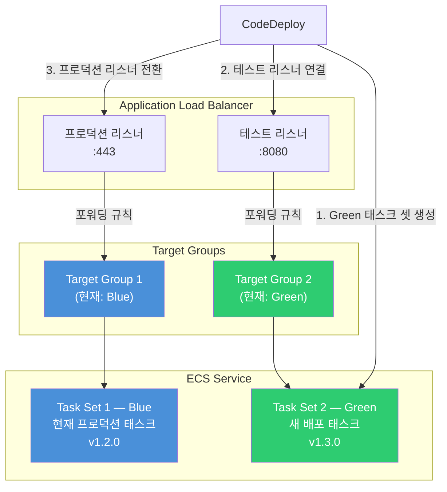
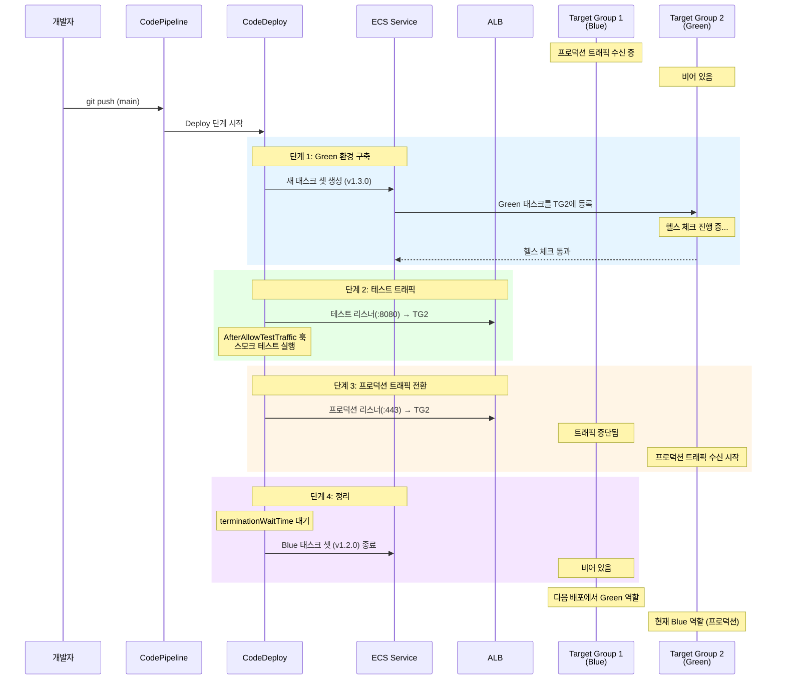
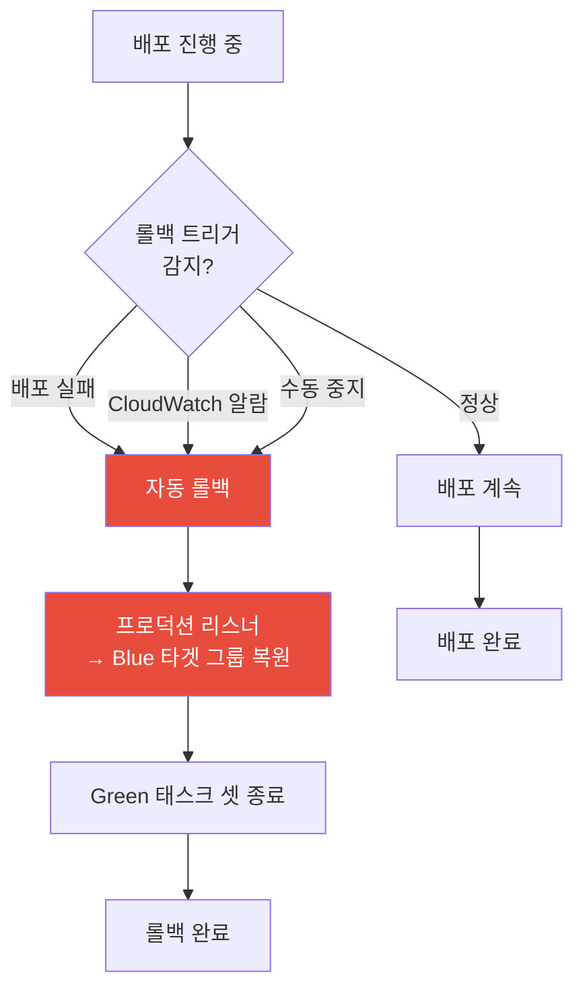
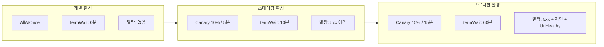

# Blue/Green 배포 심화

ECS Blue/Green 배포의 내부 동작을 깊이 분석한다. 프로덕션 리스너와 테스트 리스너의 이중 구조, 타겟 그룹 전환 메커니즘, 트래픽 전환 정책, 자동 롤백, 배포 대기 시간 설정까지 실전 운영에 필요한 모든 것을 다룬다.

## 목차
- [1. 핵심 개념 (What)](#1-핵심-개념-what)
- [2. 왜 알아야 하는가 (Why)](#2-왜-알아야-하는가-why)
- [3. 내부 구현 분석 (How)](#3-내부-구현-분석-how)
- [4. 실전 예제](#4-실전-예제)
- [5. 정리](#5-정리)

---

## 1. 핵심 개념 (What)

### Blue/Green 배포란

Blue/Green 배포는 두 개의 동일한 환경(Blue, Green)을 유지하면서 트래픽을 한쪽에서 다른 쪽으로 전환하는 배포 전략이다. ECS에서는 CodeDeploy가 ALB의 타겟 그룹과 리스너 규칙을 조작하여 이를 구현한다.

| 구성 요소 | Blue (현재) | Green (신규) |
|-----------|------------|-------------|
| 태스크 셋 | 현재 실행 중인 태스크 | 배포 시 새로 생성되는 태스크 |
| 타겟 그룹 | Target Group 1 (트래픽 수신 중) | Target Group 2 (대기 중) |
| 트래픽 | 프로덕션 리스너가 라우팅 | 테스트 리스너로만 접근 가능 |

### 핵심 인프라 구성 요소

```
ALB (Application Load Balancer)
├── 프로덕션 리스너 (포트 443 또는 80)
│   └── 현재 → Target Group Blue (활성 태스크 셋)
├── 테스트 리스너 (포트 8080)
│   └── 배포 중 → Target Group Green (신규 태스크 셋)
├── Target Group 1 (Blue ↔ Green 역할 교대)
└── Target Group 2 (Blue ↔ Green 역할 교대)

ECS Service (deployment-controller: CODE_DEPLOY)
├── Primary Task Set (Blue) — 현재 프로덕션 트래픽 처리
└── Active Task Set (Green) — 배포 시 생성, 검증 후 Primary 승격
```

### 트래픽 전환 정책 3가지

| 정책 | 동작 | 사용 시나리오 |
|------|------|-------------|
| `CodeDeployDefault.ECSAllAtOnce` | 즉시 100% 전환 | 개발/스테이징, 빠른 배포 |
| `CodeDeployDefault.ECSCanary10Percent5Minutes` | 10% 전환 → 5분 대기 → 나머지 90% | 점진적 검증, 일반적인 프로덕션 |
| `CodeDeployDefault.ECSLinear10PercentEvery1Minute` | 매 1분마다 10%씩 전환 | 최대한 안전한 전환, 대규모 서비스 |

## 2. 왜 알아야 하는가 (Why)

### 롤링 배포 vs Blue/Green 배포

ECS는 기본적으로 롤링 배포를 지원하지만, Blue/Green이 더 안전한 이유가 있다.

| 비교 항목 | 롤링 배포 | Blue/Green 배포 |
|----------|----------|----------------|
| 트래픽 전환 | 점진적 태스크 교체 | 리스너 규칙 변경 (즉시) |
| 롤백 속도 | 느림 (태스크 재배포 필요) | **즉시** (리스너 규칙만 복원) |
| 사전 검증 | 불가능 | 테스트 리스너로 검증 가능 |
| 동시 실행 | Old + New 혼재 | Blue 또는 Green 중 하나만 트래픽 수신 |
| 리소스 비용 | 전환 중 약간 추가 | 전환 완료 전까지 2배 태스크 실행 |
| 배포 복잡도 | 낮음 (ECS 내장) | 높음 (CodeDeploy + ALB + 타겟 그룹) |

### 롤백이 빠른 이유

```
롤링 배포 롤백:
  1. 이전 태스크 정의로 서비스 업데이트
  2. 새 태스크 시작 대기 (30초~2분)
  3. 헬스 체크 통과 대기 (30초~2분)
  4. 이전 태스크 드레이닝 + 종료
  총 소요: 3~10분

Blue/Green 롤백:
  1. ALB 프로덕션 리스너 → Blue 타겟 그룹으로 복원
  총 소요: 수 초
```

Blue/Green 롤백은 이미 실행 중인 Blue 태스크 셋으로 트래픽만 되돌리면 되므로, 새 태스크를 시작할 필요가 없다.

## 3. 내부 구현 분석 (How)

### 전체 배포 아키텍처



### 타겟 그룹 전환 과정 (단계별)



> **핵심**: 배포가 완료되면 TG1과 TG2의 역할이 뒤바뀐다. 다음 배포에서는 TG1이 Green이 되고 TG2가 Blue가 된다. 이 교대가 매 배포마다 반복된다.

### 트래픽 전환 정책 상세

#### AllAtOnce

```
시간 ─────────────────────────────────→
Blue  ████████████████████|
Green                     |████████████
트래픽                   100%
전환 시점 ─────────────→ ↑ (즉시)
```

- 한 번에 100% 전환
- 전환 시간: 수 초
- 장점: 가장 빠른 배포
- 단점: 문제 발생 시 전체 트래픽에 영향

#### TimeBasedCanary

```
시간 ─────────────────────────────────────────→
Blue  ██████████████████|█████████|
Green                   |█        |████████████
트래픽 비율              10%  (5분)  100%
                         ↑ Canary   ↑ 나머지 전환
```

AWS 제공 사전 정의 설정:

| 설정 이름 | 초기 비율 | 대기 시간 | 나머지 전환 |
|-----------|----------|----------|------------|
| `ECSCanary10Percent5Minutes` | 10% | 5분 | 90% 즉시 |
| `ECSCanary10Percent15Minutes` | 10% | 15분 | 90% 즉시 |

#### TimeBasedLinear

```
시간 ───────────────────────────────────────────────────→
Blue  ████████████████|████|████|████|████|████|
Green                 |█   |██  |███ |████|█████|██████
트래픽                10%  20%  30%  ...       100%
                      ←──── 매 간격마다 10%씩 증가 ────→
```

AWS 제공 사전 정의 설정:

| 설정 이름 | 증가 비율 | 증가 간격 | 총 소요 시간 |
|-----------|----------|----------|-------------|
| `ECSLinear10PercentEvery1Minute` | 10% | 1분 | 10분 |
| `ECSLinear10PercentEvery3Minutes` | 10% | 3분 | 30분 |

#### 커스텀 배포 설정 생성

```bash
# Canary: 20%를 먼저 전환하고 10분 대기
aws deploy create-deployment-config \
  --deployment-config-name ECSCanary20Percent10Minutes \
  --compute-platform ECS \
  --traffic-routing-config '{
    "type": "TimeBasedCanary",
    "timeBasedCanary": {
      "canaryPercentage": 20,
      "canaryInterval": 10
    }
  }'

# Linear: 매 2분마다 25%씩 전환 (총 8분)
aws deploy create-deployment-config \
  --deployment-config-name ECSLinear25PercentEvery2Minutes \
  --compute-platform ECS \
  --traffic-routing-config '{
    "type": "TimeBasedLinear",
    "timeBasedLinear": {
      "linearPercentage": 25,
      "linearInterval": 2
    }
  }'
```

### 자동 롤백 메커니즘



롤백이 트리거되는 3가지 조건:

1. **DEPLOYMENT_FAILURE**: 태스크 시작 실패, 헬스 체크 실패 등
2. **DEPLOYMENT_STOP_ON_REQUEST**: 수동으로 배포 중지 요청
3. **DEPLOYMENT_STOP_ON_ALARM**: CloudWatch 알람이 ALARM 상태로 전환

### terminationWaitTimeInMinutes 동작

```
배포 완료 시점                            Blue 태스크 종료
       │                                        │
       ▼                                        ▼
───────┤════════════════════════════════════════┤──────→ 시간
       │        terminationWaitTime             │
       │           (기본: 0분)                   │
       │                                        │
       │  이 구간에서 수동 롤백 가능              │
       │  Blue 태스크가 아직 실행 중              │
       │  빠른 롤백이 보장됨                     │
```

- 프로덕션 트래픽이 Green으로 전환된 후, Blue 태스크를 종료하기 전까지 대기하는 시간
- 이 시간 동안 문제가 발견되면 **수 초 만에 롤백** 가능 (Blue 태스크가 아직 살아 있으므로)
- 대기 시간이 지나면 Blue 태스크가 종료되고, 이후 롤백 시 새 태스크를 다시 시작해야 함
- 권장값: 프로덕션 환경에서 **30~60분**

## 4. 실전 예제

### 4.1 완전한 배포 그룹 설정

```bash
aws deploy create-deployment-group \
  --application-name my-app-deploy \
  --deployment-group-name my-app-production-dg \
  --service-role-arn "arn:aws:iam::123456789012:role/CodeDeployECSRole" \
  --deployment-config-name CodeDeployDefault.ECSCanary10Percent5Minutes \
  --ecs-services '[
    {
      "serviceName": "my-app-service",
      "clusterName": "my-app-cluster"
    }
  ]' \
  --load-balancer-info '{
    "targetGroupPairInfoList": [
      {
        "targetGroups": [
          {"name": "my-app-tg-blue"},
          {"name": "my-app-tg-green"}
        ],
        "prodTrafficRoute": {
          "listenerArns": [
            "arn:aws:elasticloadbalancing:ap-northeast-2:123456789012:listener/app/my-alb/aaa/bbb"
          ]
        },
        "testTrafficRoute": {
          "listenerArns": [
            "arn:aws:elasticloadbalancing:ap-northeast-2:123456789012:listener/app/my-alb/aaa/ccc"
          ]
        }
      }
    ]
  }' \
  --blue-green-deployment-configuration '{
    "terminateBlueInstancesOnDeploymentSuccess": {
      "action": "TERMINATE",
      "terminationWaitTimeInMinutes": 60
    },
    "deploymentReadyOption": {
      "actionOnTimeout": "CONTINUE_DEPLOYMENT",
      "waitTimeInMinutes": 0
    }
  }' \
  --auto-rollback-configuration '{
    "enabled": true,
    "events": [
      "DEPLOYMENT_FAILURE",
      "DEPLOYMENT_STOP_ON_ALARM",
      "DEPLOYMENT_STOP_ON_REQUEST"
    ]
  }' \
  --alarm-configuration '{
    "enabled": true,
    "ignorePollAlarmFailure": false,
    "alarms": [
      {"name": "my-app-5xx-alarm"},
      {"name": "my-app-latency-alarm"},
      {"name": "my-app-unhealthy-host-alarm"}
    ]
  }'
```

### 4.2 롤백 트리거용 CloudWatch 알람 설정

#### 5xx 에러율 알람

```bash
aws cloudwatch put-metric-alarm \
  --alarm-name my-app-5xx-alarm \
  --alarm-description "5xx error rate exceeds 5% during deployment" \
  --namespace AWS/ApplicationELB \
  --metric-name HTTPCode_Target_5XX_Count \
  --dimensions Name=TargetGroup,Value=targetgroup/my-app-tg-green/xxxxx \
               Name=LoadBalancer,Value=app/my-alb/xxxxx \
  --statistic Sum \
  --period 60 \
  --threshold 10 \
  --comparison-operator GreaterThanThreshold \
  --evaluation-periods 2 \
  --datapoints-to-alarm 2 \
  --treat-missing-data notBreaching
```

#### 응답 지연 알람

```bash
aws cloudwatch put-metric-alarm \
  --alarm-name my-app-latency-alarm \
  --alarm-description "P99 latency exceeds 2 seconds during deployment" \
  --namespace AWS/ApplicationELB \
  --metric-name TargetResponseTime \
  --dimensions Name=TargetGroup,Value=targetgroup/my-app-tg-green/xxxxx \
               Name=LoadBalancer,Value=app/my-alb/xxxxx \
  --extended-statistic p99 \
  --period 60 \
  --threshold 2.0 \
  --comparison-operator GreaterThanThreshold \
  --evaluation-periods 3 \
  --datapoints-to-alarm 2 \
  --treat-missing-data notBreaching
```

#### Unhealthy 호스트 알람

```bash
aws cloudwatch put-metric-alarm \
  --alarm-name my-app-unhealthy-host-alarm \
  --alarm-description "Unhealthy hosts detected in target group" \
  --namespace AWS/ApplicationELB \
  --metric-name UnHealthyHostCount \
  --dimensions Name=TargetGroup,Value=targetgroup/my-app-tg-green/xxxxx \
               Name=LoadBalancer,Value=app/my-alb/xxxxx \
  --statistic Maximum \
  --period 60 \
  --threshold 1 \
  --comparison-operator GreaterThanOrEqualToThreshold \
  --evaluation-periods 2 \
  --datapoints-to-alarm 2 \
  --treat-missing-data notBreaching
```

### 4.3 ALB 리스너 설정

```bash
# 1. 타겟 그룹 2개 생성
aws elbv2 create-target-group \
  --name my-app-tg-blue \
  --protocol HTTP \
  --port 8080 \
  --vpc-id vpc-xxx \
  --target-type ip \
  --health-check-path /health \
  --health-check-interval-seconds 15 \
  --health-check-timeout-seconds 5 \
  --healthy-threshold-count 2 \
  --unhealthy-threshold-count 3 \
  --matcher '{"HttpCode": "200"}'

aws elbv2 create-target-group \
  --name my-app-tg-green \
  --protocol HTTP \
  --port 8080 \
  --vpc-id vpc-xxx \
  --target-type ip \
  --health-check-path /health \
  --health-check-interval-seconds 15 \
  --health-check-timeout-seconds 5 \
  --healthy-threshold-count 2 \
  --unhealthy-threshold-count 3 \
  --matcher '{"HttpCode": "200"}'

# 2. 프로덕션 리스너 (포트 443)
aws elbv2 create-listener \
  --load-balancer-arn arn:aws:elasticloadbalancing:...:loadbalancer/app/my-alb/xxx \
  --protocol HTTPS \
  --port 443 \
  --certificates CertificateArn=arn:aws:acm:...:certificate/xxx \
  --default-actions '[
    {
      "Type": "forward",
      "TargetGroupArn": "arn:aws:elasticloadbalancing:...:targetgroup/my-app-tg-blue/xxx"
    }
  ]'

# 3. 테스트 리스너 (포트 8080)
aws elbv2 create-listener \
  --load-balancer-arn arn:aws:elasticloadbalancing:...:loadbalancer/app/my-alb/xxx \
  --protocol HTTP \
  --port 8080 \
  --default-actions '[
    {
      "Type": "forward",
      "TargetGroupArn": "arn:aws:elasticloadbalancing:...:targetgroup/my-app-tg-blue/xxx"
    }
  ]'
```

> **테스트 리스너 보안**: 테스트 리스너(8080)는 내부 네트워크에서만 접근 가능하도록 Security Group에서 제한해야 한다. 외부에 노출되면 미검증 버전에 사용자가 접근할 수 있다.

### 4.4 수동 배포 제어

#### 배포 상태 확인

```bash
# 진행 중인 배포 목록
aws deploy list-deployments \
  --application-name my-app-deploy \
  --deployment-group-name my-app-production-dg \
  --include-only-statuses InProgress

# 배포 상세 정보
aws deploy get-deployment \
  --deployment-id d-XXXXXXXXX

# 배포 타겟 상태
aws deploy get-deployment-target \
  --deployment-id d-XXXXXXXXX \
  --target-id my-app-cluster:my-app-service
```

#### 수동 롤백 (배포 중지)

```bash
# 배포 중지 + 자동 롤백
aws deploy stop-deployment \
  --deployment-id d-XXXXXXXXX \
  --auto-rollback-enabled

# 배포 중지 (롤백 없이 현재 상태 유지)
aws deploy stop-deployment \
  --deployment-id d-XXXXXXXXX \
  --no-auto-rollback-enabled
```

#### deploymentReadyOption: 수동 승인 모드

트래픽 전환 전에 수동 승인을 요구할 수 있다.

```bash
aws deploy update-deployment-group \
  --application-name my-app-deploy \
  --current-deployment-group-name my-app-production-dg \
  --blue-green-deployment-configuration '{
    "terminateBlueInstancesOnDeploymentSuccess": {
      "action": "TERMINATE",
      "terminationWaitTimeInMinutes": 60
    },
    "deploymentReadyOption": {
      "actionOnTimeout": "STOP_DEPLOYMENT",
      "waitTimeInMinutes": 30
    }
  }'
```

이 설정에서는:
- Green 태스크 셋이 준비되고 테스트 트래픽 검증까지 완료된 후
- 30분 동안 수동으로 프로덕션 트래픽 전환을 승인해야 함
- 30분 내에 승인하지 않으면 배포가 중지됨

승인 명령:

```bash
# 트래픽 전환을 수동으로 승인
aws deploy continue-deployment \
  --deployment-id d-XXXXXXXXX \
  --deployment-wait-type READY_WAIT
```

### 4.5 terminationWaitTimeInMinutes 전략

| 환경 | 권장값 | 이유 |
|------|-------|------|
| 개발 | 0분 | 빠른 배포 사이클, 리소스 절약 |
| 스테이징 | 5~10분 | 기본 검증 시간 확보 |
| 프로덕션 | 30~60분 | 모니터링 확인 + 비즈니스 영향 평가 시간 |
| 크리티컬 | 120분+ | 피크 시간대 전체를 커버 |

```bash
# 프로덕션: 60분 대기
aws deploy update-deployment-group \
  --application-name my-app-deploy \
  --current-deployment-group-name my-app-production-dg \
  --blue-green-deployment-configuration '{
    "terminateBlueInstancesOnDeploymentSuccess": {
      "action": "TERMINATE",
      "terminationWaitTimeInMinutes": 60
    },
    "deploymentReadyOption": {
      "actionOnTimeout": "CONTINUE_DEPLOYMENT",
      "waitTimeInMinutes": 0
    }
  }'
```

> **비용 주의**: `terminationWaitTimeInMinutes` 동안 Blue와 Green 태스크 셋이 동시에 실행되므로, Fargate 비용이 2배 발생한다. 비용과 안전성 사이에서 적절한 값을 선택해야 한다.

### 4.6 환경별 배포 전략 구성



```bash
# 개발 환경: 빠른 배포
aws deploy create-deployment-group \
  --application-name my-app-deploy \
  --deployment-group-name dev-dg \
  --deployment-config-name CodeDeployDefault.ECSAllAtOnce \
  --service-role-arn "$DEPLOY_ROLE_ARN" \
  --ecs-services '[{"serviceName":"my-app-dev","clusterName":"dev-cluster"}]' \
  --load-balancer-info "$LB_INFO_DEV" \
  --blue-green-deployment-configuration '{
    "terminateBlueInstancesOnDeploymentSuccess": {
      "action": "TERMINATE",
      "terminationWaitTimeInMinutes": 0
    },
    "deploymentReadyOption": {
      "actionOnTimeout": "CONTINUE_DEPLOYMENT",
      "waitTimeInMinutes": 0
    }
  }' \
  --auto-rollback-configuration '{
    "enabled": true,
    "events": ["DEPLOYMENT_FAILURE"]
  }'

# 프로덕션 환경: 최대 안전성
aws deploy create-deployment-group \
  --application-name my-app-deploy \
  --deployment-group-name prod-dg \
  --deployment-config-name CodeDeployDefault.ECSCanary10Percent15Minutes \
  --service-role-arn "$DEPLOY_ROLE_ARN" \
  --ecs-services '[{"serviceName":"my-app-prod","clusterName":"prod-cluster"}]' \
  --load-balancer-info "$LB_INFO_PROD" \
  --blue-green-deployment-configuration '{
    "terminateBlueInstancesOnDeploymentSuccess": {
      "action": "TERMINATE",
      "terminationWaitTimeInMinutes": 60
    },
    "deploymentReadyOption": {
      "actionOnTimeout": "CONTINUE_DEPLOYMENT",
      "waitTimeInMinutes": 0
    }
  }' \
  --auto-rollback-configuration '{
    "enabled": true,
    "events": [
      "DEPLOYMENT_FAILURE",
      "DEPLOYMENT_STOP_ON_ALARM",
      "DEPLOYMENT_STOP_ON_REQUEST"
    ]
  }' \
  --alarm-configuration '{
    "enabled": true,
    "ignorePollAlarmFailure": false,
    "alarms": [
      {"name": "prod-5xx-alarm"},
      {"name": "prod-latency-alarm"},
      {"name": "prod-unhealthy-alarm"}
    ]
  }'
```

## 5. 정리

### Blue/Green 배포 의사결정 가이드

| 결정 사항 | 선택지 | 판단 기준 |
|----------|--------|----------|
| 트래픽 전환 정책 | AllAtOnce / Canary / Linear | 서비스 중요도, 트래픽 규모 |
| Canary 비율 | 5% ~ 25% | 트래픽이 많을수록 낮은 비율로 충분 |
| Canary 대기 시간 | 5분 ~ 30분 | 알람 반응 시간 + 수동 확인 시간 |
| terminationWaitTime | 0분 ~ 120분 | 롤백 안전성 vs Fargate 비용 |
| 수동 승인 | 자동 / 수동 | 배포 빈도, 규제 요건 |
| 롤백 트리거 알람 | 5xx / 지연 / Unhealthy | 서비스 SLO 기준 |

### 핵심 요약

```
1. Blue/Green = 두 개의 타겟 그룹 + 두 개의 리스너
   - 프로덕션 리스너: 실 사용자 트래픽
   - 테스트 리스너: 배포 검증용 트래픽

2. 타겟 그룹 역할은 매 배포마다 교대
   - 이번 배포의 Green = 다음 배포의 Blue

3. 트래픽 전환 정책으로 위험 제어
   - AllAtOnce: 빠르지만 위험
   - Canary: 소량 먼저 → 문제 없으면 전체
   - Linear: 가장 안전, 가장 느림

4. 자동 롤백 = CloudWatch 알람 + CodeDeploy 연동
   - 알람이 ALARM 상태 → 자동 롤백 트리거
   - 5xx, 지연, Unhealthy 호스트 모니터링

5. terminationWaitTime = 롤백 안전망
   - 이 시간 동안 Blue 태스크가 살아 있음
   - 수 초 만에 롤백 가능 (리스너 규칙만 변경)
   - 시간 초과 후에는 새 태스크 시작 필요
```

### 트러블슈팅

| 증상 | 원인 | 해결 |
|------|------|------|
| Green 태스크 시작 실패 | 리소스 부족, 이미지 pull 실패 | Fargate 용량 확인, ECR 권한 확인 |
| 헬스 체크 타임아웃 | 앱 초기화 지연, 잘못된 health 경로 | startPeriod 증가, health 엔드포인트 확인 |
| 트래픽 전환 후 503 | 포트 매핑 불일치, 타겟 그룹 설정 오류 | appspec/taskdef/타겟 그룹 포트 일치 확인 |
| 알람이 트리거되지 않음 | 알람 차원(Dimension) 불일치 | TargetGroup/LoadBalancer ARN 확인 |
| 롤백 후에도 에러 지속 | DNS 캐시, 클라이언트 커넥션 유지 | ALB 드레이닝 타임아웃 확인, 클라이언트 재시작 |
| terminationWait 중 비용 급증 | Blue + Green 동시 실행 | 환경에 맞는 대기 시간 조정 |

---
*참고: AWS 서비스 최신 버전 기준 (2024-2025)*
