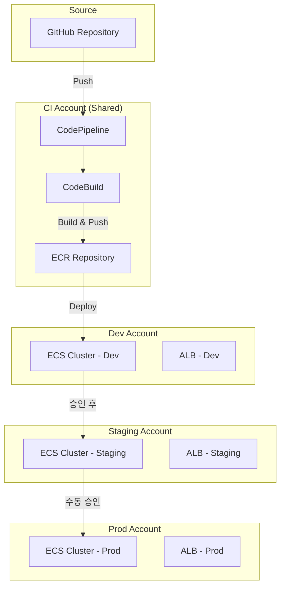

# 멀티 환경 배포 전략

AWS CodePipeline과 ECS를 활용하여 dev/staging/prod 환경을 체계적으로 분리하고, 안전한 프로모션 기반 배포 파이프라인을 구축하는 전략을 다룬다.

## 목차
- [1. 핵심 개념 (What)](#1-핵심-개념-what)
- [2. 왜 알아야 하는가 (Why)](#2-왜-알아야-하는가-why)
- [3. 내부 구현 분석 (How)](#3-내부-구현-분석-how)
- [4. 실전 예제](#4-실전-예제)
- [5. 정리](#5-정리)

---

## 1. 핵심 개념 (What)

### 멀티 환경 배포란?

소프트웨어 릴리스 과정에서 코드 변경사항이 dev -> staging -> prod 순서로 승격(promote)되며, 각 환경은 독립된 인프라와 설정을 갖는 배포 전략이다.

### 환경 분리의 3가지 차원

| 차원 | 설명 | AWS 구현 방식 |
|------|------|---------------|
| **계정 분리** | 환경별 AWS 계정 사용 | AWS Organizations + AssumeRole |
| **네트워크 분리** | 환경별 VPC/서브넷 격리 | 별도 VPC 또는 VPC 내 서브넷 분리 |
| **설정 분리** | 환경별 파라미터/시크릿 관리 | SSM Parameter Store / Secrets Manager |

### 브랜치 전략과 파이프라인 매핑

```
GitFlow 모델:
  feature/* ──> develop ──> release/* ──> main
                  │            │           │
                  v            v           v
                 dev        staging      prod

Trunk-based 모델:
  main (항상 배포 가능)
    │
    ├── push ──> dev (자동)
    ├── tag  ──> staging (자동)
    └── 승인 ──> prod (수동 승인 후)
```

---

## 2. 왜 알아야 하는가 (Why)

### 실무에서의 필요성

1. **장애 격리**: prod 환경에 영향을 주지 않고 새 기능을 검증할 수 있다
2. **규정 준수**: SOC2, HIPAA 등 컴플라이언스에서 환경 분리를 요구한다
3. **비용 최적화**: dev/staging은 축소된 리소스로 운영하여 비용을 절감한다
4. **팀 생산성**: 개발자가 독립적으로 테스트할 수 있는 환경을 제공한다

### 단일 환경의 위험성

- 테스트되지 않은 코드가 직접 프로덕션에 배포될 위험
- 환경 설정 차이로 인한 "내 로컬에서는 됐는데" 문제
- 롤백 시 다른 팀의 작업까지 영향받는 문제

---

## 3. 내부 구현 분석 (How)

### 아키텍처 개요



### 단일 파이프라인 vs 환경별 파이프라인

#### 단일 파이프라인 (프로모션 모델)

```
Source -> Build -> Deploy(Dev) -> Approval -> Deploy(Staging) -> Approval -> Deploy(Prod)
```

**장점**: 동일한 아티팩트가 모든 환경을 통과하므로 일관성 보장
**단점**: 파이프라인이 길어지고, dev 배포 실패 시 전체 파이프라인 블로킹

#### 환경별 파이프라인

```
[Dev Pipeline]     main push    -> Build -> Deploy(Dev)
[Staging Pipeline] staging tag  -> Deploy(Staging)
[Prod Pipeline]    release tag  -> Approval -> Deploy(Prod)
```

**장점**: 환경별 독립 운영, 실패 격리
**단점**: 아티팩트 일관성을 별도로 관리해야 함

### 크로스 계정 배포 (AssumeRole)

크로스 계정 배포의 핵심은 IAM AssumeRole이다. CI 계정의 CodePipeline이 대상 계정의 Role을 assume하여 ECS에 배포한다.

```
┌─────────────────────────────────────────────────────────┐
│  CI Account (111111111111)                              │
│                                                         │
│  CodePipeline ── assumes ──> arn:aws:iam::222222222222: │
│                              role/CrossAccountDeployRole│
│                                                         │
│  S3 Artifact Bucket (KMS 암호화)                        │
│    - Bucket Policy: 대상 계정 접근 허용                 │
│    - KMS Key Policy: 대상 계정 복호화 허용              │
└─────────────────────────────────────────────────────────┘
         │
         ▼
┌─────────────────────────────────────────────────────────┐
│  Target Account (222222222222)                          │
│                                                         │
│  CrossAccountDeployRole                                 │
│    - Trust: CI Account의 CodePipeline Role              │
│    - Permissions: ECS 배포, ECR 접근                    │
│                                                         │
│  ECS Cluster + Service                                  │
└─────────────────────────────────────────────────────────┘
```

### 환경별 파라미터 관리

SSM Parameter Store를 사용한 계층적 파라미터 관리:

```
/myapp/dev/db-host        = dev-db.cluster-xxx.rds.amazonaws.com
/myapp/dev/db-name        = myapp_dev
/myapp/staging/db-host    = stg-db.cluster-xxx.rds.amazonaws.com
/myapp/staging/db-name    = myapp_staging
/myapp/prod/db-host       = prod-db.cluster-xxx.rds.amazonaws.com
/myapp/prod/db-name       = myapp_prod
```

---

## 4. 실전 예제

### 예제 1: 크로스 계정 IAM Role 설정

**CI 계정 — CodePipeline이 사용할 Role**

```json
{
  "Version": "2012-10-17",
  "Statement": [
    {
      "Effect": "Allow",
      "Action": "sts:AssumeRole",
      "Resource": [
        "arn:aws:iam::222222222222:role/CrossAccountDeployRole-Staging",
        "arn:aws:iam::333333333333:role/CrossAccountDeployRole-Prod"
      ]
    }
  ]
}
```

**대상 계정 — CrossAccountDeployRole Trust Policy**

```json
{
  "Version": "2012-10-17",
  "Statement": [
    {
      "Effect": "Allow",
      "Principal": {
        "AWS": "arn:aws:iam::111111111111:role/CodePipelineServiceRole"
      },
      "Action": "sts:AssumeRole",
      "Condition": {
        "StringEquals": {
          "sts:ExternalId": "cross-account-deploy-2024"
        }
      }
    }
  ]
}
```

**대상 계정 — CrossAccountDeployRole Permission Policy**

```json
{
  "Version": "2012-10-17",
  "Statement": [
    {
      "Effect": "Allow",
      "Action": [
        "ecs:UpdateService",
        "ecs:DescribeServices",
        "ecs:RegisterTaskDefinition",
        "ecs:DescribeTaskDefinition",
        "iam:PassRole"
      ],
      "Resource": "*"
    },
    {
      "Effect": "Allow",
      "Action": [
        "s3:GetObject",
        "s3:GetBucketLocation"
      ],
      "Resource": [
        "arn:aws:s3:::ci-account-artifact-bucket",
        "arn:aws:s3:::ci-account-artifact-bucket/*"
      ]
    },
    {
      "Effect": "Allow",
      "Action": [
        "kms:Decrypt",
        "kms:DescribeKey"
      ],
      "Resource": "arn:aws:kms:ap-northeast-2:111111111111:key/artifact-key-id"
    }
  ]
}
```

### 예제 2: 프로모션 기반 단일 파이프라인 (CloudFormation)

```yaml
AWSTemplateFormatVersion: "2010-09-09"
Description: Multi-environment promotion pipeline

Parameters:
  GitHubConnectionArn:
    Type: String
  RepositoryId:
    Type: String
    Default: "myorg/myapp"
  BranchName:
    Type: String
    Default: "main"
  StagingAccountId:
    Type: String
  ProdAccountId:
    Type: String

Resources:
  ArtifactBucket:
    Type: AWS::S3::Bucket
    Properties:
      BucketEncryption:
        ServerSideEncryptionConfiguration:
          - ServerSideEncryptionByDefault:
              SSEAlgorithm: aws:kms
              KMSMasterKeyID: !Ref ArtifactKey

  ArtifactKey:
    Type: AWS::KMS::Key
    Properties:
      KeyPolicy:
        Version: "2012-10-17"
        Statement:
          - Sid: AllowCIAccount
            Effect: Allow
            Principal:
              AWS: !Sub "arn:aws:iam::${AWS::AccountId}:root"
            Action: "kms:*"
            Resource: "*"
          - Sid: AllowTargetAccounts
            Effect: Allow
            Principal:
              AWS:
                - !Sub "arn:aws:iam::${StagingAccountId}:root"
                - !Sub "arn:aws:iam::${ProdAccountId}:root"
            Action:
              - kms:Decrypt
              - kms:DescribeKey
            Resource: "*"

  Pipeline:
    Type: AWS::CodePipeline::Pipeline
    Properties:
      Name: myapp-promotion-pipeline
      RoleArn: !GetAtt PipelineRole.Arn
      ArtifactStore:
        Type: S3
        Location: !Ref ArtifactBucket
        EncryptionKey:
          Id: !GetAtt ArtifactKey.Arn
          Type: KMS
      Stages:
        # Source Stage
        - Name: Source
          Actions:
            - Name: GitHubSource
              ActionTypeId:
                Category: Source
                Owner: AWS
                Provider: CodeStarSourceConnection
                Version: "1"
              Configuration:
                ConnectionArn: !Ref GitHubConnectionArn
                FullRepositoryId: !Ref RepositoryId
                BranchName: !Ref BranchName
              OutputArtifacts:
                - Name: SourceOutput

        # Build Stage
        - Name: Build
          Actions:
            - Name: BuildAndPush
              ActionTypeId:
                Category: Build
                Owner: AWS
                Provider: CodeBuild
                Version: "1"
              InputArtifacts:
                - Name: SourceOutput
              OutputArtifacts:
                - Name: BuildOutput
              Configuration:
                ProjectName: !Ref BuildProject

        # Dev Deploy
        - Name: DeployDev
          Actions:
            - Name: DeployToDevECS
              ActionTypeId:
                Category: Deploy
                Owner: AWS
                Provider: ECS
                Version: "1"
              InputArtifacts:
                - Name: BuildOutput
              Configuration:
                ClusterName: dev-cluster
                ServiceName: myapp-dev
                FileName: imagedefinitions.json

        # Staging Approval + Deploy
        - Name: DeployStaging
          Actions:
            - Name: StagingApproval
              ActionTypeId:
                Category: Approval
                Owner: AWS
                Provider: Manual
                Version: "1"
              Configuration:
                NotificationArn: !Ref ApprovalSNSTopic
                CustomData: "Dev 배포 검증 완료. Staging 배포를 승인하시겠습니까?"
              RunOrder: 1
            - Name: DeployToStagingECS
              ActionTypeId:
                Category: Deploy
                Owner: AWS
                Provider: ECS
                Version: "1"
              InputArtifacts:
                - Name: BuildOutput
              Configuration:
                ClusterName: staging-cluster
                ServiceName: myapp-staging
                FileName: imagedefinitions.json
              RoleArn: !Sub "arn:aws:iam::${StagingAccountId}:role/CrossAccountDeployRole-Staging"
              RunOrder: 2

        # Prod Approval + Deploy
        - Name: DeployProd
          Actions:
            - Name: ProdApproval
              ActionTypeId:
                Category: Approval
                Owner: AWS
                Provider: Manual
                Version: "1"
              Configuration:
                NotificationArn: !Ref ApprovalSNSTopic
                CustomData: "Staging 검증 완료. Production 배포를 승인하시겠습니까?"
              RunOrder: 1
            - Name: DeployToProdECS
              ActionTypeId:
                Category: Deploy
                Owner: AWS
                Provider: ECS
                Version: "1"
              InputArtifacts:
                - Name: BuildOutput
              Configuration:
                ClusterName: prod-cluster
                ServiceName: myapp-prod
                FileName: imagedefinitions.json
              RoleArn: !Sub "arn:aws:iam::${ProdAccountId}:role/CrossAccountDeployRole-Prod"
              RunOrder: 2

  ApprovalSNSTopic:
    Type: AWS::SNS::Topic
    Properties:
      TopicName: pipeline-approval-notifications

  BuildProject:
    Type: AWS::CodeBuild::Project
    Properties:
      Name: myapp-build
      ServiceRole: !GetAtt BuildRole.Arn
      Environment:
        Type: LINUX_CONTAINER
        ComputeType: BUILD_GENERAL1_SMALL
        Image: aws/codebuild/amazonlinux2-x86_64-standard:5.0
        PrivilegedMode: true
      Source:
        Type: CODEPIPELINE
        BuildSpec: buildspec.yml
      Artifacts:
        Type: CODEPIPELINE
```

### 예제 3: 환경별 buildspec.yml (파라미터 분기)

```yaml
version: 0.2

env:
  parameter-store:
    DB_HOST: "/myapp/${DEPLOY_ENV}/db-host"
    DB_NAME: "/myapp/${DEPLOY_ENV}/db-name"

phases:
  pre_build:
    commands:
      - echo "Target environment = ${DEPLOY_ENV}"
      - aws ecr get-login-password --region $AWS_DEFAULT_REGION | docker login --username AWS --password-stdin $ECR_URI
      - IMAGE_TAG=$(echo $CODEBUILD_RESOLVED_SOURCE_VERSION | cut -c 1-8)

  build:
    commands:
      - docker build
          --build-arg DB_HOST=$DB_HOST
          --build-arg DB_NAME=$DB_NAME
          --build-arg ENV=$DEPLOY_ENV
          -t $ECR_URI:$IMAGE_TAG
          -t $ECR_URI:$DEPLOY_ENV-latest .

  post_build:
    commands:
      - docker push $ECR_URI:$IMAGE_TAG
      - docker push $ECR_URI:$DEPLOY_ENV-latest
      - printf '[{"name":"myapp","imageUri":"%s"}]' $ECR_URI:$IMAGE_TAG > imagedefinitions.json

artifacts:
  files:
    - imagedefinitions.json
    - taskdef-${DEPLOY_ENV}.json
    - appspec.yaml
```

### 예제 4: 환경별 ECS Task Definition 오버라이드

```json
{
  "family": "myapp",
  "cpu": "256",
  "memory": "512",
  "containerDefinitions": [
    {
      "name": "myapp",
      "image": "<IMAGE_URI>",
      "portMappings": [{ "containerPort": 8080 }],
      "environment": [
        { "name": "APP_ENV", "value": "<DEPLOY_ENV>" }
      ],
      "secrets": [
        {
          "name": "DB_PASSWORD",
          "valueFrom": "arn:aws:secretsmanager:ap-northeast-2:<ACCOUNT_ID>:secret:/myapp/<DEPLOY_ENV>/db-password"
        }
      ],
      "logConfiguration": {
        "logDriver": "awslogs",
        "options": {
          "awslogs-group": "/ecs/myapp-<DEPLOY_ENV>",
          "awslogs-region": "ap-northeast-2",
          "awslogs-stream-prefix": "ecs"
        }
      }
    }
  ]
}
```

환경별 리소스 크기 차이:

| 환경 | CPU | Memory | Desired Count | Auto Scaling |
|------|-----|--------|---------------|--------------|
| dev | 256 | 512MB | 1 | 없음 |
| staging | 512 | 1024MB | 2 | 2-4 |
| prod | 1024 | 2048MB | 3 | 3-10 |

---

## 5. 정리

| 항목 | 권장 사항 |
|------|-----------|
| **환경 분리 방식** | AWS 계정 단위 분리 (Organizations 활용) |
| **파이프라인 구조** | 단일 프로모션 파이프라인 (아티팩트 일관성 우선) |
| **크로스 계정 배포** | AssumeRole + KMS 암호화된 S3 아티팩트 |
| **파라미터 관리** | SSM Parameter Store 계층 구조 (`/app/env/key`) |
| **브랜치 전략** | Trunk-based + 태그 기반 환경 매핑 (소규모 팀) |
| **승인 게이트** | staging->prod 전환 시 수동 승인 (SNS 알림) |
| **비용 최적화** | dev/staging은 축소 스펙, 비업무 시간 스케일다운 |
| **보안** | ExternalId 조건, 최소 권한 원칙, KMS 키 정책 |

---

*참고: AWS 서비스 최신 버전 기준*
