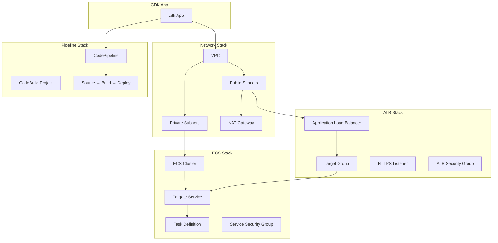

# CloudFormation/CDK로 인프라 코드화

AWS CloudFormation과 CDK를 사용하여 ECS 인프라와 CI/CD 파이프라인 전체를 코드로 정의하고, 재현 가능하며 버전 관리되는 인프라를 구축하는 방법을 다룬다.

## 목차
- [1. 핵심 개념 (What)](#1-핵심-개념-what)
- [2. 왜 알아야 하는가 (Why)](#2-왜-알아야-하는가-why)
- [3. 내부 구현 분석 (How)](#3-내부-구현-분석-how)
- [4. 실전 예제](#4-실전-예제)
- [5. 정리](#5-정리)

---

## 1. 핵심 개념 (What)

### Infrastructure as Code (IaC)

인프라 리소스(VPC, ALB, ECS 클러스터, 파이프라인 등)를 코드로 정의하여 선언적으로 관리하는 방식이다. 수동 콘솔 조작 대신 코드를 커밋하면 인프라가 자동으로 프로비저닝된다.

### CloudFormation vs CDK

| 구분 | CloudFormation | CDK |
|------|---------------|-----|
| **언어** | YAML/JSON (선언적) | TypeScript, Python, Java 등 (명령적) |
| **추상화 수준** | 낮음 (리소스 1:1 매핑) | 높음 (Construct 패턴) |
| **재사용성** | 중첩 스택, 모듈 | Class 상속, Composition |
| **출력** | 직접 배포 | CloudFormation 템플릿 생성 후 배포 |
| **학습 곡선** | YAML 구조 숙지 필요 | 프로그래밍 언어 활용 가능 |

### CDK Construct 레벨

```
L3 (Patterns)    : ecs_patterns.ApplicationLoadBalancedFargateService
                    → 하나의 호출로 ALB + ECS + 로그 + IAM 전부 생성
                    
L2 (Curated)     : ecs.FargateService, ec2.Vpc
                    → AWS 리소스별 추상화, 합리적 기본값 제공
                    
L1 (CFN Resource): CfnCluster, CfnService
                    → CloudFormation 리소스와 1:1 매핑
```

---

## 2. 왜 알아야 하는가 (Why)

### 콘솔 기반 관리의 한계

1. **재현 불가능**: 콘솔에서 클릭한 설정은 기록이 남지 않아 동일한 환경을 다시 만들 수 없다
2. **드리프트**: 누군가 콘솔에서 수동 변경하면 의도한 상태와 실제 상태가 달라진다
3. **리뷰 불가**: 인프라 변경에 대한 코드 리뷰(PR)를 할 수 없다
4. **환경 복제 비용**: dev와 동일한 staging을 만들려면 모든 과정을 수동 반복해야 한다

### IaC를 도입하면

- Git 히스토리로 인프라 변경 이력 추적 가능
- PR 리뷰를 통한 변경 사전 검토
- 파라미터만 바꿔서 동일한 스택을 여러 환경에 배포
- CDK Pipelines를 사용하면 파이프라인 자체도 코드로 관리 (self-mutation)

---

## 3. 내부 구현 분석 (How)

### ECS 인프라 스택 아키텍처



### CDK Pipelines의 Self-Mutation

CDK Pipelines는 **파이프라인 자체가 스스로를 업데이트**하는 구조를 갖는다.

```
┌──────────────────────────────────────────────────────┐
│  CDK Pipelines Self-Mutation 흐름                    │
│                                                      │
│  1. 개발자가 pipeline 코드 수정 후 push              │
│  2. Source 스테이지: 코드 변경 감지                   │
│  3. Build 스테이지: cdk synth 실행                   │
│  4. UpdatePipeline 스테이지:                          │
│     - synth 결과와 현재 파이프라인 비교               │
│     - 차이가 있으면 CloudFormation으로 파이프라인 업데이트│
│     - 파이프라인이 재시작됨                           │
│  5. Deploy 스테이지: 애플리케이션 스택 배포           │
└──────────────────────────────────────────────────────┘
```

### 스택 간 의존성 관리

CDK에서 스택 간 값을 전달하려면 CloudFormation Export/Import를 사용한다:

```
NetworkStack                      ECSStack
  ├── VPC                           ├── uses vpc from NetworkStack
  ├── Export: VpcId ───────────────> │   (Cross-stack reference)
  └── Export: PrivateSubnetIds ───> └── Fargate Service in private subnets
```

**주의**: Export를 사용하는 스택은 Import하는 스택이 있으면 삭제/수정이 불가능하다. 이를 해결하려면 SSM Parameter Store를 중간 매개로 사용하는 것이 좋다.

---

## 4. 실전 예제

### 예제 1: CDK로 ECS 인프라 스택 정의 (TypeScript)

```typescript
// lib/ecs-infra-stack.ts
import * as cdk from 'aws-cdk-lib';
import * as ec2 from 'aws-cdk-lib/aws-ec2';
import * as ecs from 'aws-cdk-lib/aws-ecs';
import * as elbv2 from 'aws-cdk-lib/aws-elasticloadbalancingv2';
import * as logs from 'aws-cdk-lib/aws-logs';
import { Construct } from 'constructs';

interface EcsInfraStackProps extends cdk.StackProps {
  envName: string;        // 'dev' | 'staging' | 'prod'
  cpu: number;            // 256 | 512 | 1024
  memoryMiB: number;      // 512 | 1024 | 2048
  desiredCount: number;
  maxCount: number;
}

export class EcsInfraStack extends cdk.Stack {
  public readonly cluster: ecs.Cluster;
  public readonly service: ecs.FargateService;
  public readonly listener: elbv2.ApplicationListener;

  constructor(scope: Construct, id: string, props: EcsInfraStackProps) {
    super(scope, id, props);

    // VPC
    const vpc = new ec2.Vpc(this, 'Vpc', {
      maxAzs: 2,
      natGateways: props.envName === 'prod' ? 2 : 1,
    });

    // ECS Cluster
    this.cluster = new ecs.Cluster(this, 'Cluster', {
      vpc,
      clusterName: `${props.envName}-cluster`,
      containerInsights: props.envName === 'prod',
    });

    // Task Definition
    const taskDef = new ecs.FargateTaskDefinition(this, 'TaskDef', {
      cpu: props.cpu,
      memoryLimitMiB: props.memoryMiB,
    });

    const container = taskDef.addContainer('app', {
      image: ecs.ContainerImage.fromRegistry('placeholder:latest'),
      logging: ecs.LogDrivers.awsLogs({
        streamPrefix: 'ecs',
        logGroup: new logs.LogGroup(this, 'LogGroup', {
          logGroupName: `/ecs/myapp-${props.envName}`,
          retention: props.envName === 'prod'
            ? logs.RetentionDays.ONE_YEAR
            : logs.RetentionDays.ONE_WEEK,
          removalPolicy: cdk.RemovalPolicy.DESTROY,
        }),
      }),
      environment: {
        APP_ENV: props.envName,
      },
    });

    container.addPortMappings({ containerPort: 8080 });

    // ALB
    const alb = new elbv2.ApplicationLoadBalancer(this, 'ALB', {
      vpc,
      internetFacing: true,
    });

    this.listener = alb.addListener('HttpListener', {
      port: 80,
    });

    // Fargate Service
    this.service = new ecs.FargateService(this, 'Service', {
      cluster: this.cluster,
      taskDefinition: taskDef,
      desiredCount: props.desiredCount,
      serviceName: `myapp-${props.envName}`,
      assignPublicIp: false,
    });

    this.listener.addTargets('EcsTarget', {
      port: 8080,
      targets: [this.service],
      healthCheck: {
        path: '/health',
        interval: cdk.Duration.seconds(30),
        healthyThresholdCount: 2,
        unhealthyThresholdCount: 3,
      },
    });

    // Auto Scaling (staging, prod만)
    if (props.envName !== 'dev') {
      const scaling = this.service.autoScaleTaskCount({
        minCapacity: props.desiredCount,
        maxCapacity: props.maxCount,
      });

      scaling.scaleOnCpuUtilization('CpuScaling', {
        targetUtilizationPercent: 70,
        scaleInCooldown: cdk.Duration.seconds(60),
        scaleOutCooldown: cdk.Duration.seconds(60),
      });
    }

    // Outputs
    new cdk.CfnOutput(this, 'AlbDnsName', {
      value: alb.loadBalancerDnsName,
      description: 'ALB DNS name',
    });

    new cdk.CfnOutput(this, 'ClusterArn', {
      value: this.cluster.clusterArn,
      exportName: `${props.envName}-cluster-arn`,
    });
  }
}
```

### 예제 2: CDK Pipelines로 Self-Mutating 파이프라인 구축

```typescript
// lib/pipeline-stack.ts
import * as cdk from 'aws-cdk-lib';
import * as pipelines from 'aws-cdk-lib/pipelines';
import { Construct } from 'constructs';
import { EcsInfraStack } from './ecs-infra-stack';

// 배포 대상 환경을 Stage로 정의
class DeployStage extends cdk.Stage {
  constructor(scope: Construct, id: string, props: cdk.StageProps & {
    envName: string;
    cpu: number;
    memoryMiB: number;
    desiredCount: number;
    maxCount: number;
  }) {
    super(scope, id, props);

    new EcsInfraStack(this, 'EcsInfra', {
      envName: props.envName,
      cpu: props.cpu,
      memoryMiB: props.memoryMiB,
      desiredCount: props.desiredCount,
      maxCount: props.maxCount,
    });
  }
}

export class PipelineStack extends cdk.Stack {
  constructor(scope: Construct, id: string, props?: cdk.StackProps) {
    super(scope, id, props);

    // CDK Pipeline 정의 (Self-Mutating)
    const pipeline = new pipelines.CodePipeline(this, 'Pipeline', {
      pipelineName: 'MyApp-Infra-Pipeline',
      synth: new pipelines.ShellStep('Synth', {
        input: pipelines.CodePipelineSource.connection('myorg/infra-repo', 'main', {
          connectionArn: 'arn:aws:codestar-connections:ap-northeast-2:111111111111:connection/xxx',
        }),
        commands: [
          'npm ci',
          'npx cdk synth',
        ],
      }),
      selfMutation: true, // 파이프라인이 스스로를 업데이트
      crossAccountKeys: true, // 크로스 계정 배포용 KMS 키
    });

    // Dev 환경 배포
    const devStage = pipeline.addStage(new DeployStage(this, 'Dev', {
      env: { account: '111111111111', region: 'ap-northeast-2' },
      envName: 'dev',
      cpu: 256,
      memoryMiB: 512,
      desiredCount: 1,
      maxCount: 1,
    }));

    // Dev 배포 후 통합 테스트
    devStage.addPost(new pipelines.ShellStep('IntegrationTest', {
      commands: [
        'curl -f http://dev-alb.example.com/health || exit 1',
      ],
    }));

    // Staging 환경 배포 (수동 승인 후)
    const stagingStage = pipeline.addStage(new DeployStage(this, 'Staging', {
      env: { account: '222222222222', region: 'ap-northeast-2' },
      envName: 'staging',
      cpu: 512,
      memoryMiB: 1024,
      desiredCount: 2,
      maxCount: 4,
    }), {
      pre: [new pipelines.ManualApprovalStep('PromoteToStaging')],
    });

    // Prod 환경 배포 (수동 승인 후)
    pipeline.addStage(new DeployStage(this, 'Prod', {
      env: { account: '333333333333', region: 'ap-northeast-2' },
      envName: 'prod',
      cpu: 1024,
      memoryMiB: 2048,
      desiredCount: 3,
      maxCount: 10,
    }), {
      pre: [new pipelines.ManualApprovalStep('PromoteToProd')],
    });
  }
}
```

**App 엔트리포인트:**

```typescript
// bin/app.ts
import * as cdk from 'aws-cdk-lib';
import { PipelineStack } from '../lib/pipeline-stack';

const app = new cdk.App();

new PipelineStack(app, 'MyApp-Pipeline', {
  env: {
    account: '111111111111',
    region: 'ap-northeast-2',
  },
});

app.synth();
```

### 예제 3: CloudFormation으로 ECS 파이프라인 정의

```yaml
AWSTemplateFormatVersion: "2010-09-09"
Description: ECS CI/CD Pipeline defined in CloudFormation

Parameters:
  ClusterName:
    Type: String
  ServiceName:
    Type: String
  ECRRepositoryUri:
    Type: String
  ConnectionArn:
    Type: String
  RepositoryId:
    Type: String
    Default: "myorg/myapp"

Resources:
  # ===== CodeBuild Project =====
  BuildProject:
    Type: AWS::CodeBuild::Project
    Properties:
      Name: !Sub "${ServiceName}-build"
      ServiceRole: !GetAtt CodeBuildRole.Arn
      Environment:
        Type: LINUX_CONTAINER
        ComputeType: BUILD_GENERAL1_SMALL
        Image: aws/codebuild/amazonlinux2-x86_64-standard:5.0
        PrivilegedMode: true
        EnvironmentVariables:
          - Name: ECR_URI
            Value: !Ref ECRRepositoryUri
          - Name: CLUSTER_NAME
            Value: !Ref ClusterName
          - Name: SERVICE_NAME
            Value: !Ref ServiceName
      Source:
        Type: CODEPIPELINE
        BuildSpec: |
          version: 0.2
          phases:
            pre_build:
              commands:
                - aws ecr get-login-password | docker login --username AWS --password-stdin $ECR_URI
                - IMAGE_TAG=$CODEBUILD_RESOLVED_SOURCE_VERSION
            build:
              commands:
                - docker build -t $ECR_URI:$IMAGE_TAG .
                - docker push $ECR_URI:$IMAGE_TAG
            post_build:
              commands:
                - printf '[{"name":"app","imageUri":"%s"}]' $ECR_URI:$IMAGE_TAG > imagedefinitions.json
          artifacts:
            files:
              - imagedefinitions.json
      Artifacts:
        Type: CODEPIPELINE

  # ===== CodePipeline =====
  Pipeline:
    Type: AWS::CodePipeline::Pipeline
    Properties:
      Name: !Sub "${ServiceName}-pipeline"
      RoleArn: !GetAtt PipelineRole.Arn
      ArtifactStore:
        Type: S3
        Location: !Ref ArtifactBucket
      Stages:
        - Name: Source
          Actions:
            - Name: Source
              ActionTypeId:
                Category: Source
                Owner: AWS
                Provider: CodeStarSourceConnection
                Version: "1"
              Configuration:
                ConnectionArn: !Ref ConnectionArn
                FullRepositoryId: !Ref RepositoryId
                BranchName: main
              OutputArtifacts:
                - Name: SourceOutput
        - Name: Build
          Actions:
            - Name: Build
              ActionTypeId:
                Category: Build
                Owner: AWS
                Provider: CodeBuild
                Version: "1"
              InputArtifacts:
                - Name: SourceOutput
              OutputArtifacts:
                - Name: BuildOutput
              Configuration:
                ProjectName: !Ref BuildProject
        - Name: Deploy
          Actions:
            - Name: Deploy
              ActionTypeId:
                Category: Deploy
                Owner: AWS
                Provider: ECS
                Version: "1"
              InputArtifacts:
                - Name: BuildOutput
              Configuration:
                ClusterName: !Ref ClusterName
                ServiceName: !Ref ServiceName
                FileName: imagedefinitions.json

  # ===== IAM Roles =====
  CodeBuildRole:
    Type: AWS::IAM::Role
    Properties:
      AssumeRolePolicyDocument:
        Version: "2012-10-17"
        Statement:
          - Effect: Allow
            Principal:
              Service: codebuild.amazonaws.com
            Action: sts:AssumeRole
      ManagedPolicyArns:
        - arn:aws:iam::aws:policy/AmazonEC2ContainerRegistryPowerUser
      Policies:
        - PolicyName: CodeBuildPolicy
          PolicyDocument:
            Version: "2012-10-17"
            Statement:
              - Effect: Allow
                Action:
                  - logs:CreateLogGroup
                  - logs:CreateLogStream
                  - logs:PutLogEvents
                Resource: "*"
              - Effect: Allow
                Action:
                  - s3:GetObject
                  - s3:PutObject
                Resource: !Sub "${ArtifactBucket.Arn}/*"

  PipelineRole:
    Type: AWS::IAM::Role
    Properties:
      AssumeRolePolicyDocument:
        Version: "2012-10-17"
        Statement:
          - Effect: Allow
            Principal:
              Service: codepipeline.amazonaws.com
            Action: sts:AssumeRole
      Policies:
        - PolicyName: PipelinePolicy
          PolicyDocument:
            Version: "2012-10-17"
            Statement:
              - Effect: Allow
                Action:
                  - s3:*
                Resource:
                  - !GetAtt ArtifactBucket.Arn
                  - !Sub "${ArtifactBucket.Arn}/*"
              - Effect: Allow
                Action:
                  - codebuild:StartBuild
                  - codebuild:BatchGetBuilds
                Resource: !GetAtt BuildProject.Arn
              - Effect: Allow
                Action:
                  - ecs:*
                  - iam:PassRole
                Resource: "*"
              - Effect: Allow
                Action:
                  - codestar-connections:UseConnection
                Resource: !Ref ConnectionArn

  ArtifactBucket:
    Type: AWS::S3::Bucket
    Properties:
      VersioningConfiguration:
        Status: Enabled
      LifecycleConfiguration:
        Rules:
          - Id: CleanupOldArtifacts
            Status: Enabled
            ExpirationInDays: 30

Outputs:
  PipelineUrl:
    Value: !Sub "https://${AWS::Region}.console.aws.amazon.com/codesuite/codepipeline/pipelines/${Pipeline}/view"
```

### 예제 4: SSM Parameter Store로 스택 간 값 전달 (CDK)

```typescript
// 값을 저장하는 스택
import * as ssm from 'aws-cdk-lib/aws-ssm';

// NetworkStack에서 VPC ID를 SSM에 저장
new ssm.StringParameter(this, 'VpcIdParam', {
  parameterName: '/infra/vpc-id',
  stringValue: vpc.vpcId,
});

new ssm.StringListParameter(this, 'PrivateSubnetsParam', {
  parameterName: '/infra/private-subnet-ids',
  stringListValue: vpc.privateSubnets.map(s => s.subnetId),
});

// 값을 읽는 스택 — 다른 스택에서 SSM에서 조회
const vpcId = ssm.StringParameter.valueFromLookup(this, '/infra/vpc-id');

const vpc = ec2.Vpc.fromLookup(this, 'ImportedVpc', {
  vpcId: vpcId,
});
```

---

## 5. 정리

| 항목 | CloudFormation | CDK |
|------|---------------|-----|
| **적합한 상황** | 단순 스택, 기존 CFN 자산 활용 | 복잡한 인프라, 재사용 필요 |
| **파이프라인 정의** | `AWS::CodePipeline::Pipeline` | `pipelines.CodePipeline` |
| **Self-Mutation** | 별도 구현 필요 | `selfMutation: true` 내장 |
| **환경 분리** | Parameters + Conditions | Stage 클래스로 환경별 인스턴스화 |
| **스택 간 참조** | Export/Import 또는 SSM | 직접 참조 또는 SSM |
| **크로스 계정** | 수동 IAM 설정 | `crossAccountKeys: true` |
| **테스트** | cfn-lint, taskcat | CDK Assertions (`Template.fromStack`) |
| **학습 곡선** | YAML 구조 이해 | TypeScript/Python + CDK 패턴 |

### 핵심 원칙

1. **파이프라인도 코드로**: CDK Pipelines의 self-mutation으로 파이프라인 자체를 Git 관리한다
2. **L3 Construct 우선 활용**: `ApplicationLoadBalancedFargateService` 같은 고수준 패턴부터 시작한다
3. **스택 분리**: Network / ECS / Pipeline 스택을 분리하여 독립적으로 업데이트 가능하게 한다
4. **Export 대신 SSM**: 스택 간 결합도를 줄이기 위해 SSM Parameter Store를 매개로 사용한다

---

*참고: AWS 서비스 최신 버전 기준*
