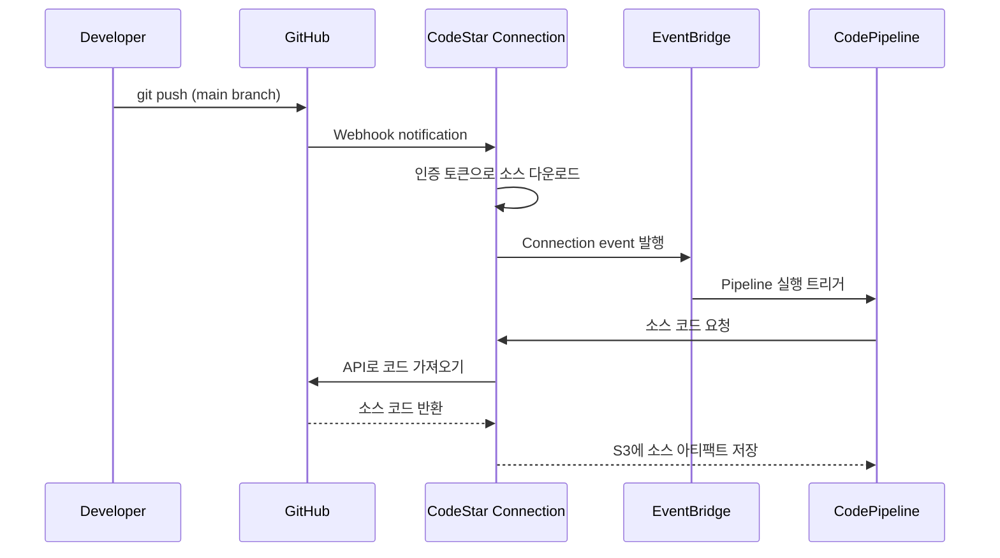
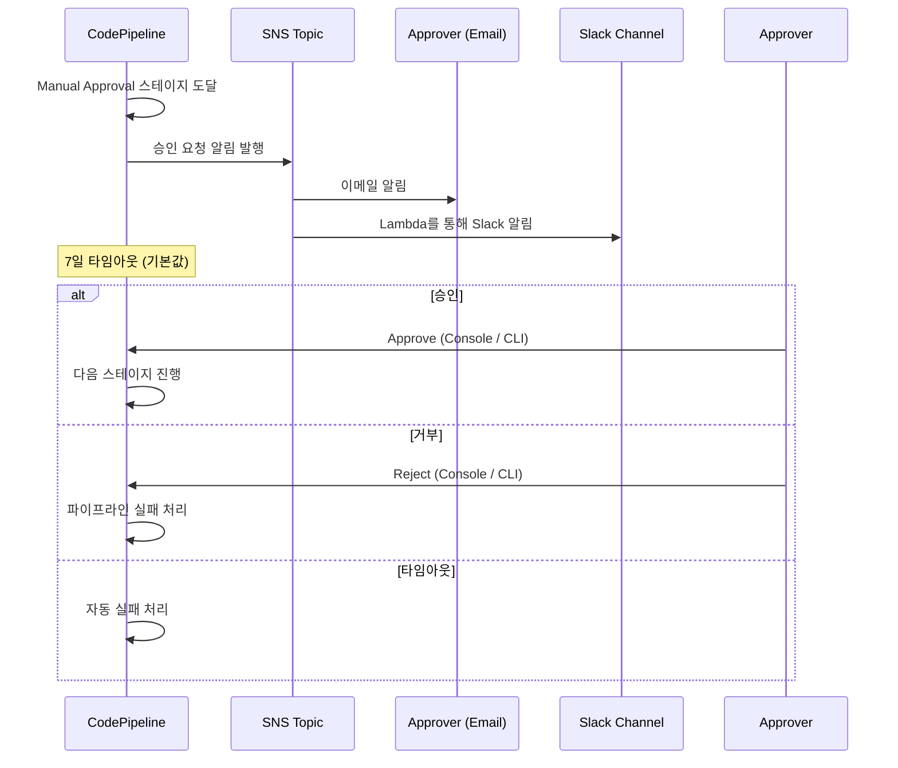

# 파이프라인 트리거와 이벤트

CodePipeline의 실행을 트리거하는 다양한 메커니즘과, 파이프라인 상태 변경을 감지하여 알림/자동화를 구현하는 이벤트 기반 아키텍처를 다룬다.

## 목차
- [1. 핵심 개념 (What)](#1-핵심-개념-what)
- [2. 왜 알아야 하는가 (Why)](#2-왜-알아야-하는가-why)
- [3. 내부 구현 분석 (How)](#3-내부-구현-분석-how)
- [4. 실전 예제](#4-실전-예제)
- [5. 정리](#5-정리)

---

## 1. 핵심 개념 (What)

### 파이프라인 트리거의 종류

CodePipeline이 실행되는 시작점(trigger)은 크게 4가지로 분류된다:

| 트리거 유형 | 설명 | 대표 서비스 |
|------------|------|-------------|
| **소스 변경** | 코드 저장소에 커밋/푸시 시 자동 실행 | CodeStar Connections, CodeCommit, S3 |
| **스케줄 기반** | 정해진 시간/주기에 실행 | EventBridge Scheduler |
| **수동 실행** | 사람이 직접 실행 또는 승인 | Console, CLI, Manual Approval |
| **이벤트 기반** | 외부 이벤트에 반응하여 실행 | EventBridge Rules, 웹훅 |

### CodePipeline V2 트리거 필터

CodePipeline V2에서는 트리거 조건을 세밀하게 제어할 수 있다:

```
Push 트리거 필터:
  - 브랜치: main, release/*
  - 태그: v*
  - 파일 경로: src/**, !docs/**

Pull Request 트리거 필터:
  - 이벤트: OPEN, UPDATE, CLOSE
  - 대상 브랜치: main
```

### EventBridge와 파이프라인의 관계

```
[파이프라인 상태 변경] ──> [EventBridge Rule] ──> [Target]
                                                    ├── SNS (알림)
                                                    ├── Lambda (자동화)
                                                    ├── SQS (큐잉)
                                                    └── 다른 Pipeline (체이닝)
```

---

## 2. 왜 알아야 하는가 (Why)

### 실무 시나리오

1. **Slack 알림**: 파이프라인 실패 시 즉시 Slack 채널에 알림을 보내야 한다
2. **승인 워크플로우**: prod 배포 전 팀 리드/QA의 승인이 필요하다
3. **조건부 트리거**: `docs/` 폴더만 변경된 경우 빌드를 건너뛰고 싶다
4. **파이프라인 체이닝**: 인프라 파이프라인 완료 후 앱 파이프라인을 자동으로 실행해야 한다
5. **정기 배포**: 매주 화요일 오전 10시에만 프로덕션 배포를 허용한다

### 트리거를 잘못 설정하면

- 불필요한 빌드가 반복되어 비용이 증가한다
- 파이프라인 실패를 몇 시간 뒤에야 발견한다
- 무단 배포가 프로덕션에 반영될 수 있다

---

## 3. 내부 구현 분석 (How)

### CodeStar Connections 동작 흐름



### EventBridge 파이프라인 이벤트 구조

CodePipeline은 상태 변경 시 자동으로 EventBridge에 이벤트를 발행한다:

```
파이프라인 레벨 이벤트:
  ├── Pipeline Execution State Change
  │     states: STARTED, SUCCEEDED, FAILED, CANCELED, SUPERSEDED
  │
  ├── Stage Execution State Change  
  │     states: STARTED, SUCCEEDED, FAILED, CANCELED
  │
  ├── Action Execution State Change
  │     states: STARTED, SUCCEEDED, FAILED, ABANDONED
  │
  └── Manual Approval State Change
        states: STARTED, SUCCEEDED, FAILED
```

### 수동 승인 스테이지 흐름



### 파이프라인 알림 규칙 (Notification Rules)

CodePipeline은 AWS CodeStar Notifications를 통해 간편한 알림 설정을 제공한다:

```
Notification Rule
  ├── 이벤트 필터
  │     ├── Pipeline execution: FAILED, SUCCEEDED
  │     ├── Stage execution: FAILED
  │     ├── Action execution: FAILED
  │     └── Manual approval: NEEDED, SUCCEEDED
  │
  └── 대상 (Target)
        ├── SNS Topic
        ├── AWS Chatbot (Slack)
        └── AWS Chatbot (Teams)
```

---

## 4. 실전 예제

### 예제 1: CodePipeline V2 트리거 필터 설정

```yaml
AWSTemplateFormatVersion: "2010-09-09"
Description: CodePipeline V2 with trigger filters

Resources:
  Pipeline:
    Type: AWS::CodePipeline::Pipeline
    Properties:
      Name: myapp-pipeline
      PipelineType: V2
      RoleArn: !GetAtt PipelineRole.Arn
      # V2 트리거 설정
      Triggers:
        - ProviderType: CodeStarSourceConnection
          GitConfiguration:
            SourceActionName: GitHubSource
            # Push 트리거 필터
            Push:
              - Branches:
                  Includes:
                    - main
                    - "release/*"
                  Excludes:
                    - "feature/*"
                FilePaths:
                  Includes:
                    - "src/**"
                    - "Dockerfile"
                    - "buildspec.yml"
                  Excludes:
                    - "docs/**"
                    - "*.md"
                    - ".gitignore"
                Tags:
                  Includes:
                    - "v*"
                  Excludes:
                    - "v*-rc*"
      Stages:
        - Name: Source
          Actions:
            - Name: GitHubSource
              ActionTypeId:
                Category: Source
                Owner: AWS
                Provider: CodeStarSourceConnection
                Version: "1"
              Configuration:
                ConnectionArn: !Ref ConnectionArn
                FullRepositoryId: "myorg/myapp"
                BranchName: main
                DetectChanges: true
              OutputArtifacts:
                - Name: SourceOutput
        - Name: Build
          Actions:
            - Name: Build
              ActionTypeId:
                Category: Build
                Owner: AWS
                Provider: CodeBuild
                Version: "1"
              InputArtifacts:
                - Name: SourceOutput
              OutputArtifacts:
                - Name: BuildOutput
              Configuration:
                ProjectName: !Ref BuildProject
        - Name: Deploy
          Actions:
            - Name: DeployToECS
              ActionTypeId:
                Category: Deploy
                Owner: AWS
                Provider: ECS
                Version: "1"
              InputArtifacts:
                - Name: BuildOutput
              Configuration:
                ClusterName: prod-cluster
                ServiceName: myapp
                FileName: imagedefinitions.json
```

### 예제 2: EventBridge로 파이프라인 실패 시 Slack 알림

```yaml
AWSTemplateFormatVersion: "2010-09-09"
Description: Pipeline failure notification to Slack via EventBridge + Lambda

Resources:
  # EventBridge Rule - 파이프라인 실패 감지
  PipelineFailureRule:
    Type: AWS::Events::Rule
    Properties:
      Name: pipeline-failure-alert
      Description: "CodePipeline 실패 시 Slack 알림"
      EventPattern:
        source:
          - aws.codepipeline
        detail-type:
          - "CodePipeline Pipeline Execution State Change"
        detail:
          state:
            - FAILED
          pipeline:
            - myapp-pipeline
      State: ENABLED
      Targets:
        - Arn: !GetAtt SlackNotifyFunction.Arn
          Id: SlackNotifyTarget

  # Lambda 함수 - Slack 메시지 전송
  SlackNotifyFunction:
    Type: AWS::Lambda::Function
    Properties:
      FunctionName: pipeline-slack-notifier
      Runtime: python3.12
      Handler: index.handler
      Timeout: 30
      Environment:
        Variables:
          SLACK_WEBHOOK_URL: !Sub "{{resolve:secretsmanager:slack-webhook:SecretString:url}}"
      Role: !GetAtt LambdaRole.Arn
      Code:
        ZipFile: |
          import json
          import os
          import urllib.request

          def handler(event, context):
              detail = event['detail']
              pipeline = detail['pipeline']
              state = detail['state']
              execution_id = detail['execution-id']
              region = event['region']
              account = event['account']

              console_url = (
                  f"https://{region}.console.aws.amazon.com/codesuite/"
                  f"codepipeline/pipelines/{pipeline}/executions/"
                  f"{execution_id}/timeline"
              )

              message = {
                  "blocks": [
                      {
                          "type": "header",
                          "text": {
                              "type": "plain_text",
                              "text": f"Pipeline {state}: {pipeline}"
                          }
                      },
                      {
                          "type": "section",
                          "fields": [
                              {"type": "mrkdwn", "text": f"*Pipeline:*\n{pipeline}"},
                              {"type": "mrkdwn", "text": f"*Status:*\n{state}"},
                              {"type": "mrkdwn", "text": f"*Account:*\n{account}"},
                              {"type": "mrkdwn", "text": f"*Region:*\n{region}"},
                          ]
                      },
                      {
                          "type": "actions",
                          "elements": [
                              {
                                  "type": "button",
                                  "text": {"type": "plain_text", "text": "View in Console"},
                                  "url": console_url
                              }
                          ]
                      }
                  ]
              }

              webhook_url = os.environ['SLACK_WEBHOOK_URL']
              req = urllib.request.Request(
                  webhook_url,
                  data=json.dumps(message).encode('utf-8'),
                  headers={'Content-Type': 'application/json'}
              )
              urllib.request.urlopen(req)

              return {'statusCode': 200}

  # Lambda 실행 권한
  LambdaPermission:
    Type: AWS::Lambda::Permission
    Properties:
      FunctionName: !Ref SlackNotifyFunction
      Action: lambda:InvokeFunction
      Principal: events.amazonaws.com
      SourceArn: !GetAtt PipelineFailureRule.Arn

  LambdaRole:
    Type: AWS::IAM::Role
    Properties:
      AssumeRolePolicyDocument:
        Version: "2012-10-17"
        Statement:
          - Effect: Allow
            Principal:
              Service: lambda.amazonaws.com
            Action: sts:AssumeRole
      ManagedPolicyArns:
        - arn:aws:iam::aws:policy/service-role/AWSLambdaBasicExecutionRole
      Policies:
        - PolicyName: SecretsAccess
          PolicyDocument:
            Version: "2012-10-17"
            Statement:
              - Effect: Allow
                Action: secretsmanager:GetSecretValue
                Resource: !Sub "arn:aws:secretsmanager:${AWS::Region}:${AWS::AccountId}:secret:slack-webhook-*"
```

### 예제 3: 수동 승인 스테이지 + SNS 알림

```yaml
Resources:
  ApprovalTopic:
    Type: AWS::SNS::Topic
    Properties:
      TopicName: pipeline-approval-requests

  ApprovalSubscription:
    Type: AWS::SNS::Subscription
    Properties:
      TopicArn: !Ref ApprovalTopic
      Protocol: email
      Endpoint: team-lead@example.com

  Pipeline:
    Type: AWS::CodePipeline::Pipeline
    Properties:
      Name: myapp-pipeline-with-approval
      RoleArn: !GetAtt PipelineRole.Arn
      Stages:
        # ... Source, Build, Deploy(Staging) 생략 ...

        - Name: ProductionApproval
          Actions:
            - Name: ManualApproval
              ActionTypeId:
                Category: Approval
                Owner: AWS
                Provider: Manual
                Version: "1"
              Configuration:
                NotificationArn: !Ref ApprovalTopic
                CustomData: |
                  Staging 환경 검증이 완료되었습니다.
                  배포 버전: #{SourceVariables.CommitId}
                  변경사항: #{SourceVariables.CommitMessage}
                  
                  Production 배포를 승인하시겠습니까?
                ExternalEntityLink: "https://staging.myapp.com"

        - Name: DeployProduction
          Actions:
            - Name: DeployToProdECS
              ActionTypeId:
                Category: Deploy
                Owner: AWS
                Provider: ECS
                Version: "1"
              InputArtifacts:
                - Name: BuildOutput
              Configuration:
                ClusterName: prod-cluster
                ServiceName: myapp-prod
                FileName: imagedefinitions.json
```

### 예제 4: 스케줄 기반 트리거 (EventBridge Scheduler)

```yaml
Resources:
  # 매주 화요일 오전 10시(KST)에 파이프라인 실행
  ScheduledPipelineTrigger:
    Type: AWS::Scheduler::Schedule
    Properties:
      Name: weekly-prod-deploy
      Description: "매주 화요일 오전 10시 프로덕션 정기 배포"
      ScheduleExpression: "cron(0 1 ? * TUE *)"  # UTC 01:00 = KST 10:00
      ScheduleExpressionTimezone: "Asia/Seoul"
      FlexibleTimeWindow:
        Mode: "OFF"
      Target:
        Arn: !Sub "arn:aws:codepipeline:${AWS::Region}:${AWS::AccountId}:myapp-pipeline"
        RoleArn: !GetAtt SchedulerRole.Arn

  SchedulerRole:
    Type: AWS::IAM::Role
    Properties:
      AssumeRolePolicyDocument:
        Version: "2012-10-17"
        Statement:
          - Effect: Allow
            Principal:
              Service: scheduler.amazonaws.com
            Action: sts:AssumeRole
      Policies:
        - PolicyName: StartPipeline
          PolicyDocument:
            Version: "2012-10-17"
            Statement:
              - Effect: Allow
                Action: codepipeline:StartPipelineExecution
                Resource: !Sub "arn:aws:codepipeline:${AWS::Region}:${AWS::AccountId}:myapp-pipeline"
```

### 예제 5: 파이프라인 체이닝 (인프라 -> 앱)

```yaml
Resources:
  # 인프라 파이프라인 성공 시 앱 파이프라인 트리거
  InfraPipelineSuccessRule:
    Type: AWS::Events::Rule
    Properties:
      Name: infra-to-app-pipeline-chain
      Description: "인프라 파이프라인 성공 후 앱 파이프라인 자동 실행"
      EventPattern:
        source:
          - aws.codepipeline
        detail-type:
          - "CodePipeline Pipeline Execution State Change"
        detail:
          state:
            - SUCCEEDED
          pipeline:
            - infra-pipeline
      Targets:
        - Arn: !Sub "arn:aws:codepipeline:${AWS::Region}:${AWS::AccountId}:app-pipeline"
          Id: TriggerAppPipeline
          RoleArn: !GetAtt EventBridgeRole.Arn

  EventBridgeRole:
    Type: AWS::IAM::Role
    Properties:
      AssumeRolePolicyDocument:
        Version: "2012-10-17"
        Statement:
          - Effect: Allow
            Principal:
              Service: events.amazonaws.com
            Action: sts:AssumeRole
      Policies:
        - PolicyName: StartPipeline
          PolicyDocument:
            Version: "2012-10-17"
            Statement:
              - Effect: Allow
                Action: codepipeline:StartPipelineExecution
                Resource: !Sub "arn:aws:codepipeline:${AWS::Region}:${AWS::AccountId}:app-pipeline"
```

### 예제 6: AWS Chatbot을 이용한 Slack 알림 (Notification Rule)

```yaml
Resources:
  # Chatbot Slack 채널 설정
  SlackChannel:
    Type: AWS::Chatbot::SlackChannelConfiguration
    Properties:
      ConfigurationName: pipeline-notifications
      SlackChannelId: C0123456789
      SlackWorkspaceId: T0123456789
      IamRoleArn: !GetAtt ChatbotRole.Arn
      LoggingLevel: ERROR

  # CodePipeline 알림 규칙
  PipelineNotificationRule:
    Type: AWS::CodeStarNotifications::NotificationRule
    Properties:
      Name: myapp-pipeline-notifications
      DetailType: FULL
      Resource: !Sub "arn:aws:codepipeline:${AWS::Region}:${AWS::AccountId}:myapp-pipeline"
      EventTypeIds:
        - codepipeline-pipeline-pipeline-execution-failed
        - codepipeline-pipeline-pipeline-execution-succeeded
        - codepipeline-pipeline-manual-approval-needed
        - codepipeline-pipeline-manual-approval-failed
      Targets:
        - TargetType: AWSChatbotSlack
          TargetAddress: !GetAtt SlackChannel.Arn

  ChatbotRole:
    Type: AWS::IAM::Role
    Properties:
      AssumeRolePolicyDocument:
        Version: "2012-10-17"
        Statement:
          - Effect: Allow
            Principal:
              Service: chatbot.amazonaws.com
            Action: sts:AssumeRole
      ManagedPolicyArns:
        - arn:aws:iam::aws:policy/AWSCodePipeline_ReadOnlyAccess
```

---

## 5. 정리

| 트리거/이벤트 유형 | 구현 방식 | 사용 시점 |
|-------------------|----------|----------|
| **소스 변경 트리거** | CodeStar Connections + V2 트리거 필터 | 코드 push/merge 시 자동 배포 |
| **경로 필터** | V2 Push FilePaths Include/Exclude | 특정 폴더 변경만 빌드 |
| **스케줄 트리거** | EventBridge Scheduler | 정기 배포 윈도우 |
| **수동 승인** | Manual Approval + SNS | prod 배포 전 게이트키핑 |
| **실패 알림** | EventBridge Rule -> Lambda/Chatbot | 장애 즉시 인지 |
| **파이프라인 체이닝** | EventBridge Rule (SUCCEEDED -> StartPipeline) | 인프라 -> 앱 순차 배포 |
| **Slack 통합** | AWS Chatbot 또는 Lambda Webhook | 팀 채널 알림 |
| **PR 트리거** | V2 PullRequest 필터 | PR 검증 빌드 |

### 핵심 원칙

1. **V2 파이프라인을 사용하라**: 트리거 필터(브랜치, 태그, 파일 경로)를 지원하여 불필요한 빌드를 줄인다
2. **EventBridge를 허브로 활용**: 모든 파이프라인 이벤트는 EventBridge를 통해 중앙 집중 관리한다
3. **알림은 Chatbot 우선**: Lambda로 직접 구현하기보다 AWS Chatbot + Notification Rule이 유지보수가 쉽다
4. **승인 타임아웃 설정**: 수동 승인은 7일 후 자동 실패하므로 비즈니스 요건에 맞게 조정한다

---

*참고: AWS 서비스 최신 버전 기준*
