# 테스트 자동화 통합

CodePipeline과 CodeBuild를 활용하여 단위 테스트, 통합 테스트, E2E 테스트를 CI/CD 파이프라인에 통합하고, 테스트 리포트 및 품질 게이트를 구성하는 방법을 다룬다.

## 목차
- [1. 핵심 개념 (What)](#1-핵심-개념-what)
- [2. 왜 알아야 하는가 (Why)](#2-왜-알아야-하는가-why)
- [3. 내부 구현 분석 (How)](#3-내부-구현-분석-how)
- [4. 실전 예제](#4-실전-예제)
- [5. 정리](#5-정리)

---

## 1. 핵심 개념 (What)

### 테스트 피라미드와 파이프라인 매핑

CI/CD 파이프라인에서 테스트 피라미드의 각 레이어는 서로 다른 스테이지에 배치된다:

```
         ┌──────────┐
         │  E2E     │  ← Deploy 후 실행 (느림, 비용 높음)
         │  Tests   │     Blue/Green 테스트 리스너 활용
        ┌┴──────────┴┐
        │ Integration │  ← Build 스테이지 또는 별도 Test 스테이지
        │   Tests     │     실제 DB/API 연동
       ┌┴────────────┴┐
       │  Unit Tests   │  ← Build 스테이지 (빠름, 비용 낮음)
       │               │     모든 커밋에 실행
       └───────────────┘
```

### CodeBuild 테스트 리포트

CodeBuild는 JUnit XML, Cucumber JSON 등의 테스트 결과 포맷을 네이티브로 지원한다:

| 리포트 유형 | 포맷 | 용도 |
|------------|------|------|
| **테스트 리포트** | JUnit XML, NUnit XML, Cucumber JSON | 테스트 성공/실패 결과 |
| **코드 커버리지 리포트** | JaCoCo XML, SimpleCov JSON, Clover XML, Cobertura XML | 코드 커버리지 측정 |

### 품질 게이트 (Quality Gate)

품질 게이트란 테스트 결과가 기준을 충족하지 못하면 파이프라인을 자동으로 중단하는 메커니즘이다:

- 단위 테스트 1개라도 실패하면 빌드 실패
- 코드 커버리지가 80% 미만이면 빌드 실패
- E2E 테스트 실패 시 Blue/Green 배포 롤백

---

## 2. 왜 알아야 하는가 (Why)

### 수동 테스트의 한계

1. **속도**: 수동 테스트는 배포 주기를 며칠 단위로 늦춘다
2. **일관성**: 사람이 수행하면 테스트 누락이 발생한다
3. **비용**: 반복적인 수동 QA는 인건비 대비 효율이 낮다
4. **신뢰도**: "이번엔 테스트 안 해도 될 것 같다"는 판단이 장애를 유발한다

### 자동화 테스트를 파이프라인에 통합하면

- 모든 코드 변경이 동일한 테스트를 통과해야 배포된다
- 테스트 실패 시 자동으로 배포가 차단된다
- 테스트 결과가 CodeBuild 콘솔에서 시각화된다
- 커버리지 트렌드를 추적하여 코드 품질 하락을 감지한다

---

## 3. 내부 구현 분석 (How)

### 파이프라인 내 테스트 배치 아키텍처

```mermaid
graph LR
    subgraph "Source"
        S[GitHub Push]
    end

    subgraph "Build Stage"
        B1[CodeBuild: Build]
        B1 -->|unit test| UT[Unit Tests]
        B1 -->|coverage| COV[Coverage Report]
    end

    subgraph "Test Stage"
        IT[CodeBuild: Integration Tests]
    end

    subgraph "Deploy Staging"
        DS[ECS Deploy - Staging]
    end

    subgraph "E2E Stage"
        E2E[CodeBuild: E2E Tests]
    end

    subgraph "Approval"
        AP[Manual Approval]
    end

    subgraph "Deploy Prod"
        DP[ECS Deploy - Prod<br/>Blue/Green]
        DP --> TL[Test Listener<br/>Port 8443]
        TL --> PT[Post-Deploy Tests]
    end

    S --> B1
    UT --> IT
    COV --> IT
    IT --> DS
    DS --> E2E
    E2E --> AP
    AP --> DP
    PT -->|성공| SWAP[트래픽 전환]
    PT -->|실패| ROLLBACK[자동 롤백]
```



### CodeBuild 테스트 리포트 동작 원리

```
CodeBuild 실행
  │
  ├── 1. 빌드 명령 실행
  │
  ├── 2. 테스트 실행 → 결과 파일 생성
  │       └── test-results/junit.xml
  │       └── coverage/cobertura.xml
  │
  ├── 3. reports 섹션 처리
  │       └── CodeBuild가 결과 파일을 파싱
  │       └── Report Group에 업로드
  │
  └── 4. 결과 시각화
          └── CodeBuild 콘솔에서 테스트/커버리지 확인
          └── 트렌드 그래프 표시 (최근 100개 빌드)
```

### Blue/Green 배포에서의 E2E 테스트

CodeDeploy Blue/Green 배포와 테스트 리스너를 조합하면 프로덕션 트래픽 전환 전에 새 버전을 검증할 수 있다:

```
┌─────────────────────────────────────────────────────┐
│  Blue/Green with Test Listener                      │
│                                                     │
│  ALB                                                │
│   ├── Listener :443 (Production) ──> Blue TG (현재)│
│   └── Listener :8443 (Test) ──────> Green TG (신규)│
│                                                     │
│  배포 흐름:                                          │
│  1. Green Task 배포 (새 버전)                        │
│  2. Test Listener(:8443)로 E2E 테스트 실행          │
│  3. AfterAllowTestTraffic 훅에서 Lambda 실행        │
│  4. 테스트 성공 → Production Listener 트래픽 전환    │
│  5. 테스트 실패 → 자동 롤백 (Green TG 제거)         │
└─────────────────────────────────────────────────────┘
```

---

## 4. 실전 예제

### 예제 1: 단위 테스트 + 커버리지 리포트 (buildspec.yml)

```yaml
version: 0.2

phases:
  install:
    runtime-versions:
      nodejs: 20
    commands:
      - npm ci

  build:
    commands:
      - npm run build

  post_build:
    commands:
      # 단위 테스트 실행 (JUnit 리포터)
      - npm test -- --ci --reporters=default --reporters=jest-junit
      # 코드 커버리지 (Cobertura 포맷)
      - npm test -- --ci --coverage --coverageReporters=cobertura --coverageReporters=text

      # Docker 이미지 빌드 및 푸시
      - aws ecr get-login-password | docker login --username AWS --password-stdin $ECR_URI
      - IMAGE_TAG=$CODEBUILD_RESOLVED_SOURCE_VERSION
      - docker build -t $ECR_URI:$IMAGE_TAG .
      - docker push $ECR_URI:$IMAGE_TAG
      - printf '[{"name":"app","imageUri":"%s"}]' $ECR_URI:$IMAGE_TAG > imagedefinitions.json

reports:
  # 테스트 결과 리포트
  unit-test-report:
    files:
      - junit.xml
    base-directory: test-results
    file-format: JUNITXML

  # 코드 커버리지 리포트
  coverage-report:
    files:
      - cobertura-coverage.xml
    base-directory: coverage
    file-format: COBERTURAXML

artifacts:
  files:
    - imagedefinitions.json
```

**Jest 설정 (jest.config.js):**

```javascript
module.exports = {
  testEnvironment: 'node',
  testMatch: ['**/__tests__/**/*.test.ts'],
  transform: {
    '^.+\\.tsx?$': 'ts-jest',
  },
  coverageThreshold: {
    global: {
      branches: 80,
      functions: 80,
      lines: 80,
      statements: 80,
    },
  },
  // JUnit 리포터 설정
  reporters: [
    'default',
    ['jest-junit', {
      outputDirectory: 'test-results',
      outputName: 'junit.xml',
      classNameTemplate: '{classname}',
      titleTemplate: '{title}',
    }],
  ],
};
```

### 예제 2: 통합 테스트 스테이지 (별도 CodeBuild 프로젝트)

```yaml
# buildspec-integration.yml
version: 0.2

env:
  parameter-store:
    DB_HOST: "/myapp/test/db-host"
    DB_PASSWORD: "/myapp/test/db-password"

phases:
  install:
    runtime-versions:
      nodejs: 20
    commands:
      - npm ci

  pre_build:
    commands:
      # 테스트용 DB 마이그레이션
      - npx prisma migrate deploy
      # 테스트 데이터 시딩
      - npx prisma db seed

  build:
    commands:
      # 통합 테스트 실행 (실제 DB 연결)
      - npm run test:integration -- --reporters=default --reporters=jest-junit
      - echo "Integration tests completed"

  post_build:
    commands:
      # 테스트 DB 정리
      - npx prisma migrate reset --force

reports:
  integration-test-report:
    files:
      - junit.xml
    base-directory: test-results
    file-format: JUNITXML
```

**파이프라인에 통합 테스트 스테이지 추가:**

```yaml
# pipeline에 Test 스테이지 추가
Stages:
  - Name: Source
    # ...
  - Name: Build
    # ... (단위 테스트 포함)
  - Name: IntegrationTest
    Actions:
      - Name: RunIntegrationTests
        ActionTypeId:
          Category: Test
          Owner: AWS
          Provider: CodeBuild
          Version: "1"
        InputArtifacts:
          - Name: SourceOutput
        Configuration:
          ProjectName: !Ref IntegrationTestProject
  - Name: DeployStaging
    # ...
```

### 예제 3: E2E 테스트 (Blue/Green 테스트 리스너 활용)

**appspec.yml — CodeDeploy 훅 설정:**

```yaml
version: 0.0
Resources:
  - TargetService:
      Type: AWS::ECS::Service
      Properties:
        TaskDefinition: <TASK_DEFINITION>
        LoadBalancerInfo:
          ContainerName: "app"
          ContainerPort: 8080
Hooks:
  - AfterAllowTestTraffic: "arn:aws:lambda:ap-northeast-2:111111111111:function:run-e2e-tests"
```

**E2E 테스트 Lambda 함수:**

```python
# lambda/e2e_test_runner.py
import json
import subprocess
import boto3
import os

codedeploy = boto3.client('codedeploy')

def handler(event, context):
    deployment_id = event['DeploymentId']
    lifecycle_event_hook_execution_id = event['LifecycleEventHookExecutionId']

    test_endpoint = os.environ['TEST_LISTENER_URL']  # https://alb:8443

    try:
        # E2E 테스트 실행 (Playwright, Cypress 등)
        result = run_e2e_tests(test_endpoint)

        if result['success']:
            status = 'Succeeded'
            print(f"E2E tests passed: {result['passed']} passed, {result['failed']} failed")
        else:
            status = 'Failed'
            print(f"E2E tests failed: {result['passed']} passed, {result['failed']} failed")
            print(f"Failed tests: {result['failures']}")

    except Exception as e:
        status = 'Failed'
        print(f"E2E test execution error: {str(e)}")

    # CodeDeploy에 결과 통보
    codedeploy.put_lifecycle_event_hook_execution_status(
        deploymentId=deployment_id,
        lifecycleEventHookExecutionId=lifecycle_event_hook_execution_id,
        status=status
    )

    return {'statusCode': 200, 'body': json.dumps({'status': status})}


def run_e2e_tests(base_url):
    """E2E 테스트 실행"""
    import urllib.request

    tests = [
        {'name': 'Health Check', 'path': '/health', 'expected_status': 200},
        {'name': 'API Version', 'path': '/api/version', 'expected_status': 200},
        {'name': 'Login Page', 'path': '/login', 'expected_status': 200},
    ]

    passed = 0
    failed = 0
    failures = []

    for test in tests:
        try:
            url = f"{base_url}{test['path']}"
            req = urllib.request.Request(url)
            response = urllib.request.urlopen(req, timeout=10)

            if response.status == test['expected_status']:
                passed += 1
                print(f"  PASS: {test['name']}")
            else:
                failed += 1
                failures.append(test['name'])
                print(f"  FAIL: {test['name']} (expected {test['expected_status']}, got {response.status})")
        except Exception as e:
            failed += 1
            failures.append(test['name'])
            print(f"  FAIL: {test['name']} (error: {str(e)})")

    return {
        'success': failed == 0,
        'passed': passed,
        'failed': failed,
        'failures': failures,
    }
```

### 예제 4: 품질 게이트 — 커버리지 임계값 강제

```yaml
# buildspec.yml — 커버리지 품질 게이트 포함
version: 0.2

phases:
  install:
    runtime-versions:
      nodejs: 20
    commands:
      - npm ci

  build:
    commands:
      - npm run build

  post_build:
    commands:
      # 테스트 + 커버리지 실행
      - npm test -- --ci --coverage --coverageReporters=json-summary --coverageReporters=cobertura --coverageReporters=text

      # 품질 게이트: 커버리지 임계값 검사
      - |
        COVERAGE=$(node -e "
          const report = require('./coverage/coverage-summary.json');
          const lines = report.total.lines.pct;
          const branches = report.total.branches.pct;
          const functions = report.total.functions.pct;
          console.log(JSON.stringify({lines, branches, functions}));
        ")
        echo "Coverage: $COVERAGE"

        LINES=$(echo $COVERAGE | python3 -c "import sys,json; print(json.load(sys.stdin)['lines'])")
        BRANCHES=$(echo $COVERAGE | python3 -c "import sys,json; print(json.load(sys.stdin)['branches'])")
        FUNCTIONS=$(echo $COVERAGE | python3 -c "import sys,json; print(json.load(sys.stdin)['functions'])")

        MIN_COVERAGE=80

        echo "Line coverage: ${LINES}% (minimum: ${MIN_COVERAGE}%)"
        echo "Branch coverage: ${BRANCHES}% (minimum: ${MIN_COVERAGE}%)"
        echo "Function coverage: ${FUNCTIONS}% (minimum: ${MIN_COVERAGE}%)"

        PASS=true
        if (( $(echo "$LINES < $MIN_COVERAGE" | bc -l) )); then
          echo "FAIL: Line coverage ${LINES}% is below ${MIN_COVERAGE}%"
          PASS=false
        fi
        if (( $(echo "$BRANCHES < $MIN_COVERAGE" | bc -l) )); then
          echo "FAIL: Branch coverage ${BRANCHES}% is below ${MIN_COVERAGE}%"
          PASS=false
        fi
        if (( $(echo "$FUNCTIONS < $MIN_COVERAGE" | bc -l) )); then
          echo "FAIL: Function coverage ${FUNCTIONS}% is below ${MIN_COVERAGE}%"
          PASS=false
        fi

        if [ "$PASS" = false ]; then
          echo "Quality gate FAILED: coverage below threshold"
          exit 1
        fi

        echo "Quality gate PASSED"

      # 빌드 아티팩트 생성
      - aws ecr get-login-password | docker login --username AWS --password-stdin $ECR_URI
      - IMAGE_TAG=$CODEBUILD_RESOLVED_SOURCE_VERSION
      - docker build -t $ECR_URI:$IMAGE_TAG .
      - docker push $ECR_URI:$IMAGE_TAG
      - printf '[{"name":"app","imageUri":"%s"}]' $ECR_URI:$IMAGE_TAG > imagedefinitions.json

reports:
  test-report:
    files:
      - junit.xml
    base-directory: test-results
    file-format: JUNITXML
  coverage-report:
    files:
      - cobertura-coverage.xml
    base-directory: coverage
    file-format: COBERTURAXML

artifacts:
  files:
    - imagedefinitions.json
```

### 예제 5: 전체 파이프라인 구성 (테스트 자동화 통합)

```yaml
AWSTemplateFormatVersion: "2010-09-09"
Description: Complete pipeline with test automation

Resources:
  Pipeline:
    Type: AWS::CodePipeline::Pipeline
    Properties:
      Name: myapp-tested-pipeline
      PipelineType: V2
      RoleArn: !GetAtt PipelineRole.Arn
      ArtifactStore:
        Type: S3
        Location: !Ref ArtifactBucket
      Stages:
        # 1. Source
        - Name: Source
          Actions:
            - Name: GitHubSource
              ActionTypeId:
                Category: Source
                Owner: AWS
                Provider: CodeStarSourceConnection
                Version: "1"
              Configuration:
                ConnectionArn: !Ref ConnectionArn
                FullRepositoryId: "myorg/myapp"
                BranchName: main
              OutputArtifacts:
                - Name: SourceOutput

        # 2. Build + Unit Tests
        - Name: BuildAndUnitTest
          Actions:
            - Name: BuildAndTest
              ActionTypeId:
                Category: Build
                Owner: AWS
                Provider: CodeBuild
                Version: "1"
              InputArtifacts:
                - Name: SourceOutput
              OutputArtifacts:
                - Name: BuildOutput
              Configuration:
                ProjectName: !Ref UnitTestBuild

        # 3. Integration Tests
        - Name: IntegrationTest
          Actions:
            - Name: RunIntegrationTests
              ActionTypeId:
                Category: Test
                Owner: AWS
                Provider: CodeBuild
                Version: "1"
              InputArtifacts:
                - Name: SourceOutput
              Configuration:
                ProjectName: !Ref IntegrationTestBuild

        # 4. Deploy to Staging
        - Name: DeployStaging
          Actions:
            - Name: DeployToStaging
              ActionTypeId:
                Category: Deploy
                Owner: AWS
                Provider: ECS
                Version: "1"
              InputArtifacts:
                - Name: BuildOutput
              Configuration:
                ClusterName: staging-cluster
                ServiceName: myapp-staging
                FileName: imagedefinitions.json

        # 5. E2E Tests on Staging
        - Name: E2ETest
          Actions:
            - Name: RunE2ETests
              ActionTypeId:
                Category: Test
                Owner: AWS
                Provider: CodeBuild
                Version: "1"
              InputArtifacts:
                - Name: SourceOutput
              Configuration:
                ProjectName: !Ref E2ETestBuild
                EnvironmentVariables: '[{"name":"TEST_BASE_URL","value":"https://staging.myapp.com","type":"PLAINTEXT"}]'

        # 6. Production Approval
        - Name: ProdApproval
          Actions:
            - Name: Approve
              ActionTypeId:
                Category: Approval
                Owner: AWS
                Provider: Manual
                Version: "1"
              Configuration:
                NotificationArn: !Ref ApprovalTopic
                CustomData: "모든 테스트 통과. Prod 배포를 승인하시겠습니까?"
                ExternalEntityLink: "https://staging.myapp.com"

        # 7. Deploy to Production (Blue/Green)
        - Name: DeployProd
          Actions:
            - Name: DeployToProd
              ActionTypeId:
                Category: Deploy
                Owner: AWS
                Provider: CodeDeployToECS
                Version: "1"
              InputArtifacts:
                - Name: BuildOutput
                - Name: SourceOutput
              Configuration:
                ApplicationName: !Ref CodeDeployApp
                DeploymentGroupName: !Ref CodeDeployDG
                TaskDefinitionTemplateArtifact: BuildOutput
                TaskDefinitionTemplatePath: taskdef.json
                AppSpecTemplateArtifact: SourceOutput
                AppSpecTemplatePath: appspec.yaml

  # ===== CodeBuild Projects =====
  UnitTestBuild:
    Type: AWS::CodeBuild::Project
    Properties:
      Name: myapp-unit-test
      ServiceRole: !GetAtt CodeBuildRole.Arn
      Environment:
        Type: LINUX_CONTAINER
        ComputeType: BUILD_GENERAL1_SMALL
        Image: aws/codebuild/amazonlinux2-x86_64-standard:5.0
        PrivilegedMode: true
      Source:
        Type: CODEPIPELINE
        BuildSpec: buildspec.yml
      Artifacts:
        Type: CODEPIPELINE

  IntegrationTestBuild:
    Type: AWS::CodeBuild::Project
    Properties:
      Name: myapp-integration-test
      ServiceRole: !GetAtt CodeBuildRole.Arn
      Environment:
        Type: LINUX_CONTAINER
        ComputeType: BUILD_GENERAL1_MEDIUM
        Image: aws/codebuild/amazonlinux2-x86_64-standard:5.0
      Source:
        Type: CODEPIPELINE
        BuildSpec: buildspec-integration.yml
      Artifacts:
        Type: CODEPIPELINE
      VpcConfig:
        VpcId: !Ref VpcId
        Subnets:
          - !Ref PrivateSubnet1
          - !Ref PrivateSubnet2
        SecurityGroupIds:
          - !Ref CodeBuildSG

  E2ETestBuild:
    Type: AWS::CodeBuild::Project
    Properties:
      Name: myapp-e2e-test
      ServiceRole: !GetAtt CodeBuildRole.Arn
      Environment:
        Type: LINUX_CONTAINER
        ComputeType: BUILD_GENERAL1_MEDIUM
        Image: aws/codebuild/amazonlinux2-x86_64-standard:5.0
      Source:
        Type: CODEPIPELINE
        BuildSpec: buildspec-e2e.yml
      Artifacts:
        Type: CODEPIPELINE
      TimeoutInMinutes: 30
```

---

## 5. 정리

| 테스트 유형 | 파이프라인 위치 | 실행 환경 | 실패 시 동작 |
|------------|---------------|----------|-------------|
| **단위 테스트** | Build 스테이지 | CodeBuild | 빌드 실패 → 배포 차단 |
| **코드 커버리지** | Build 스테이지 | CodeBuild (reports) | 임계값 미달 시 빌드 실패 |
| **통합 테스트** | Test 스테이지 | CodeBuild + VPC (실제 DB) | 테스트 실패 → 배포 차단 |
| **E2E 테스트 (Staging)** | Deploy 후 Test 스테이지 | CodeBuild | 테스트 실패 → Prod 승인 차단 |
| **E2E 테스트 (Prod)** | Blue/Green AfterAllowTestTraffic | Lambda | 테스트 실패 → 자동 롤백 |
| **품질 게이트** | Build 스테이지 post_build | buildspec 스크립트 | exit 1 → 빌드 실패 |

### 핵심 원칙

1. **테스트를 빌드에 내장**: `reports` 섹션으로 CodeBuild가 테스트 결과를 자동 수집하게 한다
2. **커버리지 임계값 강제**: Jest의 `coverageThreshold`와 buildspec의 이중 검증으로 품질을 보장한다
3. **통합 테스트는 VPC 안에서**: CodeBuild VPC 모드로 실제 데이터베이스에 접근한다
4. **Blue/Green + Test Listener**: 프로덕션 트래픽 전환 전에 새 버전을 검증하는 최후의 안전망이다
5. **실패 = 차단**: 모든 테스트 단계에서 실패는 다음 단계로의 진행을 자동으로 차단한다

---

*참고: AWS 서비스 최신 버전 기준*
