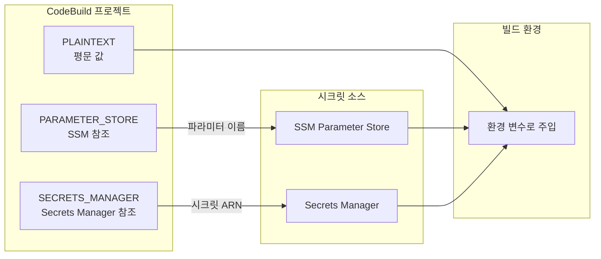
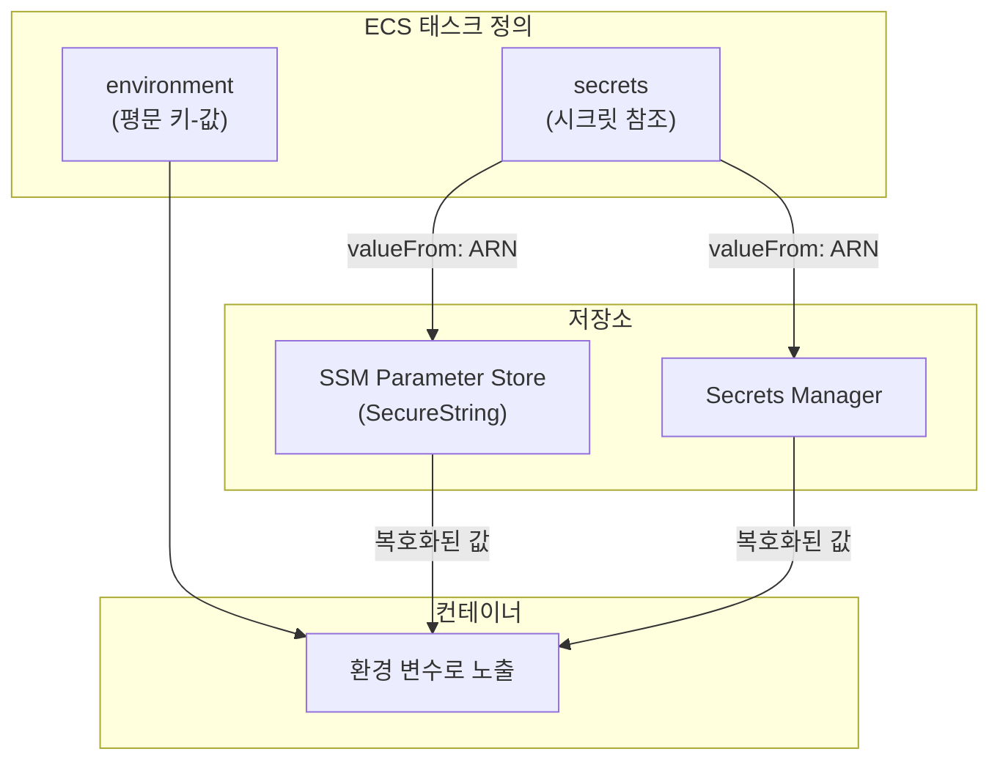
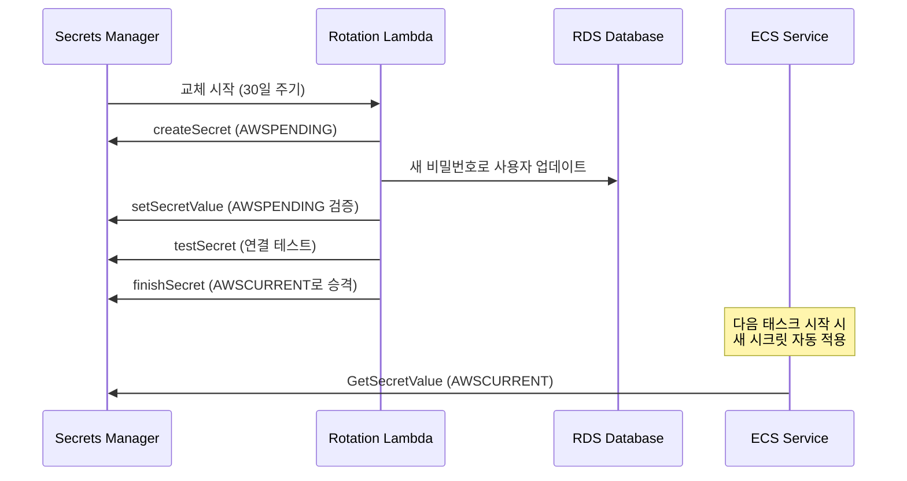

# 시크릿과 환경 변수 관리

AWS CI/CD 파이프라인과 ECS 환경에서 민감한 정보(DB 비밀번호, API 키, 토큰 등)를 안전하게 관리하고 주입하는 전략을 다룬다.

## 목차
- [1. 핵심 개념 (What)](#1-핵심-개념-what)
- [2. 왜 알아야 하는가 (Why)](#2-왜-알아야-하는가-why)
- [3. 내부 구현 분석 (How)](#3-내부-구현-분석-how)
- [4. 실전 예제](#4-실전-예제)
- [5. 정리](#5-정리)

---

## 1. 핵심 개념 (What)

### 시크릿 관리 서비스 비교

AWS는 민감한 설정값을 관리하기 위해 두 가지 핵심 서비스를 제공한다.

| 항목 | SSM Parameter Store | Secrets Manager |
|------|-------------------|-----------------|
| 용도 | 설정값, 시크릿 저장 | 시크릿 전용 관리 |
| 암호화 | SecureString 타입 (KMS) | 기본 암호화 (KMS) |
| 자동 교체 | 미지원 | Lambda 기반 자동 교체 지원 |
| 비용 | Standard 무료 / Advanced 유료 | 시크릿당 $0.40/월 + API 호출 비용 |
| 버전 관리 | 레이블 기반 | 자동 버전 관리 |
| 크로스 계정 | 제한적 | Resource Policy로 지원 |

### 환경 변수 주입 경로

```
┌─────────────────────────────────────────────────────────┐
│                    시크릿 저장소                           │
│  ┌──────────────────┐   ┌─────────────────────────┐     │
│  │ SSM Parameter    │   │ Secrets Manager         │     │
│  │ Store            │   │                         │     │
│  │ - SecureString   │   │ - 자동 교체              │     │
│  │ - String         │   │ - JSON 시크릿            │     │
│  │ - StringList     │   │ - 바이너리 시크릿         │     │
│  └────────┬─────────┘   └───────────┬─────────────┘     │
│           │                         │                    │
└───────────┼─────────────────────────┼────────────────────┘
            │                         │
    ┌───────▼─────────────────────────▼───────┐
    │           소비자 (Consumer)               │
    │                                          │
    │  ┌──────────────┐  ┌──────────────────┐  │
    │  │ CodeBuild    │  │ ECS Task         │  │
    │  │ 환경 변수     │  │ Definition       │  │
    │  │ - PLAINTEXT  │  │ - secrets        │  │
    │  │ - PARAM_STORE│  │ - environment    │  │
    │  │ - SECRETS_MGR│  │                  │  │
    │  └──────────────┘  └──────────────────┘  │
    └──────────────────────────────────────────┘
```

### SSM Parameter Store 타입

- **String**: 일반 텍스트 값 (예: 엔드포인트 URL)
- **StringList**: 쉼표로 구분된 목록 (예: 서브넷 ID 목록)
- **SecureString**: KMS로 암호화된 민감한 값 (예: DB 비밀번호)

### Secrets Manager 시크릿 구조

```json
{
  "username": "admin",
  "password": "my-secure-password",
  "engine": "mysql",
  "host": "mydb.cluster-xxx.ap-northeast-2.rds.amazonaws.com",
  "port": 3306,
  "dbname": "myapp"
}
```

---

## 2. 왜 알아야 하는가 (Why)

### 보안 사고 예방

- **하드코딩된 시크릿**은 Git 히스토리에 남아 영구적인 보안 위협이 된다
- 2023년 GitHub 스캔 결과, 퍼블릭 레포에서 수백만 개의 시크릿이 노출된 사례가 보고됨
- `.env` 파일을 `.gitignore`에 추가하는 것만으로는 부족 — 중앙 집중식 시크릿 관리가 필수

### 운영 효율성

- 환경별(dev/staging/prod) 설정을 코드 변경 없이 관리 가능
- 시크릿 교체(rotation) 시 애플리케이션 재배포 불필요
- 감사 추적(audit trail)으로 누가 언제 어떤 시크릿에 접근했는지 확인

### 컴플라이언스 요구사항

- SOC 2, PCI DSS, HIPAA 등 규정 준수를 위해 암호화된 시크릿 관리 필수
- KMS 키 정책으로 접근 제어와 감사 로그 확보

---

## 3. 내부 구현 분석 (How)

### 3.1 SSM Parameter Store 계층 구조

Parameter Store는 경로 기반 계층 구조를 지원하여 환경별 설정 분리가 가능하다.

```
/myapp/
├── dev/
│   ├── db/host          → dev-db.example.com
│   ├── db/password      → (SecureString) dev-password
│   └── api/key          → (SecureString) dev-api-key
├── staging/
│   ├── db/host          → staging-db.example.com
│   ├── db/password      → (SecureString) staging-password
│   └── api/key          → (SecureString) staging-api-key
└── prod/
    ├── db/host          → prod-db.example.com
    ├── db/password      → (SecureString) prod-password
    └── api/key          → (SecureString) prod-api-key
```

### 3.2 CodeBuild 환경 변수 타입

CodeBuild는 3가지 환경 변수 타입을 지원한다.



### 3.3 ECS 태스크 정의에서의 시크릿 주입

ECS 태스크 정의는 `secrets`와 `environment` 두 가지 방식으로 값을 컨테이너에 주입한다.



**핵심 차이점:**
- `environment`: 태스크 정의에 평문으로 저장 — 콘솔에서 바로 보임
- `secrets`: 런타임에 ECS Agent가 저장소에서 값을 가져와 환경 변수로 주입 — 태스크 정의에는 ARN만 기록

### 3.4 IAM 권한 모델

시크릿 접근을 위해 필요한 IAM 권한 체계:

```
ECS Task Execution Role
├── ssm:GetParameters          → SSM 파라미터 읽기
├── secretsmanager:GetSecretValue → Secrets Manager 시크릿 읽기
├── kms:Decrypt                → KMS 키로 복호화
└── logs:CreateLogStream       → 로그 기록

CodeBuild Service Role
├── ssm:GetParameters          → 빌드 시 파라미터 참조
├── secretsmanager:GetSecretValue → 빌드 시 시크릿 참조
└── kms:Decrypt                → KMS 키로 복호화
```

---

## 4. 실전 예제

### 4.1 SSM Parameter Store에 파라미터 생성

```bash
# 일반 설정값 저장
aws ssm put-parameter \
  --name "/myapp/prod/db/host" \
  --type "String" \
  --value "prod-db.cluster-xxx.ap-northeast-2.rds.amazonaws.com"

# 시크릿 값 저장 (SecureString)
aws ssm put-parameter \
  --name "/myapp/prod/db/password" \
  --type "SecureString" \
  --value "super-secret-password" \
  --key-id "alias/myapp-key"  # 커스텀 KMS 키 (선택)

# 특정 경로 하위 모든 파라미터 조회
aws ssm get-parameters-by-path \
  --path "/myapp/prod/" \
  --recursive \
  --with-decryption
```

### 4.2 Secrets Manager 시크릿 생성

```bash
# RDS 자격 증명 시크릿 생성
aws secretsmanager create-secret \
  --name "myapp/prod/rds-credentials" \
  --description "Production RDS credentials" \
  --secret-string '{
    "username": "admin",
    "password": "super-secret-password",
    "engine": "mysql",
    "host": "prod-db.cluster-xxx.ap-northeast-2.rds.amazonaws.com",
    "port": 3306,
    "dbname": "myapp"
  }'

# 시크릿 자동 교체 설정
aws secretsmanager rotate-secret \
  --secret-id "myapp/prod/rds-credentials" \
  --rotation-lambda-arn "arn:aws:lambda:ap-northeast-2:123456789012:function:SecretRotation" \
  --rotation-rules '{"AutomaticallyAfterDays": 30}'
```

### 4.3 CodeBuild에서 시크릿 사용 (buildspec.yml)

```yaml
version: 0.2

env:
  variables:
    # PLAINTEXT: 민감하지 않은 값
    APP_ENV: "production"
    AWS_DEFAULT_REGION: "ap-northeast-2"

  parameter-store:
    # PARAMETER_STORE: SSM에서 가져오기
    DB_HOST: "/myapp/prod/db/host"
    DB_PASSWORD: "/myapp/prod/db/password"
    API_KEY: "/myapp/prod/api/key"

  secrets-manager:
    # SECRETS_MANAGER: Secrets Manager에서 가져오기
    # 형식: <env_var>: <secret-id>:<json-key>:<version-stage>:<version-id>
    DB_USER: "myapp/prod/rds-credentials:username"
    DB_PASS: "myapp/prod/rds-credentials:password"
    # 전체 JSON을 가져올 때
    RDS_CREDS: "myapp/prod/rds-credentials"

phases:
  pre_build:
    commands:
      - echo "DB Host = $DB_HOST"
      - echo "Logging in to ECR..."
      - aws ecr get-login-password --region $AWS_DEFAULT_REGION | docker login --username AWS --password-stdin $ECR_REGISTRY

  build:
    commands:
      # 빌드 시 시크릿을 Docker build-arg로 전달하지 않기!
      # 대신 런타임에 ECS가 주입하도록 설계
      - docker build -t $IMAGE_NAME .
      - docker tag $IMAGE_NAME:latest $ECR_REGISTRY/$IMAGE_NAME:$CODEBUILD_RESOLVED_SOURCE_VERSION

  post_build:
    commands:
      - docker push $ECR_REGISTRY/$IMAGE_NAME:$CODEBUILD_RESOLVED_SOURCE_VERSION
```

### 4.4 ECS 태스크 정의에서 시크릿 주입

```json
{
  "family": "myapp-task",
  "taskRoleArn": "arn:aws:iam::123456789012:role/myapp-task-role",
  "executionRoleArn": "arn:aws:iam::123456789012:role/myapp-execution-role",
  "containerDefinitions": [
    {
      "name": "myapp",
      "image": "123456789012.dkr.ecr.ap-northeast-2.amazonaws.com/myapp:latest",
      "essential": true,
      "portMappings": [
        {
          "containerPort": 8080,
          "protocol": "tcp"
        }
      ],
      "environment": [
        {
          "name": "APP_ENV",
          "value": "production"
        },
        {
          "name": "LOG_LEVEL",
          "value": "info"
        }
      ],
      "secrets": [
        {
          "name": "DB_HOST",
          "valueFrom": "arn:aws:ssm:ap-northeast-2:123456789012:parameter/myapp/prod/db/host"
        },
        {
          "name": "DB_PASSWORD",
          "valueFrom": "arn:aws:ssm:ap-northeast-2:123456789012:parameter/myapp/prod/db/password"
        },
        {
          "name": "DB_USERNAME",
          "valueFrom": "arn:aws:secretsmanager:ap-northeast-2:123456789012:secret:myapp/prod/rds-credentials:username::"
        },
        {
          "name": "API_KEY",
          "valueFrom": "arn:aws:secretsmanager:ap-northeast-2:123456789012:secret:myapp/prod/api-key"
        }
      ],
      "logConfiguration": {
        "logDriver": "awslogs",
        "options": {
          "awslogs-group": "/ecs/myapp",
          "awslogs-region": "ap-northeast-2",
          "awslogs-stream-prefix": "ecs"
        }
      }
    }
  ],
  "requiresCompatibilities": ["FARGATE"],
  "networkMode": "awsvpc",
  "cpu": "256",
  "memory": "512"
}
```

### 4.5 Task Execution Role IAM 정책

```json
{
  "Version": "2012-10-17",
  "Statement": [
    {
      "Sid": "SSMParameterAccess",
      "Effect": "Allow",
      "Action": [
        "ssm:GetParameters",
        "ssm:GetParameter"
      ],
      "Resource": "arn:aws:ssm:ap-northeast-2:123456789012:parameter/myapp/prod/*"
    },
    {
      "Sid": "SecretsManagerAccess",
      "Effect": "Allow",
      "Action": [
        "secretsmanager:GetSecretValue"
      ],
      "Resource": "arn:aws:secretsmanager:ap-northeast-2:123456789012:secret:myapp/prod/*"
    },
    {
      "Sid": "KMSDecrypt",
      "Effect": "Allow",
      "Action": [
        "kms:Decrypt"
      ],
      "Resource": "arn:aws:kms:ap-northeast-2:123456789012:key/your-kms-key-id"
    }
  ]
}
```

### 4.6 환경별 설정 분리 전략 (CloudFormation)

```yaml
AWSTemplateFormatVersion: '2010-09-09'
Description: Environment-specific ECS Task Definition

Parameters:
  Environment:
    Type: String
    AllowedValues: [dev, staging, prod]
    Description: Deployment environment

Mappings:
  EnvConfig:
    dev:
      Cpu: '256'
      Memory: '512'
      DesiredCount: 1
      LogLevel: debug
    staging:
      Cpu: '512'
      Memory: '1024'
      DesiredCount: 2
      LogLevel: info
    prod:
      Cpu: '1024'
      Memory: '2048'
      DesiredCount: 3
      LogLevel: warn

Resources:
  TaskDefinition:
    Type: AWS::ECS::TaskDefinition
    Properties:
      Family: !Sub 'myapp-${Environment}'
      Cpu: !FindInMap [EnvConfig, !Ref Environment, Cpu]
      Memory: !FindInMap [EnvConfig, !Ref Environment, Memory]
      ExecutionRoleArn: !GetAtt ExecutionRole.Arn
      TaskRoleArn: !GetAtt TaskRole.Arn
      RequiresCompatibilities: [FARGATE]
      NetworkMode: awsvpc
      ContainerDefinitions:
        - Name: myapp
          Image: !Sub '${AWS::AccountId}.dkr.ecr.${AWS::Region}.amazonaws.com/myapp:latest'
          Essential: true
          PortMappings:
            - ContainerPort: 8080
          Environment:
            - Name: APP_ENV
              Value: !Ref Environment
            - Name: LOG_LEVEL
              Value: !FindInMap [EnvConfig, !Ref Environment, LogLevel]
          Secrets:
            - Name: DB_HOST
              ValueFrom: !Sub 'arn:aws:ssm:${AWS::Region}:${AWS::AccountId}:parameter/myapp/${Environment}/db/host'
            - Name: DB_PASSWORD
              ValueFrom: !Sub 'arn:aws:ssm:${AWS::Region}:${AWS::AccountId}:parameter/myapp/${Environment}/db/password'
            - Name: API_KEY
              ValueFrom: !Sub 'arn:aws:secretsmanager:${AWS::Region}:${AWS::AccountId}:secret:myapp/${Environment}/api-key'

  ExecutionRole:
    Type: AWS::IAM::Role
    Properties:
      AssumeRolePolicyDocument:
        Version: '2012-10-17'
        Statement:
          - Effect: Allow
            Principal:
              Service: ecs-tasks.amazonaws.com
            Action: sts:AssumeRole
      ManagedPolicyArns:
        - arn:aws:iam::aws:policy/service-role/AmazonECSTaskExecutionRolePolicy
      Policies:
        - PolicyName: SecretsAccess
          PolicyDocument:
            Version: '2012-10-17'
            Statement:
              - Effect: Allow
                Action:
                  - ssm:GetParameters
                Resource: !Sub 'arn:aws:ssm:${AWS::Region}:${AWS::AccountId}:parameter/myapp/${Environment}/*'
              - Effect: Allow
                Action:
                  - secretsmanager:GetSecretValue
                Resource: !Sub 'arn:aws:secretsmanager:${AWS::Region}:${AWS::AccountId}:secret:myapp/${Environment}/*'
              - Effect: Allow
                Action:
                  - kms:Decrypt
                Resource: '*'
                Condition:
                  StringEquals:
                    'kms:RequestAlias': !Sub 'alias/myapp-${Environment}-key'

  TaskRole:
    Type: AWS::IAM::Role
    Properties:
      AssumeRolePolicyDocument:
        Version: '2012-10-17'
        Statement:
          - Effect: Allow
            Principal:
              Service: ecs-tasks.amazonaws.com
            Action: sts:AssumeRole
```

### 4.7 시크릿 교체 시 무중단 배포 패턴



---

## 5. 정리

| 구분 | SSM Parameter Store | Secrets Manager |
|------|-------------------|-----------------|
| **적합한 용도** | 설정값, 비밀번호, 소량 시크릿 | DB 자격증명, API 키, 자동 교체 필요 시 |
| **비용** | Standard 무료 | 시크릿당 $0.40/월 |
| **자동 교체** | 직접 구현 필요 | Lambda 기반 내장 지원 |
| **CodeBuild** | `parameter-store` 섹션 | `secrets-manager` 섹션 |
| **ECS 태스크** | `secrets.valueFrom` (SSM ARN) | `secrets.valueFrom` (SM ARN) |

### 핵심 원칙

1. **시크릿은 절대 코드에 하드코딩하지 않는다** — SSM 또는 Secrets Manager 사용
2. **최소 권한 원칙** — 환경별, 서비스별로 IAM 권한을 세분화
3. **environment vs secrets 구분** — 민감한 값은 반드시 `secrets`로 주입
4. **계층 구조 활용** — `/app/env/category/key` 패턴으로 파라미터 정리
5. **자동 교체 설정** — 프로덕션 DB 자격증명은 Secrets Manager 자동 교체 활용

---
*참고: AWS 서비스 최신 버전 기준*
